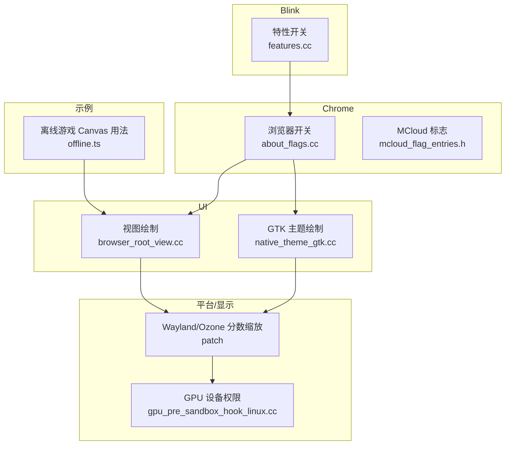
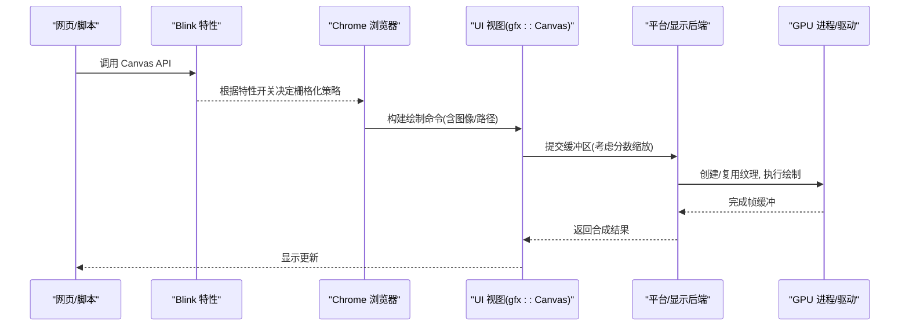
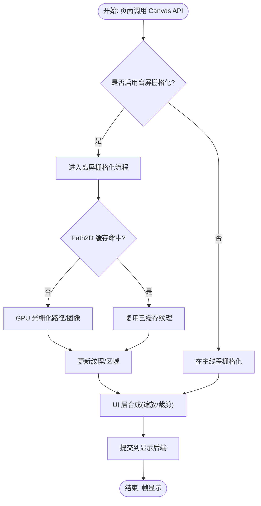
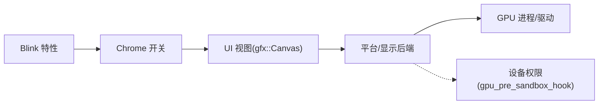

# Canvas GPU 加速

本文引用的文件

- [features.cc](https://github.com/Mcloud136/Mcloud-Browser/blob/main/src/third_party/blink/common/features.cc)
- [about_flags.cc](https://github.com/Mcloud136/Mcloud-Browser/blob/main/src/chrome/browser/about_flags.cc)
- [mcloud_flag_entries.h](https://github.com/Mcloud136/Mcloud-Browser/blob/main/src/chrome/browser/mcloud_flag_entries.h)
- [browser_root_view.cc](https://github.com/Mcloud136/Mcloud-Browser/blob/main/src/chrome/browser/ui/views/frame/browser_root_view.cc)
- [native_theme_gtk.cc](https://github.com/Mcloud136/Mcloud-Browser/blob/main/src/ui/gtk/native_theme_gtk.cc)
- [gpu_pre_sandbox_hook_linux.cc](https://github.com/Mcloud136/Mcloud-Browser/blob/main/src/content/common/gpu_pre_sandbox_hook_linux.cc)
- [Revert-Reland-Linux-Ozone-Wayland-Support-fractional-scale.patch](https://github.com/Mcloud136/Mcloud-Browser/blob/main/infra/Flatpak/com.mcloud.browser/patches/chromium/Revert-Reland-Linux-Ozone-Wayland-Support-fractional-scale.patch)
- [offline.ts](https://github.com/Mcloud136/Mcloud-Browser/blob/main/src/components/neterror/resources/dino_game/offline.ts)
- [2026-06-19-performance-optimization-design.md](https://github.com/Mcloud136/Mcloud-Browser/blob/main/docs/superpowers/specs/2026-06-19-performance-optimization-design.md)

## 目录
1. [简介](#简介)
2. [项目结构](#项目结构)
3. [核心组件](#核心组件)
4. [架构总览](#架构总览)
5. [详细组件分析](#详细组件分析)
6. [依赖关系分析](#依赖关系分析)
7. [性能考量](#性能考量)
8. [故障排查指南](#故障排查指南)
9. [结论](#结论)
10. [附录](#附录)

## 简介
本文件聚焦 MCloud Browser 中 Canvas 的 GPU 加速能力，围绕离屏栅格化（Canvas OOP Rasterization）、GPU 纹理生成与复用、批量绘制与状态缓存、高刷新率显示器支持与帧率控制机制，以及 Canvas 性能分析与调试工具进行系统化说明。文档同时给出在 Chromium/Blink 基础上的可配置项与开关，帮助开发者在不同平台与设备上获得稳定且高效的 Canvas 渲染体验。

## 项目结构
与 Canvas GPU 加速相关的代码分布在以下层次：
- Blink 特性开关：定义 Canvas 相关特性（如 Canvas 休眠、Path2D PaintCache 等），为后续离屏栅格化提供能力门控。
- Chrome 浏览器层：暴露用户可调开关（如 GPU 栅格化、FPS 计数器）和平台相关标志（Linux 原生 GPU 内存缓冲、VAAPI GL 后端）。
- UI 视图层：使用 gfx::Canvas 进行界面绘制，涉及图像缩放、裁剪与合成。
- 平台与显示后端：Wayland/Ozone 分数缩放补丁影响缓冲区提交与合成；Linux GPU 设备节点权限管理确保 GPU 访问安全。
- 示例应用：内嵌离线小游戏展示了 Canvas 尺寸适配与 requestAnimationFrame 的使用模式。

图表来源
- [features.cc:363-373](https://github.com/Mcloud136/Mcloud-Browser/blob/main/src/third_party/blink/common/features.cc#L363-L373)
- [about_flags.cc:5568-5568](https://github.com/Mcloud136/Mcloud-Browser/blob/main/src/chrome/browser/about_flags.cc#L5568-L5568)
- [mcloud_flag_entries.h:170-203](https://github.com/Mcloud136/Mcloud-Browser/blob/main/src/chrome/browser/mcloud_flag_entries.h#L170-L203)
- [browser_root_view.cc:441-466](https://github.com/Mcloud136/Mcloud-Browser/blob/main/src/chrome/browser/ui/views/frame/browser_root_view.cc#L441-L466)
- [native_theme_gtk.cc:40-80](https://github.com/Mcloud136/Mcloud-Browser/blob/main/src/ui/gtk/native_theme_gtk.cc#L40-L80)
- [Revert-Reland-Linux-Ozone-Wayland-Support-fractional-scale.patch:618-634](https://github.com/Mcloud136/Mcloud-Browser/blob/main/infra/Flatpak/com.mcloud.browser/patches/chromium/Revert-Reland-Linux-Ozone-Wayland-Support-fractional-scale.patch#L618-L634)
- [gpu_pre_sandbox_hook_linux.cc:204-235](https://github.com/Mcloud136/Mcloud-Browser/blob/main/src/content/common/gpu_pre_sandbox_hook_linux.cc#L204-L235)
- [offline.ts:1715-1749](https://github.com/Mcloud136/Mcloud-Browser/blob/main/src/components/neterror/resources/dino_game/offline.ts#L1715-L1749)

章节来源
- [features.cc:363-373](https://github.com/Mcloud136/Mcloud-Browser/blob/main/src/third_party/blink/common/features.cc#L363-L373)
- [about_flags.cc:5568-5568](https://github.com/Mcloud136/Mcloud-Browser/blob/main/src/chrome/browser/about_flags.cc#L5568-L5568)
- [mcloud_flag_entries.h:170-203](https://github.com/Mcloud136/Mcloud-Browser/blob/main/src/chrome/browser/mcloud_flag_entries.h#L170-L203)
- [browser_root_view.cc:441-466](https://github.com/Mcloud136/Mcloud-Browser/blob/main/src/chrome/browser/ui/views/frame/browser_root_view.cc#L441-L466)
- [native_theme_gtk.cc:40-80](https://github.com/Mcloud136/Mcloud-Browser/blob/main/src/ui/gtk/native_theme_gtk.cc#L40-L80)
- [Revert-Reland-Linux-Ozone-Wayland-Support-fractional-scale.patch:618-634](https://github.com/Mcloud136/Mcloud-Browser/blob/main/infra/Flatpak/com.mcloud.browser/patches/chromium/Revert-Reland-Linux-Ozone-Wayland-Support-fractional-scale.patch#L618-L634)
- [gpu_pre_sandbox_hook_linux.cc:204-235](https://github.com/Mcloud136/Mcloud-Browser/blob/main/src/content/common/gpu_pre_sandbox_hook_linux.cc#L204-L235)
- [offline.ts:1715-1749](https://github.com/Mcloud136/Mcloud-Browser/blob/main/src/components/neterror/resources/dino_game/offline.ts#L1715-L1749)

## 核心组件
- 特性开关（Blink）
  - Canvas 2D 休眠：用于在后台或不可见时降低资源占用，减少不必要的 GPU/CPU 工作。
  - Path2D PaintCache：配合离屏栅格化，对 Path2D 对象进行绘制缓存，避免重复计算。
- 浏览器开关（Chrome）
  - GPU 栅格化开关：启用 GPU 侧栅格化以提升复杂绘制的吞吐。
  - FPS 计数器：便于运行时观察帧率与 GPU 内存使用情况。
  - Linux 平台标志：原生 GPU 内存缓冲、VAAPI GL 视频解码后端等，间接影响 Canvas 纹理路径。
- UI 视图层
  - gfx::Canvas 绘制：处理图像缩放、裁剪、合成，是上层 UI 与底层 GPU 纹理之间的桥梁。
  - GTK 主题绘制：通过 Skia/Cairo 将主题元素转换为位图并绘制到 Canvas。
- 平台与显示后端
  - Wayland/Ozone 分数缩放：修正缓冲区缩放与提交逻辑，保障高分辨率/分数缩放下的正确显示。
  - GPU 设备权限：沙箱前预授权 /dev/dri/render* 等设备节点，确保 GPU 进程能访问硬件。
- 示例应用
  - 离线游戏：展示 Canvas 尺寸适配、devicePixelRatio 处理与 requestAnimationFrame 的使用。

章节来源
- [features.cc:363-373](https://github.com/Mcloud136/Mcloud-Browser/blob/main/src/third_party/blink/common/features.cc#L363-L373)
- [features.cc:1864-1873](https://github.com/Mcloud136/Mcloud-Browser/blob/main/src/third_party/blink/common/features.cc#L1864-L1873)
- [about_flags.cc:5568-5568](https://github.com/Mcloud136/Mcloud-Browser/blob/main/src/chrome/browser/about_flags.cc#L5568-L5568)
- [mcloud_flag_entries.h:170-203](https://github.com/Mcloud136/Mcloud-Browser/blob/main/src/chrome/browser/mcloud_flag_entries.h#L170-L203)
- [browser_root_view.cc:441-466](https://github.com/Mcloud136/Mcloud-Browser/blob/main/src/chrome/browser/ui/views/frame/browser_root_view.cc#L441-L466)
- [native_theme_gtk.cc:40-80](https://github.com/Mcloud136/Mcloud-Browser/blob/main/src/ui/gtk/native_theme_gtk.cc#L40-L80)
- [Revert-Reland-Linux-Ozone-Wayland-Support-fractional-scale.patch:618-634](https://github.com/Mcloud136/Mcloud-Browser/blob/main/infra/Flatpak/com.mcloud.browser/patches/chromium/Revert-Reland-Linux-Ozone-Wayland-Support-fractional-scale.patch#L618-L634)
- [gpu_pre_sandbox_hook_linux.cc:204-235](https://github.com/Mcloud136/Mcloud-Browser/blob/main/src/content/common/gpu_pre_sandbox_hook_linux.cc#L204-L235)
- [offline.ts:1715-1749](https://github.com/Mcloud136/Mcloud-Browser/blob/main/src/components/neterror/resources/dino_game/offline.ts#L1715-L1749)

## 架构总览
下图展示了从页面到最终显示的完整链路，包括 Canvas 绘制、GPU 栅格化、纹理合成与显示后端。

图表来源
- [features.cc:363-373](https://github.com/Mcloud136/Mcloud-Browser/blob/main/src/third_party/blink/common/features.cc#L363-L373)
- [browser_root_view.cc:441-466](https://github.com/Mcloud136/Mcloud-Browser/blob/main/src/chrome/browser/ui/views/frame/browser_root_view.cc#L441-L466)
- [Revert-Reland-Linux-Ozone-Wayland-Support-fractional-scale.patch:618-634](https://github.com/Mcloud136/Mcloud-Browser/blob/main/infra/Flatpak/com.mcloud.browser/patches/chromium/Revert-Reland-Linux-Ozone-Wayland-Support-fractional-scale.patch#L618-L634)
- [gpu_pre_sandbox_hook_linux.cc:204-235](https://github.com/Mcloud136/Mcloud-Browser/blob/main/src/content/common/gpu_pre_sandbox_hook_linux.cc#L204-L235)

## 详细组件分析

### CanvasOopRasterization（离屏栅格化）
- 原理要点
  - 通过 Blink 特性开关控制是否启用离屏栅格化，将复杂的 Canvas 绘制任务从主线程移出，减轻主线程压力。
  - 结合 Path2D PaintCache，对路径绘制结果进行缓存，避免重复光栅化。
  - 在 UI 层，gfx::Canvas 负责将绘制指令转化为可被 GPU 处理的纹理与区域，支持图像缩放与裁剪。
- 关键实现点
  - 特性开关：kCanvas2DHibernation、kPath2DPaintCache。
  - UI 绘制：browser_root_view.cc 中对 canvas image_scale 的处理与裁剪矩形计算，确保高分屏下像素对齐。
  - 平台后端：Wayland/Ozone 分数缩放补丁修正了缓冲区缩放与提交，保证高分辨率场景的正确性。

图表来源
- [features.cc:363-373](https://github.com/Mcloud136/Mcloud-Browser/blob/main/src/third_party/blink/common/features.cc#L363-L373)
- [features.cc:1864-1873](https://github.com/Mcloud136/Mcloud-Browser/blob/main/src/third_party/blink/common/features.cc#L1864-L1873)
- [browser_root_view.cc:441-466](https://github.com/Mcloud136/Mcloud-Browser/blob/main/src/chrome/browser/ui/views/frame/browser_root_view.cc#L441-L466)
- [Revert-Reland-Linux-Ozone-Wayland-Support-fractional-scale.patch:618-634](https://github.com/Mcloud136/Mcloud-Browser/blob/main/infra/Flatpak/com.mcloud.browser/patches/chromium/Revert-Reland-Linux-Ozone-Wayland-Support-fractional-scale.patch#L618-L634)

章节来源
- [features.cc:363-373](https://github.com/Mcloud136/Mcloud-Browser/blob/main/src/third_party/blink/common/features.cc#L363-L373)
- [features.cc:1864-1873](https://github.com/Mcloud136/Mcloud-Browser/blob/main/src/third_party/blink/common/features.cc#L1864-L1873)
- [browser_root_view.cc:441-466](https://github.com/Mcloud136/Mcloud-Browser/blob/main/src/chrome/browser/ui/views/frame/browser_root_view.cc#L441-L466)
- [Revert-Reland-Linux-Ozone-Wayland-Support-fractional-scale.patch:618-634](https://github.com/Mcloud136/Mcloud-Browser/blob/main/infra/Flatpak/com.mcloud.browser/patches/chromium/Revert-Reland-Linux-Ozone-Wayland-Support-fractional-scale.patch#L618-L634)

### GPU 纹理生成与复用
- 纹理生命周期
  - 首次绘制：GPU 进程分配纹理资源，写入像素数据。
  - 复用阶段：若内容未变化或可缓存（如 Path2D 缓存命中），直接复用已有纹理，减少带宽与显存压力。
- 平台集成
  - Linux 原生 GPU 内存缓冲：通过 mcloud_flag_entries.h 中的标志启用，有助于减少 CPU-GPU 拷贝。
  - VAAPI GL 后端：在 Linux 上可选择 GL 后端进行视频解码加速，间接提升包含媒体内容的 Canvas 表现。
- 设备权限
  - gpu_pre_sandbox_hook_linux.cc 预授权 render 节点，确保 GPU 进程能访问硬件设备。

章节来源
- [mcloud_flag_entries.h:170-203](https://github.com/Mcloud136/Mcloud-Browser/blob/main/src/chrome/browser/mcloud_flag_entries.h#L170-L203)
- [gpu_pre_sandbox_hook_linux.cc:204-235](https://github.com/Mcloud136/Mcloud-Browser/blob/main/src/content/common/gpu_pre_sandbox_hook_linux.cc#L204-L235)

### 批量绘制与状态缓存
- 批量绘制
  - 通过 gfx::Canvas 的绘制命令合并与裁剪优化，减少状态切换与无效绘制区域。
  - browser_root_view.cc 中对 active tab 的裁剪矩形计算，避免无关区域的绘制开销。
- 状态缓存
  - Path2D PaintCache：对路径绘制结果进行缓存，避免重复光栅化。
  - 主题绘制缓存：native_theme_gtk.cc 中将 GTK 主题元素转换为位图后复用，减少重复绘制。

章节来源
- [browser_root_view.cc:441-466](https://github.com/Mcloud136/Mcloud-Browser/blob/main/src/chrome/browser/ui/views/frame/browser_root_view.cc#L441-L466)
- [features.cc:1864-1873](https://github.com/Mcloud136/Mcloud-Browser/blob/main/src/third_party/blink/common/features.cc#L1864-L1873)
- [native_theme_gtk.cc:40-80](https://github.com/Mcloud136/Mcloud-Browser/blob/main/src/ui/gtk/native_theme_gtk.cc#L40-L80)

### 高刷新率显示器支持与帧率控制
- 高分屏与分数缩放
  - Wayland/Ozone 补丁修正了缓冲区缩放与提交逻辑，确保在高 DPI/分数缩放场景下像素对齐与显示正确。
- 帧率控制
  - 示例应用 offline.ts 中使用 requestAnimationFrame 包装更新循环，自然跟随显示器刷新率。
  - 通过浏览器开关 show-fps-counter 可在运行时查看帧率与 GPU 内存使用情况，辅助调优。

章节来源
- [Revert-Reland-Linux-Ozone-Wayland-Support-fractional-scale.patch:618-634](https://github.com/Mcloud136/Mcloud-Browser/blob/main/infra/Flatpak/com.mcloud.browser/patches/chromium/Revert-Reland-Linux-Ozone-Wayland-Support-fractional-scale.patch#L618-L634)
- [offline.ts:1715-1749](https://github.com/Mcloud136/Mcloud-Browser/blob/main/src/components/neterror/resources/dino_game/offline.ts#L1715-L1749)
- [mcloud_flag_entries.h:240-243](https://github.com/Mcloud136/Mcloud-Browser/blob/main/src/chrome/browser/mcloud_flag_entries.h#L240-L243)

### Canvas 性能分析与调试工具
- 运行时指标
  - FPS 计数器：通过浏览器开关开启，实时显示帧率与 GPU 内存使用，便于定位卡顿与内存峰值。
- 绘制调用分析
  - 借助 gfx::Canvas 的绘制命令与裁剪区域，结合 UI 层日志（如需）统计绘制次数与区域大小。
- 内存监控
  - 关注 Path2D 缓存命中率与纹理复用情况，避免频繁创建/销毁纹理导致显存抖动。
- 平台问题定位
  - Linux 下检查 render 节点权限与 VAAPI/GL 后端配置，确保 GPU 资源可用。

章节来源
- [mcloud_flag_entries.h:240-243](https://github.com/Mcloud136/Mcloud-Browser/blob/main/src/chrome/browser/mcloud_flag_entries.h#L240-L243)
- [gpu_pre_sandbox_hook_linux.cc:204-235](https://github.com/Mcloud136/Mcloud-Browser/blob/main/src/content/common/gpu_pre_sandbox_hook_linux.cc#L204-L235)

## 依赖关系分析
- 特性开关依赖
  - Canvas 休眠与 Path2D 缓存均位于 Blink 特性层，受 Chrome 开关与平台能力共同影响。
- 平台后端依赖
  - Wayland/Ozone 分数缩放补丁直接影响缓冲区提交与合成，进而影响 Canvas 的高分屏显示质量。
- 设备权限依赖
  - Linux 下需要预授权 render 节点，否则 GPU 进程无法访问硬件，导致 Canvas 回退到软件渲染。

图表来源
- [features.cc:363-373](https://github.com/Mcloud136/Mcloud-Browser/blob/main/src/third_party/blink/common/features.cc#L363-L373)
- [about_flags.cc:5568-5568](https://github.com/Mcloud136/Mcloud-Browser/blob/main/src/chrome/browser/about_flags.cc#L5568-L5568)
- [gpu_pre_sandbox_hook_linux.cc:204-235](https://github.com/Mcloud136/Mcloud-Browser/blob/main/src/content/common/gpu_pre_sandbox_hook_linux.cc#L204-L235)

章节来源
- [features.cc:363-373](https://github.com/Mcloud136/Mcloud-Browser/blob/main/src/third_party/blink/common/features.cc#L363-L373)
- [about_flags.cc:5568-5568](https://github.com/Mcloud136/Mcloud-Browser/blob/main/src/chrome/browser/about_flags.cc#L5568-L5568)
- [gpu_pre_sandbox_hook_linux.cc:204-235](https://github.com/Mcloud136/Mcloud-Browser/blob/main/src/content/common/gpu_pre_sandbox_hook_linux.cc#L204-L235)

## 性能考量
- 冷启动与多标签页内存
  - 预期收益参考：冷启动速度提升 10-20%，多标签页内存占用降低 15-30%。
- GPU 渲染效率
  - 预期提升 5-10%，主要来自 GPU 栅格化、纹理复用与批量绘制优化。
- IO 响应性
  - 预期提升 10-15%，得益于更少的 CPU 阻塞与更高效的显示管线。

章节来源
- [2026-06-19-performance-optimization-design.md:179-188](https://github.com/Mcloud136/Mcloud-Browser/blob/main/docs/superpowers/specs/2026-06-19-performance-optimization-design.md#L179-L188)

## 故障排查指南
- 绿屏/花屏问题
  - 使用内置诊断脚本进行二分定位，区分 DComp/MPO overlay、D3D12 解码器与硬件 overlay 平面问题。
- 高分屏显示异常
  - 检查 Wayland/Ozone 分数缩放补丁是否正确应用，确认缓冲区缩放与提交逻辑。
- GPU 访问失败
  - 确认 Linux 下 render 节点权限已预授权，必要时调整沙箱策略。
- 帧率波动
  - 开启 FPS 计数器观察帧率与 GPU 内存使用，结合 Path2D 缓存命中率分析瓶颈。

章节来源
- [diag_igpu_green_screen.ps1:1-23](https://github.com/Mcloud136/Mcloud-Browser/blob/main/benchmark/tools/diag_igpu_green_screen.ps1#L1-L23)
- [Revert-Reland-Linux-Ozone-Wayland-Support-fractional-scale.patch:618-634](https://github.com/Mcloud136/Mcloud-Browser/blob/main/infra/Flatpak/com.mcloud.browser/patches/chromium/Revert-Reland-Linux-Ozone-Wayland-Support-fractional-scale.patch#L618-L634)
- [gpu_pre_sandbox_hook_linux.cc:204-235](https://github.com/Mcloud136/Mcloud-Browser/blob/main/src/content/common/gpu_pre_sandbox_hook_linux.cc#L204-L235)
- [mcloud_flag_entries.h:240-243](https://github.com/Mcloud136/Mcloud-Browser/blob/main/src/chrome/browser/mcloud_flag_entries.h#L240-L243)

## 结论
MCloud Browser 在 Canvas GPU 加速方面，依托 Blink 特性开关、Chrome 浏览器层开关与平台后端优化，实现了离屏栅格化、纹理复用与批量绘制等关键技术。通过 Wayland/Ozone 分数缩放补丁与 GPU 设备权限管理，确保了高分屏与复杂场景下的稳定显示。结合 FPS 计数器与诊断工具，开发者可有效定位性能瓶颈并进行针对性优化。建议在生产环境中合理启用 GPU 栅格化与 Path2D 缓存，并根据平台能力选择最佳的视频解码后端，以获得流畅的用户体验。

## 附录
- 常用开关与特性
  - enable-gpu-rasterization：启用 GPU 栅格化。
  - show-fps-counter：显示帧率与 GPU 内存使用。
  - kCanvas2DHibernation：Canvas 2D 休眠特性。
  - kPath2DPaintCache：Path2D 绘制缓存。
  - enable-native-gpu-memory-buffers：Linux 原生 GPU 内存缓冲。
  - vaapi-video-decode-linux-gl：Linux VAAPI GL 视频解码后端。

章节来源
- [about_flags.cc:5568-5568](https://github.com/Mcloud136/Mcloud-Browser/blob/main/src/chrome/browser/about_flags.cc#L5568-L5568)
- [mcloud_flag_entries.h:170-203](https://github.com/Mcloud136/Mcloud-Browser/blob/main/src/chrome/browser/mcloud_flag_entries.h#L170-L203)
- [features.cc:363-373](https://github.com/Mcloud136/Mcloud-Browser/blob/main/src/third_party/blink/common/features.cc#L363-L373)
- [features.cc:1864-1873](https://github.com/Mcloud136/Mcloud-Browser/blob/main/src/third_party/blink/common/features.cc#L1864-L1873)