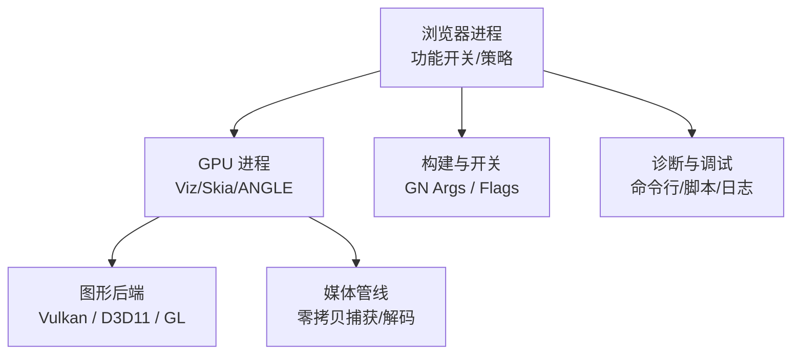
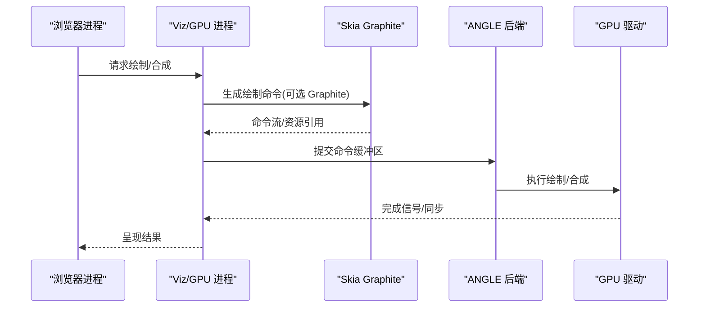
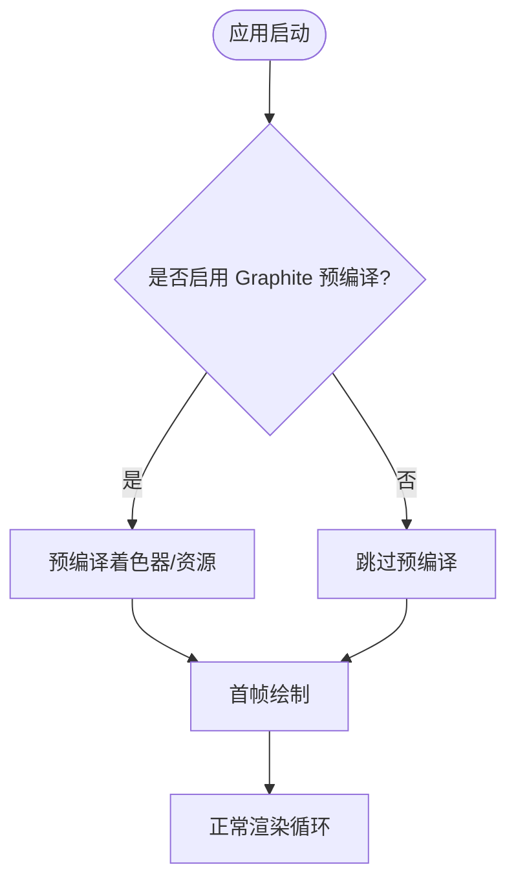
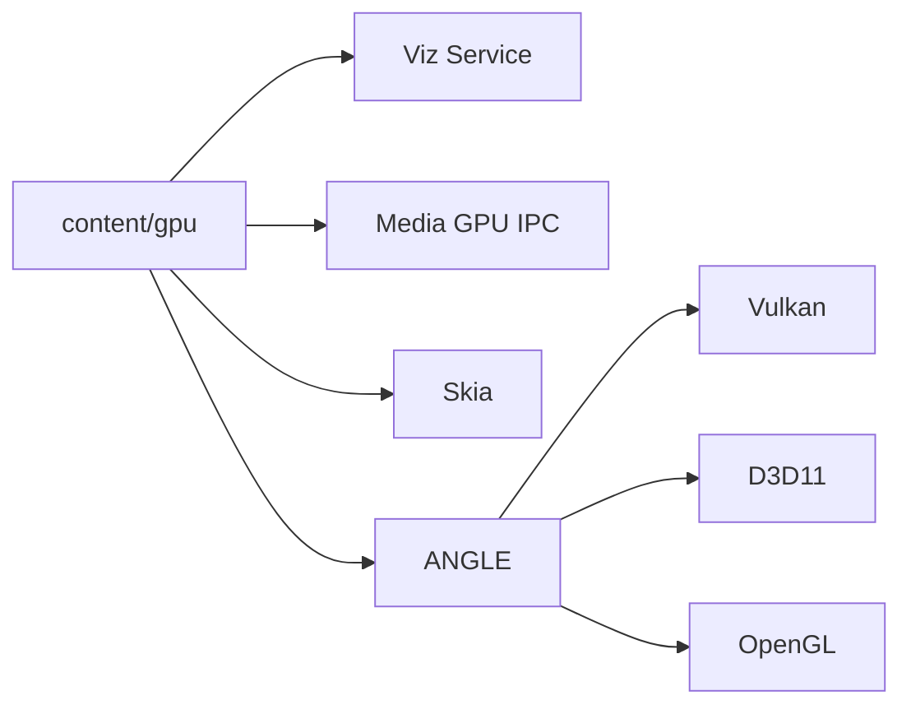

# GPU 渲染

<cite>
**本文引用的文件**
- [about_flags.cc](file://src/chrome/browser/about_flags.cc)
- [media_switches.cc](file://src/media/base/media_switches.cc)
- [BUILD.gn](file://src/content/gpu/BUILD.gn)
- [DEBUGGING.md](file://infra/DEBUG/DEBUGGING.md)
- [CMDLINE_FLAGS_LIST.md](file://docs/CMDLINE_FLAGS_LIST.md)
- [gn_args.list](file://infra/gn_args.list)
- [win_gn_args.list](file://infra/win_gn_args.list)
- [mac_args.list](file://other/Mac/mac_args.list)
- [diag_igpu_green_screen.ps1](file://benchmark/tools/diag_igpu_green_screen.ps1)
</cite>

## 目录
1. [简介](#简介)
2. [项目结构](#项目结构)
3. [核心组件](#核心组件)
4. [架构总览](#架构总览)
5. [详细组件分析](#详细组件分析)
6. [依赖关系分析](#依赖关系分析)
7. [性能考量](#性能考量)
8. [故障排查指南](#故障排查指南)
9. [结论](#结论)
10. [附录](#附录)

## 简介
本文件面向 MCloud Browser 的 GPU 渲染子系统，聚焦以下主题：GPU 光栅化、零拷贝渲染、Canvas GPU 加速、Skia Graphite 与预编译机制（消除着色器编译卡顿）、GPU 命令缓冲区优化与资源池管理、高刷新率显示器支持与帧率控制、GPU 性能监控与调试方法，以及不同 GPU 厂商的兼容性问题与解决方案。文档基于仓库中的开关、构建配置与诊断工具进行说明，帮助读者理解并调优 MCloud 的 GPU 渲染路径。

## 项目结构
MCloud 的 GPU 渲染相关能力由浏览器进程、GPU 进程、Viz/Skia/ANGLE 等组件协同完成。关键入口与配置点包括：
- 功能开关：通过 about_flags 暴露 Skia Graphite、GPU 光栅化、WebGPU 等特性开关。
- 媒体零拷贝：通过 media switches 启用零拷贝视频捕获/编码路径。
- GPU 进程构建：content/gpu 模块聚合 Viz、Media GPU IPC、Skia、ANGLE 等依赖。
- 平台后端：ANGLE 提供 Vulkan/D3D/GL 等多后端，并通过 gn args 精细控制。
- 诊断与调试：命令行参数、脚本与调试文档提供 GPU 问题定位手段。

图表来源
- [BUILD.gn:43-87](file://src/content/gpu/BUILD.gn#L43-L87)
- [gn_args.list:219-281](file://infra/gn_args.list#L219-L281)
- [win_gn_args.list:206-239](file://infra/win_gn_args.list#L206-L239)
- [mac_args.list:206-248](file://other/Mac/mac_args.list#L206-L248)

章节来源
- [BUILD.gn:43-87](file://src/content/gpu/BUILD.gn#L43-L87)
- [gn_args.list:219-281](file://infra/gn_args.list#L219-L281)
- [win_gn_args.list:206-239](file://infra/win_gn_args.list#L206-L239)
- [mac_args.list:206-248](file://other/Mac/mac_args.list#L206-L248)

## 核心组件
- Skia Graphite 与预编译
  - 通过 about_flags 暴露“skia-graphite”和“skia-graphite-precompilation”两个开关，用于启用 Graphite 渲染后端及预编译以缓解首次绘制时的着色器编译卡顿。
- GPU 光栅化
  - 通过 about_flags 暴露“enable-gpu-rasterization”，将页面栅格化任务下沉到 GPU 执行，减少 CPU-GPU 数据往返。
- 零拷贝渲染
  - 媒体侧提供“zero-copy-video-capture”、“zero-copy-video-encoding”等开关，结合 MediaFoundation/D3D11 等路径实现零拷贝采集与编码，降低内存带宽与延迟。
- Canvas GPU 加速
  - 在启用 GPU 光栅化与合适的后端时，Canvas 绘制可走 GPU 路径；配合 Skia Graphite 可获得更高效的命令生成与提交。
- 命令缓冲区与资源池
  - ANGLE 提供自定义 Vulkan 命令缓冲与渲染通道缓冲选项，有助于减少 CPU 侧开销、提升批处理效率。
- 高刷新率与帧率控制
  - 通过图形后端同步机制（如 EGL 同步）与 compositor 合成路径，支持高刷新率显示；可通过命令行参数调节程序缓存大小、MSAA 采样数等影响帧率与稳定性。

章节来源
- [about_flags.cc:5568-5568](file://src/chrome/browser/about_flags.cc#L5568-L5568)
- [about_flags.cc:9962-9971](file://src/chrome/browser/about_flags.cc#L9962-L9971)
- [media_switches.cc:1133-1133](file://src/media/base/media_switches.cc#L1133-L1133)
- [media_switches.cc:1314-1314](file://src/media/base/media_switches.cc#L1314-L1314)
- [media_switches.cc:1708-1708](file://src/media/base/media_switches.cc#L1708-L1708)
- [gn_args.list:219-281](file://infra/gn_args.list#L219-L281)
- [win_gn_args.list:206-239](file://infra/win_gn_args.list#L206-L239)
- [mac_args.list:206-248](file://other/Mac/mac_args.list#L206-L248)

## 架构总览
下图展示了从浏览器进程到 GPU 进程的渲染路径，包含 Skia Graphite、零拷贝媒体、ANGLE 后端与命令缓冲区的关键交互。

图表来源
- [BUILD.gn:43-87](file://src/content/gpu/BUILD.gn#L43-L87)
- [gn_args.list:219-281](file://infra/gn_args.list#L219-L281)
- [win_gn_args.list:206-239](file://infra/win_gn_args.list#L206-L239)

## 详细组件分析

### Skia Graphite 与预编译机制
- 作用
  - Graphite 是 Skia 的新式后端，提供更高效的命令生成与提交；预编译可在启动或首帧前完成着色器编译，避免首次绘制的卡顿。
- 启用方式
  - 通过 about_flags 的“skia-graphite”与“skia-graphite-precompilation”开关启用。
- 预期收益
  - 首帧延迟降低、滚动/动画更平滑、CPU 占用下降。
- 注意事项
  - 需确保驱动/后端对 Graphite 的支持良好；若出现兼容性问题，可回退至传统路径。

图表来源
- [about_flags.cc:9962-9971](file://src/chrome/browser/about_flags.cc#L9962-L9971)

章节来源
- [about_flags.cc:9962-9971](file://src/chrome/browser/about_flags.cc#L9962-L9971)

### GPU 光栅化与 Canvas GPU 加速
- 作用
  - 将页面栅格化任务迁移到 GPU，减少 CPU-GPU 拷贝；Canvas 在合适条件下走 GPU 路径，获得更高绘制吞吐。
- 启用方式
  - 通过 about_flags 的“enable-gpu-rasterization”开关启用。
- 优化建议
  - 合理设置 MSAA 采样数与程序缓存大小，平衡画质与性能；在高刷新率显示器上关注帧时间抖动。

章节来源
- [about_flags.cc:5568-5568](file://src/chrome/browser/about_flags.cc#L5568-L5568)
- [CMDLINE_FLAGS_LIST.md:1626-1628](file://docs/CMDLINE_FLAGS_LIST.md#L1626-L1628)

### 零拷贝渲染（视频采集/编码）
- 作用
  - 在 Android/Windows 等平台，利用系统提供的零拷贝路径（如 MediaFoundation + D3D11），避免 CPU 与 GPU 之间的额外拷贝，降低延迟与功耗。
- 启用方式
  - 通过 media switches 的 zero-copy 相关开关启用；Android 端有特定条件判断。
- 适用场景
  - 直播、视频会议、录屏等对延迟敏感的场景。

章节来源
- [media_switches.cc:1133-1133](file://src/media/base/media_switches.cc#L1133-L1133)
- [media_switches.cc:1314-1314](file://src/media/base/media_switches.cc#L1314-L1314)
- [media_switches.cc:1708-1708](file://src/media/base/media_switches.cc#L1708-L1708)

### 命令缓冲区优化与资源池管理
- 作用
  - 通过 ANGLE 的自定义 Vulkan 命令缓冲与渲染通道缓冲，减少 CPU 侧开销，提高批量提交效率；合理的资源复用可降低分配/释放成本。
- 关键开关
  - angle_enable_custom_vulkan_cmd_buffers、angle_enable_custom_vulkan_render_pass_cmd_buffers、angle_enable_custom_vulkan_outside_render_pass_cmd_buffers。
- 平台差异
  - Windows/Linux/Mac 均提供相应 gn 选项，可按平台选择最优后端（Vulkan/D3D/GL）。

章节来源
- [gn_args.list:219-281](file://infra/gn_args.list#L219-L281)
- [win_gn_args.list:206-239](file://infra/win_gn_args.list#L206-L239)
- [mac_args.list:206-248](file://other/Mac/mac_args.list#L206-L248)

### 高刷新率显示器支持与帧率控制
- 作用
  - 借助图形后端的同步机制（如 EGL 同步）与合成路径，适配高刷新率显示器，减少撕裂与卡顿。
- 相关参数
  - --gpu-program-cache-size-kb：调整 GPU 程序缓存大小，影响热路径命中与启动性能。
  - --gpu-rasterization-msaa-sample-count：控制 MSAA 采样数，影响画质与性能。
- 实践建议
  - 在高刷环境下优先使用 Vulkan/D3D11 后端，并开启必要的同步；根据设备能力调整 MSAA 与缓存大小。

章节来源
- [CMDLINE_FLAGS_LIST.md:1626-1628](file://docs/CMDLINE_FLAGS_LIST.md#L1626-L1628)
- [gn_args.list:219-281](file://infra/gn_args.list#L219-L281)

## 依赖关系分析
- content/gpu 模块依赖 Viz、Media GPU IPC、Skia、ANGLE、ui/gl 等，形成浏览器到 GPU 的完整链路。
- ANGLE 的多后端（Vulkan/D3D/GL）通过 gn 选项灵活启用，适配不同平台与驱动。
- 媒体零拷贝路径依赖系统 API（如 MediaFoundation/D3D11），在不同平台有不同行为。

图表来源
- [BUILD.gn:43-87](file://src/content/gpu/BUILD.gn#L43-L87)
- [gn_args.list:219-281](file://infra/gn_args.list#L219-L281)

章节来源
- [BUILD.gn:43-87](file://src/content/gpu/BUILD.gn#L43-L87)
- [gn_args.list:219-281](file://infra/gn_args.list#L219-L281)

## 性能考量
- 首帧与卡顿
  - 启用 Skia Graphite 预编译可显著降低首帧延迟；合理设置 GPU 程序缓存大小可减少重复编译。
- 内存与带宽
  - 零拷贝路径减少内存拷贝，适合高带宽需求场景；注意驱动兼容性，必要时回退。
- 高刷与同步
  - 在高刷新率显示器上，确保后端同步正确，避免撕裂；适当调整 MSAA 与渲染分辨率。
- 资源管理
  - 使用 ANGLE 自定义命令缓冲与资源池，减少 CPU 开销；监控 GPU 内存使用，避免泄漏。

[本节为通用指导，不直接分析具体文件]

## 故障排查指南
- 诊断脚本
  - 使用 benchmark/tools/diag_igpu_green_screen.ps1 检查本机 GPU 环境、硬件调度模式，并启动测试用例观察绿屏/花屏等问题；同时查看 chrome://media-internals 与 chrome://gpu 信息。
- 调试工具
  - 参考 infra/DEBUG/DEBUGGING.md 使用 rr 进行多进程录制回放，定位渲染/合成问题；结合 GDB 与日志进行源码级调试。
- 命令行参数
  - 使用 docs/CMDLINE_FLAGS_LIST.md 中的 GPU 相关参数（如 --gpu-program-cache-size-kb、--gpu-rasterization-msaa-sample-count）调整性能与稳定性。

章节来源
- [diag_igpu_green_screen.ps1:56-95](file://benchmark/tools/diag_igpu_green_screen.ps1#L56-L95)
- [DEBUGGING.md:281-354](file://infra/DEBUG/DEBUGGING.md#L281-L354)
- [CMDLINE_FLAGS_LIST.md:1616-1646](file://docs/CMDLINE_FLAGS_LIST.md#L1616-L1646)

## 结论
MCloud Browser 的 GPU 渲染体系通过 Skia Graphite、零拷贝媒体、ANGLE 多后端与丰富的构建/运行开关，提供了高效且可定制的渲染路径。针对首帧卡顿、高刷显示、内存带宽与兼容性等关键问题，可通过预编译、零拷贝、命令缓冲优化与参数调优获得显著改善。结合诊断脚本与调试文档，可有效定位与解决 GPU 相关问题。

[本节为总结性内容，不直接分析具体文件]

## 附录
- 常用开关速查
  - Skia Graphite：skia-graphite、skia-graphite-precompilation
  - GPU 光栅化：enable-gpu-rasterization
  - 零拷贝媒体：zero-copy-video-capture、zero-copy-video-encoding
  - ANGLE 命令缓冲：angle_enable_custom_vulkan_cmd_buffers、angle_enable_custom_vulkan_render_pass_cmd_buffers
  - 命令行参数：--gpu-program-cache-size-kb、--gpu-rasterization-msaa-sample-count

[本节为补充信息，不直接分析具体文件]