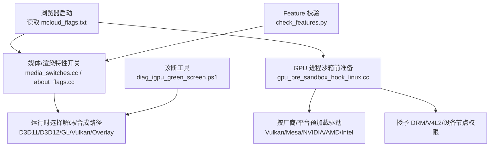
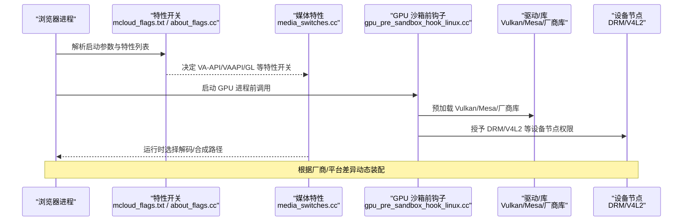
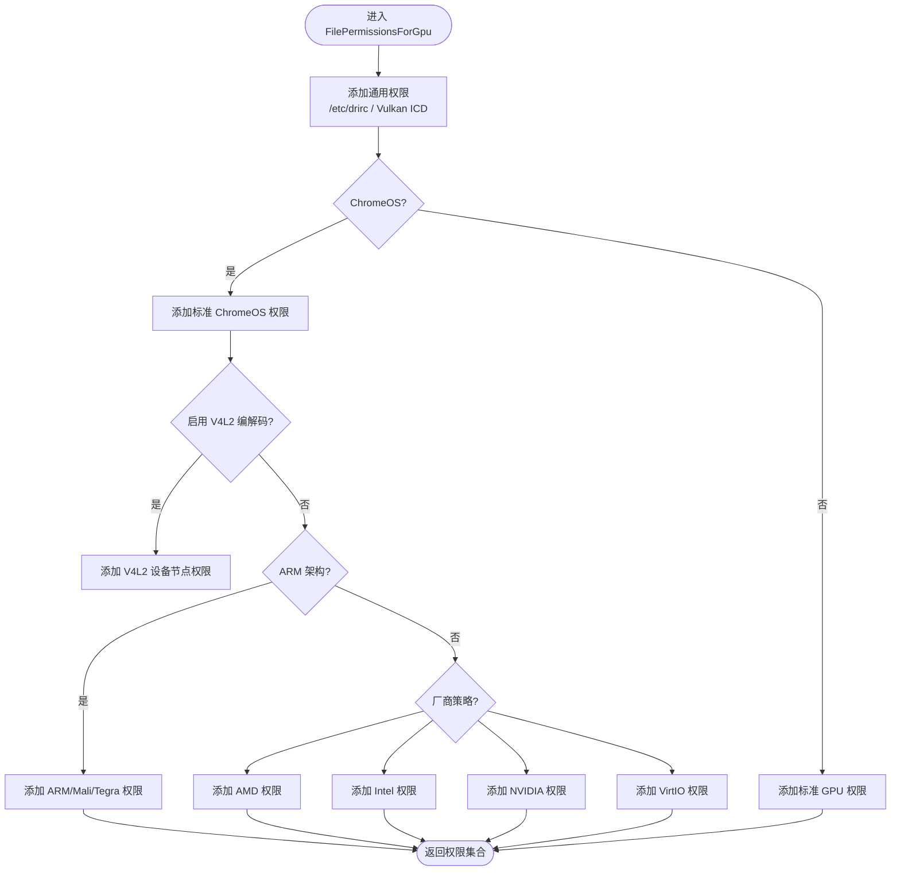
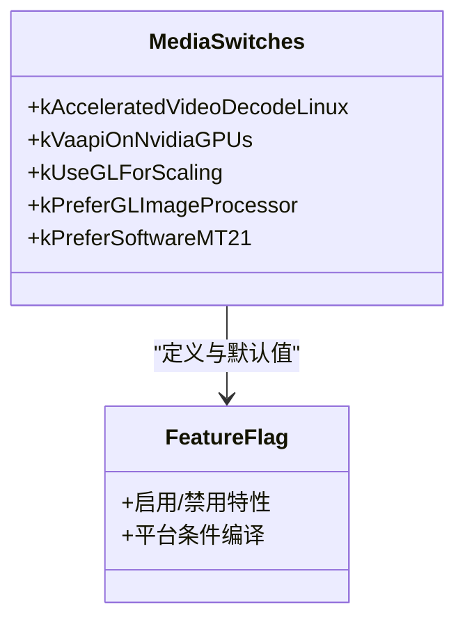
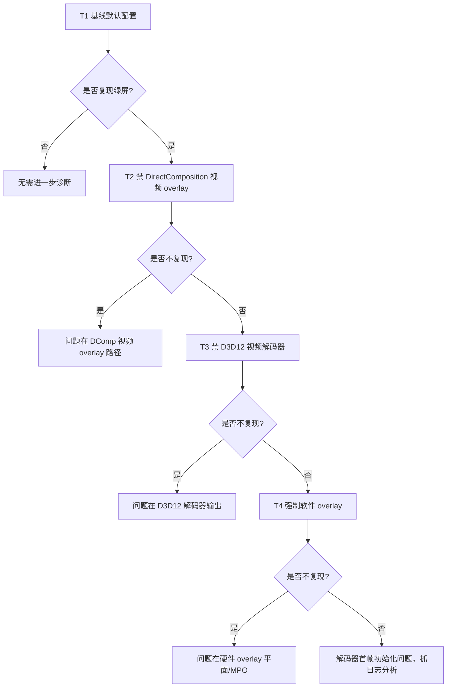
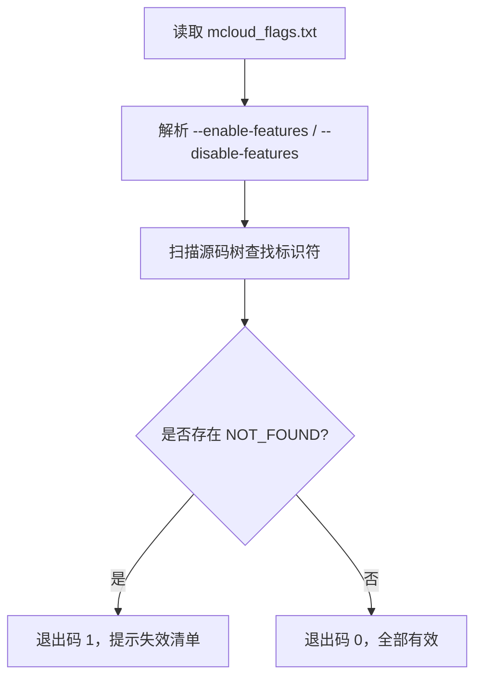
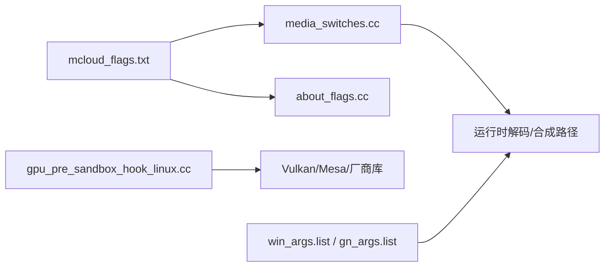

# GPU 兼容性处理

<cite>
**本文引用的文件**
- [mcloud_flags.txt](file://mcloud_flags.txt)
- [gpu_pre_sandbox_hook_linux.cc](file://src/content/common/gpu_pre_sandbox_hook_linux.cc)
- [media_switches.cc](file://src/media/base/media_switches.cc)
- [diag_igpu_green_screen.ps1](file://benchmark/tools/diag_igpu_green_screen.ps1)
- [check_features.py](file://benchmark/tools/check_features.py)
- [about_flags.cc](file://src/chrome/browser/about_flags.cc)
- [win_args.list](file://infra/win_args.list)
- [gn_args.list](file://infra/gn_args.list)
</cite>

## 目录
1. [简介](#简介)
2. [项目结构](#项目结构)
3. [核心组件](#核心组件)
4. [架构总览](#架构总览)
5. [详细组件分析](#详细组件分析)
6. [依赖关系分析](#依赖关系分析)
7. [性能考量](#性能考量)
8. [故障排查指南](#故障排查指南)
9. [结论](#结论)
10. [附录](#附录)

## 简介
本文件聚焦于本项目在 GPU 兼容性方面的整体方案与落地实践，覆盖对 NVIDIA、Intel、AMD 等厂商的差异化处理、GPU 能力检测与降级策略、常见驱动问题的检测与绕过方法，以及配套的测试与诊断工具。目标是帮助开发者在不同硬件环境下稳定启用硬件加速，并在出现兼容性问题时快速定位与修复。

## 项目结构
围绕 GPU 兼容性，仓库中涉及的关键位置包括：
- 启动期特性开关与已知问题规避：通过命令行标志集中管理（如禁用有缺陷的视频解码路径）。
- Linux 沙箱前 GPU 初始化与权限装配：按厂商/平台预加载驱动库并授予设备节点访问权限。
- 媒体子系统特性开关：针对 VA-API、VAAPI on NVIDIA、Linux 加速解码等特性进行默认值与开关控制。
- 诊断与验证工具：提供 Windows 核显绿屏二分定位脚本与 feature 清单校验脚本。

**图示来源**
- [mcloud_flags.txt:83-88](file://mcloud_flags.txt#L83-L88)
- [media_switches.cc:742-776](file://src/media/base/media_switches.cc#L742-L776)
- [gpu_pre_sandbox_hook_linux.cc:628-702](file://src/content/common/gpu_pre_sandbox_hook_linux.cc#L628-L702)
- [diag_igpu_green_screen.ps1:40-56](file://benchmark/tools/diag_igpu_green_screen.ps1#L40-L56)
- [check_features.py:1-21](file://benchmark/tools/check_features.py#L1-L21)

**章节来源**
- [mcloud_flags.txt:83-88](file://mcloud_flags.txt#L83-L88)
- [media_switches.cc:742-776](file://src/media/base/media_switches.cc#L742-L776)
- [gpu_pre_sandbox_hook_linux.cc:628-702](file://src/content/common/gpu_pre_sandbox_hook_linux.cc#L628-L702)
- [diag_igpu_green_screen.ps1:40-56](file://benchmark/tools/diag_igpu_green_screen.ps1#L40-L56)
- [check_features.py:1-21](file://benchmark/tools/check_features.py#L1-L21)

## 核心组件
- 启动期特性与降级策略
  - 通过 mcloud_flags.txt 统一配置性能与兼容性开关，例如在 Intel 核显特定驱动版本下禁用 D3D12VideoDecoder，回退到更稳定的 D3D11VideoDecoder。
  - 通过 about_flags.cc 暴露可配置的开关（如 Linux 上 VAAPI on NVIDIA），便于用户或自动化流程按需开启/关闭。
- Linux GPU 沙箱前初始化
  - gpu_pre_sandbox_hook_linux.cc 负责在 GPU 进程进入沙箱前，根据系统环境与选项预加载必要的 Vulkan/Mesa/厂商驱动库，并授予 DRM/V4L2/设备节点等最小化权限。
  - 针对不同厂商（Intel、AMD、NVIDIA）及 ARM/Mali/Tegra 等平台，分别添加所需库与设备节点权限。
- 媒体子系统特性开关
  - media_switches.cc 定义并控制 Linux 上的 VA-API/VAAPI、VA-API on NVIDIA、GL 图像缩放等特性默认行为，避免在不支持的驱动上启用导致崩溃或不稳定。
- 诊断与验证工具
  - diag_igpu_green_screen.ps1 提供 Windows 核显视频绿屏/花屏的二分定位流程，通过多组受控启动参数隔离问题层级（DirectComposition overlay、D3D12 解码器、软件 overlay）。
  - check_features.py 校验 mcloud_flags.txt 中的 feature 名称在当前源码树中是否仍然有效，防止上游变更导致的失效。

**章节来源**
- [mcloud_flags.txt:83-88](file://mcloud_flags.txt#L83-L88)
- [about_flags.cc:196-210](file://src/chrome/browser/about_flags.cc#L196-L210)
- [gpu_pre_sandbox_hook_linux.cc:253-350](file://src/content/common/gpu_pre_sandbox_hook_linux.cc#L253-L350)
- [media_switches.cc:742-776](file://src/media/base/media_switches.cc#L742-L776)
- [diag_igpu_green_screen.ps1:40-56](file://benchmark/tools/diag_igpu_green_screen.ps1#L40-L56)
- [check_features.py:1-21](file://benchmark/tools/check_features.py#L1-L21)

## 架构总览
下图展示了从浏览器启动到 GPU 进程初始化的关键路径，以及不同厂商驱动的分支与权限装配过程。

**图示来源**
- [mcloud_flags.txt:83-88](file://mcloud_flags.txt#L83-L88)
- [about_flags.cc:196-210](file://src/chrome/browser/about_flags.cc#L196-L210)
- [media_switches.cc:742-776](file://src/media/base/media_switches.cc#L742-L776)
- [gpu_pre_sandbox_hook_linux.cc:628-702](file://src/content/common/gpu_pre_sandbox_hook_linux.cc#L628-L702)

## 详细组件分析

### 组件一：Linux GPU 沙箱前初始化与厂商适配
该组件负责在 GPU 进程进入沙箱之前完成驱动库预加载与设备节点权限授予，确保后续渲染/解码能顺利访问底层硬件。

**图示来源**
- [gpu_pre_sandbox_hook_linux.cc:628-702](file://src/content/common/gpu_pre_sandbox_hook_linux.cc#L628-L702)
- [gpu_pre_sandbox_hook_linux.cc:253-350](file://src/content/common/gpu_pre_sandbox_hook_linux.cc#L253-L350)

**章节来源**
- [gpu_pre_sandbox_hook_linux.cc:628-702](file://src/content/common/gpu_pre_sandbox_hook_linux.cc#L628-L702)
- [gpu_pre_sandbox_hook_linux.cc:253-350](file://src/content/common/gpu_pre_sandbox_hook_linux.cc#L253-L350)

### 组件二：媒体子系统特性与厂商限制
媒体子系统通过特性开关控制不同平台的硬件加速路径，并对存在已知问题的组合进行默认禁用或限制。

**图示来源**
- [media_switches.cc:742-776](file://src/media/base/media_switches.cc#L742-L776)
- [media_switches.cc:1246-1268](file://src/media/base/media_switches.cc#L1246-L1268)

**章节来源**
- [media_switches.cc:742-776](file://src/media/base/media_switches.cc#L742-L776)
- [media_switches.cc:1246-1268](file://src/media/base/media_switches.cc#L1246-L1268)

### 组件三：Windows 核显绿屏/花屏二分定位工具
该工具通过四组受控启动参数逐步排除问题层级，帮助定位 DirectComposition overlay、D3D12 解码器输出、硬件 overlay 平面（MPO）等问题。

**图示来源**
- [diag_igpu_green_screen.ps1:40-56](file://benchmark/tools/diag_igpu_green_screen.ps1#L40-L56)

**章节来源**
- [diag_igpu_green_screen.ps1:40-56](file://benchmark/tools/diag_igpu_green_screen.ps1#L40-L56)

### 组件四：Feature 清单有效性校验
用于在升级上游 Chromium 源码后，自动校验 mcloud_flags.txt 中的 feature 名称是否仍然存在，避免构建或运行期因 feature 缺失导致的问题。

**图示来源**
- [check_features.py:1-21](file://benchmark/tools/check_features.py#L1-L21)

**章节来源**
- [check_features.py:1-21](file://benchmark/tools/check_features.py#L1-L21)

## 依赖关系分析
- 启动期特性与媒体特性的耦合
  - mcloud_flags.txt 中的特性会影响媒体子系统与渲染路径的选择；例如禁用 D3D12VideoDecoder 将促使解码回退到 D3D11。
- Linux GPU 初始化与厂商驱动的耦合
  - gpu_pre_sandbox_hook_linux.cc 根据平台与选项预加载对应驱动库并授予设备节点权限，直接影响后续渲染/解码能否正常工作。
- 构建期 GN 参数对渲染后端的影响
  - win_args.list 与 gn_args.list 中包含 ANGLE/DirectX/Vulkan/SwiftShader 等后端相关开关，影响图形栈能力与兼容性。

**图示来源**
- [mcloud_flags.txt:83-88](file://mcloud_flags.txt#L83-L88)
- [media_switches.cc:742-776](file://src/media/base/media_switches.cc#L742-L776)
- [about_flags.cc:196-210](file://src/chrome/browser/about_flags.cc#L196-L210)
- [gpu_pre_sandbox_hook_linux.cc:628-702](file://src/content/common/gpu_pre_sandbox_hook_linux.cc#L628-L702)
- [win_args.list:211-241](file://infra/win_args.list#L211-L241)
- [gn_args.list:2756-2797](file://infra/gn_args.list#L2756-L2797)

**章节来源**
- [mcloud_flags.txt:83-88](file://mcloud_flags.txt#L83-L88)
- [media_switches.cc:742-776](file://src/media/base/media_switches.cc#L742-L776)
- [about_flags.cc:196-210](file://src/chrome/browser/about_flags.cc#L196-L210)
- [gpu_pre_sandbox_hook_linux.cc:628-702](file://src/content/common/gpu_pre_sandbox_hook_linux.cc#L628-L702)
- [win_args.list:211-241](file://infra/win_args.list#L211-L241)
- [gn_args.list:2756-2797](file://infra/gn_args.list#L2756-L2797)

## 性能考量
- 冷启动与渲染效率
  - 通过启用 GPU 光栅化、Skia Graphite 预编译、命令缓冲解析切片优化等特性，提升渲染效率与响应性。
- 视频播放流畅度
  - 合理选择解码路径（D3D11 vs D3D12）、减少硬件解码缓冲区占用、使用专用媒体服务线程，有助于降低卡顿。
- 内存与资源复用
  - 启用资源池精确大小复用、旧预绘制瓦片回收等特性，在多标签页场景下显著降低内存占用。

[本节为通用性能讨论，不直接分析具体文件]

## 故障排查指南
- 常见问题与绕过方法
  - Intel 核显 D3D12 视频解码器绿屏/花屏：在启动参数中禁用 D3D12VideoDecoder，回退到 D3D11VideoDecoder。
  - Linux 上 NVIDIA VA-API 不稳定：默认禁用 VA-API on NVIDIA，必要时通过 about_flags 手动开启并评估风险。
  - 上下文丢失导致黑屏/粉屏：可通过“gpu-no-context-lost”开关缓解系统休眠/省电模式下的上下文丢失问题。
- 诊断步骤
  - 使用 diag_igpu_green_screen.ps1 执行 T1-T4 分组测试，结合 chrome://media-internals 与 chrome://gpu 观察解码器与应用的工作区。
  - 使用 check_features.py 校验 mcloud_flags.txt 中的 feature 名称是否仍存在于当前源码树，避免上游变更导致失效。
- 建议的验证流程
  - 先在 T1 基线复现问题，再依次尝试 T2/T3/T4 以缩小问题范围。
  - 记录 GPU 型号、驱动版本、HwSchMode 等信息，便于回归与对比。

**章节来源**
- [mcloud_flags.txt:83-88](file://mcloud_flags.txt#L83-L88)
- [about_flags.cc:196-210](file://src/chrome/browser/about_flags.cc#L196-L210)
- [diag_igpu_green_screen.ps1:40-56](file://benchmark/tools/diag_igpu_green_screen.ps1#L40-L56)
- [check_features.py:1-21](file://benchmark/tools/check_features.py#L1-L21)

## 结论
本项目通过启动期特性开关、Linux GPU 沙箱前初始化与厂商适配、媒体子系统特性控制以及配套的诊断工具，形成了较为完整的 GPU 兼容性处理体系。针对 NVIDIA、Intel、AMD 等不同厂商的驱动差异，采用默认安全策略与可配置开关相结合的方式，既保证稳定性又保留灵活性。配合二分定位与 feature 校验工具，可有效缩短问题定位时间并降低回归风险。

[本节为总结，不直接分析具体文件]

## 附录
- 常用启动参数参考
  - 禁用 D3D12VideoDecoder：用于 Intel 核显特定驱动版本的绿屏/花屏问题。
  - 启用 GPU 光栅化与 Skia Graphite：提升渲染性能。
  - 启用 PlatformHEVCDecoderSupport、HardwareSecureDecryptionAv1：增强媒体硬解能力。
- 构建期开关参考
  - ANGLE/DirectX/Vulkan/SwiftShader 相关开关位于 win_args.list 与 gn_args.list，可根据目标平台与驱动能力调整。

[本节为补充信息，不直接分析具体文件]