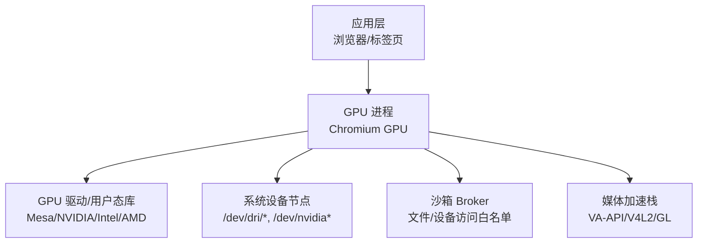
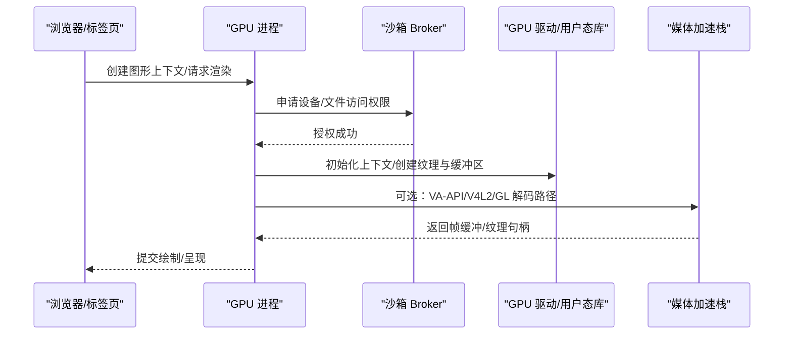
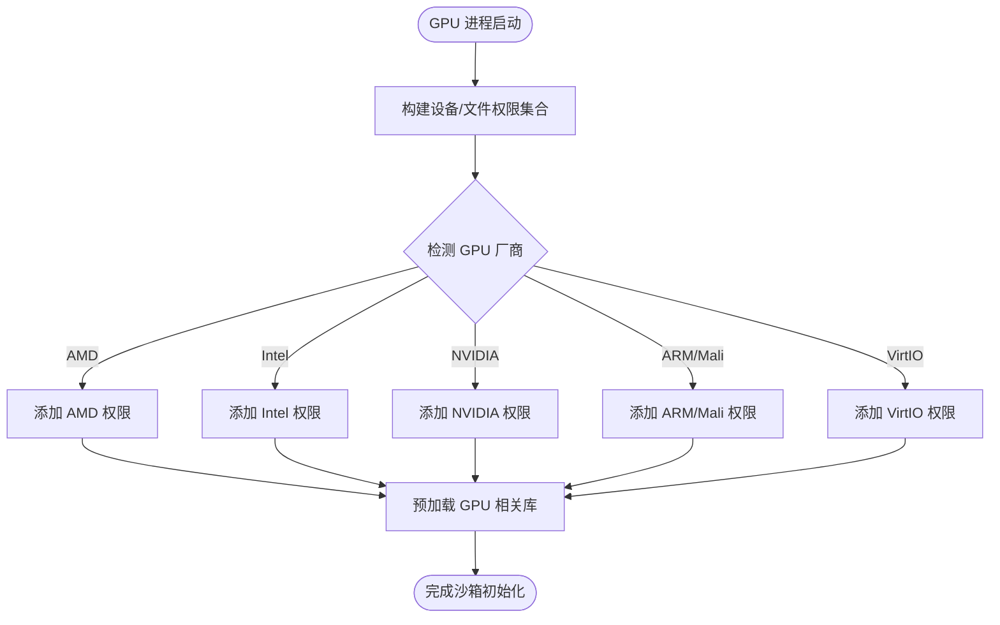
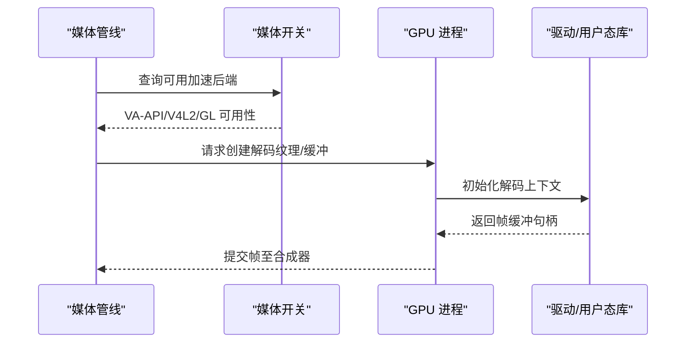
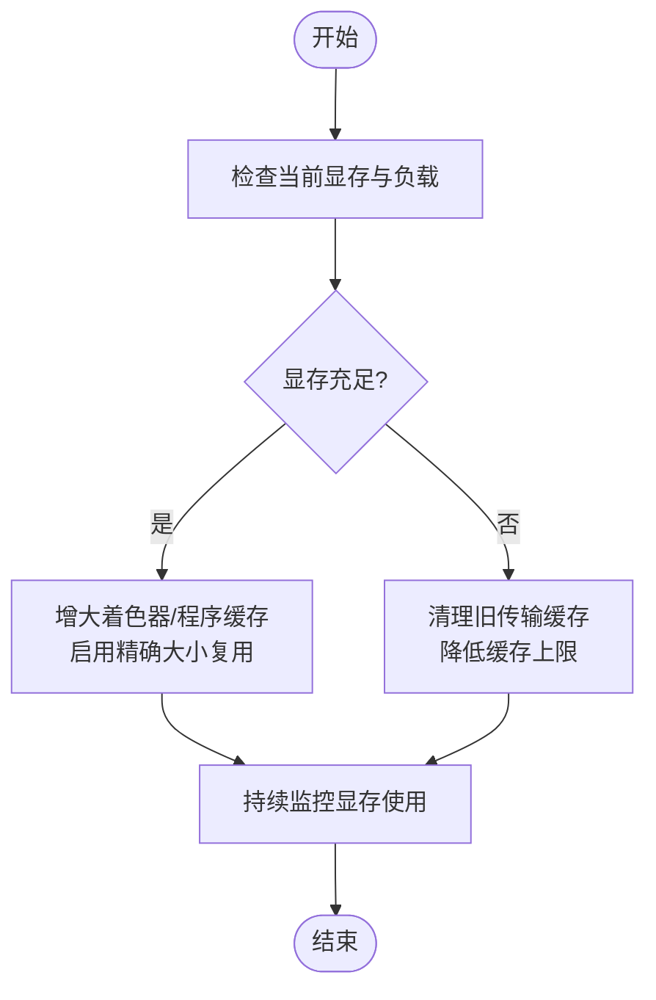
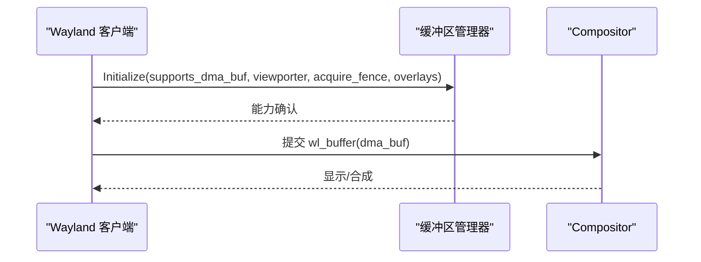
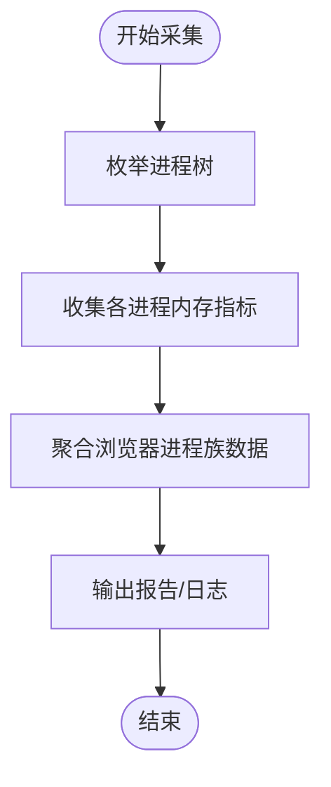

# GPU 内存管理

<cite>
**本文引用的文件**
- [src/content/common/gpu_pre_sandbox_hook_linux.cc](file://src/content/common/gpu_pre_sandbox_hook_linux.cc)
- [src/chrome/browser/memory_details_linux.cc](file://src/chrome/browser/memory_details_linux.cc)
- [mcloud_flags.txt](file://mcloud_flags.txt)
- [infra/CMDLINE_FLAGS_LIST.md](file://infra/CMDLINE_FLAGS_LIST.md)
- [src/media/base/media_switches.cc](file://src/media/base/media_switches.cc)
- [docs/superpowers/specs/2026-06-19-performance-optimization-design.md](file://docs/superpowers/specs/2026-06-19-performance-optimization-design.md)
- [docs/superpowers/specs/2026-06-20-release-notes-m150.md](file://docs/superpowers/specs/2026-06-20-release-notes-m150.md)
- [README.md](file://README.md)
- [infra/Flatpak/.../Revert-Reland-Linux-Ozone-Wayland-Support-fractional-scale.patch](file://infra/Flatpak/com.mcloud.browser/patches/chromium/Revert-Reland-Linux-Ozone-Wayland-Support-fractional-scale.patch)
</cite>

## 目录
1. [简介](#简介)
2. [项目结构](#项目结构)
3. [核心组件](#核心组件)
4. [架构总览](#架构总览)
5. [详细组件分析](#详细组件分析)
6. [依赖关系分析](#依赖关系分析)
7. [性能考量](#性能考量)
8. [故障排查指南](#故障排查指南)
9. [结论](#结论)
10. [附录](#附录)

## 简介
本文件围绕 Thorium（基于 Chromium）在 Linux 平台上的 GPU 内存管理与优化展开，聚焦以下目标：
- GPU 资源池管理机制：纹理、缓冲区、着色器等资源的分配、复用与回收策略。
- 显存优化技术：内存对齐、分页管理与虚拟地址空间利用。
- 不同 GPU 厂商的显存特性差异与适配方案。
- GPU 内存使用监控与分析工具，帮助识别内存泄漏与性能瓶颈。
- 内存压力下的降级策略与资源清理机制。

说明：本项目未直接实现底层 GPU 驱动或显存管理器，而是通过 Chromium 的 GPU 进程、沙箱权限、媒体加速开关与运行期标志位来组织 GPU 资源生命周期与优化策略。

## 项目结构
与 GPU 内存管理密切相关的代码与配置集中在如下位置：
- GPU 沙箱与设备访问权限控制：Linux 预沙箱钩子负责为 GPU 进程开放必要的设备节点与库文件访问权限，确保 GPU 驱动与用户态库可被安全加载。
- 媒体与硬件加速开关：媒体子系统提供 VA-API/V4L2、GL 后端等开关，影响 GPU 解码路径与显存占用。
- 运行期标志与优化：通过命令行参数与启用特性，控制程序缓存大小、命令缓冲区解析切片、着色器缓存限制、资源池复用策略等。
- 内存监控与诊断：收集浏览器进程及其子进程的内存信息，辅助定位内存问题。

图表来源
- [src/content/common/gpu_pre_sandbox_hook_linux.cc:628-702](file://src/content/common/gpu_pre_sandbox_hook_linux.cc#L628-L702)
- [src/media/base/media_switches.cc:742-777](file://src/media/base/media_switches.cc#L742-L777)

章节来源
- [src/content/common/gpu_pre_sandbox_hook_linux.cc:628-702](file://src/content/common/gpu_pre_sandbox_hook_linux.cc#L628-L702)
- [src/media/base/media_switches.cc:742-777](file://src/media/base/media_switches.cc#L742-L777)

## 核心组件
- GPU 沙箱与设备权限管理
  - 通过预沙箱钩子在 GPU 进程启动前建立 Broker 进程并注入文件/设备访问权限，包括 DRI、NVIDIA、Vulkan ICD、ARM Mali、V4L2 编解码设备等。
  - 该机制间接决定 GPU 能否正确初始化上下文、创建纹理/缓冲区以及进行零拷贝传输。
- 媒体加速与 GPU 路径选择
  - 通过媒体开关控制是否启用 VA-API/V4L2、GL 后端、NVidia 上 VA-API 的行为等，影响 GPU 解码路径与显存占用模式。
- 运行期优化与资源池策略
  - 通过命令行参数与特性开关控制 GPU 程序缓存大小、命令缓冲区解析切片、着色器缓存限制、资源池精确大小复用等，直接影响显存碎片与命中率。
- 内存监控与诊断
  - 收集浏览器进程及子进程内存信息，结合基准脚本与日志，辅助发现内存泄漏与峰值占用问题。

章节来源
- [src/content/common/gpu_pre_sandbox_hook_linux.cc:628-702](file://src/content/common/gpu_pre_sandbox_hook_linux.cc#L628-L702)
- [src/media/base/media_switches.cc:742-777](file://src/media/base/media_switches.cc#L742-L777)
- [infra/CMDLINE_FLAGS_LIST.md:1616-1646](file://infra/CMDLINE_FLAGS_LIST.md#L1616-L1646)
- [docs/superpowers/specs/2026-06-19-performance-optimization-design.md:100-126](file://docs/superpowers/specs/2026-06-19-performance-optimization-design.md#L100-L126)
- [src/chrome/browser/memory_details_linux.cc:110-146](file://src/chrome/browser/memory_details_linux.cc#L110-L146)

## 架构总览
下图展示从浏览器到 GPU 驱动的调用链路与关键优化点：

图表来源
- [src/content/common/gpu_pre_sandbox_hook_linux.cc:628-702](file://src/content/common/gpu_pre_sandbox_hook_linux.cc#L628-L702)
- [src/media/base/media_switches.cc:742-777](file://src/media/base/media_switches.cc#L742-L777)

## 详细组件分析

### GPU 沙箱与设备权限（Linux）
- 功能要点
  - 启动时构建命令集与文件/设备权限集合，包含 DRI、NVIDIA、Vulkan ICD、ARM Mali、V4L2 编解码设备等。
  - 根据平台与选项动态添加 AMD/Intel/NVIDIA/VirtIO/ARM 等特定权限。
  - 预加载必要库（如 Vulkan、Mesa、NVIDIA XCB 相关库），降低运行时失败概率。
- 对显存的影响
  - 正确的设备权限是 GPU 上下文初始化、纹理/缓冲区分配与零拷贝传输的前提；缺失会导致回退到软件渲染或频繁 CPU-GPU 拷贝，增加显存与带宽压力。
- 典型路径
  - 构建权限集合 -> 启动 Broker -> 预加载库 -> 允许 GPU 进程访问设备节点与共享内存。

图表来源
- [src/content/common/gpu_pre_sandbox_hook_linux.cc:628-702](file://src/content/common/gpu_pre_sandbox_hook_linux.cc#L628-L702)

章节来源
- [src/content/common/gpu_pre_sandbox_hook_linux.cc:628-702](file://src/content/common/gpu_pre_sandbox_hook_linux.cc#L628-L702)

### 媒体加速与 GPU 路径（VA-API/V4L2/GL）
- 功能要点
  - 在 Linux 上可通过特性开关启用 VA-API/V4L2 视频解码与 GL 后端，影响 GPU 解码路径与显存占用。
  - 针对 NVIDIA 的 VA-API 默认禁用以避免崩溃风险；可在特定场景下开启。
- 对显存的影响
  - 硬件解码通常将帧缓冲置于 GPU 显存中，减少 CPU 拷贝；但需关注驱动兼容性与内存峰值。
  - GL 后端可用于图像缩放/转换，避免部分平台的像素格式不兼容导致的额外拷贝。
- 典型路径
  - 媒体管线根据平台与开关选择解码器 -> 创建 GPU 纹理/缓冲区 -> 输出至合成器。

图表来源
- [src/media/base/media_switches.cc:742-777](file://src/media/base/media_switches.cc#L742-L777)

章节来源
- [src/media/base/media_switches.cc:742-777](file://src/media/base/media_switches.cc#L742-L777)

### 运行期优化与资源池策略
- 关键开关与效果
  - --gpu-program-cache-size-kb：设置 GPU 程序缓存最大大小，影响着色器编译结果驻留显存。
  - IncreasedCmdBufferParseSlice：增大命令缓冲区解析切片，减少上下文切换开销。
  - AggressiveShaderCacheLimits：扩大着色器缓存限制，提升命中但增加显存占用。
  - ResourcePoolPreferExactSizeReuse：优先复用精确大小的资源，减少显存碎片。
  - PruneOldTransferCacheEntries：清理旧传输缓存条目，释放显存。
- 适用场景
  - 高并发渲染、大量纹理/缓冲区创建与销毁的场景，应调大缓存与启用精确复用。
  - 低显存设备应谨慎调大缓存，避免 OOM。

图表来源
- [infra/CMDLINE_FLAGS_LIST.md:1616-1646](file://infra/CMDLINE_FLAGS_LIST.md#L1616-L1646)
- [docs/superpowers/specs/2026-06-19-performance-optimization-design.md:100-126](file://docs/superpowers/specs/2026-06-19-performance-optimization-design.md#L100-L126)

章节来源
- [infra/CMDLINE_FLAGS_LIST.md:1616-1646](file://infra/CMDLINE_FLAGS_LIST.md#L1616-L1646)
- [docs/superpowers/specs/2026-06-19-performance-optimization-design.md:100-126](file://docs/superpowers/specs/2026-06-19-performance-optimization-design.md#L100-L126)

### Wayland 缓冲区管理与零拷贝
- 功能要点
  - Wayland 缓冲区管理器初始化涉及 dma_buf、viewporter、acquire fence、overlay 等能力协商，影响 GPU 缓冲区提交方式与零拷贝路径。
- 对显存的影响
  - 启用 dma_buf 与 overlay 可减少 CPU-GPU 拷贝，降低显存带宽压力；但需要驱动与 compositor 支持。
- 典型路径
  - 客户端与服务端协商能力 -> 创建 wl_buffer -> 以 dma_buf 形式提交至 compositor。

图表来源
- [infra/Flatpak/.../Revert-Reland-Linux-Ozone-Wayland-Support-fractional-scale.patch:892-1008](file://infra/Flatpak/com.mcloud.browser/patches/chromium/Revert-Reland-Linux-Ozone-Wayland-Support-fractional-scale.patch#L892-L1008)

章节来源
- [infra/Flatpak/.../Revert-Reland-Linux-Ozone-Wayland-Support-fractional-scale.patch:892-1008](file://infra/Flatpak/com.mcloud.browser/patches/chromium/Revert-Reland-Linux-Ozone-Wayland-Support-fractional-scale.patch#L892-L1008)

### 内存监控与诊断
- 功能要点
  - 收集浏览器进程及其子进程的内存信息（FD 数、进程类型等），用于定位内存问题。
  - 配合基准脚本测量多标签页驻留内存，评估优化效果。
- 实践建议
  - 在多标签页场景下观察峰值与稳定态内存，结合 GPU 缓存与资源池开关调整。
  - 使用日志与指标对比不同配置的显存占用变化。

图表来源
- [src/chrome/browser/memory_details_linux.cc:110-146](file://src/chrome/browser/memory_details_linux.cc#L110-L146)

章节来源
- [src/chrome/browser/memory_details_linux.cc:110-146](file://src/chrome/browser/memory_details_linux.cc#L110-L146)

## 依赖关系分析
- 组件耦合
  - GPU 进程依赖沙箱权限与驱动库；媒体加速依赖开关与驱动能力；运行期优化依赖命令行参数与特性开关。
- 外部依赖
  - Mesa/NVIDIA/Intel/AMD 驱动与用户态库；Vulkan ICD；Wayland compositor。
- 潜在循环依赖
  - 媒体管线与 GPU 进程之间通过句柄传递，无直接循环依赖；沙箱权限为单向依赖。

图表来源
- [src/content/common/gpu_pre_sandbox_hook_linux.cc:628-702](file://src/content/common/gpu_pre_sandbox_hook_linux.cc#L628-L702)
- [src/media/base/media_switches.cc:742-777](file://src/media/base/media_switches.cc#L742-L777)
- [infra/CMDLINE_FLAGS_LIST.md:1616-1646](file://infra/CMDLINE_FLAGS_LIST.md#L1616-L1646)

章节来源
- [src/content/common/gpu_pre_sandbox_hook_linux.cc:628-702](file://src/content/common/gpu_pre_sandbox_hook_linux.cc#L628-L702)
- [src/media/base/media_switches.cc:742-777](file://src/media/base/media_switches.cc#L742-L777)
- [infra/CMDLINE_FLAGS_LIST.md:1616-1646](file://infra/CMDLINE_FLAGS_LIST.md#L1616-L1646)

## 性能考量
- 显存对齐与分页
  - 纹理与缓冲区尺寸应尽量对齐至驱动要求（如块压缩格式块大小、行对齐），减少碎片与无效填充。
  - 合理分页与分块上传可降低瞬时显存峰值，避免 OOM。
- 虚拟地址空间利用
  - 使用零拷贝路径（dma_buf、overlay）减少 CPU-GPU 拷贝，提高带宽利用率。
  - 着色器与程序缓存适度放大以提升命中率，但需监控显存占用。
- 厂商差异与适配
  - NVIDIA：VA-API 默认禁用，必要时开启；注意驱动稳定性。
  - Intel/AMD：Mesa 驱动成熟，DRI/Vulkan 路径较完善。
  - ARM/Mali：需预加载特定库与设备节点，确保保护分配与格式枚举。
- 资源池策略
  - 启用精确大小复用，减少碎片；定期清理旧传输缓存，释放显存。
  - 在高并发场景下，适当增大命令缓冲区解析切片以降低上下文切换开销。

[本节为通用指导，无需具体文件引用]

## 故障排查指南
- 常见问题
  - GPU 上下文丢失或黑屏：检查 --gpu-no-context-lost 与驱动兼容性。
  - 解码失败或卡顿：确认 VA-API/V4L2/GL 开关与驱动支持；必要时回退软件解码。
  - 显存不足：降低缓存大小、启用旧缓存清理、减少纹理尺寸或分辨率。
- 诊断步骤
  - 使用内存监控收集进程族内存信息，结合基准脚本评估多标签页驻留内存。
  - 调整运行期优化开关，对比显存与性能变化。
  - 检查 Wayland 能力协商与 dma_buf/overlay 支持情况。

章节来源
- [infra/CMDLINE_FLAGS_LIST.md:1616-1646](file://infra/CMDLINE_FLAGS_LIST.md#L1616-L1646)
- [src/chrome/browser/memory_details_linux.cc:110-146](file://src/chrome/browser/memory_details_linux.cc#L110-L146)
- [infra/Flatpak/.../Revert-Reland-Linux-Ozone-Wayland-Support-fractional-scale.patch:892-1008](file://infra/Flatpak/com.mcloud.browser/patches/chromium/Revert-Reland-Linux-Ozone-Wayland-Support-fractional-scale.patch#L892-L1008)

## 结论
本项目通过沙箱权限管理、媒体加速开关与运行期优化参数，构建了面向 Linux 的 GPU 内存管理与优化体系。关键在于：
- 确保 GPU 进程具备正确的设备与库访问权限，以启用高效显存路径。
- 根据平台与驱动能力选择合适的媒体加速后端，平衡显存占用与性能。
- 通过运行期开关精细控制缓存与资源池策略，适应不同显存规模与负载场景。
- 借助内存监控与基准测试，持续验证优化效果并定位问题。

[本节为总结性内容，无需具体文件引用]

## 附录
- 常用标志与特性
  - 内存优化：DiscardOnCommitLimit、SustainedPMUrgentDiscarding、PartitionAllocSortActiveSlotSpans、LowerPAMemoryLimitForNonMainRenderers、ReclaimOldPrepaintTiles、PruneOldTransferCacheEntries、InfiniteTabsFreezing、InfiniteTabsFreezingOnMemoryPressure、PartitionAllocEventuallyZeroFreedMemory、PartitionAllocMemoryReclaimer。
  - GPU/渲染优化：IncreasedCmdBufferParseSlice、AggressiveShaderCacheLimits、SkiaGraphitePrecompilation、ResourcePoolPreferExactSizeReuse、HighFramerateRequestFromClient。
  - 媒体/视频优化：DedicatedMediaServiceThread、DirectOpusAudioDecoding、PauseMutedBackgroundAudio、EncryptedMediaOcclusionTracking、MediaFoundationBatchRead、MediaFoundationD3D11VideoCaptureZeroCopy、PlatformHEVCDecoderSupport、HardwareSecureDecryptionAv1。
- 参考来源
  - mcloud_flags.txt、docs/superpowers/specs/2026-06-19-performance-optimization-design.md、docs/superpowers/specs/2026-06-20-release-notes-m150.md、README.md

章节来源
- [mcloud_flags.txt:27-57](file://mcloud_flags.txt#L27-L57)
- [docs/superpowers/specs/2026-06-19-performance-optimization-design.md:78-126](file://docs/superpowers/specs/2026-06-19-performance-optimization-design.md#L78-L126)
- [docs/superpowers/specs/2026-06-20-release-notes-m150.md:156-173](file://docs/superpowers/specs/2026-06-20-release-notes-m150.md#L156-L173)
- [README.md:98-133](file://README.md#L98-L133)