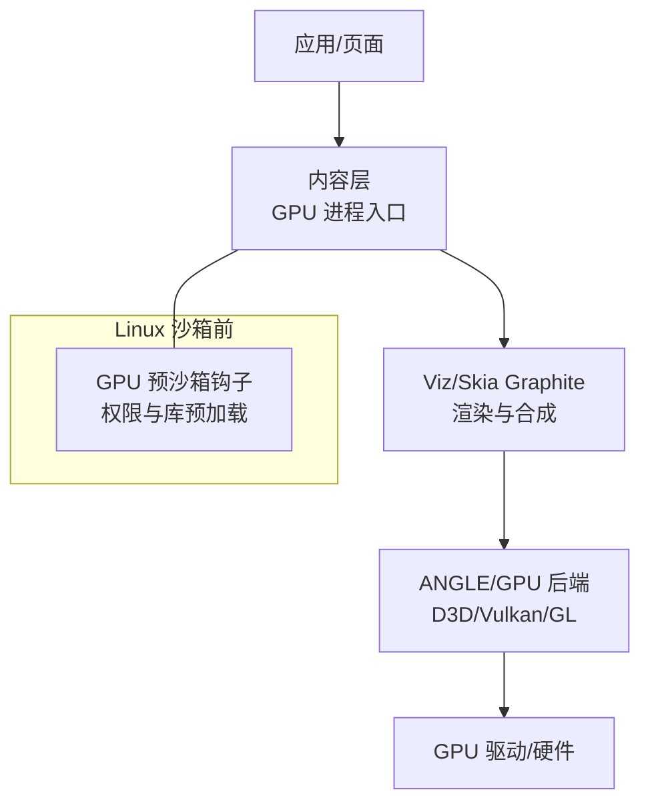
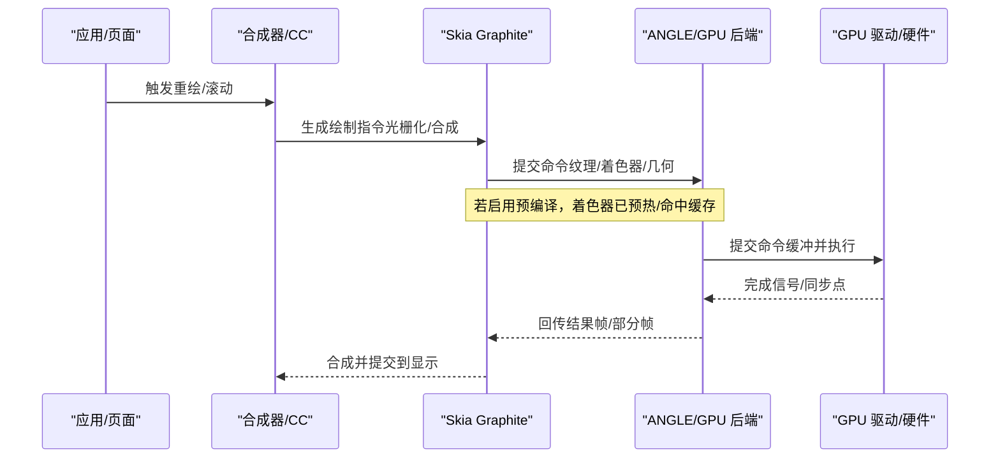
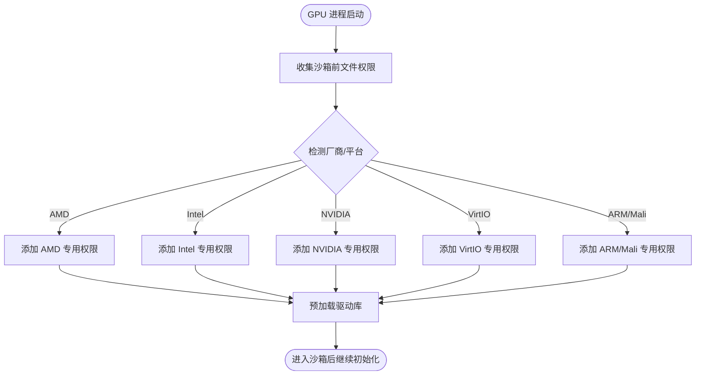
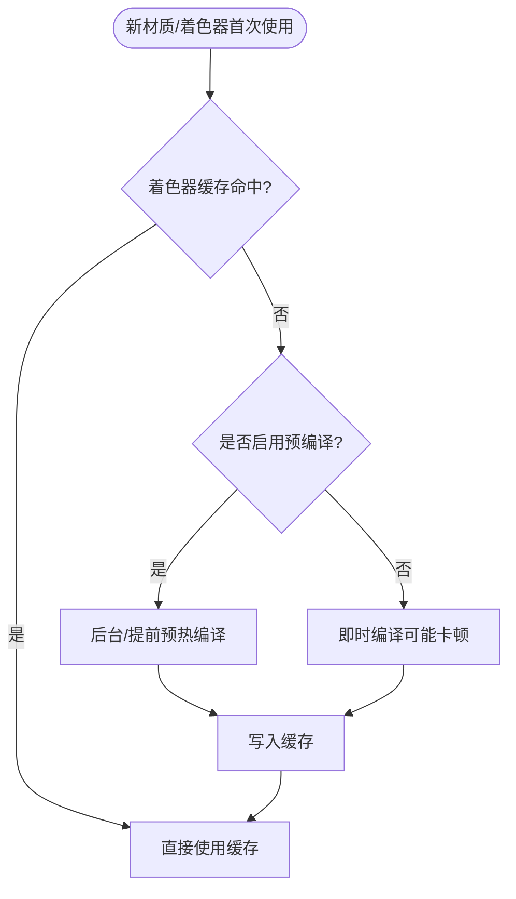
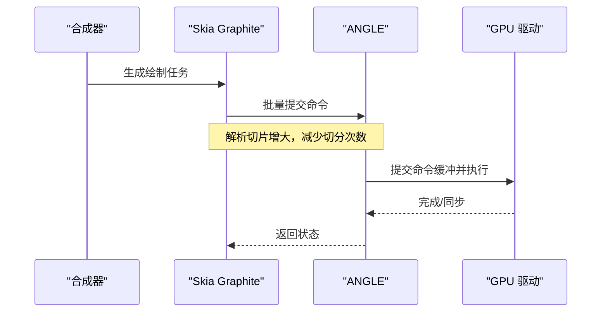
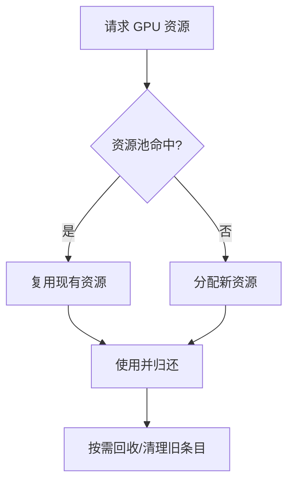
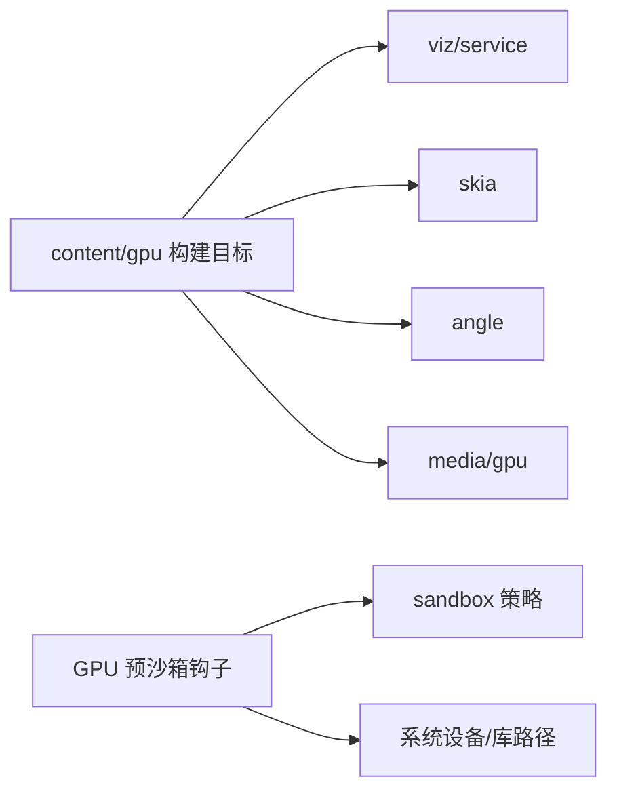

# GPU 渲染管线

本文引用的文件

- [gpu_pre_sandbox_hook_linux.cc](https://github.com/Mcloud136/Mcloud-Browser/blob/main/src/content/common/gpu_pre_sandbox_hook_linux.cc)
- [性能优化设计文档.md](https://github.com/Mcloud136/Mcloud-Browser/blob/main/docs/superpowers/specs/2026-06-19-performance-optimization-design.md)
- [win_args.list](https://github.com/Mcloud136/Mcloud-Browser/blob/main/infra/win_args.list)
- [CMDLINE_FLAGS_LIST.md](https://github.com/Mcloud136/Mcloud-Browser/blob/main/infra/CMDLINE_FLAGS_LIST.md)
- [BUILD.gn（content/gpu）](https://github.com/Mcloud136/Mcloud-Browser/blob/main/src/content/gpu/BUILD.gn)
- [mcloud_flag_entries.h](https://github.com/Mcloud136/Mcloud-Browser/blob/main/src/chrome/browser/mcloud_flag_entries.h)

## 目录
1. [简介](#简介)
2. [项目结构](#项目结构)
3. [核心组件](#核心组件)
4. [架构总览](#架构总览)
5. [详细组件分析](#详细组件分析)
6. [依赖关系分析](#依赖关系分析)
7. [性能考量](#性能考量)
8. [故障排查指南](#故障排查指南)
9. [结论](#结论)
10. [附录](#附录)

## 简介
本文件面向 MCloud Browser 的 GPU 渲染管线，聚焦从 CPU 到 GPU 的完整流程：光栅化、着色器编译与缓存、纹理上传、命令缓冲提交与执行。结合仓库中的构建与运行时开关，说明 Skia Graphite 预编译机制如何缓解着色器编译卡顿，以及 GPU 命令缓冲区与资源池的优化策略。同时给出多厂商 GPU（NVIDIA、Intel、AMD）在 Linux 沙箱下的驱动适配与权限配置要点，并提供基于内置标志的性能监控与瓶颈定位方法。

## 项目结构
围绕 GPU 渲染的关键位置包括：
- 内容层 GPU 进程构建与依赖：用于链接 viz、skia、angle、media/gpu 等模块
- Linux 沙箱前 GPU 初始化与驱动库预加载：为不同厂商 GPU 准备设备节点与共享库访问权限
- 运行期特性开关：启用 Skia Graphite 预编译、增大命令缓冲区解析切片、扩大着色器缓存、精确大小资源复用等
- 命令行调试与追踪开关：用于开启 GPU 客户端/服务端日志、命令日志、服务追踪等

图表来源
- [BUILD.gn（content/gpu）:43-87](https://github.com/Mcloud136/Mcloud-Browser/blob/main/src/content/gpu/BUILD.gn#L43-L87)
- [gpu_pre_sandbox_hook_linux.cc:612-715](https://github.com/Mcloud136/Mcloud-Browser/blob/main/src/content/common/gpu_pre_sandbox_hook_linux.cc#L612-L715)

章节来源
- [BUILD.gn（content/gpu）:43-87](https://github.com/Mcloud136/Mcloud-Browser/blob/main/src/content/gpu/BUILD.gn#L43-L87)

## 核心组件
- GPU 进程与依赖装配：通过 content/gpu 的构建目标引入 viz/service、skia、angle、media/gpu 等，形成渲染与合成的基础栈
- Linux 沙箱前 GPU 初始化：在 GPU 进程进入沙箱之前，完成设备节点白名单与关键驱动库的预加载，确保后续图形栈稳定启动
- 运行期 GPU/渲染特性开关：通过 Finch 特性启用 Skia Graphite 预编译、增大命令缓冲区解析切片、扩大着色器缓存、精确大小资源复用等
- 调试与追踪开关：提供 GPU 客户端/服务端日志、命令日志、服务追踪等能力，便于定位卡顿与异常

章节来源
- [BUILD.gn（content/gpu）:43-87](https://github.com/Mcloud136/Mcloud-Browser/blob/main/src/content/gpu/BUILD.gn#L43-L87)
- [gpu_pre_sandbox_hook_linux.cc:612-715](https://github.com/Mcloud136/Mcloud-Browser/blob/main/src/content/common/gpu_pre_sandbox_hook_linux.cc#L612-L715)
- [性能优化设计文档.md:111-121](https://github.com/Mcloud136/Mcloud-Browser/blob/main/docs/superpowers/specs/2026-06-19-performance-optimization-design.md#L111-L121)
- [CMDLINE_FLAGS_LIST.md:1156-1178](https://github.com/Mcloud136/Mcloud-Browser/blob/main/infra/CMDLINE_FLAGS_LIST.md#L1156-L1178)

## 架构总览
下图展示从 CPU 侧发起绘制到 GPU 执行的端到端路径，并标注了关键优化点（预编译、命令缓冲、资源复用）。

图表来源
- [性能优化设计文档.md:111-121](https://github.com/Mcloud136/Mcloud-Browser/blob/main/docs/superpowers/specs/2026-06-19-performance-optimization-design.md#L111-L121)
- [win_args.list:211-239](https://github.com/Mcloud136/Mcloud-Browser/blob/main/infra/win_args.list#L211-L239)

## 详细组件分析

### 组件A：Linux 沙箱前 GPU 初始化与驱动适配
- 作用：在 GPU 进程进入沙箱前，建立最小化的文件访问白名单，并按厂商/平台预加载必要的驱动库，避免首次调用时的阻塞或失败
- 关键点：
  - 统一添加标准 GPU 权限（如 /dev/dri、/dev/shm、Nvidia 控制节点等）
  - 针对 AMD/Intel/NVIDIA/VirtIO/ARM Mali 等分别追加只读/读写路径
  - 预加载 Vulkan 相关 ICD、Mesa/EGL/GL 相关库，减少首次 dlopen 开销
  - ChromeOS/Chromecast 场景下额外处理 V4L2 编解码设备节点与 ARM 路径

图表来源
- [gpu_pre_sandbox_hook_linux.cc:253-350](https://github.com/Mcloud136/Mcloud-Browser/blob/main/src/content/common/gpu_pre_sandbox_hook_linux.cc#L253-L350)
- [gpu_pre_sandbox_hook_linux.cc:301-394](https://github.com/Mcloud136/Mcloud-Browser/blob/main/src/content/common/gpu_pre_sandbox_hook_linux.cc#L301-L394)
- [gpu_pre_sandbox_hook_linux.cc:498-599](https://github.com/Mcloud136/Mcloud-Browser/blob/main/src/content/common/gpu_pre_sandbox_hook_linux.cc#L498-L599)
- [gpu_pre_sandbox_hook_linux.cc:612-715](https://github.com/Mcloud136/Mcloud-Browser/blob/main/src/content/common/gpu_pre_sandbox_hook_linux.cc#L612-L715)

章节来源
- [gpu_pre_sandbox_hook_linux.cc:253-394](https://github.com/Mcloud136/Mcloud-Browser/blob/main/src/content/common/gpu_pre_sandbox_hook_linux.cc#L253-L394)
- [gpu_pre_sandbox_hook_linux.cc:498-715](https://github.com/Mcloud136/Mcloud-Browser/blob/main/src/content/common/gpu_pre_sandbox_hook_linux.cc#L498-L715)

### 组件B：Skia Graphite 预编译与着色器缓存
- 作用：通过“预编译渲染管线”和“更大着色器缓存”降低首次绘制与切换材质时的编译停顿
- 效果：减少首帧卡顿、提升复杂 UI 的滚动/动画流畅度
- 关联开关：
  - 启用 Skia Graphite 预编译
  - 启用更大的着色器缓存限制
  - 配合命令缓冲区解析切片增大，减少 CPU 侧解析压力

图表来源
- [性能优化设计文档.md:111-121](https://github.com/Mcloud136/Mcloud-Browser/blob/main/docs/superpowers/specs/2026-06-19-performance-optimization-design.md#L111-L121)

章节来源
- [性能优化设计文档.md:111-121](https://github.com/Mcloud136/Mcloud-Browser/blob/main/docs/superpowers/specs/2026-06-19-performance-optimization-design.md#L111-L121)

### 组件C：GPU 命令缓冲区优化
- 作用：增大命令缓冲区解析切片，降低频繁切分带来的 CPU 开销；在 ANGLE/Vulkan 路径中启用自定义二级命令缓冲，提高批量化与复用效率
- 影响：减少主线程阻塞时间，提升高负载场景稳定性

图表来源
- [性能优化设计文档.md:111-121](https://github.com/Mcloud136/Mcloud-Browser/blob/main/docs/superpowers/specs/2026-06-19-performance-optimization-design.md#L111-L121)
- [win_args.list:211-239](https://github.com/Mcloud136/Mcloud-Browser/blob/main/infra/win_args.list#L211-L239)

章节来源
- [性能优化设计文档.md:111-121](https://github.com/Mcloud136/Mcloud-Browser/blob/main/docs/superpowers/specs/2026-06-19-performance-optimization-design.md#L111-L121)
- [win_args.list:211-239](https://github.com/Mcloud136/Mcloud-Browser/blob/main/infra/win_args.list#L211-L239)

### 组件D：GPU 资源池与内存管理
- 作用：通过“精确大小资源复用”减少分配/释放抖动，降低碎片与峰值内存
- 影响：在多标签页、复杂页面场景下更稳定的内存占用与更低的 GC/回收压力

图表来源
- [性能优化设计文档.md:111-121](https://github.com/Mcloud136/Mcloud-Browser/blob/main/docs/superpowers/specs/2026-06-19-performance-optimization-design.md#L111-L121)

章节来源
- [性能优化设计文档.md:111-121](https://github.com/Mcloud136/Mcloud-Browser/blob/main/docs/superpowers/specs/2026-06-19-performance-optimization-design.md#L111-L121)

### 组件E：多厂商 GPU 兼容性与驱动适配
- Linux 环境下，通过沙箱前钩子为不同厂商 GPU 开放必要设备节点与库路径，并预加载对应驱动库，保证图形栈顺利初始化
- 典型覆盖：
  - AMD：radeon/radeonsi、Vulkan ICD、DRM 节点
  - Intel：iris/i965/crocus、Vulkan ICD、DRM 节点
  - NVIDIA：nouveau/swrast、GLX/Vulkan 相关库、/dev/nvidia*
  - VirtIO：virtio_gpu_dri、kms_swrast 回退路径
  - ARM/Mali：libmali、renderD* 节点、V4L2 编解码设备（ChromeOS/Chromecast）

章节来源
- [gpu_pre_sandbox_hook_linux.cc:253-394](https://github.com/Mcloud136/Mcloud-Browser/blob/main/src/content/common/gpu_pre_sandbox_hook_linux.cc#L253-L394)
- [gpu_pre_sandbox_hook_linux.cc:498-599](https://github.com/Mcloud136/Mcloud-Browser/blob/main/src/content/common/gpu_pre_sandbox_hook_linux.cc#L498-L599)

### 组件F：性能监控与调试开关
- 可用命令行开关（示例）：
  - 启用 GPU 基准测试扩展
  - 测量 GPU 主线程阻塞时间
  - 开启 GPU 客户端/服务端日志与追踪
  - 开启 GPU 命令日志
  - 允许 GPU 光栅化（与合成加速配合）
- 用途：定位卡顿、统计 GPU 利用率、观察命令提交频率与错误

章节来源
- [CMDLINE_FLAGS_LIST.md:1156-1178](https://github.com/Mcloud136/Mcloud-Browser/blob/main/infra/CMDLINE_FLAGS_LIST.md#L1156-L1178)

## 依赖关系分析
- content/gpu 构建目标依赖 viz/service、skia、angle、media/gpu 等，构成渲染与合成的基础
- Linux 沙箱前钩子依赖 sandbox 策略与系统设备/库路径，按厂商条件化注入权限与预加载逻辑
- 运行期特性由 Finch 特性控制，影响 Skia Graphite、命令缓冲、资源池等行为

图表来源
- [BUILD.gn（content/gpu）:43-87](https://github.com/Mcloud136/Mcloud-Browser/blob/main/src/content/gpu/BUILD.gn#L43-L87)
- [gpu_pre_sandbox_hook_linux.cc:612-715](https://github.com/Mcloud136/Mcloud-Browser/blob/main/src/content/common/gpu_pre_sandbox_hook_linux.cc#L612-L715)

章节来源
- [BUILD.gn（content/gpu）:43-87](https://github.com/Mcloud136/Mcloud-Browser/blob/main/src/content/gpu/BUILD.gn#L43-L87)
- [gpu_pre_sandbox_hook_linux.cc:612-715](https://github.com/Mcloud136/Mcloud-Browser/blob/main/src/content/common/gpu_pre_sandbox_hook_linux.cc#L612-L715)

## 性能考量
- 预编译与缓存：启用 Skia Graphite 预编译与更大着色器缓存，显著降低首帧与材质切换卡顿
- 命令缓冲：增大解析切片、启用自定义二级命令缓冲，减少 CPU 侧解析与调度开销
- 资源池：精确大小复用与旧条目修剪，降低内存抖动与峰值
- 多线程与 IO：将 IO 线程设为交互式类型、Mojo IPC 专用线程、用户态自旋锁等，改善交互响应
- 视频解码：优先尝试 D3D12 后端，失败自动回退 D3D11，保障播放稳定性
- 构建优化：SIMD（AVX2/FMA）、ThinLTO、PGO、Polly 等编译期优化，提升整体吞吐

章节来源
- [性能优化设计文档.md:65-121](https://github.com/Mcloud136/Mcloud-Browser/blob/main/docs/superpowers/specs/2026-06-19-performance-optimization-design.md#L65-L121)
- [性能优化设计文档.md:124-141](https://github.com/Mcloud136/Mcloud-Browser/blob/main/docs/superpowers/specs/2026-06-19-performance-optimization-design.md#L124-L141)

## 故障排查指南
- 现象：黑屏/花屏/视频无法播放
  - 检查 Linux 沙箱前 GPU 权限是否正确注入（/dev/dri、/dev/nvidia*、Vulkan ICD 等）
  - 确认驱动库是否可被预加载（dlopen 失败会记录日志）
- 现象：首帧卡顿/滚动掉帧
  - 启用 Skia Graphite 预编译与更大着色器缓存
  - 增大命令缓冲区解析切片，减少 CPU 侧解析压力
- 现象：内存飙升/频繁回收
  - 启用精确大小资源复用，修剪旧传输缓存条目
- 调试手段
  - 使用 GPU 客户端/服务端日志、命令日志与服务追踪定位问题
  - 使用 GPU 基准测试扩展与阻塞时间测量评估性能回归

章节来源
- [gpu_pre_sandbox_hook_linux.cc:556-599](https://github.com/Mcloud136/Mcloud-Browser/blob/main/src/content/common/gpu_pre_sandbox_hook_linux.cc#L556-L599)
- [CMDLINE_FLAGS_LIST.md:1156-1178](https://github.com/Mcloud136/Mcloud-Browser/blob/main/infra/CMDLINE_FLAGS_LIST.md#L1156-L1178)
- [性能优化设计文档.md:111-121](https://github.com/Mcloud136/Mcloud-Browser/blob/main/docs/superpowers/specs/2026-06-19-performance-optimization-design.md#L111-L121)

## 结论
MCloud Browser 在 GPU 渲染管线上通过“沙箱前驱动适配 + Skia Graphite 预编译 + 命令缓冲与资源池优化 + 丰富的调试开关”，实现了更稳定的首帧体验、更低的卡顿概率与更可控的内存占用。针对不同厂商 GPU，提供了细粒度的权限与库预加载策略；通过运行期特性开关，可在不重新编译的情况下灵活调优。建议在生产环境保持预编译与缓存开启，并结合日志与追踪持续验证性能收益。

## 附录
- 相关构建与运行开关参考：
  - ANGLE Vulkan 自定义命令缓冲与管道缓存 CRC
  - GPU 命令行调试与追踪开关
  - 性能优化设计文档中的 Finch 特性列表

章节来源
- [win_args.list:211-239](https://github.com/Mcloud136/Mcloud-Browser/blob/main/infra/win_args.list#L211-L239)
- [CMDLINE_FLAGS_LIST.md:1156-1178](https://github.com/Mcloud136/Mcloud-Browser/blob/main/infra/CMDLINE_FLAGS_LIST.md#L1156-L1178)
- [性能优化设计文档.md:65-121](https://github.com/Mcloud136/Mcloud-Browser/blob/main/docs/superpowers/specs/2026-06-19-performance-optimization-design.md#L65-L121)