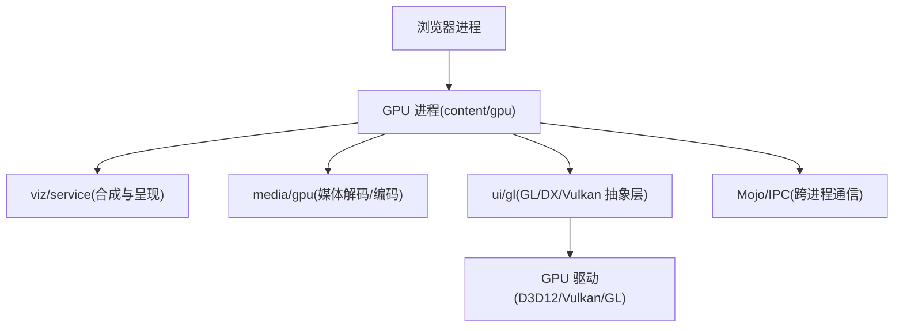
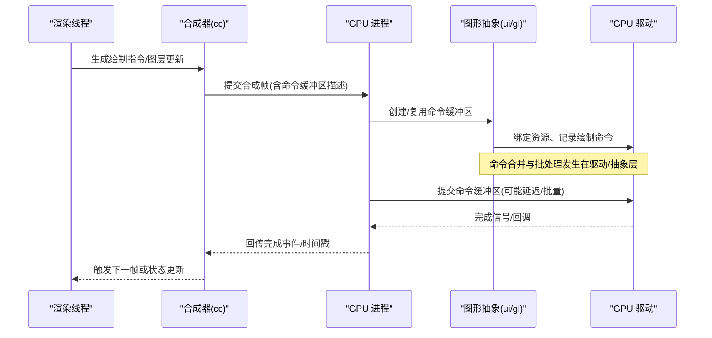
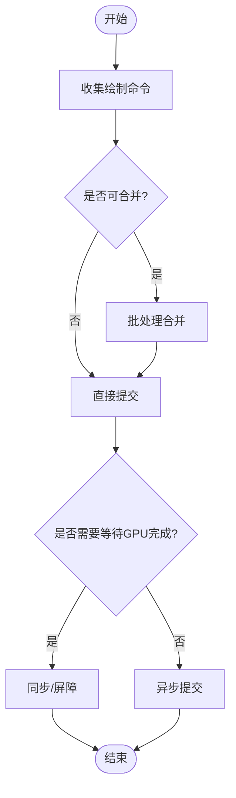
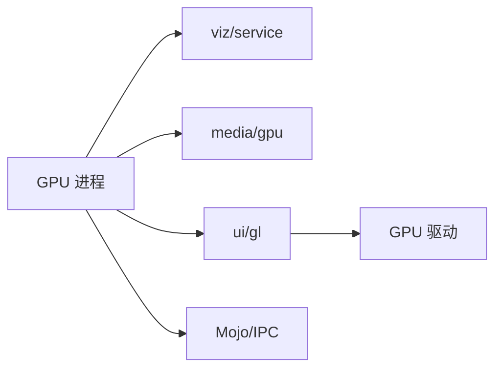

# 命令缓冲区优化

<cite>
**本文引用的文件**
- [src/content/gpu/BUILD.gn](file://src/content/gpu/BUILD.gn)
- [src/content/common/gpu_pre_sandbox_hook_linux.cc](file://src/content/common/gpu_pre_sandbox_hook_linux.cc)
- [src/third_party/blink/common/features.cc](file://src/third_party/blink/common/features.cc)
- [infra/CMDLINE_FLAGS_LIST.md](file://infra/CMDLINE_FLAGS_LIST.md)
- [docs/superpowers/specs/2026-06-19-performance-optimization-design.md](file://docs/superpowers/specs/2026-06-19-performance-optimization-design.md)
</cite>

## 目录
1. [简介](#简介)
2. [项目结构](#项目结构)
3. [核心组件](#核心组件)
4. [架构总览](#架构总览)
5. [详细组件分析](#详细组件分析)
6. [依赖关系分析](#依赖关系分析)
7. [性能考量](#性能考量)
8. [故障排查指南](#故障排查指南)
9. [结论](#结论)
10. [附录](#附录)

## 简介
本文件围绕 GPU 命令缓冲区的构建与优化，系统阐述绘制命令的收集、批处理与提交策略；说明如何通过异步执行、命令合并与延迟提交降低 CPU-GPU 同步开销；总结不同 GPU 驱动在命令缓冲区实现上的差异与优化技巧；提供性能分析工具与定位瓶颈的方法；并给出多线程环境下命令缓冲区的安全访问策略。内容基于仓库中 GPU 进程构建配置、沙箱权限、特性开关与命令行参数等可验证信息，辅以通用工程实践进行解释。

## 项目结构
本项目为 Chromium 衍生浏览器工程，GPU 相关能力通过 content/gpu 模块集成到 GPU 进程中，并通过 IPC/Mojo 与浏览器进程交互。关键位置包括：
- GPU 进程构建与依赖：content/gpu/BUILD.gn 定义了 GPU 进程的构建目标与依赖（如 viz/service、media/gpu、ui/gl 等），体现命令缓冲区的上层服务与底层图形栈耦合点。
- Linux 沙箱与设备访问：content/common/gpu_pre_sandbox_hook_linux.cc 控制 GPU 进程对 DRM/Vulkan/DRM 设备的访问权限，影响命令缓冲区的创建与提交路径。
- 特性开关：third_party/blink/common/features.cc 暴露了与 GPU 通道建立相关的特性标志，可用于调整初始化与异步行为。
- 命令行参数：infra/CMDLINE_FLAGS_LIST.md 列举了大量 --gpu-* 参数，用于调节 GPU 行为（如程序缓存大小、MSAA 采样数、上下文丢失策略等）。
- 性能优化设计文档：docs/superpowers/specs/2026-06-19-performance-optimization-design.md 汇总了 SIMD、V8、视频、GPU 等维度的编译与运行期优化项，可作为整体性能基线参考。

图表来源
- [src/content/gpu/BUILD.gn:43-87](file://src/content/gpu/BUILD.gn#L43-L87)

章节来源
- [src/content/gpu/BUILD.gn:43-87](file://src/content/gpu/BUILD.gn#L43-L87)

## 核心组件
- GPU 进程与命令缓冲区生命周期
  - GPU 进程负责创建图形上下文、管理命令缓冲区、调度绘制任务并提交给驱动。其构建依赖表明它同时承载合成(viz)、媒体(media)与图形抽象(ui/gl)的职责，是命令缓冲区的核心宿主。
- 沙箱与设备访问
  - 在 Linux 上，GPU 进程需要读取 drirc、访问 Vulkan ICD、DRM 设备等，这些权限由沙箱钩子函数集中管理，直接影响命令缓冲区的初始化与提交路径是否可用。
- 特性与参数
  - 通过 blink 特性开关控制 GPU 通道建立方式（例如异步建立），通过 --gpu-* 命令行参数调节程序缓存、MSAA、上下文丢失策略等，间接影响命令缓冲区的批大小、提交频率与稳定性。

章节来源
- [src/content/gpu/BUILD.gn:43-87](file://src/content/gpu/BUILD.gn#L43-L87)
- [src/content/common/gpu_pre_sandbox_hook_linux.cc:617-652](file://src/content/common/gpu_pre_sandbox_hook_linux.cc#L617-L652)
- [src/third_party/blink/common/features.cc:625-625](file://src/third_party/blink/common/features.cc#L625-L625)
- [infra/CMDLINE_FLAGS_LIST.md:1616-1646](file://infra/CMDLINE_FLAGS_LIST.md#L1616-L1646)

## 架构总览
下图展示了从渲染线程到 GPU 驱动的端到端流程，重点标注命令缓冲区的构建、批处理与提交阶段。

图表来源
- [src/content/gpu/BUILD.gn:43-87](file://src/content/gpu/BUILD.gn#L43-L87)

## 详细组件分析

### 命令缓冲区的构建过程
- 绘制命令收集
  - 渲染线程将 UI 变化转换为绘制指令，交由合成器组织为帧级提交。命令缓冲区在此阶段被分配并填充绘制调用。
- 批处理
  - 在 GPU 抽象层与驱动层，相邻的绘制命令会被合并以减少状态切换与提交次数。可通过增大批大小、减少状态切换来降低开销。
- 提交策略
  - 提交时机可选择立即提交或延迟提交。延迟提交允许聚合多帧命令，提高吞吐；但需平衡时延与内存占用。

[该图为概念流程图，不映射具体源码]

### 减少 CPU-GPU 同步开销的策略
- 异步执行
  - 使用异步 GPU 通道建立与提交，避免主线程阻塞。可通过特性开关调整通道建立方式，结合驱动支持的异步 API 提升吞吐。
- 命令合并
  - 尽量合并相同状态的绘制调用，减少状态切换与重绑定成本。
- 延迟提交
  - 将命令缓冲区的提交推迟到更合适的时机（如下一次 vsync 前），以聚合更多命令，降低提交频率。

章节来源
- [src/third_party/blink/common/features.cc:625-625](file://src/third_party/blink/common/features.cc#L625-L625)
- [infra/CMDLINE_FLAGS_LIST.md:1616-1646](file://infra/CMDLINE_FLAGS_LIST.md#L1616-L1646)

### 不同 GPU 驱动的命令缓冲区实现差异与优化技巧
- Windows (D3D12)
  - 利用命令列表与命令队列的批处理能力，合理设置堆类型与资源绑定，减少重分配与同步。
- Linux (Vulkan/GL)
  - 通过 Vulkan 的 CommandBuffer 与 VkQueue 提交，注意同步原语（Semaphore/Fence）的使用；GL 路径下关注状态机切换与驱动批处理效果。
- ARM/移动平台
  - 受限于带宽与功耗，应更注重批大小与内存布局，避免频繁刷新与跨域拷贝。

章节来源
- [src/content/common/gpu_pre_sandbox_hook_linux.cc:617-652](file://src/content/common/gpu_pre_sandbox_hook_linux.cc#L617-L652)
- [docs/superpowers/specs/2026-06-19-performance-optimization-design.md:29-98](file://docs/superpowers/specs/2026-06-19-performance-optimization-design.md#L29-L98)

### 命令缓冲区性能分析工具与方法
- 启用追踪与指标
  - 使用 Chrome DevTools Performance 面板、Tracing 与 GPU 日志，观察命令提交耗时、批大小与同步点。
- 命令行参数辅助
  - 通过 --gpu-program-cache-size-kb、--gpu-rasterization-msaa-sample-count 等参数调节程序缓存与光栅化质量，观察对提交频率与吞吐的影响。
- 基准与回归测试
  - 结合项目中的基准脚本与性能优化设计文档，建立回归基线，识别异常波动。

章节来源
- [infra/CMDLINE_FLAGS_LIST.md:1616-1646](file://infra/CMDLINE_FLAGS_LIST.md#L1616-L1646)
- [docs/superpowers/specs/2026-06-19-performance-optimization-design.md:29-98](file://docs/superpowers/specs/2026-06-19-performance-optimization-design.md#L29-L98)

### 多线程环境下的安全访问策略
- 线程隔离
  - 命令缓冲区的创建与写入应在 GPU 线程或专用工作线程进行，避免与渲染主线程竞争。
- 同步原语
  - 使用 Fence/Semaphore/Event 确保命令提交顺序与资源可见性，防止数据竞争与乱序执行。
- 锁粒度与无锁设计
  - 对共享队列采用细粒度锁或无锁环形队列，减少锁竞争；必要时使用双缓冲降低停顿。
- 错误恢复
  - 捕获上下文丢失与驱动重置事件，重建命令缓冲区并回滚到一致状态。

[本节为通用工程实践，不直接引用具体源码]

## 依赖关系分析
GPU 进程构建目标依赖多个子系统，形成紧密耦合：
- viz/service：负责合成与呈现，决定命令缓冲区的帧级边界与提交时机。
- media/gpu：媒体编解码路径也会产生命令缓冲区，需与合成路径协调以避免冲突。
- ui/gl：图形抽象层屏蔽驱动差异，统一命令记录与提交接口。
- Mojo/IPC：跨进程通信，保证浏览器进程与 GPU 进程间的命令传递与状态同步。

图表来源
- [src/content/gpu/BUILD.gn:43-87](file://src/content/gpu/BUILD.gn#L43-L87)

章节来源
- [src/content/gpu/BUILD.gn:43-87](file://src/content/gpu/BUILD.gn#L43-L87)

## 性能考量
- 批大小与提交频率
  - 增大批大小可降低提交次数，但会增加时延；需根据场景权衡。
- 状态切换与资源绑定
  - 减少状态切换与资源重绑定，优先复用资源与管线对象。
- 异步与延迟提交
  - 在稳定场景下采用异步与延迟提交，提升吞吐；在低时延场景谨慎使用。
- 驱动差异
  - 针对 D3D12/Vulkan/GL 的不同特性调优，如队列、堆、命令缓冲池的大小与生命周期。
- 内存与缓存
  - 合理设置程序缓存大小与传输缓存清理策略，避免频繁编译与内存抖动。

[本节为通用指导，不直接引用具体源码]

## 故障排查指南
- 常见问题
  - 上下文丢失：检查 --gpu-no-context-lost 与驱动兼容性，必要时重启 GPU 进程。
  - 提交卡顿：观察 Tracing 中的命令提交耗时，定位批大小过大或同步点过多。
  - 权限问题：Linux 下确认沙箱权限是否包含 drirc、Vulkan ICD、DRM 设备访问。
- 诊断步骤
  - 启用 GPU 日志与 Tracing，采集命令缓冲区生命周期与提交时序。
  - 调整 --gpu-program-cache-size-kb 与 MSAA 采样数，对比性能曲线。
  - 在不同驱动/平台上复现，确认是否为驱动特定问题。

章节来源
- [infra/CMDLINE_FLAGS_LIST.md:1616-1646](file://infra/CMDLINE_FLAGS_LIST.md#L1616-L1646)
- [src/content/common/gpu_pre_sandbox_hook_linux.cc:617-652](file://src/content/common/gpu_pre_sandbox_hook_linux.cc#L617-L652)

## 结论
命令缓冲区的优化涉及构建、批处理、提交策略与驱动适配等多个层面。通过异步执行、命令合并与延迟提交可有效降低 CPU-GPU 同步开销；针对不同驱动的特性进行调优能进一步提升效率；借助 Tracing 与命令行参数进行性能分析与回归验证，有助于持续改进。在多线程环境中，严格的线程隔离与同步原语使用是保障正确性与稳定性的关键。

## 附录
- 相关构建与依赖
  - GPU 进程构建目标与依赖见 content/gpu/BUILD.gn。
- 沙箱与设备权限
  - Linux 下 GPU 进程的设备访问权限集中在 gpu_pre_sandbox_hook_linux.cc。
- 特性与参数
  - 特性开关与命令行参数分别位于 blink/features.cc 与 CMDLINE_FLAGS_LIST.md。
- 性能优化基线
  - 综合优化项参见 superpowers 性能优化设计文档。