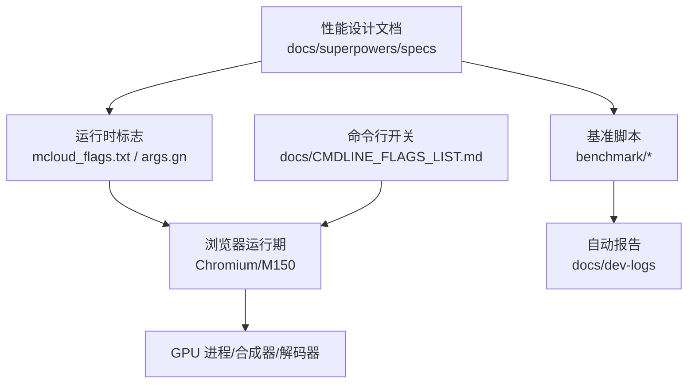
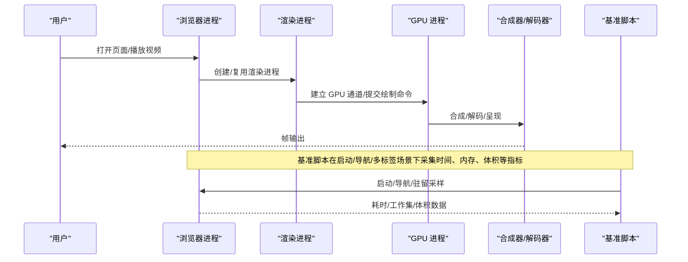
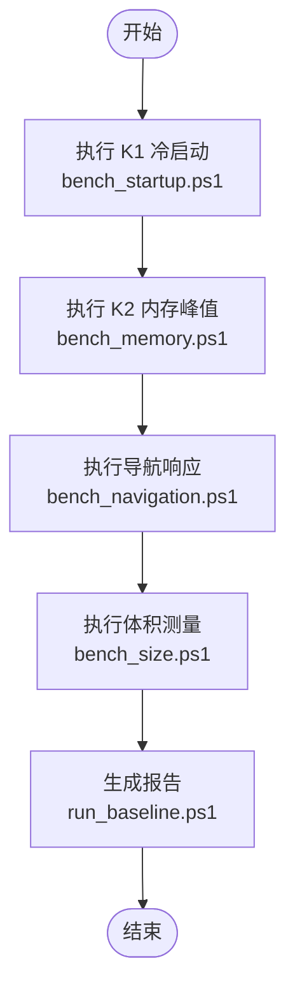
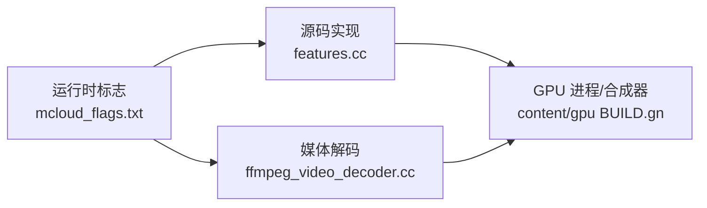

# 渲染性能监控

本文引用的文件

- [2026-06-19-performance-optimization-design.md](https://github.com/Mcloud136/Mcloud-Browser/blob/main/docs/superpowers/specs/2026-06-19-performance-optimization-design.md)
- [bench_startup.ps1](https://github.com/Mcloud136/Mcloud-Browser/blob/main/benchmark/bench_startup.ps1)
- [bench_navigation.ps1](https://github.com/Mcloud136/Mcloud-Browser/blob/main/benchmark/bench_navigation.ps1)
- [bench_memory.ps1](https://github.com/Mcloud136/Mcloud-Browser/blob/main/benchmark/bench_memory.ps1)
- [run_baseline.ps1](https://github.com/Mcloud136/Mcloud-Browser/blob/main/benchmark/run_baseline.ps1)
- [check_features.py](https://github.com/Mcloud136/Mcloud-Browser/blob/main/benchmark/tools/check_features.py)
- [CMDLINE_FLAGS_LIST.md](https://github.com/Mcloud136/Mcloud-Browser/blob/main/docs/CMDLINE_FLAGS_LIST.md)
- [features.cc](https://github.com/Mcloud136/Mcloud-Browser/blob/main/src/third_party/blink/common/features.cc)
- [ffmpeg_video_decoder.cc](https://github.com/Mcloud136/Mcloud-Browser/blob/main/src/media/filters/ffmpeg_video_decoder.cc)
- [BUILD.gn (content/gpu)](https://github.com/Mcloud136/Mcloud-Browser/blob/main/src/content/gpu/BUILD.gn)

## 目录
1. [简介](#简介)
2. [项目结构](#项目结构)
3. [核心组件](#核心组件)
4. [架构总览](#架构总览)
5. [详细组件分析](#详细组件分析)
6. [依赖关系分析](#依赖关系分析)
7. [性能考量](#性能考量)
8. [故障排查指南](#故障排查指南)
9. [结论](#结论)
10. [附录](#附录)

## 简介
本文件面向 MCloud Browser（基于 Chromium）的渲染性能监控与优化，聚焦 GPU 渲染相关指标的定义、测量方法、工具使用、常见瓶颈识别与优化建议，并给出基准测试框架与自动化脚本的使用方式。内容覆盖帧率、GPU 利用率、内存使用等关键指标，以及 Chrome DevTools GPU 面板、性能追踪器与自定义监控接口的使用要点；同时结合仓库中的性能设计文档与基准脚本，提供可操作的实践路径。

## 项目结构
本项目围绕“性能设计与优化”“基准测试与验证”“运行时标志与构建参数”三大主线组织：
- 性能设计与优化：在 docs/superpowers/specs 中定义了启动、内存、多线程、媒体、GPU/渲染等多维度的运行时标志与预期收益。
- 基准测试与验证：benchmark 目录提供冷启动、导航响应、内存峰值、体积等自动化脚本，以及一键基线采集与 feature 清单校验工具。
- 运行时标志与构建参数：通过 mcloud_flags.txt 与 args.gn 控制行为；CMDLINE_FLAGS_LIST.md 列出 GPU 相关命令行开关，便于调试与监控。

图表来源
- [2026-06-19-performance-optimization-design.md:65-121](https://github.com/Mcloud136/Mcloud-Browser/blob/main/docs/superpowers/specs/2026-06-19-performance-optimization-design.md#L65-L121)
- [CMDLINE_FLAGS_LIST.md:1616-1646](https://github.com/Mcloud136/Mcloud-Browser/blob/main/docs/CMDLINE_FLAGS_LIST.md#L1616-L1646)

章节来源
- [2026-06-19-performance-optimization-design.md:1-188](https://github.com/Mcloud136/Mcloud-Browser/blob/main/docs/superpowers/specs/2026-06-19-performance-optimization-design.md#L1-L188)
- [CMDLINE_FLAGS_LIST.md:1616-1646](https://github.com/Mcloud136/Mcloud-Browser/blob/main/docs/CMDLINE_FLAGS_LIST.md#L1616-L1646)

## 核心组件
- 运行时标志体系：通过 --enable-features/--disable-features 启用或禁用功能特性，涵盖启动、内存、多线程、媒体、GPU/渲染等类别，无需重编译即可调整行为。
- GPU/渲染相关标志：包括提前发送 GPU 通道、命令缓冲区解析切片增大、着色器缓存限制放宽、高帧率请求允许等，直接影响首屏与渲染效率。
- 媒体与解码：D3D12 视频解码默认启用，支持 H.264/VP9/AV1/HEVC，并在失败时回退到 D3D11。
- 基准测试套件：K1 冷启动、K2 内存峰值、导航响应、体积等自动化脚本，配合一键基线采集与 feature 有效性校验。

章节来源
- [2026-06-19-performance-optimization-design.md:65-121](https://github.com/Mcloud136/Mcloud-Browser/blob/main/docs/superpowers/specs/2026-06-19-performance-optimization-design.md#L65-L121)
- [2026-06-19-performance-optimization-design.md:124-141](https://github.com/Mcloud136/Mcloud-Browser/blob/main/docs/superpowers/specs/2026-06-19-performance-optimization-design.md#L124-L141)

## 架构总览
下图展示从用户操作到 GPU 渲染的关键路径，以及基准脚本如何对关键阶段进行观测与对比。

图表来源
- [2026-06-19-performance-optimization-design.md:65-121](https://github.com/Mcloud136/Mcloud-Browser/blob/main/docs/superpowers/specs/2026-06-19-performance-optimization-design.md#L65-L121)
- [bench_startup.ps1:1-70](https://github.com/Mcloud136/Mcloud-Browser/blob/main/benchmark/bench_startup.ps1#L1-L70)
- [bench_navigation.ps1:1-109](https://github.com/Mcloud136/Mcloud-Browser/blob/main/benchmark/bench_navigation.ps1#L1-L109)
- [bench_memory.ps1:1-78](https://github.com/Mcloud136/Mcloud-Browser/blob/main/benchmark/bench_memory.ps1#L1-L78)

## 详细组件分析

### 指标定义与测量方法
- 帧率（FPS）
  - 定义：每秒渲染完成的帧数，反映页面动画与交互流畅度。
  - 测量：使用 Chrome DevTools Performance 面板录制帧时序，统计 FPS 分布与掉帧点；或使用 GPU 面板观察呈现时间与主线程阻塞情况。
- GPU 利用率
  - 定义：GPU 计算与带宽占用比例，过高可能表明着色器复杂或绘制调用过多，过低可能表示 CPU 瓶颈或等待。
  - 测量：系统级工具（如任务管理器/资源监视器）查看 GPU 引擎占用；DevTools GPU 面板观察命令提交与呈现队列长度。
- 内存使用
  - 定义：浏览器进程及子进程的 WorkingSet 总和，反映多标签页下的驻留压力。
  - 测量：基准脚本 bench_memory.ps1 在稳定后多次采样取中位数；也可通过任务管理器或系统 API 获取。
- 启动与导航响应
  - 定义：冷启动到首屏可交互的时间，以及导航加载完成时间。
  - 测量：bench_startup.ps1 以全新用户数据目录启动并等待输入空闲；bench_navigation.ps1 预热后多次测量加载耗时并对比不同 feature 组合。

章节来源
- [bench_startup.ps1:1-70](https://github.com/Mcloud136/Mcloud-Browser/blob/main/benchmark/bench_startup.ps1#L1-L70)
- [bench_navigation.ps1:1-109](https://github.com/Mcloud136/Mcloud-Browser/blob/main/benchmark/bench_navigation.ps1#L1-L109)
- [bench_memory.ps1:1-78](https://github.com/Mcloud136/Mcloud-Browser/blob/main/benchmark/bench_memory.ps1#L1-L78)

### 性能分析工具使用
- Chrome DevTools GPU 面板
  - 用途：查看 GPU 进程状态、纹理/缓冲大小、绘制调用次数、呈现时间、同步点等。
  - 建议：开启“显示绘制调用”“显示图层边界”，关注重复绘制与大纹理；结合 Performance 面板定位主线程卡顿。
- 性能追踪器（Performance）
  - 用途：记录主线程、合成线程、GPU 任务的时间线，识别长任务与阻塞点。
  - 建议：录制典型交互（滚动、动画、视频播放），导出 trace 进行离线分析。
- 自定义监控接口
  - 用途：在关键路径埋点上报指标（如首帧时间、合成耗时、解码耗时）。
  - 建议：与基准脚本联动，将结果写入统一报告以便回归检测。

[本节为通用指导，不直接分析具体文件]

### 常见性能瓶颈识别与优化建议
- 绘制调用过多
  - 现象：GPU 面板中 DrawCall 数量高，呈现时间长。
  - 优化：合并图层、减少 DOM 节点层级、避免频繁样式变更；利用合成层与离屏渲染。
- 纹理过大
  - 现象：显存占用高，出现换入换出抖动。
  - 优化：压缩纹理、按需加载、分块加载；避免超大背景图。
- 着色器复杂
  - 现象：GPU 计算占比高，帧时间波动大。
  - 优化：简化着色器逻辑、减少分支与循环、使用预计算与缓存。
- 解码瓶颈
  - 现象：视频播放卡顿，CPU/GPU 解码占用异常。
  - 优化：启用硬件解码（D3D12），合理设置解码线程数；必要时回退到 D3D11。

章节来源
- [2026-06-19-performance-optimization-design.md:124-141](https://github.com/Mcloud136/Mcloud-Browser/blob/main/docs/superpowers/specs/2026-06-19-performance-optimization-design.md#L124-L141)
- [ffmpeg_video_decoder.cc:78-99](https://github.com/Mcloud136/Mcloud-Browser/blob/main/src/media/filters/ffmpeg_video_decoder.cc#L78-L99)

### 基准测试框架与自动化脚本
- K1 冷启动
  - 脚本：bench_startup.ps1
  - 方法：每次使用全新临时用户数据目录启动，等待主窗口初始化完成，记录耗时，多次取中位数。
- K2 内存峰值
  - 脚本：bench_memory.ps1
  - 方法：打开固定数量标签页，驻留稳定后对所有浏览器进程 WorkingSet64 求和，多次采样取中位数。
- 导航响应
  - 脚本：bench_navigation.ps1
  - 方法：同一构建对比两种模式（启用/禁用预载类 feature），预热后多次测量加载耗时并输出差异百分比。
- 一键基线
  - 脚本：run_baseline.ps1
  - 方法：依次执行 K1/K2/K7，收集环境信息与原始数据，生成 Markdown 报告至 docs/dev-logs。
- Feature 清单校验
  - 脚本：check_features.py
  - 方法：解析 mcloud_flags.txt 中的 feature 名称，在目标 Chromium 源码树中检索是否存在，输出失效清单。

图表来源
- [bench_startup.ps1:1-70](https://github.com/Mcloud136/Mcloud-Browser/blob/main/benchmark/bench_startup.ps1#L1-L70)
- [bench_memory.ps1:1-78](https://github.com/Mcloud136/Mcloud-Browser/blob/main/benchmark/bench_memory.ps1#L1-L78)
- [bench_navigation.ps1:1-109](https://github.com/Mcloud136/Mcloud-Browser/blob/main/benchmark/bench_navigation.ps1#L1-L109)
- [run_baseline.ps1:1-78](https://github.com/Mcloud136/Mcloud-Browser/blob/main/benchmark/run_baseline.ps1#L1-L78)

章节来源
- [bench_startup.ps1:1-70](https://github.com/Mcloud136/Mcloud-Browser/blob/main/benchmark/bench_startup.ps1#L1-L70)
- [bench_memory.ps1:1-78](https://github.com/Mcloud136/Mcloud-Browser/blob/main/benchmark/bench_memory.ps1#L1-L78)
- [bench_navigation.ps1:1-109](https://github.com/Mcloud136/Mcloud-Browser/blob/main/benchmark/bench_navigation.ps1#L1-L109)
- [run_baseline.ps1:1-78](https://github.com/Mcloud136/Mcloud-Browser/blob/main/benchmark/run_baseline.ps1#L1-L78)
- [check_features.py:1-153](https://github.com/Mcloud136/Mcloud-Browser/blob/main/benchmark/tools/check_features.py#L1-L153)

## 依赖关系分析
- 运行时标志与源码实现
  - 性能设计文档列举了多个 feature flags 及其来源文件，例如 SendGPUChannelEarly、DeferSpeculativeRFHCreation、InitialWebUI 等，这些标志影响渲染进程初始化、推测性渲染帧创建、GPU 流优先级等。
  - features.cc 中定义了多项与性能相关的特性开关，可作为运行时调优的依据。
- GPU 进程与构建依赖
  - content/gpu 的 BUILD.gn 列出了 GPU 相关依赖，包括 viz、media/gpu、skia、ui/gl 等，体现渲染管线与 GPU 服务的耦合关系。
- 媒体解码与线程模型
  - ffmpeg_video_decoder.cc 根据分辨率动态计算推荐线程数，影响解码性能与资源占用。

图表来源
- [2026-06-19-performance-optimization-design.md:65-121](https://github.com/Mcloud136/Mcloud-Browser/blob/main/docs/superpowers/specs/2026-06-19-performance-optimization-design.md#L65-L121)
- [features.cc:558-590](https://github.com/Mcloud136/Mcloud-Browser/blob/main/src/third_party/blink/common/features.cc#L558-L590)
- [features.cc:621-650](https://github.com/Mcloud136/Mcloud-Browser/blob/main/src/third_party/blink/common/features.cc#L621-L650)
- [ffmpeg_video_decoder.cc:78-99](https://github.com/Mcloud136/Mcloud-Browser/blob/main/src/media/filters/ffmpeg_video_decoder.cc#L78-L99)
- [BUILD.gn (content/gpu):43-87](https://github.com/Mcloud136/Mcloud-Browser/blob/main/src/content/gpu/BUILD.gn#L43-L87)

章节来源
- [2026-06-19-performance-optimization-design.md:65-121](https://github.com/Mcloud136/Mcloud-Browser/blob/main/docs/superpowers/specs/2026-06-19-performance-optimization-design.md#L65-L121)
- [features.cc:558-590](https://github.com/Mcloud136/Mcloud-Browser/blob/main/src/third_party/blink/common/features.cc#L558-L590)
- [features.cc:621-650](https://github.com/Mcloud136/Mcloud-Browser/blob/main/src/third_party/blink/common/features.cc#L621-L650)
- [ffmpeg_video_decoder.cc:78-99](https://github.com/Mcloud136/Mcloud-Browser/blob/main/src/media/filters/ffmpeg_video_decoder.cc#L78-L99)
- [BUILD.gn (content/gpu):43-87](https://github.com/Mcloud136/Mcloud-Browser/blob/main/src/content/gpu/BUILD.gn#L43-L87)

## 性能考量
- 启动与首帧
  - 通过 SendGPUChannelEarly 与 InitialWebUI 的高优先级策略，缩短首帧到达时间；基准脚本可用于回归检测。
- 内存与资源回收
  - 启用 DiscardOnCommitLimit、ReclaimOldPrepaintTiles 等标志，降低多标签页下的内存压力；bench_memory.ps1 用于量化效果。
- 多线程与 IO
  - IOThreadInteractiveThreadType、MojoDedicatedThread 等提升交互响应；结合导航基准验证实际收益。
- 媒体与解码
  - D3D12 解码默认启用，支持多种编解码器；根据分辨率动态调整线程数以平衡性能与功耗。
- GPU 渲染
  - IncreasedCmdBufferParseSlice、AggressiveShaderCacheLimits、HighFramerateRequestFromClient 等标志有助于提升渲染吞吐与帧率稳定性。

章节来源
- [2026-06-19-performance-optimization-design.md:65-121](https://github.com/Mcloud136/Mcloud-Browser/blob/main/docs/superpowers/specs/2026-06-19-performance-optimization-design.md#L65-L121)
- [2026-06-19-performance-optimization-design.md:124-141](https://github.com/Mcloud136/Mcloud-Browser/blob/main/docs/superpowers/specs/2026-06-19-performance-optimization-design.md#L124-L141)

## 故障排查指南
- GPU 上下文丢失
  - 使用 --gpu-no-context-lost 等开关辅助诊断；结合 DevTools GPU 面板检查上下文状态与驱动版本。
- 沙箱问题
  - --gpu-sandbox-failures-fatal 可将 GPU 沙箱失败视为致命错误，便于快速定位；--gpu-sandbox-start-early 提前启动沙箱。
- 程序缓存与资源
  - --gpu-program-cache-size-kb 调整程序缓存大小，缓解着色器编译开销；--graphics-buffer-count 调整图形缓冲数量。
- Feature 失效
  - 使用 check_features.py 校验 mcloud_flags.txt 中的 feature 是否仍存在于目标源码树，及时清理或替换失效项。

章节来源
- [CMDLINE_FLAGS_LIST.md:1616-1646](https://github.com/Mcloud136/Mcloud-Browser/blob/main/docs/CMDLINE_FLAGS_LIST.md#L1616-L1646)
- [check_features.py:1-153](https://github.com/Mcloud136/Mcloud-Browser/blob/main/benchmark/tools/check_features.py#L1-L153)

## 结论
本项目提供了完整的渲染性能监控与优化方案：通过运行时标志精细控制 GPU 与媒体行为，借助基准脚本量化冷启动、内存、导航与体积等关键指标，并结合 DevTools 与系统工具定位瓶颈。建议在持续集成中纳入基准回归与 feature 校验，确保优化效果稳定且可追溯。

## 附录
- 常用命令行开关参考：docs/CMDLINE_FLAGS_LIST.md 中的 GPU 相关条目，便于调试与监控。
- 性能设计文档：docs/superpowers/specs/2026-06-19-performance-optimization-design.md 提供详细的标志说明与预期收益。
- 基准脚本：benchmark 目录下各脚本可直接运行，配合 run_baseline.ps1 生成统一报告。