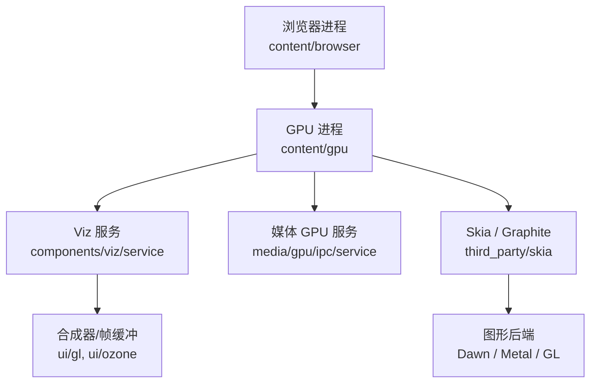
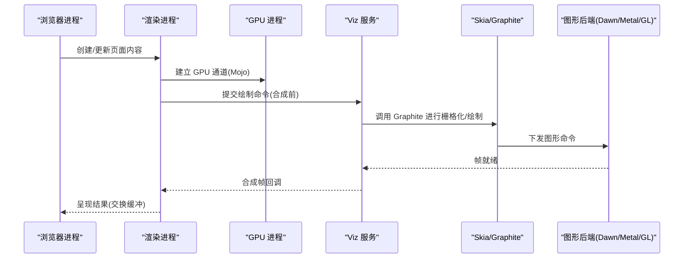
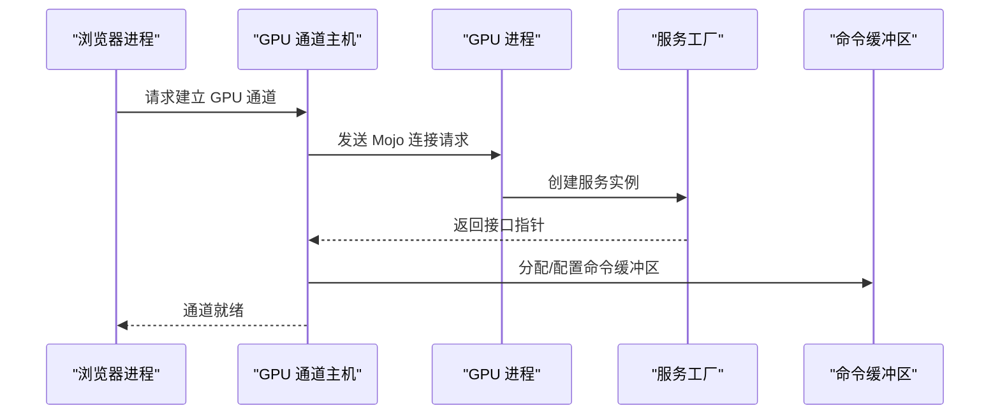
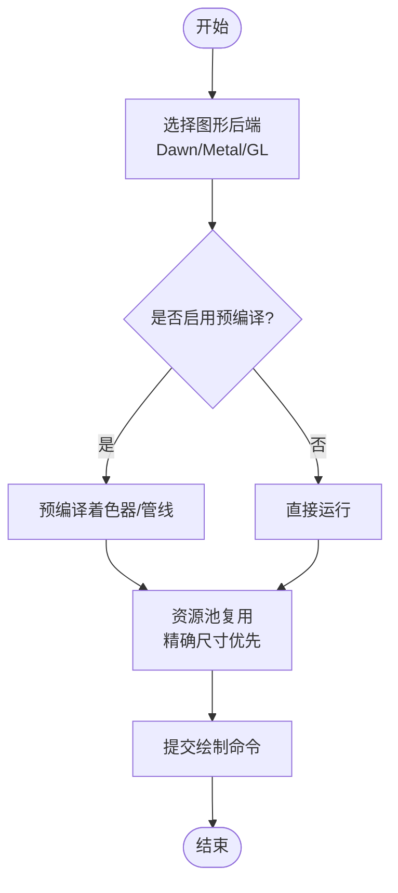
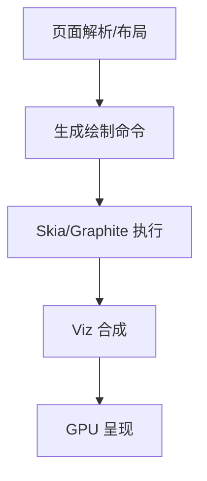
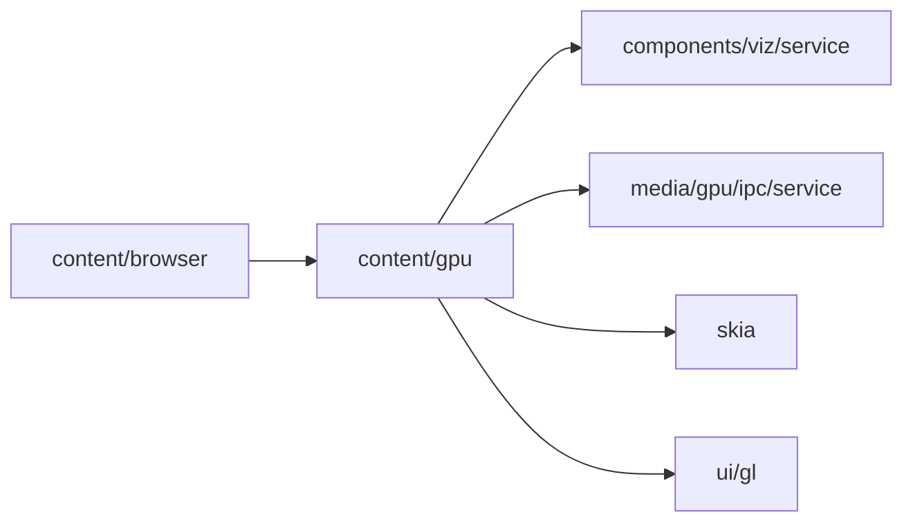

# 渲染管线概述

本文引用的文件

- [src/content/gpu/BUILD.gn](https://github.com/Mcloud136/Mcloud-Browser/blob/main/src/content/gpu/BUILD.gn)
- [infra/args.list](https://github.com/Mcloud136/Mcloud-Browser/blob/main/infra/args.list)
- [docs/CMDLINE_FLAGS_LIST.md](https://github.com/Mcloud136/Mcloud-Browser/blob/main/docs/CMDLINE_FLAGS_LIST.md)
- [docs/superpowers/specs/2026-06-19-performance-optimization-design.md](https://github.com/Mcloud136/Mcloud-Browser/blob/main/docs/superpowers/specs/2026-06-19-performance-optimization-design.md)
- [docs/superpowers/specs/2026-06-20-release-notes-m150.md](https://github.com/Mcloud136/Mcloud-Browser/blob/main/docs/superpowers/specs/2026-06-20-release-notes-m150.md)
- [src/content/browser/BUILD.gn](https://github.com/Mcloud136/Mcloud-Browser/blob/main/src/content/browser/BUILD.gn)

## 目录
1. [简介](#简介)
2. [项目结构](#项目结构)
3. [核心组件](#核心组件)
4. [架构总览](#架构总览)
5. [详细组件分析](#详细组件分析)
6. [依赖关系分析](#依赖关系分析)
7. [性能考量](#性能考量)
8. [故障排查指南](#故障排查指南)
9. [结论](#结论)
10. [附录](#附录)

## 简介
本概述面向 MCloud Browser 的 GPU 渲染管线，目标是帮助开发者理解从 CPU 到 GPU 的完整渲染流程：页面解析、布局计算、绘制命令生成与提交、合成与呈现。文档重点说明 Skia Graphite 架构在 Chromium 中的集成方式与性能优化点，并对比传统 Skia 渲染器的差异；同时梳理 GPU 进程与浏览器进程的通信机制（IPC/Mojo）、同步策略与关键标志位对渲染行为的影响。文末提供架构图与数据流图，便于快速把握整体设计思路。

## 项目结构
MCloud Browser 基于 Chromium 构建，GPU 渲染相关代码主要分布在 content 层与 GPU 子系统中：
- content/gpu：GPU 进程入口与服务工厂，负责启动 GPU 服务、绑定 Mojo 接口、与 viz/media 子系统协作。
- content/browser：浏览器侧 GPU 通道管理、特征检测、进程主机等，驱动渲染进程与 GPU 进程建立连接。
- skia/features：Skia Graphite 后端开关（Dawn/Metal/GL）与实验特性开关。
- 命令行与 GN 参数：通过 --enable-features 与 gn args 控制渲染路径与优化项。

图表来源
- [src/content/gpu/BUILD.gn:48-84](https://github.com/Mcloud136/Mcloud-Browser/blob/main/src/content/gpu/BUILD.gn#L48-L84)
- [src/content/browser/BUILD.gn:1148-1175](https://github.com/Mcloud136/Mcloud-Browser/blob/main/src/content/browser/BUILD.gn#L1148-L1175)
- [infra/args.list:4880-4891](https://github.com/Mcloud136/Mcloud-Browser/blob/main/infra/args.list#L4880-L4891)

章节来源
- [src/content/gpu/BUILD.gn:1-138](https://github.com/Mcloud136/Mcloud-Browser/blob/main/src/content/gpu/BUILD.gn#L1-L138)
- [src/content/browser/BUILD.gn:1148-1175](https://github.com/Mcloud136/Mcloud-Browser/blob/main/src/content/browser/BUILD.gn#L1148-L1175)
- [infra/args.list:4880-4891](https://github.com/Mcloud136/Mcloud-Browser/blob/main/infra/args.list#L4880-L4891)

## 核心组件
- GPU 进程与入口
  - 负责初始化 GPU 服务、创建命令缓冲区、绑定 Mojo 接口，并与 Viz 和 Media 服务交互。
  - 关键源文件包括 gpu_main、gpu_service_factory、in_process_gpu_thread 等。
- 浏览器侧 GPU 通道与调度
  - 管理 GPU 进程生命周期、通道建立、特性探测与降级策略。
  - 包含 GPU 客户端委托、数据管理器、主线程工厂等。
- Skia Graphite 后端
  - 通过 gn 参数启用 Dawn/Metal 后端，用于现代图形 API 的抽象与加速。
  - 配合预编译管线、资源池复用等优化减少卡顿与内存碎片。
- 合成与呈现
  - 由 Viz 服务完成图层合成、帧打包与提交，最终通过 ui/gl 或平台窗口系统呈现。

章节来源
- [src/content/gpu/BUILD.gn:33-84](https://github.com/Mcloud136/Mcloud-Browser/blob/main/src/content/gpu/BUILD.gn#L33-L84)
- [src/content/browser/BUILD.gn:1148-1175](https://github.com/Mcloud136/Mcloud-Browser/blob/main/src/content/browser/BUILD.gn#L1148-L1175)
- [infra/args.list:4880-4891](https://github.com/Mcloud136/Mcloud-Browser/blob/main/infra/args.list#L4880-L4891)

## 架构总览
下图展示从浏览器进程到 GPU 进程的端到端渲染路径，以及 Skia Graphite 在后端的角色。

图表来源
- [src/content/gpu/BUILD.gn:48-84](https://github.com/Mcloud136/Mcloud-Browser/blob/main/src/content/gpu/BUILD.gn#L48-L84)
- [infra/args.list:4880-4891](https://github.com/Mcloud136/Mcloud-Browser/blob/main/infra/args.list#L4880-L4891)

## 详细组件分析

### GPU 进程与浏览器进程通信（IPC/Mojo）
- 通道建立
  - 浏览器侧通过 GPU 通道工厂与客户端委托发起连接，GPU 进程侧通过服务工厂接收并绑定接口。
- 消息传递
  - 使用 Mojo 定义的服务接口，传输命令缓冲区、资源句柄、状态查询等。
- 同步策略
  - 通过命令缓冲区切片大小、SwapBuffers 阻塞时间测量、硬件覆盖层等手段降低上下文切换与等待开销。

图表来源
- [src/content/browser/BUILD.gn:1148-1175](https://github.com/Mcloud136/Mcloud-Browser/blob/main/src/content/browser/BUILD.gn#L1148-L1175)
- [src/content/gpu/BUILD.gn:48-84](https://github.com/Mcloud136/Mcloud-Browser/blob/main/src/content/gpu/BUILD.gn#L48-L84)

章节来源
- [src/content/browser/BUILD.gn:1148-1175](https://github.com/Mcloud136/Mcloud-Browser/blob/main/src/content/browser/BUILD.gn#L1148-L1175)
- [src/content/gpu/BUILD.gn:48-84](https://github.com/Mcloud136/Mcloud-Browser/blob/main/src/content/gpu/BUILD.gn#L48-L84)

### Skia Graphite 架构与优化
- 后端选择
  - 通过 gn 参数启用 Dawn/Metal 后端，以获得更现代的图形 API 支持。
- 预编译管线
  - 开启预编译渲染管线，消除首次使用着色器编译导致的卡顿。
- 资源池优化
  - 优先复用精确大小的资源，减少 GPU 内存碎片。
- 与传统 Skia 的区别
  - Graphite 提供更强的跨后端一致性与更好的并行性，结合命令缓冲区切片增大减少上下文切换。

图表来源
- [infra/args.list:4880-4891](https://github.com/Mcloud136/Mcloud-Browser/blob/main/infra/args.list#L4880-L4891)
- [docs/superpowers/specs/2026-06-20-release-notes-m150.md:167-173](https://github.com/Mcloud136/Mcloud-Browser/blob/main/docs/superpowers/specs/2026-06-20-release-notes-m150.md#L167-L173)

章节来源
- [infra/args.list:4880-4891](https://github.com/Mcloud136/Mcloud-Browser/blob/main/infra/args.list#L4880-L4891)
- [docs/superpowers/specs/2026-06-20-release-notes-m150.md:167-173](https://github.com/Mcloud136/Mcloud-Browser/blob/main/docs/superpowers/specs/2026-06-20-release-notes-m150.md#L167-L173)

### 渲染管线阶段（页面解析→布局→绘制→合成→呈现）
- 页面解析与布局
  - 由 Blink 完成 DOM/CSSOM 构建与布局计算，生成绘制指令。
- 绘制命令生成
  - 将布局结果转换为 Skia 绘制命令，Graphite 后端负责高效执行。
- 合成与呈现
  - Viz 服务将图层合成，提交至 GPU 后端，最终交换缓冲显示。

[本节为概念性流程说明，不直接分析具体文件]

## 依赖关系分析
- content/gpu 依赖 components/viz/service、media/gpu/ipc/service、skia、ui/gl 等模块，形成 GPU 渲染的核心链路。
- content/browser 提供 GPU 通道管理与特性检测，确保渲染进程与 GPU 进程正确协作。
- gn 参数与命令行标志影响后端选择与优化开关。

图表来源
- [src/content/gpu/BUILD.gn:48-84](https://github.com/Mcloud136/Mcloud-Browser/blob/main/src/content/gpu/BUILD.gn#L48-L84)
- [src/content/browser/BUILD.gn:1148-1175](https://github.com/Mcloud136/Mcloud-Browser/blob/main/src/content/browser/BUILD.gn#L1148-L1175)

章节来源
- [src/content/gpu/BUILD.gn:48-84](https://github.com/Mcloud136/Mcloud-Browser/blob/main/src/content/gpu/BUILD.gn#L48-L84)
- [src/content/browser/BUILD.gn:1148-1175](https://github.com/Mcloud136/Mcloud-Browser/blob/main/src/content/browser/BUILD.gn#L1148-L1175)

## 性能考量
- 命令缓冲区切片增大
  - 增加每次解析的命令条数，减少上下文切换开销。
- 预编译渲染管线
  - 提前编译着色器，避免首帧卡顿。
- 资源池复用
  - 优先复用精确尺寸资源，降低 GPU 内存碎片。
- 高帧率请求
  - 允许客户端请求更高帧率，适配高刷显示器。
- 早期 GPU 通道发送
  - 渲染进程初始化时提前发送 GPU 通道，缩短启动延迟。
- 延迟推测性渲染帧创建
  - 推迟不必要的帧创建，节省约 2ms。

章节来源
- [docs/superpowers/specs/2026-06-20-release-notes-m150.md:167-173](https://github.com/Mcloud136/Mcloud-Browser/blob/main/docs/superpowers/specs/2026-06-20-release-notes-m150.md#L167-L173)
- [docs/superpowers/specs/2026-06-19-performance-optimization-design.md:69-76](https://github.com/Mcloud136/Mcloud-Browser/blob/main/docs/superpowers/specs/2026-06-19-performance-optimization-design.md#L69-L76)

## 故障排查指南
- 启用 GPU 日志与追踪
  - 使用命令行标志开启 GPU 客户端/服务端日志、GL 调用追踪、驱动调试消息等，便于定位问题。
- 沙箱与上下文丢失
  - 调整 GPU 沙箱策略与上下文丢失处理，确保稳定性。
- 进程内 GPU 模式
  - 测试时可启用进程内 GPU 模式，简化调试环境。

章节来源
- [docs/CMDLINE_FLAGS_LIST.md:1616-1712](https://github.com/Mcloud136/Mcloud-Browser/blob/main/docs/CMDLINE_FLAGS_LIST.md#L1616-L1712)

## 结论
MCloud Browser 的 GPU 渲染管线以 Chromium 的 content/gpu 为核心，借助 Skia Graphite 的现代后端与优化策略，显著提升了渲染性能与稳定性。通过合理的 IPC 设计与参数调优，能够在多平台环境下实现高效的页面呈现。建议在生产环境中根据设备能力与业务需求，合理启用预编译、资源池复用与高帧率等特性，并结合日志与追踪工具持续优化。

## 附录
- 常用标志参考
  - GPU 日志与追踪、沙箱策略、进程内 GPU 模式等详见命令行标志列表。
- 构建与运行时开关
  - gn 参数与 enable-features 可灵活控制后端与优化项。

章节来源
- [docs/CMDLINE_FLAGS_LIST.md:1616-1712](https://github.com/Mcloud136/Mcloud-Browser/blob/main/docs/CMDLINE_FLAGS_LIST.md#L1616-L1712)
- [infra/args.list:4880-4891](https://github.com/Mcloud136/Mcloud-Browser/blob/main/infra/args.list#L4880-L4891)