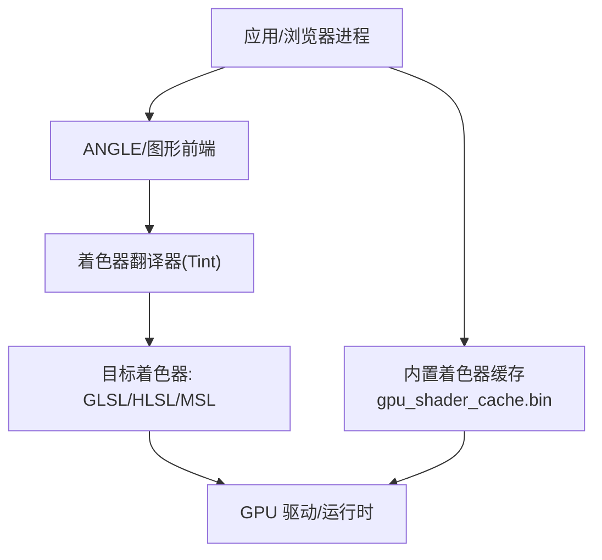
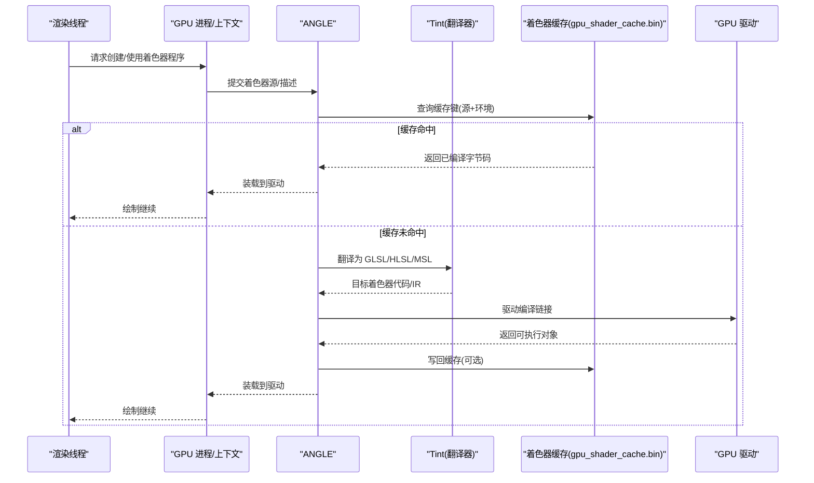
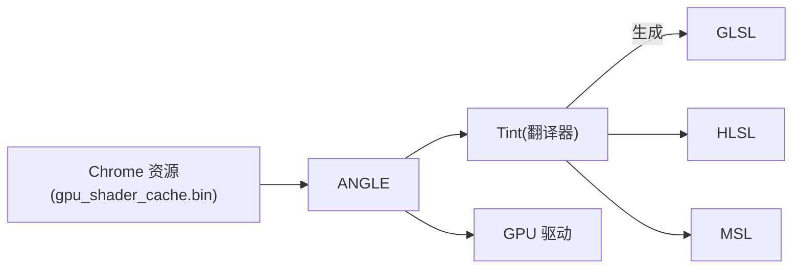

# 着色器编译优化

本文引用的文件

- [src/chrome/BUILD.gn](https://github.com/Mcloud136/Mcloud-Browser/blob/main/src/chrome/BUILD.gn)
- [infra/gn_args.list](https://github.com/Mcloud136/Mcloud-Browser/blob/main/infra/gn_args.list)
- [other/Mac/mac_args.list](https://github.com/Mcloud136/Mcloud-Browser/blob/main/other/Mac/mac_args.list)
- [infra/win_gn_args.list](https://github.com/Mcloud136/Mcloud-Browser/blob/main/infra/win_gn_args.list)
- [infra/CMDLINE_FLAGS_LIST.md](https://github.com/Mcloud136/Mcloud-Browser/blob/main/infra/CMDLINE_FLAGS_LIST.md)
- [docs/CMDLINE_FLAGS_LIST.md](https://github.com/Mcloud136/Mcloud-Browser/blob/main/docs/CMDLINE_FLAGS_LIST.md)
- [benchmark/tools/diag_igpu_green_screen.ps1](https://github.com/Mcloud136/Mcloud-Browser/blob/main/benchmark/tools/diag_igpu_green_screen.ps1)

## 目录
1. [简介](#简介)
2. [项目结构](#项目结构)
3. [核心组件](#核心组件)
4. [架构总览](#架构总览)
5. [详细组件分析](#详细组件分析)
6. [依赖关系分析](#依赖关系分析)
7. [性能考量](#性能考量)
8. [故障排查指南](#故障排查指南)
9. [结论](#结论)
10. [附录](#附录)

## 简介
本文件围绕着色器编译优化展开，聚焦于 Skia Graphite 的预编译机制、着色器代码分析与依赖解析、预编译缓存策略，以及如何通过异步编译、增量更新与热重载消除卡顿。同时说明多 GPU 厂商着色器格式（GLSL、HLSL、Metal Shading Language）的兼容性处理，并给出着色器性能分析与调试工具的使用建议。内容基于仓库中的构建配置、命令行开关与平台相关资源进行归纳与解读。

## 项目结构
本项目在多个 GN 参数文件中启用了着色器翻译与写入器（Tint），并在不同平台下启用或禁用特定后端（如 Metal、GLSL、HLSL）。此外，Chrome 打包阶段会内嵌 ANGLE 的 GPU 着色器缓存二进制，以加速首次运行时的着色器加载。

图表来源
- [src/chrome/BUILD.gn:938-951](https://github.com/Mcloud136/Mcloud-Browser/blob/main/src/chrome/BUILD.gn#L938-L951)
- [infra/gn_args.list:5217-5253](https://github.com/Mcloud136/Mcloud-Browser/blob/main/infra/gn_args.list#L5217-L5253)
- [other/Mac/mac_args.list:245-289](https://github.com/Mcloud136/Mcloud-Browser/blob/main/other/Mac/mac_args.list#L245-L289)

章节来源
- [src/chrome/BUILD.gn:938-951](https://github.com/Mcloud136/Mcloud-Browser/blob/main/src/chrome/BUILD.gn#L938-L951)
- [infra/gn_args.list:5217-5253](https://github.com/Mcloud136/Mcloud-Browser/blob/main/infra/gn_args.list#L5217-L5253)
- [other/Mac/mac_args.list:245-289](https://github.com/Mcloud136/Mcloud-Browser/blob/main/other/Mac/mac_args.list#L245-L289)

## 核心组件
- Tint 着色器翻译与验证：
  - 启用 GLSL/HLSL/MSL 写入器与 IR 二进制生成，用于将中间表示转换为各平台目标语言。
  - 参考 gn 参数中 tint_build_* 系列选项。
- ANGLE 前端与后端：
  - 在不同平台启用/禁用 GLSL、HLSL、Metal 等后端能力，影响着色器翻译路径与目标格式。
- Chrome 内置着色器缓存：
  - 将 ANGLE 的 gpu_shader_cache.bin 打包进应用资源，减少首次启动时着色器编译延迟。

章节来源
- [infra/gn_args.list:5217-5253](https://github.com/Mcloud136/Mcloud-Browser/blob/main/infra/gn_args.list#L5217-L5253)
- [other/Mac/mac_args.list:245-289](https://github.com/Mcloud136/Mcloud-Browser/blob/main/other/Mac/mac_args.list#L245-L289)
- [infra/win_gn_args.list:276-321](https://github.com/Mcloud136/Mcloud-Browser/blob/main/infra/win_gn_args.list#L276-L321)
- [src/chrome/BUILD.gn:938-951](https://github.com/Mcloud136/Mcloud-Browser/blob/main/src/chrome/BUILD.gn#L938-L951)

## 架构总览
下图展示了从渲染管线到着色器编译与缓存的整体流程，包括翻译、目标格式选择、缓存命中与回退路径。

图表来源
- [infra/gn_args.list:5217-5253](https://github.com/Mcloud136/Mcloud-Browser/blob/main/infra/gn_args.list#L5217-L5253)
- [other/Mac/mac_args.list:245-289](https://github.com/Mcloud136/Mcloud-Browser/blob/main/other/Mac/mac_args.list#L245-L289)
- [src/chrome/BUILD.gn:938-951](https://github.com/Mcloud136/Mcloud-Browser/blob/main/src/chrome/BUILD.gn#L938-L951)

## 详细组件分析

### 着色器翻译与目标格式（GLSL/HLSL/MSL）
- Tint 支持多种写入器：
  - GLSL 写入器：用于 OpenGL/Vulkan 生态的目标语言。
  - HLSL 写入器：用于 Direct3D 生态的目标语言。
  - MSL 写入器：用于 Apple Metal 生态的目标语言。
- 平台差异：
  - macOS 默认启用 Metal 后端并通过 SPIR-V 转 MSL。
  - Windows/Linux 上根据构建参数启用/禁用 GLSL/HLSL/Metal 后端。
- 构建开关：
  - tint_build_glsl_writer/hlsl_writer/msl_writer 控制是否包含对应写入器。
  - angle_enable_glsl/hlsl/metal 控制 ANGLE 后端能力。

章节来源
- [infra/gn_args.list:5217-5253](https://github.com/Mcloud136/Mcloud-Browser/blob/main/infra/gn_args.list#L5217-L5253)
- [other/Mac/mac_args.list:245-289](https://github.com/Mcloud136/Mcloud-Browser/blob/main/other/Mac/mac_args.list#L245-L289)
- [infra/win_gn_args.list:276-321](https://github.com/Mcloud136/Mcloud-Browser/blob/main/infra/win_gn_args.list#L276-L321)

### 预编译缓存策略（gpu_shader_cache.bin）
- Chrome 在打包时将 ANGLE 的 gpu_shader_cache.bin 作为资源嵌入，用于加速首次运行时的着色器加载。
- 该缓存通常由 ANGLE 在运行期生成或维护，浏览器侧负责将其随应用分发，以减少冷启动卡顿。
- 若需要调整缓存大小或行为，可通过 GPU 相关命令行开关进行控制（见“命令行开关”小节）。

章节来源
- [src/chrome/BUILD.gn:938-951](https://github.com/Mcloud136/Mcloud-Browser/blob/main/src/chrome/BUILD.gn#L938-L951)

### 消除着色器编译卡顿的策略
- 异步编译：
  - 利用 GPU 进程的后台任务队列，将着色器编译从主渲染线程卸载，避免阻塞 UI。
  - 结合命令开关关闭或调整 GPU 程序缓存，观察对卡顿的影响。
- 增量更新：
  - 通过着色器源码哈希与环境指纹（驱动版本、特性集）作为缓存键，仅重编译变更部分。
  - 借助 Tint 的 IR 二进制与写入器组合，降低重复翻译成本。
- 热重载：
  - 开发阶段可启用 GPU 跟踪/帧捕获等调试功能，快速定位着色器问题并迭代。
  - 使用内置缓存与翻译器，实现局部重新编译与替换。

章节来源
- [infra/CMDLINE_FLAGS_LIST.md:700-730](https://github.com/Mcloud136/Mcloud-Browser/blob/main/infra/CMDLINE_FLAGS_LIST.md#L700-L730)
- [docs/CMDLINE_FLAGS_LIST.md:700-730](https://github.com/Mcloud136/Mcloud-Browser/blob/main/docs/CMDLINE_FLAGS_LIST.md#L700-L730)
- [infra/gn_args.list:5217-5253](https://github.com/Mcloud136/Mcloud-Browser/blob/main/infra/gn_args.list#L5217-L5253)

### 多 GPU 厂商兼容性与后端选择
- macOS：
  - 默认启用 Metal 后端，并通过 SPIR-V 转 MSL，确保在 Apple 设备上的高效着色器执行。
- Windows/Linux：
  - 根据构建参数启用 GLSL/HLSL 后端；Metal 后端在 Windows/Linux 上默认关闭。
- 切换与回退：
  - 通过 ANGLE 后端开关与 Tint 写入器组合，适配不同厂商驱动与 API 偏好。

章节来源
- [other/Mac/mac_args.list:245-289](https://github.com/Mcloud136/Mcloud-Browser/blob/main/other/Mac/mac_args.list#L245-L289)
- [infra/win_gn_args.list:276-321](https://github.com/Mcloud136/Mcloud-Browser/blob/main/infra/win_gn_args.list#L276-L321)
- [infra/gn_args.list:5217-5253](https://github.com/Mcloud136/Mcloud-Browser/blob/main/infra/gn_args.list#L5217-L5253)

### 着色器性能分析与调试工具
- GPU 程序缓存开关：
  - 可通过命令行开关控制 GPU 程序缓存的启用/禁用与大小限制，辅助定位编译瓶颈。
- 帧捕获与跟踪：
  - 启用 ANGLE 的帧捕获与跟踪事件，便于观察着色器编译与绘制耗时。
- 核显绿屏/花屏二分定位工具：
  - 提供受控启动配置的脚本化二分法，帮助隔离显示管线问题层级。

章节来源
- [infra/CMDLINE_FLAGS_LIST.md:700-730](https://github.com/Mcloud136/Mcloud-Browser/blob/main/infra/CMDLINE_FLAGS_LIST.md#L700-L730)
- [docs/CMDLINE_FLAGS_LIST.md:700-730](https://github.com/Mcloud136/Mcloud-Browser/blob/main/docs/CMDLINE_FLAGS_LIST.md#L700-L730)
- [benchmark/tools/diag_igpu_green_screen.ps1:1-23](https://github.com/Mcloud136/Mcloud-Browser/blob/main/benchmark/tools/diag_igpu_green_screen.ps1#L1-L23)

## 依赖关系分析
- Tint 与 ANGLE：
  - Tint 提供着色器翻译能力，ANGLE 负责前端 API 调用与后端调度。
- Chrome 资源与缓存：
  - Chrome 将 gpu_shader_cache.bin 作为资源打包，运行时由 ANGLE/GPU 层消费。
- 平台后端：
  - 不同平台通过 gn 参数控制 GLSL/HLSL/Metal 后端的可用性，影响着色器目标格式与编译路径。

图表来源
- [infra/gn_args.list:5217-5253](https://github.com/Mcloud136/Mcloud-Browser/blob/main/infra/gn_args.list#L5217-L5253)
- [src/chrome/BUILD.gn:938-951](https://github.com/Mcloud136/Mcloud-Browser/blob/main/src/chrome/BUILD.gn#L938-L951)
- [other/Mac/mac_args.list:245-289](https://github.com/Mcloud136/Mcloud-Browser/blob/main/other/Mac/mac_args.list#L245-L289)

章节来源
- [infra/gn_args.list:5217-5253](https://github.com/Mcloud136/Mcloud-Browser/blob/main/infra/gn_args.list#L5217-L5253)
- [src/chrome/BUILD.gn:938-951](https://github.com/Mcloud136/Mcloud-Browser/blob/main/src/chrome/BUILD.gn#L938-L951)
- [other/Mac/mac_args.list:245-289](https://github.com/Mcloud136/Mcloud-Browser/blob/main/other/Mac/mac_args.list#L245-L289)

## 性能考量
- 首次启动卡顿：
  - 通过内置 gpu_shader_cache.bin 减少冷启动时的着色器编译时间。
- 运行期卡顿：
  - 合理设置 GPU 程序缓存大小，避免频繁重建导致抖动。
  - 使用异步编译与增量更新，降低主线程阻塞。
- 平台差异：
  - macOS 优先使用 Metal 后端以获得更好的着色器编译与执行效率。
  - Windows/Linux 根据驱动与 API 选择 GLSL/HLSL 后端，必要时启用 SwiftShader 作为回退。

[本节为通用性能讨论，不直接分析具体文件]

## 故障排查指南
- 着色器编译卡顿：
  - 检查 GPU 程序缓存开关与大小限制，确认是否因缓存失效导致频繁编译。
  - 使用 ANGLE 跟踪与帧捕获工具，定位着色器编译热点。
- 核显绿屏/花屏：
  - 使用二分定位脚本，逐步排除 DComp/MPO overlay、D3D12 解码输出、硬件 overlay 平面等问题层级。
- 平台兼容性问题：
  - 调整 ANGLE 后端开关（GLSL/HLSL/Metal），验证不同后端下的着色器行为。

章节来源
- [infra/CMDLINE_FLAGS_LIST.md:700-730](https://github.com/Mcloud136/Mcloud-Browser/blob/main/infra/CMDLINE_FLAGS_LIST.md#L700-L730)
- [docs/CMDLINE_FLAGS_LIST.md:700-730](https://github.com/Mcloud136/Mcloud-Browser/blob/main/docs/CMDLINE_FLAGS_LIST.md#L700-L730)
- [benchmark/tools/diag_igpu_green_screen.ps1:1-23](https://github.com/Mcloud136/Mcloud-Browser/blob/main/benchmark/tools/diag_igpu_green_screen.ps1#L1-L23)

## 结论
通过启用 Tint 的多目标写入器、选择合适的 ANGLE 后端、内嵌 gpu_shader_cache.bin 以及合理使用 GPU 程序缓存与调试工具，可以有效缓解着色器编译带来的卡顿问题。针对不同平台与 GPU 厂商，灵活切换后端与缓存策略，是保障跨平台一致体验的关键。

[本节为总结性内容，不直接分析具体文件]

## 附录
- 关键构建开关速查：
  - tint_build_glsl_writer/hlsl_writer/msl_writer：控制着色器翻译目标。
  - angle_enable_glsl/hlsl/metal：控制 ANGLE 后端能力。
  - gpu_program_cache_size_kb：控制 GPU 程序缓存大小。
- 常用调试开关：
  - disable-gpu-program-cache：关闭 GPU 程序缓存，用于对比测试。
  - enable-angle-frame-capture：启用帧捕获，辅助定位着色器问题。

章节来源
- [infra/gn_args.list:5217-5253](https://github.com/Mcloud136/Mcloud-Browser/blob/main/infra/gn_args.list#L5217-L5253)
- [infra/CMDLINE_FLAGS_LIST.md:700-730](https://github.com/Mcloud136/Mcloud-Browser/blob/main/infra/CMDLINE_FLAGS_LIST.md#L700-L730)
- [docs/CMDLINE_FLAGS_LIST.md:700-730](https://github.com/Mcloud136/Mcloud-Browser/blob/main/docs/CMDLINE_FLAGS_LIST.md#L700-L730)