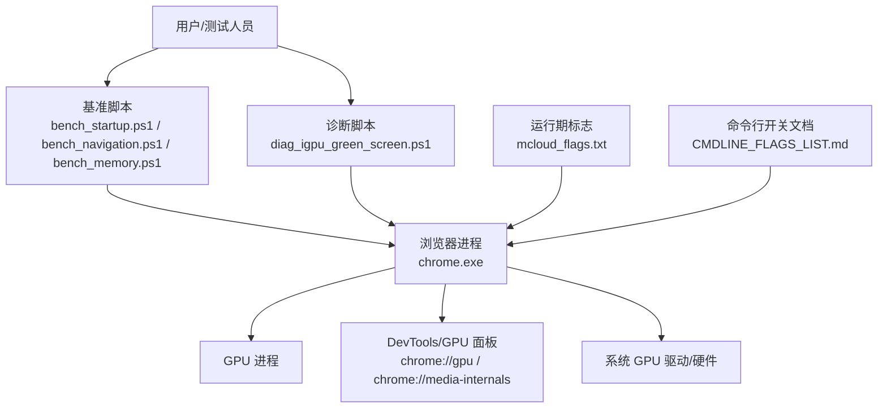
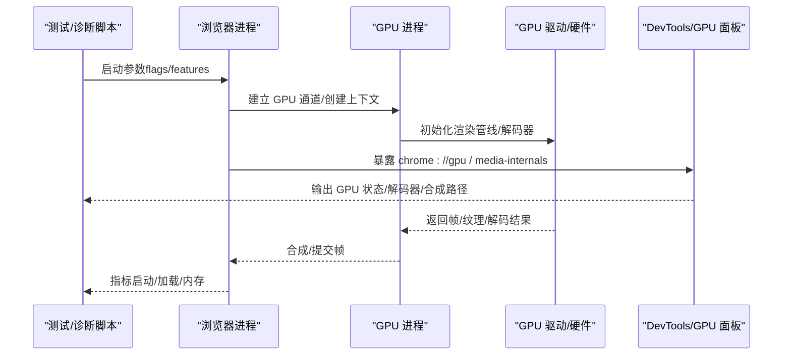
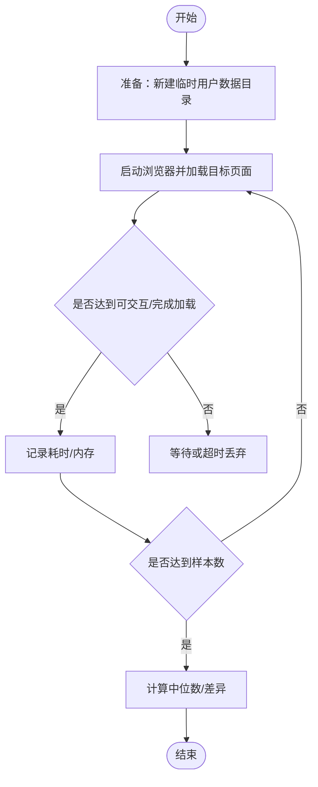
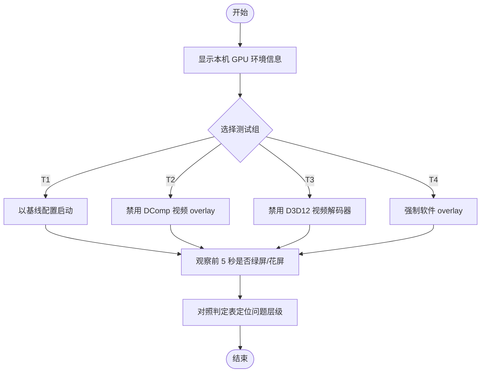
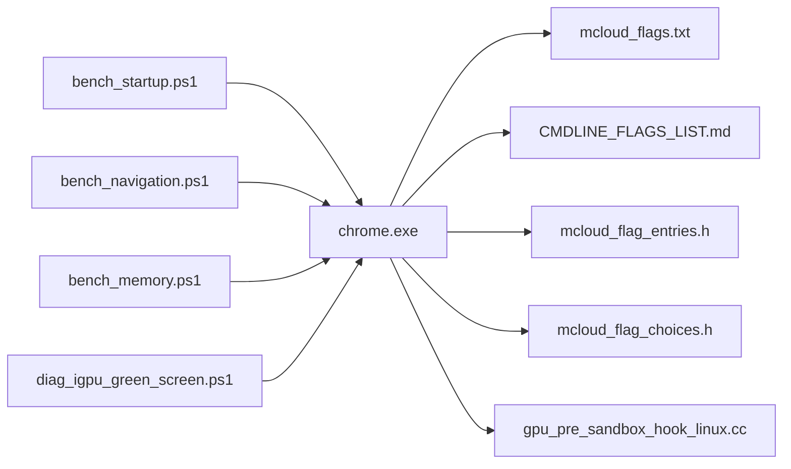

# 性能监控与调试

<cite>
**本文引用的文件**
- [README.md](file://README.md)
- [mcloud_flags.txt](file://mcloud_flags.txt)
- [bench_startup.ps1](file://benchmark/bench_startup.ps1)
- [bench_navigation.ps1](file://benchmark/bench_navigation.ps1)
- [bench_memory.ps1](file://benchmark/bench_memory.ps1)
- [diag_igpu_green_screen.ps1](file://benchmark/tools/diag_igpu_green_screen.ps1)
- [DEBUGGING.md](file://infra/DEBUG/DEBUGGING.md)
- [CMDLINE_FLAGS_LIST.md](file://docs/CMDLINE_FLAGS_LIST.md)
- [win_gn_args.list](file://infra/win_gn_args.list)
- [args.list](file://infra/args.list)
- [mcloud_flag_entries.h](file://src/chrome/browser/mcloud_flag_entries.h)
- [mcloud_flag_choices.h](file://src/chrome/browser/mcloud_flag_choices.h)
- [gpu_pre_sandbox_hook_linux.cc](file://src/content/common/gpu_pre_sandbox_hook_linux.cc)
- [2026-06-19-performance-optimization-design.md](file://docs/superpowers/specs/2026-06-19-performance-optimization-design.md)
- [M151-opt-benchmark.md](file://docs/dev-logs/M151-opt-benchmark.md)
- [benchmark-template.md](file://docs/dev-logs/benchmark-template.md)
</cite>

## 目录
1. [简介](#简介)
2. [项目结构](#项目结构)
3. [核心组件](#核心组件)
4. [架构总览](#架构总览)
5. [详细组件分析](#详细组件分析)
6. [依赖关系分析](#依赖关系分析)
7. [性能注意事项](#性能注意事项)
8. [故障排查指南](#故障排查指南)
9. [结论](#结论)
10. [附录](#附录)

## 简介
本文件面向 MCloud Browser 的 GPU 渲染性能监控与调试，覆盖以下主题：
- 使用 Chrome DevTools GPU 面板、GPU 内存分析器等工具进行性能分析与问题定位。
- 识别与定位渲染瓶颈：GPU 利用率、帧时间、内存泄漏检测等。
- 诊断流程与常见问题解决方案（含视频绿屏/花屏、合成路径异常、驱动兼容性问题）。
- 基准测试工具集成与使用：启动时间、页面加载、内存峰值等。
- GPU 驱动兼容性测试与故障排除。

## 项目结构
本项目在 benchmark 目录下提供可复用的性能基准脚本；在 infra/DEBUG 下提供调试与日志指引；在 src/chrome 与 src/content 中暴露了与 GPU 相关的命令行开关与特性标志；根目录 mcloud_flags.txt 集中管理运行时优化标志。

图表来源
- [bench_startup.ps1:1-70](file://benchmark/bench_startup.ps1#L1-L70)
- [bench_navigation.ps1:1-109](file://benchmark/bench_navigation.ps1#L1-L109)
- [bench_memory.ps1:1-78](file://benchmark/bench_memory.ps1#L1-L78)
- [diag_igpu_green_screen.ps1:1-105](file://benchmark/tools/diag_igpu_green_screen.ps1#L1-L105)
- [mcloud_flags.txt:1-120](file://mcloud_flags.txt#L1-L120)
- [CMDLINE_FLAGS_LIST.md:1616-1646](file://docs/CMDLINE_FLAGS_LIST.md#L1616-L1646)

章节来源
- [bench_startup.ps1:1-70](file://benchmark/bench_startup.ps1#L1-L70)
- [bench_navigation.ps1:1-109](file://benchmark/bench_navigation.ps1#L1-L109)
- [bench_memory.ps1:1-78](file://benchmark/bench_memory.ps1#L1-L78)
- [diag_igpu_green_screen.ps1:1-105](file://benchmark/tools/diag_igpu_green_screen.ps1#L1-L105)
- [mcloud_flags.txt:1-120](file://mcloud_flags.txt#L1-L120)
- [CMDLINE_FLAGS_LIST.md:1616-1646](file://docs/CMDLINE_FLAGS_LIST.md#L1616-L1646)

## 核心组件
- 基准测试套件
  - K1 冷启动时间：通过全新临时用户数据目录启动并等待首屏可交互，统计中位数耗时。
  - K2 内存峰值：固定标签集驻留后汇总所有浏览器进程的 WorkingSet64，取中位数。
  - 导航响应速度：对比预载开启/关闭对页面加载时延的影响。
- GPU 诊断工具
  - 核显绿屏/花屏二分定位：通过多组受控启动配置快速隔离问题层级（DComp overlay、D3D12 解码器、软件 overlay）。
- 运行期优化标志
  - mcloud_flags.txt 集中启用 GPU 光栅化、Canvas OOP Rasterization、DirectComposition、Skia Graphite、资源池复用、高帧率请求等。
- 命令行开关与特性
  - --gpu-launcher、--gpu-no-context-lost、--gpu-program-cache-size-kb、--gpu-rasterization-msaa-sample-count 等用于 GPU 调试与调优。
  - 内置特性如 SendGPUChannelEarly、DeferSpeculativeRFHCreation、GpuShaderDiskCache、IncreasedCmdBufferParseSlice 等提升 GPU 通道初始化与命令缓冲解析效率。

章节来源
- [bench_startup.ps1:1-70](file://benchmark/bench_startup.ps1#L1-L70)
- [bench_memory.ps1:1-78](file://benchmark/bench_memory.ps1#L1-L78)
- [bench_navigation.ps1:1-109](file://benchmark/bench_navigation.ps1#L1-L109)
- [diag_igpu_green_screen.ps1:1-105](file://benchmark/tools/diag_igpu_green_screen.ps1#L1-L105)
- [mcloud_flags.txt:1-120](file://mcloud_flags.txt#L1-L120)
- [CMDLINE_FLAGS_LIST.md:1616-1646](file://docs/CMDLINE_FLAGS_LIST.md#L1616-L1646)

## 架构总览
下图展示了从基准/诊断脚本到浏览器、GPU 进程及系统驱动的调用链路与信息流。

图表来源
- [bench_startup.ps1:1-70](file://benchmark/bench_startup.ps1#L1-L70)
- [bench_navigation.ps1:1-109](file://benchmark/bench_navigation.ps1#L1-L109)
- [bench_memory.ps1:1-78](file://benchmark/bench_memory.ps1#L1-L78)
- [diag_igpu_green_screen.ps1:1-105](file://benchmark/tools/diag_igpu_green_screen.ps1#L1-L105)
- [CMDLINE_FLAGS_LIST.md:1616-1646](file://docs/CMDLINE_FLAGS_LIST.md#L1616-L1646)

## 详细组件分析

### 基准测试套件
- K1 冷启动时间
  - 方法：每次使用全新临时用户数据目录启动，等待主窗口输入空闲作为“首屏可交互”代理指标，记录耗时并取中位数。
  - 适用场景：评估构建变更对启动链路的影响。
- K2 内存峰值
  - 方法：打开固定数量标签页，驻留稳定后对所有浏览器进程 WorkingSet64 求和，采样多次取中位数。
  - 适用场景：评估多标签页内存占用与内存回收策略效果。
- 导航响应速度
  - 方法：同一构建对比两种模式（默认 vs 禁用预载类 feature），预热 URL 列表后测量 N 轮，取中位数并计算差异百分比。
  - 适用场景：验证预载/预连接/预测器等功能对页面加载时延的贡献。

图表来源
- [bench_startup.ps1:1-70](file://benchmark/bench_startup.ps1#L1-L70)
- [bench_navigation.ps1:1-109](file://benchmark/bench_navigation.ps1#L1-L109)
- [bench_memory.ps1:1-78](file://benchmark/bench_memory.ps1#L1-L78)

章节来源
- [bench_startup.ps1:1-70](file://benchmark/bench_startup.ps1#L1-L70)
- [bench_navigation.ps1:1-109](file://benchmark/bench_navigation.ps1#L1-L109)
- [bench_memory.ps1:1-78](file://benchmark/bench_memory.ps1#L1-L78)

### GPU 诊断工具（核显绿屏/花屏二分定位）
- 原理：绿屏通常由显示管线读取未初始化的 YUV/NV12 内容导致。通过四组受控启动配置逐步排除问题层级：
  - T1 基线：复现问题（对照组）。
  - T2 禁 DirectComposition 视频 overlay：命中则指向 DComp/MPO overlay 平面问题。
  - T3 禁 D3D12 视频解码器（回退 D3D11）：命中则指向 D3D12 解码输出问题。
  - T4 强制软件 overlay：命中而 T2 不中则指向硬件 overlay 平面（MPO）驱动问题。
- 使用方法：交互式选择测试组或直接指定，自动注入对应 flags 并启动浏览器；观察前 5 秒播放画面，并结合 chrome://media-internals 与 chrome://gpu 的 Applied Workarounds 判定。

图表来源
- [diag_igpu_green_screen.ps1:1-105](file://benchmark/tools/diag_igpu_green_screen.ps1#L1-L105)

章节来源
- [diag_igpu_green_screen.ps1:1-105](file://benchmark/tools/diag_igpu_green_screen.ps1#L1-L105)

### 运行期优化标志与 GPU 相关特性
- 启动与渲染优化
  - SendGPUChannelEarly、DeferSpeculativeRFHCreation、InitialWebUI 高优先级等减少启动阶段 GPU 通道与 UI 初始化开销。
  - 启用 GPU 光栅化、Canvas OOP Rasterization、DirectComposition、Skia Graphite、资源池精确大小复用、高帧率请求等提升渲染效率。
- 视频与解码优化
  - 针对 Intel 核显 D3D12 视频解码器首帧绿屏/花屏问题，显式禁用该 feature 回退至 D3D11VideoDecoder，确保硬解能力不受影响。
  - 调整 MSE/Video Buffer 相关特性以减少缓冲中断与解码抖动。
- 线程与调度优化
  - IO 线程类型、Mojo 专用线程、自旋锁、关闭标签页优先级提升、非重要帧降频等改善整体响应性。

章节来源
- [mcloud_flags.txt:1-120](file://mcloud_flags.txt#L1-L120)
- [2026-06-19-performance-optimization-design.md:29-98](file://docs/superpowers/specs/2026-06-19-performance-optimization-design.md#L29-L98)
- [2026-06-19-performance-optimization-design.md:179-188](file://docs/superpowers/specs/2026-06-19-performance-optimization-design.md#L179-L188)

### 命令行开关与 GPU 调试入口
- 常用 GPU 开关
  - --gpu-launcher：为 GPU 进程附加调试器或额外参数。
  - --gpu-no-context-lost：避免电源/屏保等模式下 GPU 上下文丢失导致的黑屏/粉屏。
  - --gpu-program-cache-size-kb：设置 GPU 程序缓存大小。
  - --gpu-rasterization-msaa-sample-count：控制 GPU 光栅化 MSAA 采样数。
  - --gpu-startup-dialog：GPU 进程启动时弹出对话框便于调试。
- 特性与选择项
  - gpu-no-context-lost、enable-ui-devtools 等通过特性入口暴露于 chrome://flags。
  - GPU 光栅化 MSAA 采样数、强制 GPU 可用内存等可通过选择项配置。

章节来源
- [CMDLINE_FLAGS_LIST.md:1616-1646](file://docs/CMDLINE_FLAGS_LIST.md#L1616-L1646)
- [mcloud_flag_entries.h:196-220](file://src/chrome/browser/mcloud_flag_entries.h#L196-L220)
- [mcloud_flag_choices.h:88-134](file://src/chrome/browser/mcloud_flag_choices.h#L88-L134)

### Linux GPU 沙箱与驱动预加载
- 沙箱权限与设备访问：为 GPU 子进程配置只读/读写路径，允许访问 DRM/Vulkan 相关节点与库。
- 驱动库预加载：针对 AMD、NVIDIA 等平台预加载关键驱动库，降低首次加载延迟与潜在缺失风险。

章节来源
- [gpu_pre_sandbox_hook_linux.cc:264-583](file://src/content/common/gpu_pre_sandbox_hook_linux.cc#L264-L583)

## 依赖关系分析
- 基准脚本依赖浏览器二进制与操作系统 API（进程管理、计时器、文件系统）。
- 诊断脚本依赖 Windows GPU 信息与注册表键值，以及浏览器命令行开关。
- 运行期标志依赖 Chromium 特性系统与 GPU 子系统。
- 命令行开关依赖 GPU 进程与驱动层实现。

图表来源
- [bench_startup.ps1:1-70](file://benchmark/bench_startup.ps1#L1-L70)
- [bench_navigation.ps1:1-109](file://benchmark/bench_navigation.ps1#L1-L109)
- [bench_memory.ps1:1-78](file://benchmark/bench_memory.ps1#L1-L78)
- [diag_igpu_green_screen.ps1:1-105](file://benchmark/tools/diag_igpu_green_screen.ps1#L1-L105)
- [mcloud_flags.txt:1-120](file://mcloud_flags.txt#L1-L120)
- [CMDLINE_FLAGS_LIST.md:1616-1646](file://docs/CMDLINE_FLAGS_LIST.md#L1616-L1646)
- [mcloud_flag_entries.h:196-220](file://src/chrome/browser/mcloud_flag_entries.h#L196-L220)
- [mcloud_flag_choices.h:88-134](file://src/chrome/browser/mcloud_flag_choices.h#L88-L134)
- [gpu_pre_sandbox_hook_linux.cc:264-583](file://src/content/common/gpu_pre_sandbox_hook_linux.cc#L264-L583)

章节来源
- [bench_startup.ps1:1-70](file://benchmark/bench_startup.ps1#L1-L70)
- [bench_navigation.ps1:1-109](file://benchmark/bench_navigation.ps1#L1-L109)
- [bench_memory.ps1:1-78](file://benchmark/bench_memory.ps1#L1-L78)
- [diag_igpu_green_screen.ps1:1-105](file://benchmark/tools/diag_igpu_green_screen.ps1#L1-L105)
- [mcloud_flags.txt:1-120](file://mcloud_flags.txt#L1-L120)
- [CMDLINE_FLAGS_LIST.md:1616-1646](file://docs/CMDLINE_FLAGS_LIST.md#L1616-L1646)
- [mcloud_flag_entries.h:196-220](file://src/chrome/browser/mcloud_flag_entries.h#L196-L220)
- [mcloud_flag_choices.h:88-134](file://src/chrome/browser/mcloud_flag_choices.h#L88-L134)
- [gpu_pre_sandbox_hook_linux.cc:264-583](file://src/content/common/gpu_pre_sandbox_hook_linux.cc#L264-L583)

## 性能注意事项
- 启动与渲染
  - 利用 SendGPUChannelEarly、DeferSpeculativeRFHCreation 缩短 GPU 通道与渲染帧创建延迟。
  - 启用 GPU 光栅化、Canvas OOP Rasterization、DirectComposition、Skia Graphite 提升合成与绘制效率。
- 视频与解码
  - 针对特定 GPU（如 Intel 核显）的 D3D12 视频解码器问题，采用回退策略保证稳定性。
  - 调整 MSE 缓冲与解码器缓冲区大小，减少卡顿与掉帧。
- 内存与线程
  - 启用内存压力下的标签页丢弃与分区分配优化，降低多标签页内存占用。
  - 合理设置 IO 线程类型与 Mojo 专用线程，提高 IPC 与网络处理效率。
- 构建与平台
  - 根据平台选择合适的图形后端（Windows 使用 D3D12/D3D11，Linux 使用 Vulkan/GL）。
  - 关注 ANGLE 相关 GN 参数与驱动兼容性。

章节来源
- [mcloud_flags.txt:1-120](file://mcloud_flags.txt#L1-L120)
- [2026-06-19-performance-optimization-design.md:29-98](file://docs/superpowers/specs/2026-06-19-performance-optimization-design.md#L29-L98)
- [win_gn_args.list:206-239](file://infra/win_gn_args.list#L206-L239)
- [args.list:213-244](file://infra/args.list#L213-L244)

## 故障排查指南
- 使用 DevTools 与内部页面
  - 打开 chrome://gpu 查看 GPU 信息、Applied Workarounds、驱动版本与功能支持。
  - 打开 chrome://media-internals 查看 Video Decoder、解码路径与缓冲状态。
- 日志与调试
  - 使用 --log-level=0 与 --enable-logging=stderr 输出更多日志。
  - 使用 CHROME_IPC_LOGGING=1 查看 IPC 调试消息。
  - 使用 --gpu-launcher 将 GPU 进程接入调试器进行深入分析。
- 常见问题
  - 绿屏/花屏：使用 diag_igpu_green_screen.ps1 二分定位，结合 chrome://gpu 与 chrome://media-internals 确认解码器与合成路径。
  - 上下文丢失：启用 --gpu-no-context-lost 缓解系统休眠/屏保导致的黑屏/粉屏。
  - 驱动兼容：更新 GPU 驱动或调整 GN 参数与运行期标志，必要时回退到更稳定的解码路径。
- 基准回归
  - 使用 benchmark-template.md 记录环境与原始数据，便于对比与回溯。

章节来源
- [DEBUGGING.md:463-492](file://infra/DEBUG/DEBUGGING.md#L463-L492)
- [DEBUGGING.md:163-166](file://infra/DEBUG/DEBUGGING.md#L163-L166)
- [CMDLINE_FLAGS_LIST.md:1616-1646](file://docs/CMDLINE_FLAGS_LIST.md#L1616-L1646)
- [benchmark-template.md:1-39](file://docs/dev-logs/benchmark-template.md#L1-L39)

## 结论
通过基准测试套件与 GPU 诊断工具，配合运行期优化标志与命令行开关，可以系统化地监控与调试 MCloud Browser 的 GPU 渲染性能。建议在日常开发中：
- 以 K1/K2/K7 等指标为基线，持续跟踪构建变更对启动、内存与体积的影响。
- 遇到视频与合成问题时，优先使用二分定位工具与内部页面快速锁定问题层级。
- 结合 DevTools 与日志，深入分析 GPU 进程与驱动交互，必要时调整 GN 参数与运行期标志。
- 记录完整的环境信息与原始数据，确保结果可复现与可比较。

## 附录
- 实测参考
  - 预载收益验证：导航响应与内存隔离测试结果见相关开发日志。
  - 预期收益：冷启动、内存、视频流畅度、GPU 渲染效率、IO 响应性等指标的预期提升范围。

章节来源
- [M151-opt-benchmark.md:34-52](file://docs/dev-logs/M151-opt-benchmark.md#L34-L52)
- [2026-06-19-performance-optimization-design.md:179-188](file://docs/superpowers/specs/2026-06-19-performance-optimization-design.md#L179-L188)