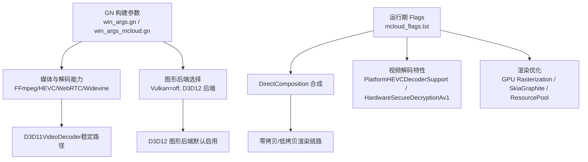
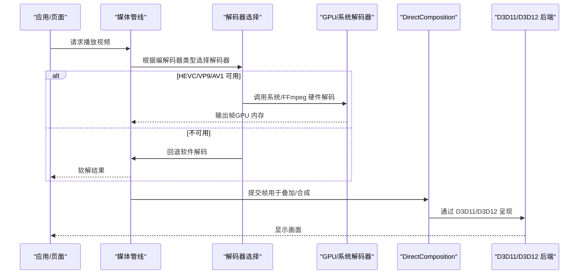
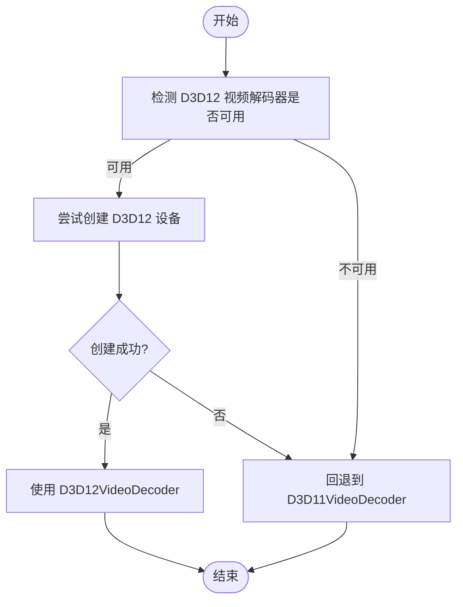
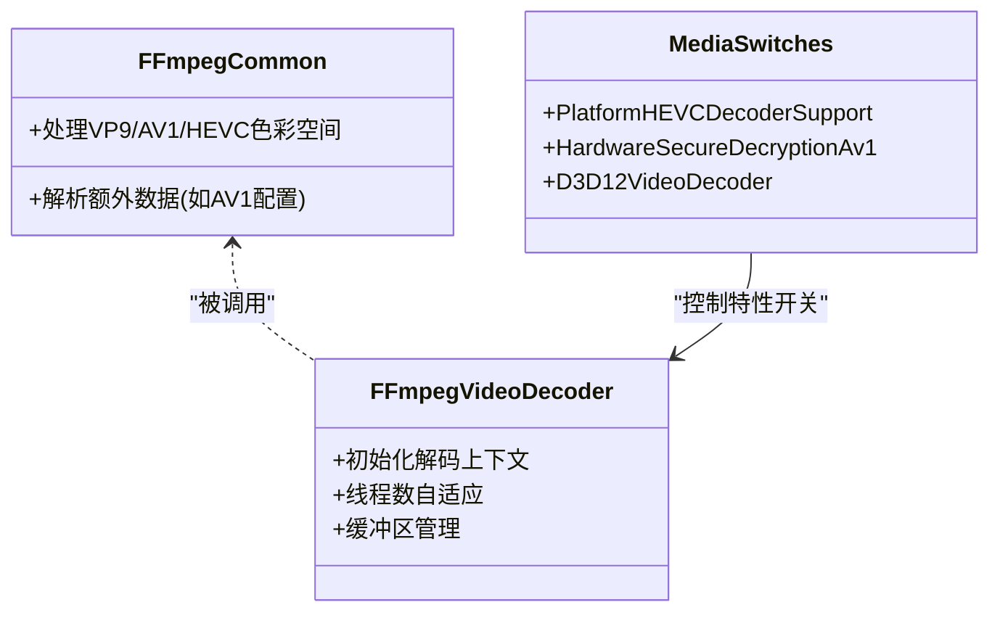
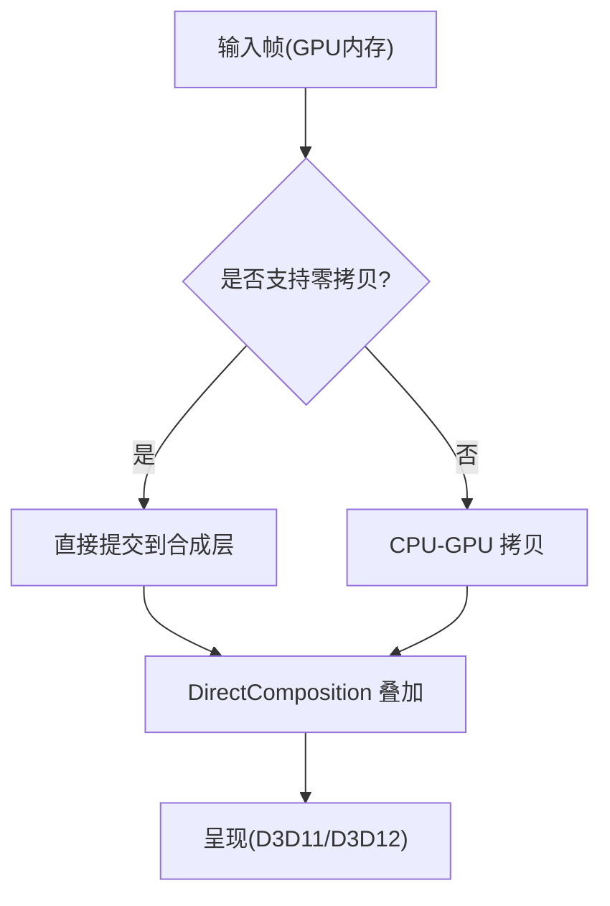
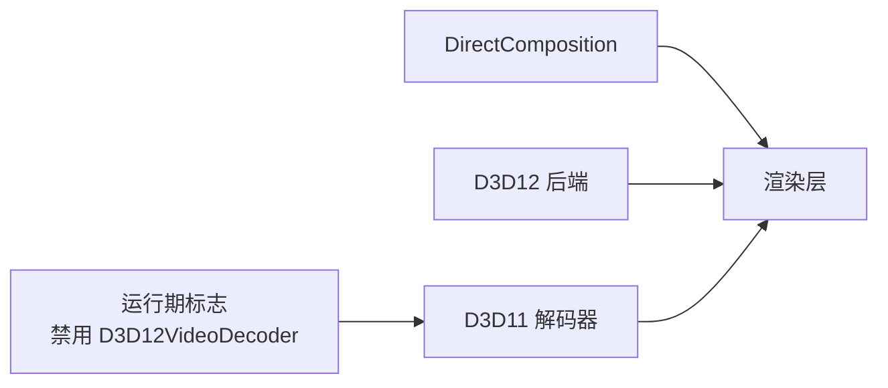
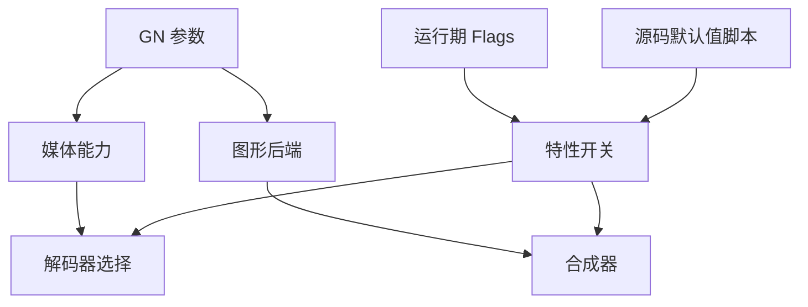

# 硬件加速

本文引用的文件

- [mcloud_flags.txt](https://github.com/Mcloud136/Mcloud-Browser/blob/main/mcloud_flags.txt)
- [win_args.gn](https://github.com/Mcloud136/Mcloud-Browser/blob/main/win_args.gn)
- [win_args_mcloud.gn](https://github.com/Mcloud136/Mcloud-Browser/blob/main/win_args_mcloud.gn)
- [README.md](https://github.com/Mcloud136/Mcloud-Browser/blob/main/README.md)
- [ffmpeg_common.cc](https://github.com/Mcloud136/Mcloud-Browser/blob/main/src/media/ffmpeg/ffmpeg_common.cc)
- [ffmpeg_video_decoder.cc](https://github.com/Mcloud136/Mcloud-Browser/blob/main/src/media/filters/ffmpeg_video_decoder.cc)
- [media_switches.cc](https://github.com/Mcloud136/Mcloud-Browser/blob/main/src/media/base/media_switches.cc)
- [apply_mcloud_source_defaults.py](https://github.com/Mcloud136/Mcloud-Browser/blob/main/win_scripts/apply_mcloud_source_defaults.py)
- [2026-06-19-performance-optimization-design.md](https://github.com/Mcloud136/Mcloud-Browser/blob/main/docs/superpowers/specs/2026-06-19-performance-optimization-design.md)
- [2026-06-20-code-review-fixes.md](https://github.com/Mcloud136/Mcloud-Browser/blob/main/docs/superpowers/specs/2026-06-20-code-review-fixes.md)
- [progress.md](https://github.com/Mcloud136/Mcloud-Browser/blob/main/docs/progress.md)
- [CMDLINE_FLAGS_LIST.md](https://github.com/Mcloud136/Mcloud-Browser/blob/main/docs/CMDLINE_FLAGS_LIST.md)
- [diag_igpu_green_screen.ps1](https://github.com/Mcloud136/Mcloud-Browser/blob/main/benchmark/tools/diag_igpu_green_screen.ps1)

## 目录
1. [简介](#简介)
2. [项目结构](#项目结构)
3. [核心组件](#核心组件)
4. [架构总览](#架构总览)
5. [详细组件分析](#详细组件分析)
6. [依赖关系分析](#依赖关系分析)
7. [性能调优指南](#性能调优指南)
8. [故障诊断与排错](#故障诊断与排错)
9. [结论](#结论)
10. [附录](#附录)

## 简介
本文件聚焦 MCloud Browser 在 Windows 平台上的视频解码硬件加速能力，覆盖 HEVC、VP9、AV1 等主流格式的硬件解码路径；阐述 GPU 内存管理与零拷贝渲染思路，以及 DirectComposition 与 D3D12/D3D11 的集成与兼容性处理；并提供可操作的硬件加速性能调优建议与常见问题排查方案。内容基于仓库中的构建参数、运行时标志、媒体管线源码片段与测试记录进行归纳总结。

## 项目结构
MCloud Browser 对硬件加速的配置由“构建期 GN 参数 + 运行期 flags”共同决定：
- 构建期：通过 win_args.gn / win_args_mcloud.gn 启用 FFmpeg、HEVC 平台解码器、WebRTC H.265、Widevine（可选）等媒体能力；同时关闭 Vulkan，Windows 侧使用 D3D12 作为图形后端。
- 运行期：通过 mcloud_flags.txt 注入大量优化开关，包括 DirectComposition、GPU 光栅化、HEVC 硬件解码支持、AV1 安全解密、MediaFoundation 批读与零拷贝捕获等；并显式禁用 D3D12VideoDecoder 以规避特定核显绿屏问题，回退到更稳定的 D3D11 解码路径。

**图表来源**
- [win_args.gn:70-80](https://github.com/Mcloud136/Mcloud-Browser/blob/main/win_args.gn#L70-L80)
- [win_args_mcloud.gn:74-113](https://github.com/Mcloud136/Mcloud-Browser/blob/main/win_args_mcloud.gn#L74-L113)
- [mcloud_flags.txt:16-105](https://github.com/Mcloud136/Mcloud-Browser/blob/main/mcloud_flags.txt#L16-L105)

**章节来源**
- [win_args.gn:1-87](https://github.com/Mcloud136/Mcloud-Browser/blob/main/win_args.gn#L1-L87)
- [win_args_mcloud.gn:1-126](https://github.com/Mcloud136/Mcloud-Browser/blob/main/win_args_mcloud.gn#L1-L126)
- [mcloud_flags.txt:1-120](https://github.com/Mcloud136/Mcloud-Browser/blob/main/mcloud_flags.txt#L1-L120)

## 核心组件
- 媒体解码与格式支持
  - FFmpeg 集成与 HEVC 平台解码器启用，确保 HEVC/H.265 可用。
  - VP9、AV1 通过系统解码器或 FFmpeg 路径参与硬解；AV1 安全解密特性开启。
  - WebRTC 启用 H.264/H.265 编码相关选项。
- 图形与合成
  - 启用 DirectComposition 以提升视频叠加与合成效率。
  - 图形后端为 D3D12（Vulkan 关闭），但视频解码器当前回退至 D3D11 以获得稳定性。
- 零拷贝与内存优化
  - MediaFoundation D3D11 视频捕获零拷贝特性启用，减少 CPU-GPU 数据拷贝。
  - 资源池复用、命令缓冲解析切片增大、Skia Graphite 预编译等降低 GPU 内存碎片与卡顿。

**章节来源**
- [win_args.gn:43-80](https://github.com/Mcloud136/Mcloud-Browser/blob/main/win_args.gn#L43-L80)
- [win_args_mcloud.gn:74-113](https://github.com/Mcloud136/Mcloud-Browser/blob/main/win_args_mcloud.gn#L74-L113)
- [mcloud_flags.txt:16-105](https://github.com/Mcloud136/Mcloud-Browser/blob/main/mcloud_flags.txt#L16-L105)
- [README.md:150-186](https://github.com/Mcloud136/Mcloud-Browser/blob/main/README.md#L150-L186)

## 架构总览
下图展示了从媒体流到最终显示的硬件加速关键路径，包含解码器选择、GPU 内存与合成环节。

**图表来源**
- [2026-06-19-performance-optimization-design.md:128-140](https://github.com/Mcloud136/Mcloud-Browser/blob/main/docs/superpowers/specs/2026-06-19-performance-optimization-design.md#L128-L140)
- [mcloud_flags.txt:21-25](https://github.com/Mcloud136/Mcloud-Browser/blob/main/mcloud_flags.txt#L21-L25)
- [win_args_mcloud.gn:112-113](https://github.com/Mcloud136/Mcloud-Browser/blob/main/win_args_mcloud.gn#L112-L113)

## 详细组件分析

### 视频解码器选择与回退
- 行为概述：当检测到 D3D12 视频解码器可用时尝试创建 D3D12 设备；若失败则回退到 D3D11VideoDecoder。
- 现状说明：尽管源码中默认启用了 D3D12VideoDecoder，但在当前硬件/驱动环境下仍回退到 D3D11；因此运行期显式禁用 D3D12VideoDecoder 以避免核显绿屏问题。
- 影响范围：H.264、VP9、AV1、HEVC 均受此路径影响。

**图表来源**
- [2026-06-19-performance-optimization-design.md:128-140](https://github.com/Mcloud136/Mcloud-Browser/blob/main/docs/superpowers/specs/2026-06-19-performance-optimization-design.md#L128-L140)
- [2026-06-20-code-review-fixes.md:63-71](https://github.com/Mcloud136/Mcloud-Browser/blob/main/docs/superpowers/specs/2026-06-20-code-review-fixes.md#L63-L71)
- [progress.md:147-155](https://github.com/Mcloud136/Mcloud-Browser/blob/main/docs/progress.md#L147-L155)

**章节来源**
- [2026-06-19-performance-optimization-design.md:128-140](https://github.com/Mcloud136/Mcloud-Browser/blob/main/docs/superpowers/specs/2026-06-19-performance-optimization-design.md#L128-L140)
- [2026-06-20-code-review-fixes.md:63-71](https://github.com/Mcloud136/Mcloud-Browser/blob/main/docs/superpowers/specs/2026-06-20-code-review-fixes.md#L63-L71)
- [progress.md:147-155](https://github.com/Mcloud136/Mcloud-Browser/blob/main/docs/progress.md#L147-L155)
- [mcloud_flags.txt:83-88](https://github.com/Mcloud136/Mcloud-Browser/blob/main/mcloud_flags.txt#L83-L88)

### HEVC/VP9/AV1 硬件解码支持
- HEVC：通过平台 HEVC 解码器支持与解析器启用，结合 FFmpeg 集成，提供硬件解码能力。
- VP9：现代 GPU 通常支持 DXVA2/D3D11 路径，浏览器自动选择合适解码器。
- AV1：通过 HardwareSecureDecryptionAv1 启用硬件安全解密，配合系统解码器实现高效播放。
- 色彩空间与元数据处理：在 FFmpeg 公共模块中对 VP9/AV1/HEVC 的色彩空间推断与修正逻辑，避免颜色偏移。

**图表来源**
- [ffmpeg_common.cc:715-768](https://github.com/Mcloud136/Mcloud-Browser/blob/main/src/media/ffmpeg/ffmpeg_common.cc#L715-L768)
- [ffmpeg_video_decoder.cc:78-119](https://github.com/Mcloud136/Mcloud-Browser/blob/main/src/media/filters/ffmpeg_video_decoder.cc#L78-L119)
- [media_switches.cc:388-388](https://github.com/Mcloud136/Mcloud-Browser/blob/main/src/media/base/media_switches.cc#L388-L388)
- [media_switches.cc:990-990](https://github.com/Mcloud136/Mcloud-Browser/blob/main/src/media/base/media_switches.cc#L990-L990)
- [media_switches.cc:1651-1651](https://github.com/Mcloud136/Mcloud-Browser/blob/main/src/media/base/media_switches.cc#L1651-L1651)

**章节来源**
- [win_args.gn:70-73](https://github.com/Mcloud136/Mcloud-Browser/blob/main/win_args.gn#L70-L73)
- [win_args_mcloud.gn:99-110](https://github.com/Mcloud136/Mcloud-Browser/blob/main/win_args_mcloud.gn#L99-L110)
- [mcloud_flags.txt:98-105](https://github.com/Mcloud136/Mcloud-Browser/blob/main/mcloud_flags.txt#L98-L105)
- [ffmpeg_common.cc:715-768](https://github.com/Mcloud136/Mcloud-Browser/blob/main/src/media/ffmpeg/ffmpeg_common.cc#L715-L768)
- [ffmpeg_video_decoder.cc:78-119](https://github.com/Mcloud136/Mcloud-Browser/blob/main/src/media/filters/ffmpeg_video_decoder.cc#L78-L119)
- [media_switches.cc:388-388](https://github.com/Mcloud136/Mcloud-Browser/blob/main/src/media/base/media_switches.cc#L388-L388)
- [media_switches.cc:990-990](https://github.com/Mcloud136/Mcloud-Browser/blob/main/src/media/base/media_switches.cc#L990-L990)
- [media_switches.cc:1651-1651](https://github.com/Mcloud136/Mcloud-Browser/blob/main/src/media/base/media_switches.cc#L1651-L1651)

### GPU 内存管理与零拷贝渲染
- 零拷贝捕获：MediaFoundation D3D11 Video Capture Zero Copy 特性启用，减少 CPU-GPU 间的数据拷贝开销。
- 资源池与命令缓冲：ResourcePoolPreferExactSizeReuse 减少 GPU 内存碎片；IncreasedCmdBufferParseSlice 降低上下文切换成本。
- 合成路径：DirectComposition 启用后，视频帧可直接叠加到合成层，减少中间拷贝。

**图表来源**
- [mcloud_flags.txt:98-105](https://github.com/Mcloud136/Mcloud-Browser/blob/main/mcloud_flags.txt#L98-L105)
- [mcloud_flags.txt:90-96](https://github.com/Mcloud136/Mcloud-Browser/blob/main/mcloud_flags.txt#L90-L96)
- [README.md:152-164](https://github.com/Mcloud136/Mcloud-Browser/blob/main/README.md#L152-L164)

**章节来源**
- [mcloud_flags.txt:90-105](https://github.com/Mcloud136/Mcloud-Browser/blob/main/mcloud_flags.txt#L90-L105)
- [README.md:152-164](https://github.com/Mcloud136/Mcloud-Browser/blob/main/README.md#L152-L164)

### DirectComposition 与 D3D12 集成及兼容性
- DirectComposition：通过运行期标志启用，提升视频叠加与合成效率。
- D3D12：图形后端默认启用，但视频解码器在当前硬件/驱动上不稳定，已显式禁用 D3D12VideoDecoder 并回退到 D3D11。
- 兼容策略：保留 D3D12 后端配置，以便未来驱动更新后可用；对已知问题机型采用运行期禁用策略。

**图表来源**
- [mcloud_flags.txt:21-25](https://github.com/Mcloud136/Mcloud-Browser/blob/main/mcloud_flags.txt#L21-L25)
- [mcloud_flags.txt:83-88](https://github.com/Mcloud136/Mcloud-Browser/blob/main/mcloud_flags.txt#L83-L88)
- [win_args_mcloud.gn:112-113](https://github.com/Mcloud136/Mcloud-Browser/blob/main/win_args_mcloud.gn#L112-L113)
- [CMDLINE_FLAGS_LIST.md:636-654](https://github.com/Mcloud136/Mcloud-Browser/blob/main/docs/CMDLINE_FLAGS_LIST.md#L636-L654)

**章节来源**
- [mcloud_flags.txt:21-25](https://github.com/Mcloud136/Mcloud-Browser/blob/main/mcloud_flags.txt#L21-L25)
- [mcloud_flags.txt:83-88](https://github.com/Mcloud136/Mcloud-Browser/blob/main/mcloud_flags.txt#L83-L88)
- [win_args_mcloud.gn:112-113](https://github.com/Mcloud136/Mcloud-Browser/blob/main/win_args_mcloud.gn#L112-L113)
- [CMDLINE_FLAGS_LIST.md:636-654](https://github.com/Mcloud136/Mcloud-Browser/blob/main/docs/CMDLINE_FLAGS_LIST.md#L636-L654)

## 依赖关系分析
- 构建期依赖：GN 参数启用 FFmpeg、HEVC 平台解码器、WebRTC H.265、Widevine（可选）。
- 运行期依赖：flags 注入媒体与渲染优化特性；D3D12VideoDecoder 被禁用以规避问题。
- 源码级默认值调整：脚本将 D3D12VideoDecoder 默认改为启用，但运行期仍通过 flags 禁用。

**图表来源**
- [win_args.gn:43-80](https://github.com/Mcloud136/Mcloud-Browser/blob/main/win_args.gn#L43-L80)
- [win_args_mcloud.gn:74-113](https://github.com/Mcloud136/Mcloud-Browser/blob/main/win_args_mcloud.gn#L74-L113)
- [mcloud_flags.txt:16-105](https://github.com/Mcloud136/Mcloud-Browser/blob/main/mcloud_flags.txt#L16-L105)
- [apply_mcloud_source_defaults.py:4-33](https://github.com/Mcloud136/Mcloud-Browser/blob/main/win_scripts/apply_mcloud_source_defaults.py#L4-L33)

**章节来源**
- [win_args.gn:43-80](https://github.com/Mcloud136/Mcloud-Browser/blob/main/win_args.gn#L43-L80)
- [win_args_mcloud.gn:74-113](https://github.com/Mcloud136/Mcloud-Browser/blob/main/win_args_mcloud.gn#L74-L113)
- [mcloud_flags.txt:16-105](https://github.com/Mcloud136/Mcloud-Browser/blob/main/mcloud_flags.txt#L16-L105)
- [apply_mcloud_source_defaults.py:4-33](https://github.com/Mcloud136/Mcloud-Browser/blob/main/win_scripts/apply_mcloud_source_defaults.py#L4-L33)

## 性能调优指南
- 驱动与系统
  - 保持显卡驱动最新，尤其是核显驱动；如遇绿屏/花屏，优先回退到 D3D11 解码路径。
  - 在 Windows 10/11 上启用 DirectComposition 以获得更好的视频叠加性能。
- 浏览器启动参数
  - 启用 GPU 光栅化、Canvas OOP 光栅化、后台媒体不暂停。
  - 启用 PlatformHEVCDecoderSupport、HardwareSecureDecryptionAv1、MediaFoundationBatchRead、MediaFoundationD3D11VideoCaptureZeroCopy。
  - 显式禁用 D3D12VideoDecoder 以规避已知问题。
- 渲染与内存
  - 启用 IncreasedCmdBufferParseSlice、SkiaGraphitePrecompilation、ResourcePoolPreferExactSizeReuse、HighFramerateRequestFromClient。
  - 合理设置 V8 JIT 阈值，加快脚本执行。
- 验证方法
  - 使用 chrome://media-internals 查看实际使用的解码器类型（当前为 D3D11）。
  - 使用内置 flags 验证脚本确认优化标志生效。

**章节来源**
- [mcloud_flags.txt:16-105](https://github.com/Mcloud136/Mcloud-Browser/blob/main/mcloud_flags.txt#L16-L105)
- [README.md:302-333](https://github.com/Mcloud136/Mcloud-Browser/blob/main/README.md#L302-L333)
- [2026-06-20-code-review-fixes.md:56-71](https://github.com/Mcloud136/Mcloud-Browser/blob/main/docs/superpowers/specs/2026-06-20-code-review-fixes.md#L56-L71)

## 故障诊断与排错
- 常见症状
  - 核显播放头几秒出现绿屏/花屏：通常为 D3D12VideoDecoder 在该硬件/驱动组合下的已知问题。
  - 视频播放卡顿或内存占用高：可能由于未启用零拷贝或资源池复用不足。
- 诊断步骤
  - 检查 chrome://media-internals 确认解码器类型（应为 D3D11VideoDecoder）。
  - 使用诊断脚本快速定位 D3D12 解码器相关问题。
  - 对比启用/禁用 DirectComposition 的效果。
- 解决方案
  - 保持 D3D12VideoDecoder 禁用，稳定使用 D3D11。
  - 启用 MediaFoundationD3D11VideoCaptureZeroCopy 以减少拷贝。
  - 更新显卡驱动，关注上游黑名单修复进展。

**章节来源**
- [mcloud_flags.txt:83-88](https://github.com/Mcloud136/Mcloud-Browser/blob/main/mcloud_flags.txt#L83-L88)
- [diag_igpu_green_screen.ps1:11-55](https://github.com/Mcloud136/Mcloud-Browser/blob/main/benchmark/tools/diag_igpu_green_screen.ps1#L11-L55)
- [2026-06-20-code-review-fixes.md:63-71](https://github.com/Mcloud136/Mcloud-Browser/blob/main/docs/superpowers/specs/2026-06-20-code-review-fixes.md#L63-L71)
- [progress.md:147-155](https://github.com/Mcloud136/Mcloud-Browser/blob/main/docs/progress.md#L147-L155)

## 结论
MCloud Browser 在 Windows 平台上通过 GN 构建参数与运行期 flags 的组合，实现了 HEVC、VP9、AV1 等格式的硬件解码能力，并在 DirectComposition 与 D3D11/D3D12 后端之间取得平衡。当前阶段，D3D12VideoDecoder 因硬件/驱动限制被禁用，回退到更稳定的 D3D11 解码路径；同时通过零拷贝捕获、资源池复用与命令缓冲优化，显著降低 CPU-GPU 数据传输与渲染开销。建议持续跟踪驱动更新与上游修复，适时重新评估 D3D12 解码器的可用性。

## 附录
- 常用标志速查
  - 视频解码：PlatformHEVCDecoderSupport、HardwareSecureDecryptionAv1
  - 渲染优化：DirectComposition、IncreasedCmdBufferParseSlice、SkiaGraphitePrecompilation、ResourcePoolPreferExactSizeReuse、HighFramerateRequestFromClient
  - 零拷贝：MediaFoundationD3D11VideoCaptureZeroCopy
  - 稳定性：禁用 D3D12VideoDecoder
- 参考文档
  - 构建与运行参数见 win_args.gn、win_args_mcloud.gn、mcloud_flags.txt
  - 解码器选择流程与兼容性说明见 docs/superpowers/specs 下相关设计文档