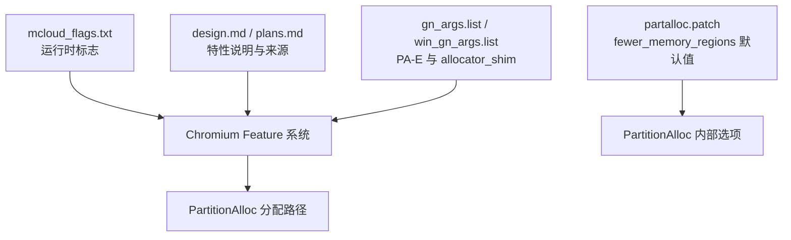
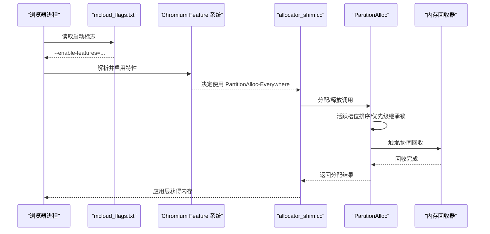
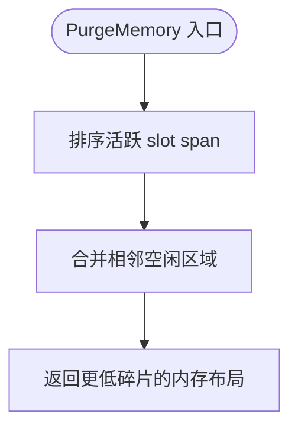
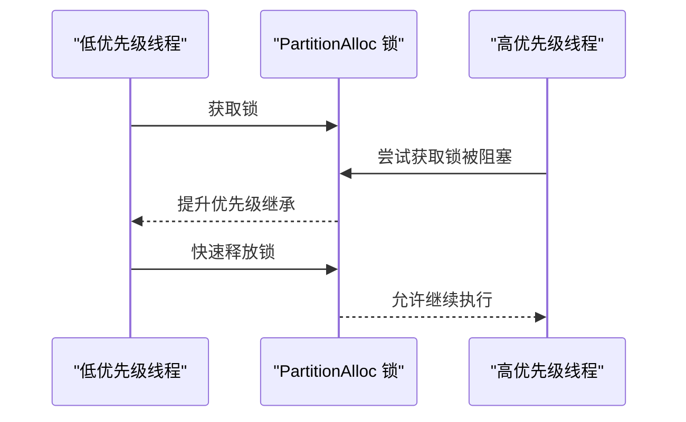
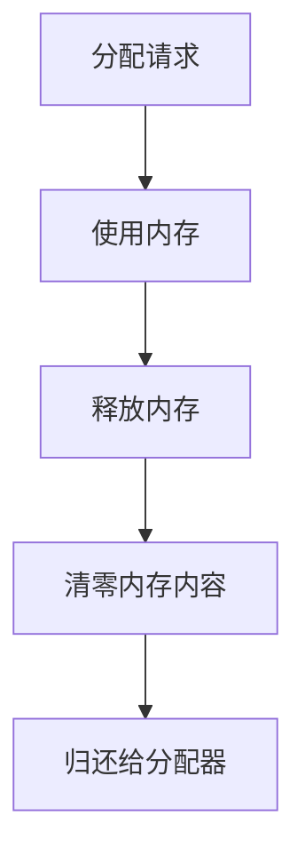
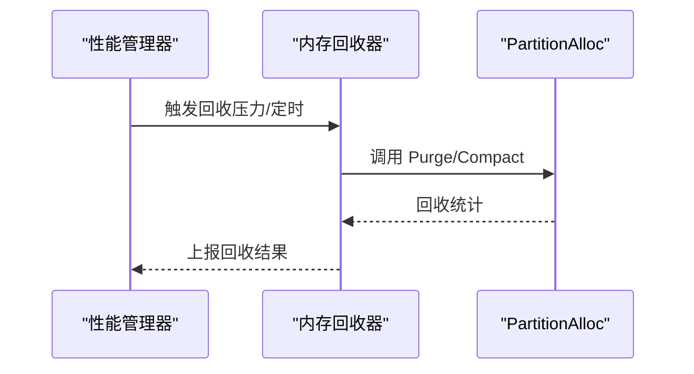
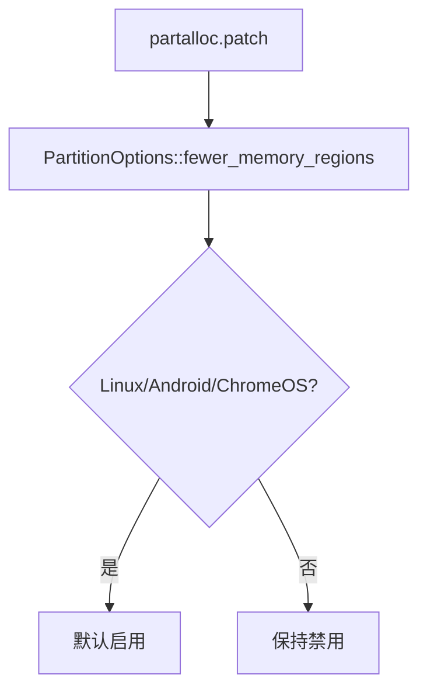
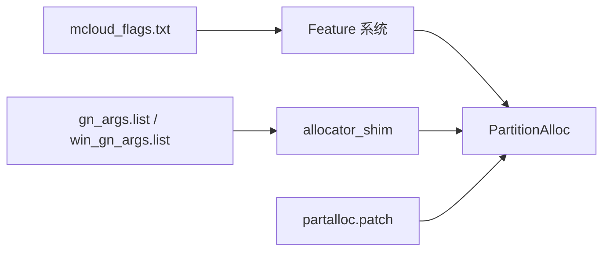

# PartitionAlloc 内存分配器优化

<cite>
**本文引用的文件**
- [README.md](file://README.md)
- [mcloud_flags.txt](file://mcloud_flags.txt)
- [partalloc.patch](file://other/partalloc.patch)
- [2026-06-19-performance-optimization-design.md](file://docs/superpowers/specs/2026-06-19-performance-optimization-design.md)
- [2026-06-19-performance-optimization.md](file://docs/superpowers/plans/2026-06-19-performance-optimization.md)
- [M151-benchmark.md](file://docs/dev-logs/M151-benchmark.md)
- [M151-opt-benchmark.md](file://docs/dev-logs/M151-opt-benchmark.md)
- [gn_args.list（infra）](file://infra/args.list)
- [win_gn_args.list](file://infra/win_gn_args.list)
</cite>

## 目录
1. [简介](#简介)
2. [项目结构](#项目结构)
3. [核心组件](#核心组件)
4. [架构总览](#架构总览)
5. [详细组件分析](#详细组件分析)
6. [依赖关系分析](#依赖关系分析)
7. [性能考量](#性能考量)
8. [故障排查指南](#故障排查指南)
9. [结论](#结论)
10. [附录](#附录)

## 简介
本文件聚焦于 Thorium 项目中与 PartitionAlloc 相关的内存分配器优化实践，系统梳理已启用的特性开关、补丁策略与基准结果。重点覆盖：
- 活跃槽位排序（PartitionAllocSortActiveSlotSpans）
- 优先级继承锁（PartitionAllocUsePriorityInheritanceLocks）
- 零释放内存回收（PartitionAllocEventuallyZeroFreedMemory）
- 内存回收器（PartitionAllocMemoryReclaimer）
并结合项目中的运行时标志、构建参数与实测数据，给出配置建议与排错指引。

## 项目结构
本项目在多处位置对 PartitionAlloc 进行启用与调优：
- 运行时标志集中管理于 mcloud_flags.txt，统一注入浏览器启动流程。
- 设计文档与实施计划明确列出 PartitionAlloc 相关 feature 的启用来源与作用。
- 针对 Linux/Android/ChromeOS 的 fewer_memory_regions 默认行为通过补丁调整。
- GN 参数列表确认 PartitionAlloc-Everywhere 与 allocator_shim 的集成方式。

图表来源
- [mcloud_flags.txt:27-38](file://mcloud_flags.txt#L27-L38)
- [2026-06-19-performance-optimization-design.md:78-88](file://docs/superpowers/specs/2026-06-19-performance-optimization-design.md#L78-L88)
- [partalloc.patch:1-26](file://other/partalloc.patch#L1-L26)
- [gn_args.list（infra）:5186-5196](file://infra/args.list#L5186-L5196)
- [win_gn_args.list:5570-5591](file://infra/win_gn_args.list#L5570-L5591)

章节来源
- [mcloud_flags.txt:27-38](file://mcloud_flags.txt#L27-L38)
- [2026-06-19-performance-optimization-design.md:78-88](file://docs/superpowers/specs/2026-06-19-performance-optimization-design.md#L78-L88)
- [partalloc.patch:1-26](file://other/partalloc.patch#L1-L26)
- [gn_args.list（infra）:5186-5196](file://infra/args.list#L5186-L5196)
- [win_gn_args.list:5570-5591](file://infra/win_gn_args.list#L5570-L5591)

## 核心组件
- 活跃槽位排序（PartitionAllocSortActiveSlotSpans）：在 PurgeMemory 时对活跃 slot span 进行排序，降低碎片化程度，提升后续分配命中率和页面回收效率。
- 优先级继承锁（PartitionAllocUsePriorityInheritanceLocks）：采用优先级继承机制减少多线程下的锁竞争与优先级反转风险，改善高并发场景下的稳定性与延迟。
- 零释放内存回收（PartitionAllocEventuallyZeroFreedMemory）：在释放内存时执行清零操作，增强安全性，降低敏感信息残留风险。
- 内存回收器（PartitionAllocMemoryReclaimer）：周期性或按需触发内存回收，配合上述特性实现更积极的内存回退与复用。

以上特性均在 mcloud_flags.txt 中启用，并在设计文档中标注了对应的 Chromium 源码位置。

章节来源
- [mcloud_flags.txt:27-38](file://mcloud_flags.txt#L27-L38)
- [2026-06-19-performance-optimization-design.md:78-88](file://docs/superpowers/specs/2026-06-19-performance-optimization-design.md#L78-L88)

## 架构总览
下图展示了从浏览器启动到 PartitionAlloc 分配路径的关键环节，包括运行时标志注入、Feature 系统解析、allocator_shim 路由以及 PartitionAlloc 内部优化点。

图表来源
- [mcloud_flags.txt:27-38](file://mcloud_flags.txt#L27-L38)
- [gn_args.list（infra）:5186-5196](file://infra/args.list#L5186-L5196)
- [win_gn_args.list:5570-5591](file://infra/win_gn_args.list#L5570-L5591)

## 详细组件分析

### 活跃槽位排序（PartitionAllocSortActiveSlotSpans）
- 作用：在 PurgeMemory 阶段对活跃 slot span 进行排序，使空闲区域更连续，降低碎片率，提高后续分配命中率与页面回收效率。
- 启用位置：mcloud_flags.txt 中作为内存优化项启用；设计文档标注其来源为 partition_alloc_features.cc。
- 适用场景：多标签页、频繁分配/释放的高碎片负载。

图表来源
- [mcloud_flags.txt:27-38](file://mcloud_flags.txt#L27-L38)
- [2026-06-19-performance-optimization-design.md:78-88](file://docs/superpowers/specs/2026-06-19-performance-optimization-design.md#L78-L88)

章节来源
- [mcloud_flags.txt:27-38](file://mcloud_flags.txt#L27-L38)
- [2026-06-19-performance-optimization-design.md:78-88](file://docs/superpowers/specs/2026-06-19-performance-optimization-design.md#L78-L88)

### 优先级继承锁（PartitionAllocUsePriorityInheritanceLocks）
- 作用：引入优先级继承机制，避免低优先级线程长时间持有锁导致高优先级任务阻塞，从而减少锁竞争和抖动。
- 启用位置：mcloud_flags.txt 中作为内存优化项启用；设计文档标注其来源为 partition_alloc_features.cc。
- 适用场景：高并发分配、多线程渲染与 IO 混合负载。

图表来源
- [mcloud_flags.txt:27-38](file://mcloud_flags.txt#L27-L38)
- [2026-06-19-performance-optimization-design.md:78-88](file://docs/superpowers/specs/2026-06-19-performance-optimization-design.md#L78-L88)

章节来源
- [mcloud_flags.txt:27-38](file://mcloud_flags.txt#L27-L38)
- [2026-06-19-performance-optimization-design.md:78-88](file://docs/superpowers/specs/2026-06-19-performance-optimization-design.md#L78-L88)

### 零释放内存回收（PartitionAllocEventuallyZeroFreedMemory）
- 作用：在释放内存时执行清零，降低敏感数据残留风险，提升安全性。
- 启用位置：mcloud_flags.txt 中作为内存优化项启用；README 中亦列出该特性。
- 权衡：清零带来额外开销，需结合业务安全需求评估是否开启。

图表来源
- [mcloud_flags.txt:27-38](file://mcloud_flags.txt#L27-L38)
- [README.md:121-133](file://README.md#L121-L133)

章节来源
- [mcloud_flags.txt:27-38](file://mcloud_flags.txt#L27-L38)
- [README.md:121-133](file://README.md#L121-L133)

### 内存回收器（PartitionAllocMemoryReclaimer）
- 作用：周期性或按需触发内存回收，与零释放、活跃槽位排序等特性协同，提升整体内存利用率与响应性。
- 启用位置：mcloud_flags.txt 中作为内存优化项启用；设计文档标注其为内存优化的一部分。
- 协同：与 PurgeMemory、页面冻结、丢弃策略等共同构成内存压力下的回收体系。

图表来源
- [mcloud_flags.txt:27-38](file://mcloud_flags.txt#L27-L38)
- [2026-06-19-performance-optimization-design.md:78-88](file://docs/superpowers/specs/2026-06-19-performance-optimization-design.md#L78-L88)

章节来源
- [mcloud_flags.txt:27-38](file://mcloud_flags.txt#L27-L38)
- [2026-06-19-performance-optimization-design.md:78-88](file://docs/superpowers/specs/2026-06-19-performance-optimization-design.md#L78-L88)

### 平台特定优化：fewer_memory_regions
- 补丁说明：在 Linux/Android/ChromeOS 上，将 fewer_memory_regions 默认启用，以缓解每进程 VMA 限制带来的问题。
- 影响范围：减少内存区域数量，降低系统资源压力，适合受限环境。

图表来源
- [partalloc.patch:1-26](file://other/partalloc.patch#L1-L26)

章节来源
- [partalloc.patch:1-26](file://other/partalloc.patch#L1-L26)

## 依赖关系分析
- 运行时标志：mcloud_flags.txt 提供统一的 enable-features 列表，确保 PartitionAlloc 相关特性在启动时被激活。
- Feature 系统：设计文档指明各特性的来源文件（如 partition_alloc_features.cc），保证与上游 Chromium 的一致性。
- 构建集成：GN 参数列表确认 use_partition_alloc_as_malloc 与 allocator_shim 的使用，确保所有分配走 PartitionAlloc。
- 补丁适配：partalloc.patch 针对平台差异调整默认行为，提升兼容性。

图表来源
- [mcloud_flags.txt:27-38](file://mcloud_flags.txt#L27-L38)
- [gn_args.list（infra）:5186-5196](file://infra/args.list#L5186-L5196)
- [win_gn_args.list:5570-5591](file://infra/win_gn_args.list#L5570-L5591)
- [partalloc.patch:1-26](file://other/partalloc.patch#L1-L26)

章节来源
- [mcloud_flags.txt:27-38](file://mcloud_flags.txt#L27-L38)
- [gn_args.list（infra）:5186-5196](file://infra/args.list#L5186-L5196)
- [win_gn_args.list:5570-5591](file://infra/win_gn_args.list#L5570-L5591)
- [partalloc.patch:1-26](file://other/partalloc.patch#L1-L26)

## 性能考量
- 碎片控制：活跃槽位排序在 PurgeMemory 时降低碎片，有助于稳定峰值内存与分配延迟。
- 锁竞争：优先级继承锁在高并发下减少抖动，提升响应性。
- 安全与开销：零释放内存回收提升安全性，但会带来额外写入成本，需根据业务敏感度权衡。
- 回收策略：内存回收器与页面冻结、丢弃策略协同，形成多层级内存压力应对。

实际基准数据（来自项目内报告）：
- M151 vs M150：冷启动时间持平（测量噪声范围内），内存峰值略有下降（约 -0.86%）。
- M151-opt：新增运行时优化后，K2 内存峰值较基线有所上升（+1.9%），经预载类特性取舍后，真实站点场景内存进一步降低（-2.6%）。

章节来源
- [M151-benchmark.md:19-30](file://docs/dev-logs/M151-benchmark.md#L19-L30)
- [M151-opt-benchmark.md:19-60](file://docs/dev-logs/M151-opt-benchmark.md#L19-L60)

## 故障排查指南
- 验证内置标志生效：使用 verify_builtin_flags.ps1 检查子进程命令行是否包含预期 feature。
- 检查 Feature 存活：通过 check_features.py 确认目标版本中 feature 是否存在且可用。
- 平台兼容性问题：若遇到 VMA 限制或内存区域过多，确认 fewer_memory_regions 是否按补丁逻辑启用。
- 性能回归定位：对比基线与优化版本的 K1/K2 指标，结合日志与内存快照定位异常。

章节来源
- [M151-benchmark.md:28-30](file://docs/dev-logs/M151-benchmark.md#L28-L30)
- [M151-opt-benchmark.md:28-32](file://docs/dev-logs/M151-opt-benchmark.md#L28-L32)

## 结论
本项目通过统一的运行时标志管理与设计文档对齐，系统性启用了 PartitionAlloc 的多项高级特性，包括活跃槽位排序、优先级继承锁、零释放内存回收与内存回收器。结合平台特定的补丁与 GN 参数集成，实现了在多标签页、高并发与视频播放等场景下的内存与性能优化。基准测试表明，升级与优化未引入明显性能回归，且在内存占用方面取得一定改善。建议在安全敏感场景中谨慎评估零释放开销，并根据实际负载调整回收策略与预载类特性。

## 附录
- 常用命令与脚本：
  - 验证内置标志：benchmark/tools/verify_builtin_flags.ps1
  - 特征校验：benchmark/tools/check_features.py
  - 基准采集：benchmark/bench_*.ps1
- 参考文档：
  - 设计文档：docs/superpowers/specs/2026-06-19-performance-optimization-design.md
  - 实施计划：docs/superpowers/plans/2026-06-19-performance-optimization.md
  - 基准报告：docs/dev-logs/M151-benchmark.md、docs/dev-logs/M151-opt-benchmark.md