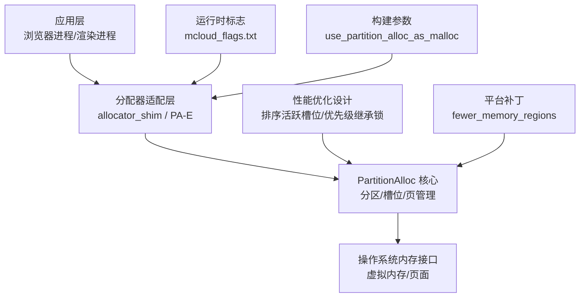
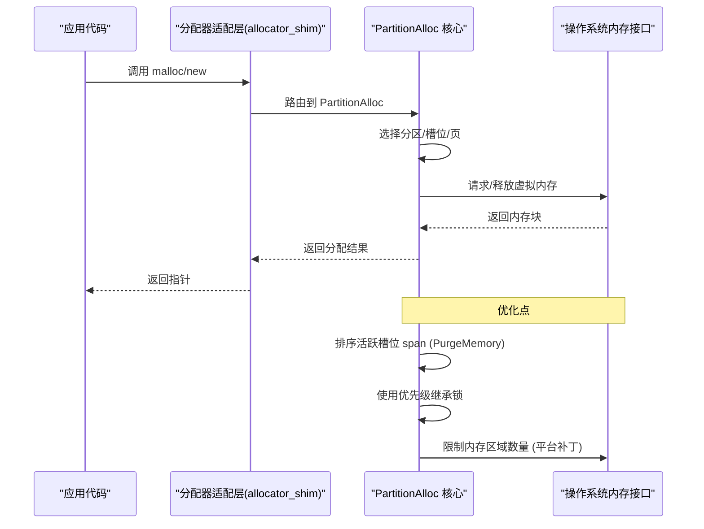
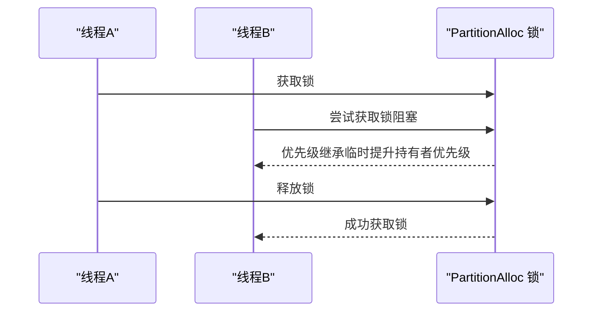
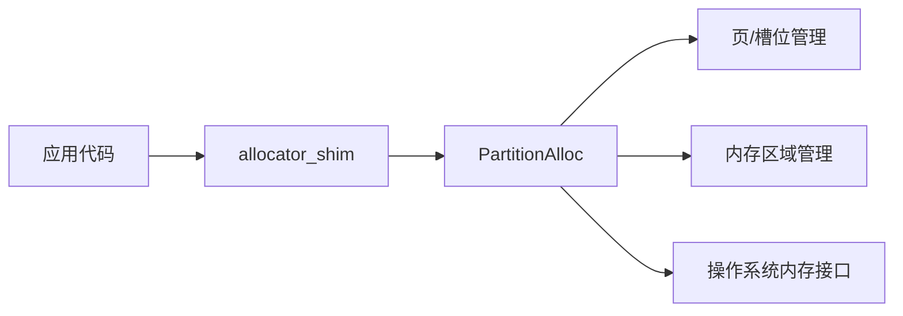
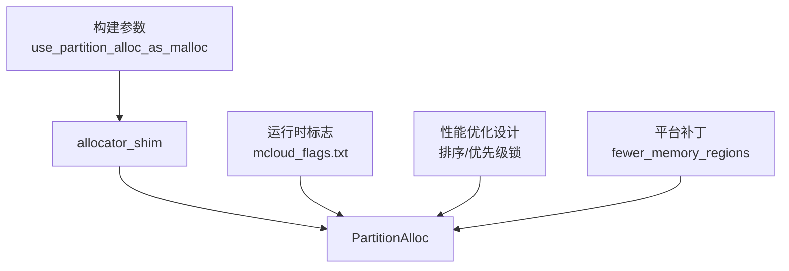

# PartitionAlloc 核心架构

本文引用的文件

- [README.md](https://github.com/Mcloud136/Mcloud-Browser/blob/main/README.md)
- [2026-06-19-performance-optimization-design.md](https://github.com/Mcloud136/Mcloud-Browser/blob/main/docs/superpowers/specs/2026-06-19-performance-optimization-design.md)
- [mcloud_flags.txt](https://github.com/Mcloud136/Mcloud-Browser/blob/main/mcloud_flags.txt)
- [partalloc.patch](https://github.com/Mcloud136/Mcloud-Browser/blob/main/other/partalloc.patch)
- [args.list](https://github.com/Mcloud136/Mcloud-Browser/blob/main/infra/args.list)
- [gn_args.list](https://github.com/Mcloud136/Mcloud-Browser/blob/main/infra/gn_args.list)
- [win_gn_args.list](https://github.com/Mcloud136/Mcloud-Browser/blob/main/infra/win_gn_args.list)

## 目录
1. [简介](#简介)
2. [项目结构](#项目结构)
3. [核心组件](#核心组件)
4. [架构总览](#架构总览)
5. [详细组件分析](#详细组件分析)
6. [依赖关系分析](#依赖关系分析)
7. [性能考量](#性能考量)
8. [故障排查指南](#故障排查指南)
9. [结论](#结论)
10. [附录](#附录)

## 简介
本文件聚焦于 MCloud Browser 中基于 Chromium 的 PartitionAlloc 内存分配器在工程中的启用、配置与优化实践，重点解释以下主题：
- 设计理念与层次化内存管理（从底层内存池到上层分配接口）
- 槽位分配策略与活跃槽位排序机制
- PartitionAllocSortActiveSlotSpans 与 PartitionAllocUsePriorityInheritanceLocks 的工作原理与配置方法
- 内存布局与数据流示意
- 性能特性与与其他分配器的对比要点

说明：本项目通过构建参数与运行时标志启用并调优 PartitionAlloc，并在文档与补丁中体现相关优化。由于仓库未包含 base/allocator/partition_allocator 源码本身，本文对内部实现细节的描述以仓库内提供的配置、补丁与文档为依据，并结合通用知识进行可理解性说明。

## 项目结构
围绕 PartitionAlloc 的相关配置与优化集中在如下位置：
- 运行期标志与功能开关：mcloud_flags.txt
- 性能优化设计文档：docs/superpowers/specs/2026-06-19-performance-optimization-design.md
- 构建参数与默认值：infra/*.list（如 args.list、gn_args.list、win_gn_args.list）
- 针对 PartitionAlloc 行为的补丁：other/partalloc.patch
- 项目总览与内存优化概览：README.md

图表来源
- [mcloud_flags.txt:34-35](https://github.com/Mcloud136/Mcloud-Browser/blob/main/mcloud_flags.txt#L34-L35)
- [2026-06-19-performance-optimization-design.md:84-88](https://github.com/Mcloud136/Mcloud-Browser/blob/main/docs/superpowers/specs/2026-06-19-performance-optimization-design.md#L84-L88)
- [partalloc.patch:4-23](https://github.com/Mcloud136/Mcloud-Browser/blob/main/other/partalloc.patch#L4-L23)
- [args.list:5190-5196](https://github.com/Mcloud136/Mcloud-Browser/blob/main/infra/args.list#L5190-L5196)
- [gn_args.list:5963-5990](https://github.com/Mcloud136/Mcloud-Browser/blob/main/infra/gn_args.list#L5963-L5990)

章节来源
- [README.md:119-133](https://github.com/Mcloud136/Mcloud-Browser/blob/main/README.md#L119-L133)
- [mcloud_flags.txt:34-35](https://github.com/Mcloud136/Mcloud-Browser/blob/main/mcloud_flags.txt#L34-L35)
- [2026-06-19-performance-optimization-design.md:78-88](https://github.com/Mcloud136/Mcloud-Browser/blob/main/docs/superpowers/specs/2026-06-19-performance-optimization-design.md#L78-L88)
- [partalloc.patch:4-23](https://github.com/Mcloud136/Mcloud-Browser/blob/main/other/partalloc.patch#L4-L23)
- [args.list:5190-5196](https://github.com/Mcloud136/Mcloud-Browser/blob/main/infra/args.list#L5190-L5196)
- [gn_args.list:5963-5990](https://github.com/Mcloud136/Mcloud-Browser/blob/main/infra/gn_args.list#L5963-L5990)

## 核心组件
- 分配器适配层（Allocator Shim / PA-E）
  - 通过 use_partition_alloc_as_malloc 将 malloc/new 等调用路由至 PartitionAlloc，实现“处处使用”的分配策略。
  - 参考路径：[args.list:5190-5196](https://github.com/Mcloud136/Mcloud-Browser/blob/main/infra/args.list#L5190-L5196)、[gn_args.list:5985-5990](https://github.com/Mcloud136/Mcloud-Browser/blob/main/infra/gn_args.list#L5985-L5990)。

- PartitionAlloc 核心
  - 负责分区（Partition）、槽位（Slot）、页（Page）与内存区域（Memory Region）的管理。
  - 在本工程中通过运行时标志与补丁增强其行为：
    - 排序活跃槽位 span（减少碎片）
    - 使用优先级继承锁（降低锁竞争）
    - 限制内存区域数量（平台相关）

- 运行时标志与构建参数
  - mcloud_flags.txt 启用 PartitionAllocSortActiveSlotSpans、PartitionAllocUsePriorityInheritanceLocks 等。
  - 构建参数控制是否启用 PartitionAlloc 作为默认分配器。

章节来源
- [args.list:5190-5196](https://github.com/Mcloud136/Mcloud-Browser/blob/main/infra/args.list#L5190-L5196)
- [gn_args.list:5963-5990](https://github.com/Mcloud136/Mcloud-Browser/blob/main/infra/gn_args.list#L5963-L5990)
- [mcloud_flags.txt:34-35](https://github.com/Mcloud136/Mcloud-Browser/blob/main/mcloud_flags.txt#L34-L35)
- [2026-06-19-performance-optimization-design.md:84-88](https://github.com/Mcloud136/Mcloud-Browser/blob/main/docs/superpowers/specs/2026-06-19-performance-optimization-design.md#L84-L88)

## 架构总览
下图展示了从应用层到操作系统内存接口的完整数据流，以及 PartitionAlloc 的关键优化点。

图表来源
- [args.list:5190-5196](https://github.com/Mcloud136/Mcloud-Browser/blob/main/infra/args.list#L5190-L5196)
- [gn_args.list:5985-5990](https://github.com/Mcloud136/Mcloud-Browser/blob/main/infra/gn_args.list#L5985-L5990)
- [mcloud_flags.txt:34-35](https://github.com/Mcloud136/Mcloud-Browser/blob/main/mcloud_flags.txt#L34-L35)
- [2026-06-19-performance-optimization-design.md:84-88](https://github.com/Mcloud136/Mcloud-Browser/blob/main/docs/superpowers/specs/2026-06-19-performance-optimization-design.md#L84-L88)
- [partalloc.patch:4-23](https://github.com/Mcloud136/Mcloud-Browser/blob/main/other/partalloc.patch#L4-L23)

## 详细组件分析

### 槽位分配策略与活跃槽位排序
- 槽位（Slot）是 PartitionAlloc 的基本分配单元，按大小分类组织；页（Page）承载多个槽位；活跃槽位 span 用于跟踪正在使用的槽位集合。
- 在 PurgeMemory 阶段，排序活跃槽位 span 有助于减少碎片、提升回收效率。该行为由运行时标志 PartitionAllocSortActiveSlotSpans 控制。
- 参考路径：
  - 标志定义与来源：[2026-06-19-performance-optimization-design.md:84-85](https://github.com/Mcloud136/Mcloud-Browser/blob/main/docs/superpowers/specs/2026-06-19-performance-optimization-design.md#L84-L85)
  - 启用方式：[mcloud_flags.txt:34-35](https://github.com/Mcloud136/Mcloud-Browser/blob/main/mcloud_flags.txt#L34-L35)

图表来源
- [2026-06-19-performance-optimization-design.md:84-85](https://github.com/Mcloud136/Mcloud-Browser/blob/main/docs/superpowers/specs/2026-06-19-performance-optimization-design.md#L84-L85)

章节来源
- [2026-06-19-performance-optimization-design.md:84-85](https://github.com/Mcloud136/Mcloud-Browser/blob/main/docs/superpowers/specs/2026-06-19-performance-optimization-design.md#L84-L85)
- [mcloud_flags.txt:34-35](https://github.com/Mcloud136/Mcloud-Browser/blob/main/mcloud_flags.txt#L34-L35)

### 优先级继承锁的使用
- 为降低高并发下的锁竞争，PartitionAlloc 支持使用优先级继承锁（Priority Inheritance Locks）。该特性由 PartitionAllocUsePriorityInheritanceLocks 控制。
- 参考路径：
  - 标志定义与来源：[2026-06-19-performance-optimization-design.md:85-86](https://github.com/Mcloud136/Mcloud-Browser/blob/main/docs/superpowers/specs/2026-06-19-performance-optimization-design.md#L85-L86)
  - 启用方式：[mcloud_flags.txt:34-35](https://github.com/Mcloud136/Mcloud-Browser/blob/main/mcloud_flags.txt#L34-L35)

图表来源
- [2026-06-19-performance-optimization-design.md:85-86](https://github.com/Mcloud136/Mcloud-Browser/blob/main/docs/superpowers/specs/2026-06-19-performance-optimization-design.md#L85-L86)
- [mcloud_flags.txt:34-35](https://github.com/Mcloud136/Mcloud-Browser/blob/main/mcloud_flags.txt#L34-L35)

章节来源
- [2026-06-19-performance-optimization-design.md:85-86](https://github.com/Mcloud136/Mcloud-Browser/blob/main/docs/superpowers/specs/2026-06-19-performance-optimization-design.md#L85-L86)
- [mcloud_flags.txt:34-35](https://github.com/Mcloud136/Mcloud-Browser/blob/main/mcloud_flags.txt#L34-L35)

### 内存区域数量限制（平台补丁）
- 在 Linux/Android/ChromeOS 等平台，进程级 VMA 数量有限，因此通过补丁将 fewer_memory_regions 默认启用，以减少内存区域数量，避免触及系统限制。
- 参考路径：[partalloc.patch:4-23](https://github.com/Mcloud136/Mcloud-Browser/blob/main/other/partalloc.patch#L4-L23)

图表来源
- [partalloc.patch:4-23](https://github.com/Mcloud136/Mcloud-Browser/blob/main/other/partalloc.patch#L4-L23)

章节来源
- [partalloc.patch:4-23](https://github.com/Mcloud136/Mcloud-Browser/blob/main/other/partalloc.patch#L4-L23)

### 内存分配器层次结构与数据流
- 应用层通过标准分配接口发起分配请求。
- allocator_shim 将调用路由到 PartitionAlloc（当启用 use_partition_alloc_as_malloc）。
- PartitionAlloc 内部根据对象大小选择合适槽位，必要时向操作系统申请或归还页。
- 运行时标志与构建参数共同决定具体行为（如排序活跃槽位、使用优先级继承锁、限制内存区域数量）。

图表来源
- [args.list:5190-5196](https://github.com/Mcloud136/Mcloud-Browser/blob/main/infra/args.list#L5190-L5196)
- [gn_args.list:5963-5990](https://github.com/Mcloud136/Mcloud-Browser/blob/main/infra/gn_args.list#L5963-L5990)
- [mcloud_flags.txt:34-35](https://github.com/Mcloud136/Mcloud-Browser/blob/main/mcloud_flags.txt#L34-L35)
- [partalloc.patch:4-23](https://github.com/Mcloud136/Mcloud-Browser/blob/main/other/partalloc.patch#L4-L23)

章节来源
- [args.list:5190-5196](https://github.com/Mcloud136/Mcloud-Browser/blob/main/infra/args.list#L5190-L5196)
- [gn_args.list:5963-5990](https://github.com/Mcloud136/Mcloud-Browser/blob/main/infra/gn_args.list#L5963-L5990)
- [mcloud_flags.txt:34-35](https://github.com/Mcloud136/Mcloud-Browser/blob/main/mcloud_flags.txt#L34-L35)
- [partalloc.patch:4-23](https://github.com/Mcloud136/Mcloud-Browser/blob/main/other/partalloc.patch#L4-L23)

## 依赖关系分析
- 构建期依赖
  - use_partition_alloc_as_malloc：决定是否将分配调用路由到 PartitionAlloc（见 infra/*.list）。
  - use_allocator_shim：使所有分配经由 shim 层（见 infra/args.list）。
- 运行期依赖
  - mcloud_flags.txt 中的 enable-features 列表控制 PartitionAlloc 的行为开关。
  - 性能优化设计文档提供各标志的作用与来源文件定位。

图表来源
- [args.list:5190-5196](https://github.com/Mcloud136/Mcloud-Browser/blob/main/infra/args.list#L5190-L5196)
- [gn_args.list:5963-5990](https://github.com/Mcloud136/Mcloud-Browser/blob/main/infra/gn_args.list#L5963-L5990)
- [mcloud_flags.txt:34-35](https://github.com/Mcloud136/Mcloud-Browser/blob/main/mcloud_flags.txt#L34-L35)
- [2026-06-19-performance-optimization-design.md:84-88](https://github.com/Mcloud136/Mcloud-Browser/blob/main/docs/superpowers/specs/2026-06-19-performance-optimization-design.md#L84-L88)
- [partalloc.patch:4-23](https://github.com/Mcloud136/Mcloud-Browser/blob/main/other/partalloc.patch#L4-L23)

章节来源
- [args.list:5190-5196](https://github.com/Mcloud136/Mcloud-Browser/blob/main/infra/args.list#L5190-L5196)
- [gn_args.list:5963-5990](https://github.com/Mcloud136/Mcloud-Browser/blob/main/infra/gn_args.list#L5963-L5990)
- [mcloud_flags.txt:34-35](https://github.com/Mcloud136/Mcloud-Browser/blob/main/mcloud_flags.txt#L34-L35)
- [2026-06-19-performance-optimization-design.md:84-88](https://github.com/Mcloud136/Mcloud-Browser/blob/main/docs/superpowers/specs/2026-06-19-performance-optimization-design.md#L84-L88)
- [partalloc.patch:4-23](https://github.com/Mcloud136/Mcloud-Browser/blob/main/other/partalloc.patch#L4-L23)

## 性能考量
- 启动速度与内存占用
  - 通过 PartitionAllocSortActiveSlotSpans 与 PartitionAllocUsePriorityInheritanceLocks 等标志，可在多标签场景下减少内存碎片与锁竞争，从而改善整体性能。
  - 参考：[README.md:119-133](https://github.com/Mcloud136/Mcloud-Browser/blob/main/README.md#L119-L133)、[2026-06-19-performance-optimization-design.md:78-88](https://github.com/Mcloud136/Mcloud-Browser/blob/main/docs/superpowers/specs/2026-06-19-performance-optimization-design.md#L78-L88)
- 平台差异
  - 在 Linux/Android/ChromeOS 上启用 fewer_memory_regions，有助于避免 VMA 限制导致的分配失败或性能退化。
  - 参考：[partalloc.patch:4-23](https://github.com/Mcloud136/Mcloud-Browser/blob/main/other/partalloc.patch#L4-L23)
- 与其他分配器对比要点
  - 与系统默认分配器相比，PartitionAlloc 提供更强的隔离性与可控的碎片回收策略；通过 PA-E 可将全局分配路径统一，便于集中优化。
  - 参考：[args.list:5190-5196](https://github.com/Mcloud136/Mcloud-Browser/blob/main/infra/args.list#L5190-L5196)、[gn_args.list:5985-5990](https://github.com/Mcloud136/Mcloud-Browser/blob/main/infra/gn_args.list#L5985-L5990)

章节来源
- [README.md:119-133](https://github.com/Mcloud136/Mcloud-Browser/blob/main/README.md#L119-L133)
- [2026-06-19-performance-optimization-design.md:78-88](https://github.com/Mcloud136/Mcloud-Browser/blob/main/docs/superpowers/specs/2026-06-19-performance-optimization-design.md#L78-L88)
- [partalloc.patch:4-23](https://github.com/Mcloud136/Mcloud-Browser/blob/main/other/partalloc.patch#L4-L23)
- [args.list:5190-5196](https://github.com/Mcloud136/Mcloud-Browser/blob/main/infra/args.list#L5190-L5196)
- [gn_args.list:5985-5990](https://github.com/Mcloud136/Mcloud-Browser/blob/main/infra/gn_args.list#L5985-L5990)

## 故障排查指南
- 确认是否启用了 PartitionAlloc
  - 检查 use_partition_alloc_as_malloc 与 use_allocator_shim 的值（见 infra/*.list）。
- 验证运行时标志是否生效
  - 查看 mcloud_flags.txt 中是否包含 PartitionAllocSortActiveSlotSpans、PartitionAllocUsePriorityInheritanceLocks。
- 平台相关限制
  - 若出现内存区域过多导致的问题，确认 fewer_memory_regions 是否按平台启用（见 partalloc.patch）。
- 参考路径
  - [args.list:5190-5196](https://github.com/Mcloud136/Mcloud-Browser/blob/main/infra/args.list#L5190-L5196)
  - [gn_args.list:5963-5990](https://github.com/Mcloud136/Mcloud-Browser/blob/main/infra/gn_args.list#L5963-L5990)
  - [mcloud_flags.txt:34-35](https://github.com/Mcloud136/Mcloud-Browser/blob/main/mcloud_flags.txt#L34-L35)
  - [partalloc.patch:4-23](https://github.com/Mcloud136/Mcloud-Browser/blob/main/other/partalloc.patch#L4-L23)

章节来源
- [args.list:5190-5196](https://github.com/Mcloud136/Mcloud-Browser/blob/main/infra/args.list#L5190-L5196)
- [gn_args.list:5963-5990](https://github.com/Mcloud136/Mcloud-Browser/blob/main/infra/gn_args.list#L5963-L5990)
- [mcloud_flags.txt:34-35](https://github.com/Mcloud136/Mcloud-Browser/blob/main/mcloud_flags.txt#L34-L35)
- [partalloc.patch:4-23](https://github.com/Mcloud136/Mcloud-Browser/blob/main/other/partalloc.patch#L4-L23)

## 结论
- 本项目通过构建参数与运行时标志将 PartitionAlloc 作为主要分配器，并启用多项优化以提升内存利用率与并发性能。
- 关键优化包括：排序活跃槽位 span、使用优先级继承锁、限制内存区域数量（平台相关）。
- 这些配置与补丁共同构成了从底层内存池到上层分配接口的完整数据流与优化闭环。

## 附录
- 常用标志与来源
  - PartitionAllocSortActiveSlotSpans：用于 PurgeMemory 时排序活跃 slot span，来源文件参见设计文档。
  - PartitionAllocUsePriorityInheritanceLocks：启用优先级继承锁，来源文件参见设计文档。
  - fewer_memory_regions：平台补丁启用，适用于 Linux/Android/ChromeOS。
- 参考路径
  - [2026-06-19-performance-optimization-design.md:84-88](https://github.com/Mcloud136/Mcloud-Browser/blob/main/docs/superpowers/specs/2026-06-19-performance-optimization-design.md#L84-L88)
  - [mcloud_flags.txt:34-35](https://github.com/Mcloud136/Mcloud-Browser/blob/main/mcloud_flags.txt#L34-L35)
  - [partalloc.patch:4-23](https://github.com/Mcloud136/Mcloud-Browser/blob/main/other/partalloc.patch#L4-L23)