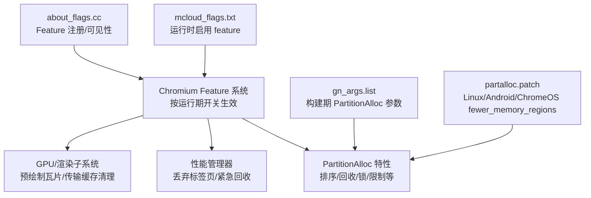
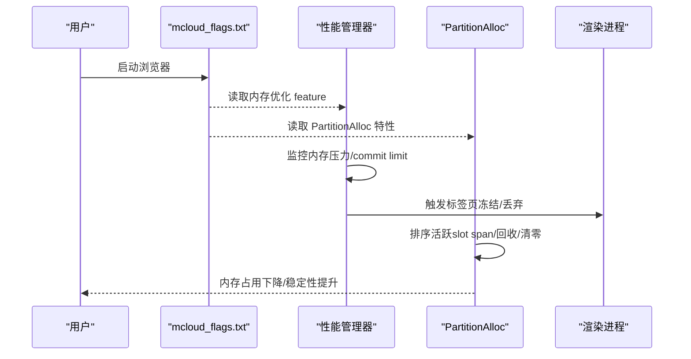
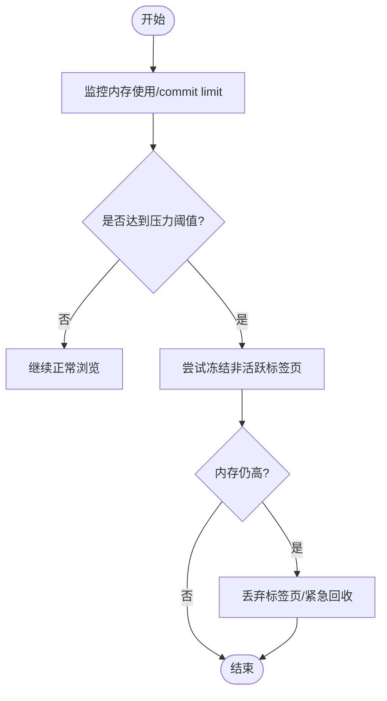
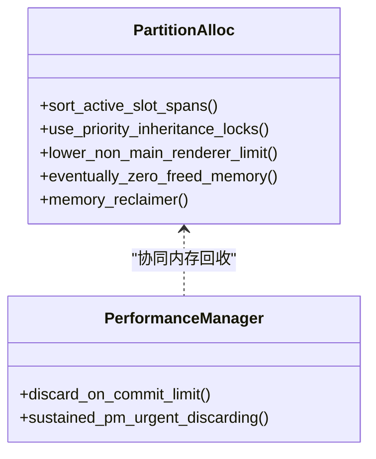
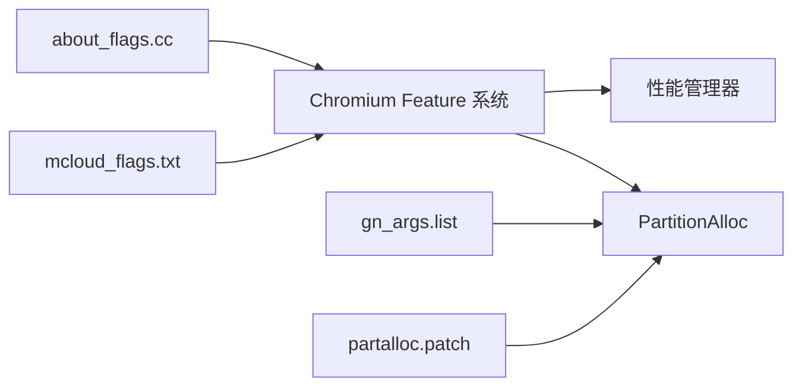

# 优化配置与调优

<cite>
**本文引用的文件**
- [mcloud_flags.txt](file://mcloud_flags.txt)
- [README.md](file://README.md)
- [M151-benchmark.md](file://docs/dev-logs/M151-benchmark.md)
- [M151-opt-benchmark.md](file://docs/dev-logs/M151-opt-benchmark.md)
- [2026-06-19-performance-optimization-design.md](file://docs/superpowers/specs/2026-06-19-performance-optimization-design.md)
- [partalloc.patch](file://other/partalloc.patch)
- [about_flags.cc](file://src/chrome/browser/about_flags.cc)
- [gn_args.list](file://infra/gn_args.list)
</cite>

## 目录
1. [简介](#简介)
2. [项目结构](#项目结构)
3. [核心组件](#核心组件)
4. [架构总览](#架构总览)
5. [详细组件分析](#详细组件分析)
6. [依赖关系分析](#依赖关系分析)
7. [性能考量](#性能考量)
8. [故障排除指南](#故障排除指南)
9. [结论](#结论)
10. [附录](#附录)

## 简介
本文件聚焦于 MCloud Browser 中 PartitionAlloc 相关内存优化标志的配置与调优，覆盖 mcloud_flags.txt 中的内存优化开关、各选项的作用与影响、不同平台（桌面/移动）的推荐策略、基准测试结果与优化前后对比，以及常见内存问题的排查方法。目标是帮助开发者在保持浏览器稳定性的前提下，获得更优的内存占用与响应性。

## 项目结构
与 PartitionAlloc 优化相关的配置与文档主要分布在以下位置：
- 运行时启动标志：mcloud_flags.txt
- 设计与说明：docs/superpowers/specs/2026-06-19-performance-optimization-design.md
- 基准报告：docs/dev-logs/M151-benchmark.md、docs/dev-logs/M151-opt-benchmark.md
- 源码侧 Feature 注册与可见性：src/chrome/browser/about_flags.cc
- 构建期 PartitionAlloc 参数与默认值：infra/gn_args.list
- 针对 Linux/Android/ChromeOS 的 PartitionAlloc 行为补丁：other/partalloc.patch

图表来源
- [mcloud_flags.txt:27-38](file://mcloud_flags.txt#L27-L38)
- [2026-06-19-performance-optimization-design.md:78-88](file://docs/superpowers/specs/2026-06-19-performance-optimization-design.md#L78-L88)
- [about_flags.cc:21-23](file://src/chrome/browser/about_flags.cc#L21-L23)
- [gn_args.list:4111-4121](file://infra/gn_args.list#L4111-L4121)
- [partalloc.patch:1-27](file://other/partalloc.patch#L1-L27)

章节来源
- [mcloud_flags.txt:27-38](file://mcloud_flags.txt#L27-L38)
- [2026-06-19-performance-optimization-design.md:78-88](file://docs/superpowers/specs/2026-06-19-performance-optimization-design.md#L78-L88)
- [about_flags.cc:21-23](file://src/chrome/browser/about_flags.cc#L21-L23)
- [gn_args.list:4111-4121](file://infra/gn_args.list#L4111-L4121)
- [partalloc.patch:1-27](file://other/partalloc.patch#L1-L27)

## 核心组件
- 运行时内存优化标志（位于 mcloud_flags.txt）
  - InfiniteTabsFreezing / InfiniteTabsFreezingOnMemoryPressure：标签页冻结与内存压力下冻结，降低多标签场景内存占用。
  - DiscardOnCommitLimit：当可用内存低于阈值时主动丢弃标签页，防止 OOM。
  - SustainedPMUrgentDiscarding：持续内存压力下的紧急丢弃策略。
  - PartitionAllocSortActiveSlotSpans：在 PurgeMemory 时对活跃 slot span 排序，减少碎片。
  - PartitionAllocUsePriorityInheritanceLocks：使用优先级继承锁，降低锁竞争。
  - LowerPAMemoryLimitForNonMainRenderers：为非主框架渲染器设置更低内存上限，控制整体内存。
  - ReclaimOldPrepaintTiles：延迟回收旧预绘制瓦片，平衡渲染与内存。
  - PruneOldTransferCacheEntries：清理旧的传输缓存条目，释放 GPU/内存资源。
  - PartitionAllocEventuallyZeroFreedMemory / PartitionAllocMemoryReclaimer：释放内存清零与内存回收器，提升内存安全与回收效率。

- 构建期 PartitionAlloc 参数（位于 gn_args.list）
  - partition_alloc_optimized_debug：调试构建下是否对 PartitionAlloc 开启编译器优化，避免调试态性能退化。
  - use_partition_alloc / use_partition_alloc_as_malloc：是否链接并使用 PartitionAlloc 作为默认分配器。

- 平台特定行为（partalloc.patch）
  - 在 Linux/Android/ChromeOS 上启用 fewer_memory_regions，减少 VMA 数量，缓解进程级地址空间限制。

章节来源
- [mcloud_flags.txt:27-38](file://mcloud_flags.txt#L27-L38)
- [gn_args.list:4111-4121](file://infra/gn_args.list#L4111-L4121)
- [partalloc.patch:1-27](file://other/partalloc.patch#L1-L27)

## 架构总览
下图展示了运行时标志如何驱动 PartitionAlloc 与性能管理器的协作，实现内存优化与页面生命周期管理。

图表来源
- [mcloud_flags.txt:27-38](file://mcloud_flags.txt#L27-L38)
- [2026-06-19-performance-optimization-design.md:78-88](file://docs/superpowers/specs/2026-06-19-performance-optimization-design.md#L78-L88)

## 详细组件分析

### 标签页冻结与内存压力处理
- InfiniteTabsFreezing / InfiniteTabsFreezingOnMemoryPressure
  - 作用：后台或长时间不活跃的标签页进入冻结状态；在内存压力下自动冻结更多标签，降低驻留内存。
  - 影响：改善多标签场景内存占用，可能带来切换时的冷启动开销。
- DiscardOnCommitLimit
  - 作用：当可用内存低于阈值（如 <10%）时主动丢弃标签页，避免 OOM。
  - 影响：极端内存紧张时牺牲部分用户体验以保障稳定性。
- SustainedPMUrgentDiscarding
  - 作用：在持续内存压力下执行更积极的紧急回收。
  - 影响：在高负载场景下有助于快速释放内存。

图表来源
- [mcloud_flags.txt:27-38](file://mcloud_flags.txt#L27-L38)
- [2026-06-19-performance-optimization-design.md:78-88](file://docs/superpowers/specs/2026-06-19-performance-optimization-design.md#L78-L88)

章节来源
- [mcloud_flags.txt:27-38](file://mcloud_flags.txt#L27-L38)
- [2026-06-19-performance-optimization-design.md:78-88](file://docs/superpowers/specs/2026-06-19-performance-optimization-design.md#L78-L88)

### PartitionAlloc 内部优化
- PartitionAllocSortActiveSlotSpans
  - 作用：在 PurgeMemory 时对活跃 slot span 排序，减少碎片，提高后续分配效率。
- PartitionAllocUsePriorityInheritanceLocks
  - 作用：使用优先级继承锁，降低多线程竞争导致的阻塞。
- LowerPAMemoryLimitForNonMainRenderers
  - 作用：为副渲染器设置更低内存上限，控制整体内存增长。
- PartitionAllocEventuallyZeroFreedMemory / PartitionAllocMemoryReclaimer
  - 作用：释放内存清零与回收器，增强内存安全并提升回收效率。
- partalloc.patch（fewer_memory_regions）
  - 作用：在 Linux/Android/ChromeOS 上启用 fewer_memory_regions，减少 VMA 数量，缓解地址空间压力。

图表来源
- [mcloud_flags.txt:27-38](file://mcloud_flags.txt#L27-L38)
- [partalloc.patch:1-27](file://other/partalloc.patch#L1-L27)

章节来源
- [mcloud_flags.txt:27-38](file://mcloud_flags.txt#L27-L38)
- [partalloc.patch:1-27](file://other/partalloc.patch#L1-L27)

### 渲染与 GPU 相关内存优化
- ReclaimOldPrepaintTiles
  - 作用：延迟回收旧预绘制瓦片，平衡渲染质量与内存占用。
- PruneOldTransferCacheEntries
  - 作用：清理旧的传输缓存条目，释放 GPU/内存资源。

章节来源
- [mcloud_flags.txt:27-38](file://mcloud_flags.txt#L27-L38)
- [2026-06-19-performance-optimization-design.md:78-88](file://docs/superpowers/specs/2026-06-19-performance-optimization-design.md#L78-L88)

### 构建期 PartitionAlloc 参数
- partition_alloc_optimized_debug
  - 作用：调试构建下对 PartitionAlloc 启用编译器优化，避免调试态性能退化。
- use_partition_alloc / use_partition_alloc_as_malloc
  - 作用：是否链接并使用 PartitionAlloc 作为默认分配器，影响全局内存分配路径。

章节来源
- [gn_args.list:4111-4121](file://infra/gn_args.list#L4111-L4121)

## 依赖关系分析
- 运行时标志通过 Chromium Feature 系统注入，影响 PartitionAlloc 与性能管理器行为。
- about_flags.cc 负责将相关 feature 暴露到 chrome://flags 界面，便于开发与测试验证。
- gn_args.list 提供构建期 PartitionAlloc 参数，决定编译产物行为。
- partalloc.patch 针对特定平台调整 PartitionAlloc 行为，解决地址空间限制问题。

图表来源
- [mcloud_flags.txt:27-38](file://mcloud_flags.txt#L27-L38)
- [about_flags.cc:21-23](file://src/chrome/browser/about_flags.cc#L21-L23)
- [gn_args.list:4111-4121](file://infra/gn_args.list#L4111-L4121)
- [partalloc.patch:1-27](file://other/partalloc.patch#L1-L27)

章节来源
- [mcloud_flags.txt:27-38](file://mcloud_flags.txt#L27-L38)
- [about_flags.cc:21-23](file://src/chrome/browser/about_flags.cc#L21-L23)
- [gn_args.list:4111-4121](file://infra/gn_args.list#L4111-L4121)
- [partalloc.patch:1-27](file://other/partalloc.patch#L1-L27)

## 性能考量
- 多标签页内存优化
  - 启用 InfiniteTabsFreezing、DiscardOnCommitLimit、SustainedPMUrgentDiscarding 可显著降低多标签场景内存峰值。
  - 基准结果参考：M151 vs M150 在多标签驻留 90s 场景下内存变化约 -0.86%（详见基准报告）。
- 启动与预热
  - 新增预载/预热类 feature 会引入一定内存代价，但能换取导航响应提升；需根据业务权衡取舍。
- 平台差异
  - Linux/Android/ChromeOS 建议启用 fewer_memory_regions，缓解 VMA 限制。
  - Windows 环境可关注 D3D12 视频解码相关开关（本项目已显式关闭以避免绿屏问题）。

章节来源
- [M151-benchmark.md:19-26](file://docs/dev-logs/M151-benchmark.md#L19-L26)
- [M151-opt-benchmark.md:19-32](file://docs/dev-logs/M151-opt-benchmark.md#L19-L32)
- [partalloc.patch:1-27](file://other/partalloc.patch#L1-L27)

## 故障排除指南
- 症状：多标签页内存持续增长或频繁 OOM
  - 检查是否启用了 DiscardOnCommitLimit、SustainedPMUrgentDiscarding、InfiniteTabsFreezing。
  - 观察性能管理器日志，确认标签页冻结/丢弃策略是否按预期触发。
- 症状：Linux/Android/ChromeOS 出现地址空间不足
  - 确认 partalloc.patch 已应用，fewer_memory_regions 已启用。
- 症状：调试构建性能异常
  - 检查 partition_alloc_optimized_debug 是否为 true，避免调试态 PartitionAlloc 未优化导致性能退化。
- 症状：视频播放花屏/绿屏（Windows）
  - 确认 D3D12VideoDecoder 已禁用，回退至 D3D11VideoDecoder。

章节来源
- [mcloud_flags.txt:27-38](file://mcloud_flags.txt#L27-L38)
- [gn_args.list:4111-4121](file://infra/gn_args.list#L4111-L4121)
- [partalloc.patch:1-27](file://other/partalloc.patch#L1-L27)

## 结论
通过在 mcloud_flags.txt 中启用 PartitionAlloc 与性能管理器相关 feature，并结合构建期参数与平台补丁，可在多标签页场景显著降低内存占用并提升稳定性。基准测试表明，升级至 M151 后内存占用略有改善；进一步优化需结合业务场景进行权衡，尤其是预载/预热类 feature 的内存代价与收益。建议在桌面端优先启用标签页冻结与 commit limit 丢弃策略，在移动端/Linux/Android/ChromeOS 启用 fewer_memory_regions 以缓解地址空间限制。

## 附录

### 不同平台的推荐配置方案
- 桌面端（Windows/macOS/Linux）
  - 启用：InfiniteTabsFreezing、InfiniteTabsFreezingOnMemoryPressure、DiscardOnCommitLimit、SustainedPMUrgentDiscarding、PartitionAllocSortActiveSlotSpans、PartitionAllocUsePriorityInheritanceLocks、LowerPAMemoryLimitForNonMainRenderers、ReclaimOldPrepaintTiles、PruneOldTransferCacheEntries。
  - 构建期：partition_alloc_optimized_debug=true；use_partition_alloc/use_partition_alloc_as_malloc=true。
- 移动端（Android/iOS）
  - 额外关注：fewer_memory_regions（Android），确保内存压力下的紧急回收策略有效。
  - 构建期：use_partition_alloc_as_malloc=false（Android 默认），按需评估是否启用。

章节来源
- [mcloud_flags.txt:27-38](file://mcloud_flags.txt#L27-L38)
- [gn_args.list:4111-4121](file://infra/gn_args.list#L4111-L4121)
- [partalloc.patch:1-27](file://other/partalloc.patch#L1-L27)

### 基准测试结果与优化前后对比
- M151 vs M150
  - 冷启动时间：基本持平（噪声范围内）。
  - 多标签驻留 90s 内存：M151 较 M150 下降约 -0.86%。
- M151-opt vs M151
  - 冷启动时间：小幅上升（首跑噪声较大）。
  - 多标签驻留 90s 内存：有所增加（+1.9%），主要因预载/预热类 feature 的内存代价。
  - 真实站点 50 标签内存：移除三项高内存低收益项后，内存下降约 -2.6%。

章节来源
- [M151-benchmark.md:19-26](file://docs/dev-logs/M151-benchmark.md#L19-L26)
- [M151-opt-benchmark.md:19-32](file://docs/dev-logs/M151-opt-benchmark.md#L19-L32)
- [M151-opt-benchmark.md:34-60](file://docs/dev-logs/M151-opt-benchmark.md#L34-L60)

### 常见问题与解答
- 问：为什么启用了多个内存优化标志，内存仍然较高？
  - 答：预载/预热类 feature 会带来一定内存代价；建议评估移除高内存低收益项，或根据业务场景调整。
- 问：如何在开发环境中验证这些 feature 是否生效？
  - 答：通过 chrome://flags 查看对应 feature 是否可见与启用；或使用 verify_builtin_flags 脚本验证子进程命令行注入。

章节来源
- [README.md:302-351](file://README.md#L302-L351)
- [M151-benchmark.md:28-30](file://docs/dev-logs/M151-benchmark.md#L28-L30)