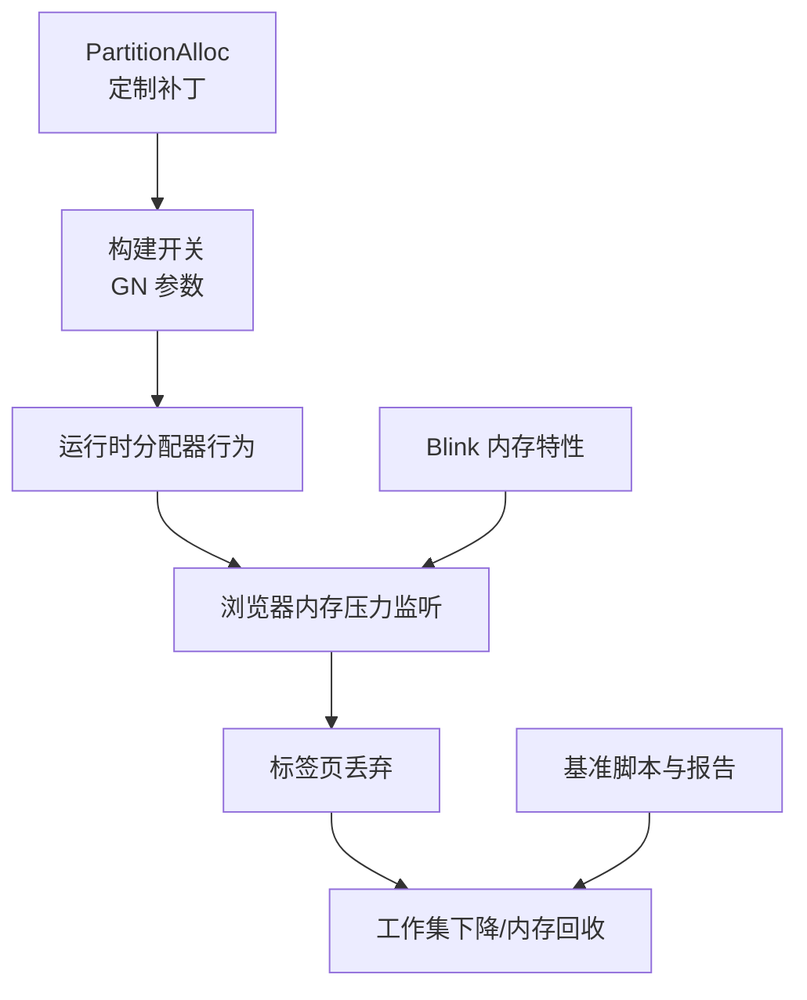
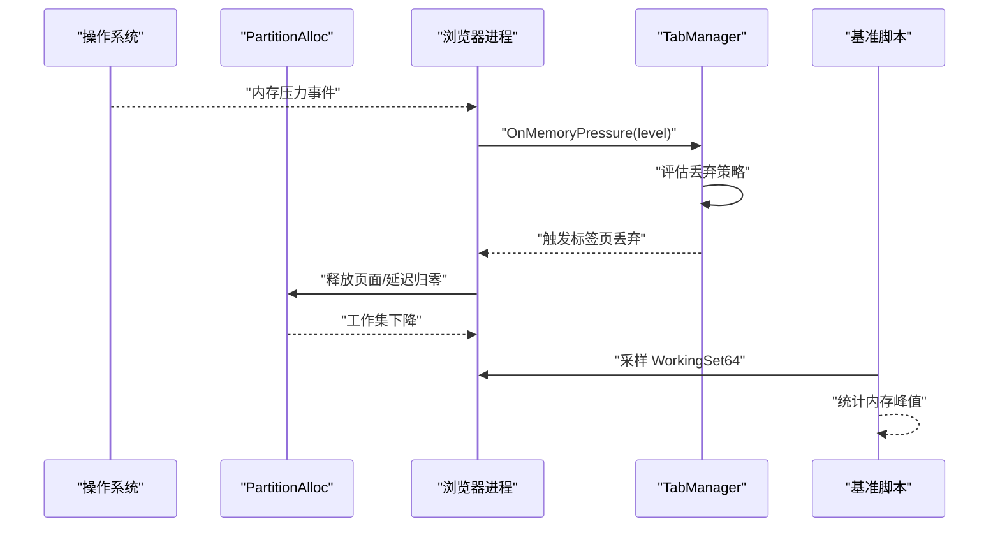
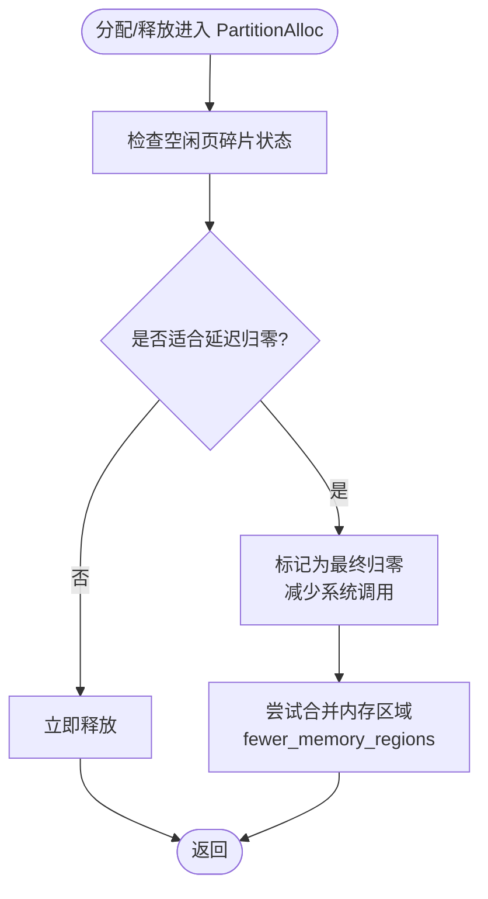
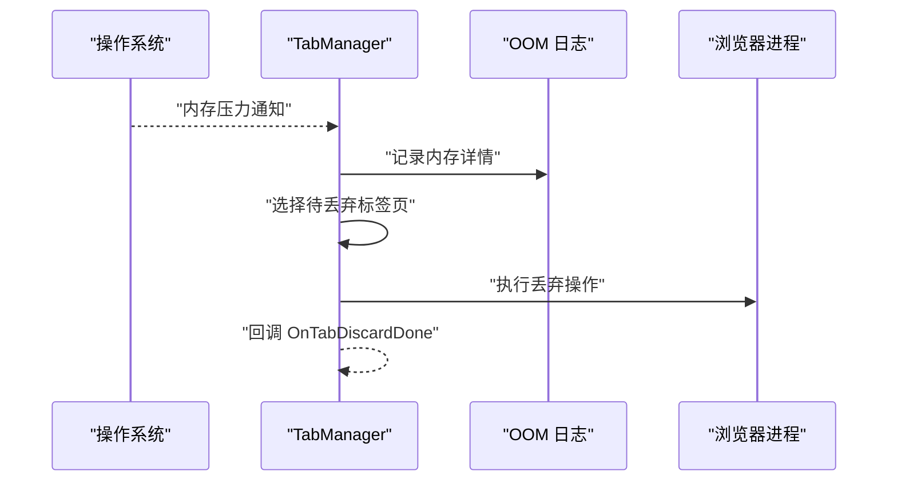
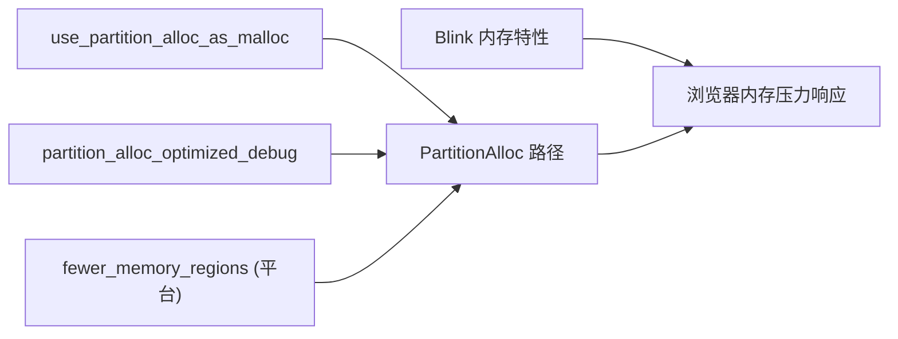

# 内存回收器机制

<cite>
**本文引用的文件**
- [partalloc.patch](file://other/partalloc.patch)
- [args.list](file://infra/args.list)
- [win_args.list](file://infra/win_args.list)
- [mac_args.list](file://other/Mac/mac_args.list)
- [memory-Enable-the-tab-discards-feature.patch](file://infra/Flatpak/com.mcloud.browser/patches/chromium/memory-Enable-the-tab-discards-feature.patch)
- [about_flags.cc](file://src/chrome/browser/about_flags.cc)
- [ui_features.cc](file://src/chrome/browser/ui/ui_features.cc)
- [features.cc](file://src/third_party/blink/common/features.cc)
- [history_backend.cc](file://src/components/history/core/browser/history_backend.cc)
- [bench_memory.ps1](file://benchmark/bench_memory.ps1)
- [M151-benchmark.md](file://docs/dev-logs/M151-benchmark.md)
- [M151-opt-benchmark.md](file://docs/dev-logs/M151-opt-benchmark.md)
</cite>

## 目录
1. [简介](#简介)
2. [项目结构](#项目结构)
3. [核心组件](#核心组件)
4. [架构总览](#架构总览)
5. [详细组件分析](#详细组件分析)
6. [依赖关系分析](#依赖关系分析)
7. [性能考量](#性能考量)
8. [故障排查指南](#故障排查指南)
9. [结论](#结论)
10. [附录](#附录)

## 简介
本文件聚焦于 PartitionAllocMemoryReclaimer 的“零释放内存回收”机制，围绕仓库中已存在的 PartitionAlloc 相关补丁与构建开关、以及浏览器侧的内存压力响应（标签页丢弃）进行系统化说明。重点包括：
- 零释放内存回收机制（eventually_zero_freed_memory）在 PartitionAlloc 中的启用方式与影响范围
- 触发条件、回收策略与算法要点（基于仓库现有配置与补丁）
- 可配置的参数与优化建议（阈值、频率等）
- 监控指标与调试方法
- 性能测试数据与优化效果对比
- 常见内存问题的诊断与解决方案

## 项目结构
仓库中与内存回收相关的代码主要分布在以下位置：
- PartitionAlloc 定制补丁：用于调整分区分配器的行为（如 fewer_memory_regions、eventually_zero_freed_memory）
- 构建开关与 GN 参数：控制是否启用 PartitionAlloc-Everywhere、调试优化等
- 浏览器内存压力响应：通过 TabManager 监听系统内存压力并执行标签页丢弃
- 功能特性开关：Blink 层内存相关特性（强引用、冻结时清理等）
- 基准脚本与报告：用于测量内存峰值与性能变化

图表来源
- [partalloc.patch:1-27](file://other/partalloc.patch#L1-L27)
- [args.list:3982-4017](file://infra/args.list#L3982-L4017)
- [memory-Enable-the-tab-discards-feature.patch:1-98](file://infra/Flatpak/com.mcloud.browser/patches/chromium/memory-Enable-the-tab-discards-feature.patch#L1-L98)

章节来源
- [partalloc.patch:1-27](file://other/partalloc.patch#L1-L27)
- [args.list:3982-4017](file://infra/args.list#L3982-L4017)
- [memory-Enable-the-tab-discards-feature.patch:1-98](file://infra/Flatpak/com.mcloud.browser/patches/chromium/memory-Enable-the-tab-discards-feature.patch#L1-L98)

## 核心组件
- PartitionAlloc 零释放内存回收（eventually_zero_freed_memory）
  - 通过补丁引入/调整 PartitionOptions 中的 eventually_zero_freed_memory，使部分已释放但尚未归零的碎片页能够延迟归零，降低频繁系统调用带来的开销
  - 同时针对 Linux/Android/ChromeOS 平台默认启用 fewer_memory_regions，减少 VMA 数量，缓解系统限制
- 构建开关与运行期特性
  - use_partition_alloc_as_malloc：将分配器路由到 PartitionAlloc
  - partition_alloc_optimized_debug：在 Debug 构建中开启优化，避免全量非优化导致的性能退化
  - Blink 层内存特性：如 kMemoryCacheStrongReference、kMemoryPurgeOnFreeze 等，提供缓存强引用阈值与冻结时清理能力
- 浏览器内存压力响应
  - TabManager 在 Linux/ChromeOS 上监听系统内存压力，必要时触发标签页丢弃，快速释放工作集
  - 历史后端也注册了内存压力监听，配合整体回收策略

章节来源
- [partalloc.patch:1-27](file://other/partalloc.patch#L1-L27)
- [args.list:3982-4017](file://infra/args.list#L3982-L4017)
- [win_args.list:5415-5448](file://infra/win_args.list#L5415-L5448)
- [mac_args.list:5057-5094](file://other/Mac/mac_args.list#L5057-L5094)
- [features.cc:1762-1801](file://src/third_party/blink/common/features.cc#L1762-L1801)
- [memory-Enable-the-tab-discards-feature.patch:1-98](file://infra/Flatpak/com.mcloud.browser/patches/chromium/memory-Enable-the-tab-discards-feature.patch#L1-L98)

## 架构总览
下图展示了从底层分配器到上层浏览器内存压力响应的整体流程，以及基准测试如何观测内存峰值变化。

图表来源
- [memory-Enable-the-tab-discards-feature.patch:1-98](file://infra/Flatpak/com.mcloud.browser/patches/chromium/memory-Enable-the-tab-discards-feature.patch#L1-L98)
- [bench_memory.ps1:1-78](file://benchmark/bench_memory.ps1#L1-L78)
- [partalloc.patch:1-27](file://other/partalloc.patch#L1-L27)

## 详细组件分析

### PartitionAlloc 零释放内存回收（eventually_zero_freed_memory）
- 作用与原理
  - 允许部分已释放但未完全归零的页面延迟归零，减少频繁的系统级释放调用，提升分配/释放吞吐
  - 在 Linux/Android/ChromeOS 上结合 fewer_memory_regions，降低 VMA 数量，规避系统限制
- 触发条件
  - 由 PartitionAlloc 内部根据空闲页状态与压缩比决定何时延迟归零；仓库未暴露细粒度阈值，可通过构建开关与平台特性间接影响
- 回收策略与算法要点
  - 延迟归零：对部分碎片页采用“最终归零”策略，平衡即时释放与系统调用成本
  - 区域合并：fewer_memory_regions 有助于合并相邻区域，减少 VMA 数量
- 配置与优化
  - 使用补丁启用/调整 eventually_zero_freed_memory 与 fewer_memory_regions
  - 在 Debug 构建中开启 partition_alloc_optimized_debug 以避免性能退化
  - 通过 use_partition_alloc_as_malloc 确保分配路径走 PartitionAlloc

图表来源
- [partalloc.patch:1-27](file://other/partalloc.patch#L1-L27)
- [args.list:3982-4017](file://infra/args.list#L3982-L4017)

章节来源
- [partalloc.patch:1-27](file://other/partalloc.patch#L1-L27)
- [args.list:3982-4017](file://infra/args.list#L3982-L4017)

### 浏览器内存压力响应与标签页丢弃
- 触发条件
  - 系统在 Linux/ChromeOS 上报内存压力事件，TabManager 接收并处理
- 回收策略
  - 根据压力级别选择丢弃策略（紧急/常规），记录 OOM 细节，异步执行丢弃回调
- 工作流程
  - 监听内存压力 -> 抑制重复调度 -> 选择目标标签页 -> 执行丢弃 -> 回调完成

图表来源
- [memory-Enable-the-tab-discards-feature.patch:1-98](file://infra/Flatpak/com.mcloud.browser/patches/chromium/memory-Enable-the-tab-discards-feature.patch#L1-L98)

章节来源
- [memory-Enable-the-tab-discards-feature.patch:1-98](file://infra/Flatpak/com.mcloud.browser/patches/chromium/memory-Enable-the-tab-discards-feature.patch#L1-L98)

### Blink 层内存特性（强引用与冻结清理）
- 关键特性
  - kMemoryCacheStrongReference：控制内存缓存强引用阈值，避免过多强引用导致内存增长
  - kMemoryPurgeOnFreeze：在冻结时触发内存清理，降低驻留内存
- 参数化
  - 通过 feature param 设置总大小阈值与资源大小阈值，便于按场景调优

章节来源
- [features.cc:1762-1801](file://src/third_party/blink/common/features.cc#L1762-L1801)

### 历史后端的内存压力监听
- 历史模块注册内存压力监听，参与整体内存回收协作，避免历史缓存占用过高

章节来源
- [history_backend.cc:440-441](file://src/components/history/core/browser/history_backend.cc#L440-L441)
- [history_backend.cc:1352-1353](file://src/components/history/core/browser/history_backend.cc#L1352-L1353)

## 依赖关系分析
- 构建开关依赖
  - use_partition_alloc_as_malloc 决定是否将分配路径路由到 PartitionAlloc
  - partition_alloc_optimized_debug 影响 Debug 构建下的性能表现
- 平台特性依赖
  - Linux/Android/ChromeOS 下 fewer_memory_regions 默认启用，以适配 VMA 限制
- 运行时特性依赖
  - Blink 层内存特性与浏览器内存压力监听共同影响最终回收效果

图表来源
- [args.list:3982-4017](file://infra/args.list#L3982-L4017)
- [win_args.list:5415-5448](file://infra/win_args.list#L5415-L5448)
- [mac_args.list:5057-5094](file://other/Mac/mac_args.list#L5057-L5094)
- [features.cc:1762-1801](file://src/third_party/blink/common/features.cc#L1762-L1801)

章节来源
- [args.list:3982-4017](file://infra/args.list#L3982-L4017)
- [win_args.list:5415-5448](file://infra/win_args.list#L5415-L5448)
- [mac_args.list:5057-5094](file://other/Mac/mac_args.list#L5057-L5094)
- [features.cc:1762-1801](file://src/third_party/blink/common/features.cc#L1762-L1801)

## 性能考量
- 构建与运行期优化
  - 在 Debug 构建中启用 partition_alloc_optimized_debug，避免全量非优化导致的性能退化
  - 合理配置 Blink 层内存特性阈值，避免强引用过多或清理过于激进
- 基准测试与结果
  - 使用 bench_memory.ps1 测量多标签驻留后的工作集峰值，作为内存回收效果的量化指标
  - M151 基线显示内存峰值较前版本略有下降，表明升级与内置标志生效带来一定收益
  - M151-opt 在新增运行时特性后，内存峰值有所上升，需结合具体站点与预载策略评估

章节来源
- [args.list:3982-4017](file://infra/args.list#L3982-L4017)
- [bench_memory.ps1:1-78](file://benchmark/bench_memory.ps1#L1-L78)
- [M151-benchmark.md:1-39](file://docs/dev-logs/M151-benchmark.md#L1-L39)
- [M151-opt-benchmark.md:1-52](file://docs/dev-logs/M151-opt-benchmark.md#L1-L52)

## 故障排查指南
- 常见问题定位
  - 内存峰值异常升高：检查是否启用了过多的预载/强引用特性，或站点预取导致额外内存占用
  - 标签页丢弃不生效：确认 Linux/ChromeOS 平台下内存压力监听是否启用，查看 TabManager 相关逻辑
  - Debug 构建性能退化：确认 partition_alloc_optimized_debug 是否开启
- 调试工具与方法
  - 使用 about_flags 与 ui_features 检查内存相关特性开关
  - 通过基准脚本采集工作集峰值，结合不同 flags 组合对比效果
  - 关注 OOM 日志与内存压力回调，辅助定位丢弃策略执行情况

章节来源
- [about_flags.cc:1170](file://src/chrome/browser/about_flags.cc#L1170)
- [about_flags.cc:5777-5781](file://src/chrome/browser/about_flags.cc#L5777-L5781)
- [ui_features.cc:552](file://src/chrome/browser/ui/ui_features.cc#L552)
- [memory-Enable-the-tab-discards-feature.patch:1-98](file://infra/Flatpak/com.mcloud.browser/patches/chromium/memory-Enable-the-tab-discards-feature.patch#L1-L98)

## 结论
- 仓库通过 PartitionAlloc 补丁与构建开关，实现了零释放内存回收与区域合并，提升了分配效率并降低了系统调用成本
- 浏览器层通过内存压力监听与标签页丢弃，形成端到端的内存回收闭环
- 基准测试表明，合理的特性配置与构建优化可在保持性能的同时改善内存占用
- 建议在复杂场景下结合站点特性与预载策略，动态调整 Blink 层内存特性阈值，以获得最佳平衡

## 附录
- 关键参数与开关
  - use_partition_alloc_as_malloc：启用 PartitionAlloc 作为分配器
  - partition_alloc_optimized_debug：Debug 构建优化
  - eventually_zero_freed_memory：延迟归零已释放碎片页
  - fewer_memory_regions：减少 VMA 数量（Linux/Android/ChromeOS 默认启用）
  - Blink 内存特性：kMemoryCacheStrongReference、kMemoryPurgeOnFreeze 及其阈值参数
- 参考实现与补丁
  - PartitionAlloc 补丁：调整 PartitionOptions 行为
  - 标签页丢弃补丁：启用 Linux/ChromeOS 上的内存压力响应
- 基准与报告
  - 内存峰值测量脚本与报告，用于量化优化效果