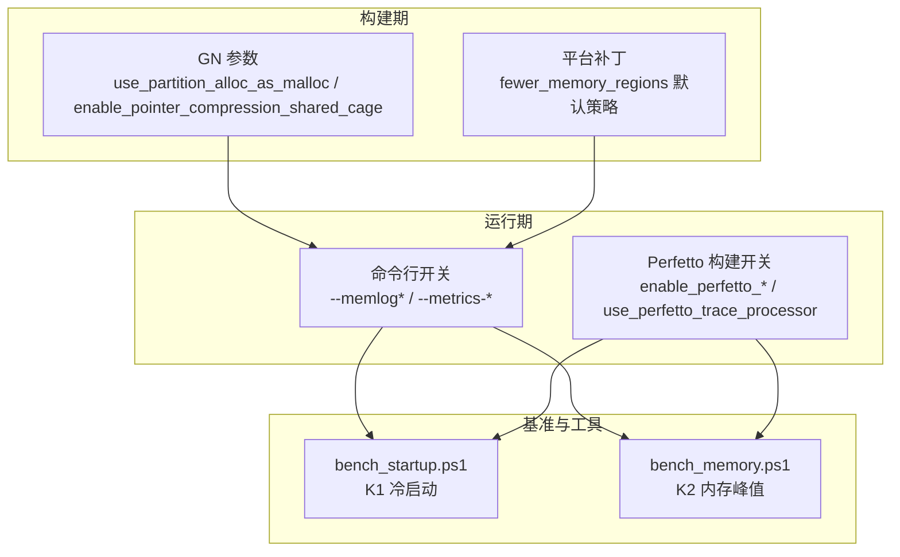
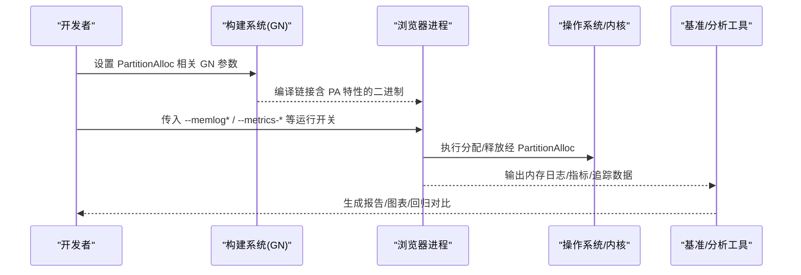
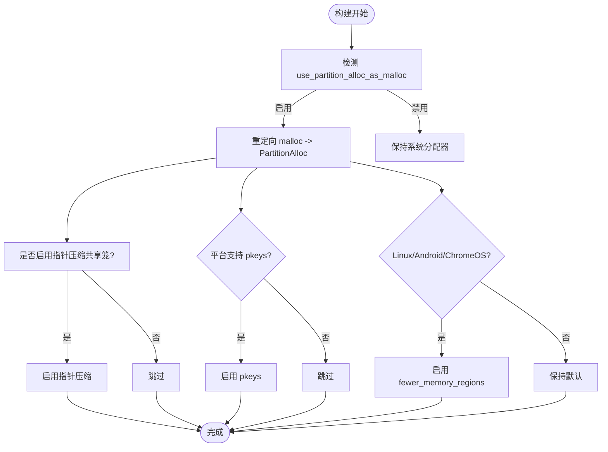
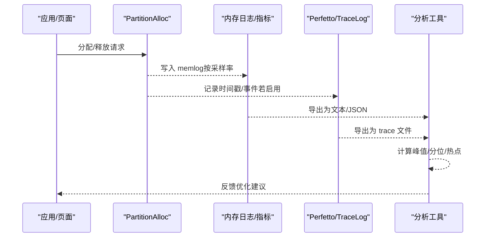
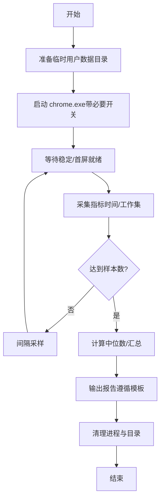
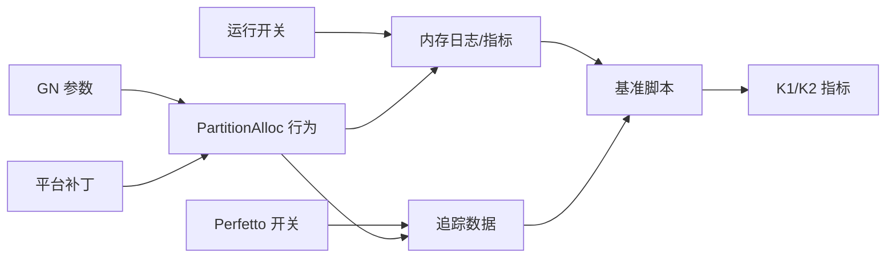

# 性能监控与分析

<cite>
**本文引用的文件**
- [other/partalloc.patch](file://other/partalloc.patch)
- [infra/gn_args.list](file://infra/gn_args.list)
- [infra/win_gn_args.list](file://infra/win_gn_args.list)
- [arm/android/args.list](file://arm/android/args.list)
- [other/Mac/mac_args.list](file://other/Mac/mac_args.list)
- [src/v8/BUILD.gn](file://src/v8/BUILD.gn)
- [benchmark/bench_memory.ps1](file://benchmark/bench_memory.ps1)
- [benchmark/bench_startup.ps1](file://benchmark/bench_startup.ps1)
- [docs/dev-logs/benchmark-template.md](file://docs/dev-logs/benchmark-template.md)
- [docs/CMDLINE_FLAGS_LIST.md](file://docs/CMDLINE_FLAGS_LIST.md)
</cite>

## 目录
1. [简介](#简介)
2. [项目结构](#项目结构)
3. [核心组件](#核心组件)
4. [架构总览](#架构总览)
5. [详细组件分析](#详细组件分析)
6. [依赖关系分析](#依赖关系分析)
7. [性能考量](#性能考量)
8. [故障排查指南](#故障排查指南)
9. [结论](#结论)
10. [附录](#附录)

## 简介
本文件面向 PartitionAlloc 在 Chromium/Thorium 工程中的性能监控与数据分析，聚焦以下目标：
- 如何使用内置开关、构建选项与外部工具采集关键指标（内存使用量、分配延迟、碎片率等）
- 如何解读数据并识别内存泄漏与性能瓶颈
- 如何基于仓库内基准脚本开展自动化测试
- 常见问题的诊断方法与优化建议
- 提供可复现的监控案例与数据分析示例

## 项目结构
围绕 PartitionAlloc 的性能监控，本项目提供了三类支撑：
- 构建期配置：通过 GN 参数控制 PartitionAlloc 行为与相关特性（如指针压缩、VMA 区域限制等）
- 运行时开关：命令行参数用于启用/调整内存日志、指标上报等
- 基准与工具：PowerShell 脚本用于冷启动与内存峰值测量；Perfetto 构建开关支持追踪与分析

**图示来源**
- [infra/gn_args.list:5988-5993](file://infra/gn_args.list#L5988-L5993)
- [other/partalloc.patch:1-27](file://other/partalloc.patch#L1-L27)
- [docs/CMDLINE_FLAGS_LIST.md:1850-1864](file://docs/CMDLINE_FLAGS_LIST.md#L1850-L1864)
- [infra/win_gn_args.list:5596-5602](file://infra/win_gn_args.list#L5596-L5602)
- [benchmark/bench_startup.ps1:1-70](file://benchmark/bench_startup.ps1#L1-L70)
- [benchmark/bench_memory.ps1:1-78](file://benchmark/bench_memory.ps1#L1-L78)

**章节来源**
- [infra/gn_args.list:5988-5993](file://infra/gn_args.list#L5988-L5993)
- [other/partalloc.patch:1-27](file://other/partalloc.patch#L1-L27)
- [docs/CMDLINE_FLAGS_LIST.md:1850-1864](file://docs/CMDLINE_FLAGS_LIST.md#L1850-L1864)
- [infra/win_gn_args.list:5596-5602](file://infra/win_gn_args.list#L5596-L5602)
- [benchmark/bench_startup.ps1:1-70](file://benchmark/bench_startup.ps1#L1-L70)
- [benchmark/bench_memory.ps1:1-78](file://benchmark/bench_memory.ps1#L1-L78)

## 核心组件
- 构建期 PartitionAlloc 开关与特性
  - use_partition_alloc_as_malloc：将 malloc 路由到 PartitionAlloc
  - enable_pointer_compression_shared_cage：指针压缩共享笼，配合 PA-E 效果更佳
  - enable_pkeys：可选硬件保护键能力（平台相关）
- 平台级 PartitionAlloc 行为调优
  - fewer_memory_regions：在 Linux/Android/ChromeOS 上默认启用以减少 VMA 数量
- 运行时指标与日志
  - --memlog、--memlog-sampling-rate、--memlog-stack-mode：内存分配采样与堆栈模式
  - --metrics-recording-only、--metrics-upload-interval：仅记录或缩短指标上报间隔
- Perfetto 追踪
  - enable_perfetto_* 系列开关与 use_perfetto_trace_processor：启用/裁剪追踪能力与处理器后端
- V8 集成
  - v8_enable_partition_alloc：使 V8 使用 PartitionAlloc（受多笼模式约束）

**章节来源**
- [infra/gn_args.list:5988-5993](file://infra/gn_args.list#L5988-L5993)
- [infra/win_gn_args.list:2334-2344](file://infra/win_gn_args.list#L2334-L2344)
- [arm/android/args.list:2402-2415](file://arm/android/args.list#L2402-L2415)
- [other/Mac/mac_args.list:5057-5065](file://other/Mac/mac_args.list#L5057-L5065)
- [other/partalloc.patch:1-27](file://other/partalloc.patch#L1-L27)
- [docs/CMDLINE_FLAGS_LIST.md:1850-1864](file://docs/CMDLINE_FLAGS_LIST.md#L1850-L1864)
- [infra/win_gn_args.list:2162-2232](file://infra/win_gn_args.list#L2162-L2232)
- [infra/gn_args.list:2302-2337](file://infra/gn_args.list#L2302-L2337)
- [src/v8/BUILD.gn:475-480](file://src/v8/BUILD.gn#L475-L480)
- [src/v8/BUILD.gn:623-632](file://src/v8/BUILD.gn#L623-L632)

## 架构总览
下图展示从“构建期配置”到“运行期采集”，再到“基准与可视化”的整体链路。

**图示来源**
- [infra/gn_args.list:5988-5993](file://infra/gn_args.list#L5988-L5993)
- [docs/CMDLINE_FLAGS_LIST.md:1850-1864](file://docs/CMDLINE_FLAGS_LIST.md#L1850-L1864)
- [infra/win_gn_args.list:5596-5602](file://infra/win_gn_args.list#L5596-L5602)
- [benchmark/bench_startup.ps1:1-70](file://benchmark/bench_startup.ps1#L1-L70)
- [benchmark/bench_memory.ps1:1-78](file://benchmark/bench_memory.ps1#L1-L78)

## 详细组件分析

### 构建期 PartitionAlloc 开关与平台补丁
- use_partition_alloc_as_malloc：将标准分配调用重定向至 PartitionAlloc，便于统一监控与优化
- enable_pointer_compression_shared_cage：指针压缩可减少内存占用，提升缓存局部性
- enable_pkeys：在支持平台上启用硬件保护键，增强安全性与隔离
- fewer_memory_regions（Linux/Android/ChromeOS）：减少 VMA 数量，缓解每进程 VMA 上限压力，降低页表/映射开销

**图示来源**
- [infra/gn_args.list:5988-5993](file://infra/gn_args.list#L5988-L5993)
- [infra/win_gn_args.list:2334-2344](file://infra/win_gn_args.list#L2334-L2344)
- [arm/android/args.list:2402-2415](file://arm/android/args.list#L2402-L2415)
- [other/Mac/mac_args.list:5057-5065](file://other/Mac/mac_args.list#L5057-L5065)
- [other/partalloc.patch:1-27](file://other/partalloc.patch#L1-L27)

**章节来源**
- [infra/gn_args.list:5988-5993](file://infra/gn_args.list#L5988-L5993)
- [infra/win_gn_args.list:2334-2344](file://infra/win_gn_args.list#L2334-L2344)
- [arm/android/args.list:2402-2415](file://arm/android/args.list#L2402-L2415)
- [other/Mac/mac_args.list:5057-5065](file://other/Mac/mac_args.list#L5057-L5065)
- [other/partalloc.patch:1-27](file://other/partalloc.patch#L1-L27)

### 运行时指标与日志（内存使用量、分配延迟、碎片率）
- 内存使用量
  - 使用 --memlog 系列开关进行分配采样与堆栈模式选择，结合 Perfetto 或 base::TraceLog 导出
  - 使用 --metrics-recording-only 仅记录不上传，便于本地调试
  - 使用 --metrics-upload-interval 缩短上报周期以更快观察趋势
- 分配延迟
  - 通过 Perfetto 时间线事件（若启用）观察分配热点与耗时分布
  - 结合 --memlog-sampling-rate 调节采样粒度，平衡开销与信息量
- 碎片率
  - 关注 fewer_memory_regions 对 VMA 数量的影响，结合系统工具统计映射数变化
  - 通过工作集与驻留内存曲线判断碎片化趋势

**图示来源**
- [docs/CMDLINE_FLAGS_LIST.md:1850-1864](file://docs/CMDLINE_FLAGS_LIST.md#L1850-L1864)
- [infra/win_gn_args.list:5596-5602](file://infra/win_gn_args.list#L5596-L5602)
- [infra/gn_args.list:2302-2337](file://infra/gn_args.list#L2302-L2337)

**章节来源**
- [docs/CMDLINE_FLAGS_LIST.md:1850-1864](file://docs/CMDLINE_FLAGS_LIST.md#L1850-L1864)
- [infra/win_gn_args.list:5596-5602](file://infra/win_gn_args.list#L5596-L5602)
- [infra/gn_args.list:2302-2337](file://infra/gn_args.list#L2302-L2337)

### 基准与自动化测试（K1/K2）
- K1 冷启动时间：bench_startup.ps1 使用全新用户数据目录启动 chrome.exe，等待主窗口初始化作为首屏可交互代理，多次运行取中位数
- K2 内存峰值：bench_memory.ps1 打开固定数量标签页，稳定后对所有浏览器进程 WorkingSet64 求和，多次采样取中位数
- 结果记录：遵循 docs/dev-logs/benchmark-template.md 模板，确保环境信息与原始数据完整

**图示来源**
- [benchmark/bench_startup.ps1:1-70](file://benchmark/bench_startup.ps1#L1-L70)
- [benchmark/bench_memory.ps1:1-78](file://benchmark/bench_memory.ps1#L1-L78)
- [docs/dev-logs/benchmark-template.md:1-39](file://docs/dev-logs/benchmark-template.md#L1-L39)

**章节来源**
- [benchmark/bench_startup.ps1:1-70](file://benchmark/bench_startup.ps1#L1-L70)
- [benchmark/bench_memory.ps1:1-78](file://benchmark/bench_memory.ps1#L1-L78)
- [docs/dev-logs/benchmark-template.md:1-39](file://docs/dev-logs/benchmark-template.md#L1-L39)

### V8 与 PartitionAlloc 集成
- v8_enable_partition_alloc：允许 V8 使用 PartitionAlloc，需满足多笼模式约束
- 该集成有助于统一内存管理、简化监控与优化路径

**章节来源**
- [src/v8/BUILD.gn:475-480](file://src/v8/BUILD.gn#L475-L480)
- [src/v8/BUILD.gn:623-632](file://src/v8/BUILD.gn#L623-L632)

## 依赖关系分析
- 构建期依赖
  - PartitionAlloc 开关影响全局分配路径，进而影响所有模块的内存行为
  - 平台补丁 fewer_memory_regions 针对 Linux/Android/ChromeOS 的 VMA 限制进行优化
- 运行期依赖
  - 命令行开关决定日志与指标采集范围与频率
  - Perfetto 构建开关决定追踪能力与后端可用性
- 基准工具依赖
  - 脚本依赖操作系统进程管理与计时能力
  - 结果记录依赖模板规范以保证可比性

**图示来源**
- [infra/gn_args.list:5988-5993](file://infra/gn_args.list#L5988-L5993)
- [other/partalloc.patch:1-27](file://other/partalloc.patch#L1-L27)
- [docs/CMDLINE_FLAGS_LIST.md:1850-1864](file://docs/CMDLINE_FLAGS_LIST.md#L1850-L1864)
- [infra/win_gn_args.list:5596-5602](file://infra/win_gn_args.list#L5596-L5602)
- [benchmark/bench_startup.ps1:1-70](file://benchmark/bench_startup.ps1#L1-L70)
- [benchmark/bench_memory.ps1:1-78](file://benchmark/bench_memory.ps1#L1-L78)

**章节来源**
- [infra/gn_args.list:5988-5993](file://infra/gn_args.list#L5988-L5993)
- [other/partalloc.patch:1-27](file://other/partalloc.patch#L1-L27)
- [docs/CMDLINE_FLAGS_LIST.md:1850-1864](file://docs/CMDLINE_FLAGS_LIST.md#L1850-L1864)
- [infra/win_gn_args.list:5596-5602](file://infra/win_gn_args.list#L5596-L5602)
- [benchmark/bench_startup.ps1:1-70](file://benchmark/bench_startup.ps1#L1-L70)
- [benchmark/bench_memory.ps1:1-78](file://benchmark/bench_memory.ps1#L1-L78)

## 性能考量
- 内存使用量
  - 优先使用 --memlog 与 Perfetto 追踪定位热点分配
  - 在 Linux/Android/ChromeOS 上利用 fewer_memory_regions 降低 VMA 压力
- 分配延迟
  - 合理设置 --memlog-sampling-rate，避免过高采样导致额外开销
  - 使用 Perfetto 时间线分析长尾延迟
- 碎片率
  - 关注工作集与驻留内存的长期趋势，结合系统映射统计评估碎片化
  - 结合指针压缩与共享笼减少内存占用与碎片
- 基准稳定性
  - 使用全新用户数据目录、关闭无关扩展与服务
  - 多次采样取中位数，记录环境与原始数据

[本节为通用指导，不直接分析具体文件]

## 故障排查指南
- 无法采集内存日志
  - 检查是否启用了 --memlog 及合适的采样率
  - 确认未因沙箱或权限问题导致日志写入失败
- 指标上报异常
  - 使用 --metrics-recording-only 仅本地记录，排除网络干扰
  - 缩短 --metrics-upload-interval 加速观测
- Perfetto 不可用
  - 检查 enable_perfetto_* 与 use_perfetto_trace_processor 构建开关
  - 确认目标平台支持所需后端（如 SQLite/JSON）
- 基准结果不稳定
  - 确保每次使用全新用户数据目录
  - 关闭其他浏览器实例，避免竞争资源
  - 增加采样次数与间隔，记录原始数据

**章节来源**
- [docs/CMDLINE_FLAGS_LIST.md:1850-1864](file://docs/CMDLINE_FLAGS_LIST.md#L1850-L1864)
- [infra/win_gn_args.list:5596-5602](file://infra/win_gn_args.list#L5596-L5602)
- [infra/gn_args.list:2302-2337](file://infra/gn_args.list#L2302-L2337)
- [benchmark/bench_startup.ps1:1-70](file://benchmark/bench_startup.ps1#L1-L70)
- [benchmark/bench_memory.ps1:1-78](file://benchmark/bench_memory.ps1#L1-L78)

## 结论
- 通过构建期开关与平台补丁，可在不同平台上获得一致的 PartitionAlloc 行为与优化收益
- 运行期日志与 Perfetto 追踪提供细粒度的内存与延迟洞察
- 基准脚本提供可重复的 K1/K2 指标采集流程，配合模板确保结果可比性
- 建议在 CI 中集成上述流程，持续监控回归与优化效果

[本节为总结，不直接分析具体文件]

## 附录
- 常用 GN 参数速查
  - use_partition_alloc_as_malloc：启用 PartitionAlloc 作为分配器
  - enable_pointer_compression_shared_cage：启用指针压缩共享笼
  - enable_pkeys：启用硬件保护键（平台相关）
  - enable_perfetto_*：启用 Perfetto 追踪能力
  - use_perfetto_trace_processor：启用追踪处理器后端
- 常用命令行开关
  - --memlog、--memlog-sampling-rate、--memlog-stack-mode：内存日志与采样
  - --metrics-recording-only、--metrics-upload-interval：指标记录与上报间隔
- 基准脚本用法
  - bench_startup.ps1：K1 冷启动时间
  - bench_memory.ps1：K2 内存峰值（固定标签集驻留工作集）
  - 结果记录：docs/dev-logs/benchmark-template.md

**章节来源**
- [infra/gn_args.list:5988-5993](file://infra/gn_args.list#L5988-L5993)
- [infra/win_gn_args.list:2162-2232](file://infra/win_gn_args.list#L2162-L2232)
- [docs/CMDLINE_FLAGS_LIST.md:1850-1864](file://docs/CMDLINE_FLAGS_LIST.md#L1850-L1864)
- [benchmark/bench_startup.ps1:1-70](file://benchmark/bench_startup.ps1#L1-L70)
- [benchmark/bench_memory.ps1:1-78](file://benchmark/bench_memory.ps1#L1-L78)
- [docs/dev-logs/benchmark-template.md:1-39](file://docs/dev-logs/benchmark-template.md#L1-L39)