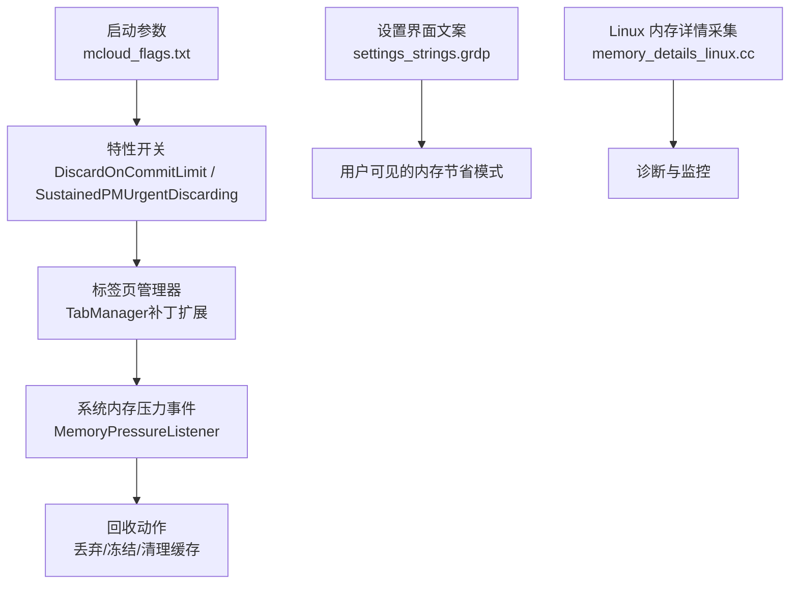
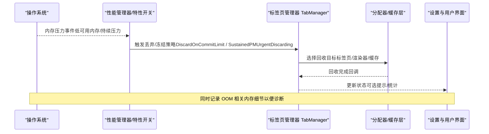
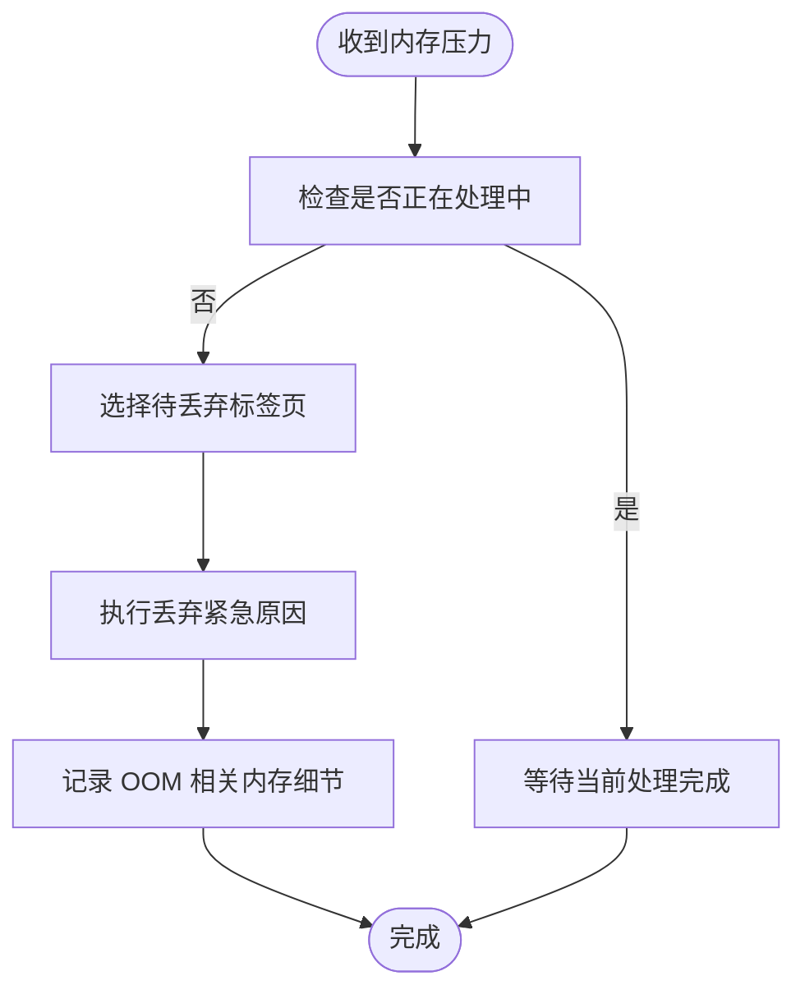
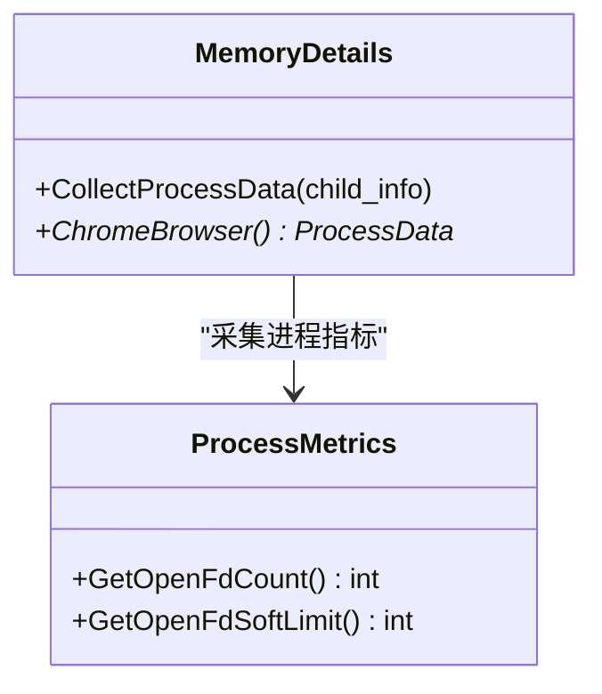
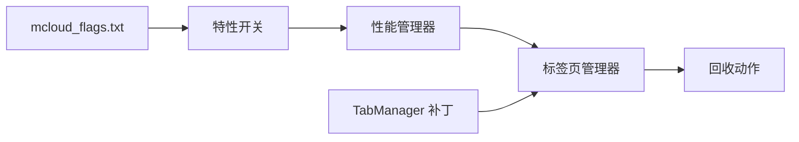

# 内存压力管理

<cite>
**本文引用的文件**
- [README.md](file://README.md)
- [mcloud_flags.txt](file://mcloud_flags.txt)
- [memory-Enable-the-tab-discards-feature.patch](file://infra/Flatpak/com.mcloud.browser/patches/chromium/memory-Enable-the-tab-discards-feature.patch)
- [2026-06-19-performance-optimization-design.md](file://docs/superpowers/specs/2026-06-19-performance-optimization-design.md)
- [settings_strings.grdp](file://src/chrome/app/settings_strings.grdp)
- [memory_details_linux.cc](file://src/chrome/browser/memory_details_linux.cc)
</cite>

## 目录
1. [简介](#简介)
2. [项目结构](#项目结构)
3. [核心组件](#核心组件)
4. [架构总览](#架构总览)
5. [详细组件分析](#详细组件分析)
6. [依赖关系分析](#依赖关系分析)
7. [性能考量](#性能考量)
8. [故障排查指南](#故障排查指南)
9. [结论](#结论)
10. [附录](#附录)

## 简介
本文件聚焦于 Thorium/MCloud Browser 的内存压力管理机制，系统性地说明：
- 系统级与应用级的内存监控与阈值策略
- 紧急回收策略 DiscardOnCommitLimit、SustainedPMUrgentDiscarding 的工作原理与触发条件
- 内存压力下资源回收优先级、标签页丢弃算法与用户界面响应策略
- 预警机制与预防措施（预加载限制、缓存清理等）
- 监控工具使用方法与问题诊断技巧
- 针对不同硬件配置的优化建议

## 项目结构
本项目围绕“启动参数注入 + 特性开关 + 平台补丁”的方式实现内存压力管理：
- 启动参数集中配置在 mcloud_flags.txt，启用一系列内存相关特性开关
- 通过补丁将 Linux/ChromeOS 平台的标签页丢弃能力从平台限定扩展到更广泛场景
- 设计文档对关键特性进行归纳与来源定位
- 设置文案体现“内存节省模式”的用户可感知选项
- 平台侧提供进程/内存信息收集能力，便于诊断

图表来源
- [mcloud_flags.txt:27-38](file://mcloud_flags.txt#L27-L38)
- [memory-Enable-the-tab-discards-feature.patch:24-33](file://infra/Flatpak/com.mcloud.browser/patches/chromium/memory-Enable-the-tab-discards-feature.patch#L24-L33)
- [2026-06-19-performance-optimization-design.md:78-88](file://docs/superpowers/specs/2026-06-19-performance-optimization-design.md#L78-L88)
- [settings_strings.grdp:1050-1089](file://src/chrome/app/settings_strings.grdp#L1050-L1089)
- [memory_details_linux.cc:110-146](file://src/chrome/browser/memory_details_linux.cc#L110-L146)

章节来源
- [mcloud_flags.txt:27-38](file://mcloud_flags.txt#L27-L38)
- [memory-Enable-the-tab-discards-feature.patch:24-33](file://infra/Flatpak/com.mcloud.browser/patches/chromium/memory-Enable-the-tab-discards-feature.patch#L24-L33)
- [2026-06-19-performance-optimization-design.md:78-88](file://docs/superpowers/specs/2026-06-19-performance-optimization-design.md#L78-L88)
- [settings_strings.grdp:1050-1089](file://src/chrome/app/settings_strings.grdp#L1050-L1089)
- [memory_details_linux.cc:110-146](file://src/chrome/browser/memory_details_linux.cc#L110-L146)

## 核心组件
- 启动参数与特性开关
  - 通过 mcloud_flags.txt 启用内存优化相关特性，包括标签页冻结、分配器优化、提交限制下丢弃、持续压力紧急丢弃、预绘制瓦片回收、传输缓存清理等。
- 标签页管理器（TabManager）
  - 通过补丁扩展，使 Linux/ChromeOS 平台在内存压力下调用丢弃流程，并记录 OOM 相关内存细节。
- 设置界面与用户策略
  - 提供“内存节省模式”的保守/均衡/激进三档策略，影响标签页不活跃后进入空闲或丢弃的时间窗口。
- 平台内存信息采集
  - Linux 平台提供进程遍历、子进程聚合、打开句柄数等信息采集，用于诊断与监控。

章节来源
- [mcloud_flags.txt:27-38](file://mcloud_flags.txt#L27-L38)
- [memory-Enable-the-tab-discards-feature.patch:42-57](file://infra/Flatpak/com.mcloud.browser/patches/chromium/memory-Enable-the-tab-discards-feature.patch#L42-L57)
- [settings_strings.grdp:1050-1089](file://src/chrome/app/settings_strings.grdp#L1050-L1089)
- [memory_details_linux.cc:40-77](file://src/chrome/browser/memory_details_linux.cc#L40-L77)

## 架构总览
下图展示内存压力从系统到应用的完整链路：系统内存告警 → 应用监听 → 策略决策 → 执行回收（丢弃/冻结/清理）→ 结果反馈与日志。

图表来源
- [memory-Enable-the-tab-discards-feature.patch:42-57](file://infra/Flatpak/com.mcloud.browser/patches/chromium/memory-Enable-the-tab-discards-feature.patch#L42-L57)
- [2026-06-19-performance-optimization-design.md:78-88](file://docs/superpowers/specs/2026-06-19-performance-optimization-design.md#L78-L88)
- [mcloud_flags.txt:27-38](file://mcloud_flags.txt#L27-L38)

## 详细组件分析

### 系统级与应用级内存监控
- 系统级
  - 通过平台提供的内存压力事件驱动应用行为，例如在 Linux/ChromeOS 上由 MemoryPressureListener 通知。
- 应用级
  - 通过性能管理器与特性开关组合，决定何时触发丢弃、冻结与缓存清理；同时结合“内存节省模式”的用户偏好。

章节来源
- [memory-Enable-the-tab-discards-feature.patch:24-33](file://infra/Flatpak/com.mcloud.browser/patches/chromium/memory-Enable-the-tab-discards-feature.patch#L24-L33)
- [2026-06-19-performance-optimization-design.md:78-88](file://docs/superpowers/specs/2026-06-19-performance-optimization-design.md#L78-L88)
- [settings_strings.grdp:1050-1089](file://src/chrome/app/settings_strings.grdp#L1050-L1089)

### 紧急回收策略：DiscardOnCommitLimit 与 SustainedPMUrgentDiscarding
- DiscardOnCommitLimit
  - 当可用内存低于阈值（如 <10%）时，主动丢弃标签页以避免 OOM。
- SustainedPMUrgentDiscarding
  - 在持续内存压力下，执行更积极的紧急丢弃，快速释放资源以恢复稳定性。

章节来源
- [2026-06-19-performance-optimization-design.md:78-88](file://docs/superpowers/specs/2026-06-19-performance-optimization-design.md#L78-L88)
- [README.md:121-134](file://README.md#L121-L134)
- [mcloud_flags.txt:27-38](file://mcloud_flags.txt#L27-L38)

### 标签页丢弃算法与回收优先级
- 触发点
  - 系统内存压力事件到达后，TabManager 调用丢弃流程，并以“紧急”原因执行丢弃。
- 优先级
  - 优先丢弃非活跃、可重建成本低的页面；保护前台交互与关键任务。
- 副作用控制
  - 在丢弃过程中抑制重复通知，避免短时间内过度丢弃导致抖动。

图表来源
- [memory-Enable-the-tab-discards-feature.patch:42-57](file://infra/Flatpak/com.mcloud.browser/patches/chromium/memory-Enable-the-tab-discards-feature.patch#L42-L57)

章节来源
- [memory-Enable-the-tab-discards-feature.patch:42-57](file://infra/Flatpak/com.mcloud.browser/patches/chromium/memory-Enable-the-tab-discards-feature.patch#L42-L57)

### 用户界面响应策略
- 内存节省模式
  - 提供保守/均衡/激进三种策略，影响标签页进入空闲或丢弃的时间窗口。
- 用户体验
  - 在压力缓解后，允许按需恢复页面；必要时提示用户关注异常占用。

章节来源
- [settings_strings.grdp:1050-1089](file://src/chrome/app/settings_strings.grdp#L1050-L1089)

### 预警机制与预防措施
- 预加载限制
  - 移除或限制高内存代价的预加载特性，降低峰值占用。
- 缓存清理
  - 启用旧预绘制瓦片回收、旧传输缓存条目清理，减少长期驻留内存。
- 分配器优化
  - 使用 PartitionAlloc 相关优化（排序活跃槽段、优先级继承锁、非主框架更低限制），降低碎片与竞争。

章节来源
- [mcloud_flags.txt:27-38](file://mcloud_flags.txt#L27-L38)
- [2026-06-19-performance-optimization-design.md:78-88](file://docs/superpowers/specs/2026-06-19-performance-optimization-design.md#L78-L88)

### 监控工具与诊断技巧
- 进程与内存信息采集
  - 在 Linux 平台，通过进程迭代与子进程聚合，获取进程类型、打开句柄数等信息，辅助定位内存热点。
- OOM 细节记录
  - 在丢弃流程中记录每进程内存使用与 GPU 内存细节，便于事后分析。

图表来源
- [memory_details_linux.cc:54-77](file://src/chrome/browser/memory_details_linux.cc#L54-L77)
- [memory_details_linux.cc:110-146](file://src/chrome/browser/memory_details_linux.cc#L110-L146)

章节来源
- [memory_details_linux.cc:54-77](file://src/chrome/browser/memory_details_linux.cc#L54-L77)
- [memory_details_linux.cc:110-146](file://src/chrome/browser/memory_details_linux.cc#L110-L146)

## 依赖关系分析
- 启动参数依赖
  - mcloud_flags.txt 中的特性开关直接驱动内存压力行为（丢弃、冻结、分配器优化、缓存清理）。
- 平台补丁依赖
  - 补丁扩展了 TabManager 在 Linux/ChromeOS 上的内存压力处理能力，使其能响应系统事件并执行丢弃。
- 设计与文档依赖
  - 设计文档明确了各特性的作用与来源，为调优与排障提供依据。

图表来源
- [mcloud_flags.txt:27-38](file://mcloud_flags.txt#L27-L38)
- [memory-Enable-the-tab-discards-feature.patch:24-33](file://infra/Flatpak/com.mcloud.browser/patches/chromium/memory-Enable-the-tab-discards-feature.patch#L24-L33)

章节来源
- [mcloud_flags.txt:27-38](file://mcloud_flags.txt#L27-L38)
- [memory-Enable-the-tab-discards-feature.patch:24-33](file://infra/Flatpak/com.mcloud.browser/patches/chromium/memory-Enable-the-tab-discards-feature.patch#L24-L33)

## 性能考量
- 多标签页场景
  - 通过标签页冻结与提交限制下的丢弃，显著降低峰值内存占用。
- 分配器层面
  - 使用 PartitionAlloc 优化减少碎片与锁竞争，提升回收效率。
- 渲染与缓存
  - 回收旧预绘制瓦片与清理传输缓存，降低长驻内存。
- 线程与 IO
  - 专用线程与自旋锁优化提升响应性，间接降低因阻塞导致的内存滞留。

[本节为通用性能讨论，不直接分析具体文件]

## 故障排查指南
- 症状：频繁卡顿或崩溃
  - 检查是否启用了 DiscardOnCommitLimit 与 SustainedPMUrgentDiscarding，确认在低可用内存时能及时丢弃。
- 症状：内存占用过高
  - 查看 Linux 平台进程与句柄信息，识别异常进程或泄漏点；核对是否启用了过多预加载或缓存特性。
- 症状：用户感知页面被丢弃
  - 调整“内存节省模式”至更保守策略，或为重要站点添加例外列表。

章节来源
- [memory_details_linux.cc:110-146](file://src/chrome/browser/memory_details_linux.cc#L110-L146)
- [settings_strings.grdp:1050-1089](file://src/chrome/app/settings_strings.grdp#L1050-L1089)
- [README.md:121-134](file://README.md#L121-L134)

## 结论
本项目通过“启动参数 + 特性开关 + 平台补丁”的组合，构建了从系统到应用的内存压力管理体系。DiscardOnCommitLimit 与 SustainedPMUrgentDiscarding 提供了关键的安全阀，配合标签页冻结、分配器优化与缓存清理，有效降低内存峰值并提升稳定性。用户可通过“内存节省模式”平衡体验与资源占用。借助平台采集与 OOM 细节记录，便于定位与优化。

[本节为总结性内容，不直接分析具体文件]

## 附录
- 常用标志参考
  - 内存优化：DiscardOnCommitLimit、SustainedPMUrgentDiscarding、InfiniteTabsFreezingOnMemoryPressure、PartitionAllocSortActiveSlotSpans、LowerPAMemoryLimitForNonMainRenderers、ReclaimOldPrepaintTiles、PruneOldTransferCacheEntries
  - 多线程与 IO：IOThreadInteractiveThreadType、MojoDedicatedThread、BaseLockTrySpin、BoostClosingTabs、UnimportantFramesPriority
- 构建与验证
  - 通过 verify_builtin_flags.ps1 验证内置标志注入情况，确保运行期生效。

章节来源
- [README.md:121-134](file://README.md#L121-L134)
- [mcloud_flags.txt:27-38](file://mcloud_flags.txt#L27-L38)