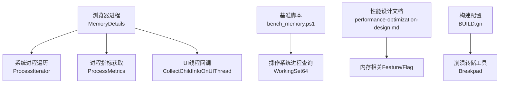
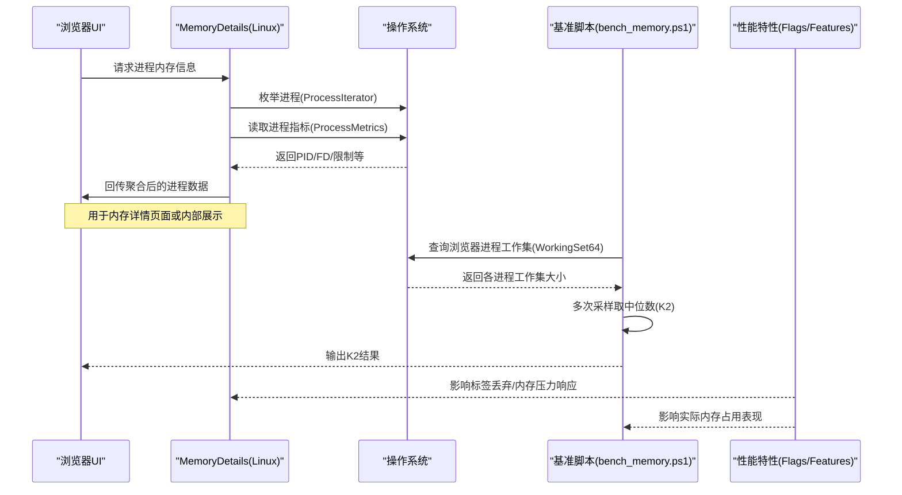
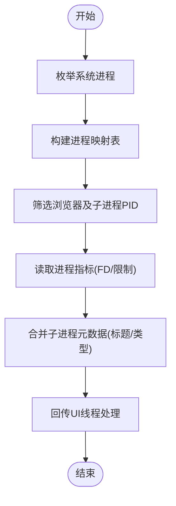
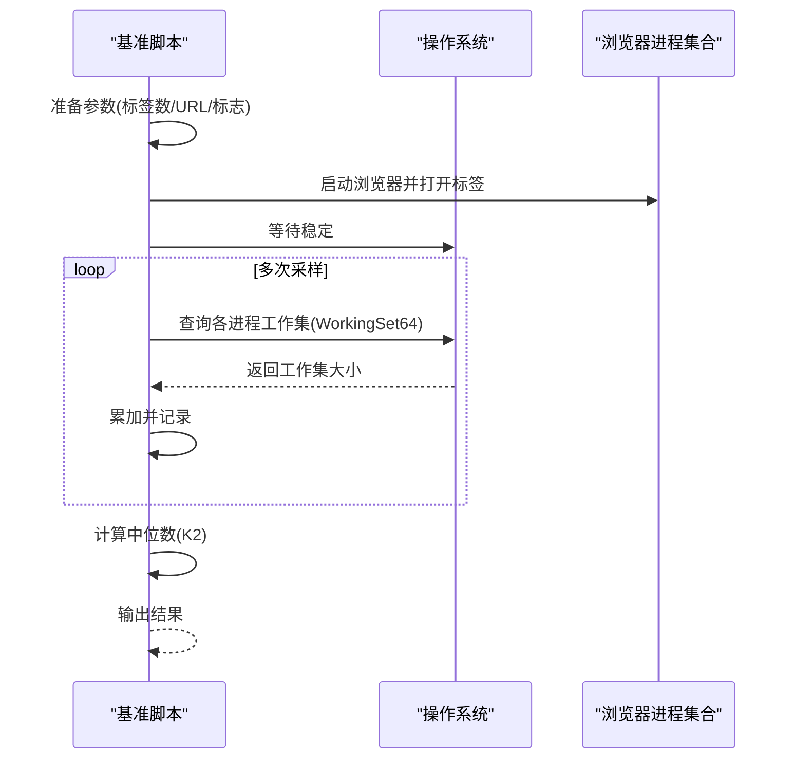
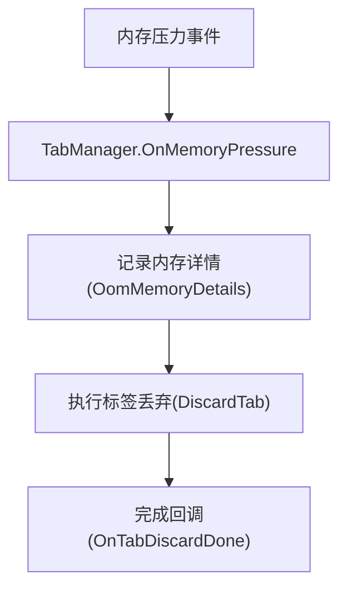
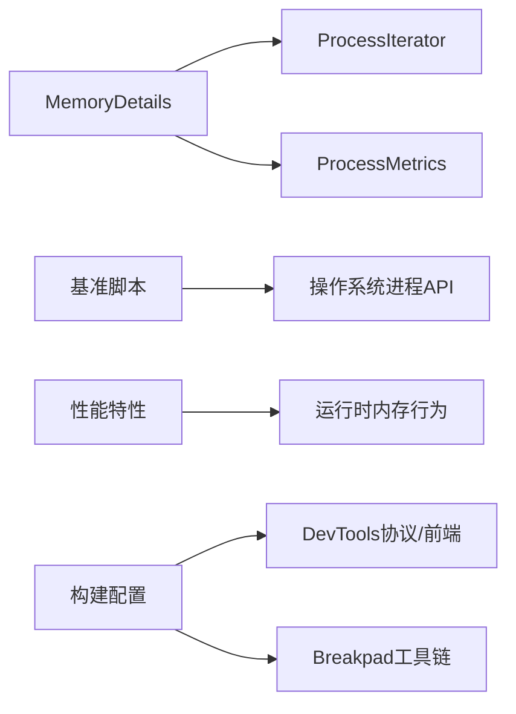

# 内存监控与分析

本文引用的文件

- [memory_details_linux.cc](https://github.com/Mcloud136/Mcloud-Browser/blob/main/src/chrome/browser/memory_details_linux.cc)
- [bench_memory.ps1](https://github.com/Mcloud136/Mcloud-Browser/blob/main/benchmark/bench_memory.ps1)
- [M151-opt-benchmark.md](https://github.com/Mcloud136/Mcloud-Browser/blob/main/docs/dev-logs/M151-opt-benchmark.md)
- [performance-optimization-design.md](https://github.com/Mcloud136/Mcloud-Browser/blob/main/docs/superpowers/specs/2026-06-19-performance-optimization-design.md)
- [settings_strings.grdp](https://github.com/Mcloud136/Mcloud-Browser/blob/main/src/chrome/app/settings_strings.grdp)
- [features.cc](https://github.com/Mcloud136/Mcloud-Browser/blob/main/src/third_party/blink/common/features.cc)
- [BUILD.gn](https://github.com/Mcloud136/Mcloud-Browser/blob/main/src/BUILD.gn)
- [memory-Enable-the-tab-discards-feature.patch](https://github.com/Mcloud136/Mcloud-Browser/blob/main/infra/Flatpak/com.mcloud.browser/patches/chromium/memory-Enable-the-tab-discards-feature.patch)
- [CMDLINE_FLAGS_LIST.md](https://github.com/Mcloud136/Mcloud-Browser/blob/main/infra/CMDLINE_FLAGS_LIST.md)
- [args.list](https://github.com/Mcloud136/Mcloud-Browser/blob/main/arm/android/args.list)

## 目录
1. [简介](#简介)
2. [项目结构](#项目结构)
3. [核心组件](#核心组件)
4. [架构总览](#架构总览)
5. [详细组件分析](#详细组件分析)
6. [依赖关系分析](#依赖关系分析)
7. [性能考量](#性能考量)
8. [故障排查指南](#故障排查指南)
9. [结论](#结论)
10. [附录](#附录)

## 简介
本文件面向 MCloud Browser 的内存监控与性能分析，覆盖以下主题：
- 内置内存监控能力：进程级内存统计、指标采集与可视化入口。
- Chrome DevTools 内存分析：堆快照、内存泄漏检测、性能剖析方法。
- 内存使用模式分析与优化建议生成机制。
- 标准诊断流程与工具链：日志分析、崩溃转储处理、性能基准测试。
- 常见问题识别与解决策略，以及性能优化最佳实践。

## 项目结构
围绕内存监控与分析，仓库中与本主题直接相关的代码与脚本主要分布在：
- 浏览器侧内存信息采集：Linux 平台进程信息收集实现位于 src/chrome/browser/memory_details_linux.cc。
- 基准测试与指标记录：benchmark/bench_memory.ps1 提供 K2 内存峰值（多标签驻留工作集）自动化测量；docs/dev-logs/M151-opt-benchmark.md 记录基线与优化结果。
- 性能与内存特性开关：docs/superpowers/specs/2026-06-19-performance-optimization-design.md 汇总了多项内存相关 feature/flag。
- 用户界面与设置文案：src/chrome/app/settings_strings.grdp 暴露“内存节省”等性能设置项。
- 构建与工具链：src/BUILD.gn 集成 breakpad 等崩溃转储工具；arm/android/args.list 包含 devtools 相关构建配置。

图表来源
- [memory_details_linux.cc:40-77](https://github.com/Mcloud136/Mcloud-Browser/blob/main/src/chrome/browser/memory_details_linux.cc#L40-L77)
- [memory_details_linux.cc:110-146](https://github.com/Mcloud136/Mcloud-Browser/blob/main/src/chrome/browser/memory_details_linux.cc#L110-L146)
- [bench_memory.ps1:58-77](https://github.com/Mcloud136/Mcloud-Browser/blob/main/benchmark/bench_memory.ps1#L58-L77)
- [performance-optimization-design.md:78-88](https://github.com/Mcloud136/Mcloud-Browser/blob/main/docs/superpowers/specs/2026-06-19-performance-optimization-design.md#L78-L88)
- [BUILD.gn:673-684](https://github.com/Mcloud136/Mcloud-Browser/blob/main/src/BUILD.gn#L673-L684)

章节来源
- [memory_details_linux.cc:1-147](https://github.com/Mcloud136/Mcloud-Browser/blob/main/src/chrome/browser/memory_details_linux.cc#L1-L147)
- [bench_memory.ps1:1-78](https://github.com/Mcloud136/Mcloud-Browser/blob/main/benchmark/bench_memory.ps1#L1-L78)
- [M151-opt-benchmark.md:1-32](https://github.com/Mcloud136/Mcloud-Browser/blob/main/docs/dev-logs/M151-opt-benchmark.md#L1-L32)
- [performance-optimization-design.md:78-188](https://github.com/Mcloud136/Mcloud-Browser/blob/main/docs/superpowers/specs/2026-06-19-performance-optimization-design.md#L78-L188)
- [settings_strings.grdp:1038-1089](https://github.com/Mcloud136/Mcloud-Browser/blob/main/src/chrome/app/settings_strings.grdp#L1038-L1089)
- [features.cc:1795-1835](https://github.com/Mcloud136/Mcloud-Browser/blob/main/src/third_party/blink/common/features.cc#L1795-L1835)
- [BUILD.gn:673-684](https://github.com/Mcloud136/Mcloud-Browser/blob/main/src/BUILD.gn#L673-L684)

## 核心组件
- 进程内存信息采集（Linux）
  - 通过 ProcessIterator 枚举系统进程，结合 ProcessMetrics 获取打开文件描述符数量与软限制，并区分浏览器主进程与未知类型子进程。
  - 收集当前浏览器进程及其所有子进程的 PID 列表，合并来自 IO 线程的子进程元数据（标题、进程类型），最终回传到 UI 线程进行后续展示。
- 基准测试与指标采集
  - bench_memory.ps1 以全新用户数据启动固定数量的标签页，等待稳定后对全部浏览器进程的工作集（WorkingSet64）求和，多次采样取中位数作为 K2 指标。
  - docs/dev-logs/M151-opt-benchmark.md 记录了优化后的内存峰值对比，便于回归评估。
- 性能与内存特性开关
  - performance-optimization-design.md 列举了若干内存相关标志，如 DiscardOnCommitLimit、SustainedPMUrgentDiscarding、PartitionAllocSortActiveSlotSpans、LowerPAMemoryLimitForNonMainRenderers、ReclaimOldPrepaintTiles、PruneOldTransferCacheEntries 等。
  - features.cc 中包含 Memory Saver Mode Render Tuning 等特性参数，用于渲染阶段的内存行为调优。
- 用户界面与设置
  - settings_strings.grdp 暴露“内存节省”、“基于使用释放内存”、“基于不活跃释放内存”等选项，支持保守/均衡/激进三种强度。
- 崩溃转储与调试工具链
  - BUILD.gn 在 Linux/Android 等平台引入 breakpad 工具链（dump_syms、minidump_dump、minidump_stackwalk），配合崩溃转储进行问题定位。

章节来源
- [memory_details_linux.cc:40-77](https://github.com/Mcloud136/Mcloud-Browser/blob/main/src/chrome/browser/memory_details_linux.cc#L40-L77)
- [memory_details_linux.cc:110-146](https://github.com/Mcloud136/Mcloud-Browser/blob/main/src/chrome/browser/memory_details_linux.cc#L110-L146)
- [bench_memory.ps1:58-77](https://github.com/Mcloud136/Mcloud-Browser/blob/main/benchmark/bench_memory.ps1#L58-L77)
- [M151-opt-benchmark.md:19-32](https://github.com/Mcloud136/Mcloud-Browser/blob/main/docs/dev-logs/M151-opt-benchmark.md#L19-L32)
- [performance-optimization-design.md:78-88](https://github.com/Mcloud136/Mcloud-Browser/blob/main/docs/superpowers/specs/2026-06-19-performance-optimization-design.md#L78-L88)
- [features.cc:1795-1835](https://github.com/Mcloud136/Mcloud-Browser/blob/main/src/third_party/blink/common/features.cc#L1795-L1835)
- [settings_strings.grdp:1038-1089](https://github.com/Mcloud136/Mcloud-Browser/blob/main/src/chrome/app/settings_strings.grdp#L1038-L1089)
- [BUILD.gn:673-684](https://github.com/Mcloud136/Mcloud-Browser/blob/main/src/BUILD.gn#L673-L684)

## 架构总览
下图展示了从浏览器进程到系统层的信息采集路径，以及与基准脚本、性能特性的交互关系。

图表来源
- [memory_details_linux.cc:40-77](https://github.com/Mcloud136/Mcloud-Browser/blob/main/src/chrome/browser/memory_details_linux.cc#L40-L77)
- [memory_details_linux.cc:110-146](https://github.com/Mcloud136/Mcloud-Browser/blob/main/src/chrome/browser/memory_details_linux.cc#L110-L146)
- [bench_memory.ps1:58-77](https://github.com/Mcloud136/Mcloud-Browser/blob/main/benchmark/bench_memory.ps1#L58-L77)
- [performance-optimization-design.md:78-88](https://github.com/Mcloud136/Mcloud-Browser/blob/main/docs/superpowers/specs/2026-06-19-performance-optimization-design.md#L78-L88)

## 详细组件分析

### 组件A：Linux 进程内存信息采集（MemoryDetails）
- 功能要点
  - 遍历系统进程，构建进程映射表，收集每个进程的 PID、父进程等信息。
  - 针对目标 PID 列表，创建 ProcessMetrics 实例，获取打开文件描述符数量与软限制。
  - 将当前浏览器进程及其子进程聚合为 ProcessData，并在 UI 线程执行后续处理。
- 复杂度与性能
  - 进程枚举与指标读取属于阻塞操作，采用 ScopedBlockingCall 避免阻塞主线程。
  - 子进程树遍历采用波前算法，时间复杂度近似 O(N)，N 为进程数。
- 错误与边界
  - 若某进程不可访问或权限不足，指标可能缺失；需在上层做容错与降级展示。
- 优化机会
  - 可缓存进程映射表并按周期刷新，减少频繁枚举开销。
  - 对高频指标（如 FD 计数）可考虑增量更新。

图表来源
- [memory_details_linux.cc:40-77](https://github.com/Mcloud136/Mcloud-Browser/blob/main/src/chrome/browser/memory_details_linux.cc#L40-L77)
- [memory_details_linux.cc:110-146](https://github.com/Mcloud136/Mcloud-Browser/blob/main/src/chrome/browser/memory_details_linux.cc#L110-L146)

章节来源
- [memory_details_linux.cc:1-147](https://github.com/Mcloud136/Mcloud-Browser/blob/main/src/chrome/browser/memory_details_linux.cc#L1-L147)

### 组件B：内存基准测试（K2 指标）
- 功能要点
  - 以全新用户数据目录启动浏览器，打开固定数量标签页（默认 about:blank）。
  - 等待稳定后，按进程名汇总所有浏览器进程的 WorkingSet64，多次采样取中位数。
  - 支持自定义 URL 列表与额外命令行参数，便于站点级内存评估。
- 指标意义
  - K2 反映多标签驻留场景下的整体内存峰值，适合回归比较与优化验证。
- 注意事项
  - 确保环境一致（CPU/内存/电源模式/扩展），以减少噪声。
  - 建议在相同用户数据隔离环境下运行，避免历史状态干扰。

图表来源
- [bench_memory.ps1:30-77](https://github.com/Mcloud136/Mcloud-Browser/blob/main/benchmark/bench_memory.ps1#L30-L77)

章节来源
- [bench_memory.ps1:1-78](https://github.com/Mcloud136/Mcloud-Browser/blob/main/benchmark/bench_memory.ps1#L1-L78)
- [M151-opt-benchmark.md:19-32](https://github.com/Mcloud136/Mcloud-Browser/blob/main/docs/dev-logs/M151-opt-benchmark.md#L19-L32)

### 组件C：内存节省与标签丢弃
- 功能要点
  - 通过补丁启用 Linux 平台的标签页丢弃功能，支持手动丢弃与内存压力自动丢弃。
  - 当系统内存压力达到阈值时，触发 TabManager 的 OnMemoryPressure，执行紧急丢弃流程。
- 用户可见性
  - 设置页提供“内存节省”模式与强度选择（保守/均衡/激进），以及“始终保持这些站点活动”的例外列表。
- 与性能特性的协同
  - 与 DiscardOnCommitLimit、SustainedPMUrgentDiscarding 等标志共同作用，控制丢弃策略与频率。

图表来源
- [memory-Enable-the-tab-discards-feature.patch:42-57](https://github.com/Mcloud136/Mcloud-Browser/blob/main/infra/Flatpak/com.mcloud.browser/patches/chromium/memory-Enable-the-tab-discards-feature.patch#L42-L57)
- [memory-Enable-the-tab-discards-feature.patch:69-75](https://github.com/Mcloud136/Mcloud-Browser/blob/main/infra/Flatpak/com.mcloud.browser/patches/chromium/memory-Enable-the-tab-discards-feature.patch#L69-L75)

章节来源
- [memory-Enable-the-tab-discards-feature.patch:1-98](https://github.com/Mcloud136/Mcloud-Browser/blob/main/infra/Flatpak/com.mcloud.browser/patches/chromium/memory-Enable-the-tab-discards-feature.patch#L1-L98)
- [settings_strings.grdp:1038-1089](https://github.com/Mcloud136/Mcloud-Browser/blob/main/src/chrome/app/settings_strings.grdp#L1038-L1089)
- [performance-optimization-design.md:78-88](https://github.com/Mcloud136/Mcloud-Browser/blob/main/docs/superpowers/specs/2026-06-19-performance-optimization-design.md#L78-L88)

### 组件D：DevTools 内存协议与构建配置
- 功能要点
  - content 模块包含 DevTools memory_handler，提供内存相关协议接口，供 DevTools 前端调用。
  - arm/android/args.list 包含 devtools_location、devtools_models_visibility 等构建期配置，影响 DevTools 前端资源与模型可见性。
- 使用建议
  - 在开发构建中启用 DevTools，以便进行堆快照、内存分配跟踪与性能剖析。
  - 结合 --metrics-recording-only 等命令行标志，便于在测试环境中仅记录指标而不上报。

章节来源
- [BUILD.gn:884-995](https://github.com/Mcloud136/Mcloud-Browser/blob/main/src/content/browser/BUILD.gn#L884-L995)
- [args.list:1390-1422](https://github.com/Mcloud136/Mcloud-Browser/blob/main/arm/android/args.list#L1390-L1422)
- [CMDLINE_FLAGS_LIST.md:1856-1864](https://github.com/Mcloud136/Mcloud-Browser/blob/main/infra/CMDLINE_FLAGS_LIST.md#L1856-L1864)

## 依赖关系分析
- 组件耦合
  - MemoryDetails 依赖 base::ProcessIterator 与 base::ProcessMetrics，属于底层系统 API 封装。
  - 基准脚本依赖操作系统进程查询接口，与浏览器进程命名约定强相关。
  - 性能特性通过 flags/features 影响运行时行为，间接作用于内存占用与丢弃策略。
- 外部依赖
  - Breakpad 工具链用于崩溃转储与堆栈解析，辅助内存相关问题定位。
  - DevTools 协议与前端资源由构建配置决定，影响内存分析的可用性与粒度。

图表来源
- [memory_details_linux.cc:40-77](https://github.com/Mcloud136/Mcloud-Browser/blob/main/src/chrome/browser/memory_details_linux.cc#L40-L77)
- [bench_memory.ps1:58-77](https://github.com/Mcloud136/Mcloud-Browser/blob/main/benchmark/bench_memory.ps1#L58-L77)
- [BUILD.gn:673-684](https://github.com/Mcloud136/Mcloud-Browser/blob/main/src/BUILD.gn#L673-L684)
- [args.list:1390-1422](https://github.com/Mcloud136/Mcloud-Browser/blob/main/arm/android/args.list#L1390-L1422)

章节来源
- [memory_details_linux.cc:40-77](https://github.com/Mcloud136/Mcloud-Browser/blob/main/src/chrome/browser/memory_details_linux.cc#L40-L77)
- [bench_memory.ps1:58-77](https://github.com/Mcloud136/Mcloud-Browser/blob/main/benchmark/bench_memory.ps1#L58-L77)
- [BUILD.gn:673-684](https://github.com/Mcloud136/Mcloud-Browser/blob/main/src/BUILD.gn#L673-L684)
- [args.list:1390-1422](https://github.com/Mcloud136/Mcloud-Browser/blob/main/arm/android/args.list#L1390-L1422)

## 性能考量
- 采集开销
  - 进程枚举与指标读取为阻塞操作，应控制在后台线程或按需触发，避免影响 UI 响应。
  - 基准测试中的多次采样会引入一定开销，建议合理设置采样次数与间隔。
- 指标稳定性
  - K2 指标受系统负载、电源模式、扩展安装情况影响，需在稳定环境中执行。
  - 优化前后对比应保持一致的用户数据与环境配置。
- 内存节省策略
  - 根据业务需求选择合适的内存节省强度，平衡用户体验与内存占用。
  - 对关键站点加入例外列表，避免误伤重要页面。

[本节为通用指导，无需特定文件引用]

## 故障排查指南
- 日志分析
  - 使用 --metrics-recording-only 在测试环境中仅记录指标，便于离线分析。
  - 关注内存压力事件与标签丢弃日志，确认丢弃策略是否生效。
- 崩溃转储处理
  - 利用 breakpad 生成的 minidump 与符号文件，结合 minidump_stackwalk 解析堆栈，定位内存相关问题。
- 性能基准回归
  - 定期运行 bench_memory.ps1 的 K2 指标，监控回归趋势。
  - 结合 docs/dev-logs/M151-opt-benchmark.md 的记录格式，规范报告与对比。

章节来源
- [CMDLINE_FLAGS_LIST.md:1856-1864](https://github.com/Mcloud136/Mcloud-Browser/blob/main/infra/CMDLINE_FLAGS_LIST.md#L1856-L1864)
- [BUILD.gn:673-684](https://github.com/Mcloud136/Mcloud-Browser/blob/main/src/BUILD.gn#L673-L684)
- [M151-opt-benchmark.md:1-32](https://github.com/Mcloud136/Mcloud-Browser/blob/main/docs/dev-logs/M151-opt-benchmark.md#L1-L32)

## 结论
MCloud Browser 在内存监控与分析方面具备完善的体系：
- 内置进程级内存信息采集，支撑内存详情展示与内部决策。
- 提供标准化的基准测试脚本与指标（K2），便于回归与优化验证。
- 通过性能特性与用户设置，灵活控制内存节省与标签丢弃策略。
- 借助 DevTools 与 breakpad 工具链，形成从采集、分析到定位的完整闭环。

[本节为总结，无需特定文件引用]

## 附录
- 常用命令与标志
  - --metrics-recording-only：仅记录指标不上报，便于测试与调试。
  - --memory-pressure-off：关闭内存压力通知（谨慎使用）。
- 参考文档
  - 性能优化设计文档列出了多项内存相关标志与预期收益，可作为调优依据。
  - 基准模板与记录格式有助于统一报告规范。

章节来源
- [CMDLINE_FLAGS_LIST.md:1856-1864](https://github.com/Mcloud136/Mcloud-Browser/blob/main/infra/CMDLINE_FLAGS_LIST.md#L1856-L1864)
- [performance-optimization-design.md:179-188](https://github.com/Mcloud136/Mcloud-Browser/blob/main/docs/superpowers/specs/2026-06-19-performance-optimization-design.md#L179-L188)