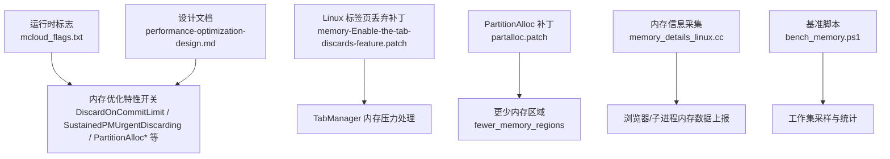
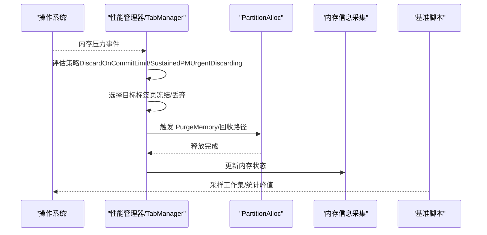
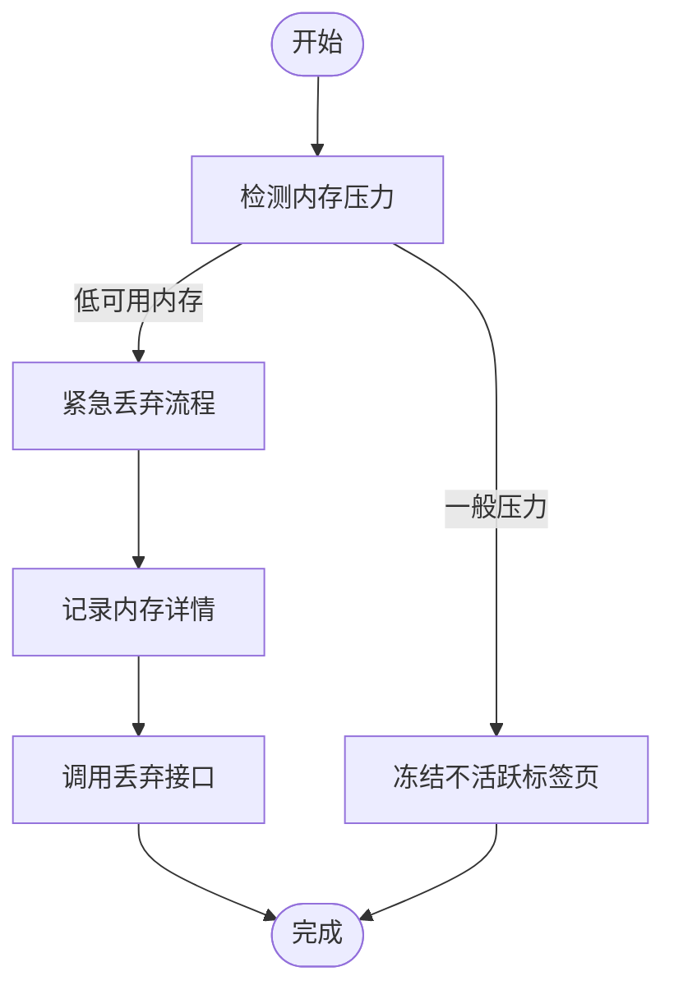
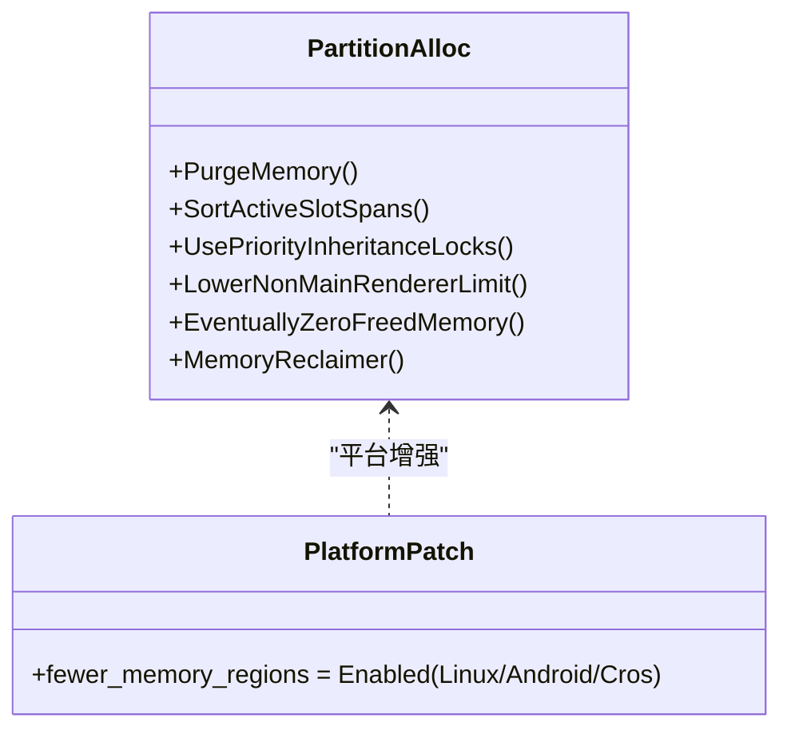
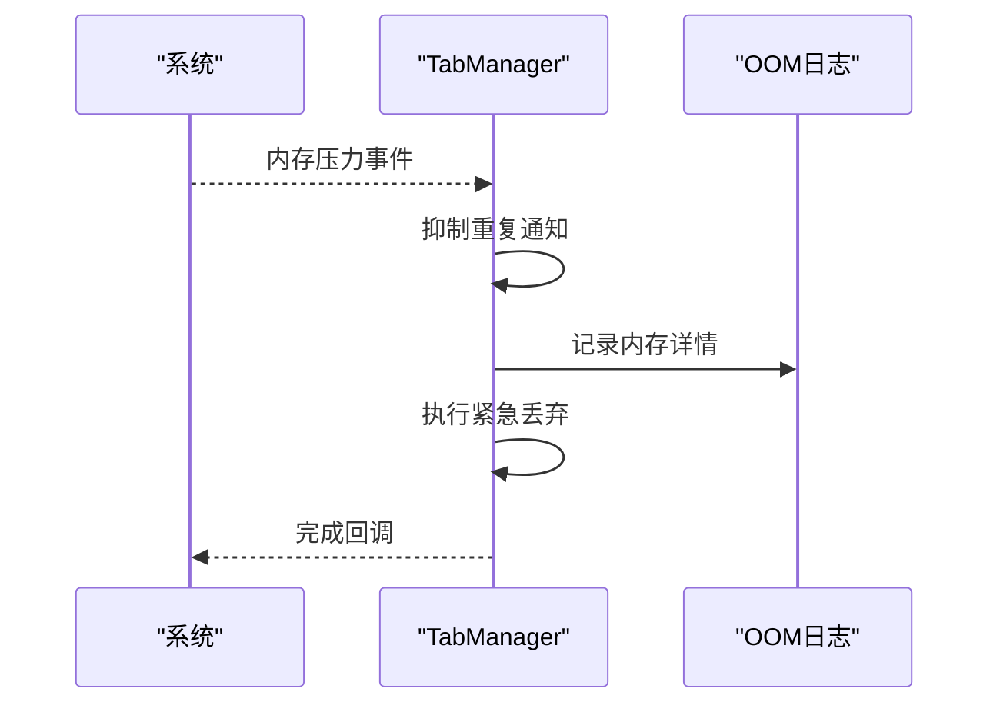
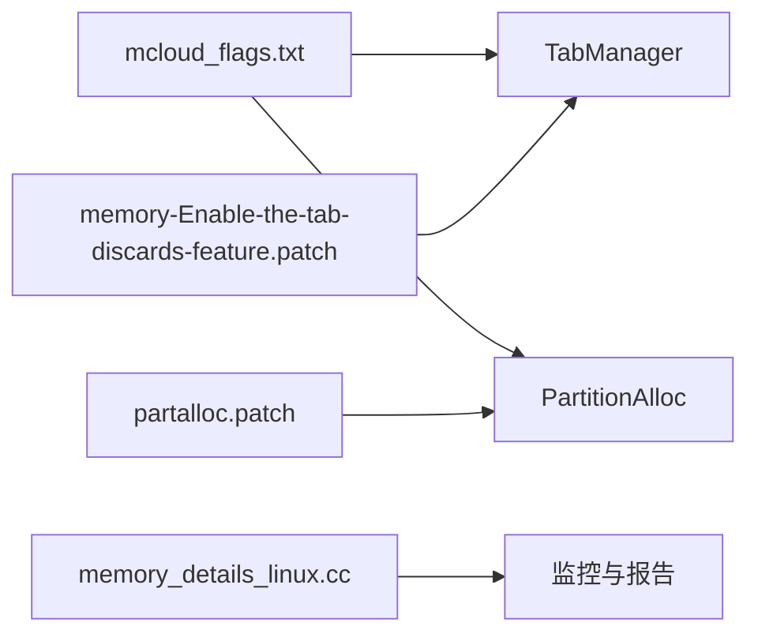

# 内存管理

<cite>
**本文引用的文件**
- [mcloud_flags.txt](file://mcloud_flags.txt)
- [2026-06-19-performance-optimization-design.md](file://docs/superpowers/specs/2026-06-19-performance-optimization-design.md)
- [memory-Enable-the-tab-discards-feature.patch](file://infra/Flatpak/com.mcloud.browser/patches/chromium/memory-Enable-the-tab-discards-feature.patch)
- [partalloc.patch](file://other/partalloc.patch)
- [memory_details_linux.cc](file://src/chrome/browser/memory_details_linux.cc)
- [bench_memory.ps1](file://benchmark/bench_memory.ps1)
- [README.md](file://README.md)
</cite>

## 目录
1. [简介](#简介)
2. [项目结构](#项目结构)
3. [核心组件](#核心组件)
4. [架构总览](#架构总览)
5. [详细组件分析](#详细组件分析)
6. [依赖关系分析](#依赖关系分析)
7. [性能考量](#性能考量)
8. [故障排查指南](#故障排查指南)
9. [结论](#结论)
10. [附录](#附录)

## 简介
本文件面向 MCloud Browser 的内存管理系统，系统性说明标签页冻结与丢弃、内存回收策略、内存碎片整理、PartitionAlloc 高级优化配置、内存压力检测与响应机制、多标签页隔离与资源共享、以及监控与排障方法。文档基于仓库中的运行时标志、补丁与设计文档进行归纳，确保与实际实现一致且可追溯。

## 项目结构
围绕内存管理的代码与配置主要分布在以下位置：
- 运行时标志集中定义于 mcloud_flags.txt，启用多项内存优化特性（标签页冻结、PartitionAlloc 优化、提交限制丢弃等）。
- 设计文档 docs/superpowers/specs/2026-06-19-performance-optimization-design.md 汇总了内存相关的 feature flags 及其作用来源。
- Linux 平台标签页丢弃能力通过补丁 infra/Flatpak/.../memory-Enable-the-tab-discards-feature.patch 启用。
- PartitionAlloc 在 other/partalloc.patch 中对 fewer_memory_regions 进行平台化增强，减少 VMA 数量。
- 内存信息采集在 src/chrome/browser/memory_details_linux.cc，用于进程/子进程内存信息收集。
- 基准脚本 benchmark/bench_memory.ps1 提供内存峰值采集流程示例。

图表来源
- [mcloud_flags.txt:27-38](file://mcloud_flags.txt#L27-L38)
- [2026-06-19-performance-optimization-design.md:78-88](file://docs/superpowers/specs/2026-06-19-performance-optimization-design.md#L78-L88)
- [memory-Enable-the-tab-discards-feature.patch:1-98](file://infra/Flatpak/com.mcloud.browser/patches/chromium/memory-Enable-the-tab-discards-feature.patch#L1-L98)
- [partalloc.patch:1-27](file://other/partalloc.patch#L1-L27)
- [memory_details_linux.cc:104-147](file://src/chrome/browser/memory_details_linux.cc#L104-L147)
- [bench_memory.ps1:62-77](file://benchmark/bench_memory.ps1#L62-L77)

章节来源
- [mcloud_flags.txt:27-38](file://mcloud_flags.txt#L27-L38)
- [2026-06-19-performance-optimization-design.md:78-88](file://docs/superpowers/specs/2026-06-19-performance-optimization-design.md#L78-L88)

## 核心组件
- 标签页生命周期与丢弃：通过 TabManager 在内存压力下触发紧急丢弃，并支持手动丢弃入口（如 chrome://discards）。
- 内存压力监听：系统级或内核级内存事件驱动 TabManager 执行丢弃策略。
- PartitionAlloc 优化：包括活跃槽位排序、优先级继承锁、非主渲染器更低内存限制、释放后清零、内存回收器等。
- 内存信息采集：跨进程收集浏览器及子进程的内存指标，便于分析与监控。
- 基准与工具：提供内存峰值采集脚本，辅助评估优化效果。

章节来源
- [memory-Enable-the-tab-discards-feature.patch:1-98](file://infra/Flatpak/com.mcloud.browser/patches/chromium/memory-Enable-the-tab-discards-feature.patch#L1-L98)
- [mcloud_flags.txt:27-38](file://mcloud_flags.txt#L27-L38)
- [memory_details_linux.cc:104-147](file://src/chrome/browser/memory_details_linux.cc#L104-L147)
- [bench_memory.ps1:62-77](file://benchmark/bench_memory.ps1#L62-L77)

## 架构总览
MCloud Browser 的内存管理由“策略层（feature flags）—调度层（TabManager/性能管理器）—分配层（PartitionAlloc）—观测层（内存信息采集）”构成。运行时标志决定启用哪些优化；当系统出现内存压力时，调度层依据策略触发标签页冻结/丢弃；分配层通过 PartitionAlloc 的高级特性降低碎片与锁竞争；观测层持续采集内存指标以支撑调优与排障。

图表来源
- [memory-Enable-the-tab-discards-feature.patch:1-98](file://infra/Flatpak/com.mcloud.browser/patches/chromium/memory-Enable-the-tab-discards-feature.patch#L1-L98)
- [mcloud_flags.txt:27-38](file://mcloud_flags.txt#L27-L38)
- [memory_details_linux.cc:104-147](file://src/chrome/browser/memory_details_linux.cc#L104-L147)
- [bench_memory.ps1:62-77](file://benchmark/bench_memory.ps1#L62-L77)

## 详细组件分析

### 标签页冻结与丢弃机制
- 触发条件：可用内存低于阈值（如 Commit Limit）或持续内存压力。
- 行为：优先冻结不活跃标签页，必要时进入紧急丢弃流程，记录 OOM 相关内存细节。
- 平台扩展：Linux 平台通过补丁启用 TabManager 的内存压力处理路径。

图表来源
- [memory-Enable-the-tab-discards-feature.patch:1-98](file://infra/Flatpak/com.mcloud.browser/patches/chromium/memory-Enable-the-tab-discards-feature.patch#L1-L98)
- [2026-06-19-performance-optimization-design.md:78-88](file://docs/superpowers/specs/2026-06-19-performance-optimization-design.md#L78-L88)

章节来源
- [memory-Enable-the-tab-discards-feature.patch:1-98](file://infra/Flatpak/com.mcloud.browser/patches/chromium/memory-Enable-the-tab-discards-feature.patch#L1-L98)
- [2026-06-19-performance-optimization-design.md:78-88](file://docs/superpowers/specs/2026-06-19-performance-optimization-design.md#L78-L88)

### PartitionAlloc 高级优化配置
- 活跃槽位排序：在 PurgeMemory 时对活跃 slot span 排序，提升回收效率，减少碎片。
- 优先级继承锁：降低锁竞争，提高并发分配稳定性。
- 非主渲染器更低内存限制：限制非关键渲染器的内存占用，避免资源争用。
- 释放后清零与回收器：释放内存清零以降低敏感数据残留风险；内置回收器周期性回收空闲区域。
- 更少内存区域（fewer_memory_regions）：在 Linux/Android/ChromeOS 上默认启用，减少 VMA 数量，缓解系统限制。

图表来源
- [mcloud_flags.txt:27-38](file://mcloud_flags.txt#L27-L38)
- [partalloc.patch:1-27](file://other/partalloc.patch#L1-L27)
- [2026-06-19-performance-optimization-design.md:78-88](file://docs/superpowers/specs/2026-06-19-performance-optimization-design.md#L78-L88)

章节来源
- [mcloud_flags.txt:27-38](file://mcloud_flags.txt#L27-L38)
- [partalloc.patch:1-27](file://other/partalloc.patch#L1-L27)
- [2026-06-19-performance-optimization-design.md:78-88](file://docs/superpowers/specs/2026-06-19-performance-optimization-design.md#L78-L88)

### 内存压力检测与响应机制
- 检测来源：系统内存压力事件（如 Linux 内核通知）。
- 响应动作：
  - 启动 TabManager 的内存压力监听。
  - 在达到阈值时触发紧急丢弃，并抑制重复触发以避免突发过多丢弃。
  - 记录 OOM 相关内存细节，便于后续分析。
- 平台适配：通过补丁将 Linux 纳入内存压力处理范围。

图表来源
- [memory-Enable-the-tab-discards-feature.patch:1-98](file://infra/Flatpak/com.mcloud.browser/patches/chromium/memory-Enable-the-tab-discards-feature.patch#L1-L98)

章节来源
- [memory-Enable-the-tab-discards-feature.patch:1-98](file://infra/Flatpak/com.mcloud.browser/patches/chromium/memory-Enable-the-tab-discards-feature.patch#L1-L98)

### 多标签页场景下的隔离与资源共享
- 隔离：每个标签页运行在独立渲染进程中，内存空间相互隔离，避免单点故障扩散。
- 共享：共享资源（如 GPU 上下文、解码器实例）通过服务层统一管理，减少冗余占用。
- 限制：非主渲染器应用更严格的内存上限，防止资源争用影响前台体验。

章节来源
- [2026-06-19-performance-optimization-design.md:78-88](file://docs/superpowers/specs/2026-06-19-performance-optimization-design.md#L78-L88)

### 内存使用监控与性能分析方法
- 进程级采集：通过 MemoryDetails 收集浏览器及子进程的内存信息（打开 FD、进程类型等），并在 UI 线程汇总。
- 基准脚本：bench_memory.ps1 对进程工作集进行采样，计算中位数峰值，输出原始数据以便复现与分析。
- 建议实践：
  - 在多标签页场景下固定样本数与间隔，对比不同 feature 组合的内存曲线。
  - 结合 OOM 日志与丢弃事件时间戳，定位压力触发点。

章节来源
- [memory_details_linux.cc:104-147](file://src/chrome/browser/memory_details_linux.cc#L104-L147)
- [bench_memory.ps1:62-77](file://benchmark/bench_memory.ps1#L62-L77)

## 依赖关系分析
- 运行时标志依赖：mcloud_flags.txt 启用的 feature flags 直接驱动 TabManager 与 PartitionAlloc 的行为。
- 平台补丁依赖：Linux 平台的标签页丢弃能力依赖 memory-Enable-the-tab-discards-feature.patch。
- 构建期增强：partalloc.patch 针对 Linux/Android/ChromeOS 调整 PartitionAlloc 的 fewer_memory_regions 默认值。
- 观测依赖：memory_details_linux.cc 为上层监控提供数据基础。

图表来源
- [mcloud_flags.txt:27-38](file://mcloud_flags.txt#L27-L38)
- [memory-Enable-the-tab-discards-feature.patch:1-98](file://infra/Flatpak/com.mcloud.browser/patches/chromium/memory-Enable-the-tab-discards-feature.patch#L1-L98)
- [partalloc.patch:1-27](file://other/partalloc.patch#L1-L27)
- [memory_details_linux.cc:104-147](file://src/chrome/browser/memory_details_linux.cc#L104-L147)

章节来源
- [mcloud_flags.txt:27-38](file://mcloud_flags.txt#L27-L38)
- [memory-Enable-the-tab-discards-feature.patch:1-98](file://infra/Flatpak/com.mcloud.browser/patches/chromium/memory-Enable-the-tab-discards-feature.patch#L1-L98)
- [partalloc.patch:1-27](file://other/partalloc.patch#L1-L27)
- [memory_details_linux.cc:104-147](file://src/chrome/browser/memory_details_linux.cc#L104-L147)

## 性能考量
- 标签页冻结/丢弃：在内存压力时快速释放资源，保障前台交互流畅度。
- PartitionAlloc 优化：排序活跃槽位与优先级继承锁可降低碎片与锁竞争，提升分配吞吐。
- 非主渲染器限制：避免后台任务抢占前台资源，改善整体响应性。
- 基准验证：通过 bench_memory.ps1 采集工作集峰值，量化优化收益。

[本节为通用性能讨论，不直接分析具体文件]

## 故障排查指南
- 内存压力未触发丢弃：检查 Linux 平台补丁是否生效，确认 TabManager 已注册内存压力监听。
- 频繁丢弃导致卡顿：观察丢弃频率与阈值设置，适当调整 DiscardOnCommitLimit 与 SustainedPMUrgentDiscarding。
- 内存碎片偏高：启用 PartitionAllocSortActiveSlotSpans，并结合 PurgeMemory 周期评估效果。
- 进程内存异常增长：使用 memory_details_linux.cc 采集的数据定位异常进程，结合 OOM 日志分析。
- 基准结果波动：固定样本数与采样间隔，排除噪声；记录环境与构建信息以便复现。

章节来源
- [memory-Enable-the-tab-discards-feature.patch:1-98](file://infra/Flatpak/com.mcloud.browser/patches/chromium/memory-Enable-the-tab-discards-feature.patch#L1-L98)
- [memory_details_linux.cc:104-147](file://src/chrome/browser/memory_details_linux.cc#L104-L147)
- [bench_memory.ps1:62-77](file://benchmark/bench_memory.ps1#L62-L77)

## 结论
MCloud Browser 通过运行时标志、平台补丁与 PartitionAlloc 高级特性，构建了覆盖“检测—决策—执行—观测”的完整内存管理体系。标签页冻结与丢弃在内存压力下提供保护，PartitionAlloc 优化降低碎片与锁竞争，内存信息采集与基准脚本支撑持续优化与问题定位。建议在多标签页场景中结合 feature flags 与监控数据进行精细化调优。

[本节为总结性内容，不直接分析具体文件]

## 附录
- 常用内存相关标志清单（来自 mcloud_flags.txt）：
  - InfiniteTabsFreezing / InfiniteTabsFreezingOnMemoryPressure
  - PartitionAllocEventuallyZeroFreedMemory / PartitionAllocMemoryReclaimer
  - DiscardOnCommitLimit / SustainedPMUrgentDiscarding
  - PartitionAllocSortActiveSlotSpans / PartitionAllocUsePriorityInheritanceLocks / LowerPAMemoryLimitForNonMainRenderers
  - ReclaimOldPrepaintTiles / PruneOldTransferCacheEntries

章节来源
- [mcloud_flags.txt:27-38](file://mcloud_flags.txt#L27-L38)
- [README.md:125-133](file://README.md#L125-L133)