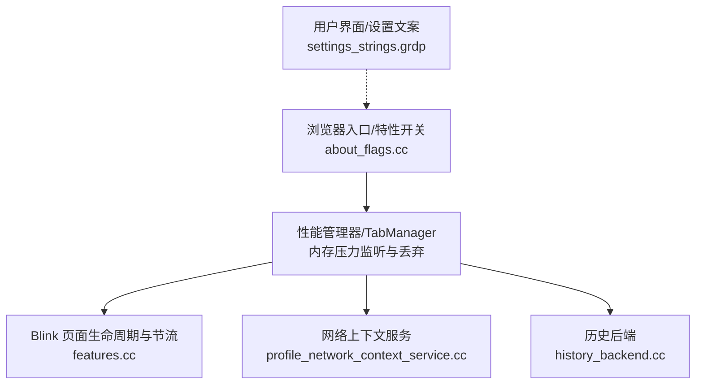
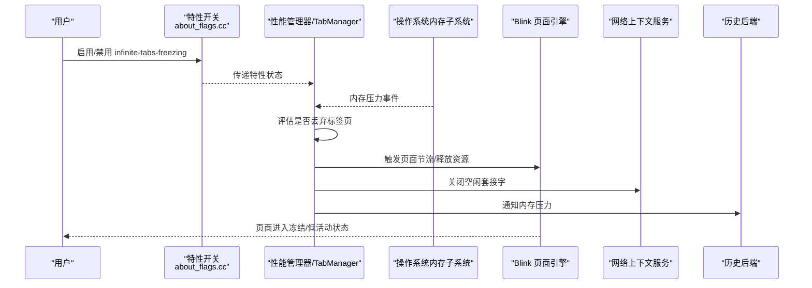
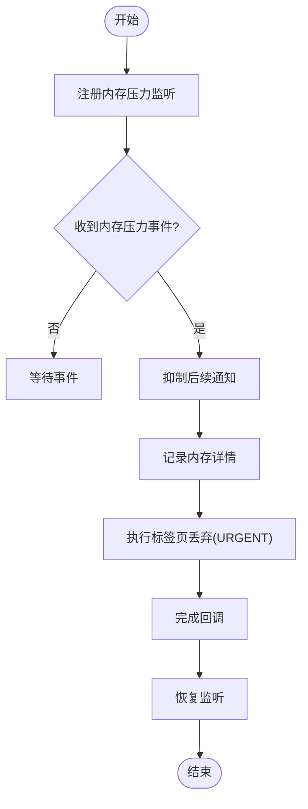
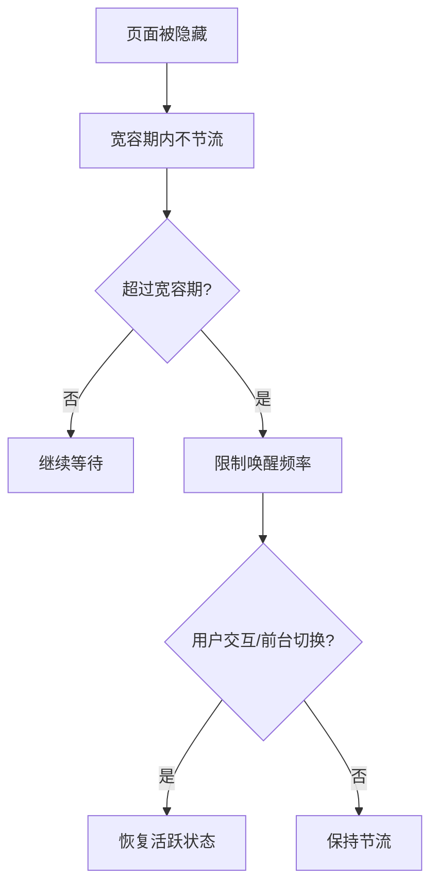
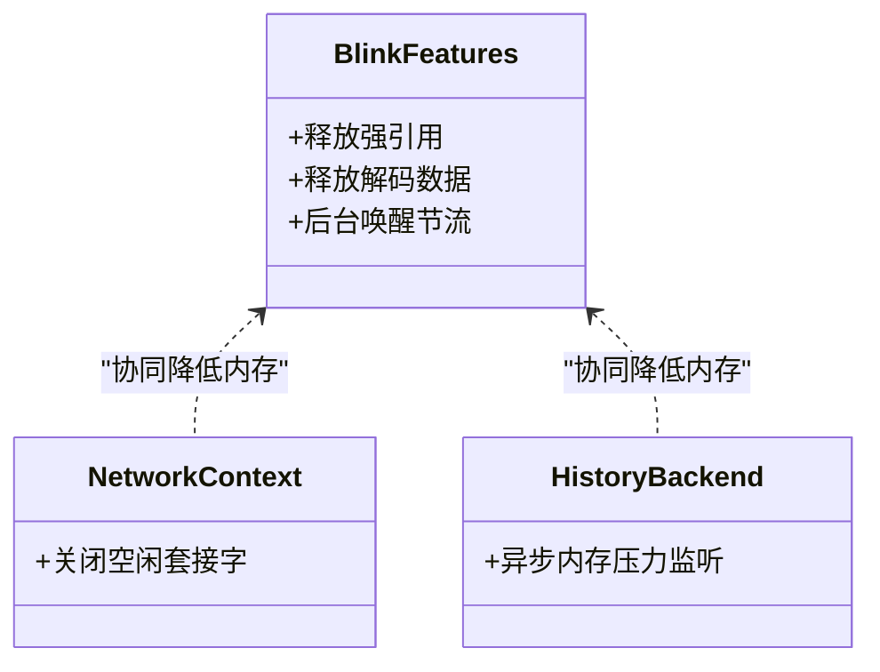
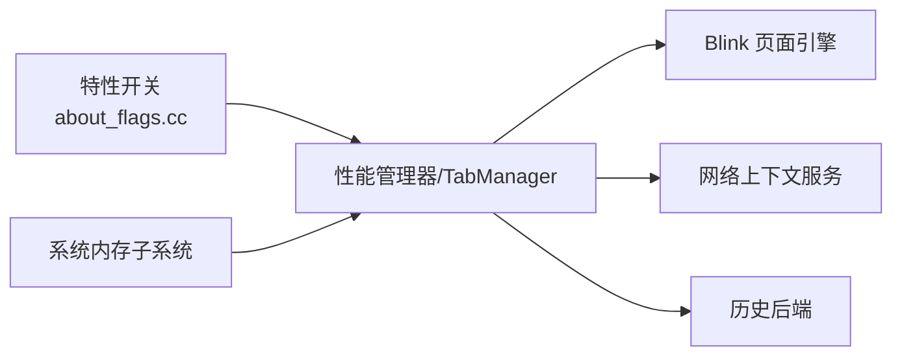

# 标签页冻结机制

本文引用的文件

- [about_flags.cc](https://github.com/Mcloud136/Mcloud-Browser/blob/main/src/chrome/browser/about_flags.cc)
- [memory-Enable-the-tab-discards-feature.patch](https://github.com/Mcloud136/Mcloud-Browser/blob/main/infra/Flatpak/com.mcloud.browser/patches/chromium/memory-Enable-the-tab-discards-feature.patch)
- [settings_strings.grdp](https://github.com/Mcloud136/Mcloud-Browser/blob/main/src/chrome/app/settings_strings.grdp)
- [features.cc](https://github.com/Mcloud136/Mcloud-Browser/blob/main/src/third_party/blink/common/features.cc)
- [profile_network_context_service.cc](https://github.com/Mcloud136/Mcloud-Browser/blob/main/src/chrome/browser/net/profile_network_context_service.cc)
- [history_backend.cc](https://github.com/Mcloud136/Mcloud-Browser/blob/main/src/components/history/core/browser/history_backend.cc)

## 目录
1. [简介](#简介)
2. [项目结构](#项目结构)
3. [核心组件](#核心组件)
4. [架构总览](#架构总览)
5. [详细组件分析](#详细组件分析)
6. [依赖关系分析](#依赖关系分析)
7. [性能考量](#性能考量)
8. [故障排查指南](#故障排查指南)
9. [结论](#结论)
10. [附录](#附录)

## 简介
本文件系统性阐述 Thorium（基于 Chromium）中的“标签页冻结”与“内存压力下的标签页丢弃”机制，重点覆盖：
- InfiniteTabsFreezing 与 InfiniteTabsFreezingOnMemoryPressure 的功能定位、开关与启用方式
- 标签页状态管理、资源释放策略与恢复机制
- 内存压力检测算法与触发条件
- 冻结优先级、资源占用监控与自动唤醒
- 配置选项与调优建议
- 常见问题与排查方法
- 使用场景与性能影响分析

## 项目结构
围绕标签页冻结与内存压力响应的相关代码分布在以下位置：
- 实验特性开关：在 about_flags.cc 中注册 infinite-tabs-freezing 特性开关
- 内存压力与标签页丢弃：通过补丁启用 Linux/ChromeOS 上的 TabManager 内存压力监听与丢弃流程
- 性能设置文案：settings_strings.grdp 提供“内存节省模式”等用户可见文案
- Blink 侧节流与释放：features.cc 定义后台页面唤醒节流与内存压力下释放资源的特性
- 网络层内存压力行为：profile_network_context_service.cc 控制空闲套接字在内存压力时的关闭行为
- 历史后端内存压力处理：history_backend.cc 注册并处理内存压力事件

图表来源
- [about_flags.cc:11414-11416](https://github.com/Mcloud136/Mcloud-Browser/blob/main/src/chrome/browser/about_flags.cc#L11414-L11416)
- [memory-Enable-the-tab-discards-feature.patch:24-33](https://github.com/Mcloud136/Mcloud-Browser/blob/main/infra/Flatpak/com.mcloud.browser/patches/chromium/memory-Enable-the-tab-discards-feature.patch#L24-L33)
- [features.cc:1005-1033](https://github.com/Mcloud136/Mcloud-Browser/blob/main/src/third_party/blink/common/features.cc#L1005-L1033)
- [profile_network_context_service.cc:1527-1531](https://github.com/Mcloud136/Mcloud-Browser/blob/main/src/chrome/browser/net/profile_network_context_service.cc#L1527-L1531)
- [history_backend.cc:439-441](https://github.com/Mcloud136/Mcloud-Browser/blob/main/src/components/history/core/browser/history_backend.cc#L439-L441)

章节来源
- [about_flags.cc:11414-11416](https://github.com/Mcloud136/Mcloud-Browser/blob/main/src/chrome/browser/about_flags.cc#L11414-L11416)
- [memory-Enable-the-tab-discards-feature.patch:24-33](https://github.com/Mcloud136/Mcloud-Browser/blob/main/infra/Flatpak/com.mcloud.browser/patches/chromium/memory-Enable-the-tab-discards-feature.patch#L24-L33)
- [settings_strings.grdp:1060-1089](https://github.com/Mcloud136/Mcloud-Browser/blob/main/src/chrome/app/settings_strings.grdp#L1060-L1089)
- [features.cc:1005-1033](https://github.com/Mcloud136/Mcloud-Browser/blob/main/src/third_party/blink/common/features.cc#L1005-L1033)
- [profile_network_context_service.cc:1527-1531](https://github.com/Mcloud136/Mcloud-Browser/blob/main/src/chrome/browser/net/profile_network_context_service.cc#L1527-L1531)
- [history_backend.cc:439-441](https://github.com/Mcloud136/Mcloud-Browser/blob/main/src/components/history/core/browser/history_backend.cc#L439-L441)

## 核心组件
- 特性开关：infinite-tabs-freezing（InfiniteTabsFreezing），用于启用无限标签页冻结能力
- 内存压力监听与丢弃：TabManager 在 Linux/ChromeOS 上监听系统内存压力并触发标签页丢弃
- 页面节流与释放：Blink 的后台页面唤醒节流与内存压力下释放资源特性
- 网络层优化：在内存压力下关闭空闲套接字，降低内存占用
- 历史后端：注册异步内存压力监听，配合整体内存回收策略

章节来源
- [about_flags.cc:11414-11416](https://github.com/Mcloud136/Mcloud-Browser/blob/main/src/chrome/browser/about_flags.cc#L11414-L11416)
- [memory-Enable-the-tab-discards-feature.patch:24-33](https://github.com/Mcloud136/Mcloud-Browser/blob/main/infra/Flatpak/com.mcloud.browser/patches/chromium/memory-Enable-the-tab-discards-feature.patch#L24-L33)
- [features.cc:2075-2080](https://github.com/Mcloud136/Mcloud-Browser/blob/main/src/third_party/blink/common/features.cc#L2075-L2080)
- [profile_network_context_service.cc:1527-1531](https://github.com/Mcloud136/Mcloud-Browser/blob/main/src/chrome/browser/net/profile_network_context_service.cc#L1527-L1531)
- [history_backend.cc:439-441](https://github.com/Mcloud136/Mcloud-Browser/blob/main/src/components/history/core/browser/history_backend.cc#L439-L441)

## 架构总览
下图展示了从特性开关到内存压力响应、再到页面节流与资源释放的整体流程。

图表来源
- [about_flags.cc:11414-11416](https://github.com/Mcloud136/Mcloud-Browser/blob/main/src/chrome/browser/about_flags.cc#L11414-L11416)
- [memory-Enable-the-tab-discards-feature.patch:24-33](https://github.com/Mcloud136/Mcloud-Browser/blob/main/infra/Flatpak/com.mcloud.browser/patches/chromium/memory-Enable-the-tab-discards-feature.patch#L24-L33)
- [features.cc:1005-1033](https://github.com/Mcloud136/Mcloud-Browser/blob/main/src/third_party/blink/common/features.cc#L1005-L1033)
- [profile_network_context_service.cc:1527-1531](https://github.com/Mcloud136/Mcloud-Browser/blob/main/src/chrome/browser/net/profile_network_context_service.cc#L1527-L1531)
- [history_backend.cc:439-441](https://github.com/Mcloud136/Mcloud-Browser/blob/main/src/components/history/core/browser/history_backend.cc#L439-L441)

## 详细组件分析

### 特性开关：InfiniteTabsFreezing
- 作用：启用“无限标签页冻结”能力，允许更多标签页以冻结/低活动状态存在，从而提升多标签场景下的内存效率与稳定性
- 位置：在 about_flags.cc 中注册 experimental flag，映射到 performance_manager::features::kInfiniteTabsFreezing
- 影响范围：与性能管理器协作，决定标签页冻结策略的启用与否

章节来源
- [about_flags.cc:11414-11416](https://github.com/Mcloud136/Mcloud-Browser/blob/main/src/chrome/browser/about_flags.cc#L11414-L11416)

### 内存压力检测与标签页丢弃
- 监听来源：在 Linux/ChromeOS 平台，TabManager 会创建 MemoryPressureListener，接收系统内存压力事件
- 触发路径：当内存压力达到阈值时，调用 DiscardTabFromMemoryPressure，并以 URGENT 原因触发标签页丢弃回调
- 抑制重复：在处理期间抑制后续通知，避免短时间内多次丢弃导致过度回收
- 日志记录：记录进程内存与 GPU 内存详情，便于问题定位

图表来源
- [memory-Enable-the-tab-discards-feature.patch:24-33](https://github.com/Mcloud136/Mcloud-Browser/blob/main/infra/Flatpak/com.mcloud.browser/patches/chromium/memory-Enable-the-tab-discards-feature.patch#L24-L33)
- [memory-Enable-the-tab-discards-feature.patch:44-57](https://github.com/Mcloud136/Mcloud-Browser/blob/main/infra/Flatpak/com.mcloud.browser/patches/chromium/memory-Enable-the-tab-discards-feature.patch#L44-L57)

章节来源
- [memory-Enable-the-tab-discards-feature.patch:24-33](https://github.com/Mcloud136/Mcloud-Browser/blob/main/infra/Flatpak/com.mcloud.browser/patches/chromium/memory-Enable-the-tab-discards-feature.patch#L24-L33)
- [memory-Enable-the-tab-discards-feature.patch:44-57](https://github.com/Mcloud136/Mcloud-Browser/blob/main/infra/Flatpak/com.mcloud.browser/patches/chromium/memory-Enable-the-tab-discards-feature.patch#L44-L57)

### 页面节流与自动唤醒
- 后台唤醒节流：对已后台超过一定时间的页面限制任务队列唤醒频率（例如每分钟一次），以减少 CPU 与内存占用
- 宽容期：页面隐藏后的一段时间内不进行强节流，保障用户体验
- 与冻结协同：节流使页面处于低活动状态；进一步在内存压力下可进入冻结或丢弃

图表来源
- [features.cc:1005-1033](https://github.com/Mcloud136/Mcloud-Browser/blob/main/src/third_party/blink/common/features.cc#L1005-L1033)

章节来源
- [features.cc:1005-1033](https://github.com/Mcloud136/Mcloud-Browser/blob/main/src/third_party/blink/common/features.cc#L1005-L1033)

### 资源释放策略
- 内存压力下释放强引用：Blink 可在内存压力下释放资源的强引用，减少驻留内存
- 解码数据释放：在内存压力下释放已解码的资源数据，降低峰值内存
- 网络层空闲套接字关闭：在内存压力下关闭空闲套接字，减少连接与缓冲占用
- 历史后端：注册异步内存压力监听，参与整体回收策略

图表来源
- [features.cc:2075-2080](https://github.com/Mcloud136/Mcloud-Browser/blob/main/src/third_party/blink/common/features.cc#L2075-L2080)
- [profile_network_context_service.cc:1527-1531](https://github.com/Mcloud136/Mcloud-Browser/blob/main/src/chrome/browser/net/profile_network_context_service.cc#L1527-L1531)
- [history_backend.cc:439-441](https://github.com/Mcloud136/Mcloud-Browser/blob/main/src/components/history/core/browser/history_backend.cc#L439-L441)

章节来源
- [features.cc:2075-2080](https://github.com/Mcloud136/Mcloud-Browser/blob/main/src/third_party/blink/common/features.cc#L2075-L2080)
- [profile_network_context_service.cc:1527-1531](https://github.com/Mcloud136/Mcloud-Browser/blob/main/src/chrome/browser/net/profile_network_context_service.cc#L1527-L1531)
- [history_backend.cc:439-441](https://github.com/Mcloud136/Mcloud-Browser/blob/main/src/components/history/core/browser/history_backend.cc#L439-L441)

### 恢复机制与用户体验平衡
- 恢复时机：用户切换到标签页或与之交互时，页面从冻结/低活动状态恢复为活跃
- 体验保护：宽容期与节流策略确保首次交互流畅；内存压力时优先释放非关键资源
- 用户可见设置：设置界面提供“内存节省模式”的强度选择（保守/均衡/激进），影响标签页变为不活跃的时长与丢弃策略

章节来源
- [settings_strings.grdp:1060-1089](https://github.com/Mcloud136/Mcloud-Browser/blob/main/src/chrome/app/settings_strings.grdp#L1060-L1089)

## 依赖关系分析
- 特性开关依赖性能管理器：infinite-tabs-freezing 通过 about_flags.cc 暴露给上层，驱动冻结策略
- 内存压力事件依赖系统：TabManager 通过 MemoryPressureListener 接收系统事件
- 页面节流依赖 Blink：后台唤醒节流与资源释放由 Blink 特性控制
- 网络与历史模块协同：在网络与历史层面配合内存压力进行资源回收

图表来源
- [about_flags.cc:11414-11416](https://github.com/Mcloud136/Mcloud-Browser/blob/main/src/chrome/browser/about_flags.cc#L11414-L11416)
- [memory-Enable-the-tab-discards-feature.patch:24-33](https://github.com/Mcloud136/Mcloud-Browser/blob/main/infra/Flatpak/com.mcloud.browser/patches/chromium/memory-Enable-the-tab-discards-feature.patch#L24-L33)
- [features.cc:1005-1033](https://github.com/Mcloud136/Mcloud-Browser/blob/main/src/third_party/blink/common/features.cc#L1005-L1033)
- [profile_network_context_service.cc:1527-1531](https://github.com/Mcloud136/Mcloud-Browser/blob/main/src/chrome/browser/net/profile_network_context_service.cc#L1527-L1531)
- [history_backend.cc:439-441](https://github.com/Mcloud136/Mcloud-Browser/blob/main/src/components/history/core/browser/history_backend.cc#L439-L441)

章节来源
- [about_flags.cc:11414-11416](https://github.com/Mcloud136/Mcloud-Browser/blob/main/src/chrome/browser/about_flags.cc#L11414-L11416)
- [memory-Enable-the-tab-discards-feature.patch:24-33](https://github.com/Mcloud136/Mcloud-Browser/blob/main/infra/Flatpak/com.mcloud.browser/patches/chromium/memory-Enable-the-tab-discards-feature.patch#L24-L33)
- [features.cc:1005-1033](https://github.com/Mcloud136/Mcloud-Browser/blob/main/src/third_party/blink/common/features.cc#L1005-L1033)
- [profile_network_context_service.cc:1527-1531](https://github.com/Mcloud136/Mcloud-Browser/blob/main/src/chrome/browser/net/profile_network_context_service.cc#L1527-L1531)
- [history_backend.cc:439-441](https://github.com/Mcloud136/Mcloud-Browser/blob/main/src/components/history/core/browser/history_backend.cc#L439-L441)

## 性能考量
- 多标签场景：启用 infinite-tabs-freezing 可显著降低内存占用，提高稳定性
- 内存压力响应：及时释放强引用与解码数据，避免 OOM 风险
- 网络开销：关闭空闲套接字可减少连接数与缓冲区占用
- 用户体验：宽容期与节流策略保证前台页面的响应性，冻结/丢弃发生在后台或非活跃标签页

[本节为通用指导，无需特定文件来源]

## 故障排查指南
- 冻结失败
  - 检查是否启用了 infinite-tabs-freezing 特性开关
  - 确认平台支持（Linux/ChromeOS 的内存压力监听需启用）
  - 查看内存压力事件是否到达（系统日志或调试输出）
- 恢复异常
  - 检查页面是否仍处于后台唤醒节流状态
  - 确认用户交互是否正确触发恢复逻辑
  - 观察是否有持续的网络或历史后端占用导致无法释放
- 内存压力未触发丢弃
  - 验证 TabManager 是否注册了 MemoryPressureListener
  - 检查是否在丢弃过程中错误地抑制了后续通知
  - 查看相关日志（进程内存、GPU 内存详情）

章节来源
- [about_flags.cc:11414-11416](https://github.com/Mcloud136/Mcloud-Browser/blob/main/src/chrome/browser/about_flags.cc#L11414-L11416)
- [memory-Enable-the-tab-discards-feature.patch:24-33](https://github.com/Mcloud136/Mcloud-Browser/blob/main/infra/Flatpak/com.mcloud.browser/patches/chromium/memory-Enable-the-tab-discards-feature.patch#L24-L33)
- [memory-Enable-the-tab-discards-feature.patch:44-57](https://github.com/Mcloud136/Mcloud-Browser/blob/main/infra/Flatpak/com.mcloud.browser/patches/chromium/memory-Enable-the-tab-discards-feature.patch#L44-L57)
- [features.cc:1005-1033](https://github.com/Mcloud136/Mcloud-Browser/blob/main/src/third_party/blink/common/features.cc#L1005-L1033)
- [profile_network_context_service.cc:1527-1531](https://github.com/Mcloud136/Mcloud-Browser/blob/main/src/chrome/browser/net/profile_network_context_service.cc#L1527-L1531)
- [history_backend.cc:439-441](https://github.com/Mcloud136/Mcloud-Browser/blob/main/src/components/history/core/browser/history_backend.cc#L439-L441)

## 结论
- InfiniteTabsFreezing 提供了在多标签场景下更激进的内存优化能力，结合内存压力检测与页面节流，有效平衡内存使用与用户体验
- 通过系统级内存压力监听、Blink 页面生命周期管理与网络/历史模块协同，实现从冻结到丢弃的多层次资源回收
- 合理配置“内存节省模式”与特性开关，可在不同设备上取得最佳的性能与体验平衡

[本节为总结，无需特定文件来源]

## 附录
- 配置选项
  - 启用 infinite-tabs-freezing：通过 about_flags 开启对应实验特性
  - 调整“内存节省模式”强度：在设置中选择保守/均衡/激进，影响标签页不活跃时长与丢弃策略
- 调优建议
  - 高内存设备：可适度提高丢弃强度，缩短不活跃时长
  - 低内存设备：启用 aggressive 模式，并关注网络空闲套接字关闭效果
  - 多标签重度使用：确保 infinite-tabs-freezing 启用，并结合后台唤醒节流策略
- 使用场景
  - 大量后台标签页的办公/研究场景
  - 媒体播放与多窗口并行的创作场景
  - 移动/低功耗设备的续航优化

[本节为补充信息，无需特定文件来源]