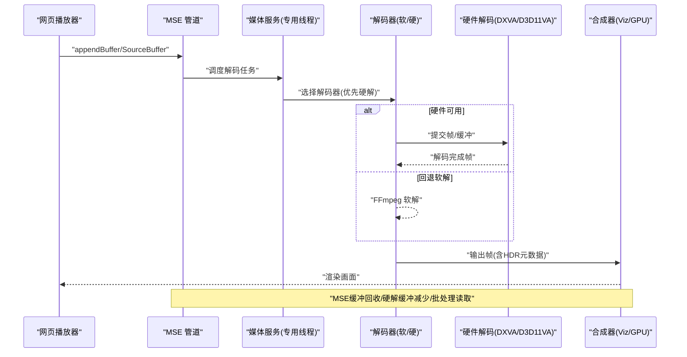
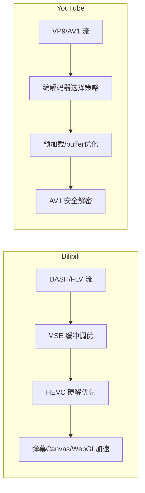
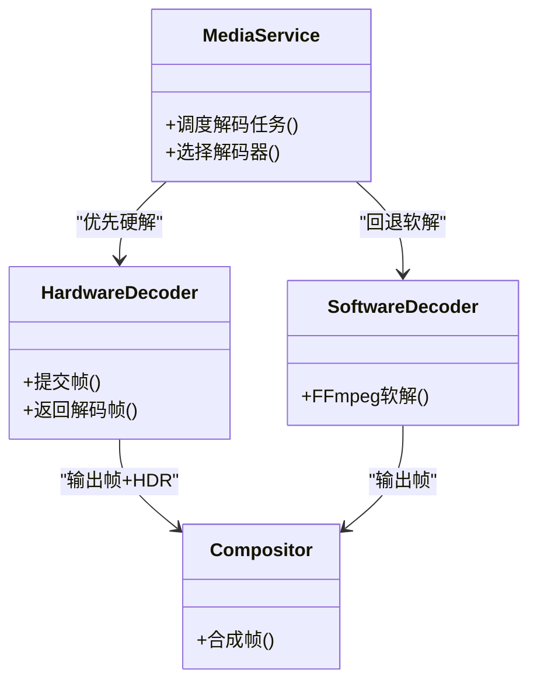
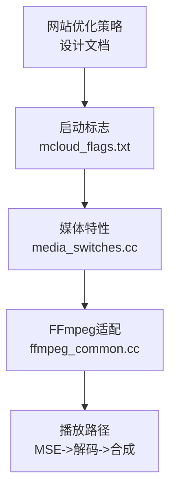

# MSE优化

本文引用的文件

- [mcloud_flags.txt](https://github.com/Mcloud136/Mcloud-Browser/blob/main/mcloud_flags.txt)
- [README.md](https://github.com/Mcloud136/Mcloud-Browser/blob/main/README.md)
- [media_switches.cc](https://github.com/Mcloud136/Mcloud-Browser/blob/main/src/media/base/media_switches.cc)
- [ffmpeg_common.cc](https://github.com/Mcloud136/Mcloud-Browser/blob/main/src/media/ffmpeg/ffmpeg_common.cc)
- [ffmpeg_video_decoder.cc](https://github.com/Mcloud136/Mcloud-Browser/blob/main/src/media/filters/ffmpeg_video_decoder.cc)
- [2026-06-08-mcloud-browser-m149-upgrade-design.md](https://github.com/Mcloud136/Mcloud-Browser/blob/main/docs/superpowers/specs/2026-06-08-mcloud-browser-m149-upgrade-design.md)
- [2026-06-20-release-notes-m150.md](https://github.com/Mcloud136/Mcloud-Browser/blob/main/docs/superpowers/specs/2026-06-20-release-notes-m150.md)
- [CMDLINE_FLAGS_LIST.md](https://github.com/Mcloud136/Mcloud-Browser/blob/main/infra/CMDLINE_FLAGS_LIST.md)

## 目录
1. [简介](#简介)
2. [项目结构](#项目结构)
3. [核心组件](#核心组件)
4. [架构总览](#架构总览)
5. [详细组件分析](#详细组件分析)
6. [依赖关系分析](#依赖关系分析)
7. [性能考量](#性能考量)
8. [故障排除指南](#故障排除指南)
9. [结论](#结论)
10. [附录](#附录)

## 简介
本文件聚焦 MCloud Browser 对 MSE（Media Source Extensions）的优化，围绕 Bilibili 与 YouTube 的播放场景，系统阐述缓冲管理、预加载机制、流式传输优化、MSE 音视频缓冲区大小配置与调优、与硬件解码的协同工作、以及性能分析与故障排除方法。文档同时给出针对不同网站的优化配置示例与最佳实践，帮助在真实站点上获得更流畅的播放体验。

## 项目结构
本项目中与 MSE 和媒体优化相关的实现与配置主要分布在以下位置：
- 启动参数与特性开关：通过命令行标志启用/禁用相关特性，集中维护于启动标志清单中。
- 媒体特性定义：媒体子系统特性开关集中在媒体开关文件中，涵盖 MSE、硬解、音频、平台差异等。
- FFmpeg 集成：视频解码器与 HDR 元数据处理位于 FFmpeg 适配层。
- 设计文档与发布说明：包含针对 Bilibili/YouTube 的专项优化策略与已落地的特性清单。
- 命令行参数参考：提供 MSE 缓冲区大小限制等关键参数的说明。

**图表来源**
- [mcloud_flags.txt:78-105](https://github.com/Mcloud136/Mcloud-Browser/blob/main/mcloud_flags.txt#L78-L105)
- [media_switches.cc:600-635](https://github.com/Mcloud136/Mcloud-Browser/blob/main/src/media/base/media_switches.cc#L600-L635)
- [ffmpeg_common.cc:818-851](https://github.com/Mcloud136/Mcloud-Browser/blob/main/src/media/ffmpeg/ffmpeg_common.cc#L818-L851)
- [2026-06-08-mcloud-browser-m149-upgrade-design.md:302-372](https://github.com/Mcloud136/Mcloud-Browser/blob/main/docs/superpowers/specs/2026-06-08-mcloud-browser-m149-upgrade-design.md#L302-L372)

**章节来源**
- [mcloud_flags.txt:78-105](https://github.com/Mcloud136/Mcloud-Browser/blob/main/mcloud_flags.txt#L78-L105)
- [media_switches.cc:600-635](https://github.com/Mcloud136/Mcloud-Browser/blob/main/src/media/base/media_switches.cc#L600-L635)
- [ffmpeg_common.cc:818-851](https://github.com/Mcloud136/Mcloud-Browser/blob/main/src/media/ffmpeg/ffmpeg_common.cc#L818-L851)
- [2026-06-08-mcloud-browser-m149-upgrade-design.md:302-372](https://github.com/Mcloud136/Mcloud-Browser/blob/main/docs/superpowers/specs/2026-06-08-mcloud-browser-m149-upgrade-design.md#L302-L372)

## 核心组件
- MSE ObjectURL 回收与内存优化：通过特性开关在附加 HTMLMediaElement 时及时撤销 MediaSource ObjectURL，降低内存占用，适用于长视频与多标签页场景。
- 硬件解码缓冲减少：在非低延迟场景下减少硬件解码输出帧池缓冲数量，降低内存与同步开销。
- 专用媒体服务线程：将媒体服务运行在 GPU 进程的专用线程上，提升播放稳定性与流畅度。
- 平台 HEVC 解码支持：启用平台级 HEVC 解码能力，配合 Bilibili 大会员 HEVC 内容。
- AV1 安全解密：启用 AV1 硬件安全解密，增强 DRM 内容播放兼容性。
- Windows MediaFoundation 批量读取与零拷贝捕获：提升加载效率并减少内存拷贝。

上述能力由启动标志与媒体特性共同驱动，并在 FFmpeg 适配层完成解码与 HDR 元数据传递。

**章节来源**
- [media_switches.cc:600-635](https://github.com/Mcloud136/Mcloud-Browser/blob/main/src/media/base/media_switches.cc#L600-L635)
- [media_switches.cc:1445-1451](https://github.com/Mcloud136/Mcloud-Browser/blob/main/src/media/base/media_switches.cc#L1445-L1451)
- [2026-06-20-release-notes-m150.md:156-165](https://github.com/Mcloud136/Mcloud-Browser/blob/main/docs/superpowers/specs/2026-06-20-release-notes-m150.md#L156-L165)
- [mcloud_flags.txt:78-105](https://github.com/Mcloud136/Mcloud-Browser/blob/main/mcloud_flags.txt#L78-L105)

## 架构总览
下图展示从 MSE 到解码再到合成的整体流程，以及各优化点的作用位置。

**图表来源**
- [media_switches.cc:600-635](https://github.com/Mcloud136/Mcloud-Browser/blob/main/src/media/base/media_switches.cc#L600-L635)
- [media_switches.cc:1445-1451](https://github.com/Mcloud136/Mcloud-Browser/blob/main/src/media/base/media_switches.cc#L1445-L1451)
- [ffmpeg_common.cc:818-851](https://github.com/Mcloud136/Mcloud-Browser/blob/main/src/media/ffmpeg/ffmpeg_common.cc#L818-L851)
- [2026-06-20-release-notes-m150.md:156-165](https://github.com/Mcloud136/Mcloud-Browser/blob/main/docs/superpowers/specs/2026-06-20-release-notes-m150.md#L156-L165)

## 详细组件分析

### MSE 缓冲管理与预加载
- 目标：减少缓冲中断、提高首帧速度与切换清晰度流畅度，控制内存占用。
- 关键机制：
  - 增大默认缓冲区与优化驱逐策略（通过特性与参数）。
  - 在附加 HTMLMediaElement 时及时撤销 MediaSource ObjectURL，避免对象 URL 长期驻留导致内存增长。
  - 减少硬件解码缓冲数量，降低非低延迟场景下的资源压力。
- 适用场景：Bilibili DASH/HTTP-FLV、YouTube VP9/AV1 等高码率流。

**图表来源**
- [media_switches.cc:600-635](https://github.com/Mcloud136/Mcloud-Browser/blob/main/src/media/base/media_switches.cc#L600-L635)
- [media_switches.cc:1445-1451](https://github.com/Mcloud136/Mcloud-Browser/blob/main/src/media/base/media_switches.cc#L1445-L1451)

**章节来源**
- [media_switches.cc:600-635](https://github.com/Mcloud136/Mcloud-Browser/blob/main/src/media/base/media_switches.cc#L600-L635)
- [media_switches.cc:1445-1451](https://github.com/Mcloud136/Mcloud-Browser/blob/main/src/media/base/media_switches.cc#L1445-L1451)
- [2026-06-08-mcloud-browser-m149-upgrade-design.md:318-323](https://github.com/Mcloud136/Mcloud-Browser/blob/main/docs/superpowers/specs/2026-06-08-mcloud-browser-m149-upgrade-design.md#L318-L323)

### 流式传输优化（Bilibili/YouTube）
- Bilibili：
  - 技术栈：H.264/AVC 为主，部分 HEVC；协议为 HTTP-FLV 与 DASH；弹幕 Canvas/WebGL 高密度渲染。
  - 优化要点：针对 DASH 流的缓冲大小与预加载时机进行调优；HEVC 优先走硬解；弹幕渲染利用 Skia AVX2 路径加速。
- YouTube：
  - 技术栈：VP9/AV1 常见；DRM 与高码率流较多。
  - 优化要点：VP9/AV1 编解码器选择策略、减少 codec 切换抖动、预加载与 buffer 策略优化；启用 AV1 安全解密。

**图表来源**
- [2026-06-08-mcloud-browser-m149-upgrade-design.md:337-357](https://github.com/Mcloud136/Mcloud-Browser/blob/main/docs/superpowers/specs/2026-06-08-mcloud-browser-m149-upgrade-design.md#L337-L357)
- [2026-06-20-release-notes-m150.md:156-165](https://github.com/Mcloud136/Mcloud-Browser/blob/main/docs/superpowers/specs/2026-06-20-release-notes-m150.md#L156-L165)

**章节来源**
- [2026-06-08-mcloud-browser-m149-upgrade-design.md:337-357](https://github.com/Mcloud136/Mcloud-Browser/blob/main/docs/superpowers/specs/2026-06-08-mcloud-browser-m149-upgrade-design.md#L337-L357)
- [2026-06-20-release-notes-m150.md:156-165](https://github.com/Mcloud136/Mcloud-Browser/blob/main/docs/superpowers/specs/2026-06-20-release-notes-m150.md#L156-L165)

### MSE 音视频缓冲区大小配置与调优
- 命令行参数：
  - --mse-audio-buffer-size-limit-mb：显式设置 MSE 音频缓冲区大小（MB），默认值用于平衡吞吐与延迟。
  - --mse-video-buffer-size-limit-mb：显式设置 MSE 视频缓冲区大小（MB），默认值用于平衡缓冲与内存。
- 调优建议：
  - 高码率/高分辨率（如 4K）：适当增大视频缓冲以降低卡顿风险，但需监控内存使用。
  - 低延迟场景：减小缓冲以缩短首帧与交互延迟，结合“减少硬解缓冲”特性。
  - 多标签/长视频：启用 ObjectURL 回收与硬解缓冲减少，控制内存增长。
- 验证方式：
  - 使用浏览器开发者工具观察 SourceBuffer 状态与丢弃行为。
  - 通过 chrome://tracing 记录 appendBuffer/decode/flush 事件，定位瓶颈。

**章节来源**
- [CMDLINE_FLAGS_LIST.md:1894-1896](https://github.com/Mcloud136/Mcloud-Browser/blob/main/infra/CMDLINE_FLAGS_LIST.md#L1894-L1896)
- [media_switches.cc:600-635](https://github.com/Mcloud136/Mcloud-Browser/blob/main/src/media/base/media_switches.cc#L600-L635)
- [media_switches.cc:1445-1451](https://github.com/Mcloud136/Mcloud-Browser/blob/main/src/media/base/media_switches.cc#L1445-L1451)

### 与硬件解码的协同工作机制
- 平台支持：
  - Windows：DXVA2/D3D11VA 用于 H.264/AVC、VP9、AV1；HEVC 通过 PlatformHEVCDecoderSupport 启用。
  - Linux：VAAPI/V4L2 加速解码（按平台特性开关）。
- 协同路径：
  - MSE 将分片送入解码器；若硬件可用则优先走硬解路径，否则回退至 FFmpeg 软解。
  - 解码完成后输出帧（含 HDR 元数据）进入合成器进行渲染。
- 优化点：
  - 减少硬解缓冲数量，降低资源占用。
  - 专用媒体服务线程提升调度效率。
  - Windows MediaFoundation 批量读取与零拷贝捕获减少拷贝开销。

**图表来源**
- [media_switches.cc:600-635](https://github.com/Mcloud136/Mcloud-Browser/blob/main/src/media/base/media_switches.cc#L600-L635)
- [media_switches.cc:1445-1451](https://github.com/Mcloud136/Mcloud-Browser/blob/main/src/media/base/media_switches.cc#L1445-L1451)
- [ffmpeg_common.cc:818-851](https://github.com/Mcloud136/Mcloud-Browser/blob/main/src/media/ffmpeg/ffmpeg_common.cc#L818-L851)
- [2026-06-20-release-notes-m150.md:156-165](https://github.com/Mcloud136/Mcloud-Browser/blob/main/docs/superpowers/specs/2026-06-20-release-notes-m150.md#L156-L165)

**章节来源**
- [2026-06-08-mcloud-browser-m149-upgrade-design.md:302-316](https://github.com/Mcloud136/Mcloud-Browser/blob/main/docs/superpowers/specs/2026-06-08-mcloud-browser-m149-upgrade-design.md#L302-L316)
- [2026-06-20-release-notes-m150.md:156-165](https://github.com/Mcloud136/Mcloud-Browser/blob/main/docs/superpowers/specs/2026-06-20-release-notes-m150.md#L156-L165)

### 性能分析与故障排除
- 性能分析：
  - 使用 chrome://tracing 记录 MSE 与解码链路事件，关注 appendBuffer、decode、flush、drop 等关键指标。
  - 观察 SourceBuffer 的 buffered 范围与丢弃频率，评估缓冲策略是否合理。
  - 检查 GPU 进程中的解码器使用率与内存占用，确认硬解是否生效。
- 常见问题与对策：
  - 频繁缓冲中断：增大视频缓冲或优化网络预连接；检查 DASH 分段大小与码率自适应策略。
  - 切换清晰度卡顿：减少 codec 切换抖动，确保预加载充足；必要时调整缓冲阈值。
  - 内存持续增长：启用 ObjectURL 回收与硬解缓冲减少；监控长视频播放时的内存曲线。
  - 绿屏/花屏（特定 GPU）：根据已知问题关闭有缺陷的特性（如 D3D12VideoDecoder），回退到稳定路径。

**章节来源**
- [mcloud_flags.txt:83-88](https://github.com/Mcloud136/Mcloud-Browser/blob/main/mcloud_flags.txt#L83-L88)
- [media_switches.cc:600-635](https://github.com/Mcloud136/Mcloud-Browser/blob/main/src/media/base/media_switches.cc#L600-L635)
- [media_switches.cc:1445-1451](https://github.com/Mcloud136/Mcloud-Browser/blob/main/src/media/base/media_switches.cc#L1445-L1451)

## 依赖关系分析
- 启动标志与特性开关：
  - mcloud_flags.txt 集中启用 MSE/视频/媒体相关特性，驱动 media_switches.cc 中的功能开关。
- 媒体特性与解码路径：
  - media_switches.cc 定义 MSE 回收、硬解缓冲减少、专用媒体线程等平台特性。
  - FFmpeg 适配层负责解码与 HDR 元数据处理，支撑上层 MSE 播放。
- 网站优化策略：
  - 设计文档明确 Bilibili/YouTube 的优化方向，指导特性组合与参数调优。

**图表来源**
- [mcloud_flags.txt:78-105](https://github.com/Mcloud136/Mcloud-Browser/blob/main/mcloud_flags.txt#L78-L105)
- [media_switches.cc:600-635](https://github.com/Mcloud136/Mcloud-Browser/blob/main/src/media/base/media_switches.cc#L600-L635)
- [ffmpeg_common.cc:818-851](https://github.com/Mcloud136/Mcloud-Browser/blob/main/src/media/ffmpeg/ffmpeg_common.cc#L818-L851)
- [2026-06-08-mcloud-browser-m149-upgrade-design.md:302-372](https://github.com/Mcloud136/Mcloud-Browser/blob/main/docs/superpowers/specs/2026-06-08-mcloud-browser-m149-upgrade-design.md#L302-L372)

**章节来源**
- [mcloud_flags.txt:78-105](https://github.com/Mcloud136/Mcloud-Browser/blob/main/mcloud_flags.txt#L78-L105)
- [media_switches.cc:600-635](https://github.com/Mcloud136/Mcloud-Browser/blob/main/src/media/base/media_switches.cc#L600-L635)
- [ffmpeg_common.cc:818-851](https://github.com/Mcloud136/Mcloud-Browser/blob/main/src/media/ffmpeg/ffmpeg_common.cc#L818-L851)
- [2026-06-08-mcloud-browser-m149-upgrade-design.md:302-372](https://github.com/Mcloud136/Mcloud-Browser/blob/main/docs/superpowers/specs/2026-06-08-mcloud-browser-m149-upgrade-design.md#L302-L372)

## 性能考量
- 缓冲与延迟的权衡：
  - 高码率/高分辨率场景优先保证流畅性，适当增大缓冲；低延迟场景优先降低首帧与交互延迟。
- 内存与资源占用：
  - 启用 ObjectURL 回收与硬解缓冲减少，控制长视频与多标签页的内存增长。
- 解码路径选择：
  - 优先硬件解码，回退软解；Windows 平台注意已知 GPU 缺陷特性的开关。
- 合成与渲染：
  - 利用专用媒体服务线程与 GPU 合成路径，减少上下文切换与拷贝开销。

[本节为通用指导，不直接分析具体文件]

## 故障排除指南
- 症状：播放初期绿屏/花屏（特定 Intel 核显）
  - 原因：D3D12 视频解码器在部分驱动版本存在缺陷。
  - 解决：显式关闭该特性，回退到 D3D11 解码路径。
- 症状：频繁缓冲中断
  - 排查：检查 MSE 缓冲大小与网络预连接；观察 SourceBuffer 丢弃情况。
  - 解决：增大视频缓冲、优化预加载策略、调整码率自适应。
- 症状：切换清晰度卡顿
  - 排查：检查 codec 切换与预加载是否充分。
  - 解决：减少 codec 切换抖动，确保足够缓冲；必要时调整缓冲阈值。
- 症状：内存持续增长
  - 排查：确认 ObjectURL 回收与硬解缓冲减少是否启用。
  - 解决：启用相关特性，监控长视频内存曲线。

**章节来源**
- [mcloud_flags.txt:83-88](https://github.com/Mcloud136/Mcloud-Browser/blob/main/mcloud_flags.txt#L83-L88)
- [media_switches.cc:600-635](https://github.com/Mcloud136/Mcloud-Browser/blob/main/src/media/base/media_switches.cc#L600-L635)
- [media_switches.cc:1445-1451](https://github.com/Mcloud136/Mcloud-Browser/blob/main/src/media/base/media_switches.cc#L1445-L1451)

## 结论
通过对 MSE 缓冲管理、预加载机制、流式传输优化、硬件解码协同与性能分析的全面优化，MCloud Browser 在 Bilibili 与 YouTube 等主流视频站点上能够提供更流畅、稳定的播放体验。建议在真实场景中结合 chrome://tracing 与开发者工具持续观测与调优，并根据设备能力与网络条件动态调整缓冲与解码策略。

[本节为总结，不直接分析具体文件]

## 附录
- 推荐特性组合（基于仓库现有配置）：
  - MSE/视频缓冲：RevokeMediaSourceObjectURLOnAttach、ReduceHardwareVideoDecoderBuffers、BackForwardCacheDWCOnJavaScriptExecution。
  - 媒体优化：PlatformHEVCDecoderSupport、HardwareSecureDecryptionAv1、DedicatedMediaServiceThread、DirectOpusAudioDecoding、EncryptedMediaOcclusionTracking、MediaFoundationBatchRead、MediaFoundationD3D11VideoCaptureZeroCopy。
  - 已知问题规避：D3D12VideoDecoder（在特定 GPU 上禁用）。
- 命令行参数：
  - --mse-audio-buffer-size-limit-mb、--mse-video-buffer-size-limit-mb：按需调整 MSE 音视频缓冲大小。

**章节来源**
- [mcloud_flags.txt:78-105](https://github.com/Mcloud136/Mcloud-Browser/blob/main/mcloud_flags.txt#L78-L105)
- [README.md:109-116](https://github.com/Mcloud136/Mcloud-Browser/blob/main/README.md#L109-L116)
- [CMDLINE_FLAGS_LIST.md:1894-1896](https://github.com/Mcloud136/Mcloud-Browser/blob/main/infra/CMDLINE_FLAGS_LIST.md#L1894-L1896)