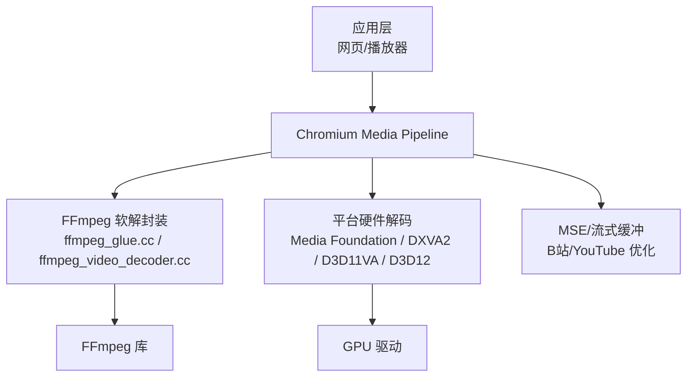
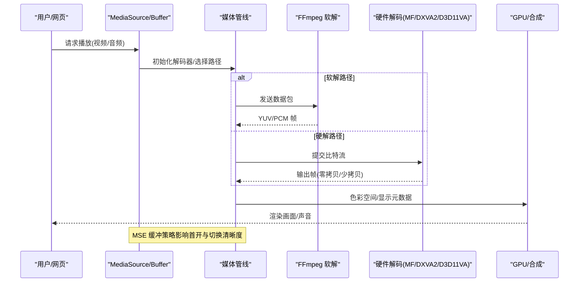
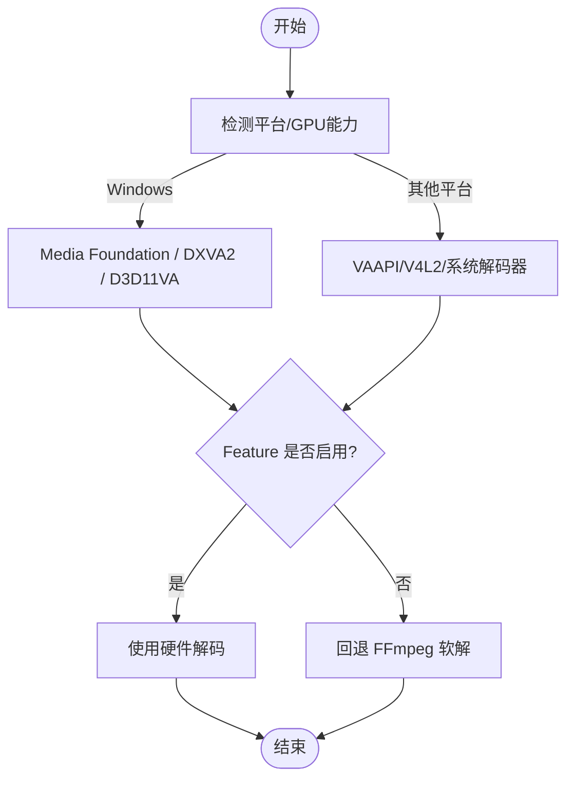
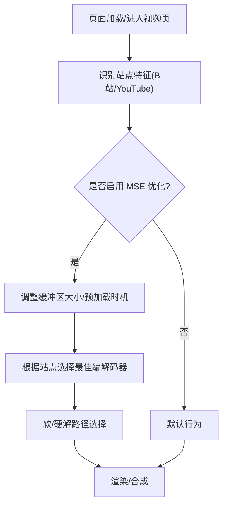
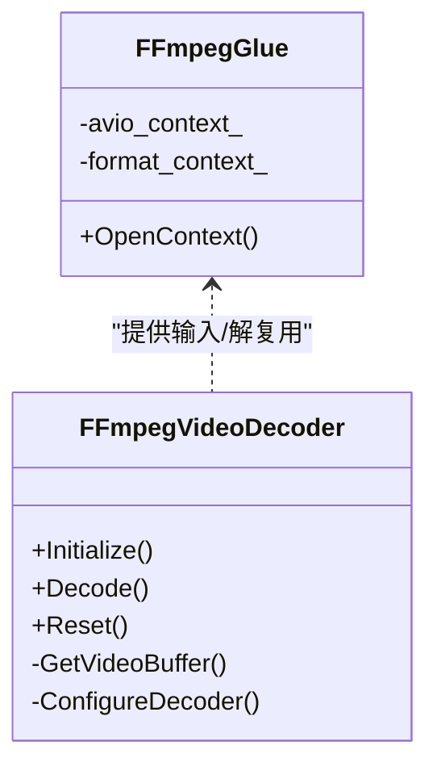
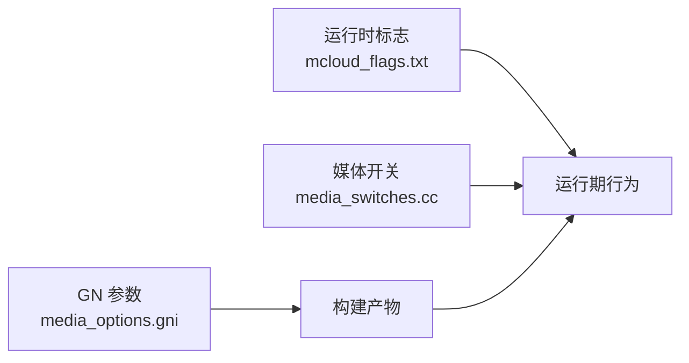

# 媒体处理

本文引用的文件

- [README.md](https://github.com/Mcloud136/Mcloud-Browser/blob/main/README.md)
- [mcloud_flags.txt](https://github.com/Mcloud136/Mcloud-Browser/blob/main/mcloud_flags.txt)
- [media_options.gni](https://github.com/Mcloud136/Mcloud-Browser/blob/main/src/media/media_options.gni)
- [ffmpeg_video_decoder.cc](https://github.com/Mcloud136/Mcloud-Browser/blob/main/src/media/filters/ffmpeg_video_decoder.cc)
- [ffmpeg_glue.cc](https://github.com/Mcloud136/Mcloud-Browser/blob/main/src/media/filters/ffmpeg_glue.cc)
- [media_switches.cc](https://github.com/Mcloud136/Mcloud-Browser/blob/main/src/media/base/media_switches.cc)
- [2026-06-08-mcloud-browser-m149-upgrade-design.md](https://github.com/Mcloud136/Mcloud-Browser/blob/main/docs/superpowers/specs/2026-06-08-mcloud-browser-m149-upgrade-design.md)
- [2026-06-20-release-notes-m150.md](https://github.com/Mcloud136/Mcloud-Browser/blob/main/docs/superpowers/specs/2026-06-20-release-notes-m150.md)
- [add-hevc-ffmpeg-decoder-parser.patch](https://github.com/Mcloud136/Mcloud-Browser/blob/main/other/add-hevc-ffmpeg-decoder-parser.patch)
- [mac_ARM_args.gn](https://github.com/Mcloud136/Mcloud-Browser/blob/main/other/Mac/mac_ARM_args.gn)
- [win_gn_args.list](https://github.com/Mcloud136/Mcloud-Browser/blob/main/infra/win_gn_args.list)

## 目录
1. [简介](#简介)
2. [项目结构](#项目结构)
3. [核心组件](#核心组件)
4. [架构总览](#架构总览)
5. [详细组件分析](#详细组件分析)
6. [依赖关系分析](#依赖关系分析)
7. [性能考量](#性能考量)
8. [故障排除指南](#故障排除指南)
9. [结论](#结论)
10. [附录](#附录)

## 简介
本文件面向 MCloud Browser 的媒体处理子系统，聚焦于：
- 支持的编解码器与软/硬解能力（HEVC/H.265、VP9、AV1、H.264/AVC；AC3、DTS、MPEG-H 等音频）
- 硬件加速机制（Windows 平台 D3D11/D3D12、DXVA2、Media Foundation）
- MSE（Media Source Extensions）优化策略（含 Bilibili、YouTube 专项）
- FFmpeg 集成与自定义编解码器扩展方法
- 播放性能调优与常见问题排查

## 项目结构
MCloud Browser 在媒体方面的关键位置包括：
- 构建期特性开关与平台能力声明：src/media/media_options.gni
- 运行时标志注入与媒体相关 feature 启用：mcloud_flags.txt
- FFmpeg 软解封装与数据通路：src/media/filters/ffmpeg_glue.cc、ffmpeg_video_decoder.cc
- 媒体功能开关与平台检测：src/media/base/media_switches.cc
- 文档与设计说明：docs/superpowers/*（含视频优化、B站/YouTube 优化、发布说明）
- 补丁与平台参数：other/*（如 HEVC 软解补丁、mac ARM 参数）

图表来源
- [ffmpeg_glue.cc:99-147](https://github.com/Mcloud136/Mcloud-Browser/blob/main/src/media/filters/ffmpeg_glue.cc#L99-L147)
- [ffmpeg_video_decoder.cc:227-263](https://github.com/Mcloud136/Mcloud-Browser/blob/main/src/media/filters/ffmpeg_video_decoder.cc#L227-L263)
- [media_switches.cc:1909-1912](https://github.com/Mcloud136/Mcloud-Browser/blob/main/src/media/base/media_switches.cc#L1909-L1912)
- [2026-06-08-mcloud-browser-m149-upgrade-design.md:302-317](https://github.com/Mcloud136/Mcloud-Browser/blob/main/docs/superpowers/specs/2026-06-08-mcloud-browser-m149-upgrade-design.md#L302-L317)

章节来源
- [README.md:179-191](https://github.com/Mcloud136/Mcloud-Browser/blob/main/README.md#L179-L191)
- [mcloud_flags.txt:78-105](https://github.com/Mcloud136/Mcloud-Browser/blob/main/mcloud_flags.txt#L78-L105)
- [media_options.gni:126-160](https://github.com/Mcloud136/Mcloud-Browser/blob/main/src/media/media_options.gni#L126-L160)

## 核心组件
- 媒体特性开关与平台能力
  - 通过 media_options.gni 控制是否启用 HEVC、AV1、HLS、Dolby Vision、AC3/E-AC3、DTS、MPEG-H 等。
  - Windows 平台默认开启 Dolby Vision 与加密 DV 支持，HEVC 解析与硬件辅助解码在多数桌面平台可用。
- 运行时标志
  - mcloud_flags.txt 集中注入媒体相关 feature：PlatformHEVCDecoderSupport、HardwareSecureDecryptionAv1、DedicatedMediaServiceThread、DirectOpusAudioDecoding、EncryptedMediaOcclusionTracking、MediaFoundationBatchRead、MediaFoundationD3D11VideoCaptureZeroCopy，并显式禁用有问题的 D3D12VideoDecoder。
- FFmpeg 软解封装
  - ffmpeg_glue.cc 负责 AVIOContext、白名单 demuxer、格式识别与安全限制。
  - ffmpeg_video_decoder.cc 实现 H.264/HEVC 软解路径、线程数自适应、帧缓冲池与颜色空间处理。
- 媒体功能开关
  - media_switches.cc 提供 Media Foundation D3D11 捕获开关、OOP 视频解码开关等。

章节来源
- [media_options.gni:76-110](https://github.com/Mcloud136/Mcloud-Browser/blob/main/src/media/media_options.gni#L76-L110)
- [media_options.gni:126-160](https://github.com/Mcloud136/Mcloud-Browser/blob/main/src/media/media_options.gni#L126-L160)
- [mcloud_flags.txt:78-105](https://github.com/Mcloud136/Mcloud-Browser/blob/main/mcloud_flags.txt#L78-L105)
- [ffmpeg_glue.cc:84-147](https://github.com/Mcloud136/Mcloud-Browser/blob/main/src/media/filters/ffmpeg_glue.cc#L84-L147)
- [ffmpeg_video_decoder.cc:64-99](https://github.com/Mcloud136/Mcloud-Browser/blob/main/src/media/filters/ffmpeg_video_decoder.cc#L64-L99)
- [media_switches.cc:1909-1912](https://github.com/Mcloud136/Mcloud-Browser/blob/main/src/media/base/media_switches.cc#L1909-L1912)

## 架构总览
下图展示从网页到解码器的完整链路，包含软解与硬件加速两条路径，以及 MSE 缓冲优化对站点体验的影响。

图表来源
- [ffmpeg_video_decoder.cc:227-263](https://github.com/Mcloud136/Mcloud-Browser/blob/main/src/media/filters/ffmpeg_video_decoder.cc#L227-L263)
- [ffmpeg_glue.cc:99-147](https://github.com/Mcloud136/Mcloud-Browser/blob/main/src/media/filters/ffmpeg_glue.cc#L99-L147)
- [2026-06-08-mcloud-browser-m149-upgrade-design.md:302-317](https://github.com/Mcloud136/Mcloud-Browser/blob/main/docs/superpowers/specs/2026-06-08-mcloud-browser-m149-upgrade-design.md#L302-L317)
- [mcloud_flags.txt:78-105](https://github.com/Mcloud136/Mcloud-Browser/blob/main/mcloud_flags.txt#L78-L105)

## 详细组件分析

### 编解码器支持与软/硬解矩阵
- 视频
  - H.264/AVC：软解（FFmpeg）、硬解（DXVA2/D3D11VA），全平台支持
  - VP9：软解（libvpx）、硬解（DXVA2/D3D11VA）
  - AV1：软解（dav1d/libaom 可选）、硬解（D3D11VA，需 GPU 支持）
  - HEVC/H.265：软解（FFmpeg 补丁启用）、硬解（D3D11VA/DXVA2，平台能力）
  - Dolby Vision：需要 HEVC 支持，Windows 平台可启用
- 音频
  - AC3/E-AC3、DTS、MPEG-H：通过平台能力或 FFmpeg 软解支持

章节来源
- [README.md:179-191](https://github.com/Mcloud136/Mcloud-Browser/blob/main/README.md#L179-L191)
- [media_options.gni:76-110](https://github.com/Mcloud136/Mcloud-Browser/blob/main/src/media/media_options.gni#L76-L110)
- [media_options.gni:126-160](https://github.com/Mcloud136/Mcloud-Browser/blob/main/src/media/media_options.gni#L126-L160)
- [add-hevc-ffmpeg-decoder-parser.patch:1-31](https://github.com/Mcloud136/Mcloud-Browser/blob/main/other/add-hevc-ffmpeg-decoder-parser.patch#L1-L31)

### 硬件加速实现机制（Windows）
- 硬件解码 API
  - DXVA2/D3D11VA：H.264、HEVC、VP9、AV1（视 GPU 能力）
  - Media Foundation：批量读取、D3D11 视频捕获零拷贝
- 运行时策略
  - 启用 PlatformHEVCDecoderSupport、HardwareSecureDecryptionAv1
  - 针对 Intel 核显 D3D12 绿屏问题，默认关闭 D3D12VideoDecoder，回退至 D3D11 路径
- 构建期能力
  - enable_platform_hevc、enable_platform_dolby_vision、enable_platform_encrypted_dolby_vision 等由 GN 参数控制

图表来源
- [mcloud_flags.txt:83-105](https://github.com/Mcloud136/Mcloud-Browser/blob/main/mcloud_flags.txt#L83-L105)
- [2026-06-08-mcloud-browser-m149-upgrade-design.md:302-317](https://github.com/Mcloud136/Mcloud-Browser/blob/main/docs/superpowers/specs/2026-06-08-mcloud-browser-m149-upgrade-design.md#L302-L317)
- [media_options.gni:126-160](https://github.com/Mcloud136/Mcloud-Browser/blob/main/src/media/media_options.gni#L126-L160)

章节来源
- [mcloud_flags.txt:83-105](https://github.com/Mcloud136/Mcloud-Browser/blob/main/mcloud_flags.txt#L83-L105)
- [2026-06-08-mcloud-browser-m149-upgrade-design.md:302-317](https://github.com/Mcloud136/Mcloud-Browser/blob/main/docs/superpowers/specs/2026-06-08-mcloud-browser-m149-upgrade-design.md#L302-L317)
- [media_options.gni:126-160](https://github.com/Mcloud136/Mcloud-Browser/blob/main/src/media/media_options.gni#L126-L160)

### MSE 优化机制（Bilibili/YouTube）
- 通用优化
  - RevokeMediaSourceObjectURLOnAttach：及时回收 ObjectURL，降低内存占用
  - ReduceHardwareVideoDecoderBuffers：减少硬解缓冲数量，降低峰值内存
  - BackForwardCacheDWCOnJavaScriptExecution：BFCache 下媒体资源更友好
- Bilibili 专项
  - 针对 DASH/HTTP-FLV 的缓冲大小与预加载时机优化
  - 弹幕 Canvas/WebGL 渲染走 Skia AVX2 路径，保障高密度弹幕不掉帧
  - HEVC 优先走 D3D11VA 硬解，软解时自动使用 FFmpeg AVX2 内核
- YouTube 专项
  - VP9/AV1 编码选择策略与 codec 切换抖动抑制
  - 预加载/buffer 策略优化，提升 4K 流畅度

图表来源
- [mcloud_flags.txt:78-81](https://github.com/Mcloud136/Mcloud-Browser/blob/main/mcloud_flags.txt#L78-L81)
- [2026-06-08-mcloud-browser-m149-upgrade-design.md:337-365](https://github.com/Mcloud136/Mcloud-Browser/blob/main/docs/superpowers/specs/2026-06-08-mcloud-browser-m149-upgrade-design.md#L337-L365)

章节来源
- [mcloud_flags.txt:78-81](https://github.com/Mcloud136/Mcloud-Browser/blob/main/mcloud_flags.txt#L78-L81)
- [2026-06-08-mcloud-browser-m149-upgrade-design.md:337-365](https://github.com/Mcloud136/Mcloud-Browser/blob/main/docs/superpowers/specs/2026-06-08-mcloud-browser-m149-upgrade-design.md#L337-L365)

### FFmpeg 集成方案与自定义编解码器添加
- 集成点
  - ffmpeg_glue.cc：设置 AVIOContext、限制允许的 demuxer 列表、安全白名单
  - ffmpeg_video_decoder.cc：H.264/HEVC 软解实现、线程数自适应、帧缓冲池、颜色空间处理
- 自定义编解码器添加步骤
  1. 在 media_options.gni 中启用对应平台能力（如 enable_platform_hevc、enable_platform_ac3_eac3_audio 等）
  2. 若为新增软解编解码器，需在 FFmpeg 侧注册（参考 add-hevc-ffmpeg-decoder-parser.patch 对各平台 codec_list/parser_list 的修改方式）
  3. 在 ffmpeg_glue.cc 的允许 demuxer/decoder 白名单中添加新容器/解码器
  4. 在 ffmpeg_video_decoder.cc 中适配新编解码器的配置与线程策略
  5. 通过 mcloud_flags.txt 启用相关 feature 并验证

图表来源
- [ffmpeg_glue.cc:99-147](https://github.com/Mcloud136/Mcloud-Browser/blob/main/src/media/filters/ffmpeg_glue.cc#L99-L147)
- [ffmpeg_video_decoder.cc:227-263](https://github.com/Mcloud136/Mcloud-Browser/blob/main/src/media/filters/ffmpeg_video_decoder.cc#L227-L263)
- [add-hevc-ffmpeg-decoder-parser.patch:1-31](https://github.com/Mcloud136/Mcloud-Browser/blob/main/other/add-hevc-ffmpeg-decoder-parser.patch#L1-L31)

章节来源
- [ffmpeg_glue.cc:84-147](https://github.com/Mcloud136/Mcloud-Browser/blob/main/src/media/filters/ffmpeg_glue.cc#L84-L147)
- [ffmpeg_video_decoder.cc:64-99](https://github.com/Mcloud136/Mcloud-Browser/blob/main/src/media/filters/ffmpeg_video_decoder.cc#L64-L99)
- [add-hevc-ffmpeg-decoder-parser.patch:1-31](https://github.com/Mcloud136/Mcloud-Browser/blob/main/other/add-hevc-ffmpeg-decoder-parser.patch#L1-L31)

### 音频软解与直通
- AC3/E-AC3、DTS、MPEG-H 可通过平台能力或 FFmpeg 软解启用
- 通过 EDID 获取设备支持的音频直通格式位掩码（用于直通输出）

章节来源
- [media_options.gni:76-110](https://github.com/Mcloud136/Mcloud-Browser/blob/main/src/media/media_options.gni#L76-L110)
- [media_switches.cc:1930-1952](https://github.com/Mcloud136/Mcloud-Browser/blob/main/src/media/base/media_switches.cc#L1930-L1952)

## 依赖关系分析
- 构建期依赖
  - media_options.gni 决定编译哪些媒体能力（HEVC、AV1、HLS、Dolby Vision、AC3/E-AC3、DTS、MPEG-H）
  - 平台参数（如 mac_ARM_args.gn、win_gn_args.list）覆盖默认值
- 运行期依赖
  - mcloud_flags.txt 注入 feature flags，控制媒体服务线程、硬解能力、MSE 优化
  - media_switches.cc 暴露运行时开关（如 OOP 视频解码、Media Foundation D3D11 捕获）

图表来源
- [media_options.gni:126-160](https://github.com/Mcloud136/Mcloud-Browser/blob/main/src/media/media_options.gni#L126-L160)
- [mcloud_flags.txt:78-105](https://github.com/Mcloud136/Mcloud-Browser/blob/main/mcloud_flags.txt#L78-L105)
- [media_switches.cc:1909-1912](https://github.com/Mcloud136/Mcloud-Browser/blob/main/src/media/base/media_switches.cc#L1909-L1912)

章节来源
- [media_options.gni:126-160](https://github.com/Mcloud136/Mcloud-Browser/blob/main/src/media/media_options.gni#L126-L160)
- [mcloud_flags.txt:78-105](https://github.com/Mcloud136/Mcloud-Browser/blob/main/mcloud_flags.txt#L78-L105)
- [media_switches.cc:1909-1912](https://github.com/Mcloud136/Mcloud-Browser/blob/main/src/media/base/media_switches.cc#L1909-L1912)

## 性能考量
- 编译器与运行时优化
  - AVX2 原生编译、-O3、ThinLTO、PGO
  - 66 项运行时优化标志（启动、V8、网络、渲染、MSE、媒体等）
- 媒体相关优化
  - DedicatedMediaServiceThread：专用媒体线程，播放更流畅
  - DirectOpusAudioDecoding：原生 Opus 解码替代 FFmpeg，效率更高
  - EncryptedMediaOcclusionTracking：跳过不可见视频解码
  - MediaFoundationBatchRead：批量读取，提升加载效率
  - MediaFoundationD3D11VideoCaptureZeroCopy：零拷贝，减少内存拷贝
  - PlatformHEVCDecoderSupport：HEVC 硬件解码
  - HardwareSecureDecryptionAv1：AV1 硬件安全解密
- 站点专项
  - Bilibili：MSE 缓冲策略、弹幕渲染优化、HEVC 硬解优先
  - YouTube：VP9/AV1 选择与缓冲策略优化

章节来源
- [README.md:61-165](https://github.com/Mcloud136/Mcloud-Browser/blob/main/README.md#L61-L165)
- [2026-06-20-release-notes-m150.md:156-173](https://github.com/Mcloud136/Mcloud-Browser/blob/main/docs/superpowers/specs/2026-06-20-release-notes-m150.md#L156-L173)
- [2026-06-08-mcloud-browser-m149-upgrade-design.md:337-365](https://github.com/Mcloud136/Mcloud-Browser/blob/main/docs/superpowers/specs/2026-06-08-mcloud-browser-m149-upgrade-design.md#L337-L365)

## 故障排除指南
- 绿屏/花屏（Intel 核显 D3D12）
  - 现象：启动头几秒输出绿屏/花屏
  - 原因：D3D12VideoDecoder 在某些驱动版本存在缺陷
  - 解决：已默认禁用 D3D12VideoDecoder，回退至 D3D11 路径
- 无法播放 HEVC
  - 检查是否启用 PlatformHEVCDecoderSupport
  - 确认平台能力 enable_platform_hevc 已开启
  - 若无硬解，确认 FFmpeg 软解已启用（参考 HEVC 补丁）
- 音频直通不生效
  - 检查 EDID 返回的音频格式位掩码
  - 确认目标设备支持相应格式
- MSE 缓冲频繁中断
  - 检查 RevokeMediaSourceObjectURLOnAttach、ReduceHardwareVideoDecoderBuffers 是否启用
  - 针对 Bilibili/YouTube 使用专项优化策略

章节来源
- [mcloud_flags.txt:83-105](https://github.com/Mcloud136/Mcloud-Browser/blob/main/mcloud_flags.txt#L83-L105)
- [media_options.gni:126-160](https://github.com/Mcloud136/Mcloud-Browser/blob/main/src/media/media_options.gni#L126-L160)
- [add-hevc-ffmpeg-decoder-parser.patch:1-31](https://github.com/Mcloud136/Mcloud-Browser/blob/main/other/add-hevc-ffmpeg-decoder-parser.patch#L1-L31)
- [media_switches.cc:1930-1952](https://github.com/Mcloud136/Mcloud-Browser/blob/main/src/media/base/media_switches.cc#L1930-L1952)

## 结论
MCloud Browser 在媒体处理方面通过“构建期能力开关 + 运行期标志注入 + 站点专项优化”的组合，实现了：
- 广泛的编解码器支持（HEVC、VP9、AV1、H.264；AC3、DTS、MPEG-H）
- 完善的硬件加速路径（DXVA2/D3D11VA/D3D12，Media Foundation）
- 针对 Bilibili/YouTube 的 MSE 与渲染优化
- 稳定的 FFmpeg 软解兜底与可扩展的自定义编解码器接入

## 附录
- 构建与部署参考
  - 启用 HEVC：确保 enable_platform_hevc 与 enable_hevc_parser_and_hw_decoder 生效
  - 启用 Dolby Vision：确保 enable_platform_dolby_vision 与 enable_platform_encrypted_dolby_vision 生效
  - 音频直通：通过 EDID 位掩码配置直通格式
- 验证建议
  - 访问 chrome://gpu/ 查看 Video Decode 状态
  - 播放 4K HEVC/AV1 视频，观察 GPU 解码使用率
  - 使用基准工具验证 MSE 与站点优化效果

章节来源
- [mac_ARM_args.gn:46-82](https://github.com/Mcloud136/Mcloud-Browser/blob/main/other/Mac/mac_ARM_args.gn#L46-L82)
- [win_gn_args.list:2269-2306](https://github.com/Mcloud136/Mcloud-Browser/blob/main/infra/win_gn_args.list#L2269-L2306)
- [README.md:194-264](https://github.com/Mcloud136/Mcloud-Browser/blob/main/README.md#L194-L264)