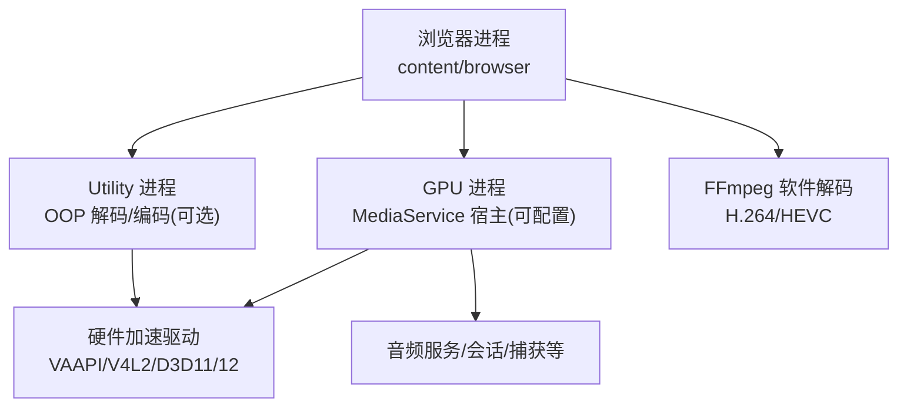
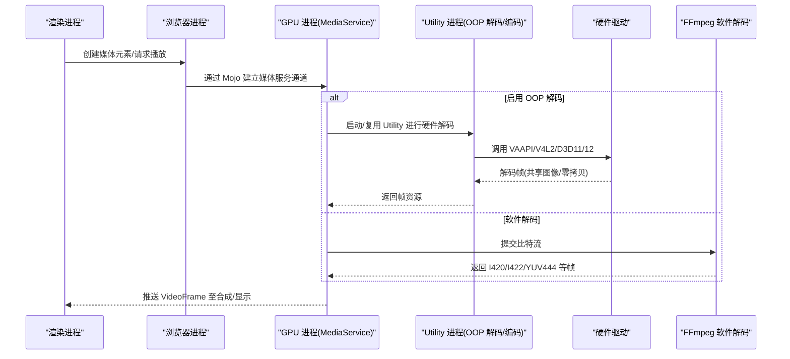
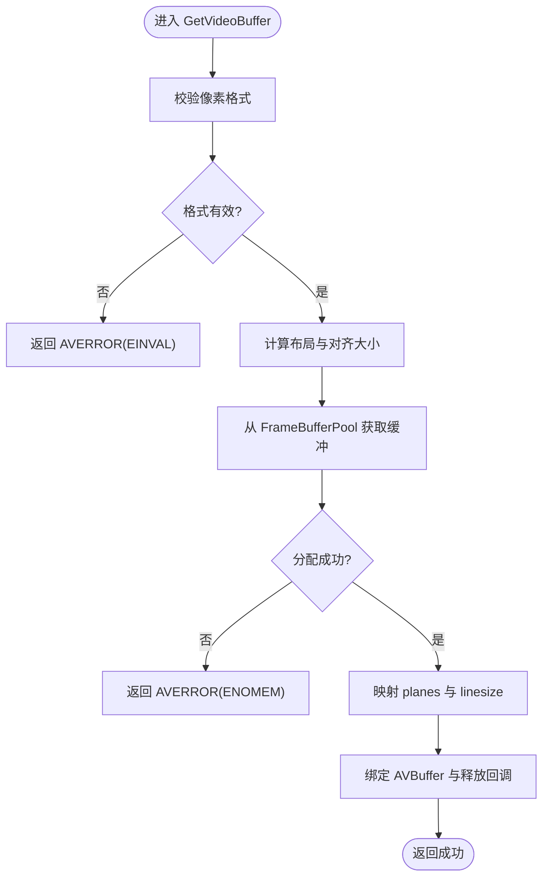
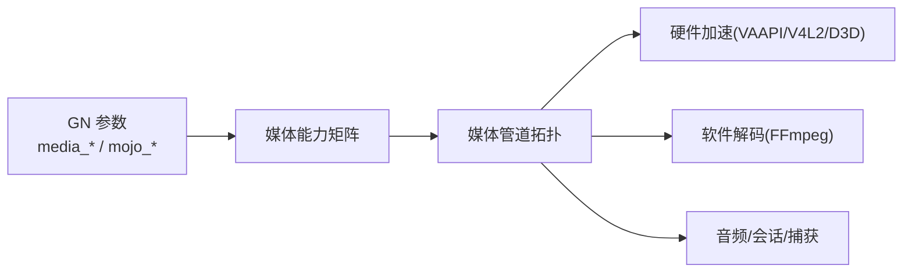

# 媒体处理管道

本文引用的文件

- [src/media/base/media_switches.cc](https://github.com/Mcloud136/Mcloud-Browser/blob/main/src/media/base/media_switches.cc)
- [src/media/media_options.gni](https://github.com/Mcloud136/Mcloud-Browser/blob/main/src/media/media_options.gni)
- [infra/gn_args.list](https://github.com/Mcloud136/Mcloud-Browser/blob/main/infra/gn_args.list)
- [infra/win_args.list](https://github.com/Mcloud136/Mcloud-Browser/blob/main/infra/win_args.list)
- [infra/args.list](https://github.com/Mcloud136/Mcloud-Browser/blob/main/infra/args.list)
- [arm/android/args.list](https://github.com/Mcloud136/Mcloud-Browser/blob/main/arm/android/args.list)
- [other/Mac/mac_args.list](https://github.com/Mcloud136/Mcloud-Browser/blob/main/other/Mac/mac_args.list)
- [src/content/browser/BUILD.gn](https://github.com/Mcloud136/Mcloud-Browser/blob/main/src/content/browser/BUILD.gn)
- [src/media/filters/ffmpeg_video_decoder.cc](https://github.com/Mcloud136/Mcloud-Browser/blob/main/src/media/filters/ffmpeg_video_decoder.cc)
- [src/media/filters/ffmpeg_glue.cc](https://github.com/Mcloud136/Mcloud-Browser/blob/main/src/media/filters/ffmpeg_glue.cc)
- [src/content/common/gpu_pre_sandbox_hook_linux.cc](https://github.com/Mcloud136/Mcloud-Browser/blob/main/src/content/common/gpu_pre_sandbox_hook_linux.cc)
- [mcloud_flags.txt](https://github.com/Mcloud136/Mcloud-Browser/blob/main/mcloud_flags.txt)

## 目录
1. [简介](#简介)
2. [项目结构](#项目结构)
3. [核心组件](#核心组件)
4. [架构总览](#架构总览)
5. [详细组件分析](#详细组件分析)
6. [依赖关系分析](#依赖关系分析)
7. [性能考量](#性能考量)
8. [故障排查指南](#故障排查指南)
9. [结论](#结论)
10. [附录](#附录)

## 简介
本文件面向 MCloud Browser 的媒体处理管道，系统化梳理从媒体数据输入到最终渲染的完整链路：媒体源解析、解码器选择、帧处理与输出渲染。文档重点说明多进程架构下的媒体服务通信机制（Mojo）、数据传递方式、错误处理与恢复策略，并给出性能分析与调试工具的使用建议。同时提供架构图与关键接口说明，帮助读者快速定位问题与优化点。

## 项目结构
MCloud Browser 基于 Chromium 的媒体子系统构建，媒体管道的关键实现集中在 media 层，并通过 content/browser 与 GPU/Utility 进程协作完成硬件加速、设备访问与资源管理。GN 构建参数控制是否启用 Mojo Media Service、各服务宿主进程以及具体编解码能力。

图表来源
- [src/media/media_options.gni:322-336](https://github.com/Mcloud136/Mcloud-Browser/blob/main/src/media/media_options.gni#L322-L336)
- [infra/gn_args.list:3904-3930](https://github.com/Mcloud136/Mcloud-Browser/blob/main/infra/gn_args.list#L3904-L3930)
- [src/content/browser/BUILD.gn:1361-1460](https://github.com/Mcloud136/Mcloud-Browser/blob/main/src/content/browser/BUILD.gn#L1361-L1460)

章节来源
- [src/media/media_options.gni:322-336](https://github.com/Mcloud136/Mcloud-Browser/blob/main/src/media/media_options.gni#L322-L336)
- [infra/gn_args.list:3904-3930](https://github.com/Mcloud136/Mcloud-Browser/blob/main/infra/gn_args.list#L3904-L3930)
- [src/content/browser/BUILD.gn:1361-1460](https://github.com/Mcloud136/Mcloud-Browser/blob/main/src/content/browser/BUILD.gn#L1361-L1460)

## 核心组件
- 媒体开关与特性：集中定义媒体相关功能开关、平台特性与默认行为，如 Linux 硬件解码、OOP 解码、专用线程等。
- 媒体服务配置：通过 GN 参数决定 Mojo Media Service 的宿主进程与启用哪些服务（视频解码、CDM 等）。
- FFmpeg 视频解码：负责 H.264/HEVC 的软件解码路径，包含线程数估算、缓冲池分配、帧布局与释放。
- 沙箱与设备权限：在 Linux 上为 V4L2/VAAPI 等设备节点授予读写权限，确保硬件解码可用。
- 浏览器侧媒体集成：注册/桥接媒体流、捕获设备、音频输出/输入、媒体会话与指标等。

章节来源
- [src/media/base/media_switches.cc:742-793](https://github.com/Mcloud136/Mcloud-Browser/blob/main/src/media/base/media_switches.cc#L742-L793)
- [src/media/base/media_switches.cc:1364-1391](https://github.com/Mcloud136/Mcloud-Browser/blob/main/src/media/base/media_switches.cc#L1364-L1391)
- [src/media/media_options.gni:322-336](https://github.com/Mcloud136/Mcloud-Browser/blob/main/src/media/media_options.gni#L322-L336)
- [src/media/filters/ffmpeg_video_decoder.cc:64-99](https://github.com/Mcloud136/Mcloud-Browser/blob/main/src/media/filters/ffmpeg_video_decoder.cc#L64-L99)
- [src/media/filters/ffmpeg_video_decoder.cc:131-221](https://github.com/Mcloud136/Mcloud-Browser/blob/main/src/media/filters/ffmpeg_video_decoder.cc#L131-L221)
- [src/content/common/gpu_pre_sandbox_hook_linux.cc:121-149](https://github.com/Mcloud136/Mcloud-Browser/blob/main/src/content/common/gpu_pre_sandbox_hook_linux.cc#L121-L149)
- [src/content/browser/BUILD.gn:1361-1460](https://github.com/Mcloud136/Mcloud-Browser/blob/main/src/content/browser/BUILD.gn#L1361-L1460)

## 架构总览
MCloud Browser 的媒体管道采用多进程隔离与按需加速的策略：
- 浏览器进程负责页面与媒体元素生命周期、媒体会话、捕获设备管理等。
- GPU 进程作为 MediaService 宿主时，承载多数媒体服务；也可配置为浏览器进程或独立 Utility 进程。
- OOP 解码/编码可在 Utility 进程中运行，借助共享图像或零拷贝降低跨进程开销。
- 硬件加速路径通过平台 API（VAAPI/V4L2/D3D11/12）访问驱动；软件路径使用 FFmpeg。

图表来源
- [src/media/media_options.gni:322-336](https://github.com/Mcloud136/Mcloud-Browser/blob/main/src/media/media_options.gni#L322-L336)
- [infra/gn_args.list:3904-3930](https://github.com/Mcloud136/Mcloud-Browser/blob/main/infra/gn_args.list#L3904-L3930)
- [src/media/base/media_switches.cc:1364-1391](https://github.com/Mcloud136/Mcloud-Browser/blob/main/src/media/base/media_switches.cc#L1364-L1391)
- [src/media/filters/ffmpeg_video_decoder.cc:131-221](https://github.com/Mcloud136/Mcloud-Browser/blob/main/src/media/filters/ffmpeg_video_decoder.cc#L131-L221)

## 详细组件分析

### 媒体服务与多进程通信（Mojo）
- 宿主进程：可通过 gn 参数将 MediaService 部署在 GPU 或浏览器进程，影响跨进程边界与资源归属。
- 服务列表：可选择启用 video_decoder、cdm、audio_decoder 等子服务，组合出不同管道形态。
- 特性开关：支持 OOP 解码、共享图像传输、专用线程等，以平衡性能与稳定性。

章节来源
- [src/media/media_options.gni:322-336](https://github.com/Mcloud136/Mcloud-Browser/blob/main/src/media/media_options.gni#L322-L336)
- [infra/gn_args.list:3904-3930](https://github.com/Mcloud136/Mcloud-Browser/blob/main/infra/gn_args.list#L3904-L3930)
- [infra/win_args.list:3587-3615](https://github.com/Mcloud136/Mcloud-Browser/blob/main/infra/win_args.list#L3587-L3615)
- [infra/args.list:3779-3843](https://github.com/Mcloud136/Mcloud-Browser/blob/main/infra/args.list#L3779-L3843)
- [arm/android/args.list:3647-3678](https://github.com/Mcloud136/Mcloud-Browser/blob/main/arm/android/args.list#L3647-L3678)
- [other/Mac/mac_args.list:3392-3424](https://github.com/Mcloud136/Mcloud-Browser/blob/main/other/Mac/mac_args.list#L3392-L3424)
- [src/media/base/media_switches.cc:1364-1391](https://github.com/Mcloud136/Mcloud-Browser/blob/main/src/media/base/media_switches.cc#L1364-L1391)

### 媒体源解析与解码器选择
- 平台特性：Linux 下默认启用 VA-API/V4L2 加速解码；NVIDIA 驱动黑名单默认关闭以避免崩溃。
- OOP 解码：在 ChromeOS 默认启用，其他平台默认关闭；可使用共享图像减少拷贝。
- 软件解码：FFmpeg 仅编译 H.264/HEVC 支持，按分辨率线性估算线程数，提升吞吐。

章节来源
- [src/media/base/media_switches.cc:742-793](https://github.com/Mcloud136/Mcloud-Browser/blob/main/src/media/base/media_switches.cc#L742-L793)
- [src/media/base/media_switches.cc:1364-1391](https://github.com/Mcloud136/Mcloud-Browser/blob/main/src/media/base/media_switches.cc#L1364-L1391)
- [src/media/filters/ffmpeg_video_decoder.cc:64-99](https://github.com/Mcloud136/Mcloud-Browser/blob/main/src/media/filters/ffmpeg_video_decoder.cc#L64-L99)
- [src/media/filters/ffmpeg_video_decoder.cc:118-123](https://github.com/Mcloud136/Mcloud-Browser/blob/main/src/media/filters/ffmpeg_video_decoder.cc#L118-L123)

### 帧处理与内存管理
- 帧缓冲池：FFmpeg 解码器通过 FrameBufferPool 分配对齐的连续内存，避免越界读取/写入。
- 像素格式：支持 I420/I422/YUV444 及 10/12bit 平面格式，适配不同管线需求。
- 生命周期：AVBuffer 绑定释放回调，确保帧资源正确归还到池中，防止泄漏。

图表来源
- [src/media/filters/ffmpeg_video_decoder.cc:131-221](https://github.com/Mcloud136/Mcloud-Browser/blob/main/src/media/filters/ffmpeg_video_decoder.cc#L131-L221)

章节来源
- [src/media/filters/ffmpeg_video_decoder.cc:131-221](https://github.com/Mcloud136/Mcloud-Browser/blob/main/src/media/filters/ffmpeg_video_decoder.cc#L131-L221)

### 输出渲染与合成
- 渲染路径：解码后的 VideoFrame 经 GPU 进程或渲染进程合成，最终提交到显示后端。
- 平台差异：Wayland/Ozone 等后端对 DMA-BUF、Overlay、Viewporter 的支持会影响零拷贝与效率。
- 沙箱权限：Linux 下需为 V4L2/VAAPI 设备节点授权，否则硬件解码无法工作。

章节来源
- [src/content/common/gpu_pre_sandbox_hook_linux.cc:121-149](https://github.com/Mcloud136/Mcloud-Browser/blob/main/src/content/common/gpu_pre_sandbox_hook_linux.cc#L121-L149)

### 错误处理与恢复策略
- 解码失败日志：记录最后错误码与缓冲区信息，便于定位。
- 无效帧保护：若 Y/U/V 指针为空则判定帧无效并中止，避免崩溃。
- 回退策略：支持解码错误后尝试其他解码器，提高鲁棒性。
- 初始化失败：当找不到解码器或打开失败时释放资源并返回失败。

章节来源
- [src/media/filters/ffmpeg_video_decoder.cc:379-407](https://github.com/Mcloud136/Mcloud-Browser/blob/main/src/media/filters/ffmpeg_video_decoder.cc#L379-L407)
- [src/media/filters/ffmpeg_video_decoder.cc:497-507](https://github.com/Mcloud136/Mcloud-Browser/blob/main/src/media/filters/ffmpeg_video_decoder.cc#L497-L507)
- [src/media/base/media_switches.cc:671-676](https://github.com/Mcloud136/Mcloud-Browser/blob/main/src/media/base/media_switches.cc#L671-L676)

### 关键接口与职责
- FFmpegVideoDecoder：封装 FFmpeg 解码流程，负责线程数估算、缓冲分配、帧生命周期管理。
- FFmpegGlue：管理 AVFormatContext/AVIOContext 的生命周期与清理逻辑。
- 媒体服务配置：gn 参数控制 MediaService 宿主与服务列表，影响整体管道拓扑。
- 沙箱钩子：Linux 下预授权硬件解码设备节点，保障运行时可达性。

章节来源
- [src/media/filters/ffmpeg_video_decoder.cc:118-123](https://github.com/Mcloud136/Mcloud-Browser/blob/main/src/media/filters/ffmpeg_video_decoder.cc#L118-L123)
- [src/media/filters/ffmpeg_glue.cc:229-247](https://github.com/Mcloud136/Mcloud-Browser/blob/main/src/media/filters/ffmpeg_glue.cc#L229-L247)
- [src/media/media_options.gni:322-336](https://github.com/Mcloud136/Mcloud-Browser/blob/main/src/media/media_options.gni#L322-L336)
- [src/content/common/gpu_pre_sandbox_hook_linux.cc:121-149](https://github.com/Mcloud136/Mcloud-Browser/blob/main/src/content/common/gpu_pre_sandbox_hook_linux.cc#L121-L149)

## 依赖关系分析
- 构建期依赖：media_use_libvpx、media_use_openh264、USE_VAAPI/USE_V4L2_CODEC 等开关影响可用解码器与加速路径。
- 运行期依赖：mojo_media_host 与 mojo_media_services 决定 MediaService 的位置与能力集合。
- 平台依赖：Linux 需要 V4L2/VAAPI 设备节点权限；Windows/macOS 走各自硬件加速栈。

图表来源
- [infra/gn_args.list:3870-3936](https://github.com/Mcloud136/Mcloud-Browser/blob/main/infra/gn_args.list#L3870-L3936)
- [src/media/media_options.gni:322-336](https://github.com/Mcloud136/Mcloud-Browser/blob/main/src/media/media_options.gni#L322-L336)

章节来源
- [infra/gn_args.list:3870-3936](https://github.com/Mcloud136/Mcloud-Browser/blob/main/infra/gn_args.list#L3870-L3936)
- [src/media/media_options.gni:322-336](https://github.com/Mcloud136/Mcloud-Browser/blob/main/src/media/media_options.gni#L322-L336)

## 性能考量
- 线程与并行：根据分辨率线性调整解码线程数，平衡 CPU 占用与吞吐。
- 零拷贝与共享图像：OOP 解码配合共享图像可减少跨进程拷贝，降低延迟。
- 专用线程：MediaService 专用线程可降低调度抖动，提升实时性。
- 硬件优先：优先使用平台硬件解码，必要时回退到软件解码。
- 沙箱与设备：确保设备节点权限，避免运行时阻塞或失败。

章节来源
- [src/media/filters/ffmpeg_video_decoder.cc:64-99](https://github.com/Mcloud136/Mcloud-Browser/blob/main/src/media/filters/ffmpeg_video_decoder.cc#L64-L99)
- [src/media/base/media_switches.cc:1364-1391](https://github.com/Mcloud136/Mcloud-Browser/blob/main/src/media/base/media_switches.cc#L1364-L1391)
- [src/content/common/gpu_pre_sandbox_hook_linux.cc:121-149](https://github.com/Mcloud136/Mcloud-Browser/blob/main/src/content/common/gpu_pre_sandbox_hook_linux.cc#L121-L149)

## 故障排查指南
- 绿屏/花屏：Intel 核显 D3D12 解码器在特定驱动版本存在已知缺陷，可通过禁用该特性回退到 D3D11。
- 解码失败：检查最后错误码与缓冲区信息，确认比特流与解码器匹配；必要时启用回退策略。
- 设备不可用：Linux 下确认 V4L2/VAAPI 设备节点已授权；检查驱动与内核模块加载状态。
- 性能瓶颈：观察线程数、是否启用共享图像、MediaService 是否在专用线程运行。

章节来源
- [mcloud_flags.txt:83-105](https://github.com/Mcloud136/Mcloud-Browser/blob/main/mcloud_flags.txt#L83-L105)
- [src/media/filters/ffmpeg_video_decoder.cc:379-407](https://github.com/Mcloud136/Mcloud-Browser/blob/main/src/media/filters/ffmpeg_video_decoder.cc#L379-L407)
- [src/content/common/gpu_pre_sandbox_hook_linux.cc:121-149](https://github.com/Mcloud136/Mcloud-Browser/blob/main/src/content/common/gpu_pre_sandbox_hook_linux.cc#L121-L149)

## 结论
MCloud Browser 的媒体管道以多进程与 Mojo 为核心，结合平台硬件加速与 FFmpeg 软件解码，形成高内聚、低耦合的处理链路。通过 GN 参数与特性开关灵活配置宿主进程与服务能力，兼顾性能与稳定性。合理的线程与缓冲管理、零拷贝传输与沙箱权限设置，是保证高质量播放体验的关键。遇到问题时，应优先检查特性开关、设备权限与解码器回退策略。

## 附录
- 常用 GN 参数参考：
  - mojo_media_host：MediaService 宿主进程（browser/gpu/空）
  - mojo_media_services：启用的媒体服务列表（renderer/cdm/audio_decoder/video_decoder）
  - media_use_libvpx/openh264：启用相应软件编解码库
- 常用运行特性：
  - kUseOutOfProcessVideoDecoding：OOP 解码
  - kUseSharedImageInOOPVDProcess：共享图像传输
  - kDedicatedMediaServiceThread：MediaService 专用线程
  - kFallbackAfterDecodeError：解码错误后回退

章节来源
- [infra/gn_args.list:3904-3930](https://github.com/Mcloud136/Mcloud-Browser/blob/main/infra/gn_args.list#L3904-L3930)
- [src/media/base/media_switches.cc:1364-1391](https://github.com/Mcloud136/Mcloud-Browser/blob/main/src/media/base/media_switches.cc#L1364-L1391)
- [src/media/base/media_switches.cc:628-635](https://github.com/Mcloud136/Mcloud-Browser/blob/main/src/media/base/media_switches.cc#L628-L635)
- [src/media/base/media_switches.cc:671-676](https://github.com/Mcloud136/Mcloud-Browser/blob/main/src/media/base/media_switches.cc#L671-L676)