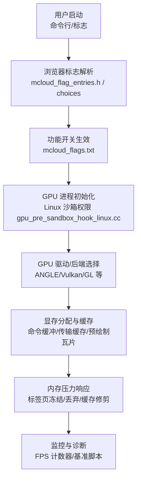
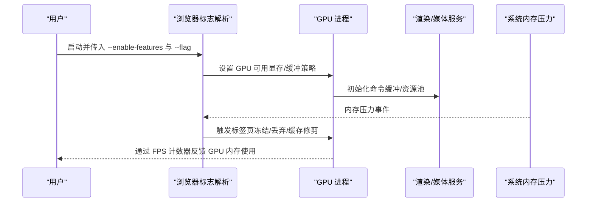
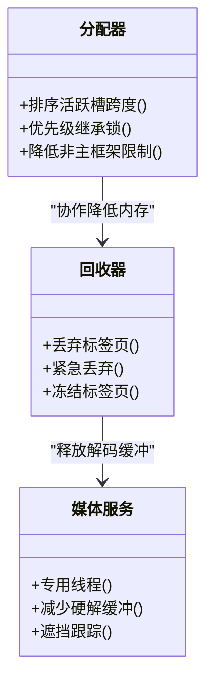

# GPU 内存管理

<cite>
**本文引用的文件**
- [mcloud_flags.txt](file://mcloud_flags.txt)
- [README.md](file://README.md)
- [2026-06-19-performance-optimization-design.md](file://docs/superpowers/specs/2026-06-19-performance-optimization-design.md)
- [2026-06-20-m149-to-m150-upgrade-report.md](file://docs/superpowers/specs/2026-06-20-m149-to-m150-upgrade-report.md)
- [2026-06-20-release-notes-m150.md](file://docs/superpowers/specs/2026-06-20-release-notes-m150.md)
- [memory-Enable-the-tab-discards-feature.patch](file://infra/Flatpak/com.mcloud.browser/patches/chromium/memory-Enable-the-tab-discards-feature.patch)
- [mcloud_flag_entries.h](file://src/chrome/browser/mcloud_flag_entries.h)
- [mcloud_flag_choices.h](file://src/chrome/browser/mcloud_flag_choices.h)
- [about_flags.cc](file://src/chrome/browser/about_flags.cc)
- [bench_memory.ps1](file://benchmark/bench_memory.ps1)
- [gpu_pre_sandbox_hook_linux.cc](file://src/content/common/gpu_pre_sandbox_hook_linux.cc)
- [gn_args.list](file://infra/gn_args.list)
- [win_gn_args.list](file://infra/win_gn_args.list)
- [args.list](file://infra/args.list)
</cite>

## 目录
1. [简介](#简介)
2. [项目结构](#项目结构)
3. [核心组件](#核心组件)
4. [架构总览](#架构总览)
5. [详细组件分析](#详细组件分析)
6. [依赖关系分析](#依赖关系分析)
7. [性能考量](#性能考量)
8. [故障排查指南](#故障排查指南)
9. [结论](#结论)
10. [附录](#附录)

## 简介
本文件面向 MCloud Browser 的 GPU 内存管理系统，系统性阐述显存分配策略、内存池与缓存回收、垃圾回收联动、显存使用监控、泄漏检测思路、不同 GPU 架构下的优化差异，以及配套的调试方法与最佳实践。文档基于仓库中的构建参数、功能开关、补丁与基准脚本等可验证材料进行归纳，帮助读者在不深入源码的情况下理解整体机制与调优路径。

## 项目结构
围绕 GPU 内存管理的工程要素主要分布在以下位置：
- 功能开关与默认启用项：位于 mcloud_flags.txt，集中启用了多项内存与 GPU 相关特性（如标签页冻结、传输缓存清理、预绘制瓦片回收等）。
- 设计与升级报告：docs/superpowers/specs 下对内存优化、GPU/渲染优化进行了条目化说明，便于对照版本演进。
- 浏览器标志定义：src/chrome/browser/mcloud_flag_entries.h 与 mcloud_flag_choices.h 暴露了 force-gpu-mem-available-mb、enable-native-gpu-memory-buffers、show-fps-counter 等关键开关。
- Linux GPU 沙箱权限：src/content/common/gpu_pre_sandbox_hook_linux.cc 配置 GPU 设备访问权限，影响 GPU 进程初始化与资源映射。
- 构建参数：infra/*.list 中关于 PartitionAlloc、V8 指针压缩、ANGLE/Vulkan 后端等选项，间接影响 GPU 内存碎片与分配效率。
- 基准脚本：benchmark/bench_memory.ps1 用于采集工作集峰值，辅助评估多标签场景下的内存压力与回收效果。

图表来源
- [mcloud_flag_entries.h:174-183](file://src/chrome/browser/mcloud_flag_entries.h#L174-L183)
- [mcloud_flags.txt:27-38](file://mcloud_flags.txt#L27-L38)
- [gpu_pre_sandbox_hook_linux.cc:460-478](file://src/content/common/gpu_pre_sandbox_hook_linux.cc#L460-L478)

章节来源
- [mcloud_flags.txt:27-38](file://mcloud_flags.txt#L27-L38)
- [mcloud_flag_entries.h:174-183](file://src/chrome/browser/mcloud_flag_entries.h#L174-L183)
- [gpu_pre_sandbox_hook_linux.cc:460-478](file://src/content/common/gpu_pre_sandbox_hook_linux.cc#L460-L478)

## 核心组件
- 显存上限与可映射缓冲
  - 通过 force-gpu-mem-available-mb 限制 GPU 可用显存，避免过度占用；在 Linux 上 enable-native-gpu-memory-buffers 启用 CPU 可映射的 GPU 缓冲，有助于减少拷贝并改善跨进程共享。
- 内存压力与回收
  - InfiniteTabsFreezing 与 InfiniteTabsFreezingOnMemoryPressure 在内存压力下冻结标签页；DiscardOnCommitLimit 与 SustainedPMUrgentDiscarding 在低可用内存时触发紧急丢弃；ReclaimOldPrepaintTiles 与 PruneOldTransferCacheEntries 分别回收预绘制瓦片与旧传输缓存，降低 GPU 内存占用。
- 分配器与碎片控制
  - PartitionAllocSortActiveSlotSpans、PartitionAllocUsePriorityInheritanceLocks、LowerPAMemoryLimitForNonMainRenderers 等提升分配效率、降低锁竞争与多标签内存占用。
- 渲染与命令缓冲
  - IncreasedCmdBufferParseSlice 增大命令缓冲区切片，减少上下文切换开销；ResourcePoolPreferExactSizeReuse 优先复用精确大小资源，减少显存碎片；SkiaGraphitePrecompilation 预编译着色管线，消除首次编译卡顿。
- 监控与诊断
  - show-fps-counter 提供 FPS 与 GPU 内存使用叠加显示；历史模块与网络层对内存压力事件有监听与响应；Windows 基准脚本 bench_memory.ps1 可用于测量工作集峰值以评估回收策略效果。

章节来源
- [mcloud_flag_entries.h:174-183](file://src/chrome/browser/mcloud_flag_entries.h#L174-L183)
- [mcloud_flags.txt:27-38](file://mcloud_flags.txt#L27-L38)
- [2026-06-19-performance-optimization-design.md:78-88](file://docs/superpowers/specs/2026-06-19-performance-optimization-design.md#L78-L88)
- [2026-06-20-m149-to-m150-upgrade-report.md:57-66](file://docs/superpowers/specs/2026-06-20-m149-to-m150-upgrade-report.md#L57-L66)
- [2026-06-20-release-notes-m150.md:156-173](file://docs/superpowers/specs/2026-06-20-release-notes-m150.md#L156-L173)
- [bench_memory.ps1:62-77](file://benchmark/bench_memory.ps1#L62-L77)

## 架构总览
MCloud Browser 的 GPU 内存管理由“标志驱动 + 平台适配 + 运行时回收”构成：
- 标志层：统一在 mcloud_flags.txt 启用一系列内存/GPU 优化特性；浏览器标志入口在 mcloud_flag_entries.h 与 choices 中定义。
- 平台层：Linux 下通过 gpu_pre_sandbox_hook_linux.cc 开放 GPU 设备访问权限，确保 GPU 进程能正确初始化与映射缓冲。
- 运行层：根据系统内存压力与 GPU 状态，动态冻结/丢弃标签页、修剪传输缓存、回收预绘制瓦片，并通过命令缓冲与资源池策略降低碎片与切换成本。
- 监控层：内置 FPS 计数器叠加 GPU 内存信息；配合基准脚本与日志定位问题。

图表来源
- [mcloud_flags.txt:27-38](file://mcloud_flags.txt#L27-L38)
- [mcloud_flag_entries.h:174-183](file://src/chrome/browser/mcloud_flag_entries.h#L174-L183)
- [2026-06-19-performance-optimization-design.md:78-88](file://docs/superpowers/specs/2026-06-19-performance-optimization-design.md#L78-L88)

## 详细组件分析

### 显存分配策略与资源池
- 显存上限控制
  - 通过 force-gpu-mem-available-mb 限制 GPU 资源总量，防止 OOM；适用于多标签或高负载场景。
- 资源池与命令缓冲
  - ResourcePoolPreferExactSizeReuse 优先复用精确大小资源，减少碎片；IncreasedCmdBufferParseSlice 增大命令缓冲切片，降低上下文切换。
- 传输缓存与预绘制瓦片
  - PruneOldTransferCacheEntries 清理旧传输缓存条目，释放 GPU 内存；ReclaimOldPrepaintTiles 在 30 秒后回收预绘制瓦片，降低渲染内存占用。

图表来源
- [2026-06-20-release-notes-m150.md:167-173](file://docs/superpowers/specs/2026-06-20-release-notes-m150.md#L167-L173)
- [2026-06-19-performance-optimization-design.md:78-88](file://docs/superpowers/specs/2026-06-19-performance-optimization-design.md#L78-L88)

章节来源
- [mcloud_flag_entries.h:174-183](file://src/chrome/browser/mcloud_flag_entries.h#L174-L183)
- [2026-06-20-release-notes-m150.md:167-173](file://docs/superpowers/specs/2026-06-20-release-notes-m150.md#L167-L173)
- [2026-06-19-performance-optimization-design.md:78-88](file://docs/superpowers/specs/2026-06-19-performance-optimization-design.md#L78-L88)

### 内存池管理与垃圾回收联动
- 分配器优化
  - PartitionAllocSortActiveSlotSpans 在 PurgeMemory 时对活跃 slot span 排序，减少碎片；PartitionAllocUsePriorityInheritanceLocks 降低锁竞争；LowerPAMemoryLimitForNonMainRenderers 降低非主框架渲染器的内存限制，多标签场景节省 10-20%。
- 垃圾回收与页面生命周期
  - DiscardOnCommitLimit 在可用内存低于阈值时丢弃标签页；SustainedPMUrgentDiscarding 在持续压力下紧急丢弃；InfiniteTabsFreezing 与 InfiniteTabsFreezingOnMemoryPressure 在内存压力下冻结标签页，减少 GPU/CPU 占用。
- 媒体与解码缓冲
  - ReduceHardwareVideoDecoderBuffers 减少硬解缓冲；EncryptedMediaOcclusionTracking 跟踪遮挡，跳过不必要解码；DedicatedMediaServiceThread 将媒体服务置于专用线程，提升流畅度。

图表来源
- [2026-06-19-performance-optimization-design.md:78-88](file://docs/superpowers/specs/2026-06-19-performance-optimization-design.md#L78-L88)
- [2026-06-20-m149-to-m150-upgrade-report.md:57-84](file://docs/superpowers/specs/2026-06-20-m149-to-m150-upgrade-report.md#L57-L84)

章节来源
- [2026-06-19-performance-optimization-design.md:78-88](file://docs/superpowers/specs/2026-06-19-performance-optimization-design.md#L78-L88)
- [2026-06-20-m149-to-m150-upgrade-report.md:57-84](file://docs/superpowers/specs/2026-06-20-m149-to-m150-upgrade-report.md#L57-L84)

### 不同 GPU 架构的内存模型差异与优化
- Windows (ANGLE/D3D11/Vulkan)
  - 通过 ANGLE 的 Vulkan 共享环缓冲命令分配、Vulkan 验证层、WGPU 后端等开关调整底层行为；D3D11 视频捕获零拷贝减少内存拷贝开销。
- Linux (GL/VAAPI/Wayland/X11)
  - enable-native-gpu-memory-buffers 启用 CPU 可映射 GPU 缓冲；vaapi-video-decode-linux-gl 与 vaapi-on-nvidia-gpus 控制 VAAPI 加速路径；Wayland 下 WaylandBufferManagerGpu 负责缓冲管理。
- 通用策略
  - 无论平台，均通过资源池复用、命令缓冲切片、传输缓存修剪与预绘制瓦片回收来降低碎片与显存占用。

章节来源
- [win_gn_args.list:276-399](file://infra/win_gn_args.list#L276-L399)
- [args.list:3982-4000](file://infra/args.list#L3982-L4000)
- [mcloud_flag_entries.h:179-203](file://src/chrome/browser/mcloud_flag_entries.h#L179-L203)
- [2026-06-20-release-notes-m150.md:156-173](file://docs/superpowers/specs/2026-06-20-release-notes-m150.md#L156-L173)

### 显存使用监控、泄漏检测与调试方法
- 监控
  - show-fps-counter 在 HUD 中显示 FPS 与 GPU 内存使用，便于快速观察显存趋势。
- 泄漏检测思路
  - 结合内存压力事件（历史模块与网络层监听）与标签页生命周期（补丁中对 OnMemoryPressure 的处理），在压力上升阶段记录快照，对比释放前后差异定位疑似泄漏。
  - 使用基准脚本 bench_memory.ps1 在多标签场景下采集工作集峰值，评估回收策略有效性。
- 调试建议
  - 在 Linux 下确认 GPU 设备权限已正确开放（/dev/dri/card*、/dev/nvidia* 等），避免因权限不足导致初始化失败或资源映射异常。
  - 针对特定平台后端（Vulkan/GL/D3D11）开启相应验证层或追踪事件，辅助定位驱动层问题。

章节来源
- [mcloud_flag_entries.h:240-243](file://src/chrome/browser/mcloud_flag_entries.h#L240-L243)
- [memory-Enable-the-tab-discards-feature.patch:44-71](file://infra/Flatpak/com.mcloud.browser/patches/chromium/memory-Enable-the-tab-discards-feature.patch#L44-L71)
- [bench_memory.ps1:62-77](file://benchmark/bench_memory.ps1#L62-L77)
- [gpu_pre_sandbox_hook_linux.cc:460-478](file://src/content/common/gpu_pre_sandbox_hook_linux.cc#L460-L478)

## 依赖关系分析
- 标志依赖
  - mcloud_flags.txt 启用的特性会驱动浏览器行为变化，并在 mcloud_flag_entries.h 与 choices 中暴露为可配置项。
- 平台依赖
  - Linux 下 GPU 进程需要正确的设备权限；Windows 下 ANGLE/Vulkan/D3D11 后端的选择影响显存分配与拷贝路径。
- 构建参数依赖
  - PartitionAlloc、V8 指针压缩、ANGLE 后端等 GN 参数会影响运行时内存布局与分配效率。

图表来源
- [mcloud_flags.txt:27-38](file://mcloud_flags.txt#L27-L38)
- [mcloud_flag_entries.h:174-183](file://src/chrome/browser/mcloud_flag_entries.h#L174-L183)
- [gn_args.list:5313-5354](file://infra/gn_args.list#L5313-L5354)

章节来源
- [mcloud_flags.txt:27-38](file://mcloud_flags.txt#L27-L38)
- [mcloud_flag_entries.h:174-183](file://src/chrome/browser/mcloud_flag_entries.h#L174-L183)
- [gn_args.list:5313-5354](file://infra/gn_args.list#L5313-L5354)

## 性能考量
- 多标签场景
  - 通过 LowerPAMemoryLimitForNonMainRenderers 与 InfiniteTabsFreezing 降低非主框架内存占用，并在压力下冻结标签页，显著减少显存与 CPU 占用。
- 渲染与解码
  - 增加命令缓冲切片、预编译着色管线、减少硬解缓冲与零拷贝捕获，提升视频播放流畅度与首帧延迟。
- 分配器与碎片
  - 排序活跃槽跨度、优先复用精确大小资源，降低碎片与分配抖动。
- 监控与回归
  - 使用 FPS 计数器与基准脚本持续观测，确保优化项在不同站点与硬件组合下稳定有效。

章节来源
- [2026-06-19-performance-optimization-design.md:78-98](file://docs/superpowers/specs/2026-06-19-performance-optimization-design.md#L78-L98)
- [2026-06-20-m149-to-m150-upgrade-report.md:57-84](file://docs/superpowers/specs/2026-06-20-m149-to-m150-upgrade-report.md#L57-L84)
- [README.md:119-164](file://README.md#L119-L164)

## 故障排查指南
- 常见问题与对策
  - 黑屏/花屏/视频无法播放：尝试禁用 WebGL 2 或关闭 GPU 上下文丢失保护（gpu-no-context-lost），检查驱动与后端兼容性。
  - 显存不足/OOM：降低 force-gpu-mem-available-mb，启用 DiscardOnCommitLimit 与 SustainedPMUrgentDiscarding，必要时启用标签页冻结。
  - Linux 下 GPU 初始化失败：确认 /dev/dri/card* 与 NVIDIA 设备权限已开放；检查 VAAPI/GL 后端配置。
  - 多标签卡顿：启用 ReclaimOldPrepaintTiles 与 PruneOldTransferCacheEntries，降低非主框架内存限制。
- 诊断步骤
  - 打开 FPS 计数器观察 GPU 内存曲线；在内存压力事件中记录快照；使用 bench_memory.ps1 采集工作集峰值；对比不同后端（Vulkan/GL/D3D11）表现。

章节来源
- [mcloud_flag_entries.h:205-210](file://src/chrome/browser/mcloud_flag_entries.h#L205-L210)
- [mcloud_flag_entries.h:240-247](file://src/chrome/browser/mcloud_flag_entries.h#L240-L247)
- [gpu_pre_sandbox_hook_linux.cc:460-478](file://src/content/common/gpu_pre_sandbox_hook_linux.cc#L460-L478)
- [bench_memory.ps1:62-77](file://benchmark/bench_memory.ps1#L62-L77)

## 结论
MCloud Browser 的 GPU 内存管理以“标志驱动 + 平台适配 + 运行时回收”为核心，通过显存上限控制、资源池复用、命令缓冲优化、传输缓存与预绘制瓦片回收、标签页冻结/丢弃等多维度手段，在多标签与多媒体场景下实现稳定的显存占用与流畅体验。配合 FPS 计数器与基准脚本，可在不同硬件与后端组合下进行持续监控与回归验证。建议在复杂场景中优先启用内存压力相关特性，并结合平台后端能力进行针对性调优。

## 附录
- 常用标志速查
  - 显存与缓冲：force-gpu-mem-available-mb、enable-native-gpu-memory-buffers
  - 内存压力与回收：DiscardOnCommitLimit、SustainedPMUrgentDiscarding、InfiniteTabsFreezing、InfiniteTabsFreezingOnMemoryPressure
  - 渲染与缓存：IncreasedCmdBufferParseSlice、ResourcePoolPreferExactSizeReuse、ReclaimOldPrepaintTiles、PruneOldTransferCacheEntries
  - 监控：show-fps-counter

章节来源
- [mcloud_flags.txt:27-38](file://mcloud_flags.txt#L27-L38)
- [mcloud_flag_entries.h:174-183](file://src/chrome/browser/mcloud_flag_entries.h#L174-L183)
- [2026-06-20-release-notes-m150.md:156-173](file://docs/superpowers/specs/2026-06-20-release-notes-m150.md#L156-L173)