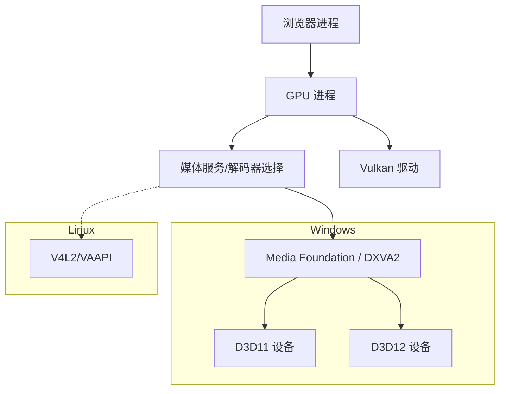
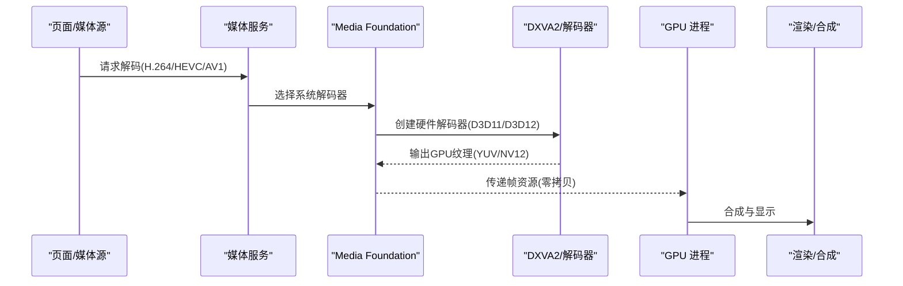
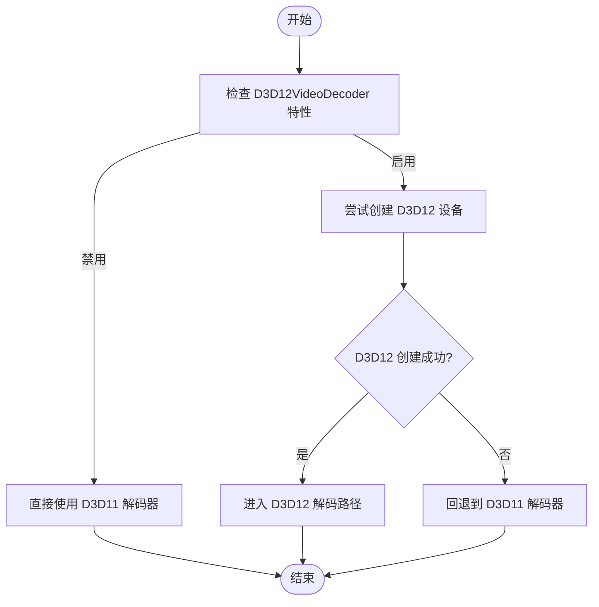
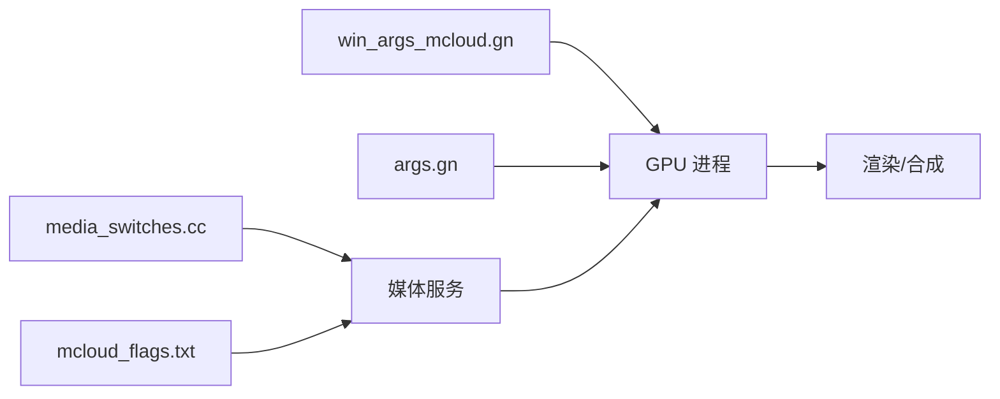

# GPU 加速

本文引用的文件

- [win_args_mcloud.gn](https://github.com/Mcloud136/Mcloud-Browser/blob/main/win_args_mcloud.gn)
- [args.gn](https://github.com/Mcloud136/Mcloud-Browser/blob/main/args.gn)
- [mcloud_flags.txt](https://github.com/Mcloud136/Mcloud-Browser/blob/main/mcloud_flags.txt)
- [media_switches.cc](https://github.com/Mcloud136/Mcloud-Browser/blob/main/src/media/base/media_switches.cc)
- [gpu_pre_sandbox_hook_linux.cc](https://github.com/Mcloud136/Mcloud-Browser/blob/main/src/content/common/gpu_pre_sandbox_hook_linux.cc)
- [BUILD.gn (content:gpu)](https://github.com/Mcloud136/Mcloud-Browser/blob/main/src/content/gpu/BUILD.gn)
- [performance-optimization-design.md](https://github.com/Mcloud136/Mcloud-Browser/blob/main/docs/superpowers/specs/2026-06-19-performance-optimization-design.md)
- [diag_igpu_green_screen.ps1](https://github.com/Mcloud136/Mcloud-Browser/blob/main/benchmark/tools/diag_igpu_green_screen.ps1)
- [DEBUGGING.md](https://github.com/Mcloud136/Mcloud-Browser/blob/main/infra/DEBUG/DEBUGGING.md)

## 目录
1. [简介](#简介)
2. [项目结构](#项目结构)
3. [核心组件](#核心组件)
4. [架构总览](#架构总览)
5. [详细组件分析](#详细组件分析)
6. [依赖关系分析](#依赖关系分析)
7. [性能考量](#性能考量)
8. [故障排查指南](#故障排查指南)
9. [结论](#结论)
10. [附录：配置参数与优化建议](#附录配置参数与优化建议)

## 简介
本文件系统性梳理 MCloud Browser 在 Windows 平台上的 GPU 加速体系，重点覆盖 D3D11/D3D12 硬件解码路径、DXVA2 相关能力、GPU 内存管理与零拷贝渲染技术，以及 GPU 检测与启用流程。同时给出不同 GPU 厂商（NVIDIA、AMD、Intel）的优化策略、性能监控与调试方法，并汇总可操作的配置参数和优化建议。

## 项目结构
MCloud Browser 的 GPU 加速涉及构建期开关、运行时特性标志、媒体子系统与 GPU 进程协作等层面：
- 构建期：通过 GN 参数控制是否启用 Vulkan、HEVC 平台解码、FFmpeg 视频解码器等；Windows 目标禁用 Vulkan，走 D3D12 路径。
- 运行期：通过 mcloud_flags.txt 中的 --enable-features/--disable-features 控制具体功能开关，如 D3D12VideoDecoder、MediaFoundationD3D11VideoCaptureZeroCopy 等。
- 媒体与 GPU：媒体层通过 Media Foundation（Windows）对接系统解码器，GPU 进程负责命令缓冲、资源复用与合成。
- Linux 侧沙箱：为 V4L2/VAAPI 等设备节点授予最小权限，确保硬件解码可用。

图表来源
- [win_args_mcloud.gn:112-114](https://github.com/Mcloud136/Mcloud-Browser/blob/main/win_args_mcloud.gn#L112-L114)
- [media_switches.cc:1364-1391](https://github.com/Mcloud136/Mcloud-Browser/blob/main/src/media/base/media_switches.cc#L1364-L1391)
- [gpu_pre_sandbox_hook_linux.cc:121-149](https://github.com/Mcloud136/Mcloud-Browser/blob/main/src/content/common/gpu_pre_sandbox_hook_linux.cc#L121-L149)

章节来源
- [win_args_mcloud.gn:1-126](https://github.com/Mcloud136/Mcloud-Browser/blob/main/win_args_mcloud.gn#L1-L126)
- [args.gn:1-87](https://github.com/Mcloud136/Mcloud-Browser/blob/main/args.gn#L1-L87)
- [mcloud_flags.txt:1-120](https://github.com/Mcloud136/Mcloud-Browser/blob/main/mcloud_flags.txt#L1-L120)
- [media_switches.cc:742-764](https://github.com/Mcloud136/Mcloud-Browser/blob/main/src/media/base/media_switches.cc#L742-L764)
- [gpu_pre_sandbox_hook_linux.cc:121-149](https://github.com/Mcloud136/Mcloud-Browser/blob/main/src/content/common/gpu_pre_sandbox_hook_linux.cc#L121-L149)

## 核心组件
- 构建期 GPU/媒体开关
  - Windows 禁用 Vulkan，使用 D3D12 作为图形后端。
  - 启用 HEVC 平台解码与可选编码支持，启用 FFmpeg 视频解码器。
- 运行期特性标志
  - 默认关闭 D3D12VideoDecoder（因 Intel 核显早期绿屏问题），回退到 D3D11VideoDecoder。
  - 启用 MediaFoundationD3D11VideoCaptureZeroCopy 实现零拷贝视频捕获。
  - 启用多项 GPU/渲染优化特性（着色器缓存、命令缓冲区解析切片、Skia Graphite 预编译等）。
- 媒体与 GPU 协作
  - 媒体层通过 Media Foundation 调用系统解码器（DXVA2/D3D11/D3D12）。
  - GPU 进程负责命令缓冲、资源池复用与合成。
- Linux 沙箱与设备访问
  - 为 V4L2/VAAPI 解码设备节点授予读写权限，确保硬件解码可用。

章节来源
- [win_args_mcloud.gn:74-114](https://github.com/Mcloud136/Mcloud-Browser/blob/main/win_args_mcloud.gn#L74-L114)
- [mcloud_flags.txt:83-105](https://github.com/Mcloud136/Mcloud-Browser/blob/main/mcloud_flags.txt#L83-L105)
- [media_switches.cc:1364-1391](https://github.com/Mcloud136/Mcloud-Browser/blob/main/src/media/base/media_switches.cc#L1364-L1391)
- [gpu_pre_sandbox_hook_linux.cc:121-149](https://github.com/Mcloud136/Mcloud-Browser/blob/main/src/content/common/gpu_pre_sandbox_hook_linux.cc#L121-L149)

## 架构总览
下图展示从页面播放到 GPU 渲染的关键路径，包括 D3D11/D3D12 解码、零拷贝捕获与 GPU 进程协作。

图表来源
- [performance-optimization-design.md:124-142](https://github.com/Mcloud136/Mcloud-Browser/blob/main/docs/superpowers/specs/2026-06-19-performance-optimization-design.md#L124-L142)
- [mcloud_flags.txt:98-105](https://github.com/Mcloud136/Mcloud-Browser/blob/main/mcloud_flags.txt#L98-L105)

## 详细组件分析

### D3D11/D3D12 硬件解码路径
- 解码器选择与回退
  - 当 D3D12VideoDecoder 特性启用时，优先尝试创建 D3D12 设备；失败则回退到 D3D11。
  - 当前仓库在 Windows 上显式关闭 D3D12VideoDecoder，以规避 Intel 核显早期绿屏问题，稳定回退到 D3D11。
- 支持的编解码器
  - H.264、VP9、AV1、HEVC（取决于平台与驱动支持）。
- 零拷贝捕获
  - 通过 MediaFoundationD3D11VideoCaptureZeroCopy 将捕获帧直接映射到 GPU 纹理，避免 CPU-GPU 数据拷贝。

图表来源
- [performance-optimization-design.md:124-142](https://github.com/Mcloud136/Mcloud-Browser/blob/main/docs/superpowers/specs/2026-06-19-performance-optimization-design.md#L124-L142)
- [mcloud_flags.txt:83-88](https://github.com/Mcloud136/Mcloud-Browser/blob/main/mcloud_flags.txt#L83-L88)

章节来源
- [performance-optimization-design.md:124-142](https://github.com/Mcloud136/Mcloud-Browser/blob/main/docs/superpowers/specs/2026-06-19-performance-optimization-design.md#L124-L142)
- [mcloud_flags.txt:83-105](https://github.com/Mcloud136/Mcloud-Browser/blob/main/mcloud_flags.txt#L83-L105)

### DXVA2 加速与 GPU 内存管理
- DXVA2 角色
  - 在 Windows 上，Media Foundation 通过 DXVA2 调用系统硬件解码器，输出 GPU 可消费的纹理格式（如 NV12/YUV）。
- GPU 内存管理
  - GPU 进程维护命令缓冲与资源池，尽量复用相同大小的资源以减少分配开销。
  - 通过 Skia Graphite 预编译与资源池精确大小复用提升渲染效率。
- 零拷贝渲染
  - 视频捕获与解码路径尽量保持 GPU 内流转，减少 CPU 参与，降低延迟与带宽占用。

章节来源
- [mcloud_flags.txt:90-105](https://github.com/Mcloud136/Mcloud-Browser/blob/main/mcloud_flags.txt#L90-L105)
- [performance-optimization-design.md:111-120](https://github.com/Mcloud136/Mcloud-Browser/blob/main/docs/superpowers/specs/2026-06-19-performance-optimization-design.md#L111-L120)

### GPU 检测与启用流程
- 构建期检测
  - 通过 GN 参数控制 Vulkan/D3D12 后端选择；Windows 目标禁用 Vulkan，使用 D3D12。
- 运行期检测
  - 媒体服务根据平台能力与驱动支持选择解码器（D3D11/D3D12）。
  - 若 D3D12 不可用或触发已知问题，自动回退到 D3D11。
- Linux 沙箱权限
  - 为 V4L2/VAAPI 设备节点授予必要权限，确保硬件解码可用。

章节来源
- [win_args_mcloud.gn:112-114](https://github.com/Mcloud136/Mcloud-Browser/blob/main/win_args_mcloud.gn#L112-L114)
- [media_switches.cc:1364-1391](https://github.com/Mcloud136/Mcloud-Browser/blob/main/src/media/base/media_switches.cc#L1364-L1391)
- [gpu_pre_sandbox_hook_linux.cc:121-149](https://github.com/Mcloud136/Mcloud-Browser/blob/main/src/content/common/gpu_pre_sandbox_hook_linux.cc#L121-L149)

### 不同 GPU 厂商优化策略
- Intel 核显
  - 已知 D3D12 解码器启动前几秒可能出现绿屏/花屏；当前仓库显式关闭 D3D12VideoDecoder，回退到 D3D11 以获得稳定体验。
- NVIDIA 独显
  - D3D12 路径通常正常；可通过启用更多 GPU/渲染优化特性提升性能。
- AMD 显卡
  - 在 Linux 侧需确保 Vulkan/DRM 相关库与设备节点权限正确；Windows 下遵循通用 D3D11/D3D12 路径。

章节来源
- [mcloud_flags.txt:83-88](https://github.com/Mcloud136/Mcloud-Browser/blob/main/mcloud_flags.txt#L83-L88)
- [gpu_pre_sandbox_hook_linux.cc:264-296](https://github.com/Mcloud136/Mcloud-Browser/blob/main/src/content/common/gpu_pre_sandbox_hook_linux.cc#L264-L296)

## 依赖关系分析
- 构建依赖
  - win_args_mcloud.gn 控制 Windows 平台的 GPU 后端与媒体能力。
  - args.gn 提供跨平台基础构建选项（SIMD、FFmpeg、HEVC 等）。
- 运行依赖
  - media_switches.cc 定义媒体相关特性开关（如 OOP 解码、共享图像接口等）。
  - mcloud_flags.txt 集中管理运行时特性标志，影响解码路径与渲染优化。
- GPU 进程依赖
  - content/gpu BUILD.gn 声明 GPU 进程依赖项（viz、media、skia、ui/gl 等）。

图表来源
- [win_args_mcloud.gn:74-114](https://github.com/Mcloud136/Mcloud-Browser/blob/main/win_args_mcloud.gn#L74-L114)
- [args.gn:45-87](https://github.com/Mcloud136/Mcloud-Browser/blob/main/args.gn#L45-L87)
- [media_switches.cc:1364-1391](https://github.com/Mcloud136/Mcloud-Browser/blob/main/src/media/base/media_switches.cc#L1364-L1391)
- [mcloud_flags.txt:90-105](https://github.com/Mcloud136/Mcloud-Browser/blob/main/mcloud_flags.txt#L90-L105)
- [BUILD.gn (content:gpu):43-87](https://github.com/Mcloud136/Mcloud-Browser/blob/main/src/content/gpu/BUILD.gn#L43-L87)

章节来源
- [win_args_mcloud.gn:74-114](https://github.com/Mcloud136/Mcloud-Browser/blob/main/win_args_mcloud.gn#L74-L114)
- [args.gn:45-87](https://github.com/Mcloud136/Mcloud-Browser/blob/main/args.gn#L45-L87)
- [media_switches.cc:1364-1391](https://github.com/Mcloud136/Mcloud-Browser/blob/main/src/media/base/media_switches.cc#L1364-L1391)
- [mcloud_flags.txt:90-105](https://github.com/Mcloud136/Mcloud-Browser/blob/main/mcloud_flags.txt#L90-L105)
- [BUILD.gn (content:gpu):43-87](https://github.com/Mcloud136/Mcloud-Browser/blob/main/src/content/gpu/BUILD.gn#L43-L87)

## 性能考量
- 命令缓冲与资源池
  - 增加命令缓冲区解析切片数量，减少调度开销。
  - 使用精确大小资源复用，降低分配与碎片化。
- 渲染管线预编译
  - Skia Graphite 预编译提升首次绘制与复杂场景稳定性。
- 媒体线程与批量读取
  - 专用媒体服务线程与 MediaFoundation 批量读取减少阻塞与上下文切换。
- 零拷贝路径
  - 视频捕获与解码尽量保持 GPU 内流转，降低延迟与带宽压力。

章节来源
- [mcloud_flags.txt:90-105](https://github.com/Mcloud136/Mcloud-Browser/blob/main/mcloud_flags.txt#L90-L105)
- [performance-optimization-design.md:111-120](https://github.com/Mcloud136/Mcloud-Browser/blob/main/docs/superpowers/specs/2026-06-19-performance-optimization-design.md#L111-L120)

## 故障排查指南
- 核显绿屏/花屏定位
  - 使用 diag_igpu_green_screen.ps1 进行二分定位，分别测试基线、禁用 DComp overlay、禁用 D3D12 解码器、强制软件 overlay 等场景。
  - 观察 chrome://media-internals 的 Video Decoder 与 chrome://gpu 的 Applied Workarounds。
- 多进程调试
  - 使用 rr 对 fork/exec 的多进程进行录制与回放，结合 vmodule 日志定位问题。
- GPU 上下文丢失
  - 通过 about_flags 中的“无 GPU 上下文丢失”开关缓解休眠/屏保导致的黑屏/粉屏问题。

章节来源
- [diag_igpu_green_screen.ps1:1-95](https://github.com/Mcloud136/Mcloud-Browser/blob/main/benchmark/tools/diag_igpu_green_screen.ps1#L1-L95)
- [DEBUGGING.md:281-354](https://github.com/Mcloud136/Mcloud-Browser/blob/main/infra/DEBUG/DEBUGGING.md#L281-L354)
- [mcloud_flag_entries.h:205-210](https://github.com/Mcloud136/Mcloud-Browser/blob/main/src/chrome/browser/mcloud_flag_entries.h#L205-L210)

## 结论
MCloud Browser 在 Windows 平台上采用 D3D11/D3D12 硬件解码路径，并通过 Media Foundation 与 DXVA2 对接系统解码器。当前针对 Intel 核显的 D3D12 不稳定问题，仓库显式关闭该特性以确保稳定性。配合零拷贝捕获、命令缓冲与资源池优化、渲染管线预编译等手段，整体视频播放与渲染性能得到显著提升。针对不同 GPU 厂商，建议按实际驱动与平台能力调整特性开关，并结合诊断工具持续验证。

## 附录：配置参数与优化建议
- 构建期参数（GN）
  - Windows 禁用 Vulkan，使用 D3D12：见 [win_args_mcloud.gn:112-114](https://github.com/Mcloud136/Mcloud-Browser/blob/main/win_args_mcloud.gn#L112-L114)。
  - 启用 HEVC 平台解码与可选编码：见 [win_args_mcloud.gn:99-109](https://github.com/Mcloud136/Mcloud-Browser/blob/main/win_args_mcloud.gn#L99-L109)。
  - 启用 FFmpeg 视频解码器：见 [win_args_mcloud.gn:74-81](https://github.com/Mcloud136/Mcloud-Browser/blob/main/win_args_mcloud.gn#L74-L81)。
- 运行期特性标志
  - 关闭 D3D12VideoDecoder 以规避 Intel 核显绿屏：见 [mcloud_flags.txt:83-88](https://github.com/Mcloud136/Mcloud-Browser/blob/main/mcloud_flags.txt#L83-L88)。
  - 启用 MediaFoundationD3D11VideoCaptureZeroCopy 实现零拷贝捕获：见 [mcloud_flags.txt:98-105](https://github.com/Mcloud136/Mcloud-Browser/blob/main/mcloud_flags.txt#L98-L105)。
  - 启用 GPU/渲染优化特性（着色器缓存、命令缓冲切片、Skia Graphite 等）：见 [mcloud_flags.txt:90-96](https://github.com/Mcloud136/Mcloud-Browser/blob/main/mcloud_flags.txt#L90-L96)。
- 媒体特性开关
  - OOP 解码与共享图像接口：见 [media_switches.cc:1364-1391](https://github.com/Mcloud136/Mcloud-Browser/blob/main/src/media/base/media_switches.cc#L1364-L1391)。
- Linux 沙箱与设备权限
  - 为 V4L2/VAAPI 解码设备节点授予读写权限：见 [gpu_pre_sandbox_hook_linux.cc:121-149](https://github.com/Mcloud136/Mcloud-Browser/blob/main/src/content/common/gpu_pre_sandbox_hook_linux.cc#L121-L149)。
  - 允许 Vulkan/DRM 相关库与设备节点访问：见 [gpu_pre_sandbox_hook_linux.cc:264-296](https://github.com/Mcloud136/Mcloud-Browser/blob/main/src/content/common/gpu_pre_sandbox_hook_linux.cc#L264-L296)。

章节来源
- [win_args_mcloud.gn:74-114](https://github.com/Mcloud136/Mcloud-Browser/blob/main/win_args_mcloud.gn#L74-L114)
- [mcloud_flags.txt:83-105](https://github.com/Mcloud136/Mcloud-Browser/blob/main/mcloud_flags.txt#L83-L105)
- [media_switches.cc:1364-1391](https://github.com/Mcloud136/Mcloud-Browser/blob/main/src/media/base/media_switches.cc#L1364-L1391)
- [gpu_pre_sandbox_hook_linux.cc:121-149](https://github.com/Mcloud136/Mcloud-Browser/blob/main/src/content/common/gpu_pre_sandbox_hook_linux.cc#L121-L149)
- [gpu_pre_sandbox_hook_linux.cc:264-296](https://github.com/Mcloud136/Mcloud-Browser/blob/main/src/content/common/gpu_pre_sandbox_hook_linux.cc#L264-L296)