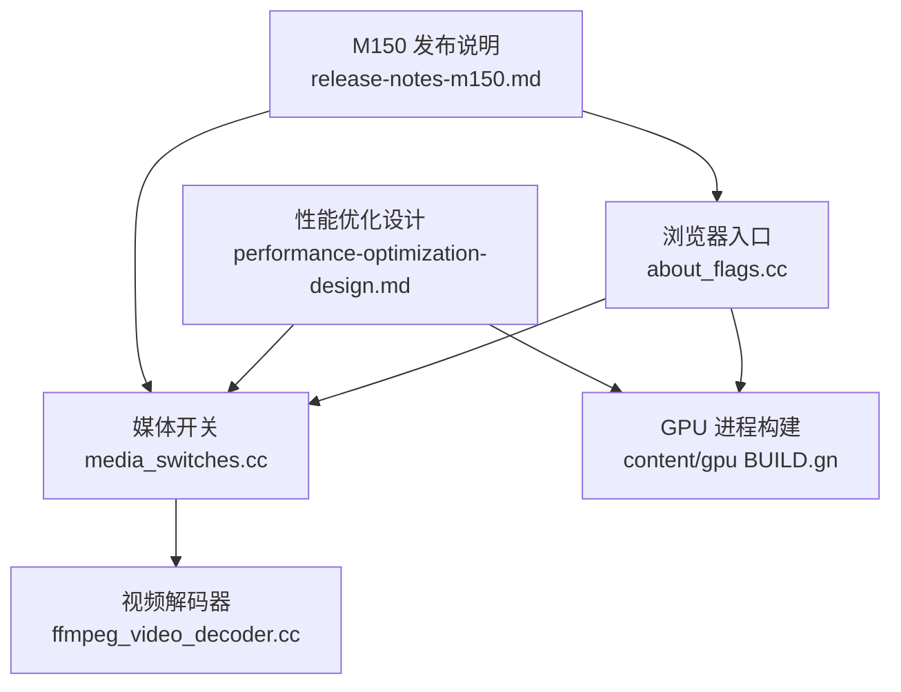
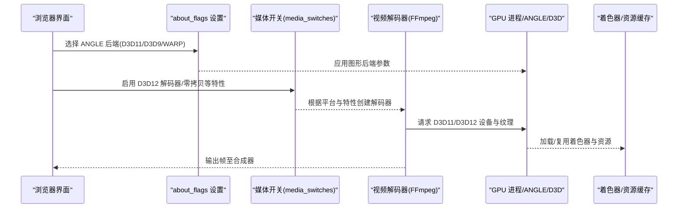
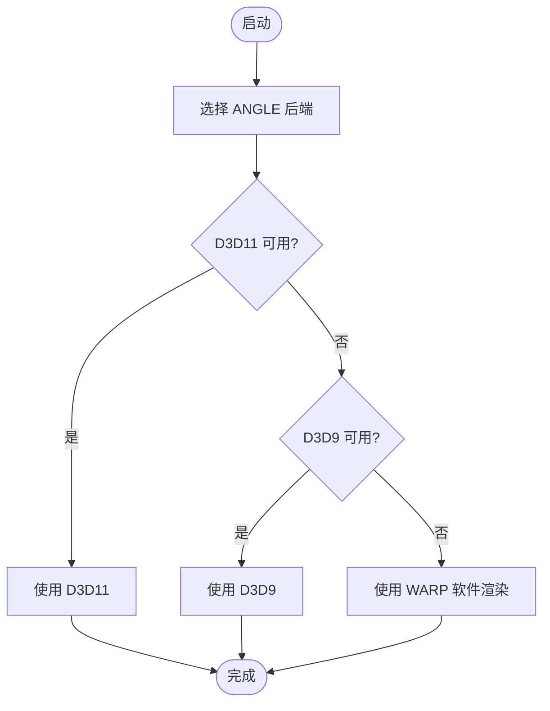
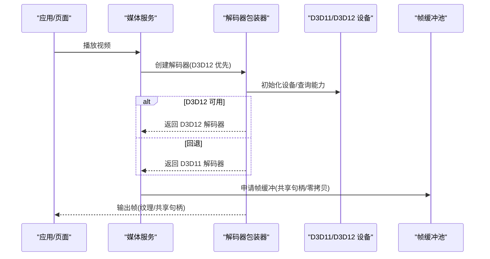
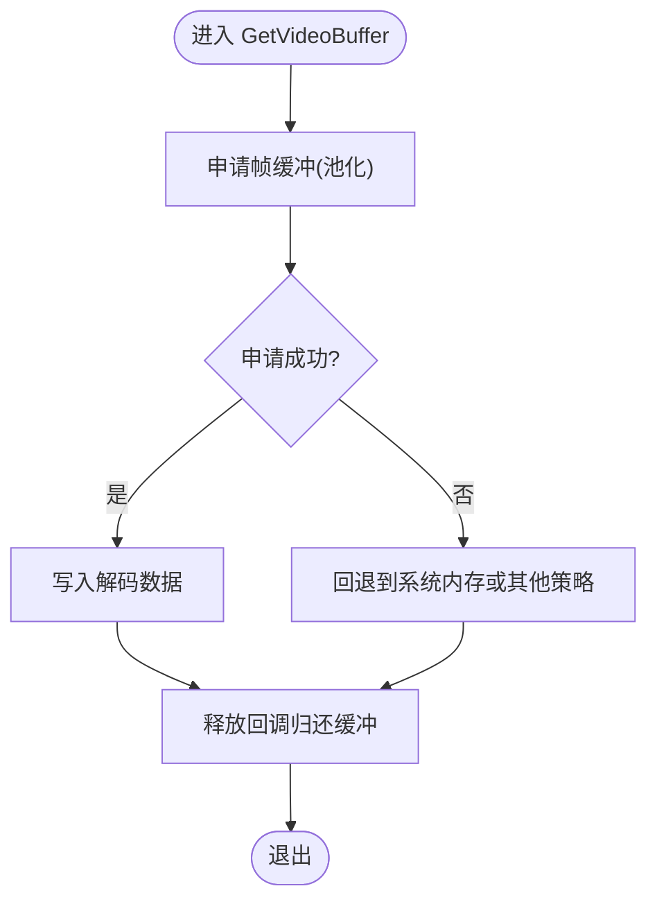
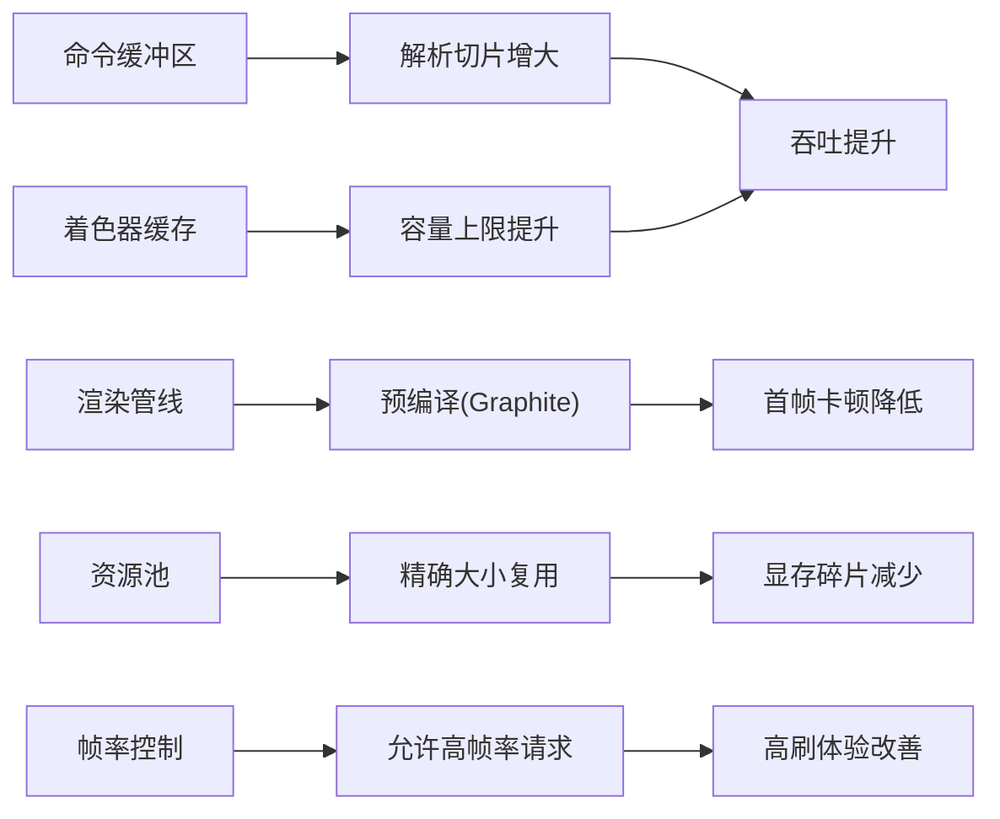
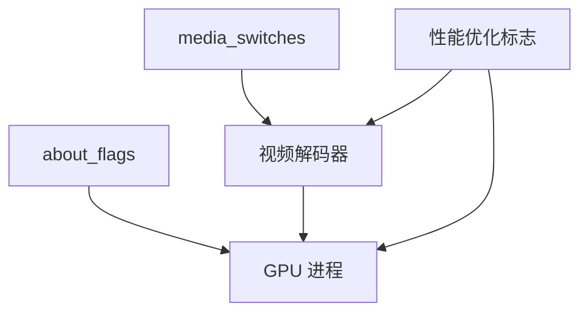

# 图形渲染加速

<cite>
**本文引用的文件**
- [about_flags.cc](file://src/chrome/browser/about_flags.cc)
- [media_switches.cc](file://src/media/base/media_switches.cc)
- [ffmpeg_video_decoder.cc](file://src/media/filters/ffmpeg_video_decoder.cc)
- [2026-06-19-performance-optimization-design.md](file://docs/superpowers/specs/2026-06-19-performance-optimization-design.md)
- [2026-06-20-release-notes-m150.md](file://docs/superpowers/specs/2026-06-20-release-notes-m150.md)
- [BUILD.gn (content/gpu)](file://src/content/gpu/BUILD.gn)
</cite>

## 目录
1. [简介](#简介)
2. [项目结构](#项目结构)
3. [核心组件](#核心组件)
4. [架构总览](#架构总览)
5. [详细组件分析](#详细组件分析)
6. [依赖关系分析](#依赖关系分析)
7. [性能考量](#性能考量)
8. [故障排查指南](#故障排查指南)
9. [结论](#结论)
10. [附录](#附录)

## 简介
本文件面向 MCloud Browser 的图形渲染加速系统，聚焦 Windows 平台上的 D3D11/D3D12 图形 API 使用、GPU 纹理与帧缓冲优化、着色器缓存与管线预编译、以及媒体解码路径中的零拷贝与共享句柄策略。文档同时给出不同显卡驱动的兼容性问题定位思路与调优建议，并提供可操作的监控与质量调优方法。内容基于仓库内现有源码与性能优化设计文档进行梳理与归纳。

## 项目结构
围绕图形渲染与媒体解码的关键位置如下：
- 运行时标志与 ANGLE/D3D 后端选择：浏览器 about:flags 注册处
- 媒体开关与 D3D11/D3D12 特性开关：媒体子系统开关定义
- 视频解码流程与帧缓冲池：FFmpeg 视频解码器集成
- GPU 进程构建与依赖：content/gpu 构建配置
- 性能优化设计与发布说明：超级能力规格与 M150 发布说明

图表来源
- [about_flags.cc:450-466](file://src/chrome/browser/about_flags.cc#L450-L466)
- [media_switches.cc:1649-1674](file://src/media/base/media_switches.cc#L1649-L1674)
- [ffmpeg_video_decoder.cc:101-119](file://src/media/filters/ffmpeg_video_decoder.cc#L101-L119)
- [BUILD.gn (content/gpu):43-87](file://src/content/gpu/BUILD.gn#L43-L87)
- [2026-06-19-performance-optimization-design.md:124-142](file://docs/superpowers/specs/2026-06-19-performance-optimization-design.md#L124-L142)
- [2026-06-20-release-notes-m150.md:120-173](file://docs/superpowers/specs/2026-06-20-release-notes-m150.md#L120-L173)

章节来源
- [about_flags.cc:450-466](file://src/chrome/browser/about_flags.cc#L450-L466)
- [media_switches.cc:1649-1674](file://src/media/base/media_switches.cc#L1649-L1674)
- [ffmpeg_video_decoder.cc:101-119](file://src/media/filters/ffmpeg_video_decoder.cc#L101-L119)
- [BUILD.gn (content/gpu):43-87](file://src/content/gpu/BUILD.gn#L43-L87)
- [2026-06-19-performance-optimization-design.md:124-142](file://docs/superpowers/specs/2026-06-19-performance-optimization-design.md#L124-L142)
- [2026-06-20-release-notes-m150.md:120-173](file://docs/superpowers/specs/2026-06-20-release-notes-m150.md#L120-L173)

## 核心组件
- ANGLE/D3D 后端选择：通过 about:flags 暴露 D3D11/D3D9/WARP 等 ANGLE 实现选项，便于在驱动或硬件不兼容时回退。
- D3D11/D3D12 媒体解码：媒体开关中启用 D3D12 视频解码器（默认开启），并支持 D3D11 捕获零拷贝与共享句柄；当 D3D12 不可用时自动回退到 D3D11。
- 视频帧缓冲池：FFmpeg 解码器通过 FrameBufferPool 管理 GPU 帧缓冲分配与释放，减少重复分配与内存碎片。
- GPU 进程与命令缓冲区：content/gpu 构建包含 viz、Skia、ANGLE 等依赖，配合“增加命令缓冲区解析切片”“更大着色器缓存”“预编译渲染管线”等运行时标志提升吞吐与降低首帧卡顿。

章节来源
- [about_flags.cc:450-466](file://src/chrome/browser/about_flags.cc#L450-L466)
- [media_switches.cc:1649-1674](file://src/media/base/media_switches.cc#L1649-L1674)
- [ffmpeg_video_decoder.cc:101-119](file://src/media/filters/ffmpeg_video_decoder.cc#L101-L119)
- [2026-06-19-performance-optimization-design.md:111-121](file://docs/superpowers/specs/2026-06-19-performance-optimization-design.md#L111-L121)
- [2026-06-20-release-notes-m150.md:167-173](file://docs/superpowers/specs/2026-06-20-release-notes-m150.md#L167-L173)

## 架构总览
下图展示从浏览器启动到 GPU 渲染与媒体解码的关键路径，包括 ANGLE 后端选择、D3D11/D3D12 解码器切换、以及 GPU 进程与命令缓冲区的协同。

图表来源
- [about_flags.cc:450-466](file://src/chrome/browser/about_flags.cc#L450-L466)
- [media_switches.cc:1649-1674](file://src/media/base/media_switches.cc#L1649-L1674)
- [2026-06-19-performance-optimization-design.md:124-142](file://docs/superpowers/specs/2026-06-19-performance-optimization-design.md#L124-L142)
- [2026-06-20-release-notes-m150.md:167-173](file://docs/superpowers/specs/2026-06-20-release-notes-m150.md#L167-L173)

## 详细组件分析

### ANGLE/D3D 后端选择与兼容性
- 功能要点
  - 提供 D3D11、D3D9、WARP 等 ANGLE 实现选项，便于在不同驱动/硬件上快速回退。
  - 在 Windows 平台优先使用 D3D11/D3D12 路径，结合媒体开关启用零拷贝与共享句柄以降低 CPU 占用。
- 兼容性与问题定位
  - 若出现黑屏/崩溃/花屏，优先尝试切换为 D3D9 或 WARP 以验证是否为特定驱动 bug。
  - 结合“命令缓冲区解析切片增大”“着色器缓存限制提高”缓解首次渲染卡顿与上下文切换开销。

图表来源
- [about_flags.cc:450-466](file://src/chrome/browser/about_flags.cc#L450-L466)

章节来源
- [about_flags.cc:450-466](file://src/chrome/browser/about_flags.cc#L450-L466)

### D3D11/D3D12 视频解码与零拷贝
- 功能要点
  - 默认启用 D3D12 视频解码器，失败时回退到 D3D11。
  - 支持 D3D11 视频捕获零拷贝与共享句柄，减少 CPU/GPU 间数据拷贝。
  - 支持的编解码器包括 H.264、VP9、AV1、HEVC。
- 处理流程
  - 媒体服务根据平台与特性开关创建对应解码器包装器。
  - 解码器向 GPU 请求纹理/帧缓冲，并通过共享句柄在进程间传递。

图表来源
- [media_switches.cc:1649-1674](file://src/media/base/media_switches.cc#L1649-L1674)
- [2026-06-19-performance-optimization-design.md:124-142](file://docs/superpowers/specs/2026-06-19-performance-optimization-design.md#L124-L142)

章节来源
- [media_switches.cc:1649-1674](file://src/media/base/media_switches.cc#L1649-L1674)
- [2026-06-19-performance-optimization-design.md:124-142](file://docs/superpowers/specs/2026-06-19-performance-optimization-design.md#L124-L142)

### 帧缓冲池与 GPU 内存分配策略
- 功能要点
  - FFmpeg 视频解码器通过 FrameBufferPool 统一申请与释放 GPU 帧缓冲，避免频繁分配带来的碎片与延迟。
  - 释放回调确保未使用的缓冲及时归还，降低显存压力。
- 复杂度与影响
  - 分配/释放通常为 O(1) 操作，整体解码吞吐受限于 GPU 带宽与驱动效率。
  - 合理池大小可减少抖动，提升高码率视频稳定性。

图表来源
- [ffmpeg_video_decoder.cc:101-119](file://src/media/filters/ffmpeg_video_decoder.cc#L101-L119)

章节来源
- [ffmpeg_video_decoder.cc:101-119](file://src/media/filters/ffmpeg_video_decoder.cc#L101-L119)

### 渲染管线加速与着色器优化
- 关键手段
  - 增大命令缓冲区解析切片，减少上下文切换开销。
  - 扩大着色器缓存限制，降低重复编译概率。
  - 预编译 Skia Graphite 渲染管线，消除首次使用卡顿。
  - 精确大小资源复用，减少 GPU 内存碎片。
  - 允许客户端请求更高帧率，适配高刷显示器。
- 效果
  - 首帧渲染更快、滚动更顺滑、复杂页面绘制更稳定。

图表来源
- [2026-06-20-release-notes-m150.md:167-173](file://docs/superpowers/specs/2026-06-20-release-notes-m150.md#L167-L173)
- [2026-06-19-performance-optimization-design.md:111-121](file://docs/superpowers/specs/2026-06-19-performance-optimization-design.md#L111-L121)

章节来源
- [2026-06-20-release-notes-m150.md:167-173](file://docs/superpowers/specs/2026-06-20-release-notes-m150.md#L167-L173)
- [2026-06-19-performance-optimization-design.md:111-121](file://docs/superpowers/specs/2026-06-19-performance-optimization-design.md#L111-L121)

### GPU 进程与依赖
- content/gpu 构建包含 viz、Skia、ANGLE、IPC 等依赖，支撑 GPU 命令提交、合成与跨进程通信。
- 该模块为上述优化提供底层执行环境，确保命令缓冲、着色器缓存与资源池策略生效。

章节来源
- [BUILD.gn (content/gpu):43-87](file://src/content/gpu/BUILD.gn#L43-L87)

## 依赖关系分析
- 浏览器 about:flags 决定 ANGLE 后端，直接影响 GPU 进程初始化的图形栈。
- 媒体开关控制 D3D11/D3D12 解码路径与零拷贝能力，影响视频解码器的创建与帧缓冲策略。
- FFmpeg 解码器与 GPU 进程通过共享句柄/纹理协作，减少拷贝与延迟。
- 性能优化设计文档中的运行时标志作用于 GPU 进程与合成器，提升整体渲染效率。

图表来源
- [about_flags.cc:450-466](file://src/chrome/browser/about_flags.cc#L450-L466)
- [media_switches.cc:1649-1674](file://src/media/base/media_switches.cc#L1649-L1674)
- [2026-06-19-performance-optimization-design.md:111-121](file://docs/superpowers/specs/2026-06-19-performance-optimization-design.md#L111-L121)

章节来源
- [about_flags.cc:450-466](file://src/chrome/browser/about_flags.cc#L450-L466)
- [media_switches.cc:1649-1674](file://src/media/base/media_switches.cc#L1649-L1674)
- [2026-06-19-performance-optimization-design.md:111-121](file://docs/superpowers/specs/2026-06-19-performance-optimization-design.md#L111-L121)

## 性能考量
- 启动与首帧
  - 提前发送 GPU 通道、延迟推测性渲染帧创建、跳过非关键初始化，可降低首帧耗时。
- 多线程与调度
  - IO 线程类型、Mojo 专用线程、自旋锁与优先级调整有助于降低 IPC 与调度开销。
- 视频与媒体
  - 专用媒体服务线程、批量读取、零拷贝与共享句柄能显著降低 CPU 与带宽压力。
- GPU 渲染
  - 增大命令缓冲区解析切片、扩大着色器缓存、预编译管线、精确资源复用与高帧率支持，综合提升流畅度与稳定性。

章节来源
- [2026-06-20-release-notes-m150.md:120-173](file://docs/superpowers/specs/2026-06-20-release-notes-m150.md#L120-L173)
- [2026-06-19-performance-optimization-design.md:69-121](file://docs/superpowers/specs/2026-06-19-performance-optimization-design.md#L69-L121)

## 故障排查指南
- 图形后端问题
  - 现象：黑屏、花屏、崩溃。
  - 处理：在 about:flags 中切换 ANGLE 后端（D3D11→D3D9→WARP），验证是否为驱动相关缺陷。
- 视频解码异常
  - 现象：无法播放、卡顿、音画不同步。
  - 处理：确认 D3D12 解码器是否启用；如不稳定，强制回退到 D3D11；检查零拷贝与共享句柄开关。
- 首帧卡顿与闪烁
  - 现象：首次打开页面或视频时明显卡顿。
  - 处理：启用“预编译渲染管线”“增大着色器缓存”“增大命令缓冲区解析切片”，观察改善情况。
- 高刷显示器掉帧
  - 现象：高刷新率下帧率受限或掉帧。
  - 处理：启用“允许客户端请求更高帧率”，并结合资源池精确复用减少显存碎片。

章节来源
- [about_flags.cc:450-466](file://src/chrome/browser/about_flags.cc#L450-L466)
- [media_switches.cc:1649-1674](file://src/media/base/media_switches.cc#L1649-L1674)
- [2026-06-20-release-notes-m150.md:167-173](file://docs/superpowers/specs/2026-06-20-release-notes-m150.md#L167-L173)

## 结论
MCloud Browser 在 Windows 平台上通过 ANGLE/D3D11/D3D12 的组合、媒体零拷贝与共享句柄、以及一系列运行时优化标志，构建了高效的图形渲染与媒体解码路径。通过合理的后端选择、帧缓冲池管理与着色器/命令缓冲优化，可在多类驱动与硬件环境下获得稳定的性能与体验。建议在部署前依据目标设备进行特征测试与标志组合验证，以获得最佳平衡。

## 附录
- 常用运行标志参考
  - 启动与首帧：提前发送 GPU 通道、延迟推测性渲染帧创建、跳过非关键初始化。
  - 多线程：IO 线程类型、Mojo 专用线程、自旋锁与优先级调整。
  - 视频/媒体：专用媒体服务线程、批量读取、零拷贝与共享句柄。
  - GPU/渲染：增大命令缓冲区解析切片、扩大着色器缓存、预编译管线、精确资源复用、允许高帧率请求。

章节来源
- [2026-06-20-release-notes-m150.md:120-173](file://docs/superpowers/specs/2026-06-20-release-notes-m150.md#L120-L173)
- [2026-06-19-performance-optimization-design.md:69-121](file://docs/superpowers/specs/2026-06-19-performance-optimization-design.md#L69-L121)