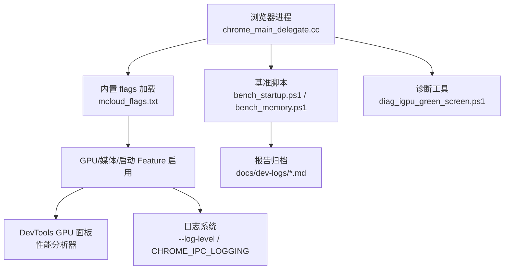
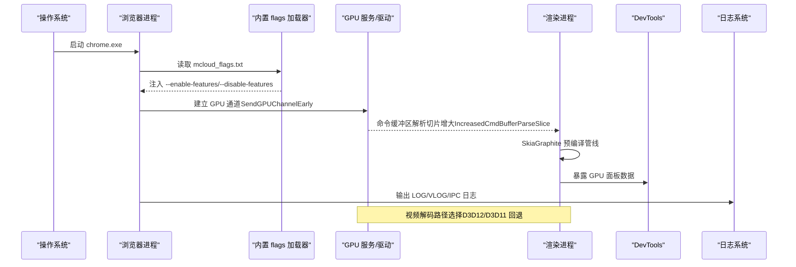
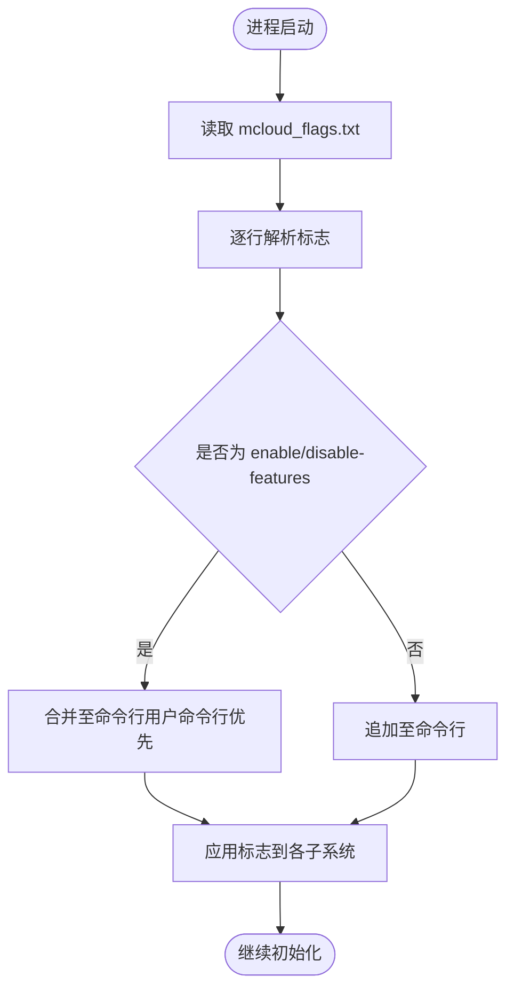
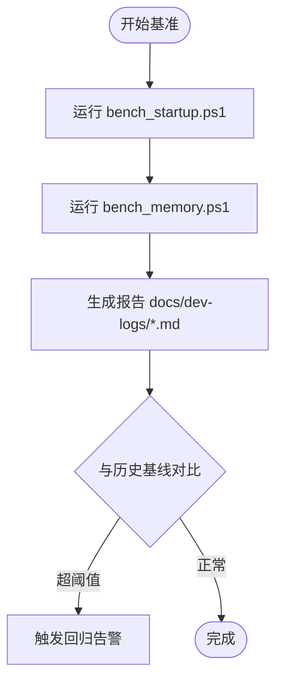
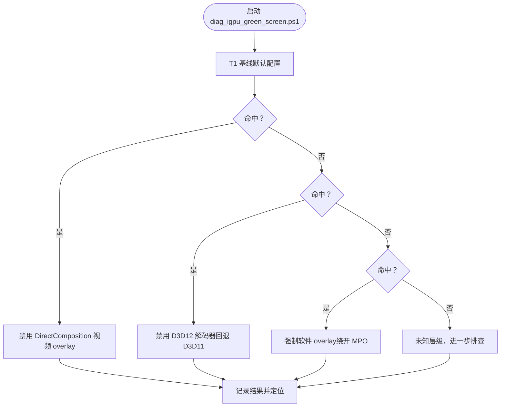
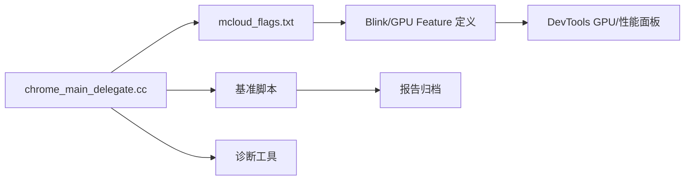

# 性能监控与调试

<cite>
**本文引用的文件**
- [DEBUGGING.md](file://infra/DEBUG/DEBUGGING.md)
- [debug_args.gn](file://infra/DEBUG/debug_args.gn)
- [mcloud_flag_entries.h](file://src/chrome/browser/mcloud_flag_entries.h)
- [mcloud_flag_choices.h](file://src/chrome/browser/mcloud_flag_choices.h)
- [chrome_main_delegate.cc](file://src/chrome/app/chrome_main_delegate.cc)
- [features.cc](file://src/third_party/blink/common/features.cc)
- [bench_startup.ps1](file://benchmark/bench_startup.ps1)
- [bench_memory.ps1](file://benchmark/bench_memory.ps1)
- [diag_igpu_green_screen.ps1](file://benchmark/tools/diag_igpu_green_screen.ps1)
- [check_features.py](file://benchmark/tools/check_features.py)
- [M150-benchmark.md](file://docs/dev-logs/M150-benchmark.md)
- [2026-06-19-performance-optimization-design.md](file://docs/superpowers/specs/2026-06-19-performance-optimization-design.md)
- [2026-06-20-release-notes-m150.md](file://docs/superpowers/specs/2026-06-20-release-notes-m150.md)
- [win_args.list](file://infra/win_args.list)
</cite>

## 目录
1. [简介](#简介)
2. [项目结构](#项目结构)
3. [核心组件](#核心组件)
4. [架构总览](#架构总览)
5. [详细组件分析](#详细组件分析)
6. [依赖关系分析](#依赖关系分析)
7. [性能考量](#性能考量)
8. [故障排查指南](#故障排查指南)
9. [结论](#结论)
10. [附录](#附录)

## 简介
本文件面向 MCloud Browser 的 GPU 性能监控与调试，聚焦以下目标：
- 指标收集：启动阶段 GPU 通道建立、渲染管线预热、视频解码路径选择等关键指标的采集方法。
- 瓶颈分析：基于 DevTools GPU 面板、性能分析器与日志的系统化定位流程。
- 基准测试与回归检测：冷启动、内存峰值、页面加载、滚动与视频解码等场景的基线建立与回归判定。
- 优化技巧与最佳实践：GPU 相关运行时标志、构建参数与平台差异（D3D12/Vulkan/Overlay）调优建议。
- 配置与报告：内置 flags 加载机制、GN 参数、脚本化基准与报告归档。

## 项目结构
围绕 GPU 性能监控与调试，仓库中与本主题直接相关的模块包括：
- 构建与运行期开关：GN 参数、Windows 构建列表、Linux 调试参数、浏览器内置 flags 加载逻辑。
- 基准与诊断工具：冷启动、内存峰值、核显绿屏二分定位、Feature 有效性校验。
- 设计文档与发布说明：GPU/媒体/启动优化策略、预期收益与风险。
- 调试与日志：多进程调试、IPC 日志、Profiling 指引。

图表来源
- [chrome_main_delegate.cc:239-258](file://src/chrome/app/chrome_main_delegate.cc#L239-L258)
- [bench_startup.ps1:1-70](file://benchmark/bench_startup.ps1#L1-L70)
- [bench_memory.ps1:62-77](file://benchmark/bench_memory.ps1#L62-L77)
- [diag_igpu_green_screen.ps1:21-60](file://benchmark/tools/diag_igpu_green_screen.ps1#L21-L60)

章节来源
- [chrome_main_delegate.cc:239-258](file://src/chrome/app/chrome_main_delegate.cc#L239-L258)
- [bench_startup.ps1:1-70](file://benchmark/bench_startup.ps1#L1-L70)
- [bench_memory.ps1:62-77](file://benchmark/bench_memory.ps1#L62-L77)
- [diag_igpu_green_screen.ps1:21-60](file://benchmark/tools/diag_igpu_green_screen.ps1#L21-L60)

## 核心组件
- 内置性能启动标志加载器：在浏览器进程启动时从可执行同目录读取 mcloud_flags.txt，将每行标志合并到当前命令行，支持 enable/disable-features 合并且用户命令行优先级更高。
- GPU/媒体/启动相关 Feature 定义：通过 Blink 与 GPU Finches 暴露的 Feature 控制项，如 SendGPUChannelEarly、IncreasedCmdBufferParseSlice、SkiaGraphitePrecompilation 等。
- 构建期开关：debug_args.gn 中开启 VAAPI、HEVC、WebRTC 等；win_args.list 提供 enable_gpu_client_logging、enable_gpu_service_logging 等开关。
- 基准与诊断：bench_startup.ps1 测量冷启动；bench_memory.ps1 统计内存峰值；diag_igpu_green_screen.ps1 二分定位核显绿屏问题；check_features.py 校验 mcloud_flags.txt 中的 feature 是否仍存在于源码树。
- 设计与规范：性能优化设计文档列出 GPU/媒体/启动优化策略与预期收益；发布说明汇总运行时优化项。

章节来源
- [chrome_main_delegate.cc:239-258](file://src/chrome/app/chrome_main_delegate.cc#L239-L258)
- [2026-06-19-performance-optimization-design.md:65-121](file://docs/superpowers/specs/2026-06-19-performance-optimization-design.md#L65-L121)
- [2026-06-20-release-notes-m150.md:120-173](file://docs/superpowers/specs/2026-06-20-release-notes-m150.md#L120-L173)
- [debug_args.gn:57-71](file://infra/DEBUG/debug_args.gn#L57-L71)
- [win_args.list:1736-1747](file://infra/win_args.list#L1736-L1747)
- [bench_startup.ps1:1-70](file://benchmark/bench_startup.ps1#L1-L70)
- [bench_memory.ps1:62-77](file://benchmark/bench_memory.ps1#L62-L77)
- [diag_igpu_green_screen.ps1:21-60](file://benchmark/tools/diag_igpu_green_screen.ps1#L21-L60)
- [check_features.py:44-110](file://benchmark/tools/check_features.py#L44-L110)

## 架构总览
下图展示从进程启动到 GPU 通道建立、渲染管线预热与视频解码选择的整体流程，以及 DevTools 与日志系统的接入点。

图表来源
- [chrome_main_delegate.cc:239-258](file://src/chrome/app/chrome_main_delegate.cc#L239-L258)
- [2026-06-19-performance-optimization-design.md:65-121](file://docs/superpowers/specs/2026-06-19-performance-optimization-design.md#L65-L121)
- [2026-06-20-release-notes-m150.md:120-173](file://docs/superpowers/specs/2026-06-20-release-notes-m150.md#L120-L173)

## 详细组件分析

### 内置性能启动标志加载器
- 功能：在浏览器进程早期从可执行目录加载 mcloud_flags.txt，逐行解析并合并到当前命令行。对 enable/disable-features 进行合并，用户命令行条目在后且优先级更高。
- 影响：确保无需重编译即可启用 GPU/媒体/启动优化特性，便于快速迭代与回归验证。
- 使用要点：
  - 确保 mcloud_flags.txt 位于可执行文件同目录。
  - 避免重复或冲突的标志；必要时以用户命令行覆盖。
  - 结合 check_features.py 在升级前校验 feature 名称有效性。

图表来源
- [chrome_main_delegate.cc:239-258](file://src/chrome/app/chrome_main_delegate.cc#L239-L258)
- [check_features.py:44-110](file://benchmark/tools/check_features.py#L44-L110)

章节来源
- [chrome_main_delegate.cc:239-258](file://src/chrome/app/chrome_main_delegate.cc#L239-L258)
- [check_features.py:44-110](file://benchmark/tools/check_features.py#L44-L110)

### GPU/媒体/启动优化特征
- 启动速度：SendGPUChannelEarly、DeferSpeculativeRFHCreation、InitialWebUI 相关子项、TransientKeepAlivePolicy。
- 内存优化：DiscardOnCommitLimit、SustainedPMUrgentDiscarding、PartitionAlloc 系列、ReclaimOldPrepaintTiles、PruneOldTransferCacheEntries。
- 多线程：IOThreadInteractiveThreadType、MojoDedicatedThread、BaseLockTrySpin、BoostClosingTabs、UnimportantFramesPriority。
- 视频/媒体：DedicatedMediaServiceThread、DirectOpusAudioDecoding、PauseMutedBackgroundAudio、EncryptedMediaOcclusionTracking、MediaFoundationBatchRead、MediaFoundationD3D11VideoCaptureZeroCopy。
- GPU/渲染：SyncPointGraphValidation、IncreasedCmdBufferParseSlice、AggressiveShaderCacheLimits、SkiaGraphitePrecompilation、ResourcePoolPreferExactSizeReuse、HighFramerateRequestFromClient。

这些特征通过 mcloud_flags.txt 注入并在运行时生效，配合构建期开关（如 VAAPI、HEVC、WebRTC）形成端到端优化组合。

章节来源
- [2026-06-19-performance-optimization-design.md:65-121](file://docs/superpowers/specs/2026-06-19-performance-optimization-design.md#L65-L121)
- [2026-06-20-release-notes-m150.md:120-173](file://docs/superpowers/specs/2026-06-20-release-notes-m150.md#L120-L173)
- [debug_args.gn:57-71](file://infra/DEBUG/debug_args.gn#L57-L71)

### 构建期与运行期开关
- GN 参数（示例）：use_vaapi=true、enable_hevc_parser_and_hw_decoder=true、rtc_use_h264/h265=true、enable_platform_hevc=true。
- Windows 构建列表：enable_gpu_client_logging、enable_gpu_service_logging 用于开启 GPU 客户端/服务端日志，便于定位驱动交互问题。
- Linux 调试参数：debug_args.gn 包含 SIMD、媒体、VAAPI、Widevine 等开关，适合调试与性能分析构建。

章节来源
- [debug_args.gn:57-71](file://infra/DEBUG/debug_args.gn#L57-L71)
- [win_args.list:1736-1747](file://infra/win_args.list#L1736-L1747)

### 基准测试与回归检测
- 冷启动（K1）：bench_startup.ps1 使用全新用户数据目录启动 about:blank，等待主窗口输入空闲作为首屏代理指标，多次运行取中位数。
- 内存峰值（K2）：bench_memory.ps1 打开指定数量标签页驻留一段时间，采样工作集合计算 MB，多次采样取中位数。
- 回归检测：将结果记录到 docs/dev-logs/*.md，对比历史基线；结合 check_features.py 确保 feature 名称未失效。

图表来源
- [bench_startup.ps1:1-70](file://benchmark/bench_startup.ps1#L1-L70)
- [bench_memory.ps1:62-77](file://benchmark/bench_memory.ps1#L62-L77)
- [M150-benchmark.md:1-49](file://docs/dev-logs/M150-benchmark.md#L1-L49)

章节来源
- [bench_startup.ps1:1-70](file://benchmark/bench_startup.ps1#L1-L70)
- [bench_memory.ps1:62-77](file://benchmark/bench_memory.ps1#L62-L77)
- [M150-benchmark.md:1-49](file://docs/dev-logs/M150-benchmark.md#L1-L49)

### 核显绿屏二分定位工具
- 目的：针对“播放视频前几秒绿屏/花屏”的问题，通过四组受控启动配置逐步排除故障层级。
- 原理：绿屏通常由显示管线读到未初始化的 YUV/NV12 内容导致；候选层级包括 DirectComposition 视频 overlay、D3D12 解码器、硬件 overlay 平面（MPO）。
- 用法：选择 T1-T4 或 ALL_INFO，分别禁用/切换相应特性，观察前 5 秒画面变化，记录结果后对照定位。

图表来源
- [diag_igpu_green_screen.ps1:21-60](file://benchmark/tools/diag_igpu_green_screen.ps1#L21-L60)

章节来源
- [diag_igpu_green_screen.ps1:21-60](file://benchmark/tools/diag_igpu_green_screen.ps1#L21-L60)

### DevTools GPU 面板与性能分析器
- GPU 面板：查看 GPU 通道状态、合成层、纹理上传、着色器编译缓存命中率等；结合 IncreasedCmdBufferParseSlice、SkiaGraphitePrecompilation 等标志评估效果。
- 性能分析器：录制时间线，识别长任务、掉帧、JS 阻塞；结合 IOThreadInteractiveThreadType、MojoDedicatedThread 等标志改善响应性。
- 日志辅助：通过 --log-level=0、--enable-logging=stderr、CHROME_IPC_LOGGING=1 获取更详细的 IPC/GPU 调用信息。

章节来源
- [DEBUGGING.md:463-492](file://infra/DEBUG/DEBUGGING.md#L463-L492)
- [2026-06-19-performance-optimization-design.md:65-121](file://docs/superpowers/specs/2026-06-19-performance-optimization-design.md#L65-L121)

### 日志分析方法
- 全量日志：--log-level=0 与 --enable-logging=stderr 输出所有 LOG(foo)。
- IPC 调试：设置 CHROME_IPC_LOGGING=1 或在 GDB 中 set environment CHROME_IPC_LOGGING 1。
- VLOG：新版本可能需要 --v=1 以启用更细粒度日志。
- 多进程调试：rr 录制/回放，配合 render_frame_impl 日志定位导航过程。

章节来源
- [DEBUGGING.md:463-492](file://infra/DEBUG/DEBUGGING.md#L463-L492)
- [DEBUGGING.md:281-307](file://infra/DEBUG/DEBUGGING.md#L281-L307)

## 依赖关系分析
- 浏览器进程依赖内置 flags 加载器注入运行时优化。
- GPU/媒体/启动优化特征依赖 Blink 与 GPU Finches 的定义。
- 基准脚本依赖可执行产物与用户数据目录隔离。
- 诊断工具依赖平台特性（DirectComposition、D3D12/D3D11、Overlay）。

图表来源
- [chrome_main_delegate.cc:239-258](file://src/chrome/app/chrome_main_delegate.cc#L239-L258)
- [features.cc:621-650](file://src/third_party/blink/common/features.cc#L621-L650)
- [bench_startup.ps1:1-70](file://benchmark/bench_startup.ps1#L1-L70)
- [diag_igpu_green_screen.ps1:21-60](file://benchmark/tools/diag_igpu_green_screen.ps1#L21-L60)

章节来源
- [features.cc:621-650](file://src/third_party/blink/common/features.cc#L621-L650)
- [chrome_main_delegate.cc:239-258](file://src/chrome/app/chrome_main_delegate.cc#L239-L258)

## 性能考量
- 启动阶段：提前建立 GPU 通道与预热渲染管线可减少首屏延迟；注意 InitialWebUI 跳过非必要初始化。
- 内存管理：在内存压力下启用丢弃策略与资源回收，避免长期驻留导致的膨胀。
- 多线程与 IPC：专用线程与自旋锁降低竞争；关闭标签页提升优先级改善交互。
- 视频解码：优先使用硬件解码（D3D12/D3D11），失败自动回退；零拷贝捕获减少内存开销。
- 构建优化：SIMD（AVX2/FMA）、ThinLTO、PGO 提升整体效率；谨慎启用 Vulkan 或根据平台选择 D3D12。

[本节为通用指导，不直接分析具体文件]

## 故障排查指南
- 绿屏/花屏：使用 diag_igpu_green_screen.ps1 二分定位，依次禁用 DirectComposition 视频 overlay、D3D12 解码器、强制软件 overlay。
- 启动卡顿：检查 SendGPUChannelEarly、InitialWebUI 相关标志是否生效；通过 DevTools 时间线与日志确认 GPU 通道建立耗时。
- 内存异常：启用 DiscardOnCommitLimit、SustainedPMUrgentDiscarding；使用 bench_memory.ps1 采样并对比基线。
- 日志不足：开启 --log-level=0、CHROME_IPC_LOGGING=1；必要时 rr 录制回放定位时序问题。
- Feature 失效：使用 check_features.py 校验 mcloud_flags.txt 中的 feature 是否存在于源码树，及时清理或替换。

章节来源
- [diag_igpu_green_screen.ps1:21-60](file://benchmark/tools/diag_igpu_green_screen.ps1#L21-L60)
- [DEBUGGING.md:463-492](file://infra/DEBUG/DEBUGGING.md#L463-L492)
- [check_features.py:44-110](file://benchmark/tools/check_features.py#L44-L110)

## 结论
MCloud Browser 通过内置 flags 加载器、丰富的运行时优化特征与完善的基准/诊断工具链，形成了闭环的 GPU 性能监控与调试体系。建议在每次升级或变更时：
- 更新并校验 mcloud_flags.txt 中的 feature 名称。
- 运行基准脚本建立新基线，对比历史数据检测回归。
- 使用 DevTools 与日志定位瓶颈，结合二分定位工具解决平台相关问题。
- 将结果归档至 docs/dev-logs，形成可追溯的性能演进记录。

[本节为总结，不直接分析具体文件]

## 附录
- 常用标志参考：
  - 启动速度：SendGPUChannelEarly、DeferSpeclicativeRFHCreation、InitialWebUI 子项、TransientKeepAlivePolicy。
  - 内存优化：DiscardOnCommitLimit、SustainedPMUrgentDiscarding、PartitionAlloc 系列、ReclaimOldPrepaintTiles、PruneOldTransferCacheEntries。
  - 多线程：IOThreadInteractiveThreadType、MojoDedicatedThread、BaseLockTrySpin、BoostClosingTabs、UnimportantFramesPriority。
  - 视频/媒体：DedicatedMediaServiceThread、DirectOpusAudioDecoding、PauseMutedBackgroundAudio、EncryptedMediaOcclusionTracking、MediaFoundationBatchRead、MediaFoundationD3D11VideoCaptureZeroCopy。
  - GPU/渲染：SyncPointGraphValidation、IncreasedCmdBufferParseSlice、AggressiveShaderCacheLimits、SkiaGraphitePrecompilation、ResourcePoolPreferExactSizeReuse、HighFramerateRequestFromClient。
- 构建参数参考：
  - debug_args.gn：VAAPI、HEVC、WebRTC、Widevine 等开关。
  - win_args.list：enable_gpu_client_logging、enable_gpu_service_logging。

章节来源
- [2026-06-19-performance-optimization-design.md:65-121](file://docs/superpowers/specs/2026-06-19-performance-optimization-design.md#L65-L121)
- [debug_args.gn:57-71](file://infra/DEBUG/debug_args.gn#L57-L71)
- [win_args.list:1736-1747](file://infra/win_args.list#L1736-L1747)