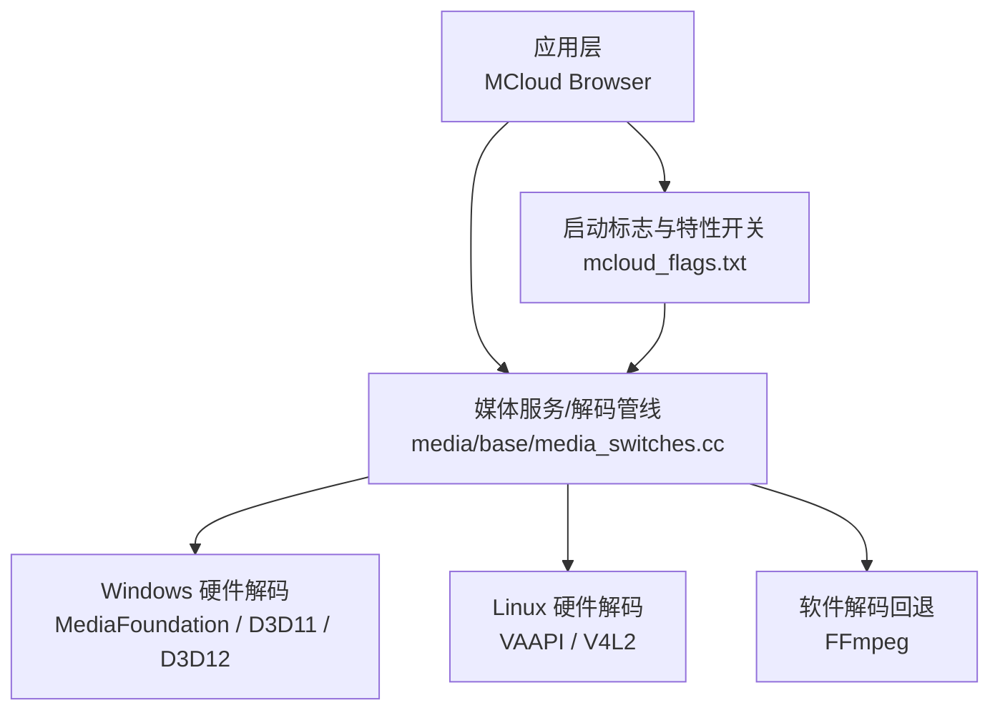
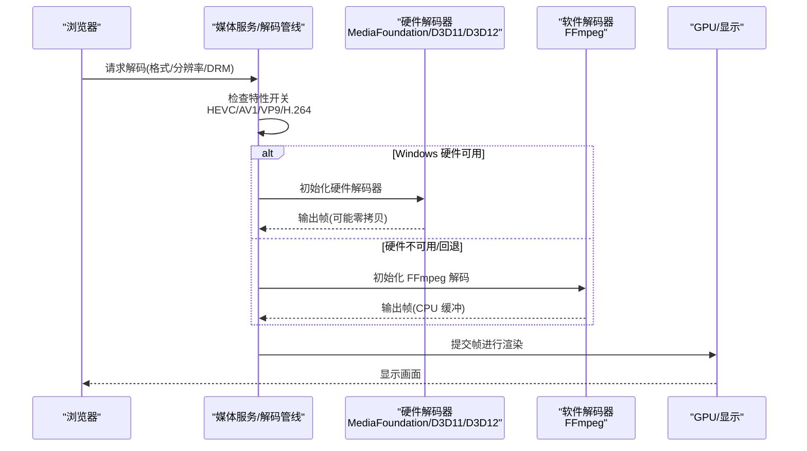
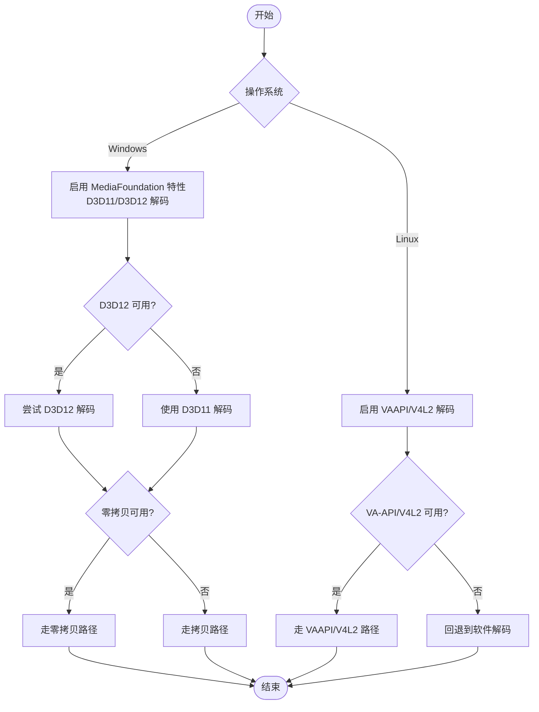
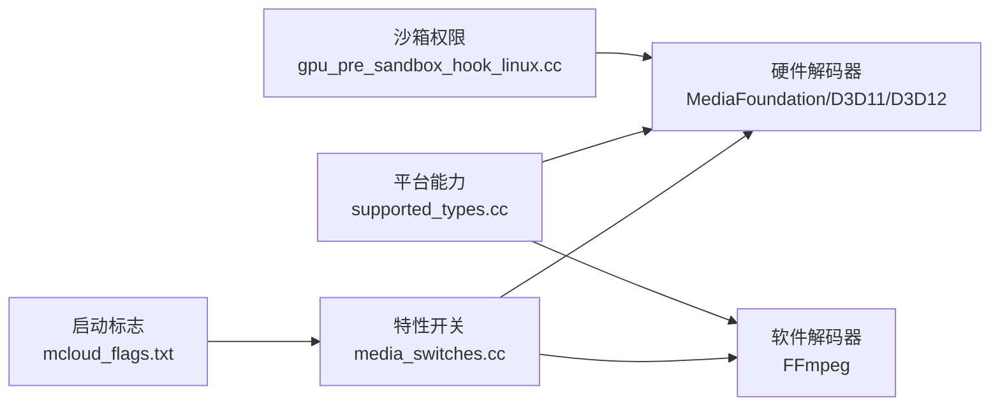

# 视频解码加速

<cite>
**本文引用的文件**
- [mcloud_flags.txt](file://mcloud_flags.txt)
- [media_switches.cc](file://src/media/base/media_switches.cc)
- [ffmpeg_video_decoder.cc](file://src/media/filters/ffmpeg_video_decoder.cc)
- [supported_types.cc](file://src/media/base/supported_types.cc)
- [gpu_pre_sandbox_hook_linux.cc](file://src/content/common/gpu_pre_sandbox_hook_linux.cc)
- [2026-06-19-performance-optimization-design.md](file://docs/superpowers/specs/2026-06-19-performance-optimization-design.md)
- [2026-06-20-release-notes-m150.md](file://docs/superpowers/specs/2026-06-20-release-notes-m150.md)
</cite>

## 目录
1. [简介](#简介)
2. [项目结构](#项目结构)
3. [核心组件](#核心组件)
4. [架构总览](#架构总览)
5. [详细组件分析](#详细组件分析)
6. [依赖关系分析](#依赖关系分析)
7. [性能考量](#性能考量)
8. [故障排除指南](#故障排除指南)
9. [结论](#结论)
10. [附录](#附录)

## 简介
本文件面向 MCloud Browser 的视频解码加速能力，聚焦 Windows 平台上的 DXVA2/D3D11（及 D3D12）硬件解码实现机制，覆盖 HEVC、VP9、AV1、H.264 等主流格式的硬件解码支持策略。文档同时说明不同 GPU 厂商（NVIDIA、AMD、Intel）的解码器选择与优化要点，梳理解码流程中的内存管理、零拷贝技术与性能调优方法，并给出可操作的配置参数、故障排除步骤与性能调优建议。

## 项目结构
围绕视频解码加速的关键代码与配置集中在以下位置：
- 媒体特性开关与平台相关默认值：src/media/base/media_switches.cc
- 启动期性能与媒体优化标志：mcloud_flags.txt
- FFmpeg 软件解码路径（作为回退与补充）：src/media/filters/ffmpeg_video_decoder.cc
- 平台编解码能力与色彩空间支持：src/media/base/supported_types.cc
- Linux 沙箱设备权限（VAAPI/V4L2 硬件解码）：src/content/common/gpu_pre_sandbox_hook_linux.cc
- 性能优化设计与发布说明：docs/superpowers/specs/...

图表来源
- [media_switches.cc:742-777](file://src/media/base/media_switches.cc#L742-L777)
- [media_switches.cc:1649-1674](file://src/media/base/media_switches.cc#L1649-L1674)
- [ffmpeg_video_decoder.cc:227-263](file://src/media/filters/ffmpeg_video_decoder.cc#L227-L263)
- [gpu_pre_sandbox_hook_linux.cc:121-149](file://src/content/common/gpu_pre_sandbox_hook_linux.cc#L121-L149)
- [mcloud_flags.txt:83-105](file://mcloud_flags.txt#L83-L105)

章节来源
- [media_switches.cc:742-777](file://src/media/base/media_switches.cc#L742-L777)
- [media_switches.cc:1649-1674](file://src/media/base/media_switches.cc#L1649-L1674)
- [ffmpeg_video_decoder.cc:227-263](file://src/media/filters/ffmpeg_video_decoder.cc#L227-L263)
- [gpu_pre_sandbox_hook_linux.cc:121-149](file://src/content/common/gpu_pre_sandbox_hook_linux.cc#L121-L149)
- [mcloud_flags.txt:83-105](file://mcloud_flags.txt#L83-L105)

## 核心组件
- 媒体特性开关与平台默认行为：通过 media_switches.cc 集中定义，控制是否启用 VA-API/V4L2（Linux）、D3D11/D3D12（Windows）、HEVC 平台解码、AV1 安全解密、媒体服务线程隔离等。
- 启动期优化标志：mcloud_flags.txt 提供运行时启用的特性开关，包括关闭有问题的 D3D12VideoDecoder、开启 MediaFoundation 批量读取与 D3D11 零拷贝捕获、启用 HEVC 平台解码与 AV1 硬件安全解密等。
- 软件解码回退：当硬件不可用或驱动不兼容时，使用 FFmpeg 进行 H.264/HEVC 软件解码，确保兼容性。
- 平台能力检测：supported_types.cc 对色彩空间、HDR 元数据等进行校验，影响解码输出质量与渲染路径。
- Linux 沙箱设备访问：为 VAAPI/V4L2 硬件解码设备节点授予读写权限，保障硬件解码在沙箱内可用。

章节来源
- [media_switches.cc:742-777](file://src/media/base/media_switches.cc#L742-L777)
- [media_switches.cc:1649-1674](file://src/media/base/media_switches.cc#L1649-L1674)
- [mcloud_flags.txt:83-105](file://mcloud_flags.txt#L83-L105)
- [ffmpeg_video_decoder.cc:227-263](file://src/media/filters/ffmpeg_video_decoder.cc#L227-L263)
- [supported_types.cc:78-177](file://src/media/base/supported_types.cc#L78-L177)
- [gpu_pre_sandbox_hook_linux.cc:121-149](file://src/content/common/gpu_pre_sandbox_hook_linux.cc#L121-L149)

## 架构总览
下图展示了从浏览器到硬件解码器的整体调用链路与关键特性开关的作用点。

图表来源
- [media_switches.cc:1649-1674](file://src/media/base/media_switches.cc#L1649-L1674)
- [ffmpeg_video_decoder.cc:227-263](file://src/media/filters/ffmpeg_video_decoder.cc#L227-L263)
- [mcloud_flags.txt:83-105](file://mcloud_flags.txt#L83-L105)

## 详细组件分析

### Windows 硬件解码（DXVA2/D3D11/D3D12）
- 解码器选择与默认行为
  - Windows 上可通过特性开关启用 D3D12 视频解码；但在当前构建中，出于稳定性考虑已显式禁用 D3D12VideoDecoder，回退至 D3D11VideoDecoder，避免 Intel 核显在某些驱动版本下的绿屏/花屏问题。
  - MediaFoundation 相关特性用于提升读取效率与零拷贝能力（如 MediaFoundationBatchRead、MediaFoundationD3D11VideoCaptureZeroCopy）。
- 支持的编码格式
  - 通过 PlatformHEVCDecoderSupport 启用 HEVC 平台解码，以支持更多网站（如 B 站大会员）的 HEVC 内容。
  - HardwareSecureDecryptionAv1 启用 AV1 硬件安全解密，便于 DRM 内容的硬件解码。
  - VP9/H.264 由平台解码器与 MediaFoundation 栈共同支持，具体可用性取决于驱动与系统能力。
- 零拷贝与内存管理
  - 通过 D3D11 视频捕获零拷贝特性减少 CPU/GPU 间的数据拷贝开销。
  - 减少硬件解码器缓冲区数量（ReduceHardwareVideoDecoderBuffers）以降低内存占用与延迟。

图表来源
- [media_switches.cc:1649-1674](file://src/media/base/media_switches.cc#L1649-L1674)
- [mcloud_flags.txt:83-105](file://mcloud_flags.txt#L83-L105)

章节来源
- [media_switches.cc:1649-1674](file://src/media/base/media_switches.cc#L1649-L1674)
- [mcloud_flags.txt:83-105](file://mcloud_flags.txt#L83-L105)

### Linux 硬件解码（VAAPI/V4L2）
- 特性开关
  - 在 Linux 上通过 kAcceleratedVideoDecodeLinux 启用 VA-API/V4L2 硬件解码；若未编译 USE_VAAPI，则默认关闭。
  - 针对 NVIDIA GPU 的 VA-API 默认关闭以避免崩溃风险（kVaapiOnNvidiaGPUs）。
- 沙箱设备权限
  - 为 V4L2 解码设备节点（video-dec*、media-dec*）授予读写权限，确保沙箱内可访问硬件解码器。
- 零拷贝与图像解码
  - 通过补丁扩展了 MJPEG 加速解码的适用范围，有助于提升截图/预览场景的性能。

章节来源
- [media_switches.cc:742-777](file://src/media/base/media_switches.cc#L742-L777)
- [gpu_pre_sandbox_hook_linux.cc:121-149](file://src/content/common/gpu_pre_sandbox_hook_linux.cc#L121-L149)

### 软件解码回退（FFmpeg）
- 适用场景
  - 当硬件解码不可用、驱动不支持或特性被禁用时，自动回退到 FFmpeg 软件解码，保证基本播放能力。
- 线程与缓冲
  - 根据分辨率动态调整线程数，平衡 CPU 负载与解码吞吐。
  - 使用 FrameBufferPool 管理帧缓冲，降低分配/释放开销。
- 颜色与 HDR
  - 结合 supported_types.cc 的颜色空间与 HDR 元数据处理，确保输出帧的正确性与渲染质量。

章节来源
- [ffmpeg_video_decoder.cc:227-263](file://src/media/filters/ffmpeg_video_decoder.cc#L227-L263)
- [ffmpeg_video_decoder.cc:472-507](file://src/media/filters/ffmpeg_video_decoder.cc#L472-L507)
- [supported_types.cc:78-177](file://src/media/base/supported_types.cc#L78-L177)

### 不同 GPU 厂商的解码器选择与优化策略
- Intel 核显
  - 已知问题：部分驱动版本下 D3D12 视频解码在启动初期可能出现绿屏/花屏。
  - 策略：在当前构建中显式禁用 D3D12VideoDecoder，回退到 D3D11VideoDecoder，保持硬解能力同时规避显示异常。
- NVIDIA 独显
  - Linux 上 VA-API 默认关闭以避免崩溃风险；Windows 上通常通过 MediaFoundation/DXVA2 工作良好。
- AMD 显卡
  - 一般通过 MediaFoundation/DXVA2 获得稳定硬解；如遇特定驱动问题，可借助特性开关与黑名单条目进行调节。

章节来源
- [mcloud_flags.txt:83-88](file://mcloud_flags.txt#L83-L88)
- [media_switches.cc:742-777](file://src/media/base/media_switches.cc#L742-L777)

## 依赖关系分析
- 特性开关依赖
  - mcloud_flags.txt 在启动时注入 --enable-features/--disable-features，直接影响 media_switches.cc 中各 BASE_FEATURE 的行为。
  - 例如：PlatformHEVCDecoderSupport、HardwareSecureDecryptionAv1、MediaFoundationD3D11VideoCaptureZeroCopy 等。
- 平台能力依赖
  - supported_types.cc 对色彩空间与 HDR 的支持决定解码输出的质量与后续渲染路径。
- 沙箱与设备依赖
  - gpu_pre_sandbox_hook_linux.cc 为 VAAPI/V4L2 设备节点授权，确保 Linux 硬件解码在沙箱内可用。

图表来源
- [mcloud_flags.txt:83-105](file://mcloud_flags.txt#L83-L105)
- [media_switches.cc:742-777](file://src/media/base/media_switches.cc#L742-L777)
- [supported_types.cc:78-177](file://src/media/base/supported_types.cc#L78-L177)
- [gpu_pre_sandbox_hook_linux.cc:121-149](file://src/content/common/gpu_pre_sandbox_hook_linux.cc#L121-L149)

章节来源
- [mcloud_flags.txt:83-105](file://mcloud_flags.txt#L83-L105)
- [media_switches.cc:742-777](file://src/media/base/media_switches.cc#L742-L777)
- [supported_types.cc:78-177](file://src/media/base/supported_types.cc#L78-L177)
- [gpu_pre_sandbox_hook_linux.cc:121-149](file://src/content/common/gpu_pre_sandbox_hook_linux.cc#L121-L149)

## 性能考量
- 零拷贝技术
  - 启用 MediaFoundationD3D11VideoCaptureZeroCopy 可减少 CPU/GPU 间数据拷贝，降低延迟与内存带宽压力。
- 缓冲区优化
  - ReduceHardwareVideoDecoderBuffers 在非低延迟场景下减少输出帧池大小，降低内存占用与抖动。
- 媒体服务线程隔离
  - DedicatedMediaServiceThread 将媒体服务放入专用线程，减少与主线程竞争，提升播放流畅度。
- 批量读取
  - MediaFoundationBatchRead 提升 Windows 平台的读取效率，缩短首帧时间。
- 高帧率与渲染预编译
  - HighFramerateRequestFromClient、SkiaGraphitePrecompilation、IncreasedCmdBufferParseSlice 等特性改善渲染与命令处理效率。

章节来源
- [mcloud_flags.txt:90-105](file://mcloud_flags.txt#L90-L105)
- [media_switches.cc:1445-1451](file://src/media/base/media_switches.cc#L1445-L1451)
- [2026-06-19-performance-optimization-design.md:100-126](file://docs/superpowers/specs/2026-06-19-performance-optimization-design.md#L100-L126)
- [2026-06-20-release-notes-m150.md:156-173](file://docs/superpowers/specs/2026-06-20-release-notes-m150.md#L156-L173)

## 故障排除指南
- 现象：Intel 核显播放初期出现绿屏/花屏
  - 原因：D3D12 视频解码在部分驱动版本存在缺陷。
  - 解决：在启动标志中禁用 D3D12VideoDecoder，回退到 D3D11VideoDecoder，保持硬解能力且消除显示异常。
- 现象：Linux 无法使用硬件解码
  - 排查：确认是否启用 USE_VAAPI 与 kAcceleratedVideoDecodeLinux；检查沙箱是否授予 video-dec*/media-dec* 设备节点读写权限。
- 现象：HEVC/AV1 无法播放
  - 排查：确认 PlatformHEVCDecoderSupport 与 HardwareSecureDecryptionAv1 已启用；检查平台能力与色彩空间支持。
- 现象：内存占用过高或卡顿
  - 优化：启用 ReduceHardwareVideoDecoderBuffers、DedicatedMediaServiceThread、MediaFoundationBatchRead；必要时调整线程数与缓冲策略。

章节来源
- [mcloud_flags.txt:83-105](file://mcloud_flags.txt#L83-L105)
- [media_switches.cc:742-777](file://src/media/base/media_switches.cc#L742-L777)
- [gpu_pre_sandbox_hook_linux.cc:121-149](file://src/content/common/gpu_pre_sandbox_hook_linux.cc#L121-L149)

## 结论
MCloud Browser 在 Windows 平台上通过 MediaFoundation 与 D3D11/D3D12 提供稳定的硬件解码能力，并在 Intel 核显场景下采用回退策略以保证稳定性。Linux 平台通过 VA-API/V4L2 与沙箱设备权限实现硬件解码。配合零拷贝、缓冲区优化与媒体服务线程隔离，显著提升播放流畅度与资源利用率。针对不同 GPU 厂商与驱动版本，可通过特性开关灵活调整解码路径与性能表现。

## 附录
- 常用启动标志（节选）
  - --disable-features=D3D12VideoDecoder：禁用有问题的 D3D12 视频解码，回退到 D3D11。
  - --enable-features=PlatformHEVCDecoderSupport：启用 HEVC 平台解码。
  - --enable-features=HardwareSecureDecryptionAv1：启用 AV1 硬件安全解密。
  - --enable-features=MediaFoundationBatchRead：提升 MediaFoundation 读取效率。
  - --enable-features=MediaFoundationD3D11VideoCaptureZeroCopy：启用 D3D11 零拷贝捕获。
  - --enable-features=DedicatedMediaServiceThread：媒体服务专用线程。
  - --enable-features=ReduceHardwareVideoDecoderBuffers：减少硬件解码器缓冲区数量。

章节来源
- [mcloud_flags.txt:83-105](file://mcloud_flags.txt#L83-L105)
- [2026-06-20-release-notes-m150.md:156-173](file://docs/superpowers/specs/2026-06-20-release-notes-m150.md#L156-L173)