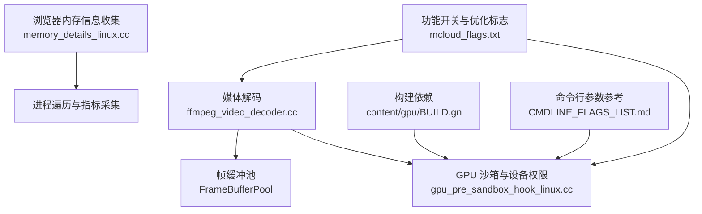
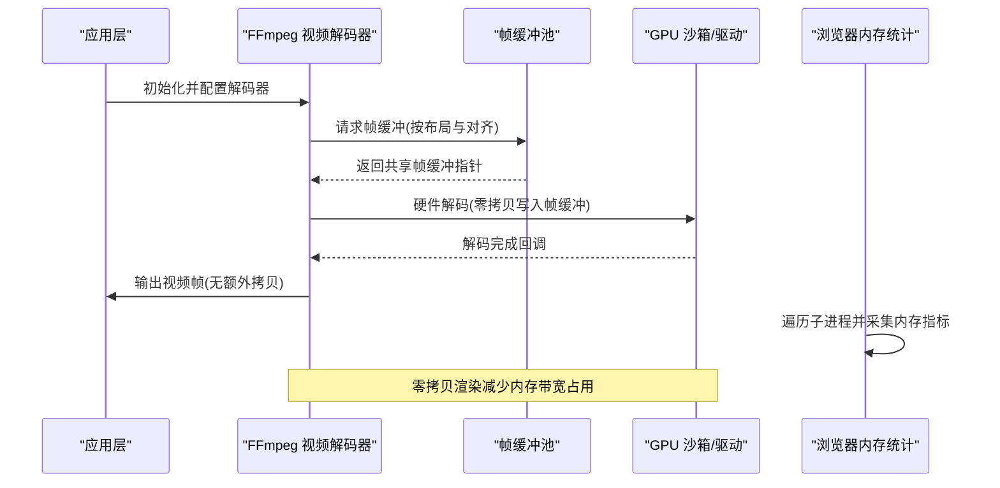
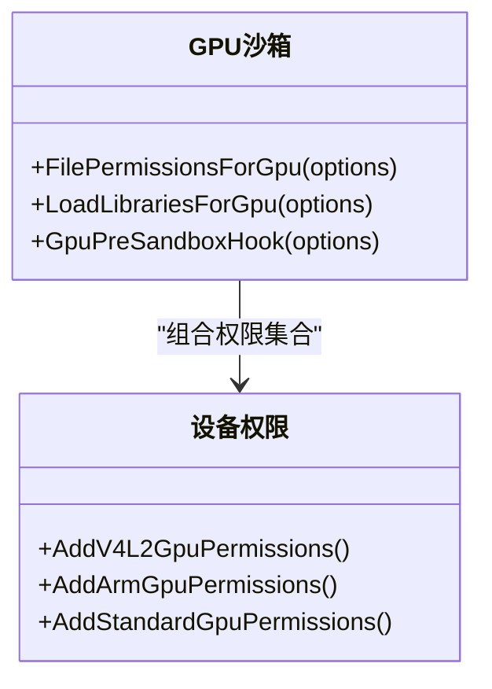
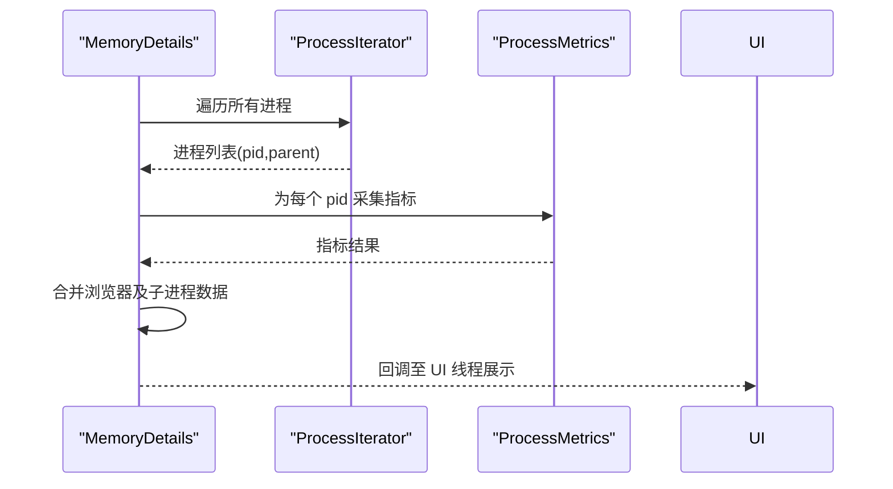
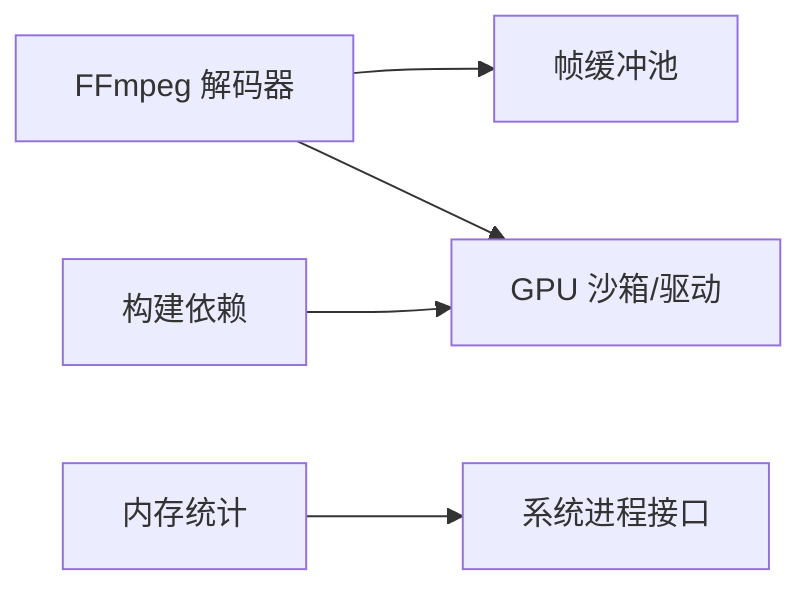

# 内存管理

本文引用的文件

- [mcloud_flags.txt](https://github.com/Mcloud136/Mcloud-Browser/blob/main/mcloud_flags.txt)
- [2026-06-19-performance-optimization-design.md](https://github.com/Mcloud136/Mcloud-Browser/blob/main/docs/superpowers/specs/2026-06-19-performance-optimization-design.md)
- [2026-06-20-release-notes-m150.md](https://github.com/Mcloud136/Mcloud-Browser/blob/main/docs/superpowers/specs/2026-06-20-release-notes-m150.md)
- [memory_details_linux.cc](https://github.com/Mcloud136/Mcloud-Browser/blob/main/src/chrome/browser/memory_details_linux.cc)
- [ffmpeg_video_decoder.cc](https://github.com/Mcloud136/Mcloud-Browser/blob/main/src/media/filters/ffmpeg_video_decoder.cc)
- [gpu_pre_sandbox_hook_linux.cc](https://github.com/Mcloud136/Mcloud-Browser/blob/main/src/content/common/gpu_pre_sandbox_hook_linux.cc)
- [BUILD.gn](https://github.com/Mcloud136/Mcloud-Browser/blob/main/src/content/gpu/BUILD.gn)
- [bench_memory.ps1](https://github.com/Mcloud136/Mcloud-Browser/blob/main/benchmark/bench_memory.ps1)
- [CMDLINE_FLAGS_LIST.md](https://github.com/Mcloud136/Mcloud-Browser/blob/main/docs/CMDLINE_FLAGS_LIST.md)

## 目录
1. [简介](#简介)
2. [项目结构](#项目结构)
3. [核心组件](#核心组件)
4. [架构总览](#架构总览)
5. [详细组件分析](#详细组件分析)
6. [依赖关系分析](#依赖关系分析)
7. [性能考量](#性能考量)
8. [故障排查指南](#故障排查指南)
9. [结论](#结论)
10. [附录](#附录)

## 简介
本文件聚焦 MCloud Browser 的硬件加速与内存管理，围绕以下目标展开：GPU 内存分配策略、零拷贝渲染技术、内存池管理机制、显存使用优化、内存泄漏防护与垃圾回收机制、内存使用监控与性能分析工具使用方法，以及内存优化最佳实践和问题诊断指南。内容基于仓库中的源码与文档进行梳理，确保可追溯与可验证。

## 项目结构
与内存和 GPU 相关的代码主要分布在以下位置：
- 媒体解码与帧缓冲池：media/filters/ffmpeg_video_decoder.cc
- Linux GPU 沙箱与设备权限：content/common/gpu_pre_sandbox_hook_linux.cc
- 浏览器进程内存信息收集：chrome/browser/memory_details_linux.cc
- 构建与依赖：content/gpu/BUILD.gn
- 功能开关与优化标志：mcloud_flags.txt、docs/superpowers/specs/...（设计说明与发布说明）
- 命令行参数参考：docs/CMDLINE_FLAGS_LIST.md
- 基准测试脚本：benchmark/bench_memory.ps1

图表来源
- [ffmpeg_video_decoder.cc:131-220](https://github.com/Mcloud136/Mcloud-Browser/blob/main/src/media/filters/ffmpeg_video_decoder.cc#L131-L220)
- [gpu_pre_sandbox_hook_linux.cc:118-192](https://github.com/Mcloud136/Mcloud-Browser/blob/main/src/content/common/gpu_pre_sandbox_hook_linux.cc#L118-L192)
- [memory_details_linux.cc:110-146](https://github.com/Mcloud136/Mcloud-Browser/blob/main/src/chrome/browser/memory_details_linux.cc#L110-L146)
- [mcloud_flags.txt:27-38](https://github.com/Mcloud136/Mcloud-Browser/blob/main/mcloud_flags.txt#L27-L38)
- [BUILD.gn:48-84](https://github.com/Mcloud136/Mcloud-Browser/blob/main/src/content/gpu/BUILD.gn#L48-L84)
- [CMDLINE_FLAGS_LIST.md:1616-1646](https://github.com/Mcloud136/Mcloud-Browser/blob/main/docs/CMDLINE_FLAGS_LIST.md#L1616-L1646)

章节来源
- [mcloud_flags.txt:27-38](https://github.com/Mcloud136/Mcloud-Browser/blob/main/mcloud_flags.txt#L27-L38)
- [2026-06-19-performance-optimization-design.md:78-88](https://github.com/Mcloud136/Mcloud-Browser/blob/main/docs/superpowers/specs/2026-06-19-performance-optimization-design.md#L78-L88)
- [2026-06-20-release-notes-m150.md:156-173](https://github.com/Mcloud136/Mcloud-Browser/blob/main/docs/superpowers/specs/2026-06-20-release-notes-m150.md#L156-L173)
- [ffmpeg_video_decoder.cc:131-220](https://github.com/Mcloud136/Mcloud-Browser/blob/main/src/media/filters/ffmpeg_video_decoder.cc#L131-L220)
- [gpu_pre_sandbox_hook_linux.cc:118-192](https://github.com/Mcloud136/Mcloud-Browser/blob/main/src/content/common/gpu_pre_sandbox_hook_linux.cc#L118-L192)
- [memory_details_linux.cc:110-146](https://github.com/Mcloud136/Mcloud-Browser/blob/main/src/chrome/browser/memory_details_linux.cc#L110-L146)
- [BUILD.gn:48-84](https://github.com/Mcloud136/Mcloud-Browser/blob/main/src/content/gpu/BUILD.gn#L48-L84)
- [CMDLINE_FLAGS_LIST.md:1616-1646](https://github.com/Mcloud136/Mcloud-Browser/blob/main/docs/CMDLINE_FLAGS_LIST.md#L1616-L1646)

## 核心组件
- 视频解码与零拷贝帧缓冲：通过 FFmpeg 视频解码器将解码输出直接写入由 FrameBufferPool 提供的共享帧缓冲，避免 CPU/GPU 之间的额外拷贝。
- GPU 沙箱与设备访问控制：在 Linux 上为 GPU 进程配置最小化的设备节点与库加载权限，确保硬件加速安全可用。
- 内存信息收集：在浏览器进程中扫描子进程并采集内存指标，用于 about:memory 等界面展示与诊断。
- 功能开关与优化标志：通过 mcloud_flags.txt 启用一系列内存与 GPU 优化特性，如标签页丢弃、预绘制瓦片回收、传输缓存清理、命令缓冲区切片增大、着色器预编译等。

章节来源
- [ffmpeg_video_decoder.cc:131-220](https://github.com/Mcloud136/Mcloud-Browser/blob/main/src/media/filters/ffmpeg_video_decoder.cc#L131-L220)
- [gpu_pre_sandbox_hook_linux.cc:118-192](https://github.com/Mcloud136/Mcloud-Browser/blob/main/src/content/common/gpu_pre_sandbox_hook_linux.cc#L118-L192)
- [memory_details_linux.cc:110-146](https://github.com/Mcloud136/Mcloud-Browser/blob/main/src/chrome/browser/memory_details_linux.cc#L110-L146)
- [mcloud_flags.txt:27-38](https://github.com/Mcloud136/Mcloud-Browser/blob/main/mcloud_flags.txt#L27-L38)
- [2026-06-20-release-notes-m150.md:156-173](https://github.com/Mcloud136/Mcloud-Browser/blob/main/docs/superpowers/specs/2026-06-20-release-notes-m150.md#L156-L173)

## 架构总览
MCloud Browser 的硬件加速与内存管理涉及“媒体解码—帧缓冲池—GPU 沙箱—浏览器内存统计”的协作链路。媒体解码器从 FrameBufferPool 获取对齐且满足 FFmpeg 布局要求的帧缓冲，解码完成后通过回调输出到上层；GPU 沙箱在启动时按需开放设备节点与库路径，保证硬件解码与渲染的安全执行；浏览器侧持续收集进程内存信息，结合功能开关实现压力下的资源回收与优化。

图表来源
- [ffmpeg_video_decoder.cc:131-220](https://github.com/Mcloud136/Mcloud-Browser/blob/main/src/media/filters/ffmpeg_video_decoder.cc#L131-L220)
- [gpu_pre_sandbox_hook_linux.cc:118-192](https://github.com/Mcloud136/Mcloud-Browser/blob/main/src/content/common/gpu_pre_sandbox_hook_linux.cc#L118-L192)
- [memory_details_linux.cc:110-146](https://github.com/Mcloud136/Mcloud-Browser/blob/main/src/chrome/browser/memory_details_linux.cc#L110-L146)

## 详细组件分析

### 视频解码与零拷贝帧缓冲
- 关键流程：解码器根据 AVFrame 的格式与尺寸计算 VideoFrameLayout，向 FrameBufferPool 申请对齐的连续内存，并将 AVFrame 的各平面数据指针指向该缓冲；解码完成后释放回调将缓冲归还给池。
- 零拷贝优势：避免在 CPU 与 GPU 之间复制像素数据，降低延迟与带宽消耗，提升播放流畅度。
- 线程与资源：根据分辨率动态调整解码线程数，合理分配 CPU 资源；解码器生命周期内维护 FrameBufferPool，确保缓冲复用与及时释放。

图表来源
- [ffmpeg_video_decoder.cc:131-220](https://github.com/Mcloud136/Mcloud-Browser/blob/main/src/media/filters/ffmpeg_video_decoder.cc#L131-L220)

章节来源
- [ffmpeg_video_decoder.cc:131-220](https://github.com/Mcloud136/Mcloud-Browser/blob/main/src/media/filters/ffmpeg_video_decoder.cc#L131-L220)

### GPU 沙箱与设备权限（Linux）
- 设备节点授权：根据是否启用硬件解码/编码，授予 /dev/video-dec*、/dev/media-dec*、/dev/jpeg-* 等节点读写权限；ARM 平台额外允许 Mali/Tegra 相关设备与库。
- 库预加载：在 GPU 进程启动前预加载 Vulkan、Mesa、NVIDIA、AMD 等驱动库，确保图形栈快速就绪。
- 安全边界：仅开放必要路径与只读/读写权限，遵循最小权限原则，降低攻击面。

图表来源
- [gpu_pre_sandbox_hook_linux.cc:118-192](https://github.com/Mcloud136/Mcloud-Browser/blob/main/src/content/common/gpu_pre_sandbox_hook_linux.cc#L118-L192)
- [gpu_pre_sandbox_hook_linux.cc:460-496](https://github.com/Mcloud136/Mcloud-Browser/blob/main/src/content/common/gpu_pre_sandbox_hook_linux.cc#L460-L496)
- [gpu_pre_sandbox_hook_linux.cc:628-702](https://github.com/Mcloud136/Mcloud-Browser/blob/main/src/content/common/gpu_pre_sandbox_hook_linux.cc#L628-L702)

章节来源
- [gpu_pre_sandbox_hook_linux.cc:118-192](https://github.com/Mcloud136/Mcloud-Browser/blob/main/src/content/common/gpu_pre_sandbox_hook_linux.cc#L118-L192)
- [gpu_pre_sandbox_hook_linux.cc:460-496](https://github.com/Mcloud136/Mcloud-Browser/blob/main/src/content/common/gpu_pre_sandbox_hook_linux.cc#L460-L496)
- [gpu_pre_sandbox_hook_linux.cc:628-702](https://github.com/Mcloud136/Mcloud-Browser/blob/main/src/content/common/gpu_pre_sandbox_hook_linux.cc#L628-L702)

### 浏览器内存信息收集
- 进程遍历：通过 ProcessIterator 枚举系统进程，构建父子关系映射，筛选当前浏览器及其子进程。
- 指标采集：对每个进程采集打开文件描述符数量、软限制等信息，并在 UI 线程汇总后回调。
- 用途：支撑 about:memory 等诊断界面，帮助定位内存异常与泄漏。

图表来源
- [memory_details_linux.cc:40-77](https://github.com/Mcloud136/Mcloud-Browser/blob/main/src/chrome/browser/memory_details_linux.cc#L40-L77)
- [memory_details_linux.cc:110-146](https://github.com/Mcloud136/Mcloud-Browser/blob/main/src/chrome/browser/memory_details_linux.cc#L110-L146)

章节来源
- [memory_details_linux.cc:40-77](https://github.com/Mcloud136/Mcloud-Browser/blob/main/src/chrome/browser/memory_details_linux.cc#L40-L77)
- [memory_details_linux.cc:110-146](https://github.com/Mcloud136/Mcloud-Browser/blob/main/src/chrome/browser/memory_details_linux.cc#L110-L146)

### 功能开关与优化标志
- 内存优化：启用 InfiniteTabsFreezing、PartitionAllocMemoryReclaimer、DiscardOnCommitLimit、SustainedPMUrgentDiscarding、ReclaimOldPrepaintTiles、PruneOldTransferCacheEntries 等，以在内存压力下主动回收与冻结资源。
- GPU/渲染优化：IncreasedCmdBufferParseSlice、SkiaGraphitePrecompilation、ResourcePoolPreferExactSizeReuse、HighFramerateRequestFromClient 等，提升命令处理效率与显存利用率。
- 媒体优化：DedicatedMediaServiceThread、DirectOpusAudioDecoding、EncryptedMediaOcclusionTracking、MediaFoundationBatchRead、MediaFoundationD3D11VideoCaptureZeroCopy 等，改善视频播放与捕获效率。

章节来源
- [mcloud_flags.txt:27-38](https://github.com/Mcloud136/Mcloud-Browser/blob/main/mcloud_flags.txt#L27-L38)
- [mcloud_flags.txt:83-119](https://github.com/Mcloud136/Mcloud-Browser/blob/main/mcloud_flags.txt#L83-L119)
- [2026-06-19-performance-optimization-design.md:78-120](https://github.com/Mcloud136/Mcloud-Browser/blob/main/docs/superpowers/specs/2026-06-19-performance-optimization-design.md#L78-L120)
- [2026-06-20-release-notes-m150.md:156-173](https://github.com/Mcloud136/Mcloud-Browser/blob/main/docs/superpowers/specs/2026-06-20-release-notes-m150.md#L156-L173)

## 依赖关系分析
- 媒体解码依赖 FrameBufferPool 提供零拷贝缓冲，并通过回调机制管理生命周期。
- GPU 沙箱依赖系统设备节点与驱动库，依据平台与选项动态装配权限与预加载库。
- 浏览器内存统计依赖 base::ProcessIterator 与 base::ProcessMetrics，跨线程回传结果。
- 构建依赖 content/gpu/BUILD.gn 中声明了 GPU 进程所需模块与服务，确保编译期链接正确。

图表来源
- [ffmpeg_video_decoder.cc:131-220](https://github.com/Mcloud136/Mcloud-Browser/blob/main/src/media/filters/ffmpeg_video_decoder.cc#L131-L220)
- [gpu_pre_sandbox_hook_linux.cc:628-702](https://github.com/Mcloud136/Mcloud-Browser/blob/main/src/content/common/gpu_pre_sandbox_hook_linux.cc#L628-L702)
- [memory_details_linux.cc:110-146](https://github.com/Mcloud136/Mcloud-Browser/blob/main/src/chrome/browser/memory_details_linux.cc#L110-L146)
- [BUILD.gn:48-84](https://github.com/Mcloud136/Mcloud-Browser/blob/main/src/content/gpu/BUILD.gn#L48-L84)

章节来源
- [BUILD.gn:48-84](https://github.com/Mcloud136/Mcloud-Browser/blob/main/src/content/gpu/BUILD.gn#L48-L84)

## 性能考量
- 零拷贝渲染：通过 FrameBufferPool 与 AVFrame 平面绑定，减少 CPU/GPU 间拷贝，降低延迟与带宽占用。
- 显存碎片化控制：ResourcePoolPreferExactSizeReuse 优先复用精确大小资源，降低显存碎片。
- 命令缓冲区优化：IncreasedCmdBufferParseSlice 增大解析切片，减少上下文切换开销。
- 着色器预编译：SkiaGraphitePrecompilation 消除首次使用卡顿，提升渲染稳定性。
- 内存压力回收：DiscardOnCommitLimit、SustainedPMUrgentDiscarding、ReclaimOldPrepaintTiles、PruneOldTransferCacheEntries 在压力场景下积极回收，防止 OOM。
- 多线程与优先级：IO 线程交互类型、Mojo 专用线程、非重要框架降优先级，提升响应性与资源分配公平性。

章节来源
- [2026-06-20-release-notes-m150.md:156-173](https://github.com/Mcloud136/Mcloud-Browser/blob/main/docs/superpowers/specs/2026-06-20-release-notes-m150.md#L156-L173)
- [2026-06-19-performance-optimization-design.md:78-120](https://github.com/Mcloud136/Mcloud-Browser/blob/main/docs/superpowers/specs/2026-06-19-performance-optimization-design.md#L78-L120)
- [mcloud_flags.txt:27-38](https://github.com/Mcloud136/Mcloud-Browser/blob/main/mcloud_flags.txt#L27-L38)

## 故障排查指南
- 内存峰值与驻留测量：使用 benchmark/bench_memory.ps1 在多标签真实站点场景下采样工作集大小，记录中位数与原始数据，便于对比不同配置的内存占用。
- 关于内存与 GPU 的命令行参数：参考 docs/CMDLINE_FLAGS_LIST.md 中与 --gpu-* 相关的参数，例如 --gpu-sandbox-start-early、--gpu-program-cache-size-kb 等，用于调整 GPU 行为与调试。
- 常见症状与定位：
  - 绿屏/花屏：若启用 D3D12VideoDecoder 出现首帧异常，可在 mcloud_flags.txt 中禁用该特性回退至 D3D11VideoDecoder。
  - 解码卡顿：检查 IncreasedCmdBufferParseSlice 与 SkiaGraphitePrecompilation 是否启用，必要时调整或关闭以定位问题。
  - 内存泄漏：通过 memory_details_linux.cc 收集的进程指标观察子进程 FD 与内存变化，结合 about:memory 定位异常增长。

章节来源
- [bench_memory.ps1:62-77](https://github.com/Mcloud136/Mcloud-Browser/blob/main/benchmark/bench_memory.ps1#L62-L77)
- [CMDLINE_FLAGS_LIST.md:1616-1646](https://github.com/Mcloud136/Mcloud-Browser/blob/main/docs/CMDLINE_FLAGS_LIST.md#L1616-L1646)
- [mcloud_flags.txt:83-88](https://github.com/Mcloud136/Mcloud-Browser/blob/main/mcloud_flags.txt#L83-L88)

## 结论
MCloud Browser 在硬件加速与内存管理方面采用了零拷贝帧缓冲、精细的 GPU 沙箱权限控制、积极的内存压力回收策略与多项渲染优化标志。这些措施共同降低了内存占用与显存碎片，提升了多标签页与视频播放的性能与稳定性。配合基准测试与命令行参数，开发者可以系统化地调优与诊断内存相关问题。

## 附录
- 建议实践：
  - 在生产环境启用 DiscardOnCommitLimit、SustainedPMUrgentDiscarding、ReclaimOldPrepaintTiles、PruneOldTransferCacheEntries 等内存优化特性。
  - 针对 GPU 渲染，启用 IncreasedCmdBufferParseSlice、SkiaGraphitePrecompilation、ResourcePoolPreferExactSizeReuse、HighFramerateRequestFromClient。
  - 媒体方面启用 DedicatedMediaServiceThread、DirectOpusAudioDecoding、EncryptedMediaOcclusionTracking、MediaFoundationBatchRead、MediaFoundationD3D11VideoCaptureZeroCopy。
  - 若遇到特定 GPU 驱动问题（如 D3D12 首帧异常），可按需禁用对应特性并回退稳定方案。
- 监控与分析：
  - 使用 bench_memory.ps1 进行内存驻留采样，记录环境与配置差异。
  - 利用 memory_details_linux.cc 的进程指标与 about:memory 界面进行问题定位。
  - 参考 CMDLINE_FLAGS_LIST.md 中的 --gpu-* 参数进行细粒度调整。