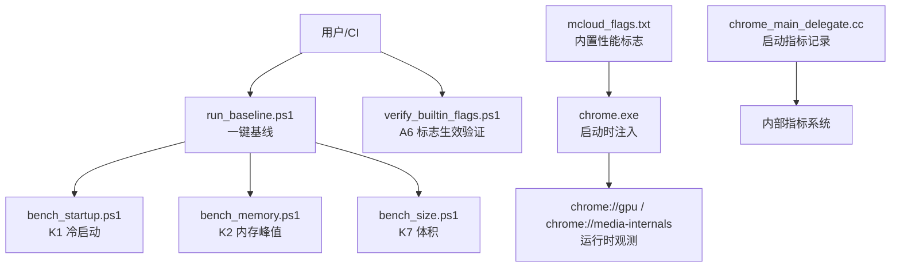
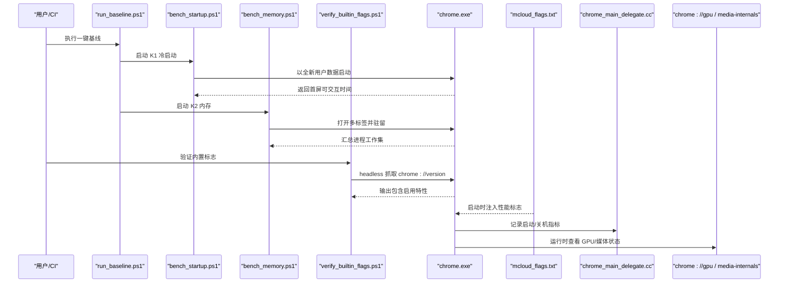
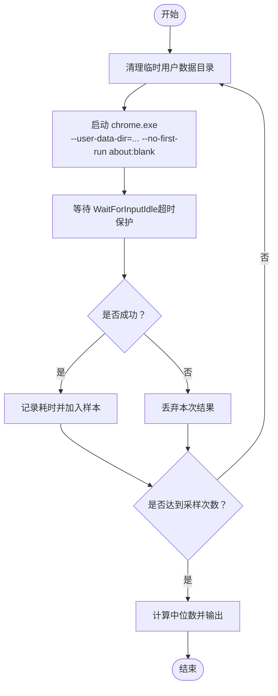
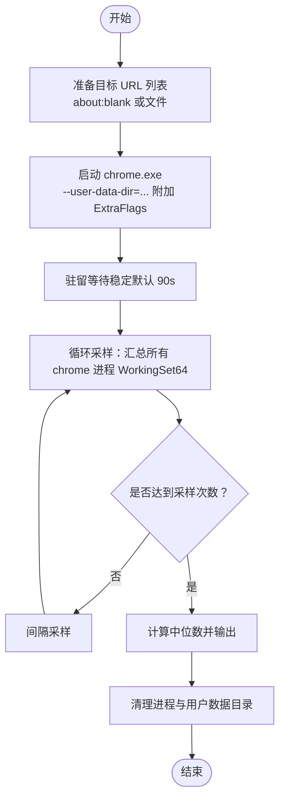
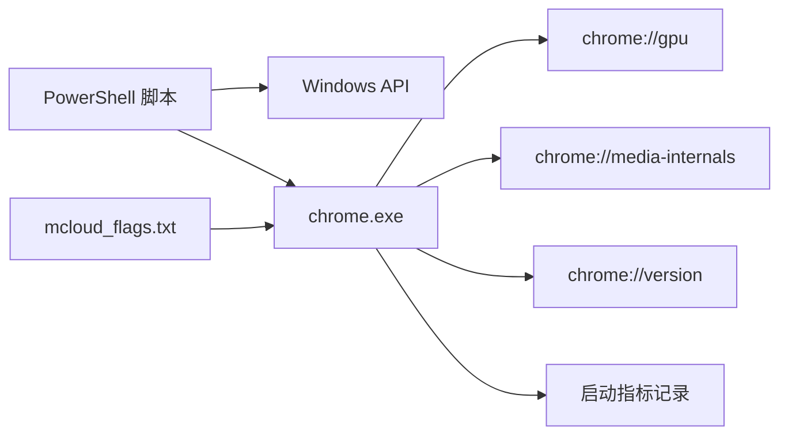

# 性能监控

<cite>
**本文引用的文件**
- [README.md](file://README.md)
- [mcloud_flags.txt](file://mcloud_flags.txt)
- [run_baseline.ps1](file://benchmark/run_baseline.ps1)
- [bench_startup.ps1](file://benchmark/bench_startup.ps1)
- [bench_memory.ps1](file://benchmark/bench_memory.ps1)
- [verify_builtin_flags.ps1](file://benchmark/tools/verify_builtin_flags.ps1)
- [M151-benchmark.md](file://docs/dev-logs/M151-benchmark.md)
- [M151-opt-benchmark.md](file://docs/dev-logs/M151-opt-benchmark.md)
- [benchmark-template.md](file://docs/dev-logs/benchmark-template.md)
- [chrome_main_delegate.cc](file://src/chrome/app/chrome_main_delegate.cc)
- [BUILD.gn (content/browser)](file://src/content/browser/BUILD.gn)
</cite>

## 目录
1. [简介](#简介)
2. [项目结构](#项目结构)
3. [核心组件](#核心组件)
4. [架构总览](#架构总览)
5. [详细组件分析](#详细组件分析)
6. [依赖关系分析](#依赖关系分析)
7. [性能注意事项](#性能注意事项)
8. [故障排查指南](#故障排查指南)
9. [结论](#结论)
10. [附录](#附录)

## 简介
本文件面向 MCloud Browser 的硬件加速与整体性能监控，聚焦以下目标：
- 指标采集：启动时间、内存使用、帧率等关键指标的采集方法与工具链。
- 实时监控：通过内置标志与浏览器内建页面进行运行时观测。
- 性能分析：基准测试框架与自定义脚本编写方法。
- 瓶颈识别与优化建议：基于仓库中的优化清单与实测报告给出可操作建议。

## 项目结构
MCloud Browser 在仓库中提供了完整的基准测试与验证工具链，位于 benchmark 目录；同时提供构建期与运行期的性能标志注入机制（mcloud_flags.txt）以及启动期指标记录点（ChromeMainDelegate）。

图表来源
- [run_baseline.ps1:1-78](file://benchmark/run_baseline.ps1#L1-L78)
- [bench_startup.ps1:1-70](file://benchmark/bench_startup.ps1#L1-L70)
- [bench_memory.ps1:1-78](file://benchmark/bench_memory.ps1#L1-L78)
- [verify_builtin_flags.ps1:1-98](file://benchmark/tools/verify_builtin_flags.ps1#L1-L98)
- [mcloud_flags.txt:1-120](file://mcloud_flags.txt#L1-L120)
- [chrome_main_delegate.cc:782-817](file://src/chrome/app/chrome_main_delegate.cc#L782-L817)

章节来源
- [README.md:61-178](file://README.md#L61-L178)
- [README.md:302-377](file://README.md#L302-L377)

## 核心组件
- 启动时间采集（K1）：bench_startup.ps1 以全新用户数据目录启动浏览器，等待主窗口初始化完成作为“首屏可交互”代理指标，多次采样取中位数。
- 内存使用采集（K2）：bench_memory.ps1 打开固定数量标签页并驻留稳定后，汇总所有浏览器进程的 WorkingSet64，多次采样取中位数。
- 二进制体积（K7）：bench_size.ps1 统计 chrome.exe 与安装包大小。
- 内置标志验证（A6）：verify_builtin_flags.ps1 通过 headless 抓取 chrome://version 或子进程命令行探测，确认 mcloud_flags.txt 注入的标志已生效。
- 启动指标记录：chrome_main_delegate.cc 在浏览器进程早期记录启动指标，并在退出时记录关机指标。
- 运行时观测：通过 chrome://gpu、chrome://media-internals 等页面查看 GPU 状态、解码器路径、媒体管线等。

章节来源
- [bench_startup.ps1:1-70](file://benchmark/bench_startup.ps1#L1-L70)
- [bench_memory.ps1:1-78](file://benchmark/bench_memory.ps1#L1-L78)
- [verify_builtin_flags.ps1:1-98](file://benchmark/tools/verify_builtin_flags.ps1#L1-L98)
- [chrome_main_delegate.cc:782-817](file://src/chrome/app/chrome_main_delegate.cc#L782-L817)
- [README.md:302-377](file://README.md#L302-L377)

## 架构总览
下图展示了从基准脚本到浏览器进程、再到运行时观测与指标记录的端到端流程。

图表来源
- [run_baseline.ps1:1-78](file://benchmark/run_baseline.ps1#L1-L78)
- [bench_startup.ps1:1-70](file://benchmark/bench_startup.ps1#L1-L70)
- [bench_memory.ps1:1-78](file://benchmark/bench_memory.ps1#L1-L78)
- [verify_builtin_flags.ps1:1-98](file://benchmark/tools/verify_builtin_flags.ps1#L1-L98)
- [mcloud_flags.txt:1-120](file://mcloud_flags.txt#L1-L120)
- [chrome_main_delegate.cc:782-817](file://src/chrome/app/chrome_main_delegate.cc#L782-L817)

## 详细组件分析

### 启动时间监控（K1）
- 方法要点：每次使用全新临时用户数据目录，启动 chrome.exe 并等待 WaitForInputIdle 作为首屏可交互代理指标，默认 5 次取中位数。
- 适用场景：评估冷启动优化、预加载策略、标志注入效果。
- 结果呈现：原始数据与中位数输出，便于归档至 docs/dev-logs。

图表来源
- [bench_startup.ps1:1-70](file://benchmark/bench_startup.ps1#L1-L70)

章节来源
- [bench_startup.ps1:1-70](file://benchmark/bench_startup.ps1#L1-L70)

### 内存使用监控（K2）
- 方法要点：以全新用户数据目录打开固定数量标签页（默认 50），驻留稳定后对全部浏览器进程 WorkingSet64 求和，多次采样取中位数。
- 扩展能力：支持 -UrlsFile 指定真实站点 URL 列表，-ExtraFlags 传入额外标志用于对比配置。
- 适用场景：评估标签页冻结、内存回收、预载策略对内存的影响。

图表来源
- [bench_memory.ps1:1-78](file://benchmark/bench_memory.ps1#L1-L78)

章节来源
- [bench_memory.ps1:1-78](file://benchmark/bench_memory.ps1#L1-L78)

### 帧率与渲染监控
- 运行时观测：通过 chrome://gpu 查看 GPU 光栅化、合成器、驱动信息；通过 chrome://media-internals 观察视频解码路径（D3D11/D3D12）、MSE 缓冲、解码器选择。
- 相关标志：仓库 README 与 mcloud_flags.txt 启用了 GPU 光栅化、Canvas 离屏光栅化、高刷请求、SkiaGraphite 预编译等渲染优化项。
- 注意：仓库未提供自动化帧率采集脚本，建议使用 DevTools Performance 面板或 Media Internals 进行手工采集与分析。

章节来源
- [README.md:302-377](file://README.md#L302-L377)
- [mcloud_flags.txt:1-120](file://mcloud_flags.txt#L1-L120)

### 启动指标记录（内核侧）
- 浏览器进程在早期阶段记录启动指标，并在退出时记录关机指标，便于后续分析与回归定位。
- 该实现为 Chromium 标准行为，MCloud 在此基础上叠加了丰富的启动优化标志。

章节来源
- [chrome_main_delegate.cc:782-817](file://src/chrome/app/chrome_main_delegate.cc#L782-L817)

### 内置标志验证（A6）
- 原理：headless 模式抓取 chrome://version，检查其中是否包含代表特性；若不可用则回退到子进程命令行探测。
- 抽查项：SpareRendererForSitePerProcess、InfiniteTabsFreezing、PlatformHEVCDecoderSupport。
- 目的：确保 mcloud_flags.txt 注入的标志在当前构建中真实生效。

章节来源
- [verify_builtin_flags.ps1:1-98](file://benchmark/tools/verify_builtin_flags.ps1#L1-L98)
- [mcloud_flags.txt:1-120](file://mcloud_flags.txt#L1-L120)

### 基准报告与模板
- run_baseline.ps1 将 K1/K2/K7 的结果按统一模板生成报告，便于归档与对比。
- 模板包含环境信息、KPI 表格、原始数据与结论异常记录区段。

章节来源
- [run_baseline.ps1:1-78](file://benchmark/run_baseline.ps1#L1-L78)
- [benchmark-template.md:1-39](file://docs/dev-logs/benchmark-template.md#L1-L39)

## 依赖关系分析
- 基准脚本依赖：PowerShell 环境、Windows 进程管理 API（Get-Process、Start-Process、WaitForInputIdle）。
- 浏览器依赖：Chromium 内置页面（chrome://gpu、chrome://media-internals、chrome://version）与启动期指标记录点。
- 构建与运行期标志：mcloud_flags.txt 在浏览器启动时被注入，影响 GPU、媒体、内存、网络、线程等多个子系统。

图表来源
- [bench_startup.ps1:1-70](file://benchmark/bench_startup.ps1#L1-L70)
- [bench_memory.ps1:1-78](file://benchmark/bench_memory.ps1#L1-L78)
- [verify_builtin_flags.ps1:1-98](file://benchmark/tools/verify_builtin_flags.ps1#L1-L98)
- [mcloud_flags.txt:1-120](file://mcloud_flags.txt#L1-L120)
- [chrome_main_delegate.cc:782-817](file://src/chrome/app/chrome_main_delegate.cc#L782-L817)

章节来源
- [src/content/browser/BUILD.gn:1143-1175](file://src/content/browser/BUILD.gn#L1143-L1175)

## 性能注意事项
- 启动时间：优先关注 K1 中位数，避免首跑噪声；确保电源模式为高性能，关闭无关后台任务。
- 内存使用：K2 建议在稳定驻留后再采样；如需评估真实站点影响，使用 -UrlsFile 指定 URL 列表。
- 帧率与渲染：结合 chrome://gpu 与 chrome://media-internals 观察解码路径与合成器状态；必要时使用 DevTools Performance 面板采集掉帧。
- 标志有效性：定期运行 verify_builtin_flags.ps1 确认内置标志生效；升级内核后使用 check_features.py 校验 feature 存活性。
- 报告归档：使用 run_baseline.ps1 生成统一格式报告，便于版本间对比与回归追踪。

[本节为通用指导，不直接分析具体文件]

## 故障排查指南
- 启动失败或超时：检查 chrome.exe 路径与参数；确认用户数据目录可写；适当增加等待超时。
- 内存采样异常：确认脚本能枚举到所有 chrome 子进程；必要时以管理员权限运行 PowerShell。
- 标志未生效：确认 mcloud_flags.txt 位于 exe 同目录；使用 verify_builtin_flags.ps1 的 headless 或命令行探测路径；如仍失败，检查当前构建是否包含对应逻辑。
- 视频绿屏/花屏：仓库已在 mcloud_flags.txt 中显式禁用 D3D12VideoDecoder 以规避特定核显驱动问题；如需恢复，请谨慎评估并记录回归现象。

章节来源
- [bench_startup.ps1:1-70](file://benchmark/bench_startup.ps1#L1-L70)
- [bench_memory.ps1:1-78](file://benchmark/bench_memory.ps1#L1-L78)
- [verify_builtin_flags.ps1:1-98](file://benchmark/tools/verify_builtin_flags.ps1#L1-L98)
- [mcloud_flags.txt:83-88](file://mcloud_flags.txt#L83-L88)

## 结论
MCloud Browser 在仓库层面提供了完善的性能监控与基准体系：
- 启动时间与内存使用可通过 K1/K2 脚本快速复现与归档。
- 内置标志注入与验证闭环（A6）保障优化项真实生效。
- 运行时观测借助 chrome://gpu 与 chrome://media-internals 可深入分析硬件加速与媒体管线。
- 结合 README 中的优化清单与实测报告，可系统化识别瓶颈并实施优化。

[本节为总结性内容，不直接分析具体文件]

## 附录
- 常用命令参考：
  - 一键基线：pwsh benchmark\run_baseline.ps1 -Version M151
  - 单项基准：pwsh benchmark\bench_startup.ps1 -Runs 5
  - 内存基准：pwsh benchmark\bench_memory.ps1 -Tabs 50 -SettleSeconds 90
  - 标志验证：pwsh benchmark\tools\verify_builtin_flags.ps1
- 报告模板：docs/dev-logs/benchmark-template.md
- 实测报告示例：docs/dev-logs/M151-benchmark.md、docs/dev-logs/M151-opt-benchmark.md

章节来源
- [README.md:357-377](file://README.md#L357-L377)
- [benchmark-template.md:1-39](file://docs/dev-logs/benchmark-template.md#L1-L39)
- [M151-benchmark.md:1-30](file://docs/dev-logs/M151-benchmark.md#L1-L30)
- [M151-opt-benchmark.md:1-52](file://docs/dev-logs/M151-opt-benchmark.md#L1-L52)