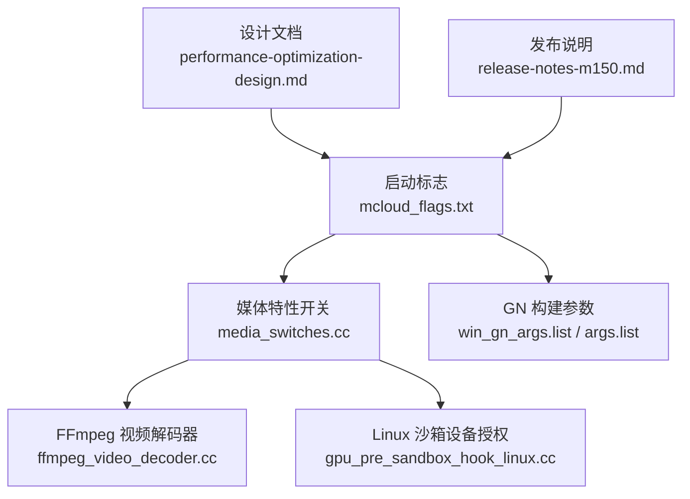
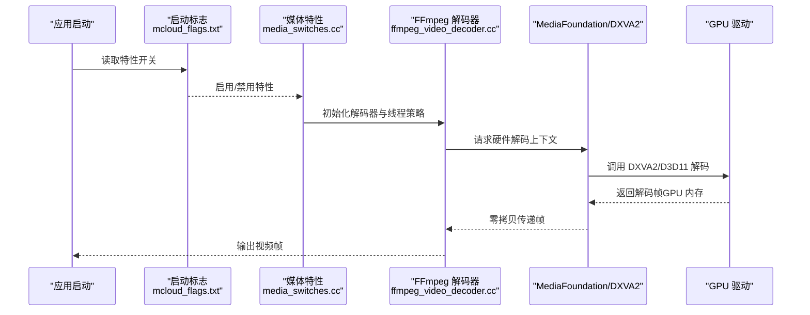
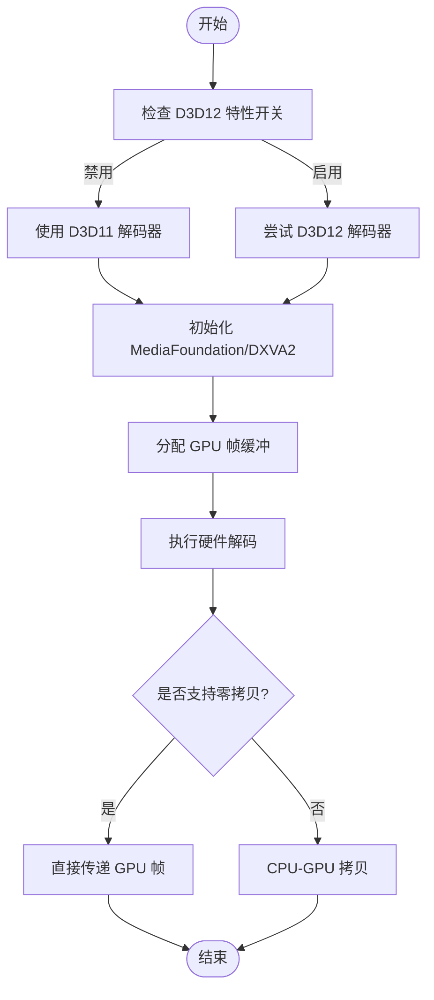
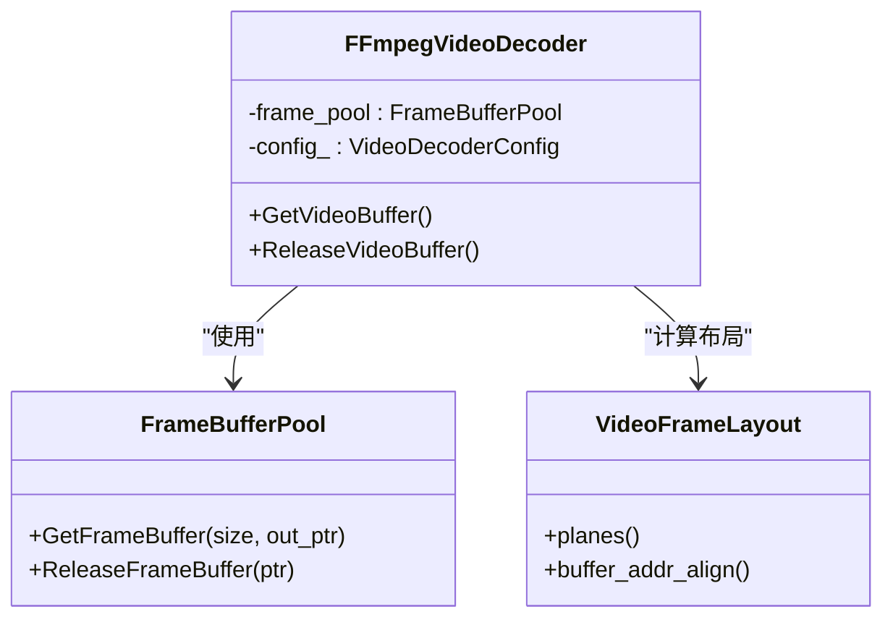
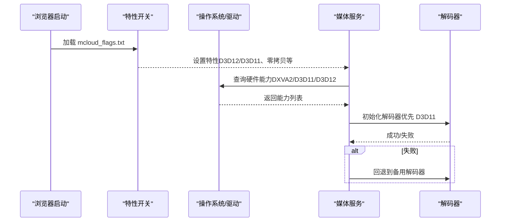
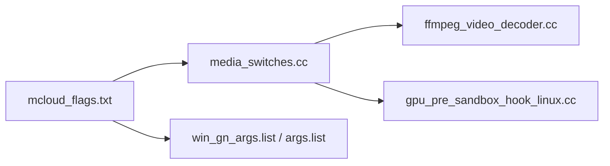

# 硬件加速

本文引用的文件

- [mcloud_flags.txt](https://github.com/Mcloud136/Mcloud-Browser/blob/main/mcloud_flags.txt)
- [media_switches.cc](https://github.com/Mcloud136/Mcloud-Browser/blob/main/src/media/base/media_switches.cc)
- [ffmpeg_video_decoder.cc](https://github.com/Mcloud136/Mcloud-Browser/blob/main/src/media/filters/ffmpeg_video_decoder.cc)
- [gpu_pre_sandbox_hook_linux.cc](https://github.com/Mcloud136/Mcloud-Browser/blob/main/src/content/common/gpu_pre_sandbox_hook_linux.cc)
- [2026-06-19-performance-optimization-design.md](https://github.com/Mcloud136/Mcloud-Browser/blob/main/docs/superpowers/specs/2026-06-19-performance-optimization-design.md)
- [2026-06-20-release-notes-m150.md](https://github.com/Mcloud136/Mcloud-Browser/blob/main/docs/superpowers/specs/2026-06-20-release-notes-m150.md)
- [README.md](https://github.com/Mcloud136/Mcloud-Browser/blob/main/README.md)
- [win_gn_args.list](https://github.com/Mcloud136/Mcloud-Browser/blob/main/infra/win_gn_args.list)
- [args.list](https://github.com/Mcloud136/Mcloud-Browser/blob/main/infra/args.list)

## 目录
1. [简介](#简介)
2. [项目结构](#项目结构)
3. [核心组件](#核心组件)
4. [架构总览](#架构总览)
5. [详细组件分析](#详细组件分析)
6. [依赖关系分析](#依赖关系分析)
7. [性能考量](#性能考量)
8. [故障排查指南](#故障排查指南)
9. [结论](#结论)
10. [附录](#附录)

## 简介
本文件面向 MCloud Browser 的硬件加速系统，聚焦 Windows 平台上的 D3D11/D3D12 视频解码与渲染路径、DXVA2 加速、GPU 内存管理与零拷贝渲染技术。文档同时覆盖硬件加速的检测与启用流程、不同 GPU 厂商（NVIDIA、AMD、Intel）的优化策略、性能监控与调试方法，以及常见问题的诊断与解决方案，并给出可操作的配置参数与优化建议。

## 项目结构
围绕硬件加速的关键代码与配置分布在以下位置：
- 启动标志与特性开关：位于 mcloud_flags.txt，集中管理媒体与 GPU 相关特性开关，包括对 D3D12 视频解码的策略性禁用与多项媒体/GPU 优化项。
- 媒体特性定义与平台开关：位于 media_switches.cc，定义 Linux/Windows 等平台相关的媒体加速特性（如 VA-API、MediaFoundation 批量读取、D3D11 视频捕获零拷贝等）。
- FFmpeg 视频解码器实现：位于 ffmpeg_video_decoder.cc，负责帧缓冲分配、像素格式处理与线程数策略，为硬件解码提供底层数据通路。
- Linux 沙箱设备权限：位于 gpu_pre_sandbox_hook_linux.cc，在沙箱创建前为 V4L2/VAAPI 等设备节点授权，确保硬件解码可用。
- 设计文档与发布说明：位于 docs/superpowers/specs，记录性能优化设计与已知限制（如 D3D12 视频解码回退到 D3D11）。
- GN 构建参数：位于 infra/win_gn_args.list 与 infra/args.list，控制 Angle/D3D11 等后端编译选项。

**图表来源**
- [mcloud_flags.txt:1-120](https://github.com/Mcloud136/Mcloud-Browser/blob/main/mcloud_flags.txt#L1-L120)
- [media_switches.cc:740-939](https://github.com/Mcloud136/Mcloud-Browser/blob/main/src/media/base/media_switches.cc#L740-L939)
- [ffmpeg_video_decoder.cc:1-200](https://github.com/Mcloud136/Mcloud-Browser/blob/main/src/media/filters/ffmpeg_video_decoder.cc#L1-L200)
- [gpu_pre_sandbox_hook_linux.cc:121-149](https://github.com/Mcloud136/Mcloud-Browser/blob/main/src/content/common/gpu_pre_sandbox_hook_linux.cc#L121-L149)
- [2026-06-19-performance-optimization-design.md:100-126](https://github.com/Mcloud136/Mcloud-Browser/blob/main/docs/superpowers/specs/2026-06-19-performance-optimization-design.md#L100-L126)
- [2026-06-20-release-notes-m150.md:274-304](https://github.com/Mcloud136/Mcloud-Browser/blob/main/docs/superpowers/specs/2026-06-20-release-notes-m150.md#L274-L304)

**章节来源**
- [mcloud_flags.txt:1-120](https://github.com/Mcloud136/Mcloud-Browser/blob/main/mcloud_flags.txt#L1-L120)
- [media_switches.cc:740-939](https://github.com/Mcloud136/Mcloud-Browser/blob/main/src/media/base/media_switches.cc#L740-L939)
- [ffmpeg_video_decoder.cc:1-200](https://github.com/Mcloud136/Mcloud-Browser/blob/main/src/media/filters/ffmpeg_video_decoder.cc#L1-L200)
- [gpu_pre_sandbox_hook_linux.cc:121-149](https://github.com/Mcloud136/Mcloud-Browser/blob/main/src/content/common/gpu_pre_sandbox_hook_linux.cc#L121-L149)
- [2026-06-19-performance-optimization-design.md:100-126](https://github.com/Mcloud136/Mcloud-Browser/blob/main/docs/superpowers/specs/2026-06-19-performance-optimization-design.md#L100-L126)
- [2026-06-20-release-notes-m150.md:274-304](https://github.com/Mcloud136/Mcloud-Browser/blob/main/docs/superpowers/specs/2026-06-20-release-notes-m150.md#L274-L304)

## 核心组件
- 启动标志与特性开关（mcloud_flags.txt）
  - 明确禁用 D3D12VideoDecoder，回退至 D3D11VideoDecoder，避免 Intel 核显在 D3D12 下出现绿屏/花屏问题。
  - 启用多项媒体与 GPU 优化特性：PlatformHEVCDecoderSupport、HardwareSecureDecryptionAv1、DedicatedMediaServiceThread、DirectOpusAudioDecoding、EncryptedMediaOcclusionTracking、MediaFoundationBatchRead、MediaFoundationD3D11VideoCaptureZeroCopy、IncreasedCmdBufferParseSlice、SkiaGraphitePrecompilation、ResourcePoolPreferExactSizeReuse、HighFramerateRequestFromClient 等。
- 媒体特性定义（media_switches.cc）
  - 定义 Linux 平台的 VA-API/V4L2 加速解码开关与 NVIDIA VA-API 默认禁用策略。
  - 定义 MediaFoundation 相关特性（如批量读取、D3D11 视频捕获零拷贝），用于 Windows 平台的媒体管线优化。
- FFmpeg 视频解码器（ffmpeg_video_decoder.cc）
  - 负责帧缓冲分配、像素格式校验与布局计算，支持 I420/I422/I444 及 10bit 格式；根据分辨率动态调整解码线程数，提升 H264/HEVC 解码效率。
  - 通过 FrameBufferPool 进行内存池化管理，减少重复分配开销。
- Linux 沙箱设备授权（gpu_pre_sandbox_hook_linux.cc）
  - 在沙箱创建前为 video-dec*/media-dec* 设备节点授予读写权限，确保 V4L2/VAAPI 硬件解码可用。
- 构建参数（win_gn_args.list / args.list）
  - 控制 Angle/D3D11 后端编译选项，影响图形栈与合成路径。

**章节来源**
- [mcloud_flags.txt:1-120](https://github.com/Mcloud136/Mcloud-Browser/blob/main/mcloud_flags.txt#L1-L120)
- [media_switches.cc:740-939](https://github.com/Mcloud136/Mcloud-Browser/blob/main/src/media/base/media_switches.cc#L740-L939)
- [ffmpeg_video_decoder.cc:1-200](https://github.com/Mcloud136/Mcloud-Browser/blob/main/src/media/filters/ffmpeg_video_decoder.cc#L1-L200)
- [gpu_pre_sandbox_hook_linux.cc:121-149](https://github.com/Mcloud136/Mcloud-Browser/blob/main/src/content/common/gpu_pre_sandbox_hook_linux.cc#L121-L149)
- [win_gn_args.list:231-239](https://github.com/Mcloud136/Mcloud-Browser/blob/main/infra/win_gn_args.list#L231-L239)
- [args.list:239-241](https://github.com/Mcloud136/Mcloud-Browser/blob/main/infra/args.list#L239-L241)

## 架构总览
MCloud Browser 的硬件加速架构以“启动标志 → 媒体特性 → 解码器/渲染器”为主线，结合平台差异（Windows MediaFoundation/DXVA2、Linux VAAPI/V4L2）与 GPU 厂商策略（NVIDIA/AMD/Intel）进行适配。

**图表来源**
- [mcloud_flags.txt:83-105](https://github.com/Mcloud136/Mcloud-Browser/blob/main/mcloud_flags.txt#L83-L105)
- [media_switches.cc:1318-1330](https://github.com/Mcloud136/Mcloud-Browser/blob/main/src/media/base/media_switches.cc#L1318-L1330)
- [ffmpeg_video_decoder.cc:118-200](https://github.com/Mcloud136/Mcloud-Browser/blob/main/src/media/filters/ffmpeg_video_decoder.cc#L118-L200)

## 详细组件分析

### D3D11/D3D12 视频解码与 DXVA2 加速
- 策略选择
  - 当前构建显式禁用 D3D12VideoDecoder，回退到 D3D11VideoDecoder，以避免 Intel 核显在 D3D12 下的绿屏/花屏问题。该策略已在发布说明中列为已知限制。
  - 启用 PlatformHEVCDecoderSupport 与 HardwareSecureDecryptionAv1，利用平台原生解码能力（含 DXVA2/MediaFoundation）提升 HEVC/AV1 硬解效率与安全解密。
- 数据流
  - 媒体服务通过 MediaFoundation 批量读取与 D3D11 视频捕获零拷贝，减少 CPU-GPU 间的数据拷贝。
  - FFmpeg 解码器负责帧缓冲分配与像素格式转换，配合 GPU 内存池降低分配开销。

**图表来源**
- [mcloud_flags.txt:83-105](https://github.com/Mcloud136/Mcloud-Browser/blob/main/mcloud_flags.txt#L83-L105)
- [2026-06-20-release-notes-m150.md:274-281](https://github.com/Mcloud136/Mcloud-Browser/blob/main/docs/superpowers/specs/2026-06-20-release-notes-m150.md#L274-L281)
- [ffmpeg_video_decoder.cc:118-200](https://github.com/Mcloud136/Mcloud-Browser/blob/main/src/media/filters/ffmpeg_video_decoder.cc#L118-L200)

**章节来源**
- [mcloud_flags.txt:83-105](https://github.com/Mcloud136/Mcloud-Browser/blob/main/mcloud_flags.txt#L83-L105)
- [2026-06-20-release-notes-m150.md:274-281](https://github.com/Mcloud136/Mcloud-Browser/blob/main/docs/superpowers/specs/2026-06-20-release-notes-m150.md#L274-L281)
- [ffmpeg_video_decoder.cc:118-200](https://github.com/Mcloud136/Mcloud-Browser/blob/main/src/media/filters/ffmpeg_video_decoder.cc#L118-L200)

### GPU 内存管理与零拷贝渲染
- 帧缓冲池化
  - FFmpeg 解码器通过 FrameBufferPool 统一分配与释放 GPU 帧缓冲，避免频繁分配导致的碎片与延迟。
- 像素格式与布局
  - 严格校验像素格式（I420/I422/I444 及 10bit），确保与下游渲染管线兼容。
- 零拷贝路径
  - 启用 MediaFoundationD3D11VideoCaptureZeroCopy，使捕获的视频帧直接在 GPU 内存中流转，减少 CPU 参与。

**图表来源**
- [ffmpeg_video_decoder.cc:38-60](https://github.com/Mcloud136/Mcloud-Browser/blob/main/src/media/filters/ffmpeg_video_decoder.cc#L38-L60)
- [ffmpeg_video_decoder.cc:131-200](https://github.com/Mcloud136/Mcloud-Browser/blob/main/src/media/filters/ffmpeg_video_decoder.cc#L131-L200)

**章节来源**
- [ffmpeg_video_decoder.cc:38-60](https://github.com/Mcloud136/Mcloud-Browser/blob/main/src/media/filters/ffmpeg_video_decoder.cc#L38-L60)
- [ffmpeg_video_decoder.cc:131-200](https://github.com/Mcloud136/Mcloud-Browser/blob/main/src/media/filters/ffmpeg_video_decoder.cc#L131-L200)

### 硬件加速检测与启用流程
- 启动阶段
  - 读取 mcloud_flags.txt 中的特性开关，决定是否启用 D3D12/D3D11 解码、媒体服务线程、零拷贝等。
- 平台适配
  - Linux：通过 gpu_pre_sandbox_hook_linux.cc 为 V4L2/VAAPI 设备授权，确保硬件解码可用。
  - Windows：通过 MediaFoundation 特性与 DXVA2 驱动交互，完成解码上下文初始化。
- 运行时决策
  - 根据 GPU 能力与驱动状态，选择最优解码路径（D3D11 或 D3D12），并在出现问题时自动回退。

**图表来源**
- [mcloud_flags.txt:83-105](https://github.com/Mcloud136/Mcloud-Browser/blob/main/mcloud_flags.txt#L83-L105)
- [gpu_pre_sandbox_hook_linux.cc:121-149](https://github.com/Mcloud136/Mcloud-Browser/blob/main/src/content/common/gpu_pre_sandbox_hook_linux.cc#L121-L149)

**章节来源**
- [mcloud_flags.txt:83-105](https://github.com/Mcloud136/Mcloud-Browser/blob/main/mcloud_flags.txt#L83-L105)
- [gpu_pre_sandbox_hook_linux.cc:121-149](https://github.com/Mcloud136/Mcloud-Browser/blob/main/src/content/common/gpu_pre_sandbox_hook_linux.cc#L121-L149)

### 不同 GPU 厂商优化策略
- Intel 核显
  - 当前禁用 D3D12VideoDecoder，回退到 D3D11，避免绿屏/花屏问题。
  - 启用 PlatformHEVCDecoderSupport 与 DirectComposition，提升 HEVC 硬解与合成效率。
- NVIDIA 独显
  - Linux 平台默认禁用 VA-API（防止崩溃），Windows 平台通过 MediaFoundation 与 DXVA2 获得稳定硬解。
- AMD 显卡
  - 通过 IncreasedCmdBufferParseSlice 与 SkiaGraphitePrecompilation 减少命令缓冲区解析与着色器编译开销。

**章节来源**
- [mcloud_flags.txt:83-105](https://github.com/Mcloud136/Mcloud-Browser/blob/main/mcloud_flags.txt#L83-L105)
- [media_switches.cc:766-777](https://github.com/Mcloud136/Mcloud-Browser/blob/main/src/media/base/media_switches.cc#L766-L777)
- [2026-06-20-release-notes-m150.md:274-281](https://github.com/Mcloud136/Mcloud-Browser/blob/main/docs/superpowers/specs/2026-06-20-release-notes-m150.md#L274-L281)

## 依赖关系分析
- 启动标志依赖媒体特性开关，媒体特性开关依赖平台实现（MediaFoundation/DXVA2、VAAPI/V4L2）。
- FFmpeg 解码器依赖 GPU 内存池与像素格式库，确保帧缓冲正确分配与释放。
- Linux 沙箱依赖设备节点权限，确保 V4L2/VAAPI 可用。

**图表来源**
- [mcloud_flags.txt:1-120](https://github.com/Mcloud136/Mcloud-Browser/blob/main/mcloud_flags.txt#L1-L120)
- [media_switches.cc:740-939](https://github.com/Mcloud136/Mcloud-Browser/blob/main/src/media/base/media_switches.cc#L740-L939)
- [ffmpeg_video_decoder.cc:1-200](https://github.com/Mcloud136/Mcloud-Browser/blob/main/src/media/filters/ffmpeg_video_decoder.cc#L1-L200)
- [gpu_pre_sandbox_hook_linux.cc:121-149](https://github.com/Mcloud136/Mcloud-Browser/blob/main/src/content/common/gpu_pre_sandbox_hook_linux.cc#L121-L149)
- [win_gn_args.list:231-239](https://github.com/Mcloud136/Mcloud-Browser/blob/main/infra/win_gn_args.list#L231-L239)
- [args.list:239-241](https://github.com/Mcloud136/Mcloud-Browser/blob/main/infra/args.list#L239-L241)

**章节来源**
- [mcloud_flags.txt:1-120](https://github.com/Mcloud136/Mcloud-Browser/blob/main/mcloud_flags.txt#L1-L120)
- [media_switches.cc:740-939](https://github.com/Mcloud136/Mcloud-Browser/blob/main/src/media/base/media_switches.cc#L740-L939)
- [ffmpeg_video_decoder.cc:1-200](https://github.com/Mcloud136/Mcloud-Browser/blob/main/src/media/filters/ffmpeg_video_decoder.cc#L1-L200)
- [gpu_pre_sandbox_hook_linux.cc:121-149](https://github.com/Mcloud136/Mcloud-Browser/blob/main/src/content/common/gpu_pre_sandbox_hook_linux.cc#L121-L149)
- [win_gn_args.list:231-239](https://github.com/Mcloud136/Mcloud-Browser/blob/main/infra/win_gn_args.list#L231-L239)
- [args.list:239-241](https://github.com/Mcloud136/Mcloud-Browser/blob/main/infra/args.list#L239-L241)

## 性能考量
- 冷启动与资源预热
  - 启用 SpareRendererForSitePerProcess、SendGPUChannelEarly、Prerender2WarmUpCompositorForNewTabPage 等，减少首帧延迟。
- 视频播放流畅度
  - DedicatedMediaServiceThread、ReduceHardwareVideoDecoderBuffers、MediaFoundationBatchRead 提升解码吞吐与稳定性。
- GPU 渲染效率
  - IncreasedCmdBufferParseSlice、SkiaGraphitePrecompilation、ResourcePoolPreferExactSizeReuse 减少上下文切换与内存碎片。
- 高刷显示器支持
  - HighFramerateRequestFromClient 允许客户端请求高帧率，提升滚动与动画体验。

**章节来源**
- [mcloud_flags.txt:1-120](https://github.com/Mcloud136/Mcloud-Browser/blob/main/mcloud_flags.txt#L1-L120)
- [README.md:135-178](https://github.com/Mcloud136/Mcloud-Browser/blob/main/README.md#L135-L178)
- [2026-06-19-performance-optimization-design.md:100-126](https://github.com/Mcloud136/Mcloud-Browser/blob/main/docs/superpowers/specs/2026-06-19-performance-optimization-design.md#L100-L126)

## 故障排查指南
- 绿屏/花屏（Intel 核显）
  - 现象：D3D12 视频解码启动头几秒输出绿屏/花屏。
  - 解决：禁用 D3D12VideoDecoder，回退到 D3D11VideoDecoder。
- 硬件解码不可用（Linux）
  - 现象：无法访问 video-dec*/media-dec* 设备。
  - 解决：确认 gpu_pre_sandbox_hook_linux.cc 已为设备节点授权。
- VA-API 崩溃（NVIDIA Linux）
  - 现象：VA-API 导致崩溃。
  - 解决：保持 kVaapiOnNvidiaGPUs 默认禁用，改用软件解码或其他路径。
- 性能瓶颈
  - 现象：解码卡顿、内存占用高。
  - 解决：启用 ReduceHardwareVideoDecoderBuffers、ResourcePoolPreferExactSizeReuse，调整解码线程数。

**章节来源**
- [mcloud_flags.txt:83-105](https://github.com/Mcloud136/Mcloud-Browser/blob/main/mcloud_flags.txt#L83-L105)
- [gpu_pre_sandbox_hook_linux.cc:121-149](https://github.com/Mcloud136/Mcloud-Browser/blob/main/src/content/common/gpu_pre_sandbox_hook_linux.cc#L121-L149)
- [media_switches.cc:766-777](https://github.com/Mcloud136/Mcloud-Browser/blob/main/src/media/base/media_switches.cc#L766-L777)
- [ffmpeg_video_decoder.cc:64-99](https://github.com/Mcloud136/Mcloud-Browser/blob/main/src/media/filters/ffmpeg_video_decoder.cc#L64-L99)

## 结论
MCloud Browser 通过精细的特性开关与平台适配，实现了稳定的硬件加速视频解码与高效的 GPU 渲染路径。当前构建针对 Intel 核显的 D3D12 问题采取回退策略，确保用户体验；同时通过零拷贝、帧缓冲池化与多线程解码优化，提升整体性能。未来可随上游修复与驱动更新逐步评估重新启用 D3D12 的可行性。

## 附录
- 关键配置参数
  - --disable-features=D3D12VideoDecoder（避免 Intel 核显绿屏）
  - --enable-features=PlatformHEVCDecoderSupport、HardwareSecureDecryptionAv1（提升 HEVC/AV1 硬解）
  - --enable-features=MediaFoundationD3D11VideoCaptureZeroCopy（零拷贝渲染）
  - --enable-features=IncreasedCmdBufferParseSlice、SkiaGraphitePrecompilation（GPU 渲染优化）
- 参考文档
  - 性能优化设计：[2026-06-19-performance-optimization-design.md](https://github.com/Mcloud136/Mcloud-Browser/blob/main/docs/superpowers/specs/2026-06-19-performance-optimization-design.md)
  - 发布说明（已知限制）：[2026-06-20-release-notes-m150.md](https://github.com/Mcloud136/Mcloud-Browser/blob/main/docs/superpowers/specs/2026-06-20-release-notes-m150.md)