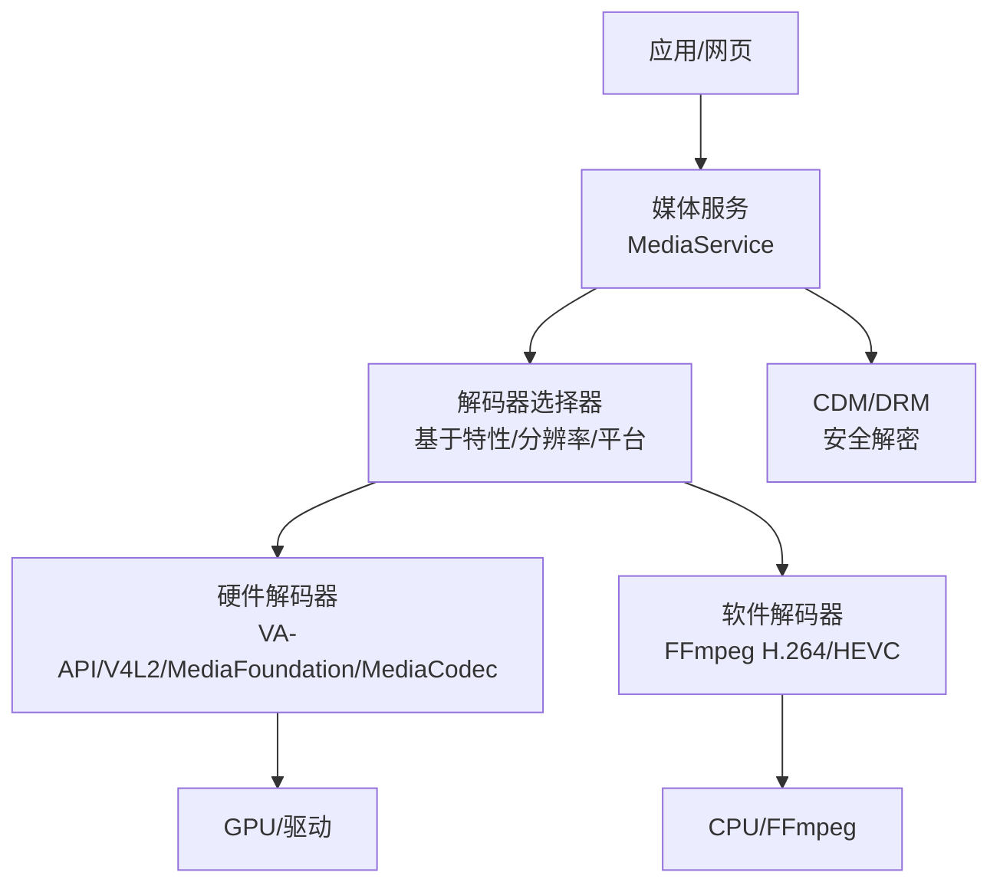
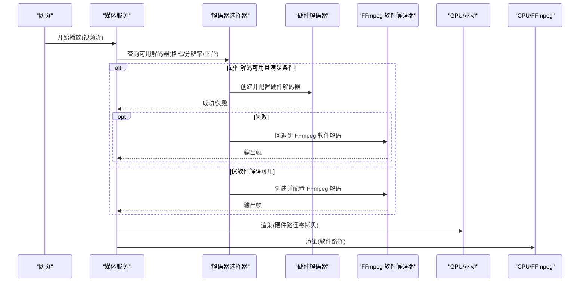
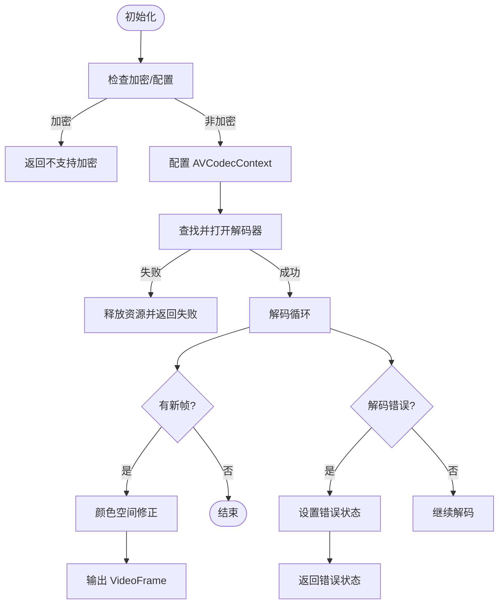
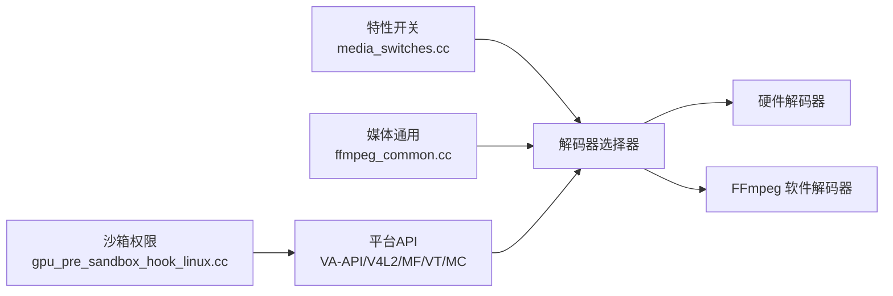

# 硬件编解码器

<cite>
**本文引用的文件**
- [ffmpeg_video_decoder.cc](file://src/media/filters/ffmpeg_video_decoder.cc)
- [ffmpeg_common.cc](file://src/media/ffmpeg/ffmpeg_common.cc)
- [media_switches.cc](file://src/media/base/media_switches.cc)
- [media_options.gni](file://src/media/media_options.gni)
- [add-hevc-ffmpeg-decoder-parser.patch](file://other/add-hevc-ffmpeg-decoder-parser.patch)
- [ffmpeg-Don't-lie-about-AAC-and-H264-decoders-when-not-avai.patch](file://infra/Flatpak/com.mcloud.browser/patches/chromium/ffmpeg-Don't-lie-about-AAC-and-H264-decoders-when-not-avai.patch)
- [gpu_pre_sandbox_hook_linux.cc](file://src/content/common/gpu_pre_sandbox_hook_linux.cc)
- [args.list](file://infra/args.list)
</cite>

## 目录
1. [简介](#简介)
2. [项目结构](#项目结构)
3. [核心组件](#核心组件)
4. [架构总览](#架构总览)
5. [详细组件分析](#详细组件分析)
6. [依赖关系分析](#依赖关系分析)
7. [性能考量](#性能考量)
8. [故障排除指南](#故障排除指南)
9. [结论](#结论)
10. [附录](#附录)

## 简介
本文件面向 MCloud Browser 的硬件编解码能力，聚焦 HEVC/H.264/VP9/AV1 等格式的解码实现与选择策略、平台兼容性处理、错误恢复机制，以及在不同平台（Linux/Windows/macOS/Android）上的支持差异。文档同时给出性能调优建议与常见问题排查方法，帮助开发者快速定位并优化硬件加速播放体验。

## 项目结构
围绕硬件编解码的关键代码分布在以下位置：
- 媒体滤镜层：FFmpeg 视频解码器封装与线程控制、帧缓冲管理、状态机与错误恢复
- 媒体通用层：格式/色彩空间/配置转换、安全白名单、HEVC/AV1 解析与特性推断
- 开关与特性：平台相关特性开关（如 Linux VA-API/V4L2）、HEVC 硬件解码/编码、安全解密、分辨率优先级等
- 构建选项：是否启用 FFmpeg 视频解码器、VA-API、V4L2、图像编解码器等
- 沙箱权限：Linux 下为 V4L2 设备节点授予读写权限以启用硬件解码
- 补丁：为 HEVC 软件解码/解析提供兼容兜底；修正 MIME 类型声明避免误报

图表来源
- [media_switches.cc:742-805](file://src/media/base/media_switches.cc#L742-L805)
- [media_options.gni:17-29](file://src/media/media_options.gni#L17-L29)

章节来源
- [media_switches.cc:742-805](file://src/media/base/media_switches.cc#L742-L805)
- [media_options.gni:17-29](file://src/media/media_options.gni#L17-L29)

## 核心组件
- FFmpeg 视频解码器封装
  - 负责初始化 AVCodecContext、设置线程数、时间基、回调分配输出帧缓冲、调用解码循环、错误码映射与状态机管理
  - 对 H.264/HEVC 进行解码，并在不支持或失败时回退到软件路径
- 媒体通用工具
  - 将容器/流信息转换为 VideoDecoderConfig，解析 HEVC/AV1 的 profile、色彩空间、HDR、Alpha、色度采样等
  - 设置 FFmpeg 安全白名单，限制可加载的编解码器
- 平台特性与开关
  - Linux 上通过 VA-API/V4L2 启用硬件解码；Windows/macOS/Android 使用各自平台 API
  - 针对 HEVC 硬件解码/编码、安全解密、分辨率优先级的特性开关
- 沙箱与设备访问
  - Linux 下为 V4L2 设备节点授权，使硬件解码可用

章节来源
- [ffmpeg_video_decoder.cc:64-123](file://src/media/filters/ffmpeg_video_decoder.cc#L64-L123)
- [ffmpeg_video_decoder.cc:227-334](file://src/media/filters/ffmpeg_video_decoder.cc#L227-L334)
- [ffmpeg_video_decoder.cc:347-508](file://src/media/filters/ffmpeg_video_decoder.cc#L347-L508)
- [ffmpeg_common.cc:64-89](file://src/media/ffmpeg/ffmpeg_common.cc#L64-L89)
- [ffmpeg_common.cc:552-730](file://src/media/ffmpeg/ffmpeg_common.cc#L552-L730)
- [media_switches.cc:742-805](file://src/media/base/media_switches.cc#L742-L805)
- [gpu_pre_sandbox_hook_linux.cc:121-149](file://src/content/common/gpu_pre_sandbox_hook_linux.cc#L121-L149)

## 架构总览
下图展示从页面播放请求到最终解码输出的关键流程，包括解码器选择、硬件/软件路径、错误恢复与回退。

图表来源
- [media_switches.cc:742-805](file://src/media/base/media_switches.cc#L742-L805)
- [ffmpeg_video_decoder.cc:227-334](file://src/media/filters/ffmpeg_video_decoder.cc#L227-L334)
- [ffmpeg_video_decoder.cc:347-508](file://src/media/filters/ffmpeg_video_decoder.cc#L347-L508)

## 详细组件分析

### FFmpeg 视频解码器（软件路径）
- 线程数自适应：根据分辨率估算线程数，H.264/HEVC 按像素比例线性缩放，其他已知不受益的编解码器保持最小线程
- 帧缓冲分配：复用 FrameBufferPool，按 FFmpeg 要求对齐与填充，避免越界与未初始化内存
- 配置与打开：设置时间基、线程模式（切片/帧）、opaque 回调、NALU 分块标志，查找并打开对应 AVCodec
- 解码循环：发送包、处理新帧、颜色空间推导与修正、输出 VideoFrame
- 错误恢复：区分内存不足与一般失败，进入错误状态并可 Reset 重置

图表来源
- [ffmpeg_video_decoder.cc:64-123](file://src/media/filters/ffmpeg_video_decoder.cc#L64-L123)
- [ffmpeg_video_decoder.cc:227-334](file://src/media/filters/ffmpeg_video_decoder.cc#L227-L334)
- [ffmpeg_video_decoder.cc:347-508](file://src/media/filters/ffmpeg_video_decoder.cc#L347-L508)

章节来源
- [ffmpeg_video_decoder.cc:64-123](file://src/media/filters/ffmpeg_video_decoder.cc#L64-L123)
- [ffmpeg_video_decoder.cc:227-334](file://src/media/filters/ffmpeg_video_decoder.cc#L227-L334)
- [ffmpeg_video_decoder.cc:347-508](file://src/media/filters/ffmpeg_video_decoder.cc#L347-L508)

### 媒体通用工具（格式/色彩空间/安全）
- 允许的视频解码器白名单：在启用专有编解码与 FFmpeg 视频解码器时，限定 h264/hevc
- 安全设置：为 AVCodecContext 设置 codec_whitelist，必要时开启严格错误识别
- 配置转换：从 AVStream/AVCodecContext 构造 VideoDecoderConfig，解析 HEVC/AV1 profile、色彩空间、HDR、Alpha、色度采样
- 颜色空间修正：对 H.264/H.265 中错误的 RGB 矩阵指示进行回退到 BT.709；对部分 HEVC SDR 内容做合理猜测

章节来源
- [ffmpeg_common.cc:64-89](file://src/media/ffmpeg/ffmpeg_common.cc#L64-L89)
- [ffmpeg_common.cc:552-730](file://src/media/ffmpeg/ffmpeg_common.cc#L552-L730)

### 平台特性与开关（Linux/Windows/macOS/Android）
- Linux：默认启用 VA-API 硬件解码（x86/x64），可通过特性开关控制 VA-API/V4L2；NVIDIA GPU 默认禁用 VA-API 以避免崩溃；支持低功率编码器、分辨率下限等
- Windows/macOS/Android：通过平台 API 启用 HEVC 硬件解码/编码；支持硬件安全解密（含 AV1/VP9 可选）
- 分辨率优先级：根据分辨率决定优先使用平台解码器或软件解码器
- 外部进程解码：Linux/ChromeOS 支持将硬件解码放入独立 utility 进程以提升稳定性与安全性

章节来源
- [media_switches.cc:742-805](file://src/media/base/media_switches.cc#L742-L805)
- [media_switches.cc:944-994](file://src/media/base/media_switches.cc#L944-L994)
- [media_switches.cc:1031-1036](file://src/media/base/media_switches.cc#L1031-L1036)
- [media_options.gni:17-29](file://src/media/media_options.gni#L17-L29)

### 沙箱与设备访问（Linux）
- 为 V4L2 视频解码加速器设备节点授予读写权限（video-dec*/media-dec*），确保硬件解码在沙箱内可用
- ARM 平台的 image-proc0 设备也开放访问

章节来源
- [gpu_pre_sandbox_hook_linux.cc:121-149](file://src/content/common/gpu_pre_sandbox_hook_linux.cc#L121-L149)

### 构建与编译选项
- 是否启用 FFmpeg 视频解码器：受 media_use_ffmpeg 与平台影响（Android arm 默认关闭）
- VA-API/V4L2：默认在 Linux x86/x64 启用 VA-API；V4L2 插件可按需启用
- WebRTC 内部解码器：dav1d 等可包含于内部解码工厂

章节来源
- [media_options.gni:235-242](file://src/media/media_options.gni#L235-L242)
- [args.list:6352-6368](file://infra/args.list#L6352-L6368)
- [Mac/mac_args.list:4040-4044](file://other/Mac/mac_args.list#L4040-L4044)

### 兼容性补丁与 MIME 修正
- HEVC 软件解码/解析补丁：为旧系统或不支持硬件的场景提供软件 HEVC 解码能力
- MIME 类型修正：避免在未实际支持 AAC/H264 时错误声明 mp4 容器支持，防止浏览器误判

章节来源
- [add-hevc-ffmpeg-decoder-parser.patch:1-31](file://other/add-hevc-ffmpeg-decoder-parser.patch#L1-L31)
- [ffmpeg-Don't-lie-about-AAC-and-H264-decoders-when-not-avai.patch:142-189](file://infra/Flatpak/com.mcloud.browser/patches/chromium/ffmpeg-Don't-lie-about-AAC-and-H264-decoders-when-not-avai.patch#L142-L189)

## 依赖关系分析
- 解码器选择依赖：平台特性开关、分辨率阈值、硬件能力检测、CDM 安全能力
- FFmpeg 依赖：安全白名单、额外数据解析、颜色空间/色彩范围推断
- 平台驱动：Linux VA-API/V4L2、Windows Media Foundation、macOS VideoToolbox、Android MediaCodec
- 沙箱：Linux 下需要 V4L2 设备节点权限

图表来源
- [media_switches.cc:742-805](file://src/media/base/media_switches.cc#L742-L805)
- [ffmpeg_common.cc:64-89](file://src/media/ffmpeg/ffmpeg_common.cc#L64-L89)
- [gpu_pre_sandbox_hook_linux.cc:121-149](file://src/content/common/gpu_pre_sandbox_hook_linux.cc#L121-L149)

章节来源
- [media_switches.cc:742-805](file://src/media/base/media_switches.cc#L742-L805)
- [ffmpeg_common.cc:64-89](file://src/media/ffmpeg/ffmpeg_common.cc#L64-L89)
- [gpu_pre_sandbox_hook_linux.cc:121-149](file://src/content/common/gpu_pre_sandbox_hook_linux.cc#L121-L149)

## 性能考量
- 线程数调优：H.264/HEVC 按分辨率自动调整线程数，避免过度线程导致上下文切换开销
- 颜色空间修正：减少因错误色彩矩阵导致的重采样与后处理开销
- 硬件路径优先：在 Linux 上默认启用 VA-API，降低 CPU 占用；在高负载场景优先使用硬件解码
- 分辨率阈值：通过分辨率优先级特性，在高分辨率下优先使用平台解码器
- 低延迟模式：在低延迟场景关闭帧级并行，减少端到端延迟
- 安全解密：启用硬件安全解密可降低解密开销，但需考虑平台兼容性与回退策略

[本节为通用指导，无需特定文件引用]

## 故障排除指南
- 无法启用硬件解码
  - 检查 Linux 是否启用 VA-API/V4L2 特性开关
  - 确认沙箱已为 V4L2 设备节点授权
  - NVIDIA GPU 默认禁用 VA-API，如需启用请调整特性开关
- 播放黑屏/色彩异常
  - 关注 H.264/H.265 的颜色空间修正逻辑，检查是否存在错误的 RGB 矩阵指示
  - 对于 HEVC SDR 内容，若 primaries/transfer/matrix 无效，会尝试合理猜测
- 解码失败/卡顿
  - 查看 FFmpeg 解码错误码，区分内存不足与一般失败
  - 尝试降低分辨率或切换到软件解码验证问题
  - 检查是否启用了低延迟模式导致并行度不足
- DRM/安全解密失败
  - 启用硬件安全解密特性，并根据平台调整 clear lead 支持
  - 若频繁失败，启用自动回退到软件安全 CDM 的特性

章节来源
- [media_switches.cc:742-805](file://src/media/base/media_switches.cc#L742-L805)
- [media_switches.cc:944-994](file://src/media/base/media_switches.cc#L944-L994)
- [ffmpeg_video_decoder.cc:227-334](file://src/media/filters/ffmpeg_video_decoder.cc#L227-L334)
- [ffmpeg_common.cc:552-730](file://src/media/ffmpeg/ffmpeg_common.cc#L552-L730)
- [gpu_pre_sandbox_hook_linux.cc:121-149](file://src/content/common/gpu_pre_sandbox_hook_linux.cc#L121-L149)

## 结论
MCloud Browser 通过统一的媒体抽象与平台特性开关，实现了 H.264/HEVC/VP9/AV1 的多路径解码能力。Linux 平台默认启用 VA-API 硬件解码，Windows/macOS/Android 使用各自平台 API；当硬件不可用或失败时，FFmpeg 软件解码作为可靠兜底。结合颜色空间修正、线程自适应、安全解密与沙箱权限管理，系统在兼容性与性能之间取得平衡。建议在部署前根据目标平台特性与驱动情况，合理配置开关与参数，以获得最佳播放体验。

[本节为总结性内容，无需特定文件引用]

## 附录
- 常用特性开关（示例）
  - Linux 硬件解码：kAcceleratedVideoDecodeLinux、kVaapiIgnoreDriverChecks、kVaapiOnNvidiaGPUs
  - HEVC 硬件解码/编码：kPlatformHEVCDecoderSupport、kPlatformHEVCEncoderSupport
  - 安全解密：kHardwareSecureDecryption、kHardwareSecureDecryptionAv1、kHardwareSecureDecryptionVp9
  - 分辨率优先级：kResolutionBasedDecoderPriority
- 构建选项（示例）
  - enable_ffmpeg_video_decoders：控制是否启用 FFmpeg 视频解码器
  - use_vaapi/use_v4l2_codec：控制 Linux 硬件加速后端
  - rtc_include_dav1d_in_internal_decoder_factory：WebRTC 内部解码器包含 dav1d

章节来源
- [media_switches.cc:742-805](file://src/media/base/media_switches.cc#L742-L805)
- [media_switches.cc:944-994](file://src/media/base/media_switches.cc#L944-L994)
- [media_options.gni:235-242](file://src/media/media_options.gni#L235-L242)
- [args.list:6352-6368](file://infra/args.list#L6352-L6368)