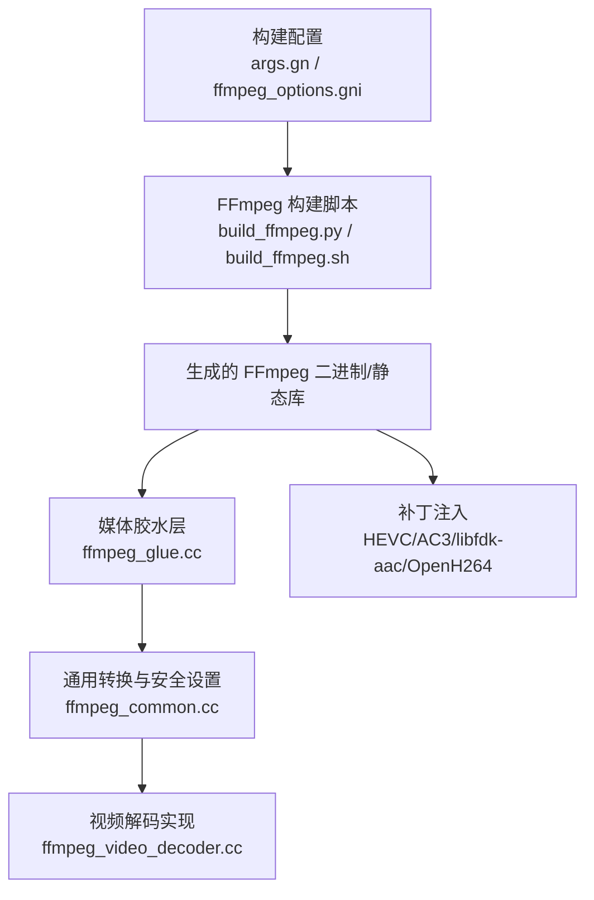
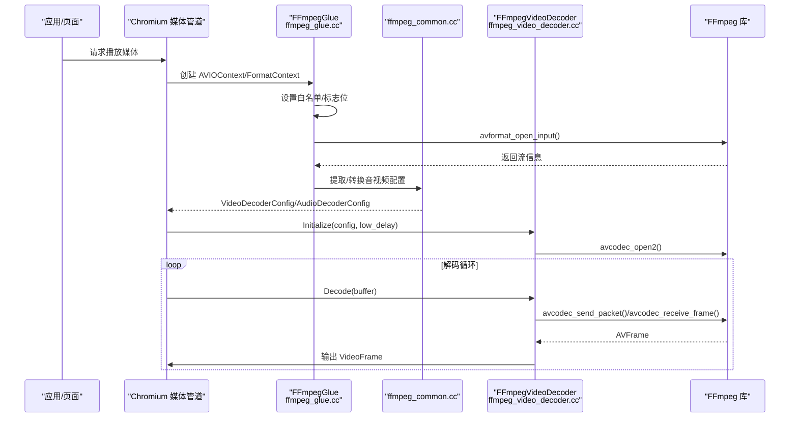
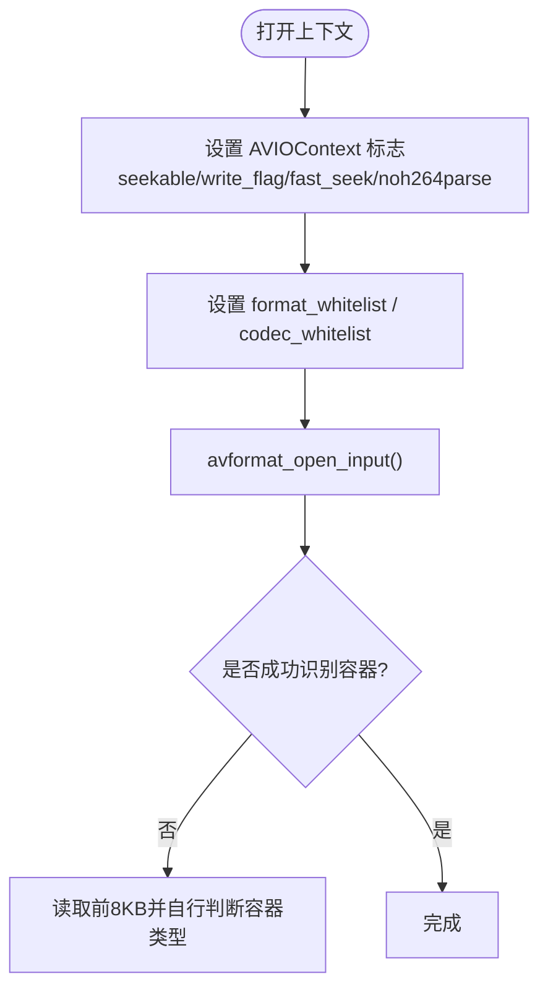
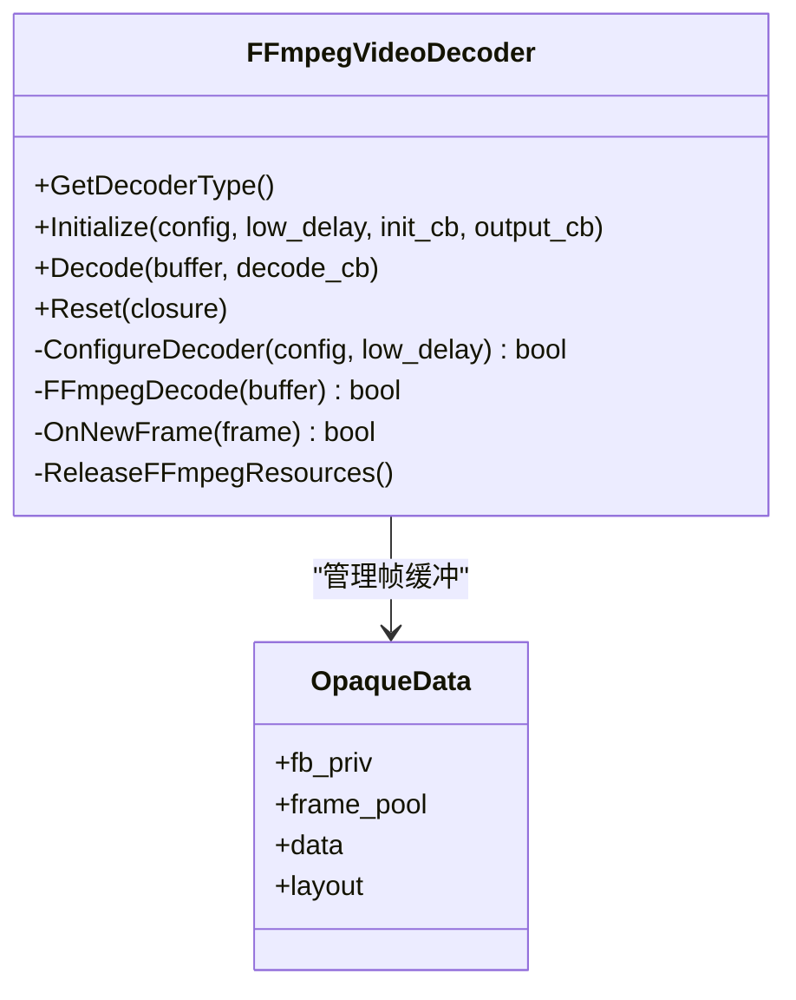
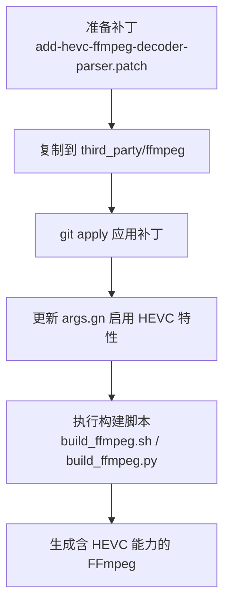
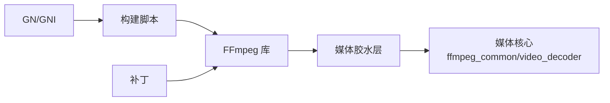

# FFmpeg 集成

<cite>
**本文引用的文件**
- [args.gn](file://args.gn)
- [ffmpeg_options.gni](file://src/third_party/ffmpeg/ffmpeg_options.gni)
- [ffmpeg_common.cc](file://src/media/ffmpeg/ffmpeg_common.cc)
- [ffmpeg_glue.cc](file://src/media/filters/ffmpeg_glue.cc)
- [ffmpeg_video_decoder.cc](file://src/media/filters/ffmpeg_video_decoder.cc)
- [build_ffmpeg.sh](file://infra/build_ffmpeg.sh)
- [build_ffmpeg.py](file://other/build_ffmpeg.py)
- [add-hevc-ffmpeg-decoder-parser.patch](file://other/add-hevc-ffmpeg-decoder-parser.patch)
- [ffmpeg_hevc_ac3.patch](file://other/ffmpeg_hevc_ac3.patch)
- [Enable-support-for-libfdk-aac-and-OpenH264.patch](file://infra/Flatpak/com.mcloud.browser/patches/ffmpeg/Enable-support-for-libfdk-aac-and-OpenH264.patch)
- [Update-build-configuration.patch](file://infra/Flatpak/com.mcloud.browser/patches/ffmpeg/Update-build-configuration.patch)
- [setup.sh](file://setup.sh)
</cite>

## 目录
1. [简介](#简介)
2. [项目结构](#项目结构)
3. [核心组件](#核心组件)
4. [架构总览](#架构总览)
5. [详细组件分析](#详细组件分析)
6. [依赖关系分析](#依赖关系分析)
7. [性能考量](#性能考量)
8. [故障排查指南](#故障排查指南)
9. [结论](#结论)
10. [附录](#附录)

## 简介
本文件面向 MCloud Browser 的 FFmpeg 集成，系统性说明 FFmpeg 库在 Chromium 媒体框架中的构建、配置与对接机制。内容涵盖：
- FFmpeg 的构建流程与 GN/GNI 配置项
- 自定义编解码器（如 HEVC、AC3/EAC3、libfdk-aac、OpenH264）的启用与补丁方法
- 与 Chromium 媒体管道的对接：解复用、编码器注册、解码器初始化、帧缓冲管理
- 扩展新编解码格式的完整路径（补丁 + 编译配置）
- 版本管理与兼容性策略
- 常见问题诊断与解决

## 项目结构
MCloud Browser 对 FFmpeg 的集成涉及三层：
- 构建层：GN/GNI 参数与脚本控制 FFmpeg 特性裁剪、平台适配与第三方库链接
- 媒体层：Chromium media 模块通过 ffmpeg_glue、ffmpeg_common、ffmpeg_video_decoder 等桥接 FFmpeg
- 补丁层：针对特定平台/版本的补丁，启用或修正编解码能力

**图示来源**
- [args.gn:45-87](file://args.gn#L45-L87)
- [ffmpeg_options.gni:30-81](file://src/third_party/ffmpeg/ffmpeg_options.gni#L30-L81)
- [build_ffmpeg.sh:42-50](file://infra/build_ffmpeg.sh#L42-L50)
- [build_ffmpeg.py:664-727](file://other/build_ffmpeg.py#L664-L727)

**章节来源**
- [args.gn:45-87](file://args.gn#L45-L87)
- [ffmpeg_options.gni:30-81](file://src/third_party/ffmpeg/ffmpeg_options.gni#L30-L81)
- [build_ffmpeg.sh:42-50](file://infra/build_ffmpeg.sh#L42-L50)
- [build_ffmpeg.py:664-727](file://other/build_ffmpeg.py#L664-L727)

## 核心组件
- 构建配置与开关
  - args.gn：启用媒体使用 FFmpeg、品牌化、视频解码器、平台特性（如 HEVC、AC3/EAC3、Dolby Vision、MPEG-H Audio、DTS）
  - ffmpeg_options.gni：决定 FFmpeg 品牌、组件模式、架构映射与 OS 配置
- 媒体胶水层
  - ffmpeg_glue.cc：封装 AVIOContext，限制可解复用容器与编解码器白名单，处理流式与非流式 I/O
  - ffmpeg_common.cc：安全设置（codec_whitelist）、时间基转换、音频/视频 CodecID 与格式互转、色彩空间推断
  - ffmpeg_video_decoder.cc：视频解码器生命周期、线程数策略、帧缓冲分配与释放、解码循环
- 补丁与扩展
  - add-hevc-ffmpeg-decoder-parser.patch：为多平台启用 HEVC 软件解码与解析器
  - ffmpeg_hevc_ac3.patch：启用 AC3/EAC3 解码、解析与解复用
  - Enable-support-for-libfdk-aac-and-OpenH264.patch：启用 libfdk-aac 与 OpenH264
  - Update-build-configuration.patch：统一版本信息与构建配置

**章节来源**
- [args.gn:45-87](file://args.gn#L45-L87)
- [ffmpeg_options.gni:30-81](file://src/third_party/ffmpeg/ffmpeg_options.gni#L30-L81)
- [ffmpeg_glue.cc:84-147](file://src/media/filters/ffmpeg_glue.cc#L84-L147)
- [ffmpeg_common.cc:64-89](file://src/media/ffmpeg/ffmpeg_common.cc#L64-L89)
- [ffmpeg_video_decoder.cc:118-123](file://src/media/filters/ffmpeg_video_decoder.cc#L118-L123)
- [add-hevc-ffmpeg-decoder-parser.patch:1-200](file://other/add-hevc-ffmpeg-decoder-parser.patch#L1-L200)
- [ffmpeg_hevc_ac3.patch:1-120](file://other/ffmpeg_hevc_ac3.patch#L1-L120)
- [Enable-support-for-libfdk-aac-and-OpenH264.patch:1-78](file://infra/Flatpak/com.mcloud.browser/patches/ffmpeg/Enable-support-for-libfdk-aac-and-OpenH264.patch#L1-L78)
- [Update-build-configuration.patch:434-713](file://infra/Flatpak/com.mcloud.browser/patches/ffmpeg/Update-build-configuration.patch#L434-L713)

## 架构总览
下图展示从媒体数据到解码输出的关键调用链，以及 FFmpeg 与 Chromium 媒体框架的交互点。

**图示来源**
- [ffmpeg_glue.cc:99-147](file://src/media/filters/ffmpeg_glue.cc#L99-L147)
- [ffmpeg_common.cc:511-533](file://src/media/ffmpeg/ffmpeg_common.cc#L511-L533)
- [ffmpeg_video_decoder.cc:227-263](file://src/media/filters/ffmpeg_video_decoder.cc#L227-L263)
- [ffmpeg_video_decoder.cc:347-389](file://src/media/filters/ffmpeg_video_decoder.cc#L347-L389)

## 详细组件分析

### 构建与配置（GN/GNI/脚本）
- args.gn 关键项
  - media_use_ffmpeg = true
  - ffmpeg_branding = "Chrome"
  - enable_ffmpeg_video_decoders = true
  - is_component_ffmpeg = false
  - 平台特性：enable_platform_hevc、enable_platform_ac3_eac3_audio、enable_platform_dolby_vision、enable_platform_mpeg_h_audio、enable_platform_dts_audio
- ffmpeg_options.gni
  - 根据当前 CPU/OS 选择 ffmpeg_arch 与 os_config
  - 支持 Chrome/Chromium/ChromeOS 品牌差异
- 构建脚本
  - infra/build_ffmpeg.sh：调用 autoninja 构建 third_party/ffmpeg 目标
  - other/build_ffmpeg.py：跨平台 configure 与 make，统一禁用无关功能，按平台追加工具链与优化选项

**章节来源**
- [args.gn:45-87](file://args.gn#L45-L87)
- [ffmpeg_options.gni:30-81](file://src/third_party/ffmpeg/ffmpeg_options.gni#L30-L81)
- [build_ffmpeg.sh:42-50](file://infra/build_ffmpeg.sh#L42-L50)
- [build_ffmpeg.py:664-727](file://other/build_ffmpeg.py#L664-L727)

### 媒体胶水层（解复用与白名单）
- 自定义 AVIO 回调：Read/Seek，适配流式与非流式资源
- 安全白名单：
  - format_whitelist：限定允许解复用的容器（ogg、matroska、wav、flac、mp3、mov、aac、ac3、eac3）
  - codec_whitelist：限制解码器，避免不安全或不必要的解码
- 快速/不准确 seek 与错误识别增强

**图示来源**
- [ffmpeg_glue.cc:99-147](file://src/media/filters/ffmpeg_glue.cc#L99-L147)
- [ffmpeg_glue.cc:149-224](file://src/media/filters/ffmpeg_glue.cc#L149-L224)

**章节来源**
- [ffmpeg_glue.cc:84-147](file://src/media/filters/ffmpeg_glue.cc#L84-L147)
- [ffmpeg_glue.cc:149-224](file://src/media/filters/ffmpeg_glue.cc#L149-L224)

### 通用转换与安全设置
- 时间基转换：AVRational 与 base::TimeDelta 互转
- 编解码 ID 映射：AudioCodec/VideoCodec 与 AVCodecID 双向转换
- 颜色空间推断：VP9/AV1/HEVC/H264 的特殊处理
- 安全设置：
  - 设置 codec_whitelist，必要时开启严格错误识别（AV_EF_EXPLODE）
  - 复制 extra_data 时遵循 FFmpeg 内存对齐与填充要求

**章节来源**
- [ffmpeg_common.cc:152-161](file://src/media/ffmpeg/ffmpeg_common.cc#L152-L161)
- [ffmpeg_common.cc:163-309](file://src/media/ffmpeg/ffmpeg_common.cc#L163-L309)
- [ffmpeg_common.cc:407-509](file://src/media/ffmpeg/ffmpeg_common.cc#L407-L509)
- [ffmpeg_common.cc:511-533](file://src/media/ffmpeg/ffmpeg_common.cc#L511-L533)

### 视频解码器（初始化、缓冲、解码循环）
- 初始化流程
  - 校验配置、创建 FrameBufferPool
  - 配置 AVCodecContext（线程数、线程类型、pkt_timebase）
  - 查找并打开解码器（avcodec_find_decoder/open2）
- 缓冲管理
  - 自定义 get_buffer2：按 FFmpeg 要求分配对齐内存，绑定释放回调
  - OpaqueData 记录帧池与布局，确保生命周期正确
- 解码循环
  - 将 DecoderBuffer 包装为 AVPacket 送入解码器
  - 接收 AVFrame，转换为 VideoFrame，设置色彩空间与可见区域
  - 状态机：Normal -> DecodeFinished/Error

**图示来源**
- [ffmpeg_video_decoder.cc:118-123](file://src/media/filters/ffmpeg_video_decoder.cc#L118-L123)
- [ffmpeg_video_decoder.cc:131-221](file://src/media/filters/ffmpeg_video_decoder.cc#L131-L221)
- [ffmpeg_video_decoder.cc:227-263](file://src/media/filters/ffmpeg_video_decoder.cc#L227-L263)
- [ffmpeg_video_decoder.cc:347-389](file://src/media/filters/ffmpeg_video_decoder.cc#L347-L389)
- [ffmpeg_video_decoder.cc:391-465](file://src/media/filters/ffmpeg_video_decoder.cc#L391-L465)
- [ffmpeg_video_decoder.cc:472-508](file://src/media/filters/ffmpeg_video_decoder.cc#L472-L508)

**章节来源**
- [ffmpeg_video_decoder.cc:118-123](file://src/media/filters/ffmpeg_video_decoder.cc#L118-L123)
- [ffmpeg_video_decoder.cc:131-221](file://src/media/filters/ffmpeg_video_decoder.cc#L131-L221)
- [ffmpeg_video_decoder.cc:227-263](file://src/media/filters/ffmpeg_video_decoder.cc#L227-L263)
- [ffmpeg_video_decoder.cc:347-389](file://src/media/filters/ffmpeg_video_decoder.cc#L347-L389)
- [ffmpeg_video_decoder.cc:391-465](file://src/media/filters/ffmpeg_video_decoder.cc#L391-L465)
- [ffmpeg_video_decoder.cc:472-508](file://src/media/filters/ffmpeg_video_decoder.cc#L472-L508)

### 扩展新编解码格式（以 HEVC 为例）
- 补丁要点
  - 在各平台 config.h/config_components.h 中启用 CONFIG_HEVCPARSE、CONFIG_HEVC_SEI、CONFIG_HEVC_DECODER
  - 在 codec_list/parser_list/demuxer_list 中注册对应组件
  - 更新 ffmpeg_generated.gni 加入相关源文件
- 构建配置
  - args.gn 中启用 enable_platform_hevc、enable_hevc_parser_and_hw_decoder
- 应用方式
  - setup.sh 或 win_scripts/setup.py 中将补丁复制到 third_party/ffmpeg 并 git apply

**图示来源**
- [add-hevc-ffmpeg-decoder-parser.patch:1-200](file://other/add-hevc-ffmpeg-decoder-parser.patch#L1-L200)
- [setup.sh:91-135](file://setup.sh#L91-L135)
- [args.gn:69-72](file://args.gn#L69-L72)

**章节来源**
- [add-hevc-ffmpeg-decoder-parser.patch:1-200](file://other/add-hevc-ffmpeg-decoder-parser.patch#L1-L200)
- [setup.sh:91-135](file://setup.sh#L91-L135)
- [args.gn:69-72](file://args.gn#L69-L72)

### 其他编解码扩展（AC3/EAC3、libfdk-aac、OpenH264）
- AC3/EAC3
  - ffmpeg_hevc_ac3.patch：启用 AC3/EAC3 解码、解析与解复用，并在各平台列表注册
- libfdk-aac 与 OpenH264
  - Enable-support-for-libfdk-aac-and-OpenH264.patch：Linux 下强制使用 libfdk-aac；当未使用 libx264 时使用 OpenH264
  - Update-build-configuration.patch：统一版本信息与部分构建配置

**章节来源**
- [ffmpeg_hevc_ac3.patch:1-120](file://other/ffmpeg_hevc_ac3.patch#L1-L120)
- [Enable-support-for-libfdk-aac-and-OpenH264.patch:1-78](file://infra/Flatpak/com.mcloud.browser/patches/ffmpeg/Enable-support-for-libfdk-aac-and-OpenH264.patch#L1-L78)
- [Update-build-configuration.patch:434-713](file://infra/Flatpak/com.mcloud.browser/patches/ffmpeg/Update-build-configuration.patch#L434-L713)

## 依赖关系分析
- 构建期依赖
  - GN/GNI：控制品牌、组件模式、架构与 OS 配置
  - Python 脚本：跨平台 configure/make，注入工具链与优化
- 运行期依赖
  - 媒体胶水层依赖 FFmpeg 的 AVFormat/AVCodec/AVUtil
  - 解码器依赖具体编解码实现（如 HEVC/AC3/libfdk-aac/OpenH264）
- 补丁依赖
  - 补丁需与 FFmpeg 源码版本匹配，否则可能无法应用或导致构建失败

**图示来源**
- [ffmpeg_options.gni:30-81](file://src/third_party/ffmpeg/ffmpeg_options.gni#L30-L81)
- [build_ffmpeg.py:664-727](file://other/build_ffmpeg.py#L664-L727)
- [ffmpeg_glue.cc:99-147](file://src/media/filters/ffmpeg_glue.cc#L99-L147)
- [ffmpeg_video_decoder.cc:227-263](file://src/media/filters/ffmpeg_video_decoder.cc#L227-L263)

**章节来源**
- [ffmpeg_options.gni:30-81](file://src/third_party/ffmpeg/ffmpeg_options.gni#L30-L81)
- [build_ffmpeg.py:664-727](file://other/build_ffmpeg.py#L664-L727)
- [ffmpeg_glue.cc:99-147](file://src/media/filters/ffmpeg_glue.cc#L99-L147)
- [ffmpeg_video_decoder.cc:227-263](file://src/media/filters/ffmpeg_video_decoder.cc#L227-L263)

## 性能考量
- 线程数策略：根据分辨率与编码类型动态计算线程数，平衡吞吐与延迟
- 缓冲与对齐：遵循 FFmpeg 的缓冲区大小与对齐要求，避免越界访问
- 快速 Seek：对 MP3 等启用快速但不精确的 seek，提升交互体验
- 错误识别：严格模式下启用 AV_EF_EXPLODE，尽早暴露损坏数据
- LTO/优化：构建时启用 LTO 与优化选项，减少体积与提升性能

[本节提供一般性指导，不直接分析具体文件]

## 故障排查指南
- 容器识别失败
  - 现象：avformat_open_input 返回无效数据
  - 处理：读取前 8KB 自行判断容器类型，记录日志并回退
  - 参考：ffmpeg_glue.cc 打开上下文后的回退逻辑
- 解码器不支持
  - 现象：Initialize 返回不支持配置
  - 处理：检查 args.gn 与补丁是否正确启用相应编解码器
- 内存不足/分配失败
  - 现象：Decode 返回 OutOfMemory
  - 处理：检查帧池容量与对齐分配逻辑
- 颜色空间异常
  - 现象：色彩偏移或 HDR 失效
  - 处理：检查 ffmpeg_common.cc 的颜色空间推断与特殊处理分支

**章节来源**
- [ffmpeg_glue.cc:149-224](file://src/media/filters/ffmpeg_glue.cc#L149-L224)
- [ffmpeg_video_decoder.cc:227-263](file://src/media/filters/ffmpeg_video_decoder.cc#L227-L263)
- [ffmpeg_video_decoder.cc:347-389](file://src/media/filters/ffmpeg_video_decoder.cc#L347-L389)
- [ffmpeg_common.cc:593-779](file://src/media/ffmpeg/ffmpeg_common.cc#L593-L779)

## 结论
MCloud Browser 通过 GN/GNI 与脚本精细控制 FFmpeg 的构建与特性，结合媒体胶水层的安全白名单与缓冲管理，实现了稳定高效的媒体播放。通过补丁体系，可按需扩展 HEVC、AC3/EAC3、libfdk-aac、OpenH264 等编解码能力。建议在升级 FFmpeg 版本时同步评估补丁兼容性与 GN/GNI 配置变更，确保功能与性能稳定。

[本节总结性内容，不直接分析具体文件]

## 附录
- 常用 GN/GNI 键值
  - media_use_ffmpeg：启用 FFmpeg 媒体后端
  - ffmpeg_branding：品牌化（Chromium/Chrome/ChromeOS）
  - enable_ffmpeg_video_decoders：启用视频解码器
  - is_component_ffmpeg：是否以组件形式构建 FFmpeg
  - enable_platform_hevc/ac3_eac3_audio/dolby_vision/mpeg_h_audio/dts_audio：平台特性开关
- 补丁位置与引用
  - other/add-hevc-ffmpeg-decoder-parser.patch
  - other/ffmpeg_hevc_ac3.patch
  - infra/Flatpak/.../patches/ffmpeg/*.patch
- 构建入口
  - infra/build_ffmpeg.sh：调用 autoninja 构建 FFmpeg
  - other/build_ffmpeg.py：跨平台 configure/make

[本节提供补充信息，不直接分析具体文件]