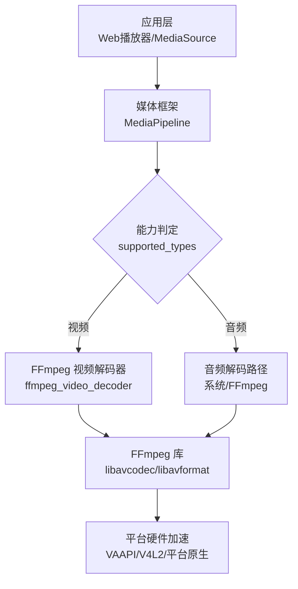
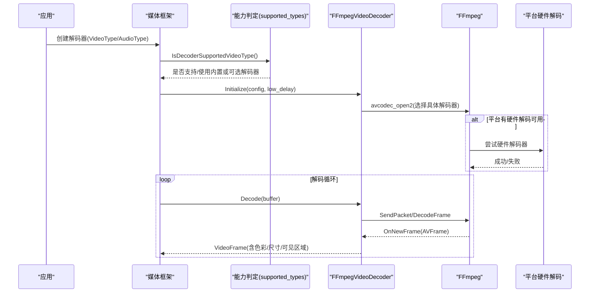
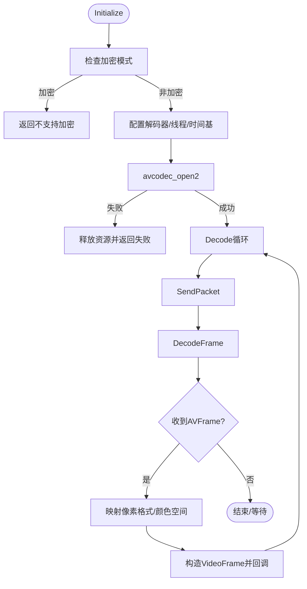

# 编解码器支持

<cite>
**本文引用的文件**
- [src/media/base/media_switches.cc](file://src/media/base/media_switches.cc)
- [src/media/base/supported_types.cc](file://src/media/base/supported_types.cc)
- [src/media/ffmpeg/ffmpeg_common.cc](file://src/media/ffmpeg/ffmpeg_common.cc)
- [src/media/filters/ffmpeg_video_decoder.cc](file://src/media/filters/ffmpeg_video_decoder.cc)
- [args.gn](file://args.gn)
- [other/add-hevc-ffmpeg-decoder-parser.patch](file://other/add-hevc-ffmpeg-decoder-parser.patch)
- [other/ffmpeg_hevc_ac3.patch](file://other/ffmpeg_hevc_ac3.patch)
- [infra/DEBUG/mac_ARM_debug_args.gn](file://infra/DEBUG/mac_ARM_debug_args.gn)
</cite>

## 目录
1. [简介](#简介)
2. [项目结构](#项目结构)
3. [核心组件](#核心组件)
4. [架构总览](#架构总览)
5. [详细组件分析](#详细组件分析)
6. [依赖关系分析](#依赖关系分析)
7. [性能考量](#性能考量)
8. [故障排除指南](#故障排除指南)
9. [结论](#结论)
10. [附录：启用/禁用特定编解码器的方法](#附录启用禁用特定编解码器的方法)

## 简介
本文件系统性说明 MCloud Browser 对视频与音频编解码器的软解/硬解实现、FFmpeg 集成方案、平台选择策略与优先级机制，并提供兼容性测试方法与故障排除指南。重点覆盖以下格式：
- 视频：HEVC/H.265、VP9、AV1、H.264/AVC
- 音频：AC3、DTS、MPEG-H、Opus 等

## 项目结构
围绕媒体播放的关键代码集中在 media 子系统中，并通过构建开关（GN args）控制各平台的特性与第三方库集成：
- 媒体能力与开关定义：media/base/media_switches.cc
- 默认解码/编码能力判定：media/base/supported_types.cc
- FFmpeg 通用工具与允许列表：media/ffmpeg/ffmpeg_common.cc
- FFmpeg 视频解码器实现：media/filters/ffmpeg_video_decoder.cc
- 全局构建配置：args.gn 及各平台 GN 参数文件
- FFmpeg 补丁：用于在 Chromium 的 FFmpeg 中启用 HEVC/AC3/EAC3 等

图表来源
- [src/media/base/supported_types.cc:423-458](file://src/media/base/supported_types.cc#L423-L458)
- [src/media/filters/ffmpeg_video_decoder.cc:118-123](file://src/media/filters/ffmpeg_video_decoder.cc#L118-L123)
- [src/media/ffmpeg/ffmpeg_common.cc:1051-1065](file://src/media/ffmpeg/ffmpeg_common.cc#L1051-L1065)

章节来源
- [args.gn:45-79](file://args.gn#L45-L79)
- [src/media/base/media_switches.cc:386-400](file://src/media/base/media_switches.cc#L386-L400)

## 核心组件
- 媒体能力判定（supported_types）：根据编译期宏与运行时平台能力，决定某 VideoType/AudioType 是否可被内置或可选解码器支持。
- FFmpeg 视频解码器（ffmpeg_video_decoder）：封装 AVCodecContext/AVFrame 生命周期、线程数、像素格式、颜色空间处理，并对接解码循环。
- FFmpeg 公共工具（ffmpeg_common）：维护允许的音频解码器白名单、时间戳转换、错误码转字符串等。
- 媒体开关（media_switches）：定义大量 BASE_FEATURE 与命令行开关，控制 HEVC 硬件解码、Linux 加速、MSE 行为等。

章节来源
- [src/media/base/supported_types.cc:423-585](file://src/media/base/supported_types.cc#L423-L585)
- [src/media/filters/ffmpeg_video_decoder.cc:64-123](file://src/media/filters/ffmpeg_video_decoder.cc#L64-L123)
- [src/media/ffmpeg/ffmpeg_common.cc:1051-1065](file://src/media/ffmpeg/ffmpeg_common.cc#L1051-L1065)
- [src/media/base/media_switches.cc:386-400](file://src/media/base/media_switches.cc#L386-L400)

## 架构总览
下图展示从“请求解码”到“输出帧”的主流程，以及平台硬件加速的介入点：

图表来源
- [src/media/base/supported_types.cc:423-458](file://src/media/base/supported_types.cc#L423-L458)
- [src/media/filters/ffmpeg_video_decoder.cc:227-263](file://src/media/filters/ffmpeg_video_decoder.cc#L227-L263)
- [src/media/filters/ffmpeg_video_decoder.cc:347-389](file://src/media/filters/ffmpeg_video_decoder.cc#L347-L389)

## 详细组件分析

### 视频编解码器支持矩阵与优先级
- H.264/AVC：通过 FFmpeg 内置解码器支持；当启用 USE_PROPRIETARY_CODECS 且 enable_ffmpeg_video_decoders 时，视为内置支持。
- HEVC/H.265：同时具备 FFmpeg 软件解码与平台硬件解码能力；通过补丁为 FFmpeg 加入 hevc decoder/parser，并在 supported_types 中放行 HEVC 解码。
- VP9：由 libvpx 提供软件解码；supported_types 中对高比特深度进行条件支持。
- AV1：由 ENABLE_AV1_DECODER 控制；Android Q+ 有额外支持逻辑。
- Dolby Vision：在启用平台 HEVC 与可选 HEVC 解码支持时，按 profile 缓存判断。

章节来源
- [src/media/base/supported_types.cc:231-304](file://src/media/base/supported_types.cc#L231-L304)
- [src/media/base/supported_types.cc:568-585](file://src/media/base/supported_types.cc#L568-L585)
- [other/add-hevc-ffmpeg-decoder-parser.patch:1957-2160](file://other/add-hevc-ffmpeg-decoder-parser.patch#L1957-L2160)

### 音频编解码器支持矩阵与优先级
- Opus：默认允许（libopus），可通过 kDirectOpusAudioDecoding 切换至专用解码路径。
- AC3/EAC3：通过 USE_PROPRIETARY_CODECS 与平台开关 enable_platform_ac3_eac3_audio 启用；FFmpeg 侧通过补丁开启 AC3/EAC3 解码器、解析器与 demuxer。
- DTS：通过 ENABLE_PLATFORM_DTS_AUDIO 控制；supported_types 中针对 DTS/DTSXP2/DTSE 返回对应平台能力。
- MPEG-H：通过 ENABLE_PLATFORM_MPEG_H_AUDIO 控制；supported_types 中将其归入专有音频类型，需平台能力支持。
- AAC：在非 XHE-AAC profile 下默认支持；XHE-AAC 需要 Mojo 音频解码器与平台能力。

章节来源
- [src/media/ffmpeg/ffmpeg_common.cc:1051-1065](file://src/media/ffmpeg/ffmpeg_common.cc#L1051-L1065)
- [src/media/base/supported_types.cc:283-329](file://src/media/base/supported_types.cc#L283-L329)
- [src/media/base/supported_types.cc:460-500](file://src/media/base/supported_types.cc#L460-L500)
- [other/ffmpeg_hevc_ac3.patch:88-120](file://other/ffmpeg_hevc_ac3.patch#L88-L120)

### FFmpeg 集成方案与自定义编解码器添加
- 启用 FFmpeg 视频解码器：args.gn 中 enable_ffmpeg_video_decoders = true。
- 启用专有编解码：proprietary_codecs = true，使 H.264/HEVC/AC3/EAC3 等纳入内置能力。
- 为 FFmpeg 添加新解码器/解析器：
  - 修改 config.h/config_components.h 中的 CONFIG_* 宏以启用相应模块。
  - 将解码器指针加入 codec_list.c，解析器加入 parser_list.c，必要时更新 ffmpeg_generated.gni 以包含源文件。
  - 示例参考：为 HEVC 添加 decoder/parser 的补丁；为 AC3/EAC3 添加解码器/解析器/demuxer 的补丁。

章节来源
- [args.gn:45-79](file://args.gn#L45-L79)
- [other/add-hevc-ffmpeg-decoder-parser.patch:1957-2160](file://other/add-hevc-ffmpeg-decoder-parser.patch#L1957-L2160)
- [other/ffmpeg_hevc_ac3.patch:88-120](file://other/ffmpeg_hevc_ac3.patch#L88-L120)

### 平台选择策略与优先级机制
- Linux 硬件加速：BASE_FEATURE(kAcceleratedVideoDecodeLinux) 控制 VAAPI/V4L2 解码启用；NVIDIA GPU 默认关闭 VA-API 以避免驱动问题。
- HEVC 硬件解码：BASE_FEATURE(kPlatformHEVCDecoderSupport) 控制；Windows/macOS/Android 上还可启用 HEVC 编码。
- Android：VP9/AV1 在较新版本要求更高 profile/color space 支持；AAC XHE-AAC 需 Mojo 音频解码器。
- 安全/受保护内容：可通过 --override-hardware-secure-codecs-for-testing 指定测试用硬件安全编解码器集合。

章节来源
- [src/media/base/media_switches.cc:386-400](file://src/media/base/media_switches.cc#L386-L400)
- [src/media/base/media_switches.cc:742-777](file://src/media/base/media_switches.cc#L742-L777)
- [src/media/base/media_switches.cc:173-187](file://src/media/base/media_switches.cc#L173-L187)
- [src/media/base/supported_types.cc:240-281](file://src/media/base/supported_types.cc#L240-L281)

### FFmpeg 视频解码器关键流程
- 初始化：检查加密模式、配置解码器、设置线程数与线程类型、打开具体 AVCodec。
- 解码循环：发送 AVPacket，处理 AVFrame，映射像素格式与颜色空间，构造 VideoFrame 回调上层。
- 资源管理：基于 FrameBufferPool 分配/释放 AVFrame 缓冲，避免越界与未初始化内存。

图表来源
- [src/media/filters/ffmpeg_video_decoder.cc:227-263](file://src/media/filters/ffmpeg_video_decoder.cc#L227-L263)
- [src/media/filters/ffmpeg_video_decoder.cc:347-389](file://src/media/filters/ffmpeg_video_decoder.cc#L347-L389)
- [src/media/filters/ffmpeg_video_decoder.cc:391-465](file://src/media/filters/ffmpeg_video_decoder.cc#L391-L465)

## 依赖关系分析
- supported_types 依赖 media_switches 的 BASE_FEATURE 与构建宏，决定各编解码器是否可用。
- ffmpeg_video_decoder 依赖 ffmpeg_common 的时间戳/错误码工具，并调用 FFmpeg API。
- 构建配置 args.gn 统一启用 FFmpeg、专有编解码、平台 HEVC、VA-API 等。

图表来源
- [args.gn:45-79](file://args.gn#L45-L79)
- [src/media/base/media_switches.cc:386-400](file://src/media/base/media_switches.cc#L386-L400)
- [src/media/base/supported_types.cc:423-585](file://src/media/base/supported_types.cc#L423-L585)
- [src/media/filters/ffmpeg_video_decoder.cc:118-123](file://src/media/filters/ffmpeg_video_decoder.cc#L118-L123)
- [src/media/ffmpeg/ffmpeg_common.cc:1051-1065](file://src/media/ffmpeg/ffmpeg_common.cc#L1051-L1065)

章节来源
- [args.gn:45-79](file://args.gn#L45-L79)
- [src/media/base/media_switches.cc:386-400](file://src/media/base/media_switches.cc#L386-L400)
- [src/media/base/supported_types.cc:423-585](file://src/media/base/supported_types.cc#L423-L585)
- [src/media/filters/ffmpeg_video_decoder.cc:118-123](file://src/media/filters/ffmpeg_video_decoder.cc#L118-L123)
- [src/media/ffmpeg/ffmpeg_common.cc:1051-1065](file://src/media/ffmpeg/ffmpeg_common.cc#L1051-L1065)

## 性能考量
- 线程数：FFmpeg 视频解码器根据分辨率动态计算线程数，1080p 约 3 线程，按比例缩放。
- 颜色空间：优先使用帧内色彩信息，必要时回退到配置；对 H.264 特殊场景做兼容处理。
- 硬件加速：Linux 上默认启用 VAAPI/V4L2；NVIDIA GPU 默认关闭 VA-API 以避免崩溃。
- 内存管理：使用 FrameBufferPool 零初始化分配，避免未初始化值导致的解码异常。

章节来源
- [src/media/filters/ffmpeg_video_decoder.cc:64-99](file://src/media/filters/ffmpeg_video_decoder.cc#L64-L99)
- [src/media/filters/ffmpeg_video_decoder.cc:430-458](file://src/media/filters/ffmpeg_video_decoder.cc#L430-L458)
- [src/media/base/media_switches.cc:742-777](file://src/media/base/media_switches.cc#L742-L777)
- [src/media/filters/ffmpeg_video_decoder.cc:238-243](file://src/media/filters/ffmpeg_video_decoder.cc#L238-L243)

## 故障排除指南
- 无法播放 HEVC：
  - 确认已启用 FFmpeg HEVC decoder/parser（补丁已添加）。
  - 检查平台是否启用 HEVC 硬件解码（kPlatformHEVCDecoderSupport）。
  - 若硬件不可用，应回退到 FFmpeg 软件解码。
- 无法播放 AC3/EAC3：
  - 确认 USE_PROPRIETORY_CODECS 与 enable_platform_ac3_eac3_audio 已启用。
  - 检查 FFmpeg 侧是否启用了 AC3/EAC3 解码器/解析器/demuxer（补丁已添加）。
- VP9/AV1 不工作：
  - 检查 color space 与 profile 是否受支持（supported_types 中校验）。
  - Android 上注意 SDK 版本要求。
- 硬件解码不稳定：
  - Linux 上 NVIDIA GPU 默认关闭 VA-API；如需启用请调整相关 feature flag。
  - 可使用 --override-hardware-secure-codecs-for-testing 进行调试。

章节来源
- [other/add-hevc-ffmpeg-decoder-parser.patch:1957-2160](file://other/add-hevc-ffmpeg-decoder-parser.patch#L1957-L2160)
- [other/ffmpeg_hevc_ac3.patch:88-120](file://other/ffmpeg_hevc_ac3.patch#L88-L120)
- [src/media/base/media_switches.cc:742-777](file://src/media/base/media_switches.cc#L742-L777)
- [src/media/base/media_switches.cc:173-187](file://src/media/base/media_switches.cc#L173-L187)

## 结论
MCloud Browser 通过统一的媒体能力判定、FFmpeg 集成与平台硬件加速，提供了对主流视频与音频格式的广泛支持。构建期开关与运行时特性标志共同决定了最终可用的编解码器集合。通过补丁与 GN 参数，可在不同平台上灵活启用/禁用特定功能，确保兼容性与性能平衡。

## 附录：启用/禁用特定编解码器的方法
- 启用/禁用 FFmpeg 视频解码器：
  - 在 args.gn 中设置 enable_ffmpeg_video_decoders = true/false。
- 启用/禁用专有编解码（如 H.264/HEVC/AC3/EAC3）：
  - 在 args.gn 中设置 proprietary_codecs = true/false。
- 启用/禁用平台 HEVC 解码：
  - 在 args.gn 中设置 enable_platform_hevc = true/false。
- 启用/禁用 AC3/EAC3 音频：
  - 在 args.gn 中设置 enable_platform_ac3_eac3_audio = true/false。
- 启用/禁用 DTS 音频：
  - 在 args.gn 中设置 enable_platform_dts_audio = true/false。
- 启用/禁用 MPEG-H 音频：
  - 在 args.gn 中设置 enable_platform_mpeg_h_audio = true/false。
- 运行时调试：
  - 使用 --override-hardware-secure-codecs-for-testing 指定测试用硬件安全编解码器集合。
  - 使用 --video-threads 调整视频解码线程数。

章节来源
- [args.gn:45-79](file://args.gn#L45-L79)
- [src/media/base/media_switches.cc:173-187](file://src/media/base/media_switches.cc#L173-L187)
- [src/media/base/media_switches.cc:229-230](file://src/media/base/media_switches.cc#L229-L230)