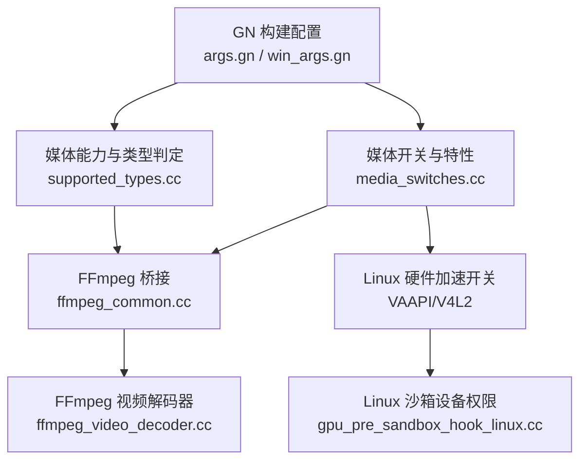
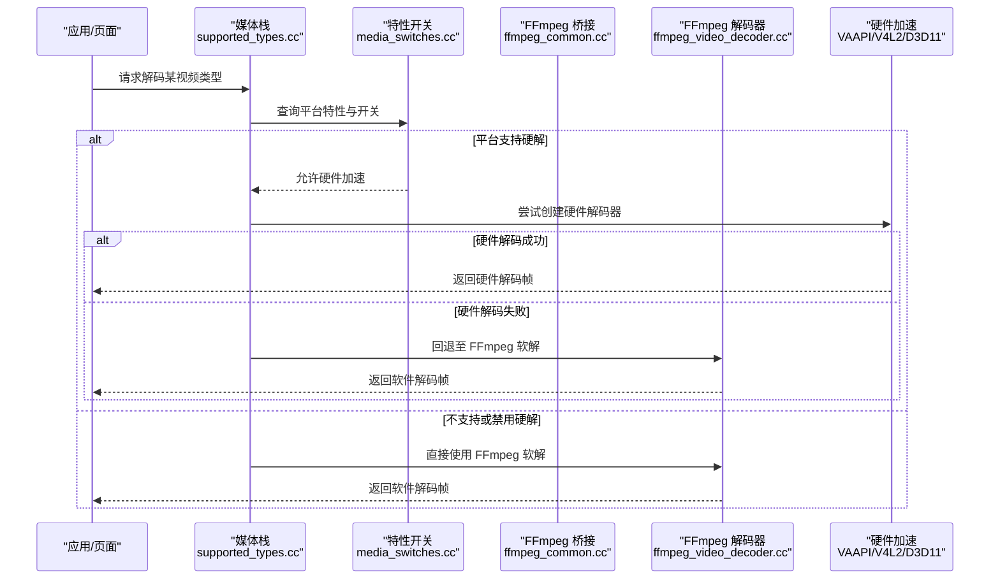
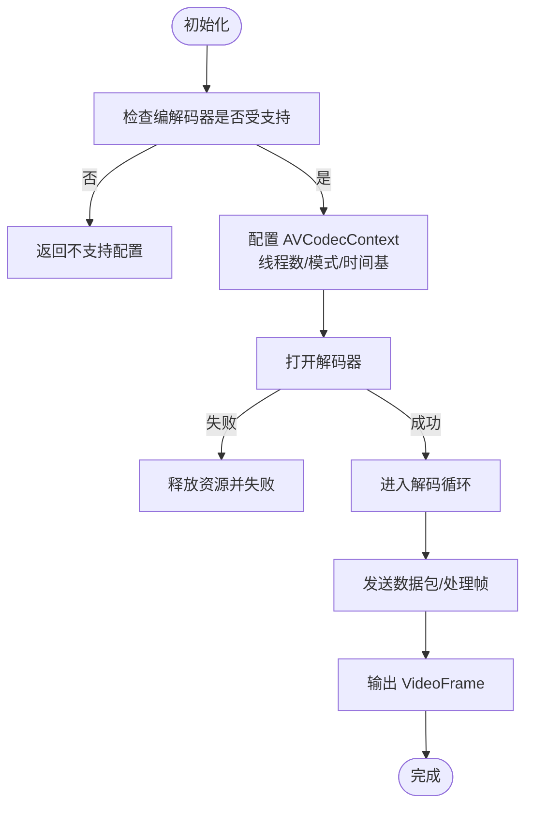
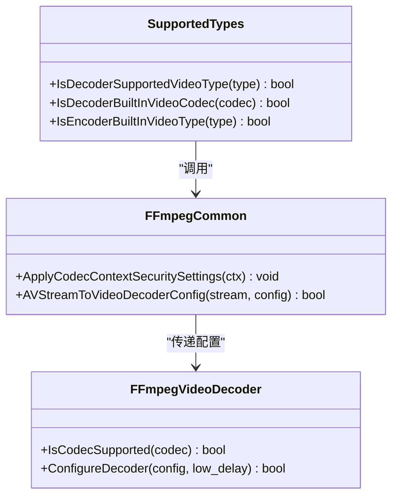
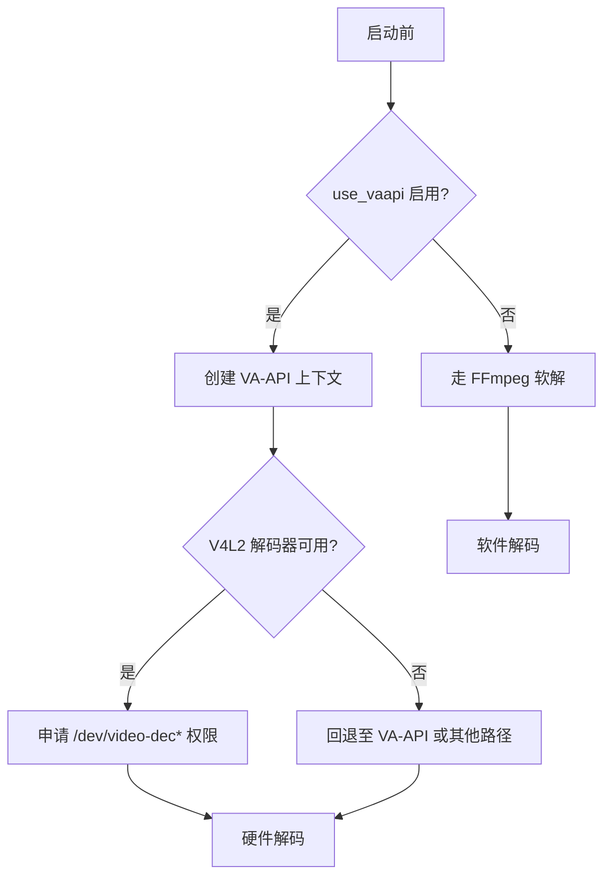

# 视频编解码器

本文引用的文件

- [args.gn](https://github.com/Mcloud136/Mcloud-Browser/blob/main/args.gn)
- [win_args.gn](https://github.com/Mcloud136/Mcloud-Browser/blob/main/win_args.gn)
- [src/media/base/media_switches.cc](https://github.com/Mcloud136/Mcloud-Browser/blob/main/src/media/base/media_switches.cc)
- [src/media/base/supported_types.cc](https://github.com/Mcloud136/Mcloud-Browser/blob/main/src/media/base/supported_types.cc)
- [src/media/ffmpeg/ffmpeg_common.cc](https://github.com/Mcloud136/Mcloud-Browser/blob/main/src/media/ffmpeg/ffmpeg_common.cc)
- [src/media/filters/ffmpeg_video_decoder.cc](https://github.com/Mcloud136/Mcloud-Browser/blob/main/src/media/filters/ffmpeg_video_decoder.cc)
- [src/content/common/gpu_pre_sandbox_hook_linux.cc](https://github.com/Mcloud136/Mcloud-Browser/blob/main/src/content/common/gpu_pre_sandbox_hook_linux.cc)

## 目录
1. [简介](#简介)
2. [项目结构](#项目结构)
3. [核心组件](#核心组件)
4. [架构总览](#架构总览)
5. [详细组件分析](#详细组件分析)
6. [依赖关系分析](#依赖关系分析)
7. [性能考量](#性能考量)
8. [故障排查指南](#故障排查指南)
9. [结论](#结论)
10. [附录：运行时与编译期配置示例](#附录：运行时与编译期配置示例)

## 简介
本文件系统性梳理 MCloud Browser 的视频编解码能力，覆盖 HEVC/H.265、VP9、AV1、H.264/AVC 等格式的软解与硬解实现，说明不同平台（Windows、Linux）的硬件加速支持情况（如 Windows D3D11、Linux VAAPI/V4L2），解释编解码器的选择策略与优先级机制，并给出在运行时切换解码器以及通过命令行参数和编译选项启用/禁用特定功能的实践方法。

## 项目结构
MCloud Browser 基于 Chromium 媒体栈，视频编解码相关的关键位置包括：
- 构建与特性开关：根级 GN 配置文件集中控制是否启用 FFmpeg、libvpx、VA-API、HEVC 平台能力等。
- 媒体能力探测与类型判定：media/base 下负责声明支持的音视频类型、HDR/色彩空间校验、内置编码器/解码器能力。
- FFmpeg 封装层：media/ffmpeg 提供与 FFmpeg 的桥接、安全白名单、时间基转换、像素格式映射等。
- 解码器实现：media/filters 下的 FFmpegVideoDecoder 负责 H.264/H.265 的软解流程、线程数策略、缓冲池管理。
- Linux 沙箱设备权限：content/common 中为 V4L2 解码器预留设备节点访问权限。

**图示来源**
- [args.gn:45-79](https://github.com/Mcloud136/Mcloud-Browser/blob/main/args.gn#L45-L79)
- [win_args.gn:43-80](https://github.com/Mcloud136/Mcloud-Browser/blob/main/win_args.gn#L43-L80)
- [src/media/base/supported_types.cc:423-458](https://github.com/Mcloud136/Mcloud-Browser/blob/main/src/media/base/supported_types.cc#L423-L458)
- [src/media/base/media_switches.cc:742-777](https://github.com/Mcloud136/Mcloud-Browser/blob/main/src/media/base/media_switches.cc#L742-L777)
- [src/media/ffmpeg/ffmpeg_common.cc:64-89](https://github.com/Mcloud136/Mcloud-Browser/blob/main/src/media/ffmpeg/ffmpeg_common.cc#L64-L89)
- [src/media/filters/ffmpeg_video_decoder.cc:118-123](https://github.com/Mcloud136/Mcloud-Browser/blob/main/src/media/filters/ffmpeg_video_decoder.cc#L118-L123)
- [src/content/common/gpu_pre_sandbox_hook_linux.cc:121-149](https://github.com/Mcloud136/Mcloud-Browser/blob/main/src/content/common/gpu_pre_sandbox_hook_linux.cc#L121-L149)

**章节来源**
- [args.gn:45-79](https://github.com/Mcloud136/Mcloud-Browser/blob/main/args.gn#L45-L79)
- [win_args.gn:43-80](https://github.com/Mcloud136/Mcloud-Browser/blob/main/win_args.gn#L43-L80)
- [src/media/base/supported_types.cc:423-458](https://github.com/Mcloud136/Mcloud-Browser/blob/main/src/media/base/supported_types.cc#L423-L458)
- [src/media/base/media_switches.cc:742-777](https://github.com/Mcloud136/Mcloud-Browser/blob/main/src/media/base/media_switches.cc#L742-L777)
- [src/media/ffmpeg/ffmpeg_common.cc:64-89](https://github.com/Mcloud136/Mcloud-Browser/blob/main/src/media/ffmpeg/ffmpeg_common.cc#L64-L89)
- [src/media/filters/ffmpeg_video_decoder.cc:118-123](https://github.com/Mcloud136/Mcloud-Browser/blob/main/src/media/filters/ffmpeg_video_decoder.cc#L118-L123)
- [src/content/common/gpu_pre_sandbox_hook_linux.cc:121-149](https://github.com/Mcloud136/Mcloud-Browser/blob/main/src/content/common/gpu_pre_sandbox_hook_linux.cc#L121-L149)

## 核心组件
- 构建与特性开关（GN）
  - 启用 FFmpeg 与 libvpx：用于软解 VP8/VP9/AV1 及 H.264/H.265（当启用专有编解码时）。
  - 启用 VA-API：Linux 上开启硬件加速解码路径。
  - 启用平台 HEVC：Windows/Linux/macOS 等平台可启用系统级 HEVC 解码/编码能力。
- 媒体能力与类型判定
  - 根据编译标志与运行时环境判断各编解码器是否可用，包含 HDR/色彩空间校验。
  - 对 AV1、VP9、HEVC 等分别有专门的 profile 支持检查。
- FFmpeg 桥接与安全
  - 设置 FFmpeg 解码器白名单（例如仅允许 h264/hevc），增强安全性。
  - 处理时间基、像素格式、颜色空间、alpha 通道等元数据转换。
- FFmpeg 视频解码器
  - 当前实现聚焦 H.264/H.265 软解，按分辨率动态调整线程数。
  - 使用 FrameBufferPool 管理输出帧缓冲，避免越界读取/写入。
- Linux 硬件加速与沙箱
  - 通过 media_switches 暴露 Linux 上的 VAAPI/V4L2 加速开关。
  - 沙箱预授权 video-dec*/media-dec* 设备节点，供 V4L2 解码器使用。

**章节来源**
- [args.gn:45-79](https://github.com/Mcloud136/Mcloud-Browser/blob/main/args.gn#L45-L79)
- [win_args.gn:43-80](https://github.com/Mcloud136/Mcloud-Browser/blob/main/win_args.gn#L43-L80)
- [src/media/base/supported_types.cc:231-281](https://github.com/Mcloud136/Mcloud-Browser/blob/main/src/media/base/supported_types.cc#L231-L281)
- [src/media/base/supported_types.cc:423-458](https://github.com/Mcloud136/Mcloud-Browser/blob/main/src/media/base/supported_types.cc#L423-L458)
- [src/media/ffmpeg/ffmpeg_common.cc:64-89](https://github.com/Mcloud136/Mcloud-Browser/blob/main/src/media/ffmpeg/ffmpeg_common.cc#L64-L89)
- [src/media/filters/ffmpeg_video_decoder.cc:64-99](https://github.com/Mcloud136/Mcloud-Browser/blob/main/src/media/filters/ffmpeg_video_decoder.cc#L64-L99)
- [src/media/filters/ffmpeg_video_decoder.cc:118-123](https://github.com/Mcloud136/Mcloud-Browser/blob/main/src/media/filters/ffmpeg_video_decoder.cc#L118-L123)
- [src/media/base/media_switches.cc:742-777](https://github.com/Mcloud136/Mcloud-Browser/blob/main/src/media/base/media_switches.cc#L742-L777)
- [src/content/common/gpu_pre_sandbox_hook_linux.cc:121-149](https://github.com/Mcloud136/Mcloud-Browser/blob/main/src/content/common/gpu_pre_sandbox_hook_linux.cc#L121-L149)

## 架构总览
下图展示了从构建配置到运行时解码的关键路径，包括软解（FFmpeg）与硬解（平台/VA-API/V4L2）的选择与协作。

**图示来源**
- [src/media/base/supported_types.cc:423-458](https://github.com/Mcloud136/Mcloud-Browser/blob/main/src/media/base/supported_types.cc#L423-L458)
- [src/media/base/media_switches.cc:742-777](https://github.com/Mcloud136/Mcloud-Browser/blob/main/src/media/base/media_switches.cc#L742-L777)
- [src/media/ffmpeg/ffmpeg_common.cc:64-89](https://github.com/Mcloud136/Mcloud-Browser/blob/main/src/media/ffmpeg/ffmpeg_common.cc#L64-L89)
- [src/media/filters/ffmpeg_video_decoder.cc:118-123](https://github.com/Mcloud136/Mcloud-Browser/blob/main/src/media/filters/ffmpeg_video_decoder.cc#L118-L123)

## 详细组件分析

### FFmpeg 视频解码器（H.264/H.265 软解）
- 能力检测：仅对 H.264/H.265 启用 FFmpeg 解码器，且需满足内置解码器条件。
- 线程策略：根据分辨率估算线程数，1080p 约 3 线程，按比例缩放；其他编解码器未在此路径启用。
- 缓冲管理：自定义 get_buffer2 回调，使用 FrameBufferPool 分配对齐的 YUV 平面缓冲，避免越界。
- 初始化流程：配置 AVCodecContext、设置线程模式、打开解码器、启动解码循环。

**图示来源**
- [src/media/filters/ffmpeg_video_decoder.cc:118-123](https://github.com/Mcloud136/Mcloud-Browser/blob/main/src/media/filters/ffmpeg_video_decoder.cc#L118-L123)
- [src/media/filters/ffmpeg_video_decoder.cc:64-99](https://github.com/Mcloud136/Mcloud-Browser/blob/main/src/media/filters/ffmpeg_video_decoder.cc#L64-L99)
- [src/media/filters/ffmpeg_video_decoder.cc:472-507](https://github.com/Mcloud136/Mcloud-Browser/blob/main/src/media/filters/ffmpeg_video_decoder.cc#L472-L507)

**章节来源**
- [src/media/filters/ffmpeg_video_decoder.cc:118-123](https://github.com/Mcloud136/Mcloud-Browser/blob/main/src/media/filters/ffmpeg_video_decoder.cc#L118-L123)
- [src/media/filters/ffmpeg_video_decoder.cc:64-99](https://github.com/Mcloud136/Mcloud-Browser/blob/main/src/media/filters/ffmpeg_video_decoder.cc#L64-L99)
- [src/media/filters/ffmpeg_video_decoder.cc:472-507](https://github.com/Mcloud136/Mcloud-Browser/blob/main/src/media/filters/ffmpeg_video_decoder.cc#L472-L507)

### 媒体能力与类型判定（含 AV1/VP9/HEVC）
- 默认解码器支持：
  - H.264：始终可用（取决于容器与平台）。
  - VP8/VP9：依赖 libvpx 与高比特深度能力。
  - AV1：需要启用 AV1 解码器或 Android Q+。
  - HEVC：依赖平台 HEVC 能力或 FFmpeg 解码器。
- HDR/色彩空间：对 HDR 元数据与色彩空间进行严格校验，确保渲染正确。
- 内置编码器：H.264/VP8/VP9/AV1 的内置编码器可用性由编译标志决定。

**图示来源**
- [src/media/base/supported_types.cc:423-458](https://github.com/Mcloud136/Mcloud-Browser/blob/main/src/media/base/supported_types.cc#L423-L458)
- [src/media/base/supported_types.cc:231-281](https://github.com/Mcloud136/Mcloud-Browser/blob/main/src/media/base/supported_types.cc#L231-L281)
- [src/media/ffmpeg/ffmpeg_common.cc:64-89](https://github.com/Mcloud136/Mcloud-Browser/blob/main/src/media/ffmpeg/ffmpeg_common.cc#L64-L89)
- [src/media/filters/ffmpeg_video_decoder.cc:118-123](https://github.com/Mcloud136/Mcloud-Browser/blob/main/src/media/filters/ffmpeg_video_decoder.cc#L118-L123)

**章节来源**
- [src/media/base/supported_types.cc:231-281](https://github.com/Mcloud136/Mcloud-Browser/blob/main/src/media/base/supported_types.cc#L231-L281)
- [src/media/base/supported_types.cc:423-458](https://github.com/Mcloud136/Mcloud-Browser/blob/main/src/media/base/supported_types.cc#L423-L458)
- [src/media/ffmpeg/ffmpeg_common.cc:64-89](https://github.com/Mcloud136/Mcloud-Browser/blob/main/src/media/ffmpeg/ffmpeg_common.cc#L64-L89)
- [src/media/filters/ffmpeg_video_decoder.cc:118-123](https://github.com/Mcloud136/Mcloud-Browser/blob/main/src/media/filters/ffmpeg_video_decoder.cc#L118-L123)

### Linux 硬件加速（VAAPI/V4L2）与沙箱
- 特性开关：
  - kAcceleratedVideoDecodeLinux：Linux 上启用 VAAPI/V4L2 加速解码（ChromeOS 默认启用，Linux 需实验开关）。
  - kVaapiIgnoreDriverChecks：忽略非 Intel 驱动黑名单（仅限手动测试）。
  - kVaapiOnNvidiaGPUs：默认禁用 NVIDIA GPU 上的 VA-API（稳定性考虑）。
- 设备权限：
  - 沙箱预授权 /dev/video-dec* 与 /dev/media-dec*，供 V4L2 解码器访问。
- 构建开关：
  - use_vaapi：启用 VA-API 硬件加速。
  - use_v4l2_codec/use_v4lplugin：启用 V4L2 插件与解码器。

**图示来源**
- [src/media/base/media_switches.cc:742-777](https://github.com/Mcloud136/Mcloud-Browser/blob/main/src/media/base/media_switches.cc#L742-L777)
- [src/content/common/gpu_pre_sandbox_hook_linux.cc:121-149](https://github.com/Mcloud136/Mcloud-Browser/blob/main/src/content/common/gpu_pre_sandbox_hook_linux.cc#L121-L149)
- [args.gn:56-57](https://github.com/Mcloud136/Mcloud-Browser/blob/main/args.gn#L56-L57)

**章节来源**
- [src/media/base/media_switches.cc:742-777](https://github.com/Mcloud136/Mcloud-Browser/blob/main/src/media/base/media_switches.cc#L742-L777)
- [src/content/common/gpu_pre_sandbox_hook_linux.cc:121-149](https://github.com/Mcloud136/Mcloud-Browser/blob/main/src/content/common/gpu_pre_sandbox_hook_linux.cc#L121-L149)
- [args.gn:56-57](https://github.com/Mcloud136/Mcloud-Browser/blob/main/args.gn#L56-L57)

### Windows 硬件加速（D3D11）
- 平台 HEVC：通过 enable_platform_hevc 与 platform_has_optional_hevc_decode_support 启用系统级 HEVC 解码。
- D3D11 相关特性：存在 D3D11VideoDecoder 的特性开关（如单纹理、共享句柄），用于优化或实验性路径。
- 注意：当前仓库未直接展示 D3D11 解码器实现细节，但可通过平台 HEVC 与媒体栈特性开关影响行为。

**章节来源**
- [win_args.gn:70-73](https://github.com/Mcloud136/Mcloud-Browser/blob/main/win_args.gn#L70-L73)
- [src/media/base/media_switches.cc:619-626](https://github.com/Mcloud136/Mcloud-Browser/blob/main/src/media/base/media_switches.cc#L619-L626)

## 依赖关系分析
- 构建配置到运行时能力的映射：
  - args.gn/win_args.gn 中的 media_use_ffmpeg、media_use_libvpx、enable_ffmpeg_video_decoders、proprietary_codecs、enable_platform_hevc 等直接影响 supported_types.cc 的能力判定。
  - use_vaapi 控制 Linux 硬件加速路径；enable_library_cdms、enable_widevine 影响 DRM/加密内容播放。
- 运行时特性开关：
  - media_switches.cc 中的 BASE_FEATURE 控制 Linux 加速、NVIDIA GPU 限制、HEVC 平台能力等。
- FFmpeg 安全白名单：
  - ffmpeg_common.cc 中通过 codec_whitelist 限制允许的解码器，防止恶意流滥用。

**图示来源**
- [args.gn:45-79](https://github.com/Mcloud136/Mcloud-Browser/blob/main/args.gn#L45-L79)
- [win_args.gn:43-80](https://github.com/Mcloud136/Mcloud-Browser/blob/main/win_args.gn#L43-L80)
- [src/media/base/supported_types.cc:423-458](https://github.com/Mcloud136/Mcloud-Browser/blob/main/src/media/base/supported_types.cc#L423-L458)
- [src/media/base/media_switches.cc:742-777](https://github.com/Mcloud136/Mcloud-Browser/blob/main/src/media/base/media_switches.cc#L742-L777)
- [src/media/ffmpeg/ffmpeg_common.cc:64-89](https://github.com/Mcloud136/Mcloud-Browser/blob/main/src/media/ffmpeg/ffmpeg_common.cc#L64-L89)
- [src/media/filters/ffmpeg_video_decoder.cc:118-123](https://github.com/Mcloud136/Mcloud-Browser/blob/main/src/media/filters/ffmpeg_video_decoder.cc#L118-L123)

**章节来源**
- [args.gn:45-79](https://github.com/Mcloud136/Mcloud-Browser/blob/main/args.gn#L45-L79)
- [win_args.gn:43-80](https://github.com/Mcloud136/Mcloud-Browser/blob/main/win_args.gn#L43-L80)
- [src/media/base/supported_types.cc:423-458](https://github.com/Mcloud136/Mcloud-Browser/blob/main/src/media/base/supported_types.cc#L423-L458)
- [src/media/base/media_switches.cc:742-777](https://github.com/Mcloud136/Mcloud-Browser/blob/main/src/media/base/media_switches.cc#L742-L777)
- [src/media/ffmpeg/ffmpeg_common.cc:64-89](https://github.com/Mcloud136/Mcloud-Browser/blob/main/src/media/ffmpeg/ffmpeg_common.cc#L64-L89)
- [src/media/filters/ffmpeg_video_decoder.cc:118-123](https://github.com/Mcloud136/Mcloud-Browser/blob/main/src/media/filters/ffmpeg_video_decoder.cc#L118-L123)

## 性能考量
- 线程数策略：FFmpeg 软解按分辨率估算线程数，1080p 约 3 线程，随像素数线性增长，避免过度并行导致开销。
- 缓冲管理：使用 FrameBufferPool 与对齐分配，减少内存碎片与越界风险，提升解码吞吐。
- 硬件加速优先：Linux 上优先尝试 VAAPI/V4L2，失败则回退 FFmpeg；Windows 上优先平台 HEVC。
- 色彩空间与 HDR：严格校验色彩空间与 HDR 元数据，避免错误渲染导致的重绘与性能损耗。

[本节为通用指导，不直接分析具体文件]

## 故障排查指南
- 无法启用硬件加速（Linux）
  - 检查 use_vaapi 是否启用；确认 kAcceleratedVideoDecodeLinux 特性状态。
  - 若使用 NVIDIA GPU，kVaapiOnNvidiaGPUs 默认禁用，需显式启用或更换驱动。
  - 确认沙箱已授权 /dev/video-dec* 与 /dev/media-dec*。
- FFmpeg 软解失败
  - 检查 IsCodecSupported 与 ConfigureDecoder 返回值；查看日志中的 AVError 信息。
  - 确认 FFmpeg 解码器白名单是否限制了目标编解码器。
- 色彩异常或 HDR 不生效
  - 检查 supported_types.cc 中的色彩空间与 HDR 元数据校验逻辑。
  - 确认容器与流中标记是否正确，必要时调整 FFmpeg 的颜色推断逻辑。

**章节来源**
- [src/media/base/media_switches.cc:742-777](https://github.com/Mcloud136/Mcloud-Browser/blob/main/src/media/base/media_switches.cc#L742-L777)
- [src/content/common/gpu_pre_sandbox_hook_linux.cc:121-149](https://github.com/Mcloud136/Mcloud-Browser/blob/main/src/content/common/gpu_pre_sandbox_hook_linux.cc#L121-L149)
- [src/media/filters/ffmpeg_video_decoder.cc:347-389](https://github.com/Mcloud136/Mcloud-Browser/blob/main/src/media/filters/ffmpeg_video_decoder.cc#L347-L389)
- [src/media/ffmpeg/ffmpeg_common.cc:64-89](https://github.com/Mcloud136/Mcloud-Browser/blob/main/src/media/ffmpeg/ffmpeg_common.cc#L64-L89)
- [src/media/base/supported_types.cc:78-95](https://github.com/Mcloud136/Mcloud-Browser/blob/main/src/media/base/supported_types.cc#L78-L95)

## 结论
MCloud Browser 在视频编解码方面采用“平台优先、软解兜底”的策略：
- 构建期通过 GN 配置启用 FFmpeg、libvpx、VA-API、平台 HEVC 等能力。
- 运行期依据媒体能力与特性开关选择最优解码路径，Linux 优先 VAAPI/V4L2，Windows 优先平台 HEVC。
- FFmpeg 软解聚焦 H.264/H.265，具备完善的缓冲管理与线程策略。
- 通过命令行参数与编译选项可灵活启用/禁用特定功能，满足不同场景需求。

[本节为总结，不直接分析具体文件]

## 附录：运行时与编译期配置示例
- 编译期（GN）
  - 启用 FFmpeg 与 libvpx：media_use_ffmpeg=true、media_use_libvpx=true。
  - 启用 VA-API（Linux）：use_vaapi=true。
  - 启用平台 HEVC：enable_platform_hevc=true、platform_has_optional_hevc_decode_support=true。
  - 启用 Widevine 与库 CDM：enable_library_cdms=true、enable_widevine=true、bundle_widevine_cdm=true。
- 运行时（命令行/特性）
  - 指定硬件视频设备路径（Linux VA-API）：--hardware-video-device-path=...
  - 强制报告 VP9 为不支持 MIME（测试）：--report-vp9-as-an-unsupported-mime-type
  - 覆盖硬件安全编解码器（测试）：--override-hardware-secure-codecs-for-testing=vp8,vp9-no-clearlead,vorbis
  - 设置视频解码线程数：--video-threads=N
  - 禁用 MJPEG 硬件加速（测试）：--disable-accelerated-mjpeg-decode

**章节来源**
- [args.gn:45-79](https://github.com/Mcloud136/Mcloud-Browser/blob/main/args.gn#L45-L79)
- [win_args.gn:43-80](https://github.com/Mcloud136/Mcloud-Browser/blob/main/win_args.gn#L43-L80)
- [src/media/base/media_switches.cc:173-187](https://github.com/Mcloud136/Mcloud-Browser/blob/main/src/media/base/media_switches.cc#L173-L187)
- [src/media/base/media_switches.cc:325-329](https://github.com/Mcloud136/Mcloud-Browser/blob/main/src/media/base/media_switches.cc#L325-L329)
- [src/media/base/media_switches.cc:229-230](https://github.com/Mcloud136/Mcloud-Browser/blob/main/src/media/base/media_switches.cc#L229-L230)
- [src/media/base/media_switches.cc:113-116](https://github.com/Mcloud136/Mcloud-Browser/blob/main/src/media/base/media_switches.cc#L113-L116)