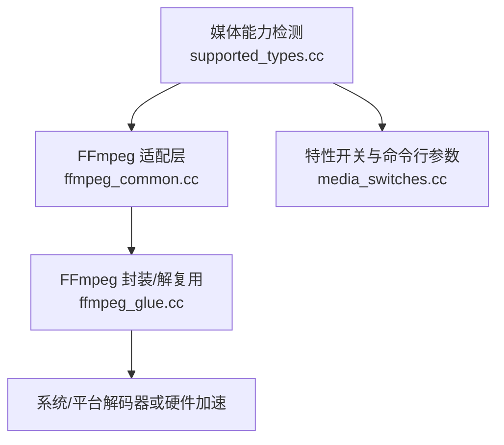
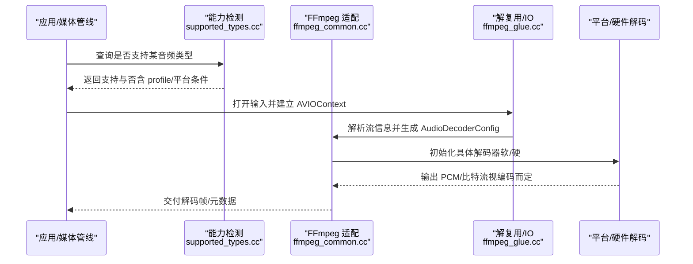
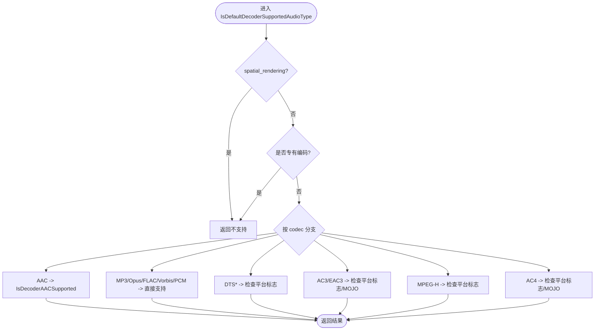
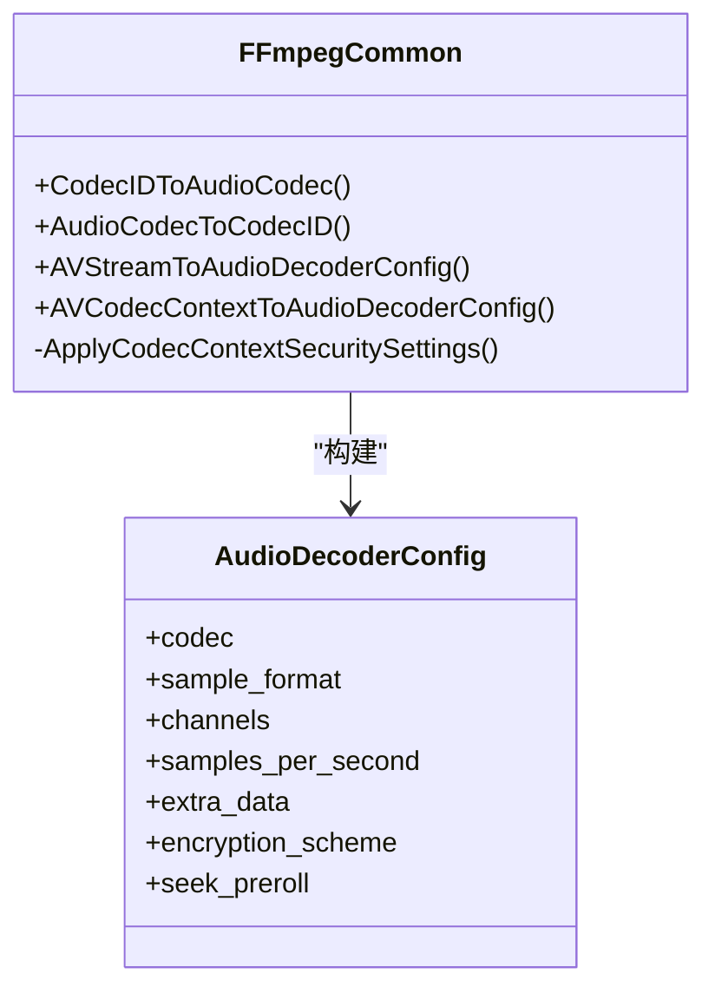
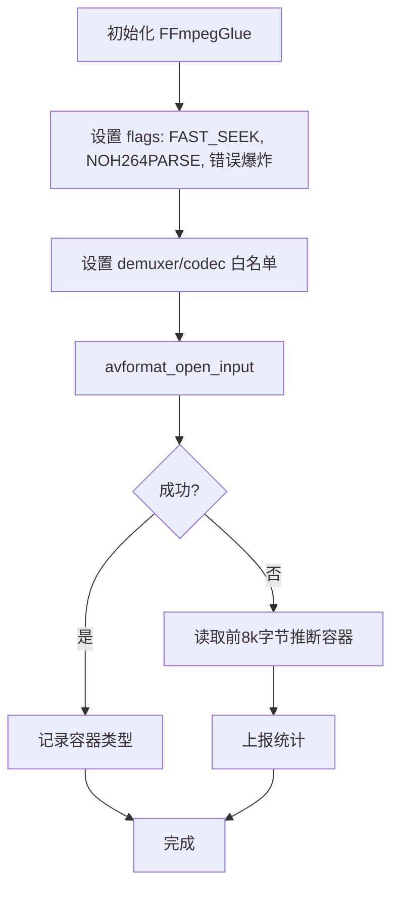
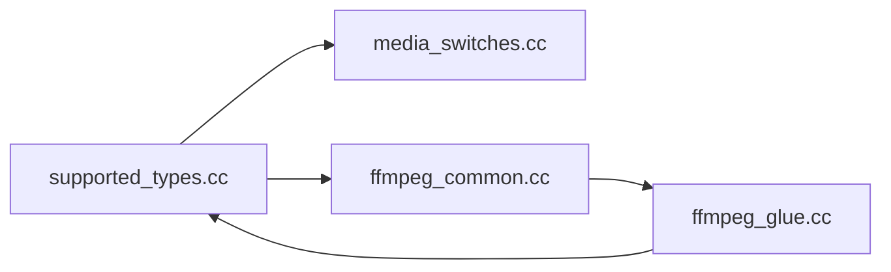

# 音频编解码器

本文引用的文件

- [src/media/base/supported_types.cc](https://github.com/Mcloud136/Mcloud-Browser/blob/main/src/media/base/supported_types.cc)
- [src/media/base/media_switches.cc](https://github.com/Mcloud136/Mcloud-Browser/blob/main/src/media/base/media_switches.cc)
- [src/media/ffmpeg/ffmpeg_common.cc](https://github.com/Mcloud136/Mcloud-Browser/blob/main/src/media/ffmpeg/ffmpeg_common.cc)
- [src/media/filters/ffmpeg_glue.cc](https://github.com/Mcloud136/Mcloud-Browser/blob/main/src/media/filters/ffmpeg_glue.cc)

## 目录
1. [简介](#简介)
2. [项目结构](#项目结构)
3. [核心组件](#核心组件)
4. [架构总览](#架构总览)
5. [详细组件分析](#详细组件分析)
6. [依赖关系分析](#依赖关系分析)
7. [性能与调优](#性能与调优)
8. [故障排除指南](#故障排除指南)
9. [结论](#结论)
10. [附录：使用示例与配置清单](#附录使用示例与配置清单)

## 简介
本文件面向 MCloud Browser 的音频编解码子系统，聚焦以下目标：
- 支持的音频格式：AC3、E-AC3（EAC3）、DTS、MPEG-H、Opus、AAC、MP3、Vorbis、FLAC、PCM 等。
- 软件实现与硬件加速：说明 FFmpeg 软解路径、平台原生/硬件加速开关、以及直通（bitstream）输出能力。
- 多声道处理：解释通道布局识别、离散声道与比特流格式的处理策略，覆盖 5.1、7.1.4 等高阶布局。
- 配置与调优：提供缓冲区大小、延迟优化、安全白名单、特性开关等关键参数。
- 使用示例与排障：给出常见问题的定位方法与修复建议。

## 项目结构
围绕音频编解码的关键代码集中在 media 子系统中：
- media/base：能力探测与默认解码器支持判定（如 AAC、AC3/EAC3、DTS、MPEG-H、Opus、MP3 等）。
- media/ffmpeg：FFmpeg 适配层，负责 CodecID 映射、AudioDecoderConfig 构建、采样率/声道/额外数据转换等。
- media/filters：FFmpeg 封装与容器解析（demuxer）白名单、IO 上下文、快速 seek 等。

图表来源
- [src/media/base/supported_types.cc:460-500](https://github.com/Mcloud136/Mcloud-Browser/blob/main/src/media/base/supported_types.cc#L460-L500)
- [src/media/ffmpeg/ffmpeg_common.cc:163-205](https://github.com/Mcloud136/Mcloud-Browser/blob/main/src/media/ffmpeg/ffmpeg_common.cc#L163-L205)
- [src/media/filters/ffmpeg_glue.cc:84-97](https://github.com/Mcloud136/Mcloud-Browser/blob/main/src/media/filters/ffmpeg_glue.cc#L84-L97)
- [src/media/base/media_switches.cc:380-392](https://github.com/Mcloud136/Mcloud-Browser/blob/main/src/media/base/media_switches.cc#L380-L392)

章节来源
- [src/media/base/supported_types.cc:460-500](https://github.com/Mcloud136/Mcloud-Browser/blob/main/src/media/base/supported_types.cc#L460-L500)
- [src/media/ffmpeg/ffmpeg_common.cc:163-205](https://github.com/Mcloud136/Mcloud-Browser/blob/main/src/media/ffmpeg/ffmpeg_common.cc#L163-L205)
- [src/media/filters/ffmpeg_glue.cc:84-97](https://github.com/Mcloud136/Mcloud-Browser/blob/main/src/media/filters/ffmpeg_glue.cc#L84-L97)
- [src/media/base/media_switches.cc:380-392](https://github.com/Mcloud136/Mcloud-Browser/blob/main/src/media/base/media_switches.cc#L380-L392)

## 核心组件
- 能力探测与默认解码器选择
  - 通过 IsDefaultDecoderSupportedAudioType 对 AAC、MP3、Opus、FLAC、PCM、Vorbis、DTS、AC3/EAC3、MPEG-H、AC4 等进行分支判断，结合编译宏与平台能力返回是否可用。
  - 针对 AAC 的 XHE-AAC 等特殊 profile，走补充能力缓存（MOJO 音频解码器路径）。
- FFmpeg 适配层
  - 将 FFmpeg 的 AVCodecID 与内部 AudioCodec 相互映射；构造 AudioDecoderConfig（含采样格式、声道布局、采样率、extra data、seek_preroll 等）。
  - 对 AC3/EAC3 与 MPEG-H 的特殊处理：前者在仅 demuxing 时不填充 sample_fmt，后者以 bitstream 形式输出。
- FFmpeg 封装与解复用
  - 设置自定义 IO 上下文、限制可写、启用快速 seek、禁用 H.264 解析以减少内存占用。
  - 维护 demuxer 白名单（ogg、matroska、wav、flac、mp3、mov 等），并在启用专有编解码时加入 aac/ac3/eac3。

章节来源
- [src/media/base/supported_types.cc:460-500](https://github.com/Mcloud136/Mcloud-Browser/blob/main/src/media/base/supported_types.cc#L460-L500)
- [src/media/base/supported_types.cc:283-329](https://github.com/Mcloud136/Mcloud-Browser/blob/main/src/media/base/supported_types.cc#L283-L329)
- [src/media/ffmpeg/ffmpeg_common.cc:407-509](https://github.com/Mcloud136/Mcloud-Browser/blob/main/src/media/ffmpeg/ffmpeg_common.cc#L407-L509)
- [src/media/filters/ffmpeg_glue.cc:99-147](https://github.com/Mcloud136/Mcloud-Browser/blob/main/src/media/filters/ffmpeg_glue.cc#L99-L147)
- [src/media/filters/ffmpeg_glue.cc:84-97](https://github.com/Mcloud136/Mcloud-Browser/blob/main/src/media/filters/ffmpeg_glue.cc#L84-L97)

## 架构总览
下图展示从“媒体能力探测”到“FFmpeg 适配”，再到“平台/硬件解码”的整体流程。

图表来源
- [src/media/base/supported_types.cc:460-500](https://github.com/Mcloud136/Mcloud-Browser/blob/main/src/media/base/supported_types.cc#L460-L500)
- [src/media/ffmpeg/ffmpeg_common.cc:407-509](https://github.com/Mcloud136/Mcloud-Browser/blob/main/src/media/ffmpeg/ffmpeg_common.cc#L407-L509)
- [src/media/filters/ffmpeg_glue.cc:99-147](https://github.com/Mcloud136/Mcloud-Browser/blob/main/src/media/filters/ffmpeg_glue.cc#L99-L147)

## 详细组件分析

### 组件A：音频格式支持与能力探测（supported_types.cc）
- 支持的音频格式与条件
  - AAC：默认支持，XHE-AAC 需通过 MOJO 音频解码器能力缓存。
  - MP3/Opus/FLAC/Vorbis/PCM：默认支持。
  - DTS/DTSXP2/DTSE：受 ENABLE_PLATFORM_DTS_AUDIO 控制。
  - AC3/EAC3：受 ENABLE_PLATFORM_AC3_EAC3_AUDIO 控制；在 Windows/macOS 且启用 MOJO 音频解码器时，通过补充能力缓存判定。
  - MPEG-H：受 ENABLE_PLATFORM_MPEG_H_AUDIO 控制，并以 bitstream 形式输出。
  - AC4：仅在 Windows + MOJO 音频解码器 + 对应平台标志下支持。
- 空间渲染与声道布局
  - spatial_rendering 为 true 时默认不支持（由默认解码器路径拒绝）。
  - 高声道布局（>8 声道，如 5.1.4、7.1.4）由 kEnableHighChannelLayouts 特性控制。

图表来源
- [src/media/base/supported_types.cc:460-500](https://github.com/Mcloud136/Mcloud-Browser/blob/main/src/media/base/supported_types.cc#L460-L500)
- [src/media/base/supported_types.cc:283-329](https://github.com/Mcloud136/Mcloud-Browser/blob/main/src/media/base/supported_types.cc#L283-L329)
- [src/media/base/media_switches.cc:380-392](https://github.com/Mcloud136/Mcloud-Browser/blob/main/src/media/base/media_switches.cc#L380-L392)

章节来源
- [src/media/base/supported_types.cc:283-329](https://github.com/Mcloud136/Mcloud-Browser/blob/main/src/media/base/supported_types.cc#L283-L329)
- [src/media/base/supported_types.cc:460-500](https://github.com/Mcloud136/Mcloud-Browser/blob/main/src/media/base/supported_types.cc#L460-L500)
- [src/media/base/media_switches.cc:380-392](https://github.com/Mcloud136/Mcloud-Browser/blob/main/src/media/base/media_switches.cc#L380-L392)

### 组件B：FFmpeg 适配与配置构建（ffmpeg_common.cc）
- 编解码 ID 映射
  - 将 FFmpeg 的 AV_CODEC_ID_* 映射到内部 AudioCodec（AAC、AC3/EAC3、MP3、Vorbis、PCM、FLAC、ALAW/MULAW、Opus、ALAC、MPEG-H）。
- AudioDecoderConfig 构建
  - 根据 AVCodecContext 推导采样格式、声道布局、采样率、extra data、加密方案、seek_preroll 等。
  - 特殊处理：
    - AC3/EAC3：仅 demuxing 时不填充 sample_fmt，按规范设定为 S16。
    - MPEG-H：以 bitstream 形式输出，sample_format 标记为专用类型。
  - AAC profile：当 FFmpeg 未提供 profile 时，尝试从 extra data 解析。
- 安全与严格模式
  - 通过 ApplyCodecContextSecuritySettings 设置 codec_whitelist，并在启用严格模式时开启错误爆炸策略。

图表来源
- [src/media/ffmpeg/ffmpeg_common.cc:163-205](https://github.com/Mcloud136/Mcloud-Browser/blob/main/src/media/ffmpeg/ffmpeg_common.cc#L163-L205)
- [src/media/ffmpeg/ffmpeg_common.cc:407-509](https://github.com/Mcloud136/Mcloud-Browser/blob/main/src/media/ffmpeg/ffmpeg_common.cc#L407-L509)
- [src/media/ffmpeg/ffmpeg_common.cc:73-89](https://github.com/Mcloud136/Mcloud-Browser/blob/main/src/media/ffmpeg/ffmpeg_common.cc#L73-L89)

章节来源
- [src/media/ffmpeg/ffmpeg_common.cc:163-205](https://github.com/Mcloud136/Mcloud-Browser/blob/main/src/media/ffmpeg/ffmpeg_common.cc#L163-L205)
- [src/media/ffmpeg/ffmpeg_common.cc:407-509](https://github.com/Mcloud136/Mcloud-Browser/blob/main/src/media/ffmpeg/ffmpeg_common.cc#L407-L509)
- [src/media/ffmpeg/ffmpeg_common.cc:73-89](https://github.com/Mcloud136/Mcloud-Browser/blob/main/src/media/ffmpeg/ffmpeg_common.cc#L73-L89)

### 组件C：解复用与 IO 封装（ffmpeg_glue.cc）
- 自定义 AVIO 读写与 seek，限制写入，启用快速 seek，禁用 H.264 解析以降低内存。
- 维护 demuxer 白名单，包含 ogg、matroska、wav、flac、mp3、mov，并在启用专有编解码时加入 aac/ac3/eac3。
- 失败时的容器类型推断与日志上报。

图表来源
- [src/media/filters/ffmpeg_glue.cc:99-147](https://github.com/Mcloud136/Mcloud-Browser/blob/main/src/media/filters/ffmpeg_glue.cc#L99-L147)
- [src/media/filters/ffmpeg_glue.cc:84-97](https://github.com/Mcloud136/Mcloud-Browser/blob/main/src/media/filters/ffmpeg_glue.cc#L84-L97)
- [src/media/filters/ffmpeg_glue.cc:149-224](https://github.com/Mcloud136/Mcloud-Browser/blob/main/src/media/filters/ffmpeg_glue.cc#L149-L224)

章节来源
- [src/media/filters/ffmpeg_glue.cc:99-147](https://github.com/Mcloud136/Mcloud-Browser/blob/main/src/media/filters/ffmpeg_glue.cc#L99-L147)
- [src/media/filters/ffmpeg_glue.cc:149-224](https://github.com/Mcloud136/Mcloud-Browser/blob/main/src/media/filters/ffmpeg_glue.cc#L149-L224)

### 组件D：特性开关与命令行参数（media_switches.cc）
- 高声道布局：kEnableHighChannelLayouts 控制 >8 声道的支持（如 5.1.4、7.1.4）。
- Opus 直解：kDirectOpusAudioDecoding 控制是否绕过 FFmpeg 直接使用 Opus 解码器。
- 其他相关开关：平台 HEVC/H.264 硬件编解码、MSE 缓冲限制、音频设备相关开关等。

章节来源
- [src/media/base/media_switches.cc:380-392](https://github.com/Mcloud136/Mcloud-Browser/blob/main/src/media/base/media_switches.cc#L380-L392)
- [src/media/base/media_switches.cc:590-592](https://github.com/Mcloud136/Mcloud-Browser/blob/main/src/media/base/media_switches.cc#L590-L592)

## 依赖关系分析
- supported_types.cc 依赖 media_switches.cc 中的特性开关与平台宏，决定各音频格式的可用性。
- ffmpeg_common.cc 作为桥接层，依赖 FFmpeg 提供的编解码能力，并将之映射到浏览器内部模型。
- ffmpeg_glue.cc 管理解复用与 IO，限制可访问的容器与解码器，增强安全性与稳定性。

图表来源
- [src/media/base/supported_types.cc:460-500](https://github.com/Mcloud136/Mcloud-Browser/blob/main/src/media/base/supported_types.cc#L460-L500)
- [src/media/ffmpeg/ffmpeg_common.cc:407-509](https://github.com/Mcloud136/Mcloud-Browser/blob/main/src/media/ffmpeg/ffmpeg_common.cc#L407-L509)
- [src/media/filters/ffmpeg_glue.cc:84-97](https://github.com/Mcloud136/Mcloud-Browser/blob/main/src/media/filters/ffmpeg_glue.cc#L84-L97)

章节来源
- [src/media/base/supported_types.cc:460-500](https://github.com/Mcloud136/Mcloud-Browser/blob/main/src/media/base/supported_types.cc#L460-L500)
- [src/media/ffmpeg/ffmpeg_common.cc:407-509](https://github.com/Mcloud136/Mcloud-Browser/blob/main/src/media/ffmpeg/ffmpeg_common.cc#L407-L509)
- [src/media/filters/ffmpeg_glue.cc:84-97](https://github.com/Mcloud136/Mcloud-Browser/blob/main/src/media/filters/ffmpeg_glue.cc#L84-L97)

## 性能与调优
- 缓冲区大小
  - MSE 音频缓冲限制可通过命令行参数 mse-audio-buffer-size-limit-mb 调整（单位 MB）。
  - FFmpeg 内部 AVIO 读缓冲固定为 32KB，兼顾兼容性与性能。
- 延迟优化
  - 启用 Windows 独占模式可降低延迟（enable-exclusive-audio）。
  - 对于低延迟 PCM 路径，可使用 AUDIO_PCM_LOW_LATENCY 音频路径。
  - 合理设置 seek_preroll（由 FFmpeg 上下文推导）可减少跳转后的首帧等待。
- 解码路径选择
  - 针对 Opus，可启用 kDirectOpusAudioDecoding 以绕过 FFmpeg，降低开销。
  - 平台/硬件解码：依据平台宏与 MOJO 音频解码器能力，自动选择最优路径。
- 安全与稳定
  - 启用严格模式（kStrictFFmpegCodecs）可在遇到损坏码流时更快失败，便于调试。
  - 限制 demuxer/codec 白名单，减少攻击面与不必要解析。

章节来源
- [src/media/base/media_switches.cc:150-153](https://github.com/Mcloud136/Mcloud-Browser/blob/main/src/media/base/media_switches.cc#L150-L153)
- [src/media/base/media_switches.cc:280-300](https://github.com/Mcloud136/Mcloud-Browser/blob/main/src/media/base/media_switches.cc#L280-L300)
- [src/media/base/media_switches.cc:590-592](https://github.com/Mcloud136/Mcloud-Browser/blob/main/src/media/base/media_switches.cc#L590-L592)
- [src/media/filters/ffmpeg_glue.cc:21-25](https://github.com/Mcloud136/Mcloud-Browser/blob/main/src/media/filters/ffmpeg_glue.cc#L21-L25)
- [src/media/ffmpeg/ffmpeg_common.cc:73-89](https://github.com/Mcloud136/Mcloud-Browser/blob/main/src/media/ffmpeg/ffmpeg_common.cc#L73-L89)

## 故障排除指南
- 无法播放 AC3/EAC3
  - 确认已启用 ENABLE_PLATFORM_AC3_EAC3_AUDIO 编译宏；在 Windows/macOS 上还需启用 MOJO 音频解码器并通过补充能力缓存。
  - 若仅 demuxing，注意 sample_fmt 不会被 FFmpeg 填充，需按规范处理。
- 无法播放 DTS
  - 确认启用 ENABLE_PLATFORM_DTS_AUDIO；否则默认不可用。
- MPEG-H 无声音
  - MPEG-H 以 bitstream 形式输出，需上层正确处理该格式；确保启用 ENABLE_PLATFORM_MPEG_H_AUDIO。
- Opus 解码异常
  - 可尝试启用 kDirectOpusAudioDecoding 以绕过 FFmpeg 路径。
- 高声道布局无效（如 5.1.4、7.1.4）
  - 启用 kEnableHighChannelLayouts 特性；否则默认拒绝 spatial_rendering 或多声道场景。
- 容器识别失败
  - FFmpeg 会读取前 8KB 进行推断；检查 demuxer 白名单是否包含目标容器（如 mp3、aac、ac3、eac3 等）。

章节来源
- [src/media/base/supported_types.cc:283-329](https://github.com/Mcloud136/Mcloud-Browser/blob/main/src/media/base/supported_types.cc#L283-L329)
- [src/media/base/supported_types.cc:460-500](https://github.com/Mcloud136/Mcloud-Browser/blob/main/src/media/base/supported_types.cc#L460-L500)
- [src/media/ffmpeg/ffmpeg_common.cc:407-509](https://github.com/Mcloud136/Mcloud-Browser/blob/main/src/media/ffmpeg/ffmpeg_common.cc#L407-L509)
- [src/media/filters/ffmpeg_glue.cc:84-97](https://github.com/Mcloud136/Mcloud-Browser/blob/main/src/media/filters/ffmpeg_glue.cc#L84-L97)
- [src/media/base/media_switches.cc:380-392](https://github.com/Mcloud136/Mcloud-Browser/blob/main/src/media/base/media_switches.cc#L380-L392)

## 结论
MCloud Browser 的音频编解码体系以“能力探测 + FFmpeg 适配 + 平台/硬件加速”为核心，覆盖主流与专业音频格式。通过特性开关与命令行参数，可在不同平台上灵活启用/禁用特定功能，平衡兼容性、性能与安全。对于高阶多声道与新兴格式（如 MPEG-H），提供了明确的扩展点与处理策略。

## 附录：使用示例与配置清单
- 启用高声道布局（5.1.4、7.1.4）
  - 特性：kEnableHighChannelLayouts（默认关闭）
- 使用 Opus 直解
  - 特性：kDirectOpusAudioDecoding（默认关闭）
- 调整 MSE 音频缓冲
  - 命令行：mse-audio-buffer-size-limit-mb
- 降低音频延迟（Windows）
  - 命令行：enable-exclusive-audio
- 限制 demuxer/codec 白名单
  - 内置白名单：ogg、matroska、wav、flac、mp3、mov；启用专有编解码时增加 aac、ac3、eac3

章节来源
- [src/media/base/media_switches.cc:380-392](https://github.com/Mcloud136/Mcloud-Browser/blob/main/src/media/base/media_switches.cc#L380-L392)
- [src/media/base/media_switches.cc:590-592](https://github.com/Mcloud136/Mcloud-Browser/blob/main/src/media/base/media_switches.cc#L590-L592)
- [src/media/base/media_switches.cc:150-153](https://github.com/Mcloud136/Mcloud-Browser/blob/main/src/media/base/media_switches.cc#L150-L153)
- [src/media/base/media_switches.cc:280-300](https://github.com/Mcloud136/Mcloud-Browser/blob/main/src/media/base/media_switches.cc#L280-L300)
- [src/media/filters/ffmpeg_glue.cc:84-97](https://github.com/Mcloud136/Mcloud-Browser/blob/main/src/media/filters/ffmpeg_glue.cc#L84-L97)