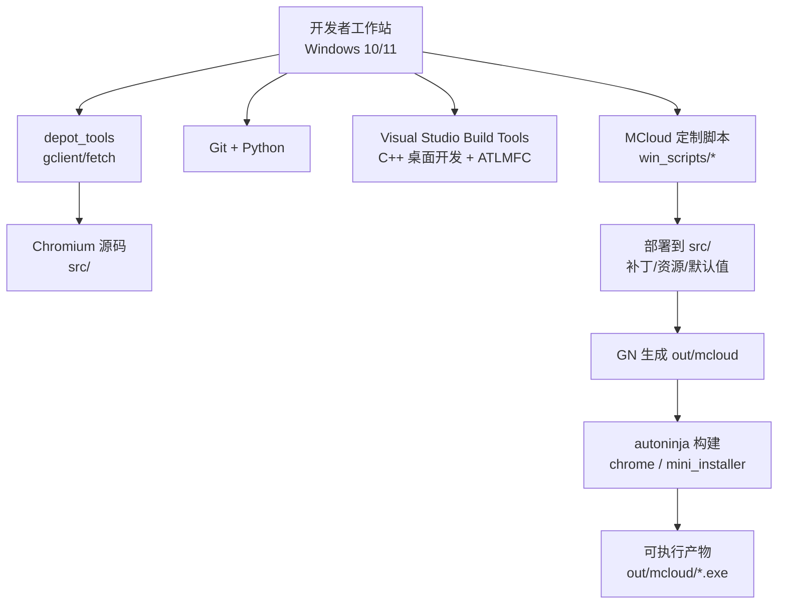
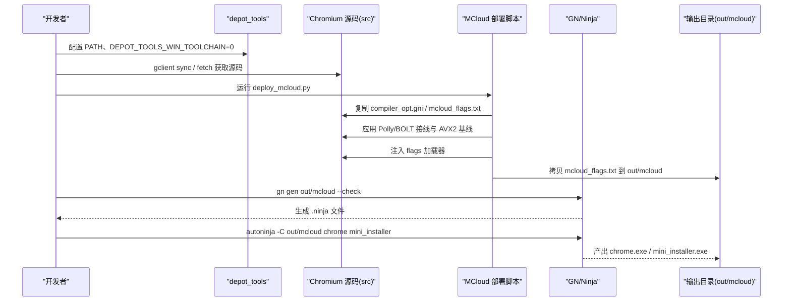
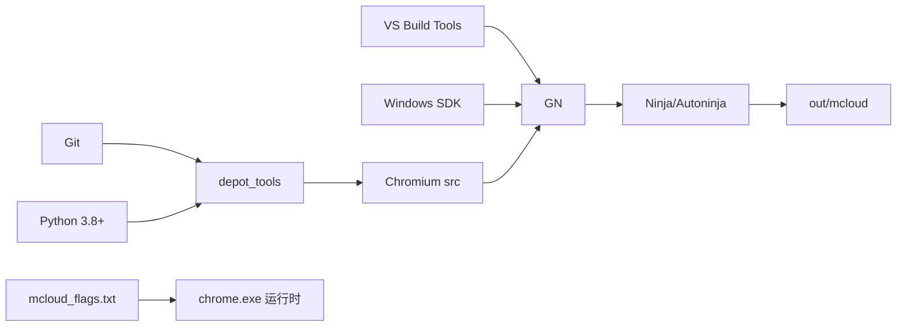

# 快速开始

<cite>
**本文引用的文件**
- [README.md](file://README.md)
- [docs/BUILDING_WIN.md](file://docs/BUILDING_WIN.md)
- [depot_tools/README.md](file://depot_tools/README.md)
- [win_scripts/deploy_mcloud.py](file://win_scripts/deploy_mcloud.py)
- [win_scripts/setup.py](file://win_scripts/setup.py)
- [win_scripts/build_win.py](file://win_scripts/build_win.py)
- [win_args.gn](file://win_args.gn)
- [win_args_mcloud.gn](file://win_args_mcloud.gn)
- [mcloud_flags.txt](file://mcloud_flags.txt)
- [docs/ABOUT_GN_ARGS.md](file://docs/ABOUT_GN_ARGS.md)
</cite>

## 目录
1. [简介](#简介)
2. [项目结构](#项目结构)
3. [核心组件](#核心组件)
4. [架构总览](#架构总览)
5. [详细组件分析](#详细组件分析)
6. [依赖关系分析](#依赖关系分析)
7. [性能注意事项](#性能注意事项)
8. [故障排除指南](#故障排除指南)
9. [结论](#结论)
10. [附录：环境变量与构建参数速查](#附录环境变量与构建参数速查)

## 简介
本指南面向首次尝试在 Windows 上从源码构建 MCloud Browser（基于 Chromium M151）的开发者。目标是帮助你在最短时间内完成环境准备、源码部署、构建与运行，并解决常见环境问题。MCloud Browser 针对 AVX2/FMA3 原生编译，启用 ThinLTO 与 PGO，并通过内置启动标志注入实现运行时优化。

## 项目结构
仓库包含以下与构建相关的关键部分：
- 顶层脚本与配置：用于下载依赖、部署定制代码、生成构建参数与执行构建
- docs：平台构建说明、GN 参数说明、FAQ 等
- depot_tools：Chromium 开发工具链（gclient/fetch 等）
- win_scripts：Windows 专用部署与构建脚本
- 构建参数：win_args.gn、win_args_mcloud.gn
- 运行时标志：mcloud_flags.txt

图表来源
- [docs/BUILDING_WIN.md:15-102](file://docs/BUILDING_WIN.md#L15-L102)
- [depot_tools/README.md:1-36](file://depot_tools/README.md#L1-L36)
- [win_scripts/deploy_mcloud.py:1-51](file://win_scripts/deploy_mcloud.py#L1-L51)
- [win_scripts/build_win.py:1-51](file://win_scripts/build_win.py#L1-L51)

章节来源
- [docs/BUILDING_WIN.md:15-102](file://docs/BUILDING_WIN.md#L15-L102)
- [depot_tools/README.md:1-36](file://depot_tools/README.md#L1-L36)

## 核心组件
- 环境与工具链
  - Windows 10/11 x64
  - Visual Studio Build Tools（需安装“使用 C++ 的桌面开发”及“ATL/MFC 支持”）
  - Git（建议开启 longpaths）
  - Python 3.8+（确保 depot_tools 的 python.bat 优先于系统 Python）
  - 磁盘空间：至少 100 GB（NTFS）
  - 内存：建议 16 GB+
- 构建工具
  - depot_tools（gclient/fetch）
  - GN（生成 .ninja）
  - Ninja/Autoninja（实际编译）
- 构建参数与优化
  - win_args_mcloud.gn：目标平台、编译器优化、PGO、媒体与 DRM、V8 优化等
  - mcloud_flags.txt：启动时注入的性能标志
- 部署脚本
  - deploy_mcloud.py：统一入口，按序复制/打补丁/注入加载器并拷贝 flags
  - setup.py：复制源码与补丁、应用补丁、下载 PGO/V8 profiles
  - build_win.py：调用 autoninja 构建 chrome 与安装包

章节来源
- [README.md:194-264](file://README.md#L194-L264)
- [docs/BUILDING_WIN.md:15-102](file://docs/BUILDING_WIN.md#L15-L102)
- [win_args_mcloud.gn:1-126](file://win_args_mcloud.gn#L1-L126)
- [mcloud_flags.txt:1-120](file://mcloud_flags.txt#L1-L120)
- [win_scripts/deploy_mcloud.py:1-51](file://win_scripts/deploy_mcloud.py#L1-L51)
- [win_scripts/setup.py:1-412](file://win_scripts/setup.py#L1-L412)
- [win_scripts/build_win.py:1-51](file://win_scripts/build_win.py#L1-L51)

## 架构总览
下图展示了从环境准备到最终产物的完整流程，以及关键脚本与文件的协作关系。

图表来源
- [docs/BUILDING_WIN.md:51-102](file://docs/BUILDING_WIN.md#L51-L102)
- [win_scripts/deploy_mcloud.py:1-51](file://win_scripts/deploy_mcloud.py#L1-L51)
- [win_scripts/build_win.py:1-51](file://win_scripts/build_win.py#L1-L51)

## 详细组件分析

### 环境准备（Windows 10/11）
- 系统要求
  - 操作系统：Windows 10/11 x64
  - CPU：支持 AVX2（Intel Haswell 及以后；AMD Ryzen 及以后）
  - 内存：建议 16 GB+
  - 磁盘：至少 100 GB 可用空间（NTFS）
- Visual Studio Build Tools
  - 安装“使用 C++ 的桌面开发”工作负载
  - 勾选“ATL/MFC 支持”子组件
  - 安装匹配的 Windows SDK（文档示例为 10.1.22621.2428），并安装调试工具
- Git
  - 设置 core.longpaths=true
  - 配置 user.name/user.email
- Python
  - 版本 3.8+
  - 确保 depot_tools/python.bat 在 PATH 中优先于系统 Python
  - 关闭 App Execution Aliases 对 python.exe/python3.exe 的冲突

章节来源
- [docs/BUILDING_WIN.md:5-14](file://docs/BUILDING_WIN.md#L5-L14)
- [docs/BUILDING_WIN.md:15-49](file://docs/BUILDING_WIN.md#L15-L49)
- [docs/BUILDING_WIN.md:103-127](file://docs/BUILDING_WIN.md#L103-L127)
- [depot_tools/README.md:1-36](file://depot_tools/README.md#L1-L36)

### depot_tools 安装与配置
- 将 depot_tools 加入 PATH，置于任何 Python/Git 之前
- 设置 DEPOT_TOOLS_WIN_TOOLCHAIN=0，强制使用本地 VS 工具链
- 可选：设置 vs2022_install 指向你的 VS 安装路径
- 首次运行 gclient 会安装必要的 Windows 工具（msysgit、Python 等）

章节来源
- [docs/BUILDING_WIN.md:51-102](file://docs/BUILDING_WIN.md#L51-L102)
- [depot_tools/README.md:27-36](file://depot_tools/README.md#L27-L36)

### 克隆 Chromium M151 源码
- 推荐方式（使用 depot_tools）：
  - 创建 chromium 目录并进入
  - 运行 fetch chromium
  - 切换到对应 tag/分支（如 151.0.7922.99）
  - 进入 src 目录进行后续操作
- 注意：若使用浅克隆或定向拉取，请确保 .gclient 位于 Chromium 根目录而非 src 内，并使用 gclient sync 同步依赖

章节来源
- [docs/BUILDING_WIN.md:116-154](file://docs/BUILDING_WIN.md#L116-L154)
- [README.md:225-235](file://README.md#L225-L235)

### 部署 MCloud 定制（统一部署入口）
- 设置环境变量 THOR_DIR（MCloud 仓库路径）与 CR_DIR（Chromium src 路径）
- 运行 python win_scripts/deploy_mcloud.py
  - 依次执行：复制 essentials、Polly/BOLT 接线、AVX2 基线、默认值校验、注入 flags 加载器
  - 最后将 mcloud_flags.txt 复制到 out/mcloud（供运行时读取）
- 完成后执行 gn gen out/mcloud --check 验证

章节来源
- [win_scripts/deploy_mcloud.py:1-51](file://win_scripts/deploy_mcloud.py#L1-L51)
- [win_scripts/setup.py:269-303](file://win_scripts/setup.py#L269-L303)

### 构建流程（从源码到可执行文件）
- 生成构建目录与参数
  - 创建 out/mcloud
  - 复制 win_args_mcloud.gn 为 out/mcloud/args.gn（或按需编辑 pgo_data_path）
  - 执行 gn gen out/mcloud --check
- 下载 PGO 与 V8 builtins profiles（setup.py 已自动处理）
- 构建
  - 使用 autoninja -C out/mcloud chrome mini_installer
  - 或使用 win_scripts/build_win.py 一键构建全部目标与安装包
- 产物位置
  - out/mcloud/chrome.exe
  - out/mcloud/mini_installer.exe

章节来源
- [win_args_mcloud.gn:1-126](file://win_args_mcloud.gn#L1-L126)
- [win_scripts/setup.py:287-303](file://win_scripts/setup.py#L287-L303)
- [win_scripts/build_win.py:34-51](file://win_scripts/build_win.py#L34-L51)
- [docs/BUILDING_WIN.md:203-256](file://docs/BUILDING_WIN.md#L203-L256)

### 运行与验证
- 直接运行 out/mcloud/chrome.exe
- 或通过 mini_installer.exe 安装
- 可通过内置标志验证脚本确认 flags 注入是否生效

章节来源
- [docs/BUILDING_WIN.md:244-256](file://docs/BUILDING_WIN.md#L244-L256)
- [mcloud_flags.txt:1-120](file://mcloud_flags.txt#L1-L120)

## 依赖关系分析
- 构建依赖
  - Visual Studio Build Tools（C++ 桌面开发 + ATLMFC）
  - Windows SDK（含调试工具）
  - Git（longpaths）
  - Python 3.8+
  - depot_tools（gclient/fetch）
- 构建阶段依赖
  - GN 生成 .ninja
  - Ninja/Autoninja 执行编译
  - PGO 数据文件（与内核大版本严格匹配）
- 运行时依赖
  - mcloud_flags.txt（由加载器注入）
  - 硬件解码能力（D3D11/D3D12，视 GPU 驱动而定）

图表来源
- [docs/BUILDING_WIN.md:15-102](file://docs/BUILDING_WIN.md#L15-L102)
- [depot_tools/README.md:1-36](file://depot_tools/README.md#L1-L36)
- [win_args_mcloud.gn:52-57](file://win_args_mcloud.gn#L52-L57)
- [mcloud_flags.txt:1-120](file://mcloud_flags.txt#L1-L120)

章节来源
- [docs/BUILDING_WIN.md:15-102](file://docs/BUILDING_WIN.md#L15-L102)
- [win_args_mcloud.gn:52-57](file://win_args_mcloud.gn#L52-L57)

## 性能注意事项
- 编译器优化
  - 启用 ThinLTO、-O3（通过 is_full_optimization_build）、V8 内置优化
  - AVX2+FMA3 原生编译（use_avx2/use_fma=true）
- PGO
  - 使用与内核大版本匹配的 profdata（M151=7922 系列）
  - 更新内核时需同步更新 pgo_data_path
- 运行时标志
  - mcloud_flags.txt 提供启动、渲染、网络、内存、视频等多维度优化
  - 注意 Intel 核显 D3D12VideoDecoder 绿屏问题已通过禁用该 feature 规避

章节来源
- [win_args_mcloud.gn:9-18](file://win_args_mcloud.gn#L9-L18)
- [win_args_mcloud.gn:33-57](file://win_args_mcloud.gn#L33-L57)
- [mcloud_flags.txt:8-120](file://mcloud_flags.txt#L8-L120)
- [docs/ABOUT_GN_ARGS.md:161-174](file://docs/ABOUT_GN_ARGS.md#L161-L174)

## 故障排除指南
- Python 冲突
  - 症状：gn 过度重建或工具链异常
  - 排查：where python 确认 depot_tools/python.bat 优先；关闭 App Execution Aliases 中的 python.exe/python3.exe
- depot_tools 自动更新
  - 如需禁用自动更新：设置 DEPOT_TOOLS_UPDATE=0 或运行 update_depot_tools_toggle.py
- VS 工具链未识别
  - 设置 DEPOT_TOOLS_WIN_TOOLCHAIN=0 与 vs2022_install（或 vs2026_install）指向正确路径
  - 确保安装了“ATL/MFC 支持”
- PGO 不匹配
  - 升级内核后需重新下载对应版本的 profdata 并更新 args.gn 中的 pgo_data_path
- 构建失败或符号缺失
  - 检查是否缺少 Windows SDK 调试工具
  - 清理 out/mcloud 后重新 gn gen 与构建
- Widevine 相关
  - 当前构建默认禁用 Widevine（enable_widevine=false），如需启用需另行配置签名证书与下载流程

章节来源
- [docs/BUILDING_WIN.md:103-114](file://docs/BUILDING_WIN.md#L103-L114)
- [depot_tools/README.md:27-36](file://depot_tools/README.md#L27-L36)
- [win_args_mcloud.gn:84-91](file://win_args_mcloud.gn#L84-L91)
- [docs/ABOUT_GN_ARGS.md:121-127](file://docs/ABOUT_GN_ARGS.md#L121-L127)

## 结论
按照本指南完成环境准备、源码部署与构建后，你将获得可直接运行的 MCloud Browser 可执行文件与安装包。建议在每次内核升级后重新下载匹配的 PGO 数据并更新构建参数，以确保最佳性能与稳定性。如遇问题，优先检查 Python/Git/depot_tools 的环境优先级与 VS 工具链配置。

## 附录：环境变量与构建参数速查
- 环境变量
  - DEPOT_TOOLS_WIN_TOOLCHAIN=0
  - vs2022_install 或 vs2026_install（指向 VS 安装路径）
  - INCLUDE（必要时添加 ATLMFC include 路径）
  - THOR_DIR（MCloud 仓库路径）
  - CR_DIR（Chromium src 路径）
- 常用命令
  - gclient sync --nohooks --jobs 8
  - gn gen out/mcloud --check
  - autoninja -C out/mcloud chrome mini_installer
- 关键文件
  - win_args_mcloud.gn：构建参数（SIMD、PGO、媒体、V8 等）
  - mcloud_flags.txt：运行时优化标志
  - docs/ABOUT_GN_ARGS.md：GN 参数详解

章节来源
- [README.md:205-264](file://README.md#L205-L264)
- [win_args_mcloud.gn:1-126](file://win_args_mcloud.gn#L1-L126)
- [mcloud_flags.txt:1-120](file://mcloud_flags.txt#L1-L120)
- [docs/ABOUT_GN_ARGS.md:1-174](file://docs/ABOUT_GN_ARGS.md#L1-L174)