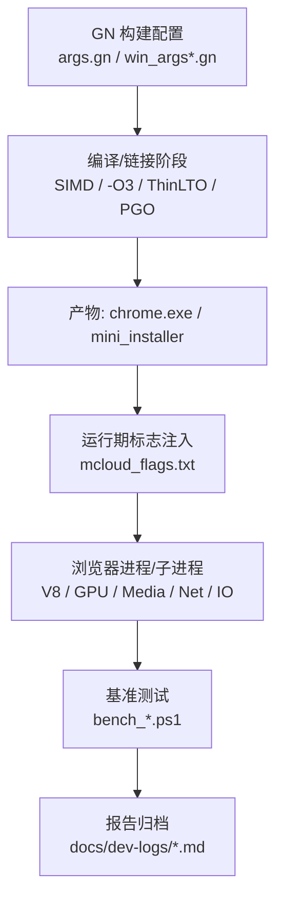
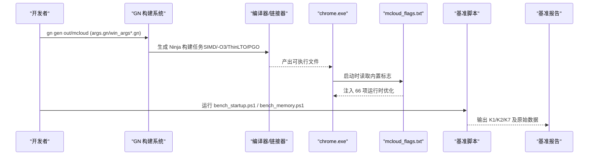
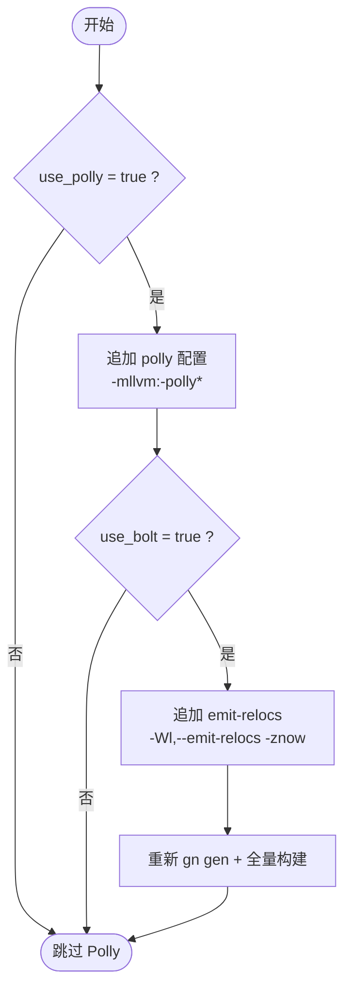
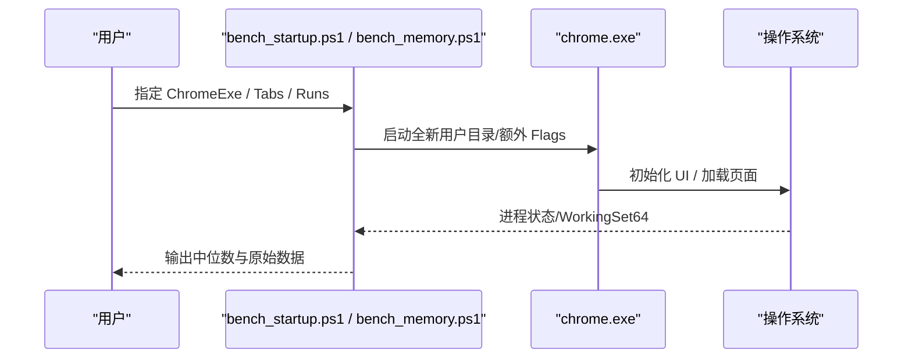
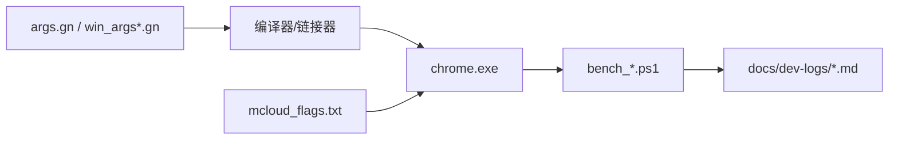

# 性能优化

<cite>
**本文引用的文件**
- [mcloud_flags.txt](file://mcloud_flags.txt)
- [args.gn](file://args.gn)
- [win_args.gn](file://win_args.gn)
- [win_args_mcloud.gn](file://win_args_mcloud.gn)
- [docs/ABOUT_GN_ARGS.md](file://docs/ABOUT_GN_ARGS.md)
- [README.md](file://README.md)
- [docs/CMDLINE_FLAGS_LIST.md](file://docs/CMDLINE_FLAGS_LIST.md)
- [benchmark/bench_startup.ps1](file://benchmark/bench_startup.ps1)
- [benchmark/bench_memory.ps1](file://benchmark/bench_memory.ps1)
- [docs/dev-logs/M150-benchmark.md](file://docs/dev-logs/M150-benchmark.md)
- [docs/dev-logs/M151-benchmark.md](file://docs/dev-logs/M151-benchmark.md)
- [docs/dev-logs/M151-opt-benchmark.md](file://docs/dev-logs/M151-opt-benchmark.md)
- [other/AVX2/README.md](file://other/AVX2/README.md)
- [src/tools/clang/scripts/build.py](file://src/tools/clang/scripts/build.py)
- [win_scripts/append_polly_configs.py](file://win_scripts/append_polly_configs.py)
</cite>

## 目录
1. [简介](#简介)
2. [项目结构](#项目结构)
3. [核心组件](#核心组件)
4. [架构总览](#架构总览)
5. [详细组件分析](#详细组件分析)
6. [依赖关系分析](#依赖关系分析)
7. [性能考量](#性能考量)
8. [故障排查指南](#故障排查指南)
9. [结论](#结论)
10. [附录](#附录)

## 简介
本文件系统性梳理 MCloud Browser 的性能优化体系，覆盖 66 项运行时优化标志的分类与作用机制、编译器优化栈（AVX2+FMA3、-O3、ThinLTO+PGO）、Polly 循环优化与 BOLT 二进制布局的配置与使用，以及基准测试工具的使用与结果分析方法。目标是帮助读者在不深入源码的情况下，理解“为什么这样优化”和“如何验证效果”。

## 项目结构
MCloud Browser 将性能优化分为三层：
- 构建期优化：通过 GN 参数启用 SIMD、-O3、ThinLTO、PGO，并预留 Polly/BOLT 开关。
- 运行期优化：通过启动标志注入 66 项 feature flags，覆盖启动、V8、页面加载、内存、多线程、媒体、GPU、网络等维度。
- 度量与回归：通过 benchmark 脚本采集冷启动、内存、体积等 KPI，形成可复现的基线与对比报告。

图表来源
- [args.gn:1-87](file://args.gn#L1-L87)
- [win_args.gn:1-87](file://win_args.gn#L1-L87)
- [win_args_mcloud.gn:38-59](file://win_args_mcloud.gn#L38-L59)
- [mcloud_flags.txt:1-120](file://mcloud_flags.txt#L1-L120)
- [benchmark/bench_startup.ps1:1-70](file://benchmark/bench_startup.ps1#L1-L70)
- [benchmark/bench_memory.ps1:1-78](file://benchmark/bench_memory.ps1#L1-L78)

章节来源
- [args.gn:1-87](file://args.gn#L1-L87)
- [win_args.gn:1-87](file://win_args.gn#L1-L87)
- [win_args_mcloud.gn:38-59](file://win_args_mcloud.gn#L38-L59)
- [docs/ABOUT_GN_ARGS.md:1-174](file://docs/ABOUT_GN_ARGS.md#L1-L174)

## 核心组件
- 运行时标志集（66 项）：集中在 mcloud_flags.txt，按启动、视频、渲染、内存、网络、图像、推测规则、V8、预载预热、脚本/加载速度、MSE/视频缓冲、GPU、媒体、多线程、Service Worker、存储等分类组织。
- 编译器优化栈：通过 args.gn/win_args*.gn 启用 AVX2/FMA3（在目标平台）、-O3（is_full_optimization_build）、ThinLTO（use_thin_lto + thin_lto_enable_optimizations）、PGO（chrome_pgo_phase=2 与 pgo_data_path）。
- V8 脚本加速：通过 --js-flags 降低 Maglev/TurboFan 阈值、开启 OSR 升级与 Sparkplug 动态修补。
- 基准测试：K1 冷启动、K2 内存峰值、K7 体积；导航/滚动/JS/解码为手工流程。

章节来源
- [mcloud_flags.txt:1-120](file://mcloud_flags.txt#L1-L120)
- [args.gn:1-87](file://args.gn#L1-L87)
- [win_args.gn:1-87](file://win_args.gn#L1-L87)
- [win_args_mcloud.gn:38-59](file://win_args_mcloud.gn#L38-L59)
- [README.md:61-96](file://README.md#L61-L96)
- [README.md:302-375](file://README.md#L302-L375)

## 架构总览
下图展示从构建到运行再到度量的完整链路，标注了关键配置文件与脚本的作用点。

图表来源
- [args.gn:1-87](file://args.gn#L1-L87)
- [win_args.gn:1-87](file://win_args.gn#L1-L87)
- [mcloud_flags.txt:1-120](file://mcloud_flags.txt#L1-L120)
- [benchmark/bench_startup.ps1:1-70](file://benchmark/bench_startup.ps1#L1-L70)
- [benchmark/bench_memory.ps1:1-78](file://benchmark/bench_memory.ps1#L1-L78)

## 详细组件分析

### 运行时优化标志（66 项）分类与作用机制
- 启动优化：提前发送 GPU 通道、延迟推测性 RFH 创建、精简 InitialWebUI、保持空渲染进程可复用、高优先级浏览器进程、预热合成器等，减少首屏阻塞与进程创建开销。
- V8 脚本加速：降低 Maglev/TurboFan 触发阈值，支持从 Maglev OSR 升级到 TurboFan，Sparkplug 动态修补基线代码，使热点脚本更快进入优化路径。
- 页面加载优化：线程化预加载扫描、离线消费代码缓存、内联脚本缓存、系统字体预加载、HTTP 磁盘缓存预热、LCPP 自动预连接等，缩短首包与解析时间。
- 内存管理：标签页冻结策略、PartitionAlloc 回收与排序、提交限制丢弃、持续压力紧急丢弃、非主渲染器更低内存上限、回收旧预绘制瓦片、清理旧传输缓存条目，控制工作集规模。
- 多线程优化：IO 线程交互类型、Mojo 专用线程、用户态自旋锁、关闭标签页提升优先级、非重要帧降权，改善调度与 IPC 吞吐。
- 视频/媒体优化：禁用后台媒体挂起、Canvas OOP 光栅化、平台 HEVC/Hardware Secure Decryption Av1、专用媒体服务线程、Direct Opus 解码、MediaFoundation 批处理与零拷贝捕获等，降低 CPU 占用与延迟。
- GPU 渲染优化：着色器磁盘缓存、增大命令缓冲区解析切片、Skia Graphite 预编译与启用、资源池精确大小复用、客户端高帧率请求，提升合成与绘制效率。
- 网络优化：书签/新标签页触发预取、BackForwardCache、NoStore 进入回退缓存、异步 DNS、Early Data，减少握手与往返。
- 图像与推测规则：AVIF 解码、SpeculationRules 预取/预连接。
- Service Worker 与存储：Navigation Preload、PWAFullCodeCache/ServiceWorkerScriptFullCodeCache（在 M151 中已不存在，见校验脚本），避免无效标志。

注意：部分预载类特性因内存代价与收益不稳定，已在实测后移除（如 MultipleSpareRPHs、LoadingPredictorPrefetch、NewTabPageTriggerForPrerender2），保留其余低内存代价且对真实站点导航有稳定收益的预连接/预取项。

章节来源
- [mcloud_flags.txt:1-120](file://mcloud_flags.txt#L1-L120)
- [docs/dev-logs/M151-opt-benchmark.md:28-60](file://docs/dev-logs/M151-opt-benchmark.md#L28-L60)
- [docs/CMDLINE_FLAGS_LIST.md:594-740](file://docs/CMDLINE_FLAGS_LIST.md#L594-L740)

### 编译器优化栈实现原理
- AVX2 + FMA3 原生编译：通过 use_avx/use_avx2/use_fma 等开关启用 SIMD 指令集，配合 rtc_enable_avx2 等媒体相关选项，获得向量计算加速。
- -O3 极致优化：is_full_optimization_build=true 启用激进优化，结合 thin_lto_enable_optimizations=true 进一步跨单元优化。
- ThinLTO + PGO：use_thin_lto=true 启用跨文件优化；chrome_pgo_phase=2 配合 pgo_data_path 指向对应内核版本的 .profdata，进行热点路径优化。
- V8 内置优化：v8_enable_builtins_optimization=true、v8_enable_maglev/turbofan=true、wasm_simd256_revec=true，提升 JS/WASM 执行效率。
- 其他：use_text_section_splitting=true 与 ThinLTO/PGO 协同，提升热路径局部性；exclude_unwind_tables=true、symbol_level=0 减小体积与启动开销。

章节来源
- [args.gn:1-87](file://args.gn#L1-L87)
- [win_args.gn:1-87](file://win_args.gn#L1-L87)
- [docs/ABOUT_GN_ARGS.md:161-174](file://docs/ABOUT_GN_ARGS.md#L161-L174)
- [README.md:61-96](file://README.md#L61-L96)

### Polly 循环优化与 BOLT 二进制布局
- Polly：通过 append_polly_configs.py 向 compiler/BUILD.gn 追加 polly 配置与 emit-relocs 配置，需自建含 Polly 的 clang（infra/build_polly.sh），并在 win_args_mcloud.gn 中将 use_polly=true 启用。当前默认 false，待前置条件就绪后切换。
- BOLT：通过 src/tools/clang/scripts/build.py 在启用 BOLT 时添加 -Wl,--emit-relocs 与 -znow，以便后链接阶段分析重定位与 PLT 优化。需在 win_args_mcloud.gn 中将 use_bolt=true 启用，并落地后链接流程（规范 10.1）。

图表来源
- [win_scripts/append_polly_configs.py:1-71](file://win_scripts/append_polly_configs.py#L1-L71)
- [src/tools/clang/scripts/build.py:1291-1296](file://src/tools/clang/scripts/build.py#L1291-L1296)
- [win_args_mcloud.gn:42-50](file://win_args_mcloud.gn#L42-L50)

章节来源
- [win_scripts/append_polly_configs.py:1-71](file://win_scripts/append_polly_configs.py#L1-L71)
- [src/tools/clang/scripts/build.py:1291-1296](file://src/tools/clang/scripts/build.py#L1291-L1296)
- [win_args_mcloud.gn:42-50](file://win_args_mcloud.gn#L42-L50)

### 基准测试工具使用与结果分析
- K1 冷启动：bench_startup.ps1 以全新用户数据目录启动 chrome.exe，等待 WaitForInputIdle 作为首屏可交互代理指标，多次运行取中位数。
- K2 内存峰值：bench_memory.ps1 打开固定数量标签页，驻留稳定后汇总所有浏览器进程的 WorkingSet64，多次采样取中位数。
- K7 体积：记录 chrome.exe 与 mini_installer 体积，用于观测构建变更影响。
- 结果分析：对比不同版本或配置的中位数变化，结合环境信息（CPU/GPU/电源模式/扩展）评估显著性与噪声范围；将结果归档至 docs/dev-logs 并附原始数据。

图表来源
- [benchmark/bench_startup.ps1:1-70](file://benchmark/bench_startup.ps1#L1-L70)
- [benchmark/bench_memory.ps1:1-78](file://benchmark/bench_memory.ps1#L1-L78)

章节来源
- [benchmark/bench_startup.ps1:1-70](file://benchmark/bench_startup.ps1#L1-L70)
- [benchmark/bench_memory.ps1:1-78](file://benchmark/bench_memory.ps1#L1-L78)
- [docs/dev-logs/M150-benchmark.md:1-49](file://docs/dev-logs/M150-benchmark.md#L1-L49)
- [docs/dev-logs/M151-benchmark.md:1-30](file://docs/dev-logs/M151-benchmark.md#L1-L30)
- [docs/dev-logs/M151-opt-benchmark.md:1-60](file://docs/dev-logs/M151-opt-benchmark.md#L1-L60)

## 依赖关系分析
- 构建期依赖：GN 参数决定编译器/链接器行为（SIMD、-O3、ThinLTO、PGO），影响最终二进制的热路径与指令级并行能力。
- 运行期依赖：mcloud_flags.txt 中的 feature flags 被注入到浏览器进程及其子进程命令行，影响 V8、GPU、Media、Net、IO 等子系统行为。
- 工具链依赖：Polly/BOLT 需要自定义 clang 与后链接流程；PGO 需要与内核大版本匹配的 .profdata。
- 基准依赖：PowerShell 脚本依赖 Windows 进程管理与计时 API，确保可重复采集。

图表来源
- [args.gn:1-87](file://args.gn#L1-L87)
- [win_args.gn:1-87](file://win_args.gn#L1-L87)
- [mcloud_flags.txt:1-120](file://mcloud_flags.txt#L1-L120)
- [benchmark/bench_startup.ps1:1-70](file://benchmark/bench_startup.ps1#L1-L70)
- [benchmark/bench_memory.ps1:1-78](file://benchmark/bench_memory.ps1#L1-L78)

章节来源
- [docs/ABOUT_GN_ARGS.md:1-174](file://docs/ABOUT_GN_ARGS.md#L1-L174)
- [README.md:302-375](file://README.md#L302-L375)

## 性能考量
- 启动优化：通过提前 GPU 通道、延迟 RFH 创建、精简 WebUI、保持空渲染进程可复用等手段，降低首屏时间与进程创建开销。
- V8 优化：降低 JIT 阈值与启用 OSR/Sparkplug，使热点脚本更快进入优化路径，减少解释执行时间。
- 页面加载：线程化扫描、代码缓存、字体与缓存预热，减少 I/O 与解析瓶颈。
- 内存管理：冻结与回收策略、提交限制丢弃、非主渲染器限制，控制工作集规模，避免内存抖动。
- 多线程：IO 线程交互类型、Mojo 专用线程、自旋锁与优先级调整，提高并发与调度效率。
- 媒体/GPU：硬件解码、专用线程、零拷贝捕获、着色器缓存与 Skia Graphite，降低 CPU 占用与延迟。
- 网络：预取、BackForwardCache、异步 DNS、Early Data，减少握手与往返。
- 构建期：SIMD、-O3、ThinLTO、PGO 协同，提升指令级并行与热路径命中率。

[本节为通用性能讨论，不直接分析具体文件]

## 故障排查指南
- 标志失效：使用 tools/check_features.py 与 verify_builtin_flags.ps1 校验 feature 存活性与注入情况，确认 M151 中 V8 flag 命名必须使用下划线（连字符写法不生效）。
- 视频绿屏：Intel 核显 D3D12 视频解码存在缺陷，已显式禁用 D3D12VideoDecoder 回退至 D3D11VideoDecoder，避免启动头几秒绿屏/花屏。
- 预载内存代价：实测发现多项预载特性在真实站点场景内存代价较大而收益不稳定，已移除相应项，保留低内存代价且收益稳定的预连接/预取项。
- 构建问题：Polly/BOLT 未就绪前保持 use_polly=false、use_bolt=false，避免无效开关导致体积膨胀或构建失败；PGO 需匹配内核大版本的 .profdata。

章节来源
- [mcloud_flags.txt:78-89](file://mcloud_flags.txt#L78-L89)
- [docs/dev-logs/M151-opt-benchmark.md:28-60](file://docs/dev-logs/M151-opt-benchmark.md#L28-L60)
- [win_args_mcloud.gn:42-50](file://win_args_mcloud.gn#L42-L50)

## 结论
MCloud Browser 通过“构建期优化 + 运行期标志 + 基准度量”的闭环，实现了启动、脚本、页面加载、内存、多线程、媒体、GPU、网络等多维度的性能提升。66 项运行时标志按类别精准调优，编译器优化栈提供底层指令级与跨文件优化，Polly/BOLT 为后续进一步提升预留空间。基准测试确保每次变更可量化、可复现、可回归。

[本节为总结性内容，不直接分析具体文件]

## 附录
- 编译器优化栈参考：
  - AVX2 + FMA3：通过 use_avx/use_avx2/use_fma 与 rtc_enable_avx2 等启用。
  - -O3：is_full_optimization_build=true。
  - ThinLTO + PGO：use_thin_lto=true、thin_lto_enable_optimizations=true、chrome_pgo_phase=2、pgo_data_path 指向对应内核版本。
- Polly/BOLT 配置：
  - 使用 append_polly_configs.py 追加 polly/emit-relocs 配置。
  - 在 win_args_mcloud.gn 中启用 use_polly/use_bolt（待前置条件就绪）。
- 基准工具：
  - K1：bench_startup.ps1（冷启动）。
  - K2：bench_memory.ps1（内存峰值）。
  - K7：体积观测。
  - 结果归档：docs/dev-logs/*.md。

章节来源
- [args.gn:1-87](file://args.gn#L1-L87)
- [win_args.gn:1-87](file://win_args.gn#L1-L87)
- [win_args_mcloud.gn:38-59](file://win_args_mcloud.gn#L38-L59)
- [win_scripts/append_polly_configs.py:1-71](file://win_scripts/append_polly_configs.py#L1-L71)
- [benchmark/bench_startup.ps1:1-70](file://benchmark/bench_startup.ps1#L1-L70)
- [benchmark/bench_memory.ps1:1-78](file://benchmark/bench_memory.ps1#L1-L78)
- [docs/dev-logs/M150-benchmark.md:1-49](file://docs/dev-logs/M150-benchmark.md#L1-L49)
- [docs/dev-logs/M151-benchmark.md:1-30](file://docs/dev-logs/M151-benchmark.md#L1-L30)
- [docs/dev-logs/M151-opt-benchmark.md:1-60](file://docs/dev-logs/M151-opt-benchmark.md#L1-L60)