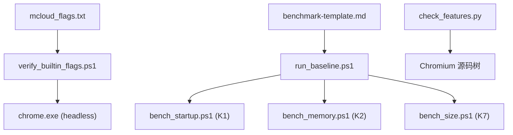
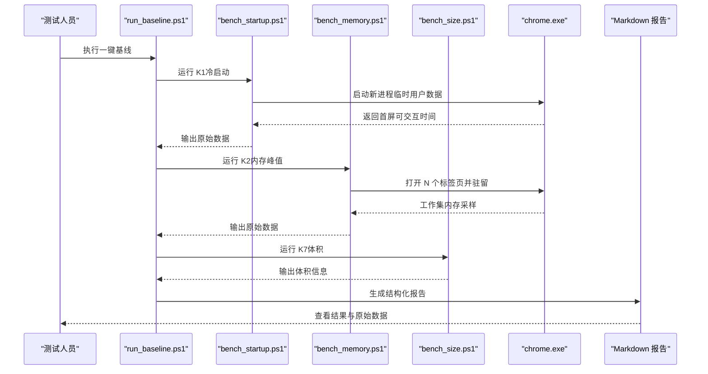
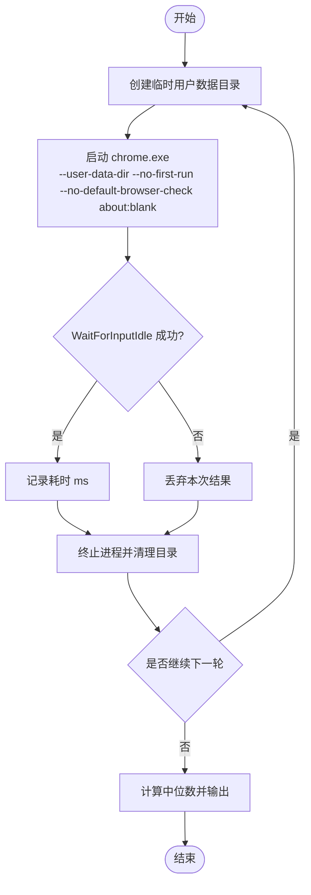
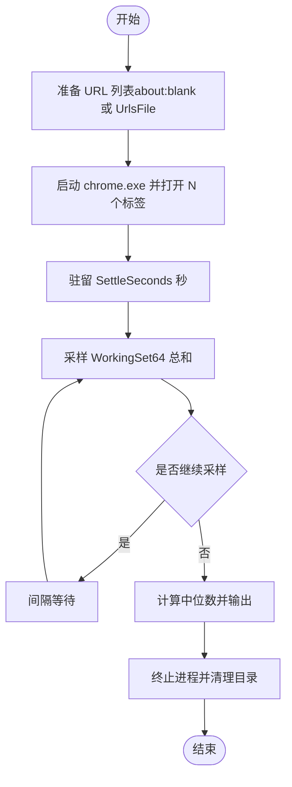
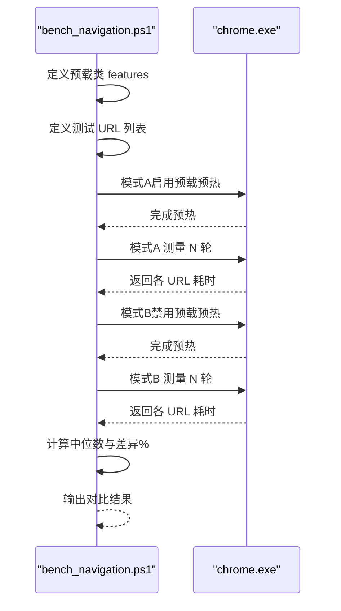
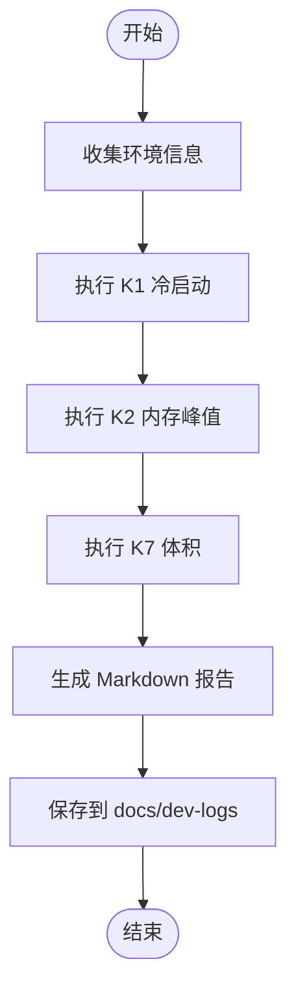
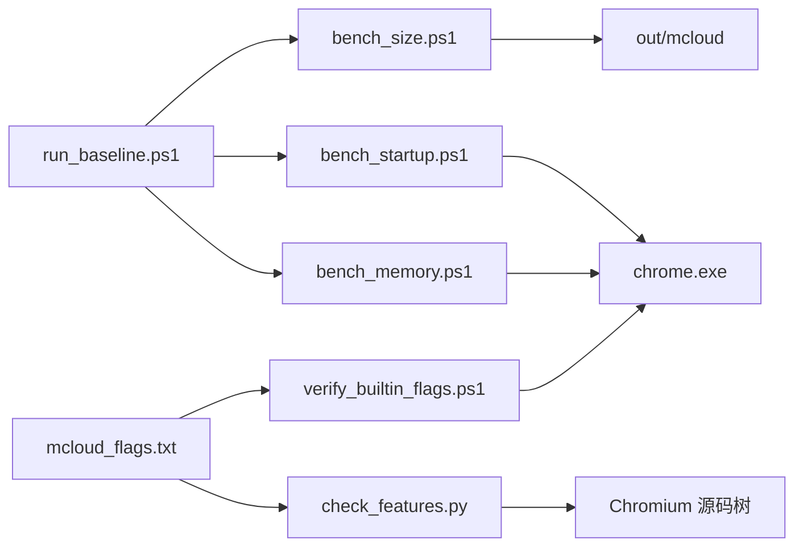

# 性能基准测试

本文引用的文件

- [bench_startup.ps1](https://github.com/Mcloud136/Mcloud-Browser/blob/main/benchmark/bench_startup.ps1)
- [bench_memory.ps1](https://github.com/Mcloud136/Mcloud-Browser/blob/main/benchmark/bench_memory.ps1)
- [bench_navigation.ps1](https://github.com/Mcloud136/Mcloud-Browser/blob/main/benchmark/bench_navigation.ps1)
- [bench_size.ps1](https://github.com/Mcloud136/Mcloud-Browser/blob/main/benchmark/bench_size.ps1)
- [run_baseline.ps1](https://github.com/Mcloud136/Mcloud-Browser/blob/main/benchmark/run_baseline.ps1)
- [check_features.py](https://github.com/Mcloud136/Mcloud-Browser/blob/main/benchmark/tools/check_features.py)
- [verify_builtin_flags.ps1](https://github.com/Mcloud136/Mcloud-Browser/blob/main/benchmark/tools/verify_builtin_flags.ps1)
- [mcloud_flags.txt](https://github.com/Mcloud136/Mcloud-Browser/blob/main/mcloud_flags.txt)
- [benchmark-template.md](https://github.com/Mcloud136/Mcloud-Browser/blob/main/docs/dev-logs/benchmark-template.md)
- [M150-benchmark.md](https://github.com/Mcloud136/Mcloud-Browser/blob/main/docs/dev-logs/M150-benchmark.md)
- [M151-benchmark.md](https://github.com/Mcloud136/Mcloud-Browser/blob/main/docs/dev-logs/M151-benchmark.md)

## 目录
1. [简介](#简介)
2. [项目结构](#项目结构)
3. [核心组件](#核心组件)
4. [架构总览](#架构总览)
5. [详细组件分析](#详细组件分析)
6. [依赖关系分析](#依赖关系分析)
7. [性能考量](#性能考量)
8. [故障排查指南](#故障排查指南)
9. [结论](#结论)
10. [附录](#附录)

## 简介
本文件面向 MCloud Browser 的性能基准测试，覆盖启动时间、内存使用、页面加载速度与导航性能等关键指标。文档说明测试环境搭建要求、测试数据收集与结果分析方法，解释如何解读指标、进行回归检测与趋势分析，并提供自定义测试用例编写指南与自动化流程配置方法，同时包含常见性能问题的诊断工具与调试技巧。

## 项目结构
基准测试套件位于仓库根目录的 benchmark 目录下，包含：
- 单项基准脚本：冷启动（K1）、内存峰值（K2）、导航响应（预载收益验证）、二进制体积（K7）
- 一键基线采集：run_baseline.ps1 串联 K1/K2/K7，并生成 Markdown 报告
- 辅助工具：内置标志生效验证、feature 清单有效性校验
- 报告模板与历史报告：docs/dev-logs 下的模板与版本化报告

图表来源
- [run_baseline.ps1:1-78](https://github.com/Mcloud136/Mcloud-Browser/blob/main/benchmark/run_baseline.ps1#L1-L78)
- [bench_startup.ps1:1-70](https://github.com/Mcloud136/Mcloud-Browser/blob/main/benchmark/bench_startup.ps1#L1-L70)
- [bench_memory.ps1:1-78](https://github.com/Mcloud136/Mcloud-Browser/blob/main/benchmark/bench_memory.ps1#L1-L78)
- [bench_size.ps1:1-44](https://github.com/Mcloud136/Mcloud-Browser/blob/main/benchmark/bench_size.ps1#L1-L44)
- [verify_builtin_flags.ps1:1-98](https://github.com/Mcloud136/Mcloud-Browser/blob/main/benchmark/tools/verify_builtin_flags.ps1#L1-L98)
- [check_features.py:1-153](https://github.com/Mcloud136/Mcloud-Browser/blob/main/benchmark/tools/check_features.py#L1-L153)
- [mcloud_flags.txt:1-120](https://github.com/Mcloud136/Mcloud-Browser/blob/main/mcloud_flags.txt#L1-L120)
- [benchmark-template.md:1-39](https://github.com/Mcloud136/Mcloud-Browser/blob/main/docs/dev-logs/benchmark-template.md#L1-L39)

章节来源
- [run_baseline.ps1:1-78](https://github.com/Mcloud136/Mcloud-Browser/blob/main/benchmark/run_baseline.ps1#L1-L78)
- [bench_startup.ps1:1-70](https://github.com/Mcloud136/Mcloud-Browser/blob/main/benchmark/bench_startup.ps1#L1-L70)
- [bench_memory.ps1:1-78](https://github.com/Mcloud136/Mcloud-Browser/blob/main/benchmark/bench_memory.ps1#L1-L78)
- [bench_size.ps1:1-44](https://github.com/Mcloud136/Mcloud-Browser/blob/main/benchmark/bench_size.ps1#L1-L44)
- [verify_builtin_flags.ps1:1-98](https://github.com/Mcloud136/Mcloud-Browser/blob/main/benchmark/tools/verify_builtin_flags.ps1#L1-L98)
- [check_features.py:1-153](https://github.com/Mcloud136/Mcloud-Browser/blob/main/benchmark/tools/check_features.py#L1-L153)
- [mcloud_flags.txt:1-120](https://github.com/Mcloud136/Mcloud-Browser/blob/main/mcloud_flags.txt#L1-L120)
- [benchmark-template.md:1-39](https://github.com/Mcloud136/Mcloud-Browser/blob/main/docs/dev-logs/benchmark-template.md#L1-L39)

## 核心组件
- K1 冷启动时间：使用全新用户数据目录启动浏览器，等待主窗口可交互（WaitForInputIdle），记录耗时并取中位数。适用于评估启动优化效果。
- K2 内存峰值：打开固定数量标签页（默认 50），驻留稳定后对全部浏览器进程 WorkingSet64 求和，采样多次取中位数。用于评估多标签场景内存占用。
- 导航响应速度：对比启用与禁用预载类 feature 时，加载一组页面的耗时差异，验证预载/预连接/预热类特性是否带来实际收益。
- K7 二进制体积：统计 chrome.exe、安装包及构建目录总体积，作为观测指标。
- 一键基线：run_baseline.ps1 自动执行 K1/K2/K7，并输出结构化 Markdown 报告到 docs/dev-logs。
- 内置标志验证：verify_builtin_flags.ps1 通过 headless 模式抓取 chrome://version 或子进程命令行，确认 mcloud_flags.txt 中的代表 feature 已注入生效。
- Feature 清单校验：check_features.py 解析 mcloud_flags.txt 中的 feature 名称，在 Chromium 源码树中检索是否存在，避免上游移除或更名导致失效。

章节来源
- [bench_startup.ps1:1-70](https://github.com/Mcloud136/Mcloud-Browser/blob/main/benchmark/bench_startup.ps1#L1-L70)
- [bench_memory.ps1:1-78](https://github.com/Mcloud136/Mcloud-Browser/blob/main/benchmark/bench_memory.ps1#L1-L78)
- [bench_navigation.ps1:1-109](https://github.com/Mcloud136/Mcloud-Browser/blob/main/benchmark/bench_navigation.ps1#L1-L109)
- [bench_size.ps1:1-44](https://github.com/Mcloud136/Mcloud-Browser/blob/main/benchmark/bench_size.ps1#L1-L44)
- [run_baseline.ps1:1-78](https://github.com/Mcloud136/Mcloud-Browser/blob/main/benchmark/run_baseline.ps1#L1-L78)
- [verify_builtin_flags.ps1:1-98](https://github.com/Mcloud136/Mcloud-Browser/blob/main/benchmark/tools/verify_builtin_flags.ps1#L1-L98)
- [check_features.py:1-153](https://github.com/Mcloud136/Mcloud-Browser/blob/main/benchmark/tools/check_features.py#L1-L153)
- [mcloud_flags.txt:1-120](https://github.com/Mcloud136/Mcloud-Browser/blob/main/mcloud_flags.txt#L1-L120)

## 架构总览
基准测试以 PowerShell 脚本为核心编排层，调用 Chrome 进程执行具体测量任务；辅助 Python/PowerShell 工具负责配置与验证。所有结果统一汇总为 Markdown 报告，便于归档与趋势分析。

图表来源
- [run_baseline.ps1:1-78](https://github.com/Mcloud136/Mcloud-Browser/blob/main/benchmark/run_baseline.ps1#L1-L78)
- [bench_startup.ps1:1-70](https://github.com/Mcloud136/Mcloud-Browser/blob/main/benchmark/bench_startup.ps1#L1-L70)
- [bench_memory.ps1:1-78](https://github.com/Mcloud136/Mcloud-Browser/blob/main/benchmark/bench_memory.ps1#L1-L78)
- [bench_size.ps1:1-44](https://github.com/Mcloud136/Mcloud-Browser/blob/main/benchmark/bench_size.ps1#L1-L44)

## 详细组件分析

### K1 冷启动时间（bench_startup.ps1）
- 目标：测量全新用户数据目录下的冷启动时间，使用 WaitForInputIdle 作为“首屏可交互”代理指标。
- 方法要点：
  - 每次创建独立临时用户数据目录，避免缓存干扰。
  - 启动参数包含 no-first-run、no-default-browser-check 以及 about:blank。
  - 超时保护（最长 60 秒），丢弃无效结果。
  - 多次运行取中位数，降低噪声影响。
- 结果输出：打印各次耗时与中位数，提示将结果与环境信息记录至 docs/dev-logs。

图表来源
- [bench_startup.ps1:1-70](https://github.com/Mcloud136/Mcloud-Browser/blob/main/benchmark/bench_startup.ps1#L1-L70)

章节来源
- [bench_startup.ps1:1-70](https://github.com/Mcloud136/Mcloud-Browser/blob/main/benchmark/bench_startup.ps1#L1-L70)

### K2 内存峰值（bench_memory.ps1）
- 目标：在多标签场景下测量浏览器进程的内存峰值（WorkingSet64 总和）。
- 方法要点：
  - 支持两种 URL 源：默认 about:blank 或外部 UrlsFile（每行一个 URL）。
  - 启动后驻留指定秒数（默认 90s）使状态稳定。
  - 按进程名汇总所有子进程的工作集内存，采样多次取中位数。
  - 支持额外命令行参数（ExtraFlags）以便对比不同构建或开关。
- 结果输出：打印各次采样 MB 值与进程数，最终输出中位数与原始数据。

图表来源
- [bench_memory.ps1:1-78](https://github.com/Mcloud136/Mcloud-Browser/blob/main/benchmark/bench_memory.ps1#L1-L78)

章节来源
- [bench_memory.ps1:1-78](https://github.com/Mcloud136/Mcloud-Browser/blob/main/benchmark/bench_memory.ps1#L1-L78)

### 导航响应速度（bench_navigation.ps1）
- 目标：验证预载/预连接/预热类 feature 对“打开页面”响应速度的实际收益。
- 方法要点：
  - 同一构建对比两种模式：启用预载类 feature（默认）与禁用预载类 feature（--disable-features=...）。
  - 每种模式先预热一遍 URL 列表，建立预测器/预连接/缓存状态。
  - 再测 N 轮，记录每个 URL 的加载耗时，取中位数对比。
  - 使用 headless + dump-dom 方式测量单次加载耗时。
- 结果输出：分别输出 on/off 模式下各 URL 的中位数，并计算差异百分比。

图表来源
- [bench_navigation.ps1:1-109](https://github.com/Mcloud136/Mcloud-Browser/blob/main/benchmark/bench_navigation.ps1#L1-L109)

章节来源
- [bench_navigation.ps1:1-109](https://github.com/Mcloud136/Mcloud-Browser/blob/main/benchmark/bench_navigation.ps1#L1-L109)

### K7 二进制体积（bench_size.ps1）
- 目标：观测构建产物体积（chrome.exe、安装包、构建目录总体积）。
- 方法要点：
  - 统计 chrome.exe 文件大小。
  - 查找 mini_installer 并输出其大小。
  - 统计 out/mcloud 目录总体积。
- 结果输出：格式化 MB 显示，提示仅作为观测指标。

章节来源
- [bench_size.ps1:1-44](https://github.com/Mcloud136/Mcloud-Browser/blob/main/benchmark/bench_size.ps1#L1-L44)

### 一键基线采集（run_baseline.ps1）
- 目标：自动化执行 K1/K2/K7，并生成标准化 Markdown 报告。
- 方法要点：
  - 收集环境信息（CPU、内存、OS、GPU/驱动、电源模式、扩展）。
  - 依次执行 K1/K2/K7，捕获输出并写入报告。
  - 输出路径为 docs/dev-logs/{Version}-benchmark.md。
- 结果输出：结构化表格与原始数据块，便于归档与对比。

图表来源
- [run_baseline.ps1:1-78](https://github.com/Mcloud136/Mcloud-Browser/blob/main/benchmark/run_baseline.ps1#L1-L78)

章节来源
- [run_baseline.ps1:1-78](https://github.com/Mcloud136/Mcloud-Browser/blob/main/benchmark/run_baseline.ps1#L1-L78)

### 内置标志验证（verify_builtin_flags.ps1）
- 目标：验证 mcloud_flags.txt 中的代表 feature 是否真正注入并生效。
- 方法要点：
  - 首选 headless 模式抓取 chrome://version 内容，检查代表 feature 是否出现。
  - 若 headless 路径未确认，则改用子进程命令行探测（WMI 查询进程命令行）。
  - 抽查三类特征：启动、内存、媒体解码相关。
- 结果输出：逐项 OK/MISS，并通过退出码表示是否通过。

章节来源
- [verify_builtin_flags.ps1:1-98](https://github.com/Mcloud136/Mcloud-Browser/blob/main/benchmark/tools/verify_builtin_flags.ps1#L1-L98)

### Feature 清单校验（check_features.py）
- 目标：确保 mcloud_flags.txt 中的 feature 在当前 Chromium 源码中仍然存在。
- 方法要点：
  - 解析 enable/disable-features 条目，提取 feature 名称。
  - 全源码树扫描（排除 third_party 主体，仅保留 blink），匹配标识符边界。
  - 输出存在与不存在清单，不存在时返回非零退出码。
- 结果输出：统计 found/not_found，提供处理建议。

章节来源
- [check_features.py:1-153](https://github.com/Mcloud136/Mcloud-Browser/blob/main/benchmark/tools/check_features.py#L1-L153)

## 依赖关系分析
- 脚本依赖：
  - run_baseline.ps1 依赖 bench_startup.ps1、bench_memory.ps1、bench_size.ps1。
  - verify_builtin_flags.ps1 依赖 chrome.exe 与 mcloud_flags.txt。
  - check_features.py 依赖 mcloud_flags.txt 与 Chromium 源码树。
- 数据流：
  - 各基准脚本输出原始数据，由 run_baseline.ps1 汇总成 Markdown。
  - 历史报告（M150、M151）作为趋势分析的基线。
- 外部依赖：
  - Windows 系统工具（Get-Process、Get-CimInstance、Stopwatch）。
  - Chromium 构建产物（chrome.exe）与可选安装包（mini_installer）。

图表来源
- [mcloud_flags.txt:1-120](https://github.com/Mcloud136/Mcloud-Browser/blob/main/mcloud_flags.txt#L1-L120)
- [verify_builtin_flags.ps1:1-98](https://github.com/Mcloud136/Mcloud-Browser/blob/main/benchmark/tools/verify_builtin_flags.ps1#L1-L98)
- [check_features.py:1-153](https://github.com/Mcloud136/Mcloud-Browser/blob/main/benchmark/tools/check_features.py#L1-L153)
- [run_baseline.ps1:1-78](https://github.com/Mcloud136/Mcloud-Browser/blob/main/benchmark/run_baseline.ps1#L1-L78)
- [bench_startup.ps1:1-70](https://github.com/Mcloud136/Mcloud-Browser/blob/main/benchmark/bench_startup.ps1#L1-L70)
- [bench_memory.ps1:1-78](https://github.com/Mcloud136/Mcloud-Browser/blob/main/benchmark/bench_memory.ps1#L1-L78)
- [bench_size.ps1:1-44](https://github.com/Mcloud136/Mcloud-Browser/blob/main/benchmark/bench_size.ps1#L1-L44)

章节来源
- [mcloud_flags.txt:1-120](https://github.com/Mcloud136/Mcloud-Browser/blob/main/mcloud_flags.txt#L1-L120)
- [verify_builtin_flags.ps1:1-98](https://github.com/Mcloud136/Mcloud-Browser/blob/main/benchmark/tools/verify_builtin_flags.ps1#L1-L98)
- [check_features.py:1-153](https://github.com/Mcloud136/Mcloud-Browser/blob/main/benchmark/tools/check_features.py#L1-L153)
- [run_baseline.ps1:1-78](https://github.com/Mcloud136/Mcloud-Browser/blob/main/benchmark/run_baseline.ps1#L1-L78)
- [bench_startup.ps1:1-70](https://github.com/Mcloud136/Mcloud-Browser/blob/main/benchmark/bench_startup.ps1#L1-L70)
- [bench_memory.ps1:1-78](https://github.com/Mcloud136/Mcloud-Browser/blob/main/benchmark/bench_memory.ps1#L1-L78)
- [bench_size.ps1:1-44](https://github.com/Mcloud136/Mcloud-Browser/blob/main/benchmark/bench_size.ps1#L1-L44)

## 性能考量
- 环境一致性：
  - 使用全新用户数据目录，避免缓存与历史状态干扰。
  - 关闭无关浏览器实例，尽量清空系统缓存。
  - 电源模式设为高性能，减少 CPU 频率波动。
- 测量稳定性：
  - 多次运行取中位数，降低偶发噪声。
  - 对于内存测试，设置足够驻留时间使状态稳定。
- 指标含义：
  - K1 冷启动时间为代理指标（about:blank + WaitForInputIdle），适合跨版本对比，绝对值偏小。
  - K2 内存峰值反映多标签场景资源占用，关注收敛性与进程数变化。
  - 导航响应速度衡量预载类 feature 的实际收益，单页一次性加载场景收益有限，重复导航/预测命中场景更显著。
  - K7 体积为观测指标，不设定上限，但需记录趋势。
- 回归检测与趋势分析：
  - 以历史报告（如 M150、M151）为基线，比较同方法下的数值变化。
  - 关注超出测量噪声范围的差异（例如 K1 毫秒级差异需谨慎解读）。
  - 结合环境信息与异常记录，识别外部干扰因素（如 GPU 虚拟显示、网络波动）。

[本节为通用指导，不直接分析具体文件]

## 故障排查指南
- 内置标志未生效：
  - 检查 mcloud_flags.txt 是否位于 chrome.exe 同目录。
  - 使用 verify_builtin_flags.ps1 进行 headless 或子进程命令行探测。
  - 若失败，检查 chrome_main_delegate.cc 是否已编入当前构建。
- Feature 失效：
  - 使用 check_features.py 校验 mcloud_flags.txt 中的 feature 是否在源码中存在。
  - 若发现 NOT_FOUND，按规范移除并在升级报告中记录原因。
- 启动超时或无有效结果：
  - 检查 ChromeExe 路径是否正确。
  - 确认系统资源充足，避免其他进程抢占。
  - 调整超时与重试次数，观察是否偶发问题。
- 内存采样不稳定：
  - 增加驻留时间与采样间隔，确保状态稳定。
  - 检查进程数是否与预期一致，避免僵尸进程影响。
- 导航测试偏差：
  - 确保预热阶段充分，建立预测器/预连接/缓存状态。
  - 控制网络环境，避免外部波动影响加载耗时。

章节来源
- [verify_builtin_flags.ps1:1-98](https://github.com/Mcloud136/Mcloud-Browser/blob/main/benchmark/tools/verify_builtin_flags.ps1#L1-L98)
- [check_features.py:1-153](https://github.com/Mcloud136/Mcloud-Browser/blob/main/benchmark/tools/check_features.py#L1-L153)
- [bench_startup.ps1:1-70](https://github.com/Mcloud136/Mcloud-Browser/blob/main/benchmark/bench_startup.ps1#L1-L70)
- [bench_memory.ps1:1-78](https://github.com/Mcloud136/Mcloud-Browser/blob/main/benchmark/bench_memory.ps1#L1-L78)
- [bench_navigation.ps1:1-109](https://github.com/Mcloud136/Mcloud-Browser/blob/main/benchmark/bench_navigation.ps1#L1-L109)

## 结论
MCloud Browser 的基准测试套件提供了从启动、内存、导航到体积的多维度性能评估能力。通过自动化脚本与辅助工具，能够快速采集基线数据、验证内置优化标志生效情况，并生成结构化报告用于回归检测与趋势分析。建议在稳定环境中执行测试，保持方法与场景一致，结合历史报告进行对比，确保性能改进的可复现性与可靠性。

[本节为总结性内容，不直接分析具体文件]

## 附录

### 测试环境搭建要求
- 操作系统：Windows（脚本基于 PowerShell）
- 构建产物：已构建的 chrome.exe（路径可通过参数指定）
- 可选：mini_installer（用于体积观测）
- 环境信息：CPU、内存、OS、GPU/驱动、电源模式、扩展（脚本自动收集）
- 参考模板：docs/dev-logs/benchmark-template.md

章节来源
- [run_baseline.ps1:1-78](https://github.com/Mcloud136/Mcloud-Browser/blob/main/benchmark/run_baseline.ps1#L1-L78)
- [benchmark-template.md:1-39](https://github.com/Mcloud136/Mcloud-Browser/blob/main/docs/dev-logs/benchmark-template.md#L1-L39)

### 使用方法与命令示例
- 冷启动测试：
  - .\benchmark\bench_startup.ps1 [-ChromeExe <path>] [-Runs 5]
- 内存峰值测试：
  - .\benchmark\bench_memory.ps1 [-ChromeExe <path>] [-Tabs 50] [-SettleSeconds 90] [-UrlsFile <file>] [-ExtraFlags "..."]
- 导航响应测试：
  - .\benchmark\bench_navigation.ps1 [-ChromeExe <path>] [-Runs 3]
- 体积观测：
  - .\benchmark\bench_size.ps1 [-OutDir <path>]
- 一键基线：
  - .\benchmark\run_baseline.ps1 [-Version M150] [-ChromeExe <path>] [-OutDir <path>]
- 内置标志验证：
  - .\benchmark\tools\verify_builtin_flags.ps1 [-ChromeExe <path>]
- Feature 清单校验：
  - python3 benchmark/tools/check_features.py [--flags <path>] [--src <chromium/src>]

章节来源
- [bench_startup.ps1:1-70](https://github.com/Mcloud136/Mcloud-Browser/blob/main/benchmark/bench_startup.ps1#L1-L70)
- [bench_memory.ps1:1-78](https://github.com/Mcloud136/Mcloud-Browser/blob/main/benchmark/bench_memory.ps1#L1-L78)
- [bench_navigation.ps1:1-109](https://github.com/Mcloud136/Mcloud-Browser/blob/main/benchmark/bench_navigation.ps1#L1-L109)
- [bench_size.ps1:1-44](https://github.com/Mcloud136/Mcloud-Browser/blob/main/benchmark/bench_size.ps1#L1-L44)
- [run_baseline.ps1:1-78](https://github.com/Mcloud136/Mcloud-Browser/blob/main/benchmark/run_baseline.ps1#L1-L78)
- [verify_builtin_flags.ps1:1-98](https://github.com/Mcloud136/Mcloud-Browser/blob/main/benchmark/tools/verify_builtin_flags.ps1#L1-L98)
- [check_features.py:1-153](https://github.com/Mcloud136/Mcloud-Browser/blob/main/benchmark/tools/check_features.py#L1-L153)

### 结果解读与趋势分析
- 指标含义：
  - K1：冷启动时间（ms），越小越好；注意代理指标与场景限制。
  - K2：内存峰值（MB），关注收敛性与进程数；越低越优。
  - 导航响应：加载耗时（ms），对比 on/off 模式差异；负值表示预载更快。
  - K7：体积（MB），观测指标，记录趋势即可。
- 回归检测：
  - 与历史基线（如 M150、M151）对比，关注超出噪声范围的差异。
  - 结合环境信息与异常记录，识别外部干扰。
- 趋势分析：
  - 长期跟踪同一方法下的数值变化，绘制趋势图。
  - 结合 feature 变更与构建参数，定位性能波动原因。

章节来源
- [M150-benchmark.md:1-49](https://github.com/Mcloud136/Mcloud-Browser/blob/main/docs/dev-logs/M150-benchmark.md#L1-L49)
- [M151-benchmark.md:1-39](https://github.com/Mcloud136/Mcloud-Browser/blob/main/docs/dev-logs/M151-benchmark.md#L1-L39)

### 自定义测试用例编写指南
- 新增指标：
  - 参照现有脚本结构，定义参数、测量逻辑、采样与统计方法。
  - 使用 StopWatch 计时，Get-Process 采样资源，输出原始数据与中位数。
- 集成到基线：
  - 在 run_baseline.ps1 中添加对新脚本的调用与报告字段。
  - 更新 benchmark-template.md 以包含新指标的表格项。
- 验证与回归：
  - 使用 verify_builtin_flags.ps1 与 check_features.py 确保配置有效。
  - 在 CI 或本地定时执行，监控趋势与回归。

[本节为通用指导，不直接分析具体文件]

### 自动化测试流程配置方法
- 本地自动化：
  - 使用 run_baseline.ps1 一键采集 K1/K2/K7，输出 Markdown 报告。
  - 将报告保存至 docs/dev-logs/{Version}-benchmark.md。
- 持续集成（CI）：
  - 在 GitHub Actions 或其他 CI 平台配置步骤，安装依赖、构建产物、执行脚本。
  - 上传报告与原始数据作为构建产物，便于后续分析与归档。
- 告警与阈值：
  - 设定关键指标阈值（如 K1 > X ms、K2 > Y MB），触发告警。
  - 结合历史基线，动态调整阈值以避免误报。

[本节为通用指导，不直接分析具体文件]