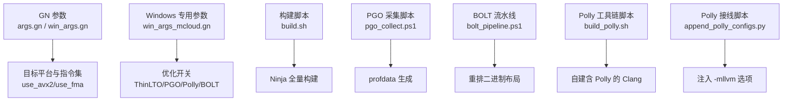
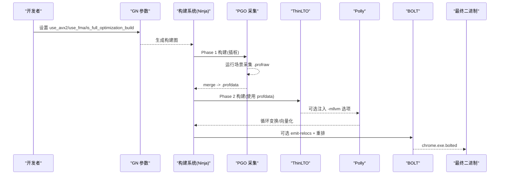
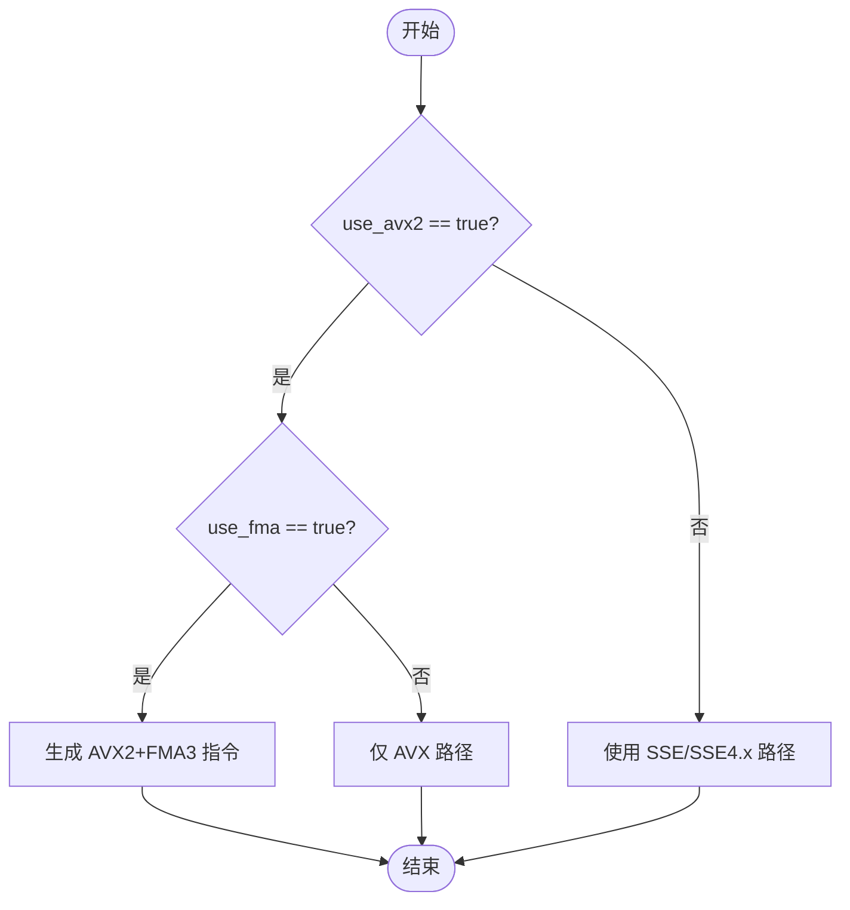
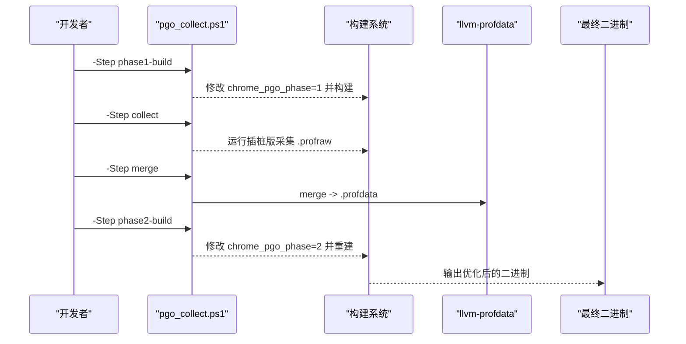
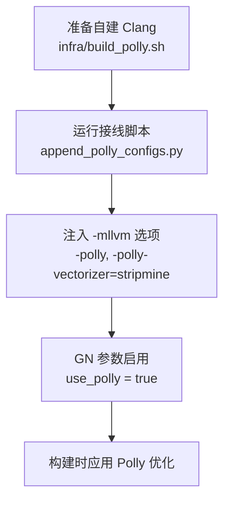
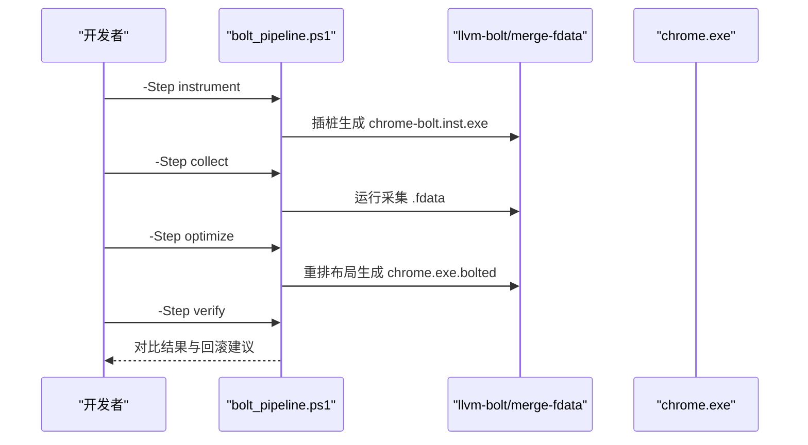
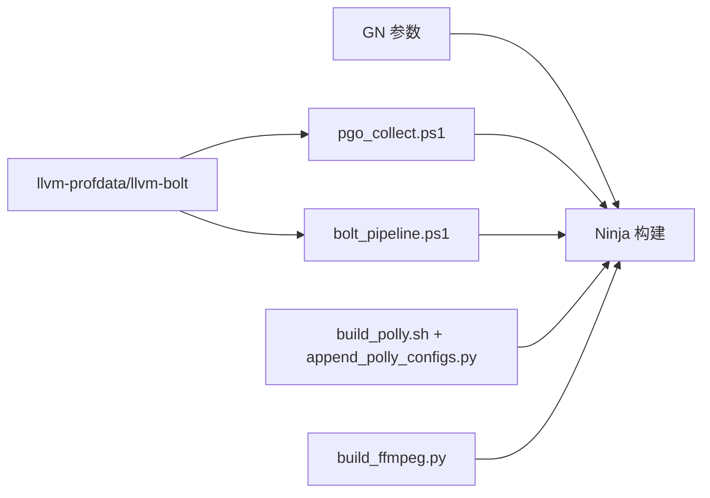

# 编译器优化

本文引用的文件

- [args.gn](https://github.com/Mcloud136/Mcloud-Browser/blob/main/args.gn)
- [win_args.gn](https://github.com/Mcloud136/Mcloud-Browser/blob/main/win_args.gn)
- [other/AVX2/AVX2_args.gn](https://github.com/Mcloud136/Mcloud-Browser/blob/main/other/AVX2/AVX2_args.gn)
- [other/AVX512/AVX512_args.gn](https://github.com/Mcloud136/Mcloud-Browser/blob/main/other/AVX512/AVX512_args.gn)
- [win_args_mcloud.gn](https://github.com/Mcloud136/Mcloud-Browser/blob/main/win_args_mcloud.gn)
- [build.sh](https://github.com/Mcloud136/Mcloud-Browser/blob/main/build.sh)
- [infra/build_polly.sh](https://github.com/Mcloud136/Mcloud-Browser/blob/main/infra/build_polly.sh)
- [benchmark/tools/bolt_pipeline.ps1](https://github.com/Mcloud136/Mcloud-Browser/blob/main/benchmark/tools/bolt_pipeline.ps1)
- [benchmark/tools/pgo_collect.ps1](https://github.com/Mcloud136/Mcloud-Browser/blob/main/benchmark/tools/pgo_collect.ps1)
- [win_scripts/append_polly_configs.py](https://github.com/Mcloud136/Mcloud-Browser/blob/main/win_scripts/append_polly_configs.py)
- [src/tools/clang/scripts/build.py](https://github.com/Mcloud136/Mcloud-Browser/blob/main/src/tools/clang/scripts/build.py)
- [other/build_ffmpeg.py](https://github.com/Mcloud136/Mcloud-Browser/blob/main/other/build_ffmpeg.py)

## 目录
1. [简介](#简介)
2. [项目结构](#项目结构)
3. [核心组件](#核心组件)
4. [架构总览](#架构总览)
5. [详细组件分析](#详细组件分析)
6. [依赖关系分析](#依赖关系分析)
7. [性能考量](#性能考量)
8. [故障排查指南](#故障排查指南)
9. [结论](#结论)
10. [附录](#附录)

## 简介
本文件系统性梳理 MCloud Browser 的编译器优化方案，覆盖以下关键主题：
- AVX2 + FMA3 原生编译与指令集检测、条件编译和优化路径选择
- -O3 极致优化级别的启用与影响（代码生成、内联策略、循环展开）
- ThinLTO + PGO 跨文件优化的完整工作流（数据收集、热点识别、链接时优化）
- Polly 循环优化框架的配置与使用（循环变换、向量化、并行化）
- BOLT 二进制布局优化的实现细节与性能提升效果

目标读者包括构建工程师、性能工程师以及希望理解 MCloud 构建与优化策略的开发者。

## 项目结构
MCloud 在根目录提供多套 GN 参数配置，用于不同目标平台与指令集特性；同时通过脚本工具链串联 PGO、BOLT、Polly 等高级优化流程。

图表来源
- [args.gn:1-87](https://github.com/Mcloud136/Mcloud-Browser/blob/main/args.gn#L1-L87)
- [win_args.gn:1-87](https://github.com/Mcloud136/Mcloud-Browser/blob/main/win_args.gn#L1-L87)
- [win_args_mcloud.gn:1-126](https://github.com/Mcloud136/Mcloud-Browser/blob/main/win_args_mcloud.gn#L1-L126)
- [build.sh:1-59](https://github.com/Mcloud136/Mcloud-Browser/blob/main/build.sh#L1-L59)
- [benchmark/tools/pgo_collect.ps1:1-106](https://github.com/Mcloud136/Mcloud-Browser/blob/main/benchmark/tools/pgo_collect.ps1#L1-L106)
- [benchmark/tools/bolt_pipeline.ps1:1-108](https://github.com/Mcloud136/Mcloud-Browser/blob/main/benchmark/tools/bolt_pipeline.ps1#L1-L108)
- [infra/build_polly.sh:1-97](https://github.com/Mcloud136/Mcloud-Browser/blob/main/infra/build_polly.sh#L1-L97)
- [win_scripts/append_polly_configs.py:1-71](https://github.com/Mcloud136/Mcloud-Browser/blob/main/win_scripts/append_polly_configs.py#L1-L71)

章节来源
- [args.gn:1-87](https://github.com/Mcloud136/Mcloud-Browser/blob/main/args.gn#L1-L87)
- [win_args.gn:1-87](https://github.com/Mcloud136/Mcloud-Browser/blob/main/win_args.gn#L1-L87)
- [win_args_mcloud.gn:1-126](https://github.com/Mcloud136/Mcloud-Browser/blob/main/win_args_mcloud.gn#L1-L126)
- [build.sh:1-59](https://github.com/Mcloud136/Mcloud-Browser/blob/main/build.sh#L1-L59)

## 核心组件
- 指令集与平台参数：通过 use_avx2、use_fma、target_os、target_cpu 等 GN 变量控制编译目标与 SIMD 能力。
- 极致优化级别：is_full_optimization_build = true 表示启用 -O3 激进优化。
- 跨模块优化：use_thin_lto 与 thin_lto_enable_optimizations 开启 ThinLTO。
- 性能导向优化：chrome_pgo_phase 与 pgo_data_path 驱动 PGO 两阶段构建。
- 循环优化：use_polly 配合 append_polly_configs.py 注入 Polly 相关 -mllvm 选项。
- 二进制布局优化：use_bolt 配合 emit-relocs 与 bolt_pipeline.ps1 完成后链接重排。

章节来源
- [win_args_mcloud.gn:10-57](https://github.com/Mcloud136/Mcloud-Browser/blob/main/win_args_mcloud.gn#L10-L57)
- [args.gn:1-87](https://github.com/Mcloud136/Mcloud-Browser/blob/main/args.gn#L1-L87)
- [other/AVX2/AVX2_args.gn:1-87](https://github.com/Mcloud136/Mcloud-Browser/blob/main/other/AVX2/AVX2_args.gn#L1-L87)
- [other/AVX512/AVX512_args.gn:1-87](https://github.com/Mcloud136/Mcloud-Browser/blob/main/other/AVX512/AVX512_args.gn#L1-L87)

## 架构总览
下图展示从源码到最终可执行文件的优化管线，涵盖指令集选择、PGO、ThinLTO、Polly 与 BOLT 的关键节点。

图表来源
- [win_args_mcloud.gn:33-57](https://github.com/Mcloud136/Mcloud-Browser/blob/main/win_args_mcloud.gn#L33-L57)
- [benchmark/tools/pgo_collect.ps1:47-99](https://github.com/Mcloud136/Mcloud-Browser/blob/main/benchmark/tools/pgo_collect.ps1#L47-L99)
- [win_scripts/append_polly_configs.py:26-71](https://github.com/Mcloud136/Mcloud-Browser/blob/main/win_scripts/append_polly_configs.py#L26-L71)
- [benchmark/tools/bolt_pipeline.ps1:47-105](https://github.com/Mcloud136/Mcloud-Browser/blob/main/benchmark/tools/bolt_pipeline.ps1#L47-L105)

## 详细组件分析

### AVX2 + FMA3 原生编译与指令集检测
- 指令集开关：通过 use_avx2、use_fma、use_avx 等 GN 变量启用对应 SIMD 能力。Windows 专用参数明确目标为 AVX2 + FMA3，并禁用 AVX512 以兼容更广泛 CPU。
- 条件编译：各平台 args.gn 文件集中管理目标 OS/CPU 与特性开关，便于在不同分支或变体中切换。
- 优化路径选择：当 use_avx2=true 且 use_fma=true 时，编译器将针对支持 AVX2/FMA3 的 CPU 生成相应指令；若目标不支持，需回退至通用 x64 构建。

图表来源
- [win_args_mcloud.gn:10-18](https://github.com/Mcloud136/Mcloud-Browser/blob/main/win_args_mcloud.gn#L10-L18)
- [args.gn:1-8](https://github.com/Mcloud136/Mcloud-Browser/blob/main/args.gn#L1-L8)
- [other/AVX2/AVX2_args.gn:1-8](https://github.com/Mcloud136/Mcloud-Browser/blob/main/other/AVX2/AVX2_args.gn#L1-L8)
- [other/AVX512/AVX512_args.gn:1-8](https://github.com/Mcloud136/Mcloud-Browser/blob/main/other/AVX512/AVX512_args.gn#L1-L8)

章节来源
- [win_args_mcloud.gn:10-18](https://github.com/Mcloud136/Mcloud-Browser/blob/main/win_args_mcloud.gn#L10-L18)
- [args.gn:1-8](https://github.com/Mcloud136/Mcloud-Browser/blob/main/args.gn#L1-L8)
- [other/AVX2/AVX2_args.gn:1-8](https://github.com/Mcloud136/Mcloud-Browser/blob/main/other/AVX2/AVX2_args.gn#L1-L8)
- [other/AVX512/AVX512_args.gn:1-8](https://github.com/Mcloud136/Mcloud-Browser/blob/main/other/AVX512/AVX512_args.gn#L1-L8)

### -O3 极致优化级别的影响
- 启用方式：is_full_optimization_build = true 指示启用 -O3 激进优化。该级别会增强函数内联、循环展开、指令调度等优化。
- 影响范围：
  - 代码生成：更激进的寄存器分配与指令选择，可能增加二进制体积但提升运行时性能。
  - 内联策略：提高内联阈值，减少函数调用开销。
  - 循环展开：对热点循环进行展开以提升吞吐。
- 注意事项：-O3 可能与某些第三方库（如 FFmpeg）的优化标志交互，需确保整体构建一致。

章节来源
- [win_args_mcloud.gn:43-43](https://github.com/Mcloud136/Mcloud-Browser/blob/main/win_args_mcloud.gn#L43-L43)
- [other/build_ffmpeg.py:738-743](https://github.com/Mcloud136/Mcloud-Browser/blob/main/other/build_ffmpeg.py#L738-L743)

### ThinLTO + PGO 跨文件优化工作流
- ThinLTO：use_thin_lto 与 thin_lto_enable_optimizations 开启跨翻译单元优化，减少符号冗余、改进内联与死代码消除。
- PGO 两阶段构建：
  - Phase 1：构建插桩版本，运行典型场景采集 .profraw。
  - Merge：合并多个 .profraw 生成 .profdata。
  - Phase 2：使用 .profdata 重新构建，基于热点信息进行更精准的优化。
- 自动化脚本：pgo_collect.ps1 提供分阶段指引与自动修改 args.gn 的能力。

图表来源
- [benchmark/tools/pgo_collect.ps1:47-99](https://github.com/Mcloud136/Mcloud-Browser/blob/main/benchmark/tools/pgo_collect.ps1#L47-L99)
- [win_args_mcloud.gn:52-57](https://github.com/Mcloud136/Mcloud-Browser/blob/main/win_args_mcloud.gn#L52-L57)
- [args.gn:85-87](https://github.com/Mcloud136/Mcloud-Browser/blob/main/args.gn#L85-L87)
- [win_args.gn:85-87](https://github.com/Mcloud136/Mcloud-Browser/blob/main/win_args.gn#L85-L87)

章节来源
- [benchmark/tools/pgo_collect.ps1:1-106](https://github.com/Mcloud136/Mcloud-Browser/blob/main/benchmark/tools/pgo_collect.ps1#L1-L106)
- [win_args_mcloud.gn:52-57](https://github.com/Mcloud136/Mcloud-Browser/blob/main/win_args_mcloud.gn#L52-L57)
- [args.gn:85-87](https://github.com/Mcloud136/Mcloud-Browser/blob/main/args.gn#L85-L87)
- [win_args.gn:85-87](https://github.com/Mcloud136/Mcloud-Browser/blob/main/win_args.gn#L85-L87)

### Polly 循环优化框架配置与使用
- 前置条件：Chromium 内置 Clang 不含 Polly，需通过 infra/build_polly.sh 自建包含 Polly 的 Clang。
- 接线方式：win_scripts/append_polly_configs.py 向 compiler/BUILD.gn 追加 config("polly") 与 config("emit-relocs")，注入 -mllvm 选项。
- 优化内容：循环探测、利润评估、向量化（stripmine）、DCE 等。
- 启用方式：在 GN 参数中设置 use_polly = true，并确保已自建含 Polly 的 Clang。

图表来源
- [infra/build_polly.sh:57-97](https://github.com/Mcloud136/Mcloud-Browser/blob/main/infra/build_polly.sh#L57-L97)
- [win_scripts/append_polly_configs.py:26-71](https://github.com/Mcloud136/Mcloud-Browser/blob/main/win_scripts/append_polly_configs.py#L26-L71)
- [win_args_mcloud.gn:44-50](https://github.com/Mcloud136/Mcloud-Browser/blob/main/win_args_mcloud.gn#L44-L50)

章节来源
- [infra/build_polly.sh:1-97](https://github.com/Mcloud136/Mcloud-Browser/blob/main/infra/build_polly.sh#L1-L97)
- [win_scripts/append_polly_configs.py:1-71](https://github.com/Mcloud136/Mcloud-Browser/blob/main/win_scripts/append_polly_configs.py#L1-L71)
- [win_args_mcloud.gn:44-50](https://github.com/Mcloud136/Mcloud-Browser/blob/main/win_args_mcloud.gn#L44-L50)

### BOLT 二进制布局优化实现细节
- 前置条件：需要 llvm-bolt.exe 与 merge-fdata.exe；构建时需启用 use_bolt = true 并保留重定位信息（emit-relocs）。
- 流水线步骤：
  - instrument：对 chrome.exe 插桩生成 chrome-bolt.inst.exe。
  - collect：运行插桩版采集真实负载 profile，产出 .fdata。
  - optimize：依据 .fdata 重排二进制布局，生成 chrome.exe.bolted。
  - verify：冷启动对比验证，通过后替换正式产物。
- 优化策略：块重排序、函数重排序、冷热分离、ICF、跳转表优化等。

图表来源
- [benchmark/tools/bolt_pipeline.ps1:1-108](https://github.com/Mcloud136/Mcloud-Browser/blob/main/benchmark/tools/bolt_pipeline.ps1#L1-L108)
- [win_scripts/append_polly_configs.py:30-40](https://github.com/Mcloud136/Mcloud-Browser/blob/main/win_scripts/append_polly_configs.py#L30-L40)
- [src/tools/clang/scripts/build.py:1704-1731](https://github.com/Mcloud136/Mcloud-Browser/blob/main/src/tools/clang/scripts/build.py#L1704-L1731)

章节来源
- [benchmark/tools/bolt_pipeline.ps1:1-108](https://github.com/Mcloud136/Mcloud-Browser/blob/main/benchmark/tools/bolt_pipeline.ps1#L1-L108)
- [win_scripts/append_polly_configs.py:30-40](https://github.com/Mcloud136/Mcloud-Browser/blob/main/win_scripts/append_polly_configs.py#L30-L40)
- [src/tools/clang/scripts/build.py:1704-1731](https://github.com/Mcloud136/Mcloud-Browser/blob/main/src/tools/clang/scripts/build.py#L1704-L1731)

## 依赖关系分析
- GN 参数层：args.gn/win_args.gn/win_args_mcloud.gn 定义目标平台、指令集与优化开关。
- 脚本层：pgo_collect.ps1、bolt_pipeline.ps1、build_polly.sh、append_polly_configs.py 串联 PGO、BOLT、Polly。
- 构建层：build.sh 调用 Ninja 执行全量构建；FFmpeg 构建脚本可独立设置优化等级。
- 外部工具：llvm-profdata、llvm-bolt、merge-fdata 需自备或通过自建 Clang 获得。

图表来源
- [args.gn:1-87](https://github.com/Mcloud136/Mcloud-Browser/blob/main/args.gn#L1-L87)
- [win_args.gn:1-87](https://github.com/Mcloud136/Mcloud-Browser/blob/main/win_args.gn#L1-L87)
- [win_args_mcloud.gn:1-126](https://github.com/Mcloud136/Mcloud-Browser/blob/main/win_args_mcloud.gn#L1-L126)
- [build.sh:1-59](https://github.com/Mcloud136/Mcloud-Browser/blob/main/build.sh#L1-L59)
- [benchmark/tools/pgo_collect.ps1:1-106](https://github.com/Mcloud136/Mcloud-Browser/blob/main/benchmark/tools/pgo_collect.ps1#L1-L106)
- [benchmark/tools/bolt_pipeline.ps1:1-108](https://github.com/Mcloud136/Mcloud-Browser/blob/main/benchmark/tools/bolt_pipeline.ps1#L1-L108)
- [infra/build_polly.sh:1-97](https://github.com/Mcloud136/Mcloud-Browser/blob/main/infra/build_polly.sh#L1-L97)
- [other/build_ffmpeg.py:710-756](https://github.com/Mcloud136/Mcloud-Browser/blob/main/other/build_ffmpeg.py#L710-L756)

章节来源
- [args.gn:1-87](https://github.com/Mcloud136/Mcloud-Browser/blob/main/args.gn#L1-L87)
- [win_args.gn:1-87](https://github.com/Mcloud136/Mcloud-Browser/blob/main/win_args.gn#L1-L87)
- [win_args_mcloud.gn:1-126](https://github.com/Mcloud136/Mcloud-Browser/blob/main/win_args_mcloud.gn#L1-L126)
- [build.sh:1-59](https://github.com/Mcloud136/Mcloud-Browser/blob/main/build.sh#L1-L59)
- [other/build_ffmpeg.py:710-756](https://github.com/Mcloud136/Mcloud-Browser/blob/main/other/build_ffmpeg.py#L710-L756)

## 性能考量
- 指令集匹配：确保目标 CPU 支持 AVX2/FMA3，否则应回退至通用构建以避免运行时异常。
- -O3 权衡：激进优化可能增大二进制体积并影响调试体验，建议在发布构建中使用。
- PGO 数据质量：采集场景应尽量贴近真实用户行为，避免偏置导致热点误判。
- Polly 适用性：循环密集型代码受益明显，需结合基准测试验证收益。
- BOLT 稳定性：重排后需充分回归测试，尤其是冷启动与异常路径。

## 故障排查指南
- Polly 未生效：确认已通过 infra/build_polly.sh 自建含 Polly 的 Clang，并运行 append_polly_configs.py 注入配置。
- PGO 数据不匹配：确保 .profdata 与内核大版本严格匹配，升级 Chromium 时需同步更新。
- BOLT 失败：检查是否具备 llvm-bolt.exe 与 merge-fdata.exe，并确保构建启用了 emit-relocs。
- 构建失败：核对 GN 参数中的 is_debug、symbol_level、thin_lto_enable_cache 等是否与目标环境一致。

章节来源
- [infra/build_polly.sh:57-97](https://github.com/Mcloud136/Mcloud-Browser/blob/main/infra/build_polly.sh#L57-L97)
- [win_scripts/append_polly_configs.py:26-71](https://github.com/Mcloud136/Mcloud-Browser/blob/main/win_scripts/append_polly_configs.py#L26-L71)
- [benchmark/tools/pgo_collect.ps1:47-99](https://github.com/Mcloud136/Mcloud-Browser/blob/main/benchmark/tools/pgo_collect.ps1#L47-L99)
- [benchmark/tools/bolt_pipeline.ps1:30-40](https://github.com/Mcloud136/Mcloud-Browser/blob/main/benchmark/tools/bolt_pipeline.ps1#L30-L40)

## 结论
MCloud Browser 通过精细的 GN 参数管理与脚本化工具链，实现了从指令集选择、极致优化、跨模块优化到二进制布局优化的完整闭环。合理运用 AVX2+FMA3、-O3、ThinLTO+PGO、Polly 与 BOLT，可在保证稳定性的前提下显著提升性能。建议在生产构建中启用上述优化，并结合基准测试与回归测试持续验证效果。

## 附录
- 快速参考：
  - 启用 AVX2+FMA3：设置 use_avx2=true、use_fma=true。
  - 启用 -O3：设置 is_full_optimization_build=true。
  - 启用 ThinLTO：设置 use_thin_lto=true、thin_lto_enable_optimizations=true。
  - 启用 PGO：设置 chrome_pgo_phase=2 并指向有效 .profdata。
  - 启用 Polly：先自建 Clang，再运行接线脚本并设置 use_polly=true。
  - 启用 BOLT：设置 use_bolt=true 并运行 bolt_pipeline.ps1。