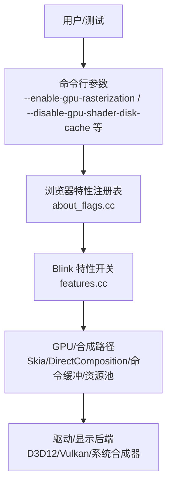
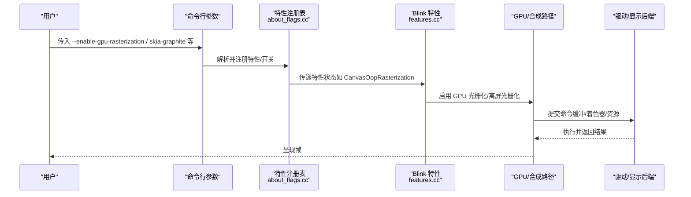
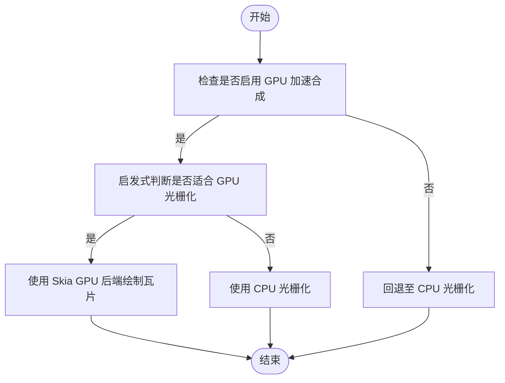
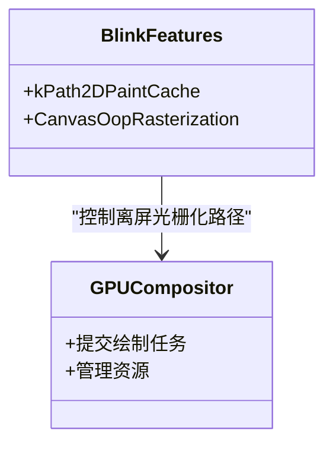
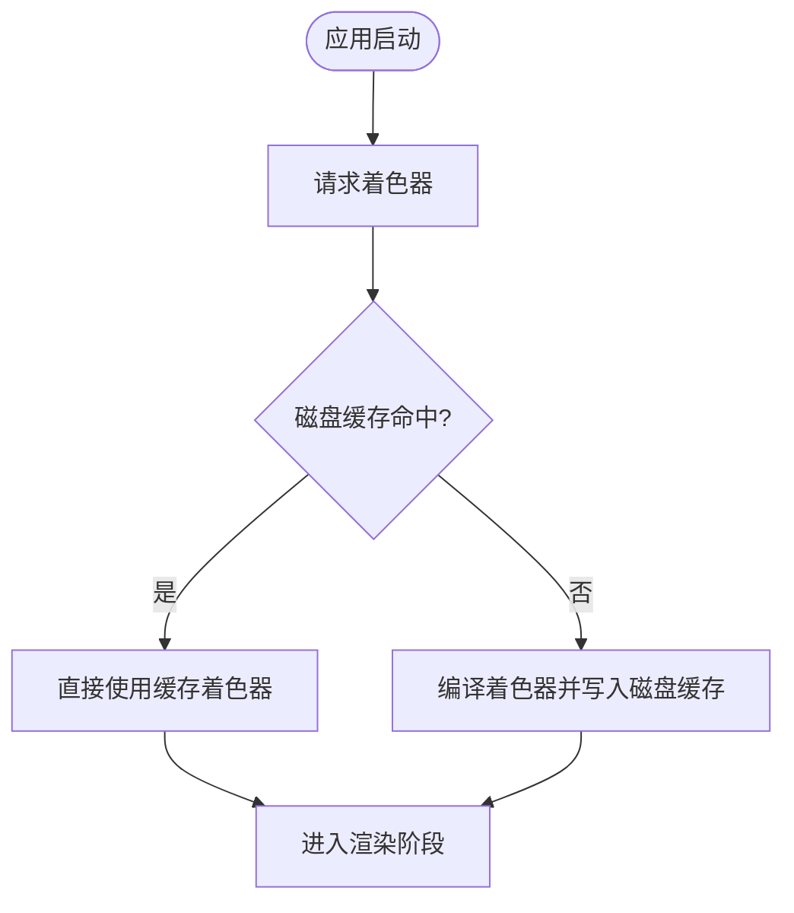
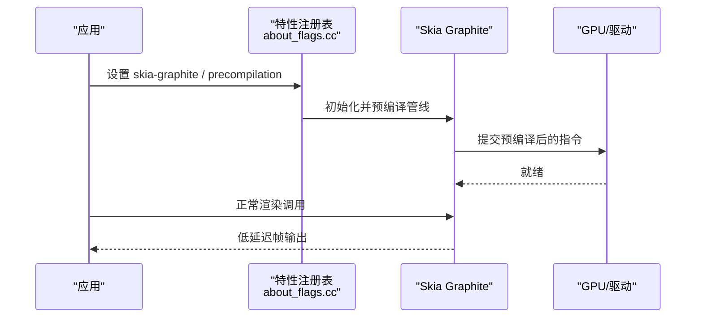

# GPU 渲染优化

<cite>
**本文引用的文件**
- [about_flags.cc](file://src/chrome/browser/about_flags.cc)
- [features.cc](file://src/third_party/blink/common/features.cc)
- [mcloud_flag_entries.h](file://src/chrome/browser/mcloud_flag_entries.h)
- [mcloud_flag_choices.h](file://src/chrome/browser/mcloud_flag_choices.h)
- [CMDLINE_FLAGS_LIST.md](file://docs/CMDLINE_FLAGS_LIST.md)
- [2026-06-20-release-notes-m150.md](file://docs/superpowers/specs/2026-06-20-release-notes-m150.md)
- [2026-06-19-performance-optimization-design.md](file://docs/superpowers/specs/2026-06-19-performance-optimization-design.md)
- [DEBUGGING.md](file://infra/DEBUG/DEBUGGING.md)
- [diag_igpu_green_screen.ps1](file://benchmark/tools/diag_igpu_green_screen.ps1)
</cite>

## 目录
1. [简介](#简介)
2. [项目结构](#项目结构)
3. [核心组件](#核心组件)
4. [架构总览](#架构总览)
5. [详细组件分析](#详细组件分析)
6. [依赖关系分析](#依赖关系分析)
7. [性能考量](#性能考量)
8. [故障排除指南](#故障排除指南)
9. [结论](#结论)
10. [附录](#附录)

## 简介
本文件聚焦 MCloud Browser 的 GPU 渲染优化，围绕以下主题展开：
- GPU 光栅化（enable-gpu-rasterization）与画布离屏光栅化（CanvasOopRasterization）的工作原理与影响
- 着色器磁盘缓存、命令缓冲区解析切片增加、资源池精确大小重用等关键优化
- Skia Graphite 预编译与启用带来的性能收益
- Windows 平台 DirectComposition 对渲染路径的影响
- GPU 性能监控与故障排除实践

## 项目结构
MCloud Browser 在 GPU 渲染相关的能力主要通过“启动参数/特性开关”暴露给运行时，并在浏览器层进行组合与落地。本次文档涉及的关键位置包括：
- 功能开关定义与 UI 暴露：about_flags.cc
- Blink 侧特性声明：features.cc
- MCloud 自定义入口与选择项：mcloud_flag_entries.h、mcloud_flag_choices.h
- 命令行参数清单：CMDLINE_FLAGS_LIST.md
- 发布说明与设计文档：release notes、performance optimization design
- 调试与诊断工具：DEBUGGING.md、绿屏二分定位脚本

图表来源
- [about_flags.cc:9962-9971](file://src/chrome/browser/about_flags.cc#L9962-L9971)
- [features.cc:1870-1873](file://src/third_party/blink/common/features.cc#L1870-L1873)

章节来源
- [about_flags.cc:9962-9971](file://src/chrome/browser/about_flags.cc#L9962-L9971)
- [features.cc:1870-1873](file://src/third_party/blink/common/features.cc#L1870-L1873)

## 核心组件
- GPU 光栅化开关：通过命令行参数 enable-gpu-rasterization 控制是否允许使用 GPU 后端绘制图层瓦片；该开关仅在启用 GPU 加速合成的前提下有效。
- 画布离屏光栅化：Blink 中通过特性开关控制 Path2D 等对象在进程外光栅化的 PaintCache 行为，受 CanvasOopRasterization 特性控制。
- Skia Graphite：提供新的渲染后端能力，支持预编译管线以减少首次使用卡顿，并通过特性开关启用。
- 着色器磁盘缓存：通过命令行参数控制 GPU 着色器的磁盘缓存，避免重复编译开销。
- 命令缓冲区解析切片：将单次解析的命令条数从默认值提升到更高数值，减少上下文切换成本。
- 资源池精确大小复用：优先复用精确大小的 GPU 资源，降低内存碎片。
- Windows DirectComposition：在 Windows 上通过系统合成器提升合成效率，减少拷贝与同步开销。

章节来源
- [CMDLINE_FLAGS_LIST.md:1156-1178](file://docs/CMDLINE_FLAGS_LIST.md#L1156-L1178)
- [features.cc:1870-1873](file://src/third_party/blink/common/features.cc#L1870-L1873)
- [about_flags.cc:9962-9971](file://src/chrome/browser/about_flags.cc#L9962-L9971)
- [2026-06-20-release-notes-m150.md:167-173](file://docs/superpowers/specs/2026-06-20-release-notes-m150.md#L167-L173)

## 架构总览
下图展示了 GPU 渲染优化的关键路径：从命令行参数到特性注册，再到 Blink/GPU 后端的启用与执行。

图表来源
- [about_flags.cc:9962-9971](file://src/chrome/browser/about_flags.cc#L9962-L9971)
- [features.cc:1870-1873](file://src/third_party/blink/common/features.cc#L1870-L1873)
- [CMDLINE_FLAGS_LIST.md:1156-1178](file://docs/CMDLINE_FLAGS_LIST.md#L1156-L1178)

## 详细组件分析

### GPU 光栅化（enable-gpu-rasterization）
- 作用：允许根据启发式策略决定何时使用 Skia GPU 后端绘制图层瓦片，前提是启用了 GPU 加速合成。
- 影响：可显著降低 CPU 光栅化压力，提高滚动与动画流畅度；但需确保 GPU 驱动稳定且具备足够显存。
- 相关参数：
  - --enable-gpu-rasterization：启用 GPU 光栅化
  - --disable-gpu-rasterization：禁用 GPU 光栅化
  - --num-raster-threads：设置光栅化线程数（MCloud 扩展选项）
  - --gpu-rasterization-msaa-sample-count：MSAA 采样数（MCloud 扩展选项）

图表来源
- [CMDLINE_FLAGS_LIST.md:1174-1174](file://docs/CMDLINE_FLAGS_LIST.md#L1174-L1174)
- [mcloud_flag_choices.h:88-123](file://src/chrome/browser/mcloud_flag_choices.h#L88-L123)

章节来源
- [CMDLINE_FLAGS_LIST.md:1174-1174](file://docs/CMDLINE_FLAGS_LIST.md#L1174-L1174)
- [mcloud_flag_entries.h:173-183](file://src/chrome/browser/mcloud_flag_entries.h#L173-L183)
- [mcloud_flag_choices.h:88-123](file://src/chrome/browser/mcloud_flag_choices.h#L88-L123)

### 画布离屏光栅化（CanvasOopRasterization）
- 作用：在 Blink 中，Path2D 等对象的 PaintCache 可在进程外光栅化，受 CanvasOopRasterization 特性控制。
- 影响：将重绘/复杂路径绘制移出主进程，减轻主线程压力，有助于提升交互响应性。
- 注意：当 CanvasOopRasterization 未启用时，PaintCache 的进程外行为不生效。

图表来源
- [features.cc:1870-1873](file://src/third_party/blink/common/features.cc#L1870-L1873)

章节来源
- [features.cc:1870-1873](file://src/third_party/blink/common/features.cc#L1870-L1873)

### 着色器磁盘缓存（GpuShaderDiskCache）
- 作用：启用或禁用 GPU 着色器的磁盘缓存，避免重复编译相同着色器带来的启动与首帧卡顿。
- 相关参数：
  - --disable-gpu-shader-disk-cache：禁用着色器磁盘缓存
  - --enable-gpu-client-logging / --enable-gpu-service-tracing：辅助排查着色器加载与编译问题

图表来源
- [CMDLINE_FLAGS_LIST.md:1160-1168](file://docs/CMDLINE_FLAGS_LIST.md#L1160-L1168)

章节来源
- [CMDLINE_FLAGS_LIST.md:1160-1168](file://docs/CMDLINE_FLAGS_LIST.md#L1160-L1168)

### 命令缓冲区解析切片增加（IncreasedCmdBufferParseSlice）
- 作用：将每次解析的命令条数从默认值提升到更高数量（例如从 20 增加到 100），减少上下文切换与解析开销。
- 影响：在高负载场景下可降低 GPU 主线程阻塞时间，提升整体吞吐。

章节来源
- [2026-06-20-release-notes-m150.md:167-173](file://docs/superpowers/specs/2026-06-20-release-notes-m150.md#L167-L173)

### 资源池精确大小重用（ResourcePoolPreferExactSizeReuse）
- 作用：优先复用精确大小的 GPU 资源，减少分配与碎片，降低内存抖动。
- 影响：在多标签页与高动态页面场景中，有助于稳定显存占用与帧时间。

章节来源
- [2026-06-20-release-notes-m150.md:167-173](file://docs/superpowers/specs/2026-06-20-release-notes-m150.md#L167-L173)

### Skia Graphite 预编译与启用（SkiaGraphitePrecompilation / SkiaGraphite）
- 作用：
  - SkiaGraphitePrecompilation：预编译渲染管线，消除首次使用着色器/管线编译导致的卡顿。
  - SkiaGraphite：启用新的 Skia Graphite 渲染后端，结合预编译带来更平滑的首帧与持续渲染体验。
- 相关参数：
  - skia-graphite-precompilation：开启预编译
  - skia-graphite：启用 Graphite 后端（含多种变体参数）

图表来源
- [about_flags.cc:9962-9971](file://src/chrome/browser/about_flags.cc#L9962-L9971)

章节来源
- [about_flags.cc:9962-9971](file://src/chrome/browser/about_flags.cc#L9962-L9971)
- [2026-06-20-release-notes-m150.md:167-173](file://docs/superpowers/specs/2026-06-20-release-notes-m150.md#L167-L173)

### Windows DirectComposition 渲染优化
- 作用：在 Windows 平台上，DirectComposition 可将合成工作交由系统合成器处理，减少跨进程数据拷贝与同步，提升窗口/视频/全屏等场景的流畅度。
- 建议：结合 --enable-hardware-overlays 与合适的驱动配置，以获得最佳效果；若出现花屏/绿屏，可通过二分法逐步隔离问题层级。

章节来源
- [2026-06-20-release-notes-m150.md:167-173](file://docs/superpowers/specs/2026-06-20-release-notes-m150.md#L167-L173)
- [diag_igpu_green_screen.ps1:1-95](file://benchmark/tools/diag_igpu_green_screen.ps1#L1-L95)

## 依赖关系分析
- 特性开关依赖：
  - enable-gpu-rasterization 依赖 GPU 加速合成可用
  - CanvasOopRasterization 控制 Path2D 等对象的进程外光栅化
  - Skia Graphite 需要预编译与后端启用协同工作
- 构建与运行期：
  - 命令行参数在 about_flags.cc 中注册为特性/开关
  - Blink 特性在 features.cc 中声明，供上层逻辑读取
  - MCloud 扩展了部分 GPU 相关选项（如光栅化线程数、MSAA 采样数、GPU 显存限制等）

图表来源
- [about_flags.cc:9962-9971](file://src/chrome/browser/about_flags.cc#L9962-L9971)
- [features.cc:1870-1873](file://src/third_party/blink/common/features.cc#L1870-L1873)

章节来源
- [about_flags.cc:9962-9971](file://src/chrome/browser/about_flags.cc#L9962-L9971)
- [features.cc:1870-1873](file://src/third_party/blink/common/features.cc#L1870-L1873)
- [mcloud_flag_entries.h:173-220](file://src/chrome/browser/mcloud_flag_entries.h#L173-L220)
- [mcloud_flag_choices.h:88-134](file://src/chrome/browser/mcloud_flag_choices.h#L88-L134)

## 性能考量
- 冷启动与首帧：启用 Skia Graphite 预编译可显著减少首次渲染卡顿；着色器磁盘缓存可减少重复编译。
- 多标签页与高负载：命令缓冲区解析切片增加与资源池精确大小复用有助于降低上下文切换与内存碎片。
- 视频播放：Windows 平台建议结合 DirectComposition 与硬件叠加层（hardware overlays）优化视频路径。
- 预期收益：设计文档指出 GPU 渲染效率有 5-10% 的提升空间，配合其他优化可获得更全面的体验改善。

章节来源
- [2026-06-19-performance-optimization-design.md:179-188](file://docs/superpowers/specs/2026-06-19-performance-optimization-design.md#L179-L188)
- [2026-06-20-release-notes-m150.md:167-173](file://docs/superpowers/specs/2026-06-20-release-notes-m150.md#L167-L173)

## 故障排除指南
- 启用日志与追踪：
  - --enable-gpu-client-logging：记录客户端 GPU 日志
  - --enable-gpu-command-logging：记录 GPU 命令
  - --enable-gpu-service-tracing：记录服务端 GL 调用追踪
- 常见问题定位：
  - 首帧卡顿：检查是否启用 Skia Graphite 预编译与着色器磁盘缓存
  - 滚动掉帧：确认 enable-gpu-rasterization 已启用，调整光栅化线程数与 MSAA 采样
  - 视频绿屏/花屏：使用二分定位脚本逐步隔离 DComp/MPO overlay、D3D12 解码器、硬件 overlay 平面等问题层级
- 调试技巧：
  - 使用 rr 录制与回放多进程执行轨迹，定位渲染异常
  - 观察 chrome://gpu 与 chrome://media-internals 中的工作区与解码器信息

章节来源
- [CMDLINE_FLAGS_LIST.md:1156-1178](file://docs/CMDLINE_FLAGS_LIST.md#L1156-L1178)
- [DEBUGGING.md:281-354](file://infra/DEBUG/DEBUGGING.md#L281-L354)
- [diag_igpu_green_screen.ps1:1-95](file://benchmark/tools/diag_igpu_green_screen.ps1#L1-L95)

## 结论
MCloud Browser 通过一系列 GPU 渲染优化（GPU 光栅化、离屏光栅化、着色器磁盘缓存、命令缓冲区解析切片、资源池复用、Skia Graphite 预编译与启用、DirectComposition 等）显著提升了渲染效率与用户体验。合理配置这些开关并结合日志与诊断工具，可以在不同平台与设备上获得稳定的高性能表现。

## 附录
- 常用命令行参数速查：
  - --enable-gpu-rasterization：启用 GPU 光栅化
  - --disable-gpu-shader-disk-cache：禁用着色器磁盘缓存
  - --enable-gpu-client-logging / --enable-gpu-command-logging / --enable-gpu-service-tracing：GPU 日志与追踪
  - skia-graphite / skia-graphite-precompilation：启用 Graphite 与预编译
  - --enable-hardware-overlays：尝试使用硬件叠加层优化合成

章节来源
- [CMDLINE_FLAGS_LIST.md:1156-1178](file://docs/CMDLINE_FLAGS_LIST.md#L1156-L1178)
- [about_flags.cc:9962-9971](file://src/chrome/browser/about_flags.cc#L9962-L9971)