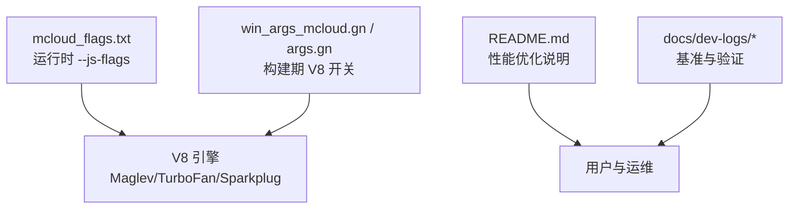
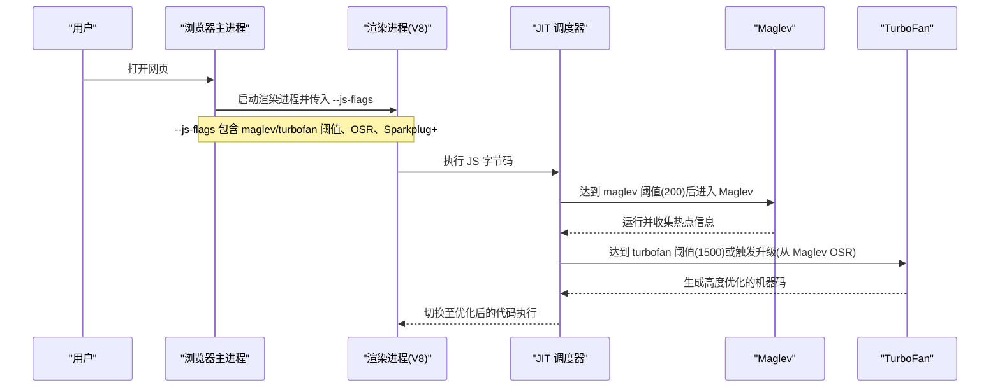
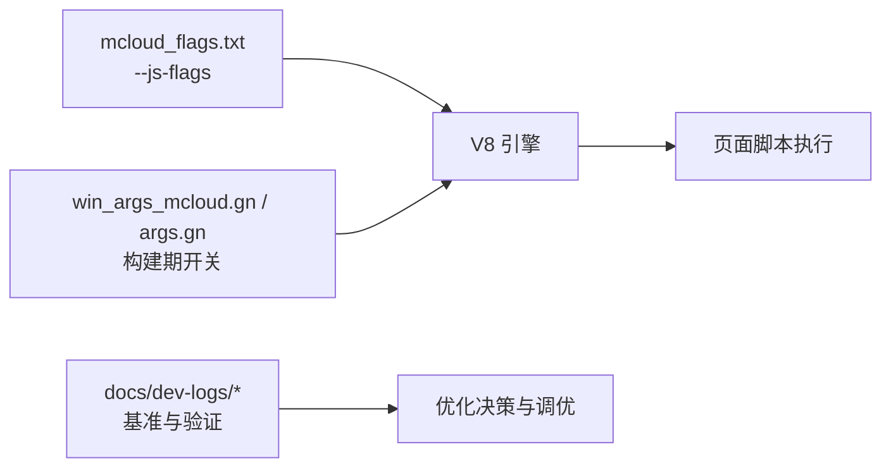

# V8 脚本优化

<cite>
**本文引用的文件**
- [mcloud_flags.txt](file://mcloud_flags.txt)
- [README.md](file://README.md)
- [M151-opt-benchmark.md](file://docs/dev-logs/M151-opt-benchmark.md)
- [phase3-dev-log.md](file://docs/dev-logs/phase3-dev-log.md)
- [win_args_mcloud.gn](file://win_args_mcloud.gn)
- [args.gn](file://args.gn)
</cite>

## 目录
1. [简介](#简介)
2. [项目结构](#项目结构)
3. [核心组件](#核心组件)
4. [架构总览](#架构总览)
5. [详细组件分析](#详细组件分析)
6. [依赖关系分析](#依赖关系分析)
7. [性能考量](#性能考量)
8. [故障排除指南](#故障排除指南)
9. [结论](#结论)
10. [附录](#附录)

## 简介
本文件聚焦 MCloud Browser 中针对 V8 JavaScript 引擎的运行时优化，重点解释以下配置与路径：
- JIT 编译触发阈值调整：invocation_count_for_maglev=200、invocation_count_for_turbofan=1500
- Sparkplug+ 引擎的优势与启用方式（--sparkplug-plus）
- 从 Maglev 到 TurboFan 的优化路径（--osr-from-maglev）
- 这些优化对页面脚本执行的影响：代码生成速度、内存使用、运行时性能
- 针对不同网站类型的优化建议与故障排除

上述内容均基于仓库内已落地的配置与基准记录。

## 项目结构
与 V8 脚本优化直接相关的配置与文档主要分布在如下位置：
- 运行时标志集中管理：mcloud_flags.txt
- 构建期 V8 编译器开关：win_args_mcloud.gn、args.gn
- 基准与开发日志：docs/dev-logs/M151-opt-benchmark.md、docs/dev-logs/phase3-dev-log.md
- 用户可见的性能说明：README.md

图表来源
- [mcloud_flags.txt:54-57](file://mcloud_flags.txt#L54-L57)
- [win_args_mcloud.gn:59-65](file://win_args_mcloud.gn#L59-L65)
- [args.gn:37-42](file://args.gn#L37-L42)
- [README.md:89-96](file://README.md#L89-L96)

章节来源
- [mcloud_flags.txt:54-57](file://mcloud_flags.txt#L54-L57)
- [win_args_mcloud.gn:59-65](file://win_args_mcloud.gn#L59-L65)
- [args.gn:37-42](file://args.gn#L37-L42)
- [README.md:89-96](file://README.md#L89-L96)

## 核心组件
- 运行时 V8 标志（--js-flags）
  - invocation_count_for_maglev=200：降低进入 Maglev 的调用次数阈值，使脚本更快进入快速编译阶段
  - invocation_count_for_turbofan=1500：降低进入 TurboFan 的调用次数阈值，使热点函数更快进入深度优化
  - osr-from-maglev：允许从 Maglev 的 OSR（Optimizing-Super-Polymorphic-Representation）升级到 TurboFan，兼顾启动速度与最终性能
  - sparkplug-plus：启用 Sparkplug 基线代码动态修补，提升内置函数与关键路径的执行效率
- 构建期 V8 开关
  - v8_enable_fast_torque=true、v8_enable_builtins_optimization=true、v8_enable_maglev=true、v8_enable_turbofan=true、use_v8_context_snapshot=true
- 基准与验证
  - 确认 flags 注入子进程生效，且命名需使用下划线形式（M151）
  - 预载类 feature 的内存代价评估与取舍

章节来源
- [mcloud_flags.txt:54-57](file://mcloud_flags.txt#L54-L57)
- [win_args_mcloud.gn:59-65](file://win_args_mcloud.gn#L59-L65)
- [args.gn:37-42](file://args.gn#L37-L42)
- [M151-opt-benchmark.md:30-32](file://docs/dev-logs/M151-opt-benchmark.md#L30-L32)
- [phase3-dev-log.md:65-67](file://docs/dev-logs/phase3-dev-log.md#L65-L67)

## 架构总览
下图展示浏览器启动时如何把 --js-flags 注入到渲染进程，并驱动 V8 的 JIT 编译路径选择。

图表来源
- [mcloud_flags.txt:54-57](file://mcloud_flags.txt#L54-L57)
- [win_args_mcloud.gn:59-65](file://win_args_mcloud.gn#L59-L65)
- [README.md:89-96](file://README.md#L89-L96)

## 详细组件分析

### JIT 编译阈值调整（maglev=200, turbofan=1500）
- 作用机制
  - 默认情况下，V8 会在一定调用次数后分别进入 Maglev（快速编译）和 TurboFan（深度优化）。本项目将 Maglev 阈值降至 200、TurboFan 阈值降至 1500，使脚本更早进入优化路径，减少解释执行的耗时。
  - 在 M151 中，必须使用下划线命名（如 invocation_count_for_maglev），旧连字符写法不生效。
- 预期影响
  - 代码生成速度：更早进入 Maglev，首段热点代码更快被编译为机器码，首屏交互更流畅
  - 运行时性能：热点函数更快进入 TurboFan，获得更高优化收益
  - 内存使用：提前编译会引入额外代码缓存与元数据，但相比解释执行的整体开销通常更优；同时结合上下文快照等构建期优化可缓解部分压力
- 依据与验证
  - 标志注入与命名修正已在基准日志中确认
  - README 中对阈值减半的效果进行了说明

章节来源
- [mcloud_flags.txt:54-57](file://mcloud_flags.txt#L54-L57)
- [phase3-dev-log.md:65-67](file://docs/dev-logs/phase3-dev-log.md#L65-L67)
- [M151-opt-benchmark.md:30-32](file://docs/dev-logs/M151-opt-benchmark.md#L30-L32)
- [README.md:89-96](file://README.md#L89-L96)

### 从 Maglev 到 TurboFan 的优化路径（--osr-from-maglev）
- 作用机制
  - 通过 OSR（Optimizing-Super-Polymorphic-Representation），允许在 Maglev 执行过程中无缝切换到 TurboFan 的优化版本，避免重新从头编译带来的延迟
- 预期影响
  - 平滑过渡：在执行热点循环或函数时，可在合适时机升级为 TurboFan，兼顾启动速度与最终性能
  - 减少抖动：避免频繁回退与重编译导致的卡顿
- 依据与验证
  - 该标志已随 --js-flags 注入并生效

章节来源
- [mcloud_flags.txt:54-57](file://mcloud_flags.txt#L54-L57)
- [README.md:89-96](file://README.md#L89-L96)

### Sparkplug+ 引擎（--sparkplug-plus）
- 作用机制
  - 启用 Sparkplug 基线代码的动态修补能力，针对内置函数与关键路径进行运行时优化，进一步提升执行效率
- 预期影响
  - 内置函数与常用 API 执行更快，整体脚本执行性能提升
  - 与 Maglev/TurboFan 协同工作，形成“快速启动 + 深度优化”的组合优势
- 依据与验证
  - 该标志已随 --js-flags 注入并生效

章节来源
- [mcloud_flags.txt:54-57](file://mcloud_flags.txt#L54-L57)
- [README.md:89-96](file://README.md#L89-L96)

### 构建期 V8 开关与上下文快照
- 构建期开关
  - v8_enable_fast_torque=true、v8_enable_builtins_optimization=true、v8_enable_maglev=true、v8_enable_turbofan=true、use_v8_context_snapshot=true
- 作用
  - 开启快速 Torque、内置优化、Maglev/TurboFan 编译、WebAssembly SIMD 向量化以及 V8 上下文快照，进一步夯实脚本执行性能基础
- 依据
  - Windows 与 Linux 构建参数均已启用相关开关

章节来源
- [win_args_mcloud.gn:59-65](file://win_args_mcloud.gn#L59-L65)
- [args.gn:37-42](file://args.gn#L37-L42)

### 性能影响与权衡
- 代码生成速度
  - 降低阈值使脚本更快进入 Maglev/TurboFan，减少解释执行时间，首屏交互更顺畅
- 内存使用
  - 提前编译会带来额外的代码缓存与元数据占用；基准显示新增预载/预热特性带来约 +50MB 内存变化（以真实站点场景为准），可通过移除高内存代价的特性进行平衡
- 运行时性能
  - 热点函数更快进入 TurboFan，配合 OSR 与 Sparkplug+，可获得更高的执行效率
- 依据
  - 基准日志记录了内存变化与启动时间波动，并对预载类特性的取舍给出建议

章节来源
- [M151-opt-benchmark.md:21-26](file://docs/dev-logs/M151-opt-benchmark.md#L21-L26)
- [M151-opt-benchmark.md:54-60](file://docs/dev-logs/M151-opt-benchmark.md#L54-L60)

## 依赖关系分析
- 运行时标志依赖
  - mcloud_flags.txt 中的 --js-flags 会被注入到渲染进程，驱动 V8 的 JIT 行为
- 构建期开关依赖
  - win_args_mcloud.gn / args.gn 决定是否启用 Maglev/TurboFan、内置优化、上下文快照等
- 基准与验证依赖
  - docs/dev-logs 中的基准报告用于验证标志注入与效果

图表来源
- [mcloud_flags.txt:54-57](file://mcloud_flags.txt#L54-L57)
- [win_args_mcloud.gn:59-65](file://win_args_mcloud.gn#L59-L65)
- [args.gn:37-42](file://args.gn#L37-L42)
- [M151-opt-benchmark.md:30-32](file://docs/dev-logs/M151-opt-benchmark.md#L30-L32)

章节来源
- [mcloud_flags.txt:54-57](file://mcloud_flags.txt#L54-L57)
- [win_args_mcloud.gn:59-65](file://win_args_mcloud.gn#L59-L65)
- [args.gn:37-42](file://args.gn#L37-L42)
- [M151-opt-benchmark.md:30-32](file://docs/dev-logs/M151-opt-benchmark.md#L30-L32)

## 性能考量
- 不同网站类型建议
  - 重度 JS 应用（如大型 SPA、复杂交互页面）
    - 保持当前阈值（maglev=200, turbofan=1500）与 OSR、Sparkplug+，以获得更快的热路径优化
  - 轻量页面（静态为主、JS 较少）
    - 可考虑适当提高阈值以减少不必要的编译开销，但需结合实际负载测试
  - 视频/多媒体站点（如 Bilibili、YouTube）
    - 结合媒体相关特性（如 MSE/解码缓冲优化）与 V8 优化，注意 GPU 解码兼容性（见故障排除）
- 内存与体积权衡
  - 预载/预热类特性可能带来内存增加，可根据实际站点表现决定是否保留
  - 构建期开关（如上下文快照、内置优化）有助于在不显著增加体积的前提下提升性能
- 基准参考
  - 冷启动时间与内存峰值变化已在基准日志中记录，可作为调优依据

[本节为通用指导，无需特定文件引用]

## 故障排除指南
- 标志未生效
  - 确保使用下划线命名（M151）：invocation_count_for_maglev、invocation_count_for_turbofan
  - 检查 --js-flags 是否正确注入到渲染进程（基准日志中有注入验证流程）
- 启动时间异常
  - 首跑噪声可能导致冷启动时间偏高，应关注多轮中位数而非单次结果
- 内存回归
  - 若内存占用上升明显，评估移除高内存代价的预载/预热特性（如 MultipleSpareRPHs、LoadingPredictorPrefetch、NewTabPageTriggerForPrerender2）
- 视频绿屏/花屏
  - 某些核显平台存在 D3D12 视频解码问题，可禁用相关特性回退到 D3D11VideoDecoder（已在配置中显式关闭）

章节来源
- [phase3-dev-log.md:65-67](file://docs/dev-logs/phase3-dev-log.md#L65-L67)
- [M151-opt-benchmark.md:21-26](file://docs/dev-logs/M151-opt-benchmark.md#L21-L26)
- [M151-opt-benchmark.md:54-60](file://docs/dev-logs/M151-opt-benchmark.md#L54-L60)
- [mcloud_flags.txt:83-88](file://mcloud_flags.txt#L83-L88)

## 结论
- 通过降低 Maglev 与 TurboFan 的触发阈值、启用 OSR 与 Sparkplug+，MCloud Browser 能够在脚本执行初期更快进入优化路径，并在热点路径上获得更深的优化收益
- 构建期开关（Maglev/TurboFan、内置优化、上下文快照）为脚本执行提供了坚实的基础
- 基准结果显示内存与启动时间的细微变化，可通过特性取舍与阈值调优实现更好的平衡
- 针对不同网站类型，建议结合负载特征与基准数据进行精细化调优

[本节为总结性内容，无需特定文件引用]

## 附录
- 关键配置位置
  - 运行时标志：mcloud_flags.txt
  - 构建期开关：win_args_mcloud.gn、args.gn
  - 基准与验证：docs/dev-logs/M151-opt-benchmark.md、docs/dev-logs/phase3-dev-log.md
  - 用户可见说明：README.md

[本节为索引性内容，无需特定文件引用]