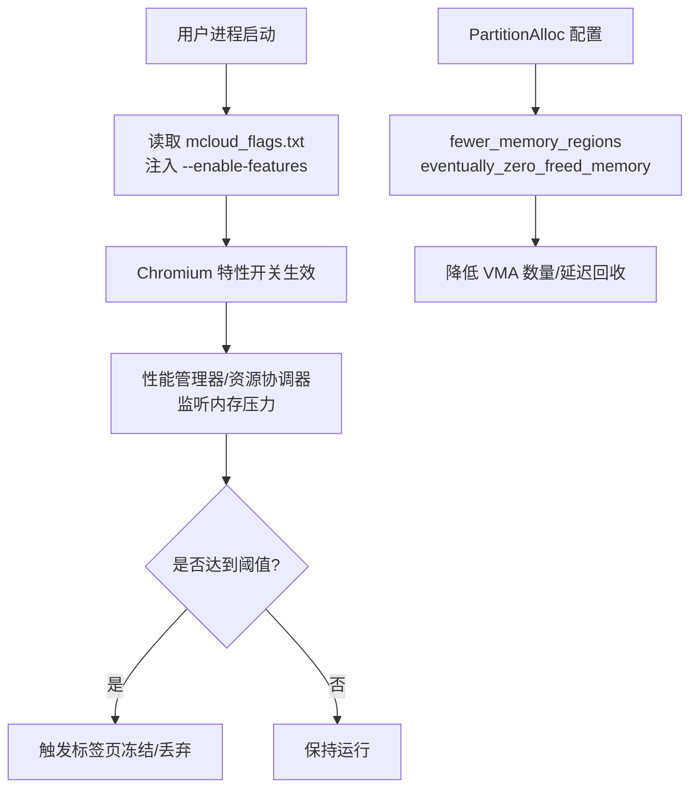
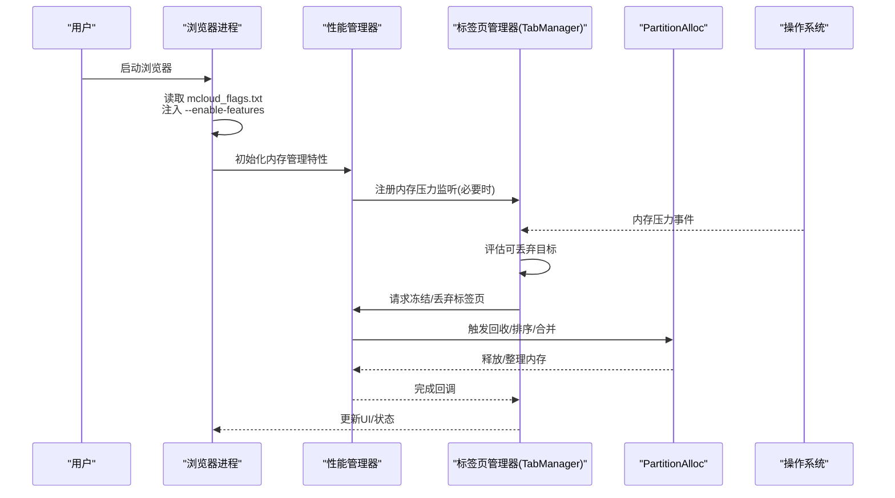
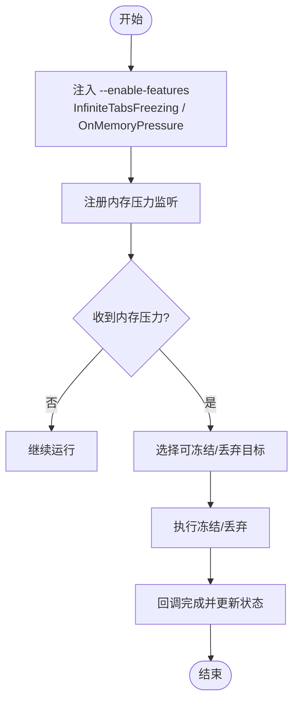
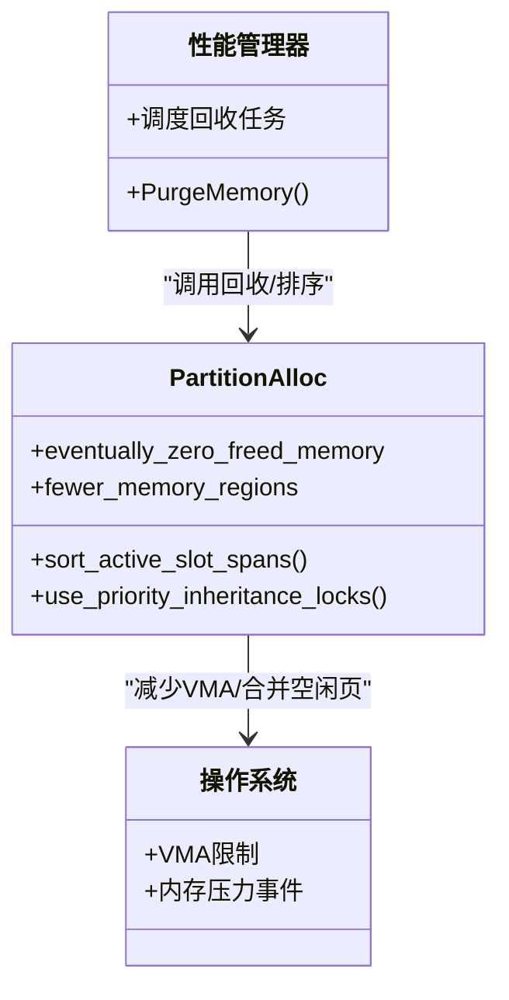
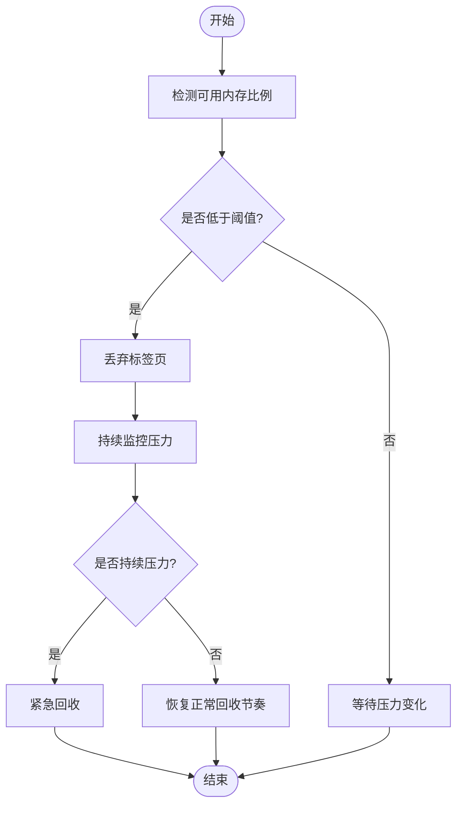
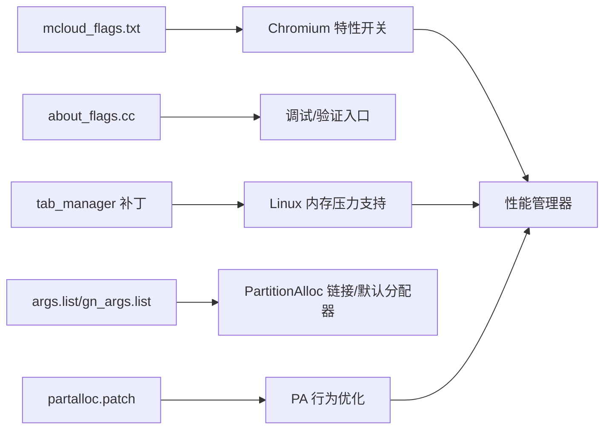

# 内存管理优化

<cite>
**本文引用的文件**
- [README.md](file://README.md)
- [mcloud_flags.txt](file://mcloud_flags.txt)
- [2026-06-19-performance-optimization-design.md](file://docs/superpowers/specs/2026-06-19-performance-optimization-design.md)
- [memory-Enable-the-tab-discards-feature.patch](file://infra/Flatpak/com.mcloud.browser/patches/chromium/memory-Enable-the-tab-discards-feature.patch)
- [partalloc.patch](file://other/partalloc.patch)
- [memory_details_linux.cc](file://src/chrome/browser/memory_details_linux.cc)
- [bench_memory.ps1](file://benchmark/bench_memory.ps1)
- [about_flags.cc](file://src/chrome/browser/about_flags.cc)
</cite>

## 目录
1. [简介](#简介)
2. [项目结构](#项目结构)
3. [核心组件](#核心组件)
4. [架构总览](#架构总览)
5. [详细组件分析](#详细组件分析)
6. [依赖关系分析](#依赖关系分析)
7. [性能考量](#性能考量)
8. [故障排查指南](#故障排查指南)
9. [结论](#结论)
10. [附录](#附录)

## 简介
本文件聚焦 MCloud Browser 的内存管理优化，围绕以下主题展开：
- 标签页冻结机制（InfiniteTabsFreezing、InfiniteTabsFreezingOnMemoryPressure）：在内存压力下自动冻结不活跃标签页以释放内存。
- PartitionAlloc 优化：零释放内存回收（PartitionAllocEventuallyZeroFreedMemory）、内存回收器（PartitionAllocMemoryReclaimer）、活动槽排序（PartitionAllocSortActiveSlotSpans）、优先级继承锁（PartitionAllocUsePriorityInheritanceLocks）。
- 提交限制丢弃（DiscardOnCommitLimit）与持续紧急丢弃（SustainedPMUrgentDiscarding）的工作原理。
- 内存使用监控方法与调优建议。

## 项目结构
MCloud Browser 将内存相关能力通过“运行时标志”和“补丁/构建参数”组合启用：
- 运行时标志：通过 mcloud_flags.txt 注入 --enable-features=...，无需重编译即可生效。
- 补丁与构建参数：通过 other/partalloc.patch 等补丁调整 PartitionAlloc 行为；通过 args.list/gn_args.list 控制是否启用 PartitionAlloc-Everywhere 等。
- 平台适配：Linux 下对 TabManager 的内存压力处理进行了扩展，使 Linux 也能响应系统级内存压力并触发标签页丢弃。

图表来源
- [mcloud_flags.txt:28-33](file://mcloud_flags.txt#L28-L33)
- [2026-06-19-performance-optimization-design.md:78-88](file://docs/superpowers/specs/2026-06-19-performance-optimization-design.md#L78-L88)
- [memory-Enable-the-tab-discards-feature.patch:24-33](file://infra/Flatpak/com.mcloud.browser/patches/chromium/memory-Enable-the-tab-discards-feature.patch#L24-L33)
- [partalloc.patch:11-23](file://other/partalloc.patch#L11-L23)

章节来源
- [mcloud_flags.txt:28-33](file://mcloud_flags.txt#L28-L33)
- [2026-06-19-performance-optimization-design.md:78-88](file://docs/superpowers/specs/2026-06-19-performance-optimization-design.md#L78-L88)
- [memory-Enable-the-tab-discards-feature.patch:24-33](file://infra/Flatpak/com.mcloud.browser/patches/chromium/memory-Enable-the-tab-discards-feature.patch#L24-L33)
- [partalloc.patch:11-23](file://other/partalloc.patch#L11-L23)

## 核心组件
- 标签页冻结与丢弃
  - InfiniteTabsFreezing：启用标签页冻结能力，配合策略将长时间不活跃的标签页冻结，释放其渲染状态与内存。
  - InfiniteTabsFreezingOnMemoryPressure：在检测到系统内存压力时，主动触发标签页冻结/丢弃，避免 OOM。
  - Linux 平台支持：通过补丁扩展 TabManager 的内存压力监听范围，使 Linux 也能在内存压力下执行丢弃流程。
- PartitionAlloc 优化
  - eventually_zero_freed_memory：零释放内存回收，延迟合并空闲页，减少碎片与系统调用。
  - fewer_memory_regions：减少内存区域数量（VMA），缓解 Linux 每进程 VMA 上限问题。
  - PartitionAllocSortActiveSlotSpans：在 PurgeMemory 时对活跃 slot span 排序，提升回收效率。
  - PartitionAllocUsePriorityInheritanceLocks：使用优先级继承锁，降低优先级反转导致的抖动。
- 提交限制与持续紧急丢弃
  - DiscardOnCommitLimit：当可用内存低于阈值（如 <10%）时，自动丢弃标签页，防止 OOM。
  - SustainedPMUrgentDiscarding：在持续内存压力下，进行更积极的紧急回收。

章节来源
- [README.md:123-131](file://README.md#L123-L131)
- [README.md:319](file://README.md#L319)
- [mcloud_flags.txt:28-33](file://mcloud_flags.txt#L28-L33)
- [2026-06-19-performance-optimization-design.md:78-88](file://docs/superpowers/specs/2026-06-19-performance-optimization-design.md#L78-L88)
- [memory-Enable-the-tab-discards-feature.patch:24-33](file://infra/Flatpak/com.mcloud.browser/patches/chromium/memory-Enable-the-tab-discards-feature.patch#L24-L33)
- [partalloc.patch:11-23](file://other/partalloc.patch#L11-L23)

## 架构总览
下图展示了从启动到内存压力响应的整体流程，包括特性注入、TabManager 监听、以及 PartitionAlloc 的行为影响。

图表来源
- [mcloud_flags.txt:28-33](file://mcloud_flags.txt#L28-L33)
- [memory-Enable-the-tab-discards-feature.patch:24-33](file://infra/Flatpak/com.mcloud.browser/patches/chromium/memory-Enable-the-tab-discards-feature.patch#L24-L33)
- [2026-06-19-performance-optimization-design.md:78-88](file://docs/superpowers/specs/2026-06-19-performance-optimization-design.md#L78-L88)
- [partalloc.patch:11-23](file://other/partalloc.patch#L11-L23)

## 详细组件分析

### 标签页冻结与内存压力响应
- 机制说明
  - InfiniteTabsFreezing：提供标签页冻结能力，结合策略将长时间不活跃的标签页冻结，释放渲染上下文与内存。
  - InfiniteTabsFreezingOnMemoryPressure：在系统内存压力升高时，立即触发标签页冻结/丢弃，优先保护前台体验。
  - Linux 平台增强：通过补丁扩展 TabManager 的内存压力监听范围，使 Linux 上也能响应系统级内存压力并执行丢弃流程。
- 关键流程
  - 启动阶段注入特性开关。
  - 注册内存压力监听（或在 MemoryCoordinator 启用时由协调器驱动）。
  - 收到压力事件后，选择合适目标进行冻结/丢弃。
  - 完成后回调更新状态。

图表来源
- [mcloud_flags.txt:28-33](file://mcloud_flags.txt#L28-L33)
- [memory-Enable-the-tab-discards-feature.patch:24-33](file://infra/Flatpak/com.mcloud.browser/patches/chromium/memory-Enable-the-tab-discards-feature.patch#L24-L33)
- [README.md:123-131](file://README.md#L123-L131)

章节来源
- [README.md:123-131](file://README.md#L123-L131)
- [README.md:319](file://README.md#L319)
- [memory-Enable-the-tab-discards-feature.patch:24-33](file://infra/Flatpak/com.mcloud.browser/patches/chromium/memory-Enable-the-tab-discards-feature.patch#L24-L33)

### PartitionAlloc 优化
- 零释放内存回收（eventually_zero_freed_memory）
  - 作用：延迟合并空闲页，减少碎片与系统调用开销。
  - 适用场景：高分配/释放频率的工作负载。
- 更少内存区域（fewer_memory_regions）
  - 作用：减少 VMA 数量，缓解 Linux 每进程 VMA 上限问题。
  - 平台差异：在 Linux/Android/ChromeOS 上默认启用。
- 活动槽排序（PartitionAllocSortActiveSlotSpans）
  - 作用：在 PurgeMemory 时对活跃 slot span 排序，提高回收命中率与速度。
- 优先级继承锁（PartitionAllocUsePriorityInheritanceLocks）
  - 作用：降低优先级反转导致的抖动，提升并发稳定性。

图表来源
- [partalloc.patch:11-23](file://other/partalloc.patch#L11-L23)
- [2026-06-19-performance-optimization-design.md:78-88](file://docs/superpowers/specs/2026-06-19-performance-optimization-design.md#L78-L88)

章节来源
- [partalloc.patch:11-23](file://other/partalloc.patch#L11-L23)
- [2026-06-19-performance-optimization-design.md:78-88](file://docs/superpowers/specs/2026-06-19-performance-optimization-design.md#L78-L88)

### 提交限制丢弃与持续紧急丢弃
- DiscardOnCommitLimit
  - 触发条件：可用内存低于阈值（例如 <10%）。
  - 行为：自动丢弃标签页，防止 OOM。
- SustainedPMUrgentDiscarding
  - 触发条件：持续内存压力。
  - 行为：更积极的紧急回收，快速释放内存。

图表来源
- [2026-06-19-performance-optimization-design.md:78-88](file://docs/superpowers/specs/2026-06-19-performance-optimization-design.md#L78-L88)
- [README.md:123-124](file://README.md#L123-L124)

章节来源
- [README.md:123-124](file://README.md#L123-L124)
- [2026-06-19-performance-optimization-design.md:78-88](file://docs/superpowers/specs/2026-06-19-performance-optimization-design.md#L78-L88)

### 关于 PartitionAllocMemoryReclaimer
- 在本仓库中未找到直接实现或引用 PartitionAllocMemoryReclaimer 的代码片段。该名称可能属于上游 Chromium 内部实现或未来版本特性。当前文档基于仓库内可见的配置与补丁进行分析。

章节来源
- [无直接代码引用]

## 依赖关系分析
- 运行时标志依赖
  - mcloud_flags.txt 中的 --enable-features 列表决定哪些内存优化特性在运行时生效。
  - about_flags.cc 暴露了 infinite-tabs-freezing 的入口，便于调试与验证。
- 平台补丁依赖
  - memory-Enable-the-tab-discards-feature.patch 扩展了 Linux 平台的内存压力处理路径。
- 构建参数依赖
  - args.list/gn_args.list 控制 PartitionAlloc 的链接与默认分配器选择（PA-E）。
  - partalloc.patch 调整 PartitionAlloc 的默认行为（如 fewer_memory_regions）。

图表来源
- [mcloud_flags.txt:28-33](file://mcloud_flags.txt#L28-L33)
- [about_flags.cc:11414-11416](file://src/chrome/browser/about_flags.cc#L11414-L11416)
- [memory-Enable-the-tab-discards-feature.patch:24-33](file://infra/Flatpak/com.mcloud.browser/patches/chromium/memory-Enable-the-tab-discards-feature.patch#L24-L33)
- [partalloc.patch:11-23](file://other/partalloc.patch#L11-L23)

章节来源
- [mcloud_flags.txt:28-33](file://mcloud_flags.txt#L28-L33)
- [about_flags.cc:11414-11416](file://src/chrome/browser/about_flags.cc#L11414-L11416)
- [memory-Enable-the-tab-discards-feature.patch:24-33](file://infra/Flatpak/com.mcloud.browser/patches/chromium/memory-Enable-the-tab-discards-feature.patch#L24-L33)
- [partalloc.patch:11-23](file://other/partalloc.patch#L11-L23)

## 性能考量
- 标签页冻结时机
  - 建议在多标签页且后台页面较多时启用 InfiniteTabsFreezingOnMemoryPressure，以减少前台卡顿。
- PartitionAlloc 调优
  - 在 Linux/Android/ChromeOS 上启用 fewer_memory_regions，有助于规避 VMA 上限问题。
  - 在高分配/释放场景下，eventually_zero_freed_memory 可降低碎片与系统调用。
- 提交限制与紧急回收
  - DiscardOnCommitLimit 适合低内存设备，提前丢弃可避免崩溃。
  - SustainedPMUrgentDiscarding 适合长期高负载场景，快速回压内存。
- 监控与基准
  - 使用 bench_memory.ps1 采集工作集合峰值，评估不同标志组合下的内存占用。
  - 使用 memory_details_linux.cc 收集进程级内存信息，辅助定位热点。

[本节为通用指导，不直接分析具体文件]

## 故障排查指南
- 现象：内存压力下未触发标签页丢弃
  - 检查 mcloud_flags.txt 是否正确注入 InfiniteTabsFreezingOnMemoryPressure。
  - 确认 Linux 平台补丁已应用，TabManager 能接收内存压力事件。
- 现象：频繁 GC/回收导致卡顿
  - 调整 PartitionAllocSortActiveSlotSpans 与 eventually_zero_freed_memory 的组合，观察回收曲线。
  - 考虑启用优先级继承锁以降低抖动。
- 现象：VMA 耗尽或系统不稳定
  - 确保 fewer_memory_regions 在 Linux/Android/ChromeOS 上启用。
- 监控方法
  - 使用 bench_memory.ps1 记录工作集合峰值，对比不同标志组合。
  - 使用 memory_details_linux.cc 获取进程级内存与 FD 信息，辅助定位异常。

章节来源
- [mcloud_flags.txt:28-33](file://mcloud_flags.txt#L28-L33)
- [memory-Enable-the-tab-discards-feature.patch:24-33](file://infra/Flatpak/com.mcloud.browser/patches/chromium/memory-Enable-the-tab-discards-feature.patch#L24-L33)
- [partalloc.patch:11-23](file://other/partalloc.patch#L11-L23)
- [bench_memory.ps1:62-77](file://benchmark/bench_memory.ps1#L62-L77)
- [memory_details_linux.cc:110-146](file://src/chrome/browser/memory_details_linux.cc#L110-L146)

## 结论
MCloud Browser 通过运行时标志与平台补丁的组合，实现了灵活的内存管理优化：
- 标签页冻结与丢弃在内存压力下及时生效，保障前台体验与系统稳定。
- PartitionAlloc 的多项优化降低了碎片、VMA 压力与并发抖动。
- 提交限制与持续紧急回收提供了兜底保护，避免 OOM 崩溃。
- 借助基准脚本与内存详情工具，可系统化地评估与调优各项指标。

[本节为总结性内容，不直接分析具体文件]

## 附录
- 常用标志清单（来自仓库）
  - InfiniteTabsFreezing、InfiniteTabsFreezingOnMemoryPressure
  - DiscardOnCommitLimit、SustainedPMUrgentDiscarding
  - PartitionAllocSortActiveSlotSpans、PartitionAllocUsePriorityInheritanceLocks
- 参考路径
  - 运行时标志：mcloud_flags.txt
  - 设计文档：docs/superpowers/specs/2026-06-19-performance-optimization-design.md
  - 平台补丁：infra/Flatpak/com.mcloud.browser/patches/chromium/memory-Enable-the-tab-discards-feature.patch
  - PartitionAlloc 补丁：other/partalloc.patch
  - 内存监控：benchmark/bench_memory.ps1、src/chrome/browser/memory_details_linux.cc

章节来源
- [mcloud_flags.txt:28-33](file://mcloud_flags.txt#L28-L33)
- [2026-06-19-performance-optimization-design.md:78-88](file://docs/superpowers/specs/2026-06-19-performance-optimization-design.md#L78-L88)
- [memory-Enable-the-tab-discards-feature.patch:24-33](file://infra/Flatpak/com.mcloud.browser/patches/chromium/memory-Enable-the-tab-discards-feature.patch#L24-L33)
- [partalloc.patch:11-23](file://other/partalloc.patch#L11-L23)
- [bench_memory.ps1:62-77](file://benchmark/bench_memory.ps1#L62-L77)
- [memory_details_linux.cc:110-146](file://src/chrome/browser/memory_details_linux.cc#L110-L146)