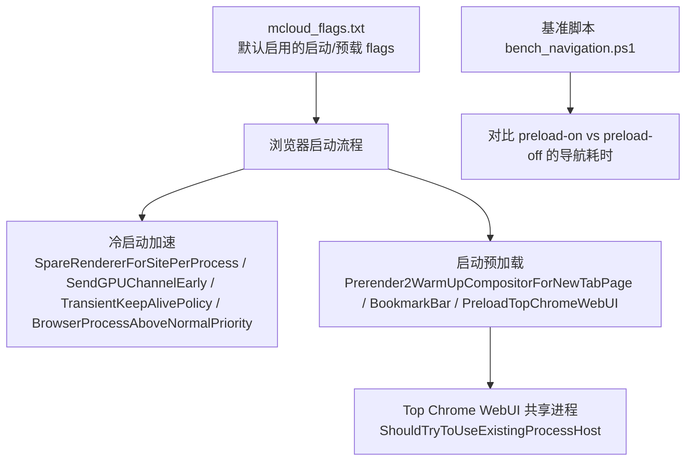
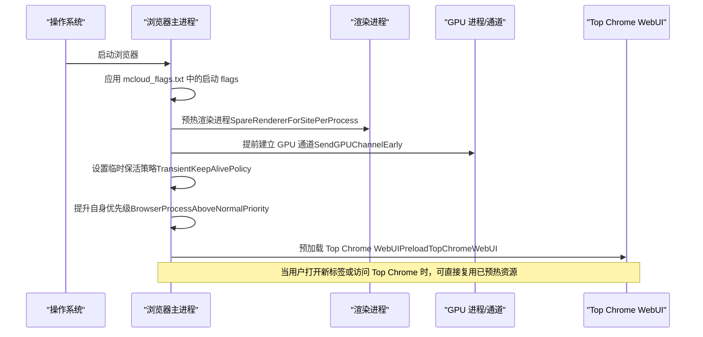
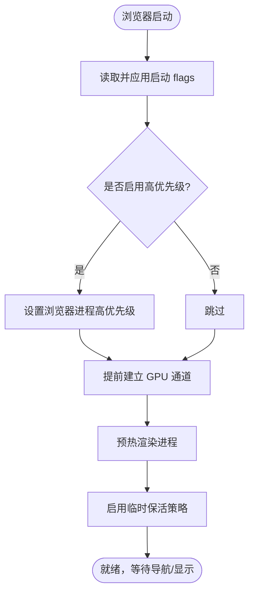
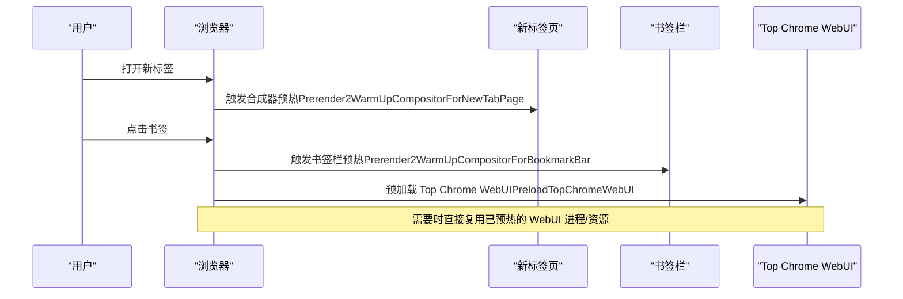
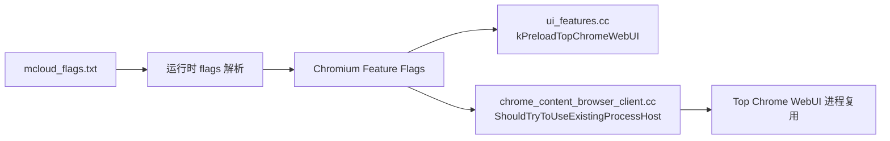

# 启动优化

本文引用的文件

- [mcloud_flags.txt](https://github.com/Mcloud136/Mcloud-Browser/blob/main/mcloud_flags.txt)
- [README.md](https://github.com/Mcloud136/Mcloud-Browser/blob/main/README.md)
- [bench_navigation.ps1](https://github.com/Mcloud136/Mcloud-Browser/blob/main/benchmark/bench_navigation.ps1)
- [M151-opt-benchmark.md](https://github.com/Mcloud136/Mcloud-Browser/blob/main/docs/dev-logs/M151-opt-benchmark.md)
- [2026-06-19-performance-optimization-design.md](https://github.com/Mcloud136/Mcloud-Browser/blob/main/docs/superpowers/specs/2026-06-19-performance-optimization-design.md)
- [2026-06-20-release-notes-m150.md](https://github.com/Mcloud136/Mcloud-Browser/blob/main/docs/superpowers/specs/2026-06-20-release-notes-m150.md)
- [ui_features.cc](https://github.com/Mcloud136/Mcloud-Browser/blob/main/src/chrome/browser/ui/ui_features.cc)
- [chrome_content_browser_client.cc](https://github.com/Mcloud136/Mcloud-Browser/blob/main/src/chrome/browser/chrome_content_browser_client.cc)

## 目录
1. [简介](#简介)
2. [项目结构](#项目结构)
3. [核心组件](#核心组件)
4. [架构总览](#架构总览)
5. [详细组件分析](#详细组件分析)
6. [依赖关系分析](#依赖关系分析)
7. [性能考量](#性能考量)
8. [故障排查指南](#故障排查指南)
9. [结论](#结论)
10. [附录](#附录)

## 简介
本文件聚焦 MCloud Browser 的启动与导航优化，系统梳理冷启动加速机制、启动预加载策略及其对首次启动时间与后续导航延迟的影响。内容覆盖：
- 冷启动加速：浏览器进程优先级提升、GPU 通道早期发送、渲染器预分配、临时保活策略。
- 启动预加载：新标签页合成器预热、书签栏预热、Top Chrome WebUI 预加载等。
- 基准数据与配置建议：基于仓库内脚本与文档的实测结果与取舍决策。

## 项目结构
围绕启动优化的关键资产集中在以下位置：
- 运行时标志与默认启用项：mcloud_flags.txt
- 基准与验证脚本：benchmark/bench_navigation.ps1
- 设计/发布说明与基准日志：docs/superpowers/specs/* 与 docs/dev-logs/*
- 源码中的预加载特性开关与行为：src/chrome/browser/ui/ui_features.cc、src/chrome/browser/chrome_content_browser_client.cc

图表来源
- [mcloud_flags.txt:8-14](https://github.com/Mcloud136/Mcloud-Browser/blob/main/mcloud_flags.txt#L8-L14)
- [mcloud_flags.txt:59-67](https://github.com/Mcloud136/Mcloud-Browser/blob/main/mcloud_flags.txt#L59-L67)
- [ui_features.cc:75-81](https://github.com/Mcloud136/Mcloud-Browser/blob/main/src/chrome/browser/ui/ui_features.cc#L75-L81)
- [chrome_content_browser_client.cc:2326-2336](https://github.com/Mcloud136/Mcloud-Browser/blob/main/src/chrome/browser/chrome_content_browser_client.cc#L2326-L2336)

章节来源
- [mcloud_flags.txt:8-14](https://github.com/Mcloud136/Mcloud-Browser/blob/main/mcloud_flags.txt#L8-L14)
- [mcloud_flags.txt:59-67](https://github.com/Mcloud136/Mcloud-Browser/blob/main/mcloud_flags.txt#L59-L67)
- [ui_features.cc:75-81](https://github.com/Mcloud136/Mcloud-Browser/blob/main/src/chrome/browser/ui/ui_features.cc#L75-L81)
- [chrome_content_browser_client.cc:2326-2336](https://github.com/Mcloud136/Mcloud-Browser/blob/main/src/chrome/browser/chrome_content_browser_client.cc#L2326-L2336)

## 核心组件
- 冷启动加速
  - SpareRendererForSitePerProcess：预热渲染进程，减少页面导航时的进程创建开销。
  - SendGPUChannelEarly：在渲染进程初始化时提前发送 GPU 通道，缩短首屏渲染时间。
  - TransientKeepAlivePolicy：空渲染进程保持一段时间可复用，降低频繁创建销毁成本。
  - BrowserProcessAboveNormalPriority：提升浏览器进程优先级，增强交互响应性。
- 启动预加载
  - Prerender2WarmUpCompositorForNewTabPage：为新标签页预热合成器，减少打开新标签页的首帧延迟。
  - Prerender2WarmUpCompositorForBookmarkBar：为书签栏相关页面预热合成器，提升常用入口体验。
  - PreloadTopChromeWebUI：在浏览器视图初始化时预加载 Top Chrome WebUI，以便需要时即时展示。
  - 其他辅助：LoadingPreconnectToRedirectTarget、BookmarkTriggerForPreconnect 等预连接类优化。

章节来源
- [mcloud_flags.txt:8-14](https://github.com/Mcloud136/Mcloud-Browser/blob/main/mcloud_flags.txt#L8-L14)
- [mcloud_flags.txt:59-67](https://github.com/Mcloud136/Mcloud-Browser/blob/main/mcloud_flags.txt#L59-L67)
- [2026-06-20-release-notes-m150.md:120-130](https://github.com/Mcloud136/Mcloud-Browser/blob/main/docs/superpowers/specs/2026-06-20-release-notes-m150.md#L120-L130)
- [2026-06-19-performance-optimization-design.md:69-77](https://github.com/Mcloud136/Mcloud-Browser/blob/main/docs/superpowers/specs/2026-06-19-performance-optimization-design.md#L69-L77)

## 架构总览
下图展示了从浏览器启动到预加载生效的关键路径，以及各优化点如何协同工作以缩短首屏和导航延迟。

图表来源
- [mcloud_flags.txt:8-14](https://github.com/Mcloud136/Mcloud-Browser/blob/main/mcloud_flags.txt#L8-L14)
- [mcloud_flags.txt:59-67](https://github.com/Mcloud136/Mcloud-Browser/blob/main/mcloud_flags.txt#L59-L67)
- [ui_features.cc:75-81](https://github.com/Mcloud136/Mcloud-Browser/blob/main/src/chrome/browser/ui/ui_features.cc#L75-L81)
- [chrome_content_browser_client.cc:2326-2336](https://github.com/Mcloud136/Mcloud-Browser/blob/main/src/chrome/browser/chrome_content_browser_client.cc#L2326-L2336)

## 详细组件分析

### 冷启动加速机制
- 浏览器进程优先级提升（BrowserProcessAboveNormalPriority）
  - 作用：提高主进程调度优先级，改善界面响应与任务抢占能力。
  - 适用场景：多任务环境下保证浏览器交互流畅。
- GPU 通道早期发送（SendGPUChannelEarly）
  - 作用：在渲染进程初始化阶段尽早建立 GPU 通信，减少首帧绘制等待。
  - 收益：首屏渲染通常可缩短 10–30ms（见发布说明）。
- 渲染器预分配（SpareRendererForSitePerProcess）
  - 作用：预先准备渲染进程，避免首次导航时的进程创建与初始化开销。
  - 收益：页面导航更快，尤其在频繁切换站点时。
- 临时保活策略（TransientKeepAlivePolicy）
  - 作用：将空闲渲染进程保留一段时间以便复用，减少频繁创建销毁带来的抖动。
  - 收益：降低短时多次导航的额外开销。

图表来源
- [mcloud_flags.txt:8-14](https://github.com/Mcloud136/Mcloud-Browser/blob/main/mcloud_flags.txt#L8-L14)
- [2026-06-20-release-notes-m150.md:120-130](https://github.com/Mcloud136/Mcloud-Browser/blob/main/docs/superpowers/specs/2026-06-20-release-notes-m150.md#L120-L130)

章节来源
- [mcloud_flags.txt:8-14](https://github.com/Mcloud136/Mcloud-Browser/blob/main/mcloud_flags.txt#L8-L14)
- [2026-06-20-release-notes-m150.md:120-130](https://github.com/Mcloud136/Mcloud-Browser/blob/main/docs/superpowers/specs/2026-06-20-release-notes-m150.md#L120-L130)
- [2026-06-19-performance-optimization-design.md:69-77](https://github.com/Mcloud136/Mcloud-Browser/blob/main/docs/superpowers/specs/2026-06-19-performance-optimization-design.md#L69-L77)

### 启动预加载功能
- 新标签页合成器预热（Prerender2WarmUpCompositorForNewTabPage）
  - 作用：在新标签页打开前预热合成器，减少首帧绘制时间。
- 书签栏预热（Prerender2WarmUpCompositorForBookmarkBar）
  - 作用：对书签栏常见目标进行预热，提升常用入口的打开速度。
- Top Chrome WebUI 预加载（PreloadTopChromeWebUI）
  - 作用：在浏览器视图初始化时预加载 Top Chrome WebUI，使其可在需要时立即显示。
  - 实现要点：通过 ShouldTryToUseExistingProcessHost 使 Top Chrome WebUI 尝试复用已有进程，减少重复创建。

图表来源
- [mcloud_flags.txt:59-67](https://github.com/Mcloud136/Mcloud-Browser/blob/main/mcloud_flags.txt#L59-L67)
- [ui_features.cc:75-81](https://github.com/Mcloud136/Mcloud-Browser/blob/main/src/chrome/browser/ui/ui_features.cc#L75-L81)
- [chrome_content_browser_client.cc:2326-2336](https://github.com/Mcloud136/Mcloud-Browser/blob/main/src/chrome/browser/chrome_content_browser_client.cc#L2326-L2336)

章节来源
- [mcloud_flags.txt:59-67](https://github.com/Mcloud136/Mcloud-Browser/blob/main/mcloud_flags.txt#L59-L67)
- [ui_features.cc:75-81](https://github.com/Mcloud136/Mcloud-Browser/blob/main/src/chrome/browser/ui/ui_features.cc#L75-L81)
- [chrome_content_browser_client.cc:2326-2336](https://github.com/Mcloud136/Mcloud-Browser/blob/main/src/chrome/browser/chrome_content_browser_client.cc#L2326-L2336)

### 预加载收益与取舍（数据驱动）
- 导航响应测试（bench_navigation.ps1）
  - 方法：同一构建下对比“预载开启”与“禁用预载”两类模式的页面加载耗时，取中位数。
  - 结果：B 站页面在预载命中场景下表现更优（约 -5.6%），其余站点差异不明显。
- 内存代价评估
  - 真实站点 50 标签场景下，移除多项高内存低收益的预载项后，内存下降约 125MB；最终配置较全量配置再降约 203MB。
- 结论
  - 预载类 feature 的收益高度依赖预测命中率与站点特征，需结合内存占用综合权衡。
  - 当前保留的预载项（如 Prerender2WarmUpCompositor*、PreloadTopChromeWebUI、BookmarkTriggerForPreconnect、LoadingPreconnectToRedirectTarget）具备较低内存代价且能带来一定导航收益。

章节来源
- [bench_navigation.ps1:23-39](https://github.com/Mcloud136/Mcloud-Browser/blob/main/benchmark/bench_navigation.ps1#L23-L39)
- [bench_navigation.ps1:54-96](https://github.com/Mcloud136/Mcloud-Browser/blob/main/benchmark/bench_navigation.ps1#L54-L96)
- [M151-opt-benchmark.md:34-60](https://github.com/Mcloud136/Mcloud-Browser/blob/main/docs/dev-logs/M151-opt-benchmark.md#L34-L60)

## 依赖关系分析
- 标志注入与生效
  - mcloud_flags.txt 提供默认启用的启动与预载 flags，随安装包分发并在启动时自动注入。
  - 用户命令行参数优先级更高，同名开关会合并或覆盖内置条目。
- 源码特性开关
  - ui_features.cc 定义 Top Chrome WebUI 预加载特性开关。
  - chrome_content_browser_client.cc 中针对 Top Chrome WebUI 的进程复用逻辑，确保预加载后的快速展示。

图表来源
- [mcloud_flags.txt:8-14](https://github.com/Mcloud136/Mcloud-Browser/blob/main/mcloud_flags.txt#L8-L14)
- [mcloud_flags.txt:59-67](https://github.com/Mcloud136/Mcloud-Browser/blob/main/mcloud_flags.txt#L59-L67)
- [ui_features.cc:75-81](https://github.com/Mcloud136/Mcloud-Browser/blob/main/src/chrome/browser/ui/ui_features.cc#L75-L81)
- [chrome_content_browser_client.cc:2326-2336](https://github.com/Mcloud136/Mcloud-Browser/blob/main/src/chrome/browser/chrome_content_browser_client.cc#L2326-L2336)

章节来源
- [mcloud_flags.txt:8-14](https://github.com/Mcloud136/Mcloud-Browser/blob/main/mcloud_flags.txt#L8-L14)
- [mcloud_flags.txt:59-67](https://github.com/Mcloud136/Mcloud-Browser/blob/main/mcloud_flags.txt#L59-L67)
- [ui_features.cc:75-81](https://github.com/Mcloud136/Mcloud-Browser/blob/main/src/chrome/browser/ui/ui_features.cc#L75-L81)
- [chrome_content_browser_client.cc:2326-2336](https://github.com/Mcloud136/Mcloud-Browser/blob/main/src/chrome/browser/chrome_content_browser_client.cc#L2326-L2336)

## 性能考量
- 冷启动时间
  - 基线对比：K1 冷启动时间在优化构建中与基线持平或在噪声范围内波动（例如 73ms vs 79ms）。
  - 影响因子：预载/预热类 feature 在启动时多做预热工作，可能小幅增加启动耗时，但换来后续导航与首帧更快。
- 内存占用
  - 全量预载在真实站点场景下会增加内存占用；通过移除高内存低收益项，可实现显著内存下降（约 203MB）。
- 导航延迟
  - 在特定站点（如 B 站）预载命中时，导航耗时可降低约 5.6%；在其他站点收益有限或不稳定。
- 配置建议
  - 若对内存敏感：优先保留低内存代价的预载项，谨慎启用高内存项。
  - 若追求极致首屏：可考虑保留 SendGPUChannelEarly、SpareRendererForSitePerProcess、TransientKeepAlivePolicy 等冷启动优化。
  - 若关注 Top Chrome 体验：保留 PreloadTopChromeWebUI，并确保进程复用逻辑生效。

章节来源
- [M151-opt-benchmark.md:19-26](https://github.com/Mcloud136/Mcloud-Browser/blob/main/docs/dev-logs/M151-opt-benchmark.md#L19-L26)
- [M151-opt-benchmark.md:34-60](https://github.com/Mcloud136/Mcloud-Browser/blob/main/docs/dev-logs/M151-opt-benchmark.md#L34-L60)
- [README.md:336-351](https://github.com/Mcloud136/Mcloud-Browser/blob/main/README.md#L336-L351)

## 故障排查指南
- 预载未生效
  - 检查 mcloud_flags.txt 是否正确包含对应 --enable-features 条目。
  - 确认用户命令行未使用 --disable-features 覆盖内置启用项。
- 预载收益不明显
  - 使用 bench_navigation.ps1 在同一环境复测，观察不同站点的命中情况。
  - 根据站点特征调整预载策略，必要时移除低收益高内存项。
- Top Chrome WebUI 无法复用进程
  - 核查 ShouldTryToUseExistingProcessHost 是否返回 true（Top Chrome WebUI URL）。
  - 确认 PreloadTopChromeWebUI 特性已启用。

章节来源
- [mcloud_flags.txt:8-14](https://github.com/Mcloud136/Mcloud-Browser/blob/main/mcloud_flags.txt#L8-L14)
- [mcloud_flags.txt:59-67](https://github.com/Mcloud136/Mcloud-Browser/blob/main/mcloud_flags.txt#L59-L67)
- [bench_navigation.ps1:23-39](https://github.com/Mcloud136/Mcloud-Browser/blob/main/benchmark/bench_navigation.ps1#L23-L39)
- [chrome_content_browser_client.cc:2326-2336](https://github.com/Mcloud136/Mcloud-Browser/blob/main/src/chrome/browser/chrome_content_browser_client.cc#L2326-L2336)

## 结论
MCloud Browser 通过冷启动加速与启动预加载的组合策略，有效降低了首屏渲染与导航延迟。数据表明：
- 冷启动优化（SpareRendererForSitePerProcess、SendGPUChannelEarly、TransientKeepAlivePolicy、BrowserProcessAboveNormalPriority）在多数场景下稳定提升响应性与首帧速度。
- 启动预加载（Prerender2WarmUpCompositor*、PreloadTopChromeWebUI）在特定站点与高频入口上带来可观收益，但需权衡内存占用。
- 推荐按实际负载与设备条件选择预载项组合，并通过基准脚本持续验证效果。

## 附录
- 推荐配置清单（来自 README 与 mcloud_flags.txt）
  - 启动与预载：SpareRendererForSitePerProcess、SendGPUChannelEarly、TransientKeepAlivePolicy、BrowserProcessAboveNormalPriority、Prerender2WarmUpCompositorForNewTabPage、Prerender2WarmUpCompositorForBookmarkBar、PreloadTopChromeWebUI。
  - 辅助预连接：LoadingPreconnectToRedirectTarget、BookmarkTriggerForPreconnect。
- 基准参考
  - K1 冷启动：同机同方法下与基线持平或微小波动。
  - 导航收益：B 站页面在预载命中时约 -5.6%。
  - 内存取舍：移除高内存低收益项后可显著降低内存占用。

章节来源
- [README.md:302-351](https://github.com/Mcloud136/Mcloud-Browser/blob/main/README.md#L302-L351)
- [mcloud_flags.txt:8-14](https://github.com/Mcloud136/Mcloud-Browser/blob/main/mcloud_flags.txt#L8-L14)
- [mcloud_flags.txt:59-67](https://github.com/Mcloud136/Mcloud-Browser/blob/main/mcloud_flags.txt#L59-L67)
- [M151-opt-benchmark.md:19-26](https://github.com/Mcloud136/Mcloud-Browser/blob/main/docs/dev-logs/M151-opt-benchmark.md#L19-L26)
- [M151-opt-benchmark.md:34-60](https://github.com/Mcloud136/Mcloud-Browser/blob/main/docs/dev-logs/M151-opt-benchmark.md#L34-L60)