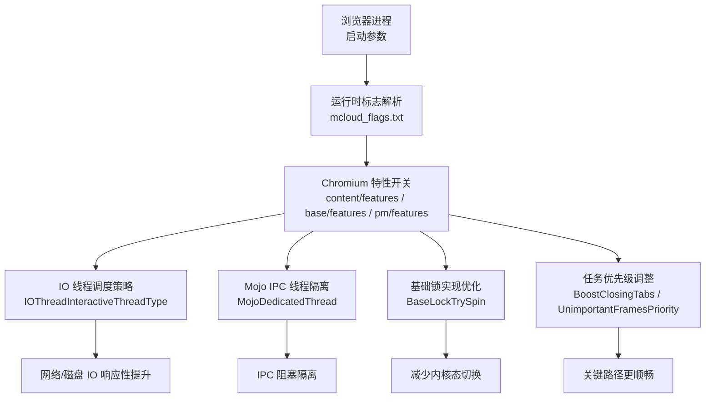
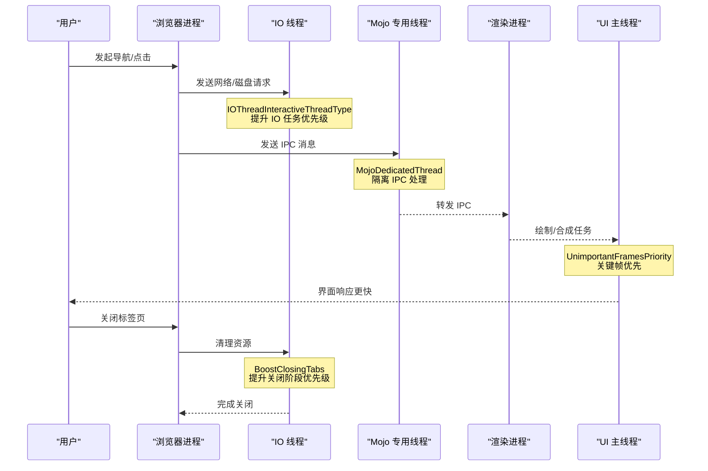
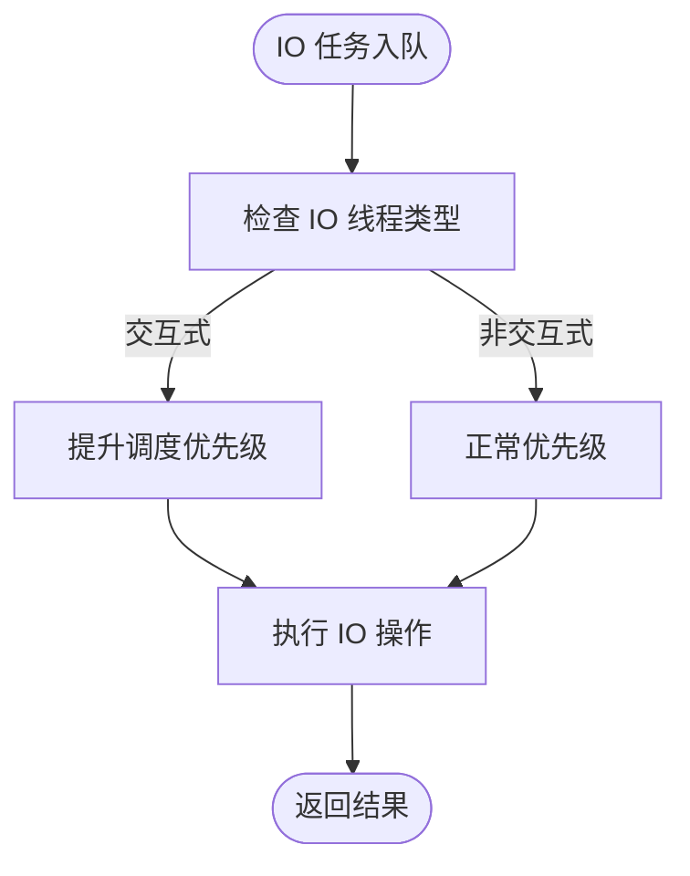
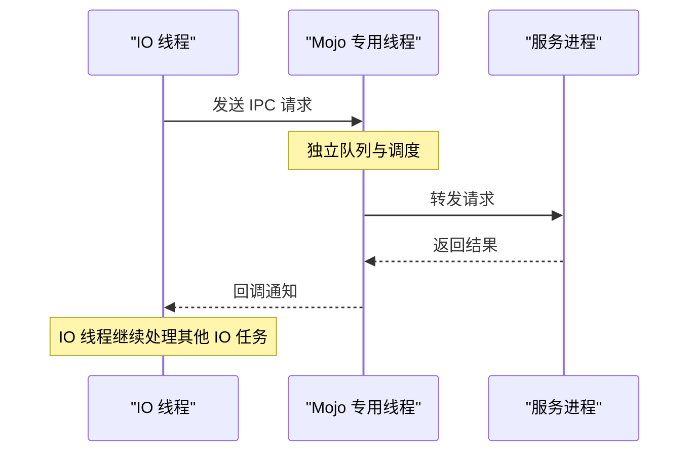
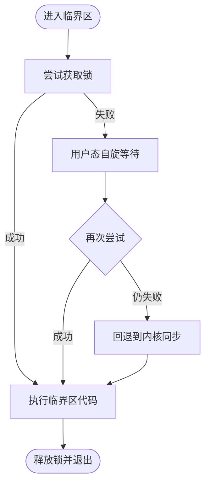
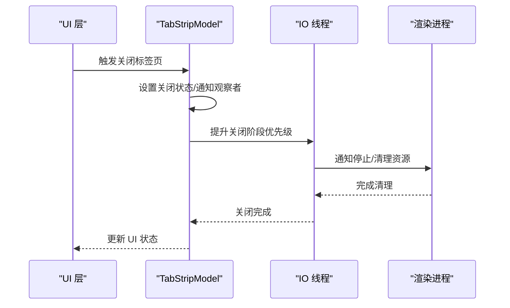
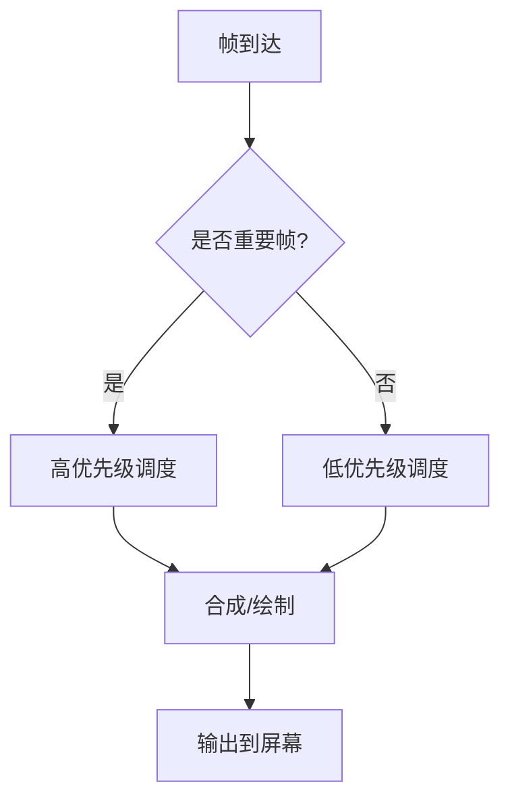
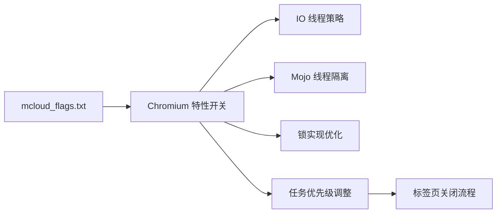

# 多线程优化

<cite>
**本文引用的文件**
- [mcloud_flags.txt](file://mcloud_flags.txt)
- [README.md](file://README.md)
- [2026-06-19-performance-optimization-design.md](file://docs/superpowers/specs/2026-06-19-performance-optimization-design.md)
- [2026-06-20-release-notes-m150.md](file://docs/superpowers/specs/2026-06-20-release-notes-m150.md)
- [2026-06-19-performance-optimization.md](file://docs/superpowers/plans/2026-06-19-performance-optimization.md)
- [tab_strip_model.cc](file://src/chrome/browser/ui/tabs/tab_strip_model.cc)
- [tab_strip.cc](file://src/chrome/browser/ui/views/tabs/tab_strip.cc)
- [DEBUGGING.md](file://infra/DEBUG/DEBUGGING.md)
- [CMDLINE_FLAGS_LIST.md](file://docs/CMDLINE_FLAGS_LIST.md)
</cite>

## 目录
1. [简介](#简介)
2. [项目结构](#项目结构)
3. [核心组件](#核心组件)
4. [架构总览](#架构总览)
5. [详细组件分析](#详细组件分析)
6. [依赖关系分析](#依赖关系分析)
7. [性能考量](#性能考量)
8. [故障排查指南](#故障排查指南)
9. [结论](#结论)
10. [附录](#附录)

## 简介
本文件聚焦 MCloud Browser 的多线程优化，围绕以下关键点展开：
- IO 线程交互类型（IOThreadInteractiveThreadType）与 Mojo 专用线程（MojoDedicatedThread）的作用机制
- 自旋锁优化（BaseLockTrySpin）的开销降低原理
- 关闭标签页优先级提升（BoostClosingTabs）对用户体验的影响
- 不重要帧优先级（UnimportantFramesPriority）如何改善主线程响应性
- 这些优化如何协同提升整体系统性能与交互流畅度
- 配套的线程性能分析与调试方法

## 项目结构
MCloud Browser 通过运行时标志在启动时启用一系列 Chromium 特性开关，从而在不修改源码的前提下获得多线程、网络、渲染与媒体等多方面的性能收益。其中与多线程相关的标志集中在 mcloud_flags.txt 中，并在设计文档与发布说明中被归类为“多线程优化”项。

图表来源
- [mcloud_flags.txt:107-112](file://mcloud_flags.txt#L107-L112)
- [2026-06-19-performance-optimization-design.md:90-98](file://docs/superpowers/specs/2026-06-19-performance-optimization-design.md#L90-L98)

章节来源
- [mcloud_flags.txt:107-112](file://mcloud_flags.txt#L107-L112)
- [2026-06-19-performance-optimization-design.md:90-98](file://docs/superpowers/specs/2026-06-19-performance-optimization-design.md#L90-L98)
- [README.md:135-143](file://README.md#L135-L143)

## 核心组件
- IO 线程交互类型（IOThreadInteractiveThreadType）
  - 将 IO 线程标记为交互式类型，使网络与磁盘 IO 相关任务获得更高调度优先级，从而提升用户可见的响应速度。
- Mojo 专用线程（MojoDedicatedThread）
  - 将 Mojo IPC 通信迁移到专用后台线程，避免 IO 线程被 IPC 处理阻塞，提高 IO 线程吞吐与稳定性。
- 自旋锁优化（BaseLockTrySpin）
  - 在短临界区使用用户态自旋等待，减少频繁进入/退出内核态带来的上下文切换成本。
- 关闭标签页优先级提升（BoostClosingTabs）
  - 在关闭标签页期间临时提升相关任务优先级，缩短关闭耗时，改善用户感知。
- 不重要帧优先级（UnimportantFramesPriority）
  - 降低非重要帧的调度优先级，把更多 CPU 资源让给关键帧与交互任务，提升主线程响应性。

章节来源
- [2026-06-19-performance-optimization-design.md:90-98](file://docs/superpowers/specs/2026-06-19-performance-optimization-design.md#L90-L98)
- [2026-06-20-release-notes-m150.md:147-154](file://docs/superpowers/specs/2026-06-20-release-notes-m150.md#L147-L154)
- [README.md:135-143](file://README.md#L135-L143)

## 架构总览
下图展示了多线程优化在浏览器运行时的作用位置与数据流：启动参数加载后，Chromium 根据特性开关调整 IO 线程、Mojo IPC、锁实现以及任务优先级策略，最终影响网络、渲染与 UI 的响应表现。

图表来源
- [mcloud_flags.txt:107-112](file://mcloud_flags.txt#L107-L112)
- [2026-06-19-performance-optimization-design.md:90-98](file://docs/superpowers/specs/2026-06-19-performance-optimization-design.md#L90-L98)

## 详细组件分析

### IO 线程交互类型（IOThreadInteractiveThreadType）
- 目标：提升网络与磁盘 IO 的响应性，减少用户操作后的等待时间。
- 机制：将 IO 线程设置为交互式类型，使 IO 相关任务在调度中获得更高优先级，尤其在页面加载、资源拉取等场景下效果明显。
- 适用场景：多标签页并发访问、大量图片/脚本加载、频繁的网络请求。

图表来源
- [mcloud_flags.txt:108-108](file://mcloud_flags.txt#L108-L108)
- [2026-06-19-performance-optimization-design.md:94-94](file://docs/superpowers/specs/2026-06-19-performance-optimization-design.md#L94-L94)

章节来源
- [mcloud_flags.txt:108-108](file://mcloud_flags.txt#L108-L108)
- [2026-06-19-performance-optimization-design.md:94-94](file://docs/superpowers/specs/2026-06-19-performance-optimization-design.md#L94-L94)
- [2026-06-20-release-notes-m150.md:150-150](file://docs/superpowers/specs/2026-06-20-release-notes-m150.md#L150-L150)

### Mojo 专用线程（MojoDedicatedThread）
- 目标：隔离 IPC 处理，避免 IO 线程被 IPC 调用阻塞。
- 机制：将 Mojo IPC 的收发与处理迁移到专用后台线程，IO 线程专注于网络与磁盘 IO，降低延迟抖动。
- 适用场景：跨进程通信频繁、IPC 消息体较大或处理耗时较长的场景。

图表来源
- [mcloud_flags.txt:109-109](file://mcloud_flags.txt#L109-L109)
- [2026-06-19-performance-optimization-design.md:95-95](file://docs/superpowers/specs/2026-06-19-performance-optimization-design.md#L95-L95)

章节来源
- [mcloud_flags.txt:109-109](file://mcloud_flags.txt#L109-L109)
- [2026-06-19-performance-optimization-design.md:95-95](file://docs/superpowers/specs/2026-06-19-performance-optimization-design.md#L95-L95)
- [2026-06-20-release-notes-m150.md:151-151](file://docs/superpowers/specs/2026-06-20-release-notes-m150.md#L151-L151)

### 自旋锁优化（BaseLockTrySpin）
- 目标：减少短临界区的内核态切换开销。
- 机制：在获取锁失败时进行短暂的用户态自旋等待，若短时间内可获取则直接成功；否则回退到内核同步原语。
- 适用场景：高频短临界区、竞争不激烈且持有时间短的代码路径。

图表来源
- [mcloud_flags.txt:110-110](file://mcloud_flags.txt#L110-L110)
- [2026-06-19-performance-optimization-design.md:96-96](file://docs/superpowers/specs/2026-06-19-performance-optimization-design.md#L96-L96)

章节来源
- [mcloud_flags.txt:110-110](file://mcloud_flags.txt#L110-L110)
- [2026-06-19-performance-optimization-design.md:96-96](file://docs/superpowers/specs/2026-06-19-performance-optimization-design.md#L96-L96)
- [2026-06-20-release-notes-m150.md:152-152](file://docs/superpowers/specs/2026-06-20-release-notes-m150.md#L152-L152)

### 关闭标签页优先级提升（BoostClosingTabs）
- 目标：缩短标签页关闭耗时，提升用户感知。
- 机制：在关闭标签页过程中临时提升相关任务的优先级，加速资源释放与状态清理。
- 关联流程：TabStripModel 负责标签页生命周期管理，关闭流程会触发一系列状态变更与观察者通知。

图表来源
- [mcloud_flags.txt:111-111](file://mcloud_flags.txt#L111-L111)
- [2026-06-19-performance-optimization-design.md:97-97](file://docs/superpowers/specs/2026-06-19-performance-optimization-design.md#L97-L97)
- [tab_strip_model.cc:1239-1254](file://src/chrome/browser/ui/tabs/tab_strip_model.cc#L1239-L1254)
- [tab_strip_model.cc:3645-3668](file://src/chrome/browser/ui/tabs/tab_strip_model.cc#L3645-L3668)

章节来源
- [mcloud_flags.txt:111-111](file://mcloud_flags.txt#L111-L111)
- [2026-06-19-performance-optimization-design.md:97-97](file://docs/superpowers/specs/2026-06-19-performance-optimization-design.md#L97-L97)
- [2026-06-20-release-notes-m150.md:153-153](file://docs/superpowers/specs/2026-06-20-release-notes-m150.md#L153-L153)
- [tab_strip_model.cc:1239-1254](file://src/chrome/browser/ui/tabs/tab_strip_model.cc#L1239-L1254)
- [tab_strip_model.cc:3645-3668](file://src/chrome/browser/ui/tabs/tab_strip_model.cc#L3645-L3668)

### 不重要帧优先级（UnimportantFramesPriority）
- 目标：将关键帧与交互任务置于更高优先级，提升主线程响应性。
- 机制：降低非重要帧的调度优先级，使关键渲染路径获得更多 CPU 时间片。
- 效果：滚动、输入响应、动画等交互更顺滑，尤其在多标签页或复杂页面场景。

图表来源
- [mcloud_flags.txt:112-112](file://mcloud_flags.txt#L112-L112)
- [2026-06-19-performance-optimization-design.md:98-98](file://docs/superpowers/specs/2026-06-19-performance-optimization-design.md#L98-L98)

章节来源
- [mcloud_flags.txt:112-112](file://mcloud_flags.txt#L112-L112)
- [2026-06-19-performance-optimization-design.md:98-98](file://docs/superpowers/specs/2026-06-19-performance-optimization-design.md#L98-L98)
- [2026-06-20-release-notes-m150.md:154-154](file://docs/superpowers/specs/2026-06-20-release-notes-m150.md#L154-L154)

## 依赖关系分析
- 配置入口：mcloud_flags.txt 集中声明多线程相关特性开关。
- 特性定义：Chromium 内部 features（content/base/pm）提供具体实现与默认行为。
- 运行时生效：浏览器启动时解析标志并应用，影响 IO 线程、Mojo IPC、锁实现与任务优先级。
- 用户界面联动：标签页关闭流程与 UI 层交互受 BoostClosingTabs 影响，提升关闭体验。

图表来源
- [mcloud_flags.txt:107-112](file://mcloud_flags.txt#L107-L112)
- [2026-06-19-performance-optimization-design.md:90-98](file://docs/superpowers/specs/2026-06-19-performance-optimization-design.md#L90-L98)

章节来源
- [mcloud_flags.txt:107-112](file://mcloud_flags.txt#L107-L112)
- [2026-06-19-performance-optimization-design.md:90-98](file://docs/superpowers/specs/2026-06-19-performance-optimization-design.md#L90-L98)

## 性能考量
- IO 响应性：IOThreadInteractiveThreadType 提升 IO 任务优先级，适合高并发网络/磁盘场景。
- IPC 隔离：MojoDedicatedThread 避免 IO 线程被 IPC 阻塞，降低延迟抖动。
- 锁开销：BaseLockTrySpin 在短临界区减少内核态切换，提高高频路径效率。
- 关闭体验：BoostClosingTabs 缩短关闭耗时，提升用户感知。
- 主线程响应：UnimportantFramesPriority 保障关键帧与交互任务优先执行。
- 组合效应：上述优化协同工作，在多标签页、复杂页面与视频播放场景中尤为显著。

[本节为通用性能讨论，不直接分析具体文件]

## 故障排查指南
- 启用与验证
  - 确认 mcloud_flags.txt 中的多线程标志已启用。
  - 通过命令行参数或启动配置文件加载标志。
- 追踪与采样
  - 使用 Chrome 内置 tracing 工具（如 --enable-tracing、--trace-startup-*）记录事件，定位 IO 与 IPC 瓶颈。
  - 使用 rr 录制与回放多进程问题，结合 vmodule 日志定位渲染进程问题。
- 常见问题
  - 若 IPC 阻塞导致 IO 卡顿，检查 MojoDedicatedThread 是否生效。
  - 若关闭标签页缓慢，检查 BoostClosingTabs 是否启用及标签页资源占用情况。
  - 若主线程掉帧，检查 UnimportantFramesPriority 与页面复杂度。

章节来源
- [CMDLINE_FLAGS_LIST.md:1046-1070](file://docs/CMDLINE_FLAGS_LIST.md#L1046-L1070)
- [CMDLINE_FLAGS_LIST.md:2164-2168](file://docs/CMDLINE_FLAGS_LIST.md#L2164-L2168)
- [CMDLINE_FLAGS_LIST.md:2546-2556](file://docs/CMDLINE_FLAGS_LIST.md#L2546-L2556)
- [DEBUGGING.md:281-312](file://infra/DEBUG/DEBUGGING.md#L281-L312)

## 结论
通过 IO 线程交互类型、Mojo 专用线程、自旋锁优化、关闭标签页优先级提升与不重要帧优先级等五项多线程优化，MCloud Browser 在网络 IO、IPC 隔离、锁开销、关闭体验与主线程响应性方面均获得显著提升。配合合理的性能分析与调试方法，可在实际使用中持续优化与验证效果。

[本节为总结性内容，不直接分析具体文件]

## 附录
- 标志清单（多线程）
  - IOThreadInteractiveThreadType
  - MojoDedicatedThread
  - BaseLockTrySpin
  - BoostClosingTabs
  - UnimportantFramesPriority
- 参考文件
  - mcloud_flags.txt：运行时标志集中管理
  - 设计文档与发布说明：特性来源与预期收益
  - 标签页模型与 UI：关闭流程与交互联动

章节来源
- [mcloud_flags.txt:107-112](file://mcloud_flags.txt#L107-L112)
- [2026-06-19-performance-optimization-design.md:90-98](file://docs/superpowers/specs/2026-06-19-performance-optimization-design.md#L90-L98)
- [2026-06-20-release-notes-m150.md:147-154](file://docs/superpowers/specs/2026-06-20-release-notes-m150.md#L147-L154)
- [README.md:135-143](file://README.md#L135-L143)