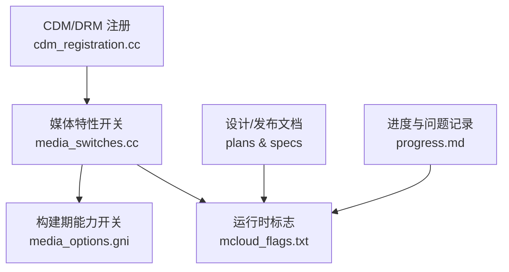
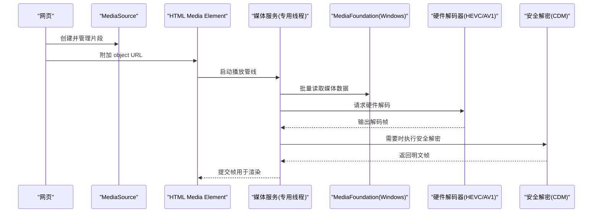
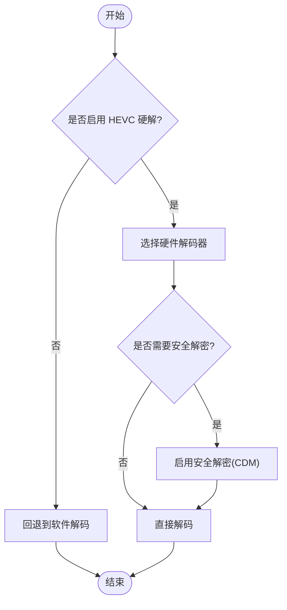
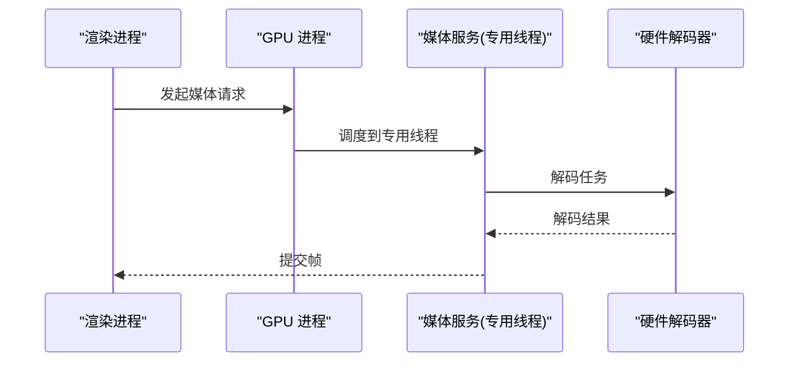
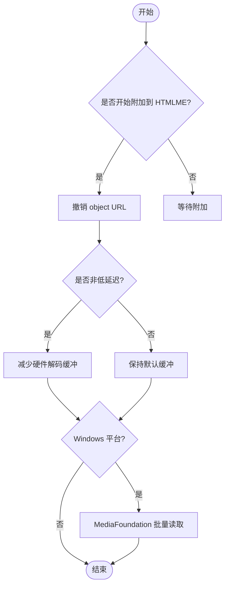
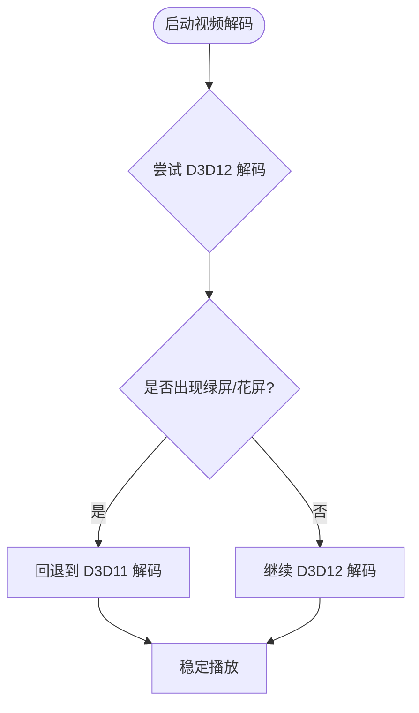
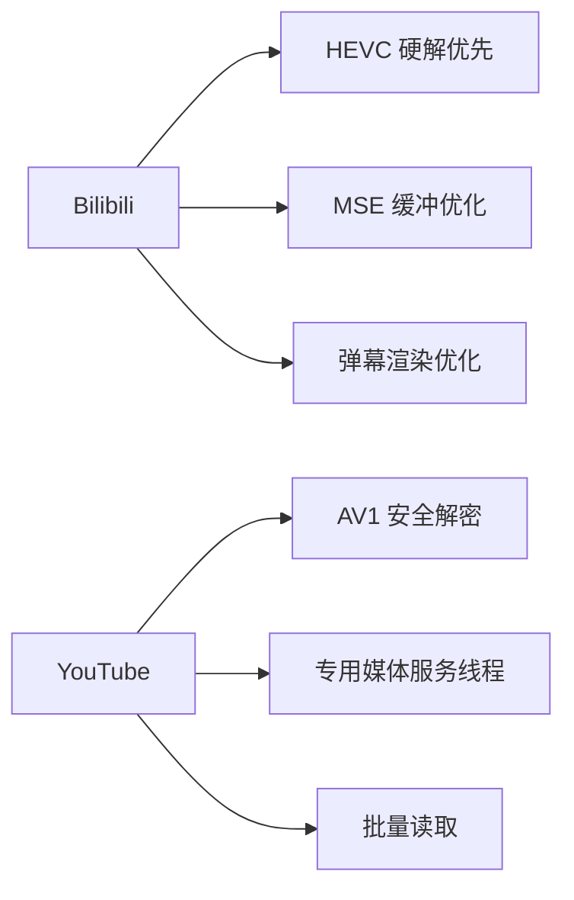
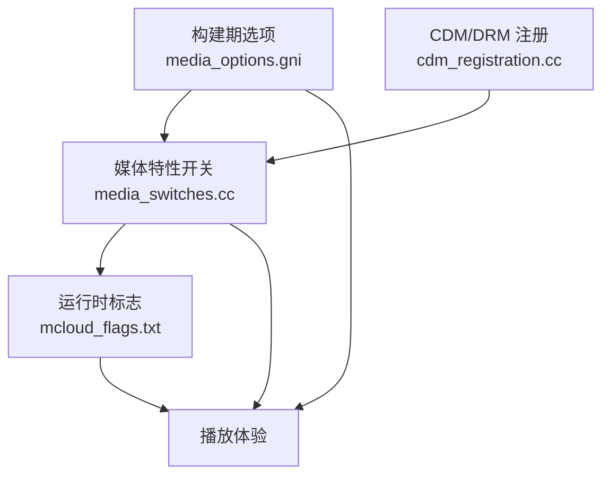

# 媒体视频优化

<cite>
**本文引用的文件**
- [media_switches.cc](file://src/media/base/media_switches.cc)
- [media_options.gni](file://src/media/media_options.gni)
- [mcloud_flags.txt](file://mcloud_flags.txt)
- [progress.md](file://docs/progress.md)
- [2026-06-19-performance-optimization.md](file://docs/superpowers/plans/2026-06-19-performance-optimization.md)
- [2026-06-20-release-notes-m150.md](file://docs/superpowers/specs/2026-06-20-release-notes-m150.md)
- [cdm_registration.cc](file://src/chrome/common/media/cdm_registration.cc)
</cite>

## 目录
1. [简介](#简介)
2. [项目结构](#项目结构)
3. [核心组件](#核心组件)
4. [架构总览](#架构总览)
5. [详细组件分析](#详细组件分析)
6. [依赖关系分析](#依赖关系分析)
7. [性能考量](#性能考量)
8. [故障诊断指南](#故障诊断指南)
9. [结论](#结论)
10. [附录](#附录)

## 简介
本文件聚焦 MCloud Browser 在媒体与视频播放方面的关键优化，覆盖硬件解码支持（HEVC、AV1 安全解密）、专用媒体服务线程、MSE 优化（对象 URL 撤销、缓冲区缩减、MediaFoundation 批量读取）、D3D12 视频解码器的禁用原因与替代方案，以及针对 Bilibili/YouTube 等平台的专项优化策略。同时提供可操作的播放性能测试与故障诊断方法，帮助定位和解决常见播放问题。

## 项目结构
围绕媒体优化的相关代码与配置主要分布在以下位置：
- 媒体特性开关与默认值：src/media/base/media_switches.cc
- 平台编解码能力构建选项：src/media/media_options.gni
- 运行时标志集合：mcloud_flags.txt
- 设计与发布说明：docs/superpowers/plans 与 docs/superpowers/specs
- 进度与已知问题记录：docs/progress.md
- CDM/DRM 注册入口：src/chrome/common/media/cdm_registration.cc

图表来源
- [media_switches.cc:594-635](file://src/media/base/media_switches.cc#L594-L635)
- [media_options.gni:146-168](file://src/media/media_options.gni#L146-L168)
- [mcloud_flags.txt:83-119](file://mcloud_flags.txt#L83-L119)
- [cdm_registration.cc:276-276](file://src/chrome/common/media/cdm_registration.cc#L276-L276)

章节来源
- [media_switches.cc:594-635](file://src/media/base/media_switches.cc#L594-L635)
- [media_options.gni:146-168](file://src/media/media_options.gni#L146-L168)
- [mcloud_flags.txt:83-119](file://mcloud_flags.txt#L83-L119)
- [2026-06-19-performance-optimization.md:41-131](file://docs/superpowers/plans/2026-06-19-performance-optimization.md#L41-L131)
- [2026-06-20-release-notes-m150.md:156-173](file://docs/superpowers/specs/2026-06-20-release-notes-m150.md#L156-L173)
- [progress.md:147-166](file://docs/progress.md#L147-L166)

## 核心组件
- 硬件解码支持
  - HEVC 硬件解码：通过 PlatformHEVCDecoderSupport 启用，配合平台构建选项 enable_platform_hevc，使能 H.265/HEVC 的解复用与硬件解码路径。
  - AV1 硬件安全解密：HardwareSecureDecryptionAv1 开启后，结合 kHardwareSecureDecryption 及回退策略，提升 DRM 内容的安全性与稳定性。
- 专用媒体服务线程
  - DedicatedMediaServiceThread：将媒体服务运行在 GPU 进程的专用线程上，降低与渲染主线程的争用，提升播放流畅度。
- MSE 优化
  - RevokeMediaSourceObjectURLOnAttach：在 HTML Media Element 成功开始附加到 MediaSource object URL 时撤销该 URL，减少内存膨胀。
  - ReduceHardwareVideoDecoderBuffers：在非低延迟场景下减少硬件解码器输出帧池缓冲数量，降低内存占用。
  - MediaFoundationBatchRead：Windows 平台下对 MediaFoundation 进行批量读取，减少 I/O 调用次数，提升加载效率。
- D3D12 视频解码器
  - 由于 Intel 核显首帧绿屏/花屏等问题，当前默认禁用 D3D12VideoDecoder，回退至成熟的 D3D11 硬件解码路径。

章节来源
- [media_switches.cc:388-388](file://src/media/base/media_switches.cc#L388-L388)
- [media_switches.cc:944-967](file://src/media/base/media_switches.cc#L944-L967)
- [media_switches.cc:990-990](file://src/media/base/media_switches.cc#L990-L990)
- [media_switches.cc:628-635](file://src/media/base/media_switches.cc#L628-L635)
- [media_switches.cc:594-610](file://src/media/base/media_switches.cc#L594-L610)
- [media_switches.cc:1445-1451](file://src/media/base/media_switches.cc#L1445-L1451)
- [media_switches.cc:1326-1330](file://src/media/base/media_switches.cc#L1326-L1330)
- [media_options.gni:146-168](file://src/media/media_options.gni#L146-L168)
- [mcloud_flags.txt:83-119](file://mcloud_flags.txt#L83-L119)
- [progress.md:147-166](file://docs/progress.md#L147-L166)

## 架构总览
下图展示了媒体播放的关键路径：页面创建 MediaSource 并附加到 HTML Media Element；媒体服务在专用线程中调度解码任务；Windows 平台使用 MediaFoundation 批量读取数据；硬件解码器根据平台能力选择 HEVC/AV1 等；当遇到 DRM 内容时，启用安全解密并具备自动回退机制。

图表来源
- [media_switches.cc:594-610](file://src/media/base/media_switches.cc#L594-L610)
- [media_switches.cc:628-635](file://src/media/base/media_switches.cc#L628-L635)
- [media_switches.cc:1326-1330](file://src/media/base/media_switches.cc#L1326-L1330)
- [media_switches.cc:944-967](file://src/media/base/media_switches.cc#L944-L967)

## 详细组件分析

### 硬件解码支持（PlatformHEVCDecoderSupport、HardwareSecureDecryptionAv1）
- PlatformHEVCDecoderSupport
  - 作用：启用 HEVC/H.265 的硬件解码支持，配合构建期的 enable_platform_hevc，确保平台具备相应解码能力时优先走硬解路径。
  - 影响：B 站大会员等 HEVC 内容可获得更低的 CPU 占用与更高能效。
- HardwareSecureDecryptionAv1
  - 作用：为 AV1 内容启用硬件安全解密，结合通用安全解密特性与回退策略，提高 DRM 播放的可靠性。
  - 影响：在支持的平台与驱动下，避免软件解密带来的额外开销与潜在崩溃风险。

图表来源
- [media_switches.cc:388-388](file://src/media/base/media_switches.cc#L388-L388)
- [media_switches.cc:944-967](file://src/media/base/media_switches.cc#L944-L967)
- [media_options.gni:146-168](file://src/media/media_options.gni#L146-L168)

章节来源
- [media_switches.cc:388-388](file://src/media/base/media_switches.cc#L388-L388)
- [media_switches.cc:944-967](file://src/media/base/media_switches.cc#L944-L967)
- [media_options.gni:146-168](file://src/media/media_options.gni#L146-L168)
- [cdm_registration.cc:276-276](file://src/chrome/common/media/cdm_registration.cc#L276-L276)

### 专用媒体服务线程（DedicatedMediaServiceThread）
- 作用：将媒体服务迁移到 GPU 进程的专用线程，隔离媒体处理与渲染主线程，减少锁竞争与上下文切换。
- 效果：在多标签页、弹幕密集或高码率视频场景下，播放更稳定，掉帧更少。

图表来源
- [media_switches.cc:628-635](file://src/media/base/media_switches.cc#L628-L635)

章节来源
- [media_switches.cc:628-635](file://src/media/base/media_switches.cc#L628-L635)
- [2026-06-20-release-notes-m150.md:156-173](file://docs/superpowers/specs/2026-06-20-release-notes-m150.md#L156-L173)

### MSE 优化（RevokeMediaSourceObjectURLOnAttach、ReduceHardwareVideoDecoderBuffers、MediaFoundationBatchRead）
- RevokeMediaSourceObjectURLOnAttach
  - 行为：在 HTML Media Element 成功开始附加到 MediaSource object URL 时撤销该 URL，避免长期持有导致内存增长。
  - 适用：长时间播放、频繁创建/销毁 MediaSource 的场景。
- ReduceHardwareVideoDecoderBuffers
  - 行为：在非低延迟场景下减少硬件解码器输出帧池缓冲数量，降低内存占用。
  - 适用：长视频、多路并发播放。
- MediaFoundationBatchRead
  - 行为：Windows 平台下对 MediaFoundation 进行批量读取，减少系统调用与拷贝次数，提升加载速度。
  - 适用：大文件、高码率流媒体。

图表来源
- [media_switches.cc:594-610](file://src/media/base/media_switches.cc#L594-L610)
- [media_switches.cc:1445-1451](file://src/media/base/media_switches.cc#L1445-L1451)
- [media_switches.cc:1326-1330](file://src/media/base/media_switches.cc#L1326-L1330)

章节来源
- [media_switches.cc:594-610](file://src/media/base/media_switches.cc#L594-L610)
- [media_switches.cc:1445-1451](file://src/media/base/media_switches.cc#L1445-L1451)
- [media_switches.cc:1326-1330](file://src/media/base/media_switches.cc#L1326-L1330)

### D3D12 视频解码器的禁用原因与替代方案
- 现象：Intel 核显（如 UHD 770/Raptor Lake）在 D3D12 视频解码器启动的前几秒出现绿屏/花屏，独显则正常。
- 原因：显卡驱动版本或硬件限制导致首帧输出异常；Chromium M150 的 D3D12 实现存在限制。
- 处理：通过 mcloud_flags.txt 显式禁用 D3D12VideoDecoder，回退到成熟的 D3D11 硬件解码路径，保证播放稳定性。
- 后续：待上游修复或 GPU 黑名单条目落地后移除禁用标志。

图表来源
- [mcloud_flags.txt:83-88](file://mcloud_flags.txt#L83-L88)
- [progress.md:147-166](file://docs/progress.md#L147-L166)

章节来源
- [mcloud_flags.txt:83-88](file://mcloud_flags.txt#L83-L88)
- [progress.md:147-166](file://docs/progress.md#L147-L166)

### 针对 Bilibili/YouTube 等平台的专门优化
- Bilibili
  - 技术栈：DASH 流、HEVC/H.264 编码、Canvas/WebGL 弹幕渲染。
  - 优化点：
    - 优先 HEVC 硬解路径，软解时利用 FFmpeg AVX2 内核。
    - 优化 MSE 缓冲策略与预加载时机，减少卡顿。
    - 弹幕渲染利用 Skia AVX2 路径，确保高密度弹幕不掉帧。
    - 长视频内存管理，避免内存泄漏。
- YouTube
  - 技术栈：VP9/AV1、DASH、WebCodecs。
  - 优化点：
    - 启用 AV1 安全解密与硬件解码，降低 CPU 占用。
    - 使用专用媒体服务线程与批量读取，提升加载与切换清晰度流畅度。
    - 监控 MSE 对象 URL 生命周期，及时撤销以减少内存增长。

图表来源
- [2026-06-08-mcloud-browser-m149-upgrade-design.md:351-372](file://docs/superpowers/specs/2026-06-08-mcloud-browser-m149-upgrade-design.md#L351-L372)
- [2026-06-08-mcloud-browser-m149-upgrade.md:656-732](file://docs/superpowers/plans/2026-06-08-mcloud-browser-m149-upgrade.md#L656-L732)

章节来源
- [2026-06-08-mcloud-browser-m149-upgrade-design.md:351-372](file://docs/superpowers/specs/2026-06-08-mcloud-browser-m149-upgrade-design.md#L351-L372)
- [2026-06-08-mcloud-browser-m149-upgrade.md:656-732](file://docs/superpowers/plans/2026-06-08-mcloud-browser-m149-upgrade.md#L656-L732)

## 依赖关系分析
- 媒体特性开关（media_switches.cc）决定运行时行为，包括 MSE 优化、专用线程、批量读取与安全解密。
- 构建期选项（media_options.gni）控制平台编解码能力，如 HEVC 解析与硬件解码。
- 运行时标志（mcloud_flags.txt）统一启用/禁用特定功能，例如禁用 D3D12VideoDecoder。
- CDM/DRM 注册（cdm_registration.cc）在启用 HEVC 硬解时参与密钥系统与解码路径选择。

图表来源
- [media_switches.cc:594-635](file://src/media/base/media_switches.cc#L594-L635)
- [media_options.gni:146-168](file://src/media/media_options.gni#L146-L168)
- [mcloud_flags.txt:83-119](file://mcloud_flags.txt#L83-L119)
- [cdm_registration.cc:276-276](file://src/chrome/common/media/cdm_registration.cc#L276-L276)

章节来源
- [media_switches.cc:594-635](file://src/media/base/media_switches.cc#L594-L635)
- [media_options.gni:146-168](file://src/media/media_options.gni#L146-L168)
- [mcloud_flags.txt:83-119](file://mcloud_flags.txt#L83-L119)
- [cdm_registration.cc:276-276](file://src/chrome/common/media/cdm_registration.cc#L276-L276)

## 性能考量
- 硬件解码优先：在平台支持的情况下，优先选择 HEVC/AV1 硬件解码，降低 CPU 占用与功耗。
- 专用线程隔离：媒体服务在独立线程运行，减少与渲染主线程的争用，提升响应性。
- MSE 内存管理：及时撤销 MediaSource object URL，减少内存膨胀；在非低延迟场景减少缓冲数量。
- Windows 批量读取：MediaFoundation 批量读取减少 I/O 开销，提升加载速度与切换清晰度流畅度。
- D3D12 回退：在核显首帧异常时回退到 D3D11，保证稳定性与兼容性。

[本节为通用指导，不直接分析具体文件]

## 故障诊断指南
- 验证硬件解码
  - 访问 chrome://gpu/，确认“Video Decode”显示“Hardware accelerated”。
  - 播放 4K HEVC/AV1 视频，观察任务管理器中 GPU Video Decode 使用率。
- 检查 MSE 行为
  - 播放 YouTube/Bilibili 视频，观察缓冲是否频繁中断、切换清晰度是否流畅、长时间播放是否有内存泄漏。
  - 通过开发者工具监控 MediaSource 对象 URL 的生命周期，确认是否在附加后及时撤销。
- 排查 D3D12 问题
  - 若出现绿屏/花屏，确认是否启用了 D3D12VideoDecoder；必要时在 mcloud_flags.txt 中禁用该特性，回退到 D3D11。
- 安全解密与 DRM
  - 对于加密内容，确认 HardwareSecureDecryptionAv1 与 kHardwareSecureDecryption 已启用，并观察是否触发回退到软件安全 CDM。
- 性能追踪
  - 使用 chrome://tracing/ 记录渲染与解码过程，识别瓶颈（如弹幕渲染、解码队列阻塞）。

章节来源
- [2026-06-08-mcloud-browser-m149-upgrade.md:656-732](file://docs/superpowers/plans/2026-06-08-mcloud-browser-m149-upgrade.md#L656-L732)
- [progress.md:208-212](file://docs/progress.md#L208-L212)
- [mcloud_flags.txt:83-88](file://mcloud_flags.txt#L83-L88)
- [media_switches.cc:944-967](file://src/media/base/media_switches.cc#L944-L967)

## 结论
MCloud Browser 在媒体与视频播放方面通过启用 HEVC/AV1 硬件解码、专用媒体服务线程、MSE 优化与 Windows 批量读取，显著提升了播放流畅度与资源利用率。针对 D3D12 的首帧异常问题，采用回退到 D3D11 的策略确保稳定性。结合 Bilibili/YouTube 等平台的技术栈特点，进一步优化了缓冲策略、弹幕渲染与内存管理。建议在生产环境中持续监控播放质量，并根据设备与驱动情况调整相关特性开关。

[本节为总结，不直接分析具体文件]

## 附录
- 常用命令与工具
  - chrome://flags：检查与调整媒体相关特性开关。
  - chrome://media-internals：查看媒体管道状态与错误信息。
  - chrome://tracing：录制性能轨迹，定位卡顿与瓶颈。
- 参考文档
  - 性能优化计划：docs/superpowers/plans/2026-06-19-performance-optimization.md
  - M150 发布说明：docs/superpowers/specs/2026-06-20-release-notes-m150.md
  - 进度与问题记录：docs/progress.md

[本节为补充信息，不直接分析具体文件]