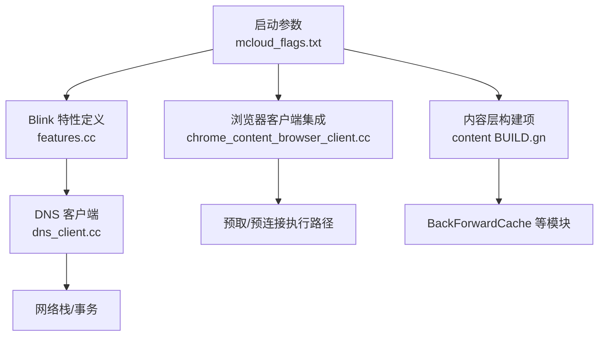
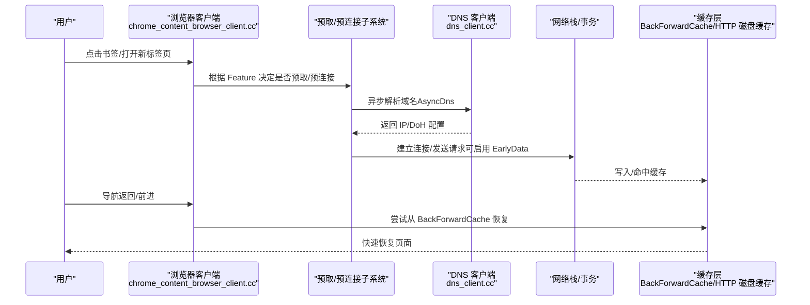
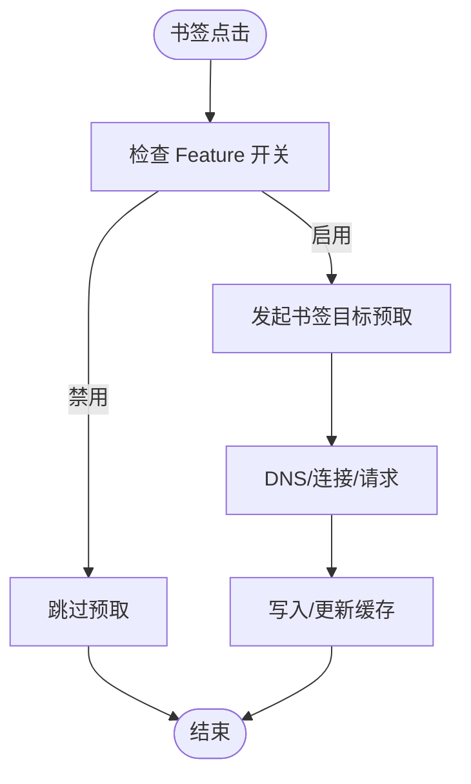
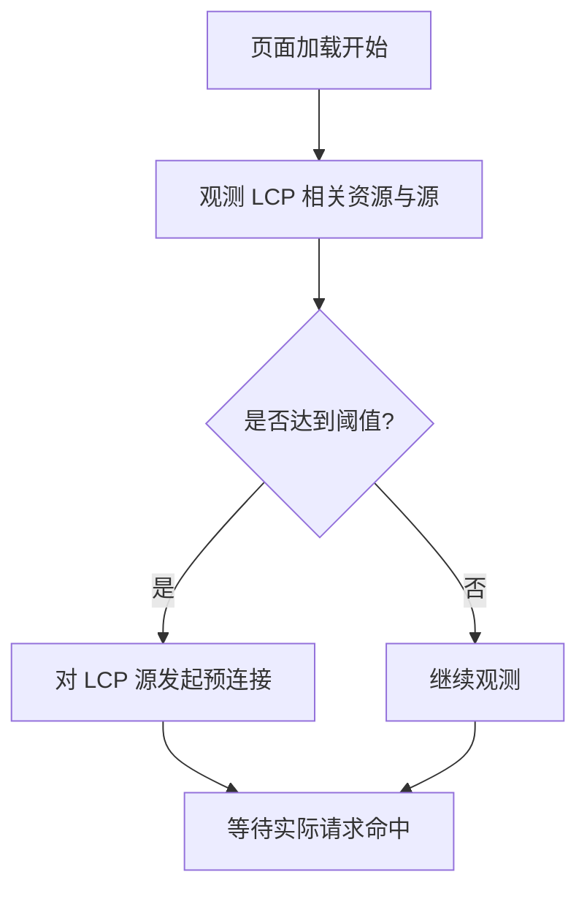
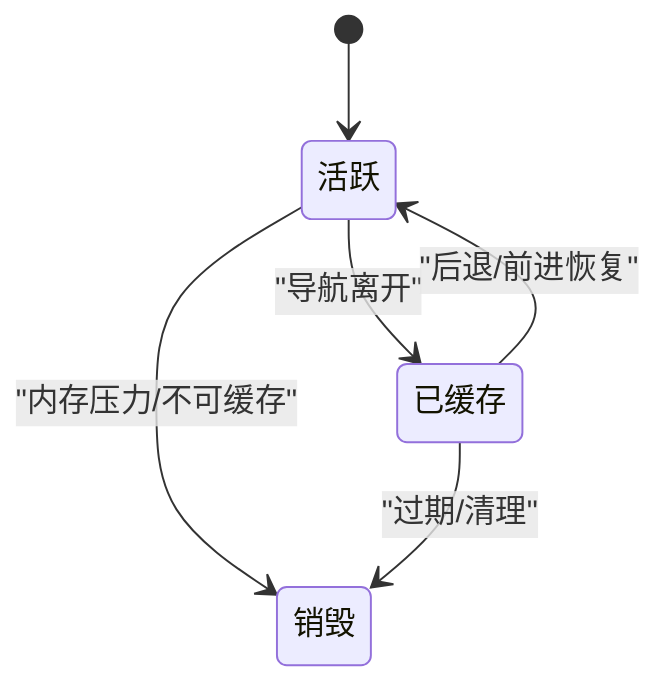
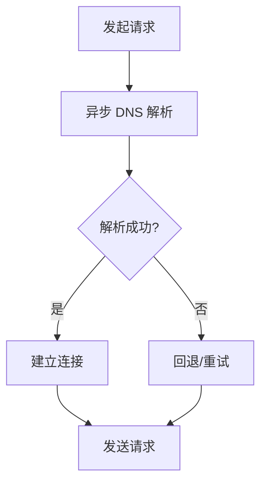
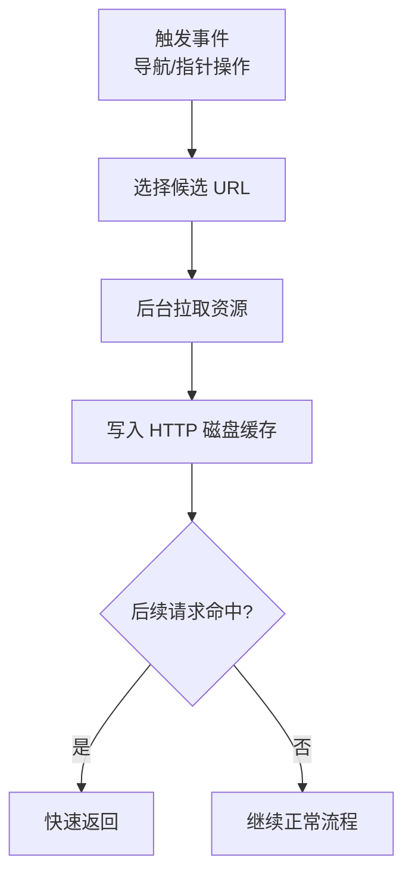
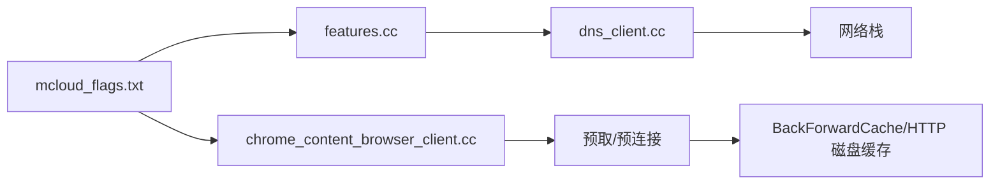

# 网络优化

<cite>
**本文引用的文件**
- [mcloud_flags.txt](file://mcloud_flags.txt)
- [README.md](file://README.md)
- [features.cc](file://src/third_party/blink/common/features.cc)
- [chrome_content_browser_client.cc](file://src/chrome/browser/chrome_content_browser_client.cc)
- [dns_client.cc](file://src/net/dns/dns_client.cc)
- [BUILD.gn（content）](file://src/content/browser/BUILD.gn)
- [M151-opt-benchmark.md](file://docs/dev-logs/M151-opt-benchmark.md)
- [2026-06-20-release-notes-m150.md](file://docs/superpowers/specs/2026-06-20-release-notes-m150.md)
</cite>

## 目录
1. [简介](#简介)
2. [项目结构](#项目结构)
3. [核心组件](#核心组件)
4. [架构总览](#架构总览)
5. [详细组件分析](#详细组件分析)
6. [依赖关系分析](#依赖关系分析)
7. [性能考量](#性能考量)
8. [故障排查指南](#故障排查指南)
9. [结论](#结论)
10. [附录](#附录)

## 简介
本文件面向 MCloud Browser 的网络优化，聚焦以下主题：预取与预连接机制、后退/前进缓存（BackForwardCache）、异步 DNS（AsyncDns）、早期数据（EarlyData/TLS 0-RTT）、HTTP 磁盘缓存预热（HttpDiskCachePrewarming），以及 LCP 自动预连接（LCPPAutoPreconnectLcpOrigin）。文档同时给出监控与调优建议，帮助在真实站点场景下平衡速度与内存。

## 项目结构
MCloud Browser 将网络相关优化以“运行时标志”形式集中管理，并通过 Chromium 的 feature 开关在浏览器启动时生效。关键位置包括：
- 启动参数与功能开关清单：mcloud_flags.txt
- 功能定义与参数：src/third_party/blink/common/features.cc
- 书签/新标签页触发预取的集成点：src/chrome/browser/chrome_content_browser_client.cc
- 异步 DNS 客户端实现：src/net/dns/dns_client.cc
- BackForwardCache 编译项与模块组织：src/content/browser/BUILD.gn

图表来源
- [mcloud_flags.txt:40-76](file://mcloud_flags.txt#L40-L76)
- [features.cc:1196-1226](file://src/third_party/blink/common/features.cc#L1196-L1226)
- [chrome_content_browser_client.cc:8878-8880](file://src/chrome/browser/chrome_content_browser_client.cc#L8878-L8880)
- [dns_client.cc:148-230](file://src/net/dns/dns_client.cc#L148-L230)
- [BUILD.gn（content）:1771-1782](file://src/content/browser/BUILD.gn#L1771-L1782)

章节来源
- [mcloud_flags.txt:40-76](file://mcloud_flags.txt#L40-L76)
- [README.md:98-107](file://README.md#L98-L107)

## 核心组件
- 预取触发器
  - 书签触发预取：BookmarkTriggerForPrefetch
  - 新标签页触发预取：NewTabPageTriggerForPrefetch
- 预连接触发器
  - 书签触发预连接：BookmarkTriggerForPreconnect
  - LCP 源自动预连接：LCPPAutoPreconnectLcpOrigin
- 缓存与恢复
  - 后退/前进缓存：BackForwardCache
  - HTTP 磁盘缓存预热：HttpDiskCachePrewarming
- 连接与解析加速
  - 异步 DNS：AsyncDns
  - TLS 早期数据：EarlyData（0-RTT）

章节来源
- [mcloud_flags.txt:40-76](file://mcloud_flags.txt#L40-L76)
- [README.md:166-175](file://README.md#L166-L175)
- [2026-06-20-release-notes-m150.md:175-183](file://docs/superpowers/specs/2026-06-20-release-notes-m150.md#L175-L183)

## 架构总览
下图展示从用户动作到网络优化的关键路径：书签点击或新标签页打开会触发预取；页面加载过程中识别 LCP 源并发起预连接；DNS 解析与 TLS 握手通过异步与早期数据降低延迟；导航返回时优先使用 BackForwardCache；常用资源通过 HTTP 磁盘缓存预热减少冷启动开销。

图表来源
- [chrome_content_browser_client.cc:8878-8880](file://src/chrome/browser/chrome_content_browser_client.cc#L8878-L8880)
- [dns_client.cc:148-230](file://src/net/dns/dns_client.cc#L148-L230)
- [BUILD.gn（content）:1771-1782](file://src/content/browser/BUILD.gn#L1771-L1782)

## 详细组件分析

### 书签触发预取（BookmarkTriggerForPrefetch）
- 作用：当用户点击书签时，提前发起目标页面的预取，缩短首屏时间。
- 集成点：浏览器客户端通过 UsePrefetchPrerenderIntegration 判断是否启用书签/新标签页触发的预取。
- 适用场景：高频访问书签、期望“即点即达”的场景。
- 注意事项：预取会带来额外网络与内存占用，需结合站点特征评估收益。

图表来源
- [chrome_content_browser_client.cc:8878-8880](file://src/chrome/browser/chrome_content_browser_client.cc#L8878-L8880)
- [mcloud_flags.txt:40-42](file://mcloud_flags.txt#L40-L42)

章节来源
- [chrome_content_browser_client.cc:8878-8880](file://src/chrome/browser/chrome_content_browser_client.cc#L8878-L8880)
- [mcloud_flags.txt:40-42](file://mcloud_flags.txt#L40-L42)

### 新标签页触发预取（NewTabPageTriggerForPrefetch）
- 作用：在新标签页打开时，对推荐或常见目标进行预取，提升后续导航速度。
- 集成点：与书签触发共用同一集成入口，由 Feature 控制。
- 适用场景：新标签页常访问固定站点或推荐列表。
- 注意事项：多标签高并发下可能放大内存与带宽压力。

章节来源
- [chrome_content_browser_client.cc:8878-8880](file://src/chrome/browser/chrome_content_browser_client.cc#L8878-L8880)
- [mcloud_flags.txt:41-42](file://mcloud_flags.txt#L41-L42)

### 书签触发预连接（BookmarkTriggerForPreconnect）
- 作用：在书签点击前预先建立与目标源的连接（含 DNS、TCP、TLS 握手），显著降低首次请求延迟。
- 适用场景：书签指向稳定且高频的 HTTPS 站点。
- 注意：预连接本身不下载页面，仅预热连接；若目标频繁重定向，可配合 LoadingPreconnectToRedirectTarget。

章节来源
- [mcloud_flags.txt:67](file://mcloud_flags.txt#L67)
- [README.md:87](file://README.md#L87)

### LCP 自动预连接（LCPPAutoPreconnectLcpOrigin）
- 作用：基于 LCP（最大内容绘制）指标，自动识别关键源并发起预连接，减少首屏关键路径阻塞。
- 参数化：频率阈值、滑动窗口、最大原点数等可通过 Feature 参数调节。
- 适用场景：图片/字体等资源来自多源且影响 LCP 的页面。

图表来源
- [features.cc:1196-1226](file://src/third_party/blink/common/features.cc#L1196-L1226)
- [mcloud_flags.txt:76](file://mcloud_flags.txt#L76)

章节来源
- [features.cc:1196-1226](file://src/third_party/blink/common/features.cc#L1196-L1226)
- [mcloud_flags.txt:76](file://mcloud_flags.txt#L76)

### 后退/前进缓存（BackForwardCache）
- 工作原理：在用户离开页面时，将当前页面状态（DOM、JS 上下文等）序列化并保存在内存中；返回时直接恢复，避免重新加载。
- 效果：显著提升“后退/前进”体验，接近“瞬间恢复”。
- 扩展：允许 no-store 页面进入缓存（CacheControlNoStoreEnterBackForwardCache），扩大可缓存范围。
- 构建项：content 层提供完整实现与度量。

图表来源
- [BUILD.gn（content）:1771-1782](file://src/content/browser/BUILD.gn#L1771-L1782)
- [mcloud_flags.txt:43-44](file://mcloud_flags.txt#L43-L44)

章节来源
- [BUILD.gn（content）:1771-1782](file://src/content/browser/BUILD.gn#L1771-L1782)
- [mcloud_flags.txt:43-44](file://mcloud_flags.txt#L43-L44)

### 异步 DNS（AsyncDns）
- 作用：将 DNS 解析从主线程/请求路径中解耦，减少阻塞，提高整体响应性。
- 能力：支持 DoH 升级、本地/公共名称服务器选择、失败回退策略等。
- 典型收益：在多站点对比下，首字节时间与交互延迟更稳定。

图表来源
- [dns_client.cc:148-230](file://src/net/dns/dns_client.cc#L148-L230)
- [mcloud_flags.txt:45](file://mcloud_flags.txt#L45)

章节来源
- [dns_client.cc:148-230](file://src/net/dns/dns_client.cc#L148-L230)
- [mcloud_flags.txt:45](file://mcloud_flags.txt#L45)

### 早期数据（EarlyData / TLS 1.3 0-RTT）
- 作用：在 TLS 握手阶段携带应用数据，减少往返次数，降低首字节时间。
- 限制：并非所有服务端都支持 0-RTT；仅在连接复用且服务端开启时有效。
- 监控：网络层记录 TLS 1.3 相关指标，便于评估收益与风险。

章节来源
- [mcloud_flags.txt:46](file://mcloud_flags.txt#L46)
- [2026-06-20-release-notes-m150.md:175-183](file://docs/superpowers/specs/2026-06-20-release-notes-m150.md#L175-L183)

### HTTP 磁盘缓存预热（HttpDiskCachePrewarming）
- 作用：在用户交互（如指针按下/悬停）或导航时，提前拉取热门资源并写入磁盘缓存，减少冷启动时的 I/O 与网络开销。
- 参数：历史大小、滑动窗口、触发时机、是否跳过启动期等均可配置。
- 收益：对重复访问的静态资源尤为明显。

图表来源
- [features.cc:1440-1496](file://src/third_party/blink/common/features.cc#L1440-L1496)
- [mcloud_flags.txt:75](file://mcloud_flags.txt#L75)

章节来源
- [features.cc:1440-1496](file://src/third_party/blink/common/features.cc#L1440-L1496)
- [mcloud_flags.txt:75](file://mcloud_flags.txt#L75)

## 依赖关系分析
- 功能开关依赖：mcloud_flags.txt 统一启用各项网络优化；具体行为受 Blink features 参数控制。
- 集成点依赖：书签/新标签页预取通过 chrome_content_browser_client.cc 的集成方法启用。
- 底层能力依赖：AsyncDns 依赖 dns_client.cc 提供的会话与事务工厂；EarlyData 依赖网络栈对 TLS 1.3 的支持。
- 缓存依赖：BackForwardCache 由 content 层提供；HTTP 磁盘缓存预热依赖磁盘 I/O 与缓存策略。

图表来源
- [mcloud_flags.txt:40-76](file://mcloud_flags.txt#L40-L76)
- [features.cc:1196-1226](file://src/third_party/blink/common/features.cc#L1196-L1226)
- [chrome_content_browser_client.cc:8878-8880](file://src/chrome/browser/chrome_content_browser_client.cc#L8878-L8880)
- [dns_client.cc:148-230](file://src/net/dns/dns_client.cc#L148-L230)

章节来源
- [mcloud_flags.txt:40-76](file://mcloud_flags.txt#L40-L76)
- [features.cc:1196-1226](file://src/third_party/blink/common/features.cc#L1196-L1226)
- [chrome_content_browser_client.cc:8878-8880](file://src/chrome/browser/chrome_content_browser_client.cc#L8878-L8880)
- [dns_client.cc:148-230](file://src/net/dns/dns_client.cc#L148-L230)

## 性能考量
- 空间-速度权衡：预载/预热类优化以内存换取速度，实测在真实站点多标签场景下存在内存代价；建议按站点特征做二分取舍。
- 收益验证：导航响应测试显示部分站点（如 bilibili.com）在预载开启时更快；但不同站点差异较大，需持续验证。
- 稳定性：EarlyData 的收益取决于服务端支持与连接复用情况；BackForwardCache 能显著提升返回体验但对页面可缓存性有要求。

章节来源
- [M151-opt-benchmark.md:34-52](file://docs/dev-logs/M151-opt-benchmark.md#L34-L52)
- [M151-opt-benchmark.md:71-78](file://docs/dev-logs/M151-opt-benchmark.md#L71-L78)

## 故障排查指南
- 预取未生效
  - 检查 mcloud_flags.txt 是否启用了 BookmarkTriggerForPrefetch/NewTabPageTriggerForPrefetch。
  - 确认 chrome_content_browser_client.cc 中的集成方法返回 true。
- DNS 解析慢
  - 确认 AsyncDns 已启用；观察 DNS 会话与回退逻辑是否正常。
  - 检查 DoH 升级与本地名称服务器配置。
- 返回/前进卡顿
  - 确认 BackForwardCache 已启用；必要时调整页面可缓存条件。
- 预热无效
  - 检查 HttpDiskCachePrewarming 的参数（历史大小、滑动窗口、触发时机）；确认磁盘 I/O 未被安全软件拦截。
- 0-RTT 异常
  - EarlyData 需要服务端支持；如遇兼容性问题，可在问题站点临时关闭该特性。

章节来源
- [mcloud_flags.txt:40-76](file://mcloud_flags.txt#L40-L76)
- [chrome_content_browser_client.cc:8878-8880](file://src/chrome/browser/chrome_content_browser_client.cc#L8878-L8880)
- [dns_client.cc:148-230](file://src/net/dns/dns_client.cc#L148-L230)
- [BUILD.gn（content）:1771-1782](file://src/content/browser/BUILD.gn#L1771-L1782)
- [features.cc:1440-1496](file://src/third_party/blink/common/features.cc#L1440-L1496)

## 结论
MCloud Browser 在网络层面通过“预取/预连接 + 异步 DNS + 早期数据 + 缓存预热 + BackForwardCache”的组合拳，显著改善首屏与导航体验。建议在真实站点上持续验证收益与内存代价，按需裁剪高内存低收益的预载项，保持速度与资源的平衡。

## 附录
- 推荐监控工具与指标
  - Chrome DevTools Network：关注 DNS、连接、TLS、0-RTT 命中率、缓存命中。
  - Performance 面板：关注 TTFB、LCP、FCP、CLS 等关键指标。
  - about:net-internals：查看 DNS、TLS、缓存与预连接状态。
- 调优最佳实践
  - 针对高频书签与推荐页启用预取/预连接；对低频站点谨慎开启。
  - 合理设置 HttpDiskCachePrewarming 的历史大小与滑动窗口，避免过度预热。
  - 对 LCP 敏感页面启用 LCPPAutoPreconnectLcpOrigin，并结合资源拆分减少跨域阻塞。
  - 在移动端或弱网环境，谨慎启用 EarlyData，优先保证兼容性。
  - 定期回归基准，确保新增优化未引入内存回归。