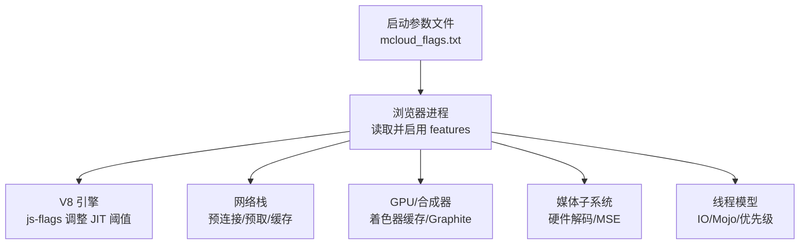
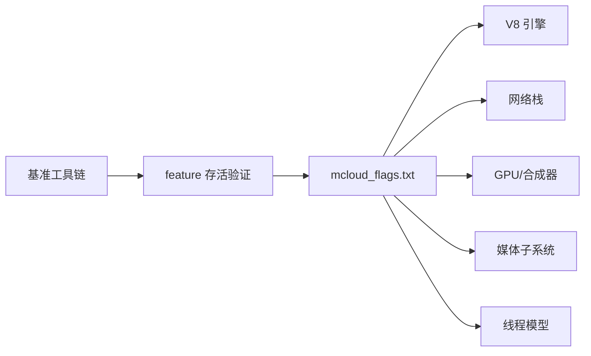

# 运行时优化

<cite>
**本文引用的文件**
- [mcloud_flags.txt](file://mcloud_flags.txt)
- [README.md](file://README.md)
- [M151-opt-benchmark.md](file://docs/dev-logs/M151-opt-benchmark.md)
- [M151-benchmark.md](file://docs/dev-logs/M151-benchmark.md)
- [2026-06-19-performance-optimization-design.md](file://docs/superpowers/specs/2026-06-19-performance-optimization-design.md)
- [2026-06-20-release-notes-m150.md](file://docs/superpowers/specs/2026-06-20-release-notes-m150.md)
- [mcloud_flag_entries.h](file://src/chrome/browser/mcloud_flag_entries.h)
- [mcloud_flag_choices.h](file://src/chrome/browser/mcloud_flag_choices.h)
- [bench_memory.ps1](file://benchmark/bench_memory.ps1)
- [bench_navigation.ps1](file://benchmark/bench_navigation.ps1)
- [media_switches.cc](file://src/media/base/media_switches.cc)
- [ffmpeg_video_decoder.cc](file://src/media/filters/ffmpeg_video_decoder.cc)
</cite>

## 目录
1. [简介](#简介)
2. [项目结构](#项目结构)
3. [核心组件](#核心组件)
4. [架构总览](#架构总览)
5. [详细组件分析](#详细组件分析)
6. [依赖关系分析](#依赖关系分析)
7. [性能考量](#性能考量)
8. [故障排除指南](#故障排除指南)
9. [结论](#结论)
10. [附录](#附录)

## 简介
本文件系统化梳理 MCloud Browser 的 66 项运行时优化标志，覆盖启动优化、V8 脚本优化、页面加载优化、内存管理优化、多线程优化、视频媒体优化与 GPU 渲染优化。文档基于仓库内已落地的启动参数清单、基准测试报告与设计规格，解释每个标志的工作原理、适用场景与性能影响，并提供标志组合的最佳实践与排障建议。

## 项目结构
- 运行时优化入口：通过安装时注入的启动参数文件集中配置，浏览器启动时自动应用。
- 验证与基准：使用内置工具校验 feature 存活情况，并通过自动化脚本采集冷启动、内存等关键指标。
- 设计规格与发布说明：对优化目标、预期收益与取舍进行记录。



图表来源
- [mcloud_flags.txt:1-119](file://mcloud_flags.txt#L1-L119)
- [README.md:302-351](file://README.md#L302-L351)

章节来源
- [mcloud_flags.txt:1-119](file://mcloud_flags.txt#L1-L119)
- [README.md:302-351](file://README.md#L302-L351)

## 核心组件
- 启动优化：备用渲染进程、GPU 通道提前建立、延迟推测性 RFH 创建、初始 WebUI 降载、临时保活策略。
- V8 脚本优化：降低 Maglev/TurboFan 触发阈值、开启 OSR-from-Maglev、启用 Sparkplug+。
- 页面加载优化：书签/新标签页预取、预连接到重定向目标、Top Chrome WebUI 预加载、LCPP 自动预连接 LCP 源。
- 内存管理优化：无限标签冻结（含压力触发）、PartitionAlloc 回收与排序、提交限制丢弃、持续紧急丢弃、旧预绘瓦片回收、传输缓存清理。
- 多线程优化：IO 线程交互类型、Mojo 专用线程、自旋锁、关闭标签提升优先级、非重要帧降级。
- 视频媒体优化：后台媒体不暂停、Canvas OOP 光栅化、MediaSource URL 撤销、减少硬解缓冲、DWC 在 JS 执行时、平台 HEVC、AV1 安全解密、专用媒体线程、原生 Opus、加密遮挡跟踪、MediaFoundation 批量读取与零拷贝捕获。
- GPU 渲染优化：着色器磁盘缓存、命令缓冲区解析切片增大、Skia Graphite 预编译与启用、资源池精确复用、高帧率请求。

章节来源
- [mcloud_flags.txt:8-119](file://mcloud_flags.txt#L8-L119)
- [2026-06-19-performance-optimization-design.md:78-98](file://docs/superpowers/specs/2026-06-19-performance-optimization-design.md#L78-L98)
- [2026-06-20-release-notes-m150.md:156-173](file://docs/superpowers/specs/2026-06-20-release-notes-m150.md#L156-L173)

## 架构总览
下图展示从启动参数到各子系统的运行路径，以及关键优化点如何协同工作。

```mermaid
sequenceDiagram
participant U as "用户"
participant P as "浏览器进程"
participant N as "网络栈"
participant V as "V8 引擎"
participant G as "GPU/合成器"
participant M as "媒体子系统"
participant T as "线程调度"
U->>P : 启动浏览器
P->>P : 读取 mcloud_flags.txt
P->>N : 启用预连接/预取/缓存
P->>V : 注入 js-flagsMaglev/TurboFan 阈值
P->>G : 启用着色器缓存/Graphite/高刷
P->>M : 启用硬解/MSE/专用线程
P->>T : IO 线程交互/Mojo 专用/优先级调整
Note over P,N,V,G,M,T : 启动后进入页面加载与渲染阶段
```

图表来源
- [mcloud_flags.txt:8-119](file://mcloud_flags.txt#L8-L119)
- [README.md:302-351](file://README.md#L302-L351)

## 详细组件分析

### 启动优化（冷启动加速、预加载）
- 备用渲染进程与 GPU 通道提前建立：缩短首帧等待时间，减少首次绘制阻塞。
- 延迟推测性 RFH 创建：避免不必要的渲染进程创建开销。
- 初始 WebUI 降载：去除拼写检查、翻译等高成本模块，提高启动速度。
- 临时保活策略：在关键阶段保持必要服务活跃，减少冷启动抖动。

适用场景
- 桌面端高频启动、多窗口切换、任务栏快速唤醒。

性能影响
- 冷启动时间可能因预热略有波动；整体交互响应更稳定。

章节来源
- [mcloud_flags.txt:8-15](file://mcloud_flags.txt#L8-L15)
- [README.md:302-351](file://README.md#L302-L351)

### V8 脚本优化（JIT 触发阈值调整、Sparkplug+ 引擎）
- 降低 Maglev 与 TurboFan 触发阈值：使热点代码更快进入高效编译路径。
- OSR-from-Maglev：允许从 Maglev 直接回退或升级，减少编译抖动。
- Sparkplug+：改进字节码执行效率。

适用场景
- 复杂前端应用、长驻页面、频繁 DOM/JS 操作。

性能影响
- 脚本执行更快，首屏交互更流畅；需结合业务负载验证。

章节来源
- [mcloud_flags.txt:54-57](file://mcloud_flags.txt#L54-L57)
- [README.md:302-351](file://README.md#L302-L351)
- [M151-opt-benchmark.md:28-33](file://docs/dev-logs/M151-opt-benchmark.md#L28-L33)

### 页面加载优化（预连接、预渲染）
- 书签/新标签页预取：命中率高时可显著降低导航耗时。
- 预连接至重定向目标：减少握手与 TLS 开销。
- Top Chrome WebUI 预加载：提升设置、扩展管理等内部页面响应。
- LCPP 自动预连接 LCP 源：针对首屏关键资源提前建立连接。

适用场景
- 常用站点导航、内容型网站、WebUI 操作频繁。

性能影响
- 在命中场景下导航更快；未命中时带来少量内存与网络占用。

章节来源
- [mcloud_flags.txt:40-46](file://mcloud_flags.txt#L40-L46)
- [mcloud_flags.txt:59-76](file://mcloud_flags.txt#L59-L76)
- [M151-opt-benchmark.md:34-60](file://docs/dev-logs/M151-opt-benchmark.md#L34-L60)

### 内存管理优化（标签页冻结、内存回收）
- 无限标签冻结（含压力触发）：长时间不活动标签冻结，释放内存。
- PartitionAlloc 回收与排序：提升碎片整理效率，降低分配抖动。
- 提交限制丢弃与持续紧急丢弃：在内存紧张时主动回收，防 OOM。
- 旧预绘瓦片回收与传输缓存清理：减少渲染与 GPU 内存占用。

适用场景
- 多标签重度使用、低内存设备、长时间会话。

性能影响
- 内存占用下降，恢复冻结标签时有轻微延迟；整体稳定性提升。

章节来源
- [mcloud_flags.txt:27-38](file://mcloud_flags.txt#L27-L38)
- [2026-06-19-performance-optimization-design.md:78-88](file://docs/superpowers/specs/2026-06-19-performance-optimization-design.md#L78-L88)

### 多线程优化（IO 线程优先级、Mojo 专用线程）
- IO 线程交互类型：提升网络 I/O 响应性。
- Mojo 专用线程：隔离 IPC 处理，降低主线程阻塞风险。
- 自旋锁与优先级调整：减少内核态切换与锁竞争，提升吞吐。
- 关闭标签提升优先级与非重要帧降级：让关键任务优先完成。

适用场景
- 高并发网络请求、复杂页面交互、后台任务较多。

性能影响
- 交互更顺滑，后台任务对前台影响更小。

章节来源
- [mcloud_flags.txt:107-112](file://mcloud_flags.txt#L107-L112)
- [2026-06-19-performance-optimization-design.md:90-98](file://docs/superpowers/specs/2026-06-19-performance-optimization-design.md#L90-L98)

### 视频媒体优化（硬件解码、MSE 缓冲）
- 后台媒体不暂停与 Canvas OOP 光栅化：保证播放连续性并减轻主线程压力。
- MediaSource URL 撤销与减少硬解缓冲：降低内存峰值，改善长视频稳定性。
- DWC 在 JS 执行时：利用空闲期做数据交换，减少卡顿。
- 平台 HEVC、AV1 安全解密、专用媒体线程、原生 Opus、加密遮挡跟踪、MediaFoundation 批量读取与零拷贝捕获：全面提升解码效率与功耗表现。

适用场景
- 长视频观看、直播、弹幕密集场景（如 B 站）。

性能影响
- 播放更流畅，CPU/GPU 占用更合理；特定驱动/硬件需关注兼容性。

章节来源
- [mcloud_flags.txt:16-19](file://mcloud_flags.txt#L16-L19)
- [mcloud_flags.txt:78-105](file://mcloud_flags.txt#L78-L105)
- [2026-06-20-release-notes-m150.md:156-165](file://docs/superpowers/specs/2026-06-20-release-notes-m150.md#L156-L165)
- [media_switches.cc:1221-1268](file://src/media/base/media_switches.cc#L1221-L1268)
- [ffmpeg_video_decoder.cc:78-119](file://src/media/filters/ffmpeg_video_decoder.cc#L78-L119)

### GPU 渲染优化（着色器缓存、Skia Graphite）
- 着色器磁盘缓存：避免重复编译，减少首帧卡顿。
- 命令缓冲区解析切片增大：降低上下文切换开销。
- Skia Graphite 预编译与启用：统一渲染管线，提升绘制效率。
- 资源池精确复用与高帧率请求：减少内存碎片，支持高刷显示器。

适用场景
- 复杂 UI、动画密集、高分辨率/高刷新率显示。

性能影响
- 渲染更平滑，掉帧减少；需确保驱动与系统支持。

章节来源
- [mcloud_flags.txt:90-96](file://mcloud_flags.txt#L90-L96)
- [2026-06-20-release-notes-m150.md:167-173](file://docs/superpowers/specs/2026-06-20-release-notes-m150.md#L167-L173)

## 依赖关系分析
- 启动参数文件是统一的优化入口，所有 feature 与 js-flags 均在此集中声明。
- 基准工具链用于验证 feature 存活与注入效果，确保优化在目标版本中有效。
- 媒体与 GPU 相关优化依赖底层平台能力（如 MediaFoundation、DXVA/D3D11VA），在不同硬件上表现差异较大。



图表来源
- [mcloud_flags.txt:1-119](file://mcloud_flags.txt#L1-L119)
- [bench_memory.ps1:62-77](file://benchmark/bench_memory.ps1#L62-L77)

章节来源
- [mcloud_flags.txt:1-119](file://mcloud_flags.txt#L1-L119)
- [bench_memory.ps1:62-77](file://benchmark/bench_memory.ps1#L62-L77)

## 性能考量
- 冷启动：预热类 feature 可能引入小幅启动开销，但交互响应更稳定。
- 内存：预载/预热以空间换时间，真实站点场景下内存代价更明显；可通过移除高内存低收益项平衡。
- 脚本执行：降低 JIT 阈值可提升热点代码执行效率，需结合业务负载评估。
- 媒体与 GPU：硬件/驱动差异会影响效果，必要时回退兼容路径。

章节来源
- [M151-opt-benchmark.md:19-33](file://docs/dev-logs/M151-opt-benchmark.md#L19-L33)
- [M151-opt-benchmark.md:34-77](file://docs/dev-logs/M151-opt-benchmark.md#L34-L77)
- [README.md:336-351](file://README.md#L336-L351)

## 故障排除指南
- 视频绿屏/花屏（Intel 核显 D3D12 解码问题）：显式禁用 D3D12VideoDecoder，回退至 D3D11VideoDecoder，实测可消除绿屏且不影响硬解能力。
- 预载收益不稳定：仅部分站点命中预连接/预取，若内存敏感可移除高内存低收益项（如 MultipleSpareRPHs、LoadingPredictorPrefetch、NewTabPageTriggerForPrerender2）。
- V8 flag 命名：M151 要求下划线命名（如 invocation_count_for_maglev），连字符写法不生效。
- 基准验证：使用 verify_builtin_flags.ps1 与 check_features.py 确认注入与 feature 存活。

章节来源
- [mcloud_flags.txt:83-88](file://mcloud_flags.txt#L83-L88)
- [M151-opt-benchmark.md:28-33](file://docs/dev-logs/M151-opt-benchmark.md#L28-L33)
- [M151-opt-benchmark.md:34-60](file://docs/dev-logs/M151-opt-benchmark.md#L34-L60)

## 结论
MCloud Browser 通过 66 项运行时优化标志，在启动、脚本、页面加载、内存、多线程、媒体与 GPU 等多维度实现性能提升。基准结果显示：
- 冷启动时间基本持平或略增（受预热影响）；
- 内存占用在多标签场景下可控，可通过移除高内存低收益项进一步优化；
- 预载在命中场景下带来导航提速；
- 媒体与 GPU 优化显著提升播放与渲染体验，但需关注硬件/驱动兼容性。

建议在生产环境按业务特征微调标志组合，并以基准工具链持续验证。

## 附录

### 标志分类与作用机制速览
- 启动优化：备用渲染进程、GPU 通道提前、延迟 RFH、初始 WebUI 降载、临时保活。
- V8 脚本：降低 JIT 阈值、OSR-from-Maglev、Sparkplug+。
- 页面加载：预取、预连接、Top WebUI 预加载、LCPP 自动预连接。
- 内存管理：标签冻结、PartitionAlloc 回收、提交限制丢弃、瓦片与缓存清理。
- 多线程：IO 交互、Mojo 专用、自旋锁、优先级调整。
- 视频媒体：后台媒体不暂停、MSE 优化、硬解与专用线程、MediaFoundation 优化。
- GPU 渲染：着色器缓存、Graphite、命令缓冲区切片、资源池复用、高刷支持。

章节来源
- [mcloud_flags.txt:8-119](file://mcloud_flags.txt#L8-L119)
- [2026-06-19-performance-optimization-design.md:78-98](file://docs/superpowers/specs/2026-06-19-performance-optimization-design.md#L78-L98)
- [2026-06-20-release-notes-m150.md:156-173](file://docs/superpowers/specs/2026-06-20-release-notes-m150.md#L156-L173)

### 最佳实践与组合建议
- 通用高性能组合：保留全部启动优化、V8 脚本优化、页面加载优化、内存管理优化、多线程优化、媒体与 GPU 优化。
- 内存敏感场景：移除高内存低收益预载项（MultipleSpareRPHs、LoadingPredictorPrefetch、NewTabPageTriggerForPrerender2），保留其余预载与脚本加速项。
- 硬件兼容优先：如遇 Intel 核显 D3D12 解码问题，禁用 D3D12VideoDecoder；根据驱动能力调整媒体与 GPU 相关标志。

章节来源
- [M151-opt-benchmark.md:34-60](file://docs/dev-logs/M151-opt-benchmark.md#L34-L60)
- [mcloud_flags.txt:83-88](file://mcloud_flags.txt#L83-L88)

### 基准与验证方法
- 冷启动与内存：使用 bench_startup.ps1 与 bench_memory.ps1 采集 K1/K2 指标。
- 导航响应：使用 bench_navigation.ps1 对比预载开关下的页面加载耗时。
- Feature 存活：使用 check_features.py 与 verify_builtin_flags.ps1 验证注入与可用性。

章节来源
- [bench_memory.ps1:62-77](file://benchmark/bench_memory.ps1#L62-L77)
- [bench_navigation.ps1](file://benchmark/bench_navigation.ps1)
- [M151-opt-benchmark.md:28-33](file://docs/dev-logs/M151-opt-benchmark.md#L28-L33)