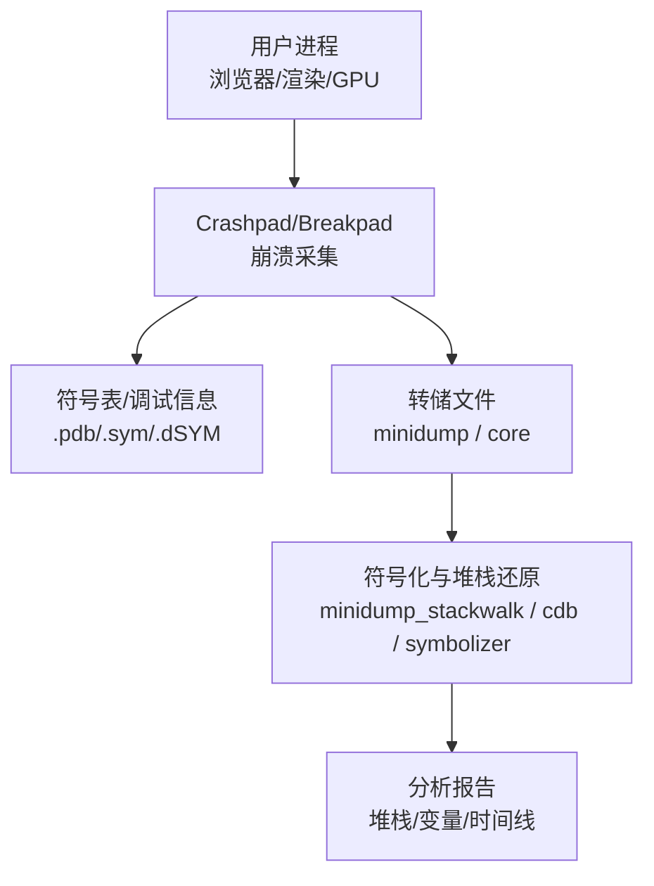
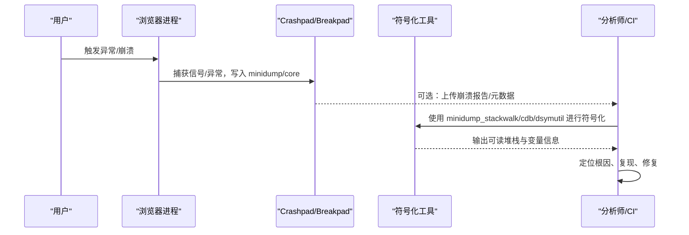

# 崩溃分析

<cite>
**本文引用的文件**
- [DEBUGGING.md](file://infra/DEBUG/DEBUGGING.md)
- [debug_args.gn](file://infra/DEBUG/debug_args.gn)
- [mcloud-2024-ui.patch](file://other/mcloud-2024-ui.patch)
- [shell_main_delegate.cc](file://src/content/shell/app/shell_main_delegate.cc)
- [BUILD.gn (content shell)](file://src/content/shell/BUILD.gn)
- [components_chromium_strings.grd](file://src/components/components_chromium_strings.grd)
- [BUILD.gn (chrome)](file://src/chrome/BUILD.gn)
- [BUILD.gn (root)](file://src/BUILD.gn)
</cite>

## 目录
1. [简介](#简介)
2. [项目结构](#项目结构)
3. [核心组件](#核心组件)
4. [架构总览](#架构总览)
5. [详细组件分析](#详细组件分析)
6. [依赖关系分析](#依赖关系分析)
7. [性能与稳定性考量](#性能与稳定性考量)
8. [故障排查指南](#故障排查指南)
9. [结论](#结论)
10. [附录](#附录)

## 简介
本指南面向 MCloud Browser 的开发者与维护者，提供从“收集崩溃信息”到“本地调试与远程上报”的完整实践。内容涵盖：
- 如何获取堆栈跟踪、内存转储（minidump/core）与崩溃日志
- 如何使用调试器（GDB/rr）、解读堆栈、分析内存转储
- 常见崩溃类型的原因定位与修复建议
- 崩溃报告的最佳实践与提交流程
- 远程崩溃分析与自动化检测的配置方法

## 项目结构
MCloud Browser 基于 Chromium 构建，崩溃相关能力主要分布在以下位置：
- 调试与构建参数：infra/DEBUG/* 下的 GN 参数与脚本
- 崩溃采集与上报：content/shell 与 chrome 构建目标中集成 crashpad/breakpad 工具链
- 调试文档与技巧：infra/DEBUG/DEBUGGING.md
- 自定义调试开关：other/mcloud-2024-ui.patch 引入 MCLOUD_DEBUG 编译期开关，影响断言与日志行为

**图示来源**
- [shell_main_delegate.cc:61-63](file://src/content/shell/app/shell_main_delegate.cc#L61-L63)
- [BUILD.gn (content shell):1075-1122](file://src/content/shell/BUILD.gn#L1075-L1122)
- [BUILD.gn (root):706-725](file://src/BUILD.gn#L706-L725)

**章节来源**
- [DEBUGGING.md:1-603](file://infra/DEBUG/DEBUGGING.md#L1-L603)
- [debug_args.gn:1-87](file://infra/DEBUG/debug_args.gn#L1-L87)
- [mcloud-2024-ui.patch:1-72](file://other/mcloud-2024-ui.patch#L1-L72)

## 核心组件
- 崩溃采集与上报
  - 通过 Crashpad/Breakpad 在进程异常时生成 minidump/core，并支持上传至崩溃服务器或本地保存
  - 在 content shell 与 chrome 构建目标中集成相关工具链与测试数据
- 调试与符号化
  - Linux 使用 GDB、rr、外部符号化器；Windows 使用 cdb/symupload；macOS 使用 dSYM 与相关工具
  - 构建参数启用符号级别、禁用剥离、开启 DWARF/Unwind 等以增强可调试性
- 自定义调试开关
  - 通过 MCLOUD_DEBUG 编译开关控制 DCHECK 致命性与日志输出策略，便于无调试器环境收集必要信息

**章节来源**
- [shell_main_delegate.cc:61-63](file://src/content/shell/app/shell_main_delegate.cc#L61-L63)
- [BUILD.gn (content shell):1075-1122](file://src/content/shell/BUILD.gn#L1075-L1122)
- [BUILD.gn (root):706-725](file://src/BUILD.gn#L706-L725)
- [debug_args.gn:15-27](file://infra/DEBUG/debug_args.gn#L15-L27)
- [mcloud-2024-ui.patch:41-56](file://other/mcloud-2024-ui.patch#L41-L56)

## 架构总览
下图展示了崩溃从发生到被符号化、分析的端到端流程，以及各平台工具链的参与点。

**图示来源**
- [shell_main_delegate.cc:61-63](file://src/content/shell/app/shell_main_delegate.cc#L61-L63)
- [BUILD.gn (content shell):1075-1122](file://src/content/shell/BUILD.gn#L1075-L1122)
- [BUILD.gn (root):706-725](file://src/BUILD.gn#L706-L725)

## 详细组件分析

### 崩溃信息采集（Linux/Windows/macOS）
- Linux
  - 使用 GDB 附加或启动即调试，必要时关闭沙箱或使用 --allow-sandbox-debugging
  - 通过 ulimit 启用 core dump；对冻结场景可发送 SIGABRT 触发 core
  - 使用 rr 录制执行轨迹，支持时间旅行调试
- Windows
  - 使用 cdb/symupload 进行符号化与上传；确保构建包含 .pdb
- macOS
  - 使用 dSYM 与相关工具；确保未剥离符号

**章节来源**
- [DEBUGGING.md:23-166](file://infra/DEBUG/DEBUGGING.md#L23-L166)
- [DEBUGGING.md:351-367](file://infra/DEBUG/DEBUGGING.md#L351-L367)
- [DEBUGGING.md:256-319](file://infra/DEBUG/DEBUGGING.md#L256-L319)
- [BUILD.gn (content shell):1075-1122](file://src/content/shell/BUILD.gn#L1075-L1122)

### 堆栈跟踪解读
- 优先使用符号化后的堆栈（含函数名、源文件、行号）
- 关注异常地址对应的模块与调用链，结合源码上下文定位
- 对于多线程/多进程，确认崩溃发生在 browser/renderer/gpu/utility 等哪个子进程

**章节来源**
- [DEBUGGING.md:6-13](file://infra/DEBUG/DEBUGGING.md#L6-L13)
- [DEBUGGING.md:123-166](file://infra/DEBUG/DEBUGGING.md#L123-L166)

### 内存转储分析
- minidump/core 可用于离线分析，配合符号表还原局部变量与寄存器状态
- 在 Linux 可使用 breakpad 工具链将 minidump 转为 core 以便 gdb 分析
- 在 Windows 使用 cdb 加载 minidump 查看线程、模块、内存布局

**章节来源**
- [DEBUGGING.md:351-367](file://infra/DEBUG/DEBUGGING.md#L351-L367)
- [BUILD.gn (content shell):1075-1122](file://src/content/shell/BUILD.gn#L1075-L1122)

### 崩溃日志与调试开关
- 通过环境变量 MCLOUD_DEBUG 控制更详细的日志输出与断言行为，便于在无调试器环境下收集线索
- 构建参数中设置合适的 symbol_level、禁用剥离、开启 DWARF/Unwind 以提升可调试性

**章节来源**
- [mcloud-2024-ui.patch:41-56](file://other/mcloud-2024-ui.patch#L41-L56)
- [mcloud-2024-ui.patch:99-140](file://other/mcloud-2024-ui.patch#L99-L140)
- [debug_args.gn:15-27](file://infra/DEBUG/debug_args.gn#L15-L27)

### 远程崩溃分析与自动化检测
- 构建目标中包含用于符号上传与测试的数据依赖，便于 CI/CD 自动处理崩溃产物
- 可通过配置将崩溃报告发送至内部服务器，结合自动化流水线进行聚合与分析

**章节来源**
- [BUILD.gn (root):706-725](file://src/BUILD.gn#L706-L725)
- [BUILD.gn (content shell):1075-1122](file://src/content/shell/BUILD.gn#L1075-L1122)

## 依赖关系分析
- 崩溃采集依赖 crashpad/breakpad 工具链与符号表
- 调试依赖 GDB/rr（Linux）、cdb（Windows）、dSYM（macOS）
- 构建参数决定是否启用符号、是否剥离、是否包含 unwind 信息等

**图示来源**
- [debug_args.gn:15-27](file://infra/DEBUG/debug_args.gn#L15-L27)
- [BUILD.gn (content shell):1075-1122](file://src/content/shell/BUILD.gn#L1075-L1122)
- [BUILD.gn (root):706-725](file://src/BUILD.gn#L706-L725)

**章节来源**
- [debug_args.gn:15-27](file://infra/DEBUG/debug_args.gn#L15-L27)
- [BUILD.gn (content shell):1075-1122](file://src/content/shell/BUILD.gn#L1075-L1122)
- [BUILD.gn (root):706-725](file://src/BUILD.gn#L706-L725)

## 性能与稳定性考量
- 生产构建通常禁用详细调试信息以减少体积；开发/测试构建应启用更高 symbol_level 与 unwind 信息
- 谨慎使用 --no-sandbox，仅在临时调试时使用，避免影响安全模型
- 合理配置日志级别与环境变量，避免在生产环境产生过多 I/O 开销

**章节来源**
- [DEBUGGING.md:6-13](file://infra/DEBUG/DEBUGGING.md#L6-L13)
- [debug_args.gn:15-27](file://infra/DEBUG/debug_args.gn#L15-L27)

## 故障排查指南
- 无法附加调试器
  - 检查系统 ptrace 限制（如 Yama），必要时调整内核参数
  - 使用 --allow-sandbox-debugging 允许调试沙箱内进程
- 堆栈不可读
  - 确保构建包含符号（.pdb/.sym/.dSYM），并使用对应符号化工具
  - 在 Linux 使用外部符号化器或 breakpad 工具链
- 崩溃频繁但无有效信息
  - 启用 MCLOUD_DEBUG 环境变量获取更多日志
  - 使用 rr 录制执行轨迹，辅助定位时序问题

**章节来源**
- [DEBUGGING.md:28-41](file://infra/DEBUG/DEBUGGING.md#L28-L41)
- [DEBUGGING.md:146-166](file://infra/DEBUG/DEBUGGING.md#L146-L166)
- [mcloud-2024-ui.patch:99-140](file://other/mcloud-2024-ui.patch#L99-L140)

## 结论
通过合理的构建参数、调试工具与崩溃采集机制，MCloud Browser 能够在开发与生产环境中高效定位与解决崩溃问题。建议：
- 开发/测试构建启用高符号级别与 unwind 信息
- 使用 GDB/rr/cdb 等工具进行本地调试
- 利用 MCLOUD_DEBUG 环境变量增强日志与断言行为
- 建立自动化崩溃上报与分析流水线，提升问题响应速度

## 附录
- 常用命令行参考（Linux）
  - 启动调试：gdb -tui -ex=r --args out/mcloud/mcloud --disable-seccomp-sandbox http://google.com
  - 附加渲染器：--renderer-cmd-prefix='xterm -title renderer -e gdb --args'
  - 启用 core dump：ulimit -c unlimited
  - 触发 core：kill -6 [进程ID]
- 符号化工具
  - Linux：minidump_stackwalk、breakpad 工具链
  - Windows：cdb、symupload
  - macOS：dSYM 与相关工具

**章节来源**
- [DEBUGGING.md:23-87](file://infra/DEBUG/DEBUGGING.md#L23-L87)
- [DEBUGGING.md:351-367](file://infra/DEBUG/DEBUGGING.md#L351-L367)
- [BUILD.gn (content shell):1075-1122](file://src/content/shell/BUILD.gn#L1075-L1122)