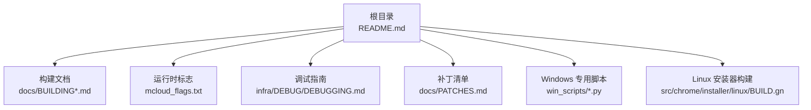
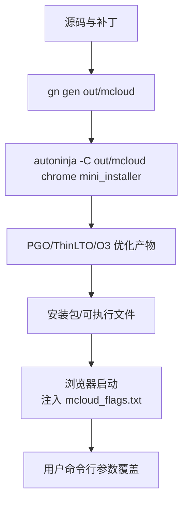
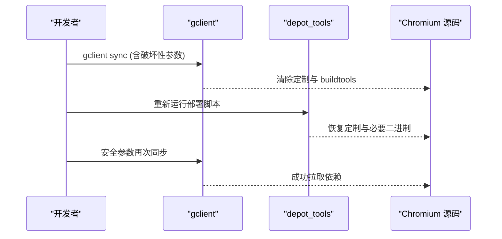

# 常见问题解答

<cite>
**本文引用的文件**
- [README.md](file://README.md)
- [docs/FAQ.md](file://docs/FAQ.md)
- [docs/BUILDING.md](file://docs/BUILDING.md)
- [docs/BUILDING_WIN.md](file://docs/BUILDING_WIN.md)
- [docs/BUILDING_MAC.md](file://docs/BUILDING_MAC.md)
- [docs/ABOUT_GN_ARGS.md](file://docs/ABOUT_GN_ARGS.md)
- [mcloud_flags.txt](file://mcloud_flags.txt)
- [infra/DEBUG/DEBUGGING.md](file://infra/DEBUG/DEBUGGING.md)
- [docs/dev-logs/phase3-dev-log.md](file://docs/dev-logs/phase3-dev-log.md)
- [src/content/common/gpu_pre_sandbox_hook_linux.cc](file://src/content/common/gpu_pre_sandbox_hook_linux.cc)
- [src/chrome/installer/linux/BUILD.gn](file://src/chrome/installer/linux/BUILD.gn)
- [win_scripts/setup.py](file://win_scripts/setup.py)
- [depot_tools/win_toolchain/package_from_installed.py](file://depot_tools/win_toolchain/package_from_installed.py)
</cite>

## 目录
1. [简介](#简介)
2. [项目结构](#项目结构)
3. [核心组件](#核心组件)
4. [架构总览](#架构总览)
5. [详细组件分析](#详细组件分析)
6. [依赖关系分析](#依赖关系分析)
7. [性能注意事项](#性能注意事项)
8. [故障排查指南](#故障排查指南)
9. [结论](#结论)
10. [附录](#附录)

## 简介
本问答文档聚焦 MCloud Browser 用户最常遇到的问题与解决方案，覆盖构建、运行、性能、兼容性等场景，并给出 Windows 与 Linux 平台的特定问题及排障流程。内容兼顾初学者友好与进阶技术细节，帮助快速定位与解决问题。

## 项目结构
MCloud Browser 基于 Chromium M151，提供 AVX2 原生编译、编译器优化与运行时标志注入，当前仅发布 Windows x64 平台。仓库包含多平台构建说明、调试工具、补丁清单与基准测试脚本，便于本地构建与问题复现。

**图示来源**
- [README.md:18-33](file://README.md#L18-L33)
- [docs/BUILDING.md:1-20](file://docs/BUILDING.md#L1-L20)
- [mcloud_flags.txt:1-10](file://mcloud_flags.txt#L1-L10)
- [infra/DEBUG/DEBUGGING.md:1-15](file://infra/DEBUG/DEBUGGING.md#L1-L15)

**章节来源**
- [README.md:18-33](file://README.md#L18-L33)
- [docs/BUILDING.md:1-20](file://docs/BUILDING.md#L1-L20)

## 核心组件
- 运行时标志注入：通过内置加载器在启动时自动注入 mcloud_flags.txt 中的优化开关，用户命令行参数优先级更高。
- 构建系统：GN + Ninja，配合 PGO/ThinLTO/O3 等优化；各平台有独立 args 配置。
- 调试与日志：Linux 提供 GDB/rr/Valgrind 等调试技巧；Windows 提供 VS 调试与 Defender 性能调优建议。
- 安装与打包：Linux 支持 deb/rpm/AppImage；Windows 提供 mini_installer。

**章节来源**
- [README.md:302-333](file://README.md#L302-L333)
- [docs/ABOUT_GN_ARGS.md:161-174](file://docs/ABOUT_GN_ARGS.md#L161-L174)
- [infra/DEBUG/DEBUGGING.md:279-283](file://infra/DEBUG/DEBUGGING.md#L279-L283)

## 架构总览
下图展示从源码到可执行文件的构建与运行关键路径，包括 GN 生成、Ninja 编译、PGO 数据使用、标志注入与最终运行。

**图示来源**
- [docs/BUILDING_WIN.md:209-233](file://docs/BUILDING_WIN.md#L209-L233)
- [README.md:214-264](file://README.md#L214-L264)
- [README.md:302-323](file://README.md#L302-L323)

## 详细组件分析

### 构建类常见问题（Windows）
- 现象：gclient sync 后定制丢失或 gn.exe 缺失导致构建失败。
- 原因：使用了破坏性同步参数清除了 src 内定制与 buildtools/win。
- 解决：
  - 避免使用 --force --reset --delete_unversioned_trees；改用安全参数组合。
  - 重新运行部署脚本恢复定制；按 DEPS 固定版本恢复 gn.exe。
  - 确保代理可用以访问 cipd/GCS。

**图示来源**
- [docs/dev-logs/phase3-dev-log.md:40-52](file://docs/dev-logs/phase3-dev-log.md#L40-L52)
- [docs/BUILDING_WIN.md:175-200](file://docs/BUILDING_WIN.md#L175-L200)

**章节来源**
- [docs/dev-logs/phase3-dev-log.md:40-52](file://docs/dev-logs/phase3-dev-log.md#L40-L52)
- [docs/BUILDING_WIN.md:175-200](file://docs/BUILDING_WIN.md#L175-L200)

### 构建类常见问题（Linux）
- 现象：缺少依赖导致 fetch 或 runhooks 失败；不同发行版依赖差异大。
- 原因：未安装对应开发库或未正确设置 PATH/Python。
- 解决：
  - 使用 install-build-deps.sh 安装依赖；Arch/Fedora/Crostini 参考各自命令。
  - 将 depot_tools 加入 PATH，并确保 Python 指向 3.8+。
  - 按需启用 ccache 提升二次构建速度。

**章节来源**
- [docs/BUILDING.md:25-120](file://docs/BUILDING.md#L25-L120)
- [docs/BUILDING.md:162-190](file://docs/BUILDING.md#L162-L190)
- [docs/BUILDING.md:287-335](file://docs/BUILDING.md#L287-L335)

### 运行时错误（Windows）
- 现象：首次运行提示兼容性问题或安装失败。
- 原因：AppCompat 层未设置或旧实例未关闭。
- 解决：
  - 使用兼容模式脚本设置 AppCompatFlags。
  - 安装前确保无残留进程；必要时重启资源管理器。

**章节来源**
- [infra/thor_compat_mode.bat:1-11](file://infra/thor_compat_mode.bat#L1-L11)
- [docs/PATCHES.md:253-257](file://docs/PATCHES.md#L253-L257)

### 运行时错误（Linux）
- 现象：GPU/Vulkan 相关初始化失败或渲染异常。
- 原因：沙箱预加载 GPU/Vulkan 库失败或驱动不匹配。
- 解决：
  - 检查 Vulkan/OpenGL 库是否可用；更新显卡驱动。
  - 使用调试标志禁用沙箱临时验证问题；查看日志定位具体库加载失败。

**章节来源**
- [src/content/common/gpu_pre_sandbox_hook_linux.cc:579-619](file://src/content/common/gpu_pre_sandbox_hook_linux.cc#L579-L619)
- [infra/DEBUG/DEBUGGING.md:8-15](file://infra/DEBUG/DEBUGGING.md#L8-L15)

### 性能问题（通用）
- 现象：页面卡顿、启动慢、内存占用高。
- 原因：V8 编译阈值过高、标签页未冻结、预载策略不当。
- 解决：
  - 使用内置标志降低 Maglev/TurboFan 阈值，启用 OSR 与 Sparkplug。
  - 启用标签页冻结与内存回收策略。
  - 谨慎开启预载功能，结合基准验证收益与内存代价。

**章节来源**
- [mcloud_flags.txt:54-82](file://mcloud_flags.txt#L54-L82)
- [README.md:89-133](file://README.md#L89-L133)

### 兼容性问题（Widevine/DRM）
- 现象：Netflix/Spotify 等无法播放或分辨率受限。
- 原因：Widevine 安全级别限制（L3/L2/L1），非 VMP 签名影响站点判定。
- 解决：
  - Linux 通常可播放但分辨率受限；Windows/macOS 受站点策略影响较大。
  - 了解 Widevine 机制与限制，合理预期播放质量。

**章节来源**
- [docs/FAQ.md:12-32](file://docs/FAQ.md#L12-L32)

### 构建参数与优化（GN 与 PGO）
- 现象：PGO 不生效或构建时间过长。
- 原因：未配置 pgo_data_path 或 profile 版本不匹配。
- 解决：
  - 下载匹配的 profdata 并写入 args.gn；Debug 构建默认禁用 PGO。
  - 使用薄 LTO 与 O3 提升性能；注意符号级别对调试的影响。

**章节来源**
- [docs/ABOUT_GN_ARGS.md:161-174](file://docs/ABOUT_GN_ARGS.md#L161-L174)
- [docs/BUILDING_WIN.md:189-224](file://docs/BUILDING_WIN.md#L189-L224)

### 安装与打包（Linux）
- 现象：deb/rpm 包依赖缺失或校验失败。
- 原因：依赖计算脚本未正确合并或 distro 版本检查失败。
- 解决：
  - 使用构建脚本集成打包目标；检查依赖合并输出。
  - 如需跳过发行版检查，调整相应构建参数。

**章节来源**
- [src/chrome/installer/linux/BUILD.gn:116-156](file://src/chrome/installer/linux/BUILD.gn#L116-L156)
- [docs/BUILDING.md:223-233](file://docs/BUILDING.md#L223-L233)

### Windows 构建环境（VS/SDK）
- 现象：找不到 Visual Studio 或 SDK 版本不匹配。
- 原因：未安装指定版本的 Windows SDK 或环境变量未设置。
- 解决：
  - 安装 VS2022 与指定版本 SDK；设置 DEPOT_TOOLS_WIN_TOOLCHAIN=0。
  - 确保 Python 路径优先于系统其他 Python。

**章节来源**
- [docs/BUILDING_WIN.md:17-49](file://docs/BUILDING_WIN.md#L17-L49)
- [docs/BUILDING_WIN.md:63-114](file://docs/BUILDING_WIN.md#L63-L114)

### macOS 构建（可选参考）
- 现象：Xcode 许可未接受或 SDK 版本不符。
- 原因：未运行 xcodebuild -license 或未安装匹配 SDK。
- 解决：
  - 接受 Xcode 许可；安装最新 SDK；使用 mac_args.gn 配置构建。

**章节来源**
- [docs/BUILDING_MAC.md:5-33](file://docs/BUILDING_MAC.md#L5-L33)
- [docs/BUILDING_MAC.md:115-139](file://docs/BUILDING_MAC.md#L115-L139)

## 依赖关系分析
- 构建依赖：depot_tools、Visual Studio/SDK（Windows）、Xcode/SDK（macOS）、系统库（Linux）。
- 运行时依赖：GPU 驱动、Vulkan/OpenGL、音频/视频解码库。
- 打包依赖：Linux 发行版包管理器；Windows 安装器工具链。

**图示来源**
- [docs/BUILDING_WIN.md:51-114](file://docs/BUILDING_WIN.md#L51-L114)
- [docs/BUILDING.md:25-120](file://docs/BUILDING.md#L25-L120)

**章节来源**
- [docs/BUILDING_WIN.md:51-114](file://docs/BUILDING_WIN.md#L51-L114)
- [docs/BUILDING.md:25-120](file://docs/BUILDING.md#L25-L120)

## 性能注意事项
- 启动优化：启用早期 GPU 通道、延迟创建 RFH、精简初始 WebUI。
- V8 优化：降低 JIT 阈值，启用 OSR 与 Sparkplug。
- 内存管理：标签页冻结、内存压力回收、碎片整理。
- 网络优化：异步 DNS、TLS 0-RTT、预连接与预取。
- 媒体优化：专用媒体线程、硬件解码、零拷贝捕获。

**章节来源**
- [mcloud_flags.txt:8-106](file://mcloud_flags.txt#L8-L106)
- [README.md:73-176](file://README.md#L73-L176)

## 故障排查指南
- 构建失败：
  - 检查依赖与工具链版本；清理并重新生成构建文件。
  - 使用安全同步参数；恢复定制与必要二进制。
- 运行崩溃：
  - 使用调试器附加子进程；启用日志与 IPC 调试。
  - 临时禁用沙箱验证问题；收集 core/minidump。
- 性能退化：
  - 对比基准报告；逐项验证标志有效性。
  - 调整预载与缓存策略，关注内存代价。
- 兼容性问题：
  - 更新驱动与系统组件；检查 Widevine 安全级别。
  - 在不同窗口管理器/桌面环境下复现问题。

**章节来源**
- [infra/DEBUG/DEBUGGING.md:23-87](file://infra/DEBUG/DEBUGGING.md#L23-L87)
- [infra/DEBUG/DEBUGGING.md:351-367](file://infra/DEBUG/DEBUGGING.md#L351-L367)
- [infra/DEBUG/DEBUGGING.md:463-487](file://infra/DEBUG/DEBUGGING.md#L463-L487)

## 结论
MCloud Browser 提供了完善的构建、调试与性能优化能力。大多数问题可通过规范化的构建流程、合理的标志配置与系统环境检查得到解决。遇到问题时，建议先查阅对应平台的构建文档与调试指南，再结合基准报告进行针对性调优。

## 附录
- 常用命令速查：
  - 同步与部署：trunk.sh → version.sh → setup.sh
  - 生成与构建：gn args → autoninja chrome mini_installer
  - 运行与调试：添加 --no-sandbox、--enable-logging=stderr、--log-level=0
- 参考链接：
  - 构建说明：docs/BUILDING*.md
  - 调试指南：infra/DEBUG/DEBUGGING.md
  - 标志清单：mcloud_flags.txt